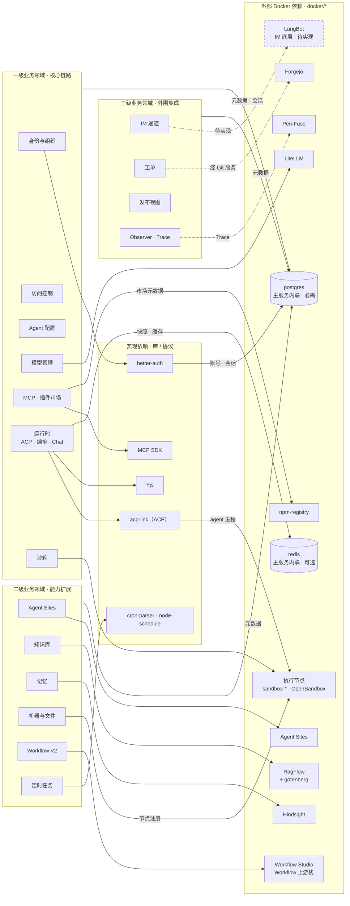

# 架构拓扑总览

```mermaid
flowchart LR
    subgraph T1["一级业务领域 · 核心链路"]
        IDENTITY["身份与组织"]
        ACL["访问控制"]
        AGENTCFG["Agent 配置"]
        MODEL["模型管理"]
        MCP["MCP · 插件市场"]
        RUNTIME["运行时<br/>ACP · 编排 · Chat"]
        SANDBOX["沙箱"]
    end

    subgraph T2["二级业务领域 · 能力扩展"]
        SITES_APP["Agent Sites"]
        KNOWLEDGE["知识库"]
        MEMORY["记忆"]
        MACHINE["机器与文件"]
        WF2["Workflow V2"]
        TASK["定时任务"]
    end

    subgraph T3["三级业务领域 · 外围集成"]
        CHANNEL["IM 通道"]
        TICKETS["工单"]
        PRODVIEW["发布视图"]
        OBS["Observer · Trace"]
    end

    subgraph IMPL["实现依赖 · 库 / 协议"]
        BETTER_AUTH["better-auth"]
        MCP_SDK["MCP SDK"]
        ACP["acp-link（ACP）"]
        YJS["Yjs"]
        CRON["cron-parser · node-schedule"]
    end

    subgraph DOCKER["外部 Docker 依赖 · docker/*"]
        POSTGRES[("postgres<br/>主服务内联 · 必需")]
        REDIS[("redis<br/>主服务内联 · 可选")]
        RAGFLOW["RagFlow<br/>+ gotenberg"]
        LITELLM["LiteLLM"]
        HINDSIGHT["Hindsight"]
        NPM["npm-registry"]
        SITES["Agent Sites"]
        FORGEJO["Forgejo"]
        WFSTACK["Workflow Studio<br/>Workflow 上游栈"]
        NODE["执行节点<br/>sandbox-* · OpenSandbox"]
        PERI["Peri-Fuse"]
        LANGBOT["LangBot<br/>IM 底层 · 待实现"]
    end

    T1 -->|元数据 · 会话| POSTGRES
    T2 -->|元数据| POSTGRES
    T3 -->|元数据| POSTGRES

    IDENTITY --> BETTER_AUTH
    MCP --> MCP_SDK
    RUNTIME --> ACP
    RUNTIME --> YJS
    TASK --> CRON

    BETTER_AUTH -->|账号 · 会话| POSTGRES
    RUNTIME -->|快照 · 缓存| REDIS
    ACP -->|agent 进程| NODE

    MCP -->|市场元数据| NPM
    SITES_APP --> SITES
    MODEL --> LITELLM
    KNOWLEDGE --> RAGFLOW
    MEMORY --> HINDSIGHT
    TICKETS -.->|经 Git 服务| FORGEJO
    WF2 --> WFSTACK
    SANDBOX --> NODE
    MACHINE -->|节点注册| NODE
    OBS -.->|Trace| PERI
    CHANNEL -.->|待实现| LANGBOT

    classDef planned stroke-dasharray: 5 5
    class LANGBOT planned
```
