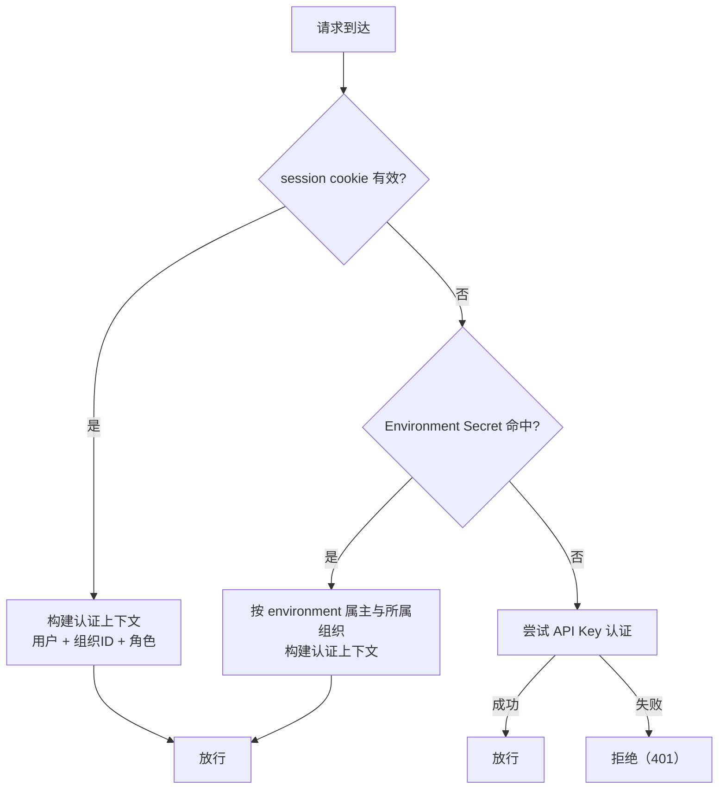

# 认证系统

## 概述

认证系统是 FenixAgent 的信任边界——所有请求在抵达业务逻辑之前，必须通过认证系统确立调用者身份。

FenixAgent 面向三种客户端场景提供服务，每种的安全约束和认证目标不同：

| 客户端类型 | 运行环境 | 认证机制 | 凭证载体 | 认证目标 |
|-----------|---------|---------|---------|---------|
| 前端控制台 | 浏览器 | Session 认证 | Cookie | 建立用户身份 + 组织上下文 |
| Agent 进程 / 外部 API | 服务端 / CLI | API Key | HTTP Header 或 URL Query | 建立用户身份 + 组织上下文 |
| Machine（远端） | 服务端 | REGISTRY_SECRET | WebSocket URL Query | 验证机器接入合法性（不建立用户上下文） |

**核心设计决策**：前两类认证完成后统一收敛为**认证上下文**（含组织 ID、用户 ID、角色），下游路由只需判断"此请求是否有权执行该操作"，无需关心"此请求以何种方式认证"。Machine 注册认证独立运作，仅验证机器身份，后续 relay 连接仍走前两种用户级认证。

## 认证组件

认证系统基于 [better-auth](https://www.better-auth.com) 构建，复用其 Session、Organization、API Key 等标准插件能力，在此之上封装多通道认证调度和组织上下文解析。

实现归属：本条链路的唯一 owner 是 `packages/platform/identity`（better-auth 实例、可信来源推导、API Key 组织恢复、组织上下文解析、身份表 schema）。`apps/server` 只保留薄认证 adapter 与守卫实例，`/web/*` 路由以工厂形式接收该守卫；其它模块需要身份数据时经 `@fenix/platform-sdk` 的 `IdentityDirectory` 窄契约，不得导入 identity 的内部路径。

### 1. Session 认证

标准的用户名密码认证。

关键设计点：
- Session 自动续期机制
- 密码传输加密：认证中间件在路由层透明解密
- 信任源动态构建：从多个来源（本地开发地址、部署地址、自定义配置）聚合为信任源列表，支持运行时动态扩展

### 2. API Key 认证

better-auth 的 API Key 插件提供标准的密钥认证：创建时绑定组织上下文，SHA-256 哈希存储，创建时返回明文（仅一次）。

### 3. 机器注册认证

Machine 通过 WebSocket 连接到 `/acp/ws` 和 `/acp/file-ws` 时，使用 `REGISTRY_SECRET` 作为共享密钥进行认证：

```
Machine → ws://<host>/acp/ws?secret=<REGISTRY_SECRET>
服务端  → secret === process.env.REGISTRY_SECRET ? 放行 : 4003
```

这是一个**全局共享密钥**，不绑定用户或组织。它的职责仅限于验证机器接入合法性——认证通过后建立 WS 通道，后续 relay 连接仍走 Session / API Key 用户级认证。

### 4. RCS_API_KEYS 全局密钥

服务端内部凭证，用逗号分隔多个密钥，当前唯一用途是为 Machine 签发 skill 下载令牌：

- **Skill 下载令牌**：Machine 启动后从服务端下载 skill 内容时，服务端从 `RCS_API_KEYS` 中选取第一个密钥，对 payload 做 HMAC-SHA256 签名，生成 `{base64url(payload)}.{base64url(signature)}` 格式的一次性下载令牌

与 API Key（`rcs_xxx`）不同，`RCS_API_KEYS` 不绑定用户或组织，属于服务端基础设施层面的信任凭证。它不是给外部客户端使用的认证入口，而是内部服务间通信的信任锚点。


## 认证调度器

这是认证的核心调度器。路由通过声明式机制选择认证方式，无需在 handler 内手写认证逻辑。

### 两种认证方式

| 认证方式 | 凭证来源 | 适用场景 |
|-------|------|----------|
| Session 认证 | session cookie | 控制面板 API |
| API Key 认证 | HTTP Header 或 URL query token | Agent 侧通信、OpenAPI |

### 多凭证支持

用户级认证路由实际上**按固定顺序尝试三种凭证**，任一命中即停止（顺序与判定是契约的一部分，
唯一实现在 `packages/platform/identity/src/services/request-authentication.ts`）：

1. 先检查 better-auth session cookie
2. 无 session 时尝试 **Environment Secret**——命中后以 environment 属主为审计主体，组织上下文取
   该 environment 绑定的组织（个人 environment 回落为属主）
3. 仍未命中时尝试 better-auth API Key——从 key metadata 恢复组织，并二次校验成员关系仍然有效，
   校验异常保守拒绝


```mermaid
flowchart TD
    REQ["请求到达"] --> COOKIE{"session cookie 有效?"}
    COOKIE -->|是| CTX["构建认证上下文<br/>用户 + 组织ID + 角色"]
    CTX --> PASS["放行"]
    COOKIE -->|否| ENVSECRET{"Environment Secret 命中?"}
    ENVSECRET -->|是| CTX2["按 environment 属主与所属组织<br/>构建认证上下文"]
    CTX2 --> PASS
    ENVSECRET -->|否| APIKEY["尝试 API Key 认证"]
    APIKEY -->|成功| PASS2["放行"]
    APIKEY -->|失败| NULL["拒绝（401）"]
```

**设计意图**：同一套 `/web/*` 和 `/api/*` 路由同时支持浏览器（cookie）、Agent 进程
（Environment Secret）与 CLI 工具（API Key）三类客户端，无需维护多套认证入口。

### 组织上下文解析

认证完成后，认证上下文被注入到请求上下文，下游直接使用。上下文包含当前活跃组织 ID、用户 ID 和组织内角色。

**组织上下文解析流程**：
1. 从请求中提取活跃组织 ID（优先级：HTTP header → query param → cookie）
2. 查询用户在该组织中的成员信息和角色
3. 若未指定活跃组织，回退到用户的第一个组织
4. 结果缓存

在 API Key 认证路径中，从 API Key 的元数据中恢复组织信息，并通过二次校验确认成员关系仍然有效。


