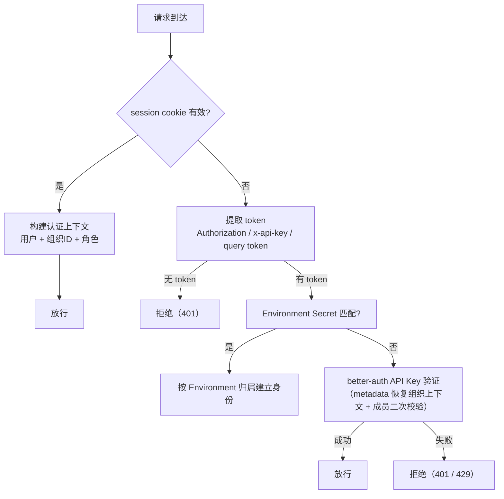

# 权限与资源

> 定位：认证、组织边界与资源权限的**权威文档**（2026-08-12 由原 `03-auth.md` 与 `14-user-org.md` 合并整理）。
> 状态：认证、组织与访问控制为**实现基线**（与 `src/plugins/auth.ts`、`src/services/org-context.ts` 一致）；资源权限的目标设计以 [Agent 资源系统重设计](../design/2026-08-11-agent-resource-system-redesign.md) 为准（未实现）。
> 约定：描述与代码一致的真实架构；关键实现文件以相对路径引用。Agent 配置资源的具体模型见 [04-agent-config](./04-agent-config.md) 与 [06-config](./06-config.md)，资源版本语义见 [07-versioning](./07-versioning.md)。

## 1. 信任边界与认证目标

认证系统是 FenixAgent 的信任边界——所有请求在抵达业务逻辑之前，必须确立调用者身份。FenixAgent 面向三种客户端场景，每种的安全约束和认证目标不同：

| 客户端类型 | 运行环境 | 认证机制 | 凭证载体 | 认证目标 |
|-----------|---------|---------|---------|---------|
| 前端控制台 | 浏览器 | Session 认证 | Cookie | 建立用户身份 + 组织上下文 |
| Agent 进程 / 外部 API | 服务端 / CLI | Environment Secret / API Key | HTTP Header 或 URL Query | 建立用户身份 + 组织上下文 |
| Machine（远端） | 服务端 | `REGISTRY_SECRET` | WebSocket URL Query | 仅验证机器接入合法性（不建立用户上下文） |

**核心设计决策**：用户级认证完成后统一收敛为**认证上下文**（`AuthContext`：组织 ID、用户 ID、组织内角色，见 `src/plugins/auth.ts`），下游路由只需判断"此请求是否有权执行该操作"，无需关心"此请求以何种方式认证"。Machine 注册认证独立运作，仅验证机器身份，后续 relay 连接仍走用户级认证。

## 2. 认证

认证基于 [better-auth](https://www.better-auth.com) 构建，复用其 Session、Organization、API Key 插件，在此之上封装多通道认证调度和组织上下文解析。

### 2.1 认证方式

| 方式 | 凭证来源 | 身份建立方式 | 适用场景 |
|------|---------|-------------|----------|
| Session 认证 | session cookie | better-auth session 自动续期 | 控制台 API |
| Environment Secret | HTTP Header / URL query token | `environmentRepo.getBySecret` 命中后按 `envRecord.userId` 定位用户，注入 `authEnvironmentId` | Agent 进程（Environment 维度） |
| API Key 认证 | HTTP Header / URL query token | better-auth `verifyApiKey`，从 key metadata 恢复组织上下文 | Agent 侧通信、OpenAPI |
| 机器注册认证 | WebSocket URL query `secret` | 与 `REGISTRY_SECRET` 常量比较 | Machine 接入 `/acp/ws`、`/acp/file-ws` |

**Environment Secret**：`src/plugins/auth.ts` 的 `tryApiKeyAuth` 先尝试 Environment Secret——命中时以 Environment 的归属用户建立身份，组织上下文由 `envRecord.organizationId`（不存在时回退 `userId`）恢复，角色按是否属于独立组织推导为 `member` / `owner`。

**API Key 上下文恢复**：better-auth API Key 字符串本身不携带组织信息，必须依赖 key 记录中的 metadata 恢复 `organizationId` / `role`（`referenceId` 为创建 key 的用户 ID），并**二次校验成员关系仍然有效**；校验异常时保守拒绝。创建时绑定组织上下文，SHA-256 哈希存储，明文仅创建时返回一次。

**机器注册认证**：`REGISTRY_SECRET` 是全局共享密钥，不绑定用户或组织，职责仅限验证机器接入合法性；认证通过后建立的 relay 连接仍走 Session / API Key 用户级认证。

### 2.2 认证调度器

路由通过声明式机制选择认证方式（如 `sessionAuth: true`），无需在 handler 内手写认证逻辑。`sessionAuth: true` 路由实际接受两种凭证，按序尝试：

**设计意图**：同一套 `/web/*` 和 `/api/*` 路由同时支持浏览器（cookie）、Agent 进程（Environment Secret）和 CLI 工具（API Key）三类客户端，无需维护多套认证入口。API Key 触发限流时返回 429，不得降级为 401 掩盖限流事实。

### 2.3 组织上下文解析

认证完成后，认证上下文注入请求上下文（`requestAls`），下游直接使用。解析逻辑见 `src/services/org-context.ts`：

1. 从请求提取活跃组织 ID，优先级：`x-active-org-id` header → `activeOrganizationId` query → `active_org_id` cookie；
2. 通过 better-auth `listMembers` 校验用户是目标组织成员并取得角色（owner / admin / member）；
3. 指定了活跃组织但不是成员 → 记录 warn 并回退到第一个组织；
4. 未指定活跃组织 → 回退到用户第一个组织；
5. 结果按用户 ID 缓存（60 秒，`org-context` cache）；请求携带的 activeOrgId 与缓存不一致时重新解析。

组织信息（organizationId / organizationName）同步写入日志上下文（ALS），便于审计与排障；测试通过 `setTestOrgContext()` 注入上下文，测试结束必须 reset。

### 2.4 服务端内部凭证

与用户级认证正交的服务端信任凭证，不绑定用户或组织：

| 变量 | 用途 | 约束 |
|------|------|------|
| `RCS_SYSTEM_API_KEYS` | 系统 API 认证（逗号分隔多密钥） | 独立于普通请求认证规则 |
| `RCS_API_KEYS` | 为 Machine 签发 skill 下载令牌：取第一个密钥对 payload 做 HMAC-SHA256，生成 `{base64url(payload)}.{base64url(signature)}` 一次性令牌 | 不混作普通请求认证；不是外部客户端认证入口 |

## 3. 用户与组织

FenixAgent 实现**多租户组织隔离**模型。所有业务资源归属组织，组织内按角色分级授权。

### 3.1 用户模型

用户通过注册端点创建账号，注册时自动创建以用户名命名的个人组织并设为 owner。此后可创建额外组织、通过邀请扩展成员。一个用户必须属于至少一个组织，可同时属于多个组织，每个组织内角色独立。

### 3.2 组织模型与角色

| 角色 | 权限边界 |
|------|---------|
| owner | 编辑组织信息、管理成员、修改角色、删除组织 |
| admin | 编辑组织信息、管理成员（不能修改 owner） |
| member | 查看成员列表和资源，创建/修改自己的资源 |

**当前组织确认**：见 §2.3（header → query → cookie → 第一个组织）。前端在组织切换时写入 cookie、请求拦截器自动注入 header，切换操作乐观更新本地状态后调用服务端确认，失败回滚。

### 3.3 隔离机制

所有业务资源按三层隔离，权限拒绝统一返回 403：

| 层级 | 机制 | 说明 |
|------|------|------|
| 路由栅栏 | 组织隔离屏障 | 校验用户是否属于资源所属组织，不匹配拒绝 |
| 查询注入 | 强制组织过滤 | 数据查询自动带组织 ID 条件 |
| 用户隔离 | 资源级过滤 | 敏感资源（如 environment）在组织基础上再加用户过滤 |

### 3.4 资源归属与可见性

资源记录同时保存所属组织与创建者。修改和删除校验所有权：owner 可操作组织内任意资源，member 仅能操作自己创建的资源。

| 资源归属 | 访问者 | 可见 | 可修改 |
|---------|--------|------|--------|
| 本组织 | 本组织 owner | ✅ | ✅ |
| 本组织 | 本组织 member | ✅ | 仅自己创建的资源 |
| 本组织（已公开） | 其他组织任意角色 | ✅ | ❌ |
| 其他组织（未公开） | 当前组织 | ❌ | ❌ |

### 3.5 跨组织资源分享

部分配置类资源支持设为全系统公开可读，任何组织都可引用，公开后不允许其他组织修改。当前支持 provider / skill / mcp_server / agent_config 四种类型，仅 read 操作。

跨组织引用保存目标的**真实作用域**（`resource_id + 版本`，不复制成本组织资源），并在保存时与运行时两次校验引用权限——公开资源被撤权后不得继续启动。资源版本语义见 [07-versioning](./07-versioning.md)，各配置资源的具体引用规则见 [06-config](./06-config.md)。

## 4. Agent 运行时权限

Agent 执行期间的权限分两个阶段：**配置期**的权限规则（AgentConfig 中声明的 ask/allow/deny 规则）与**运行期**的权限请求/响应（Agent 发起敏感操作时的审批流）。

### 4.1 权限规则配置（现状：预留）

权限动作枚举已定义：`PermissionAction = "ask" | "allow" | "deny"`（`src/services/config/types.ts`，开关型工具只支持三态字符串；规则型工具支持全局三态或 glob pattern 映射）。但 AgentConfig 的 `permission` 字段在 schema 中仍为 `z.unknown().nullable()`（"ask/allow/deny 规则（预留）"），规则模型尚未实现。目标设计（`RuntimeConfig.Permission` 新模型）见 [Agent 资源系统重设计](../design/2026-08-11-agent-resource-system-redesign.md)「暂不设计」清单。

### 4.2 运行时权限请求与响应（已实现）

运行期权限审批是 Chat 链路的一部分，权威实现在 [19-yjs-chat-streaming](./19-yjs-chat-streaming.md)（§5.3 投影、§8.1 Turn 状态机）与 `packages/chat-channel/src/state/permission.ts`：

- **数据源**：`pendingPermissions` 位于 Session Doc（`PermissionProjection`：permissionId、turnId、选项、状态、过期时间、decision），前端权限弹窗直接消费该投影；
- **CAS 解析**：每个请求状态机为 `pending → resolved(approved/denied)`（或超时/会话切换/断链时的终态迁移 `expired` / `cleared`），解析是原子迁移——重复的 `permission_response`（相同 `permissionId`）只有第一次生效，后续返回原结果；
- **与 ACP 衔接**：CAS 迁移成功后才向 Agent 发送 `permission.resolve`；重复响应不重发；
- **与 Turn 关联**：权限请求关联 `activeTurn`，turn 处于 `awaiting_permission` 时有效，turn 进入终态后请求随之失效清理；默认 5 分钟过期；
- **安全边界**：敏感策略与工具参数不进入公开视图（Y.Doc 只存展示所需字段）；错误响应只含脱敏 `PublicError`；`organizationId`、完整授权规则、密钥、内部错误、原始凭证和机器连接信息一律不得进入 Y.Doc。

## 5. 目标设计（未实现）

以下设计已确认但未实施，相关素材见引用文档；实施前不得在代码中提前引入未声明的资源关系：

- **资源系统重设计**：资源类型按 DAG 依赖组织（禁止反向/自引用/未声明的跨层引用），MAX/整数版本语义、锁定与运行时快照解析见 [Agent 资源系统重设计](../design/2026-08-11-agent-resource-system-redesign.md) 与 [07-versioning](./07-versioning.md)；
- **Team 取代 User 成为资源所有者**：User 退化为 Team 成员，资源归属从 user 维度迁移到 team 维度（见 `docs/arch/changes.md` 改动 11，含 API Key 在内的资源表 `userId → teamId`）；
- **RuntimeConfig.Permission 新模型**：随资源系统重设计一并评估，当前不设计。

## 6. 已知缺口

| 能力 | 现状 |
|------|------|
| API Key 作用域限制 | 无，一个 Key 可访问用户的所有资源 |
| Workspace 用户间隔离 | 仅系统目录黑名单，无用户间目录隔离 |
| 操作审计日志 | 无 |
| 管理员跨组织视图 | 未实施 |
| 资源级权限（如谁能访问某个 Agent） | 配置资源已支持公开只读引用，运行实例级别暂未支持 |
| 权限规则配置（ask/allow/deny） | 枚举已定义，规则模型预留未实现（§4.1） |
