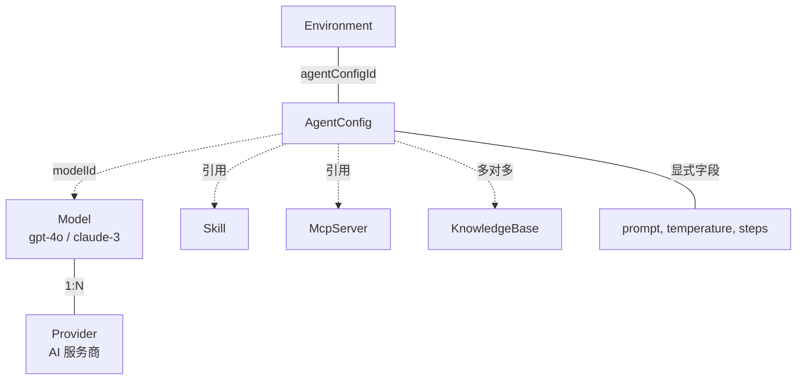

# Agent Config

> 涉及模块：AgentConfig 配置服务、启动规格构建器、Instance 服务、资源权限表

## 概述

Agent Config 是 Agent 的"出厂设置"——定义了一个 Agent **是什么**以及**能做什么**。每个 Agent Config 属于一个组织，可被该组织内的多个 Environment 复用。

当用户"启动 Agent"时，系统根据 Agent Config 的内容构建启动规格，传递给运行时引擎初始化 Agent 进程。

## 配置组成

Agent Config 是所有配置的汇聚点，通过引用来关联 Provider（含 Model）、Skill、KnowledgeBase、McpServer：



一个 Agent Config 由以下部分构成：

| 组件 | 说明 | 示例 |
|------|------|------|
| 系统提示词 | Agent 的行为准则和能力边界 | "你是一个 Python 编程助手…" |
| 模型配置 | 默认使用的 AI 模型 | gpt-4o、claude-sonnet-4-20250514 |
| 权限规则 | 工具访问控制（allow/ask/deny） | 允许读文件、询问是否执行命令 |
| Skill 绑定 | 挂载的技能模块 | 代码审查 skill、文档生成 skill |
| MCP Server 绑定 | 挂载的外部工具服务 | 数据库查询 MCP、文件系统 MCP |
| 知识库绑定 | 挂载的知识库 | 内部文档库、API 手册 |
| 引擎类型 | 使用的 Agent 运行时 | opencode / claude-code |

## 与 Environment 和 Instance 的关系

```
Agent Config ──(bind)──→ Environment ──(spawn)──→ Instance
```

- **Agent Config** 定义 Agent 的能力规格
- **Environment** 绑定一个 Agent Config，并提供运行所需的资源上下文（workspace、secret）
- **Instance** 是 Agent Config + Environment 结合后的运行时进程

一个 Agent Config 可以被多个 Environment 绑定，实现"一套配置、多处运行"。Environment 不强制绑定 Agent Config——meta-agent 场景下 Environment 可以不绑定任何配置，由系统自行构建启动规格。

## 启动时的配置加载

spawn instance 时，系统按以下顺序组装启动规格：

1. 从 Environment 获取绑定的 Agent Config
2. 加载 Agent Config 的模型、权限、Skill 绑定
3. 加载 Agent Config 的 MCP Server 和知识库绑定
4. 注入平台级环境变量（如知识库 MCP 的认证 token）
5. 合并为最终启动规格，传递给运行时引擎

所有引用的配置资源（model、provider、skill、mcp_server）均支持跨组织共享——如果 Agent Config 引用了其他组织公开的资源，启动时自动解析并包含。

## 跨组织共享

Agent Config 本身可作为配置资源设为全系统公开可读，其他组织可以引用该配置启动自己的 Agent（不可修改原配置）。

## 和其他模块的关系

- → 模型配置服务（默认模型引用）
- → Skill 配置服务（Skill 绑定解析）
- → MCP Server 配置服务（工具服务绑定）
- → 知识库绑定服务（知识库挂载）
- → 启动规格构建器（spawn 时组装完整配置）
- → 资源权限表（跨组织共享控制）
