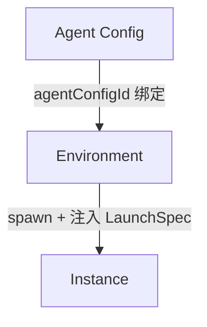
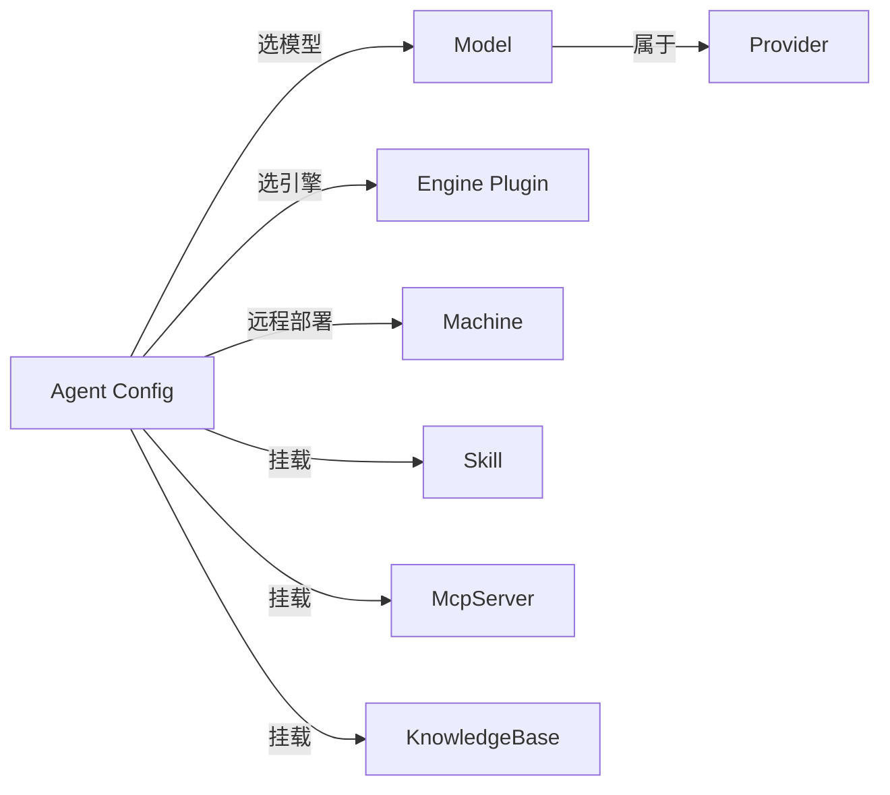

# Agent Config

> 涉及模块：AgentConfig 配置服务、启动规格构建器、Instance 服务

## 概述

Agent Config 是 Agent 的**配置蓝图**——定义了一个 Agent 是什么以及能做什么。它本身不是运行实例，而是 Environment 创建 Instance 时的**规格说明书**。

每个 Agent Config 属于一个组织，可被该组织内的多个 Environment 复用。一套 Agent Config 绑定到不同 Environment 即可产生行为一致的 Agent 实例。

## 资源引用

Agent Config 是一个**引用节点**——它不拥有任何资源，只是把分散在系统各处的配置资源串联起来。spawn 时系统沿着这些引用逐级解析，组装成 `AgentLaunchSpec`，交给 `@fenix/core` 分派到对应的 engine plugin。

Agent Config 引用什么，Agent 实例就拥有什么。六类引用决定了 Agent 的六个能力维度：

- **Model** — 用哪个 AI 模型。spawn 时从 model → provider 逐级解析出完整配置（apiKey / baseUrl / protocol）
- **Engine** — 用什么运行时。opencode 走 spawn 子进程，claude-code 走 SDK 内联
- **Machine** — 跑在哪里。不填走本地 @fenix/core，填写则向远端 Machine 下发 spawn 指令
- **Skill** — 有哪些技能。文件系统源目录打包为 ZIP，生成签名下载 URL
- **McpServer** — 有哪些外部工具。校验后注入配置，禁用/缺失直接拒绝启动
- **KnowledgeBase** — 连接哪些知识库。装配 `kb` MCP 端点（streamable-http + Bearer token）

**约束**：更新 AgentConfig 时，Skill / McpServer / KnowledgeBase 的绑定**全量覆盖**——新集合替换旧集合，不留残留。

**跨组织**：引用的资源可来自其他组织。Agent Config 自身也可标为公开供其他组织使用——可引用启动，不可修改。

## 上下级关系

- **← Environment**：通过 agentConfigId 绑定，一套配置可被多个 Environment 复用
- **→ LaunchSpec Builder**：spawn 时消费全部引用关系，产出 `AgentLaunchSpec` 注入 engine plugin
