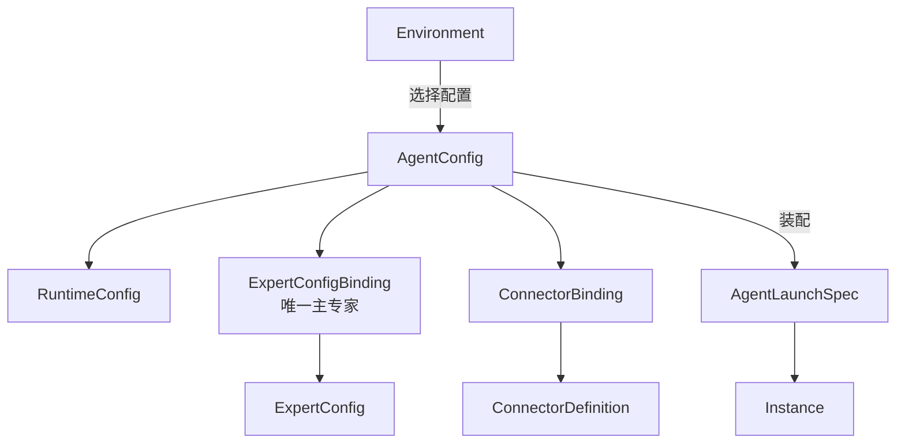

# Agent Config（Agent 资源系统）

> 涉及模块：AgentConfig、ExpertConfig、ConnectorBinding、ConnectorDefinition、RuntimeConfig、LaunchSpecBuilder
>
> **状态：目标架构（未实现）**。设计依据见 [Agent 资源系统重设计](../design/2026-08-11-agent-resource-system-redesign.md)。通用版本语义以 [通用资源版本控制](./07-versioning.md) 为准。

## 概述

AgentConfig 是 Agent 的配置蓝图：它描述 Agent 由哪些专家、运行参数和连接器组成，但不是运行中的 Instance。一个 AgentConfig 属于一个组织，可以被多个 Environment 引用并用于创建 Instance。


```mermaid
flowchart TD
    ENV[Environment] -->|选择配置| AC[AgentConfig]
    AC --> RT[RuntimeConfig]
    AC --> EB["ExpertConfigBinding<br/>唯一主专家"]
    AC --> CB[ConnectorBinding]
    EB --> EC[ExpertConfig]
    CB --> CD[ConnectorDefinition]
    AC -->|装配| LS[AgentLaunchSpec]
    LS --> INST[Instance]
```

## 聚合边界

| 组成部分 | 职责 | 所有权 |
|----------|------|--------|
| **AgentConfig** | 保存 Agent 的名称、说明和整体配置入口 | 聚合根 |
| **RuntimeConfig** | 保存 AgentNode、环境变量引用和 Permission | AgentConfig 子对象（详见 [RuntimeConfig](./05-runtime-config.md)） |
| **ExpertConfigBinding** | 选择 ExpertConfig，并保存 `order / alias / enabled / isMain` | AgentConfig 子对象 |
| **ConnectorBinding** | 选择 ConnectorDefinition，并保存 Agent 专属参数和启用状态 | AgentConfig 子对象 |
| **ExpertConfig** | 定义专家使用的模型、Skill 和 MCP | 独立资源 |
| **ConnectorDefinition** | 定义可复用的连接器能力 | 独立资源 |

RuntimeConfig 和两类 Binding 随 AgentConfig 一起管理，不提供脱离 AgentConfig 的独立生命周期。ExpertConfig 与 ConnectorDefinition 可被多个 AgentConfig 复用，修改权限和可见性独立判断。

## 资源管理

创建或更新 AgentConfig 时，服务负责维护完整聚合，而不是让调用方分别修改子表：

- RuntimeConfig 作为整体校验和保存（AgentNode、Env、Permission 的规则见 [RuntimeConfig](./05-runtime-config.md)）；
- ExpertConfigBinding 与 ConnectorBinding 使用提交后的完整集合替换旧集合，不能留下已移除绑定；
- 必须且只能有一个 `enabled = true` 的主 ExpertConfig；
- `order` 在同一 AgentConfig 内稳定且无冲突；
- Binding 指向的资源必须存在、类型正确，并对当前组织可见；
- Connector 的 Agent 专属参数必须符合对应 ConnectorDefinition 的配置约束；
- 密钥、token 和连接串只保存 SecretRef，不保存明文。

AgentConfig 采用通用资源版本能力。版本创建、锁定、引用解析、并发和幂等规则不在本领域重复定义，统一遵循 [通用资源版本控制](./07-versioning.md)。

## 依赖边界

AgentConfig 只允许直接组合 ExpertConfig 和 ConnectorDefinition。模型、Provider、Skill 与 MCP 由 ExpertConfig 管理，AgentConfig 不跨层直接绑定这些资源。

```text
AgentConfig → ExpertConfig → Skill / MCP / Model → Provider
AgentConfig → ConnectorDefinition
```

多个 AgentConfig 可以共享同一 ExpertConfig 或 ConnectorDefinition。依赖类型由 schema 明确声明，不提供任意 `resourceKind` 关系，也不允许反向依赖或自引用。

ExpertConfig 之下的资源层（Provider、Model、Skill、McpServer）的资源规则见 [配置资源系统](./06-config.md)；Hindsight 等外部服务集成见 [Hindsight 记忆模块架构](../developer/arch/hindsight-memory-architecture.md)。

## 运行时装配

Environment 保存 AgentConfig 的资源 ID 与版本选择（MAX 或锁定整数）。启动 Instance 时，LaunchSpecBuilder 按 [07-versioning](./07-versioning.md) §7 的规则读取配置图：

1. 先读取并固定 Environment 当前保存的 AgentConfig 版本选择；
2. 在同一个 PostgreSQL `REPEATABLE READ READ ONLY` 事务中读取 AgentConfig 聚合及整个配置 DAG，严格按各关联保存的 MAX/整数值解析；
3. 解析 RuntimeConfig，生成 AgentNode、Env 和 Permission（详见 [RuntimeConfig](./05-runtime-config.md)）；
4. 按顺序解析启用的 ExpertConfig，并确认唯一主专家；
5. 解析 ConnectorBinding 及其 ConnectorDefinition；
6. 将专家引用的 Model、Provider、Skill 和 MCP 转换为运行时配置（各资源的领域规则见 [配置资源系统](./06-config.md)）；
7. 提交只读事务后，在事务外解析 SecretRef、探测外部 MCP、下载 Skill 内容或生成下发凭据；
8. 生成独立的 `AgentLaunchSpec`，交给编排域启动 Instance。

缺失引用、无权访问、配置非法、安全撤销或历史脏数据都应明确拒绝启动。外部操作（Secret、MCP、S3）失败同样明确失败，不静默降级。

## 多租户与共享

- AgentConfig 的创建、修改和删除受组织边界及成员权限约束；
- 引用其他组织公开资源时，保存目标的真实作用域，不能把公开资源复制成本组织资源；
- 公开可读只授予引用和运行时读取能力，不授予修改权限；
- 保存时校验引用权限，运行时重新校验，避免资源撤权后继续启动。

## 上下级关系

- **← Environment**：选择 AgentConfig 作为 Instance 的配置来源；
- **→ LaunchSpecBuilder**：消费完整资源图并生成 `AgentLaunchSpec`；
- **→ ExpertConfig / ConnectorDefinition**：AgentConfig 直接组合的独立资源；
- **→ 配置资源系统**：ExpertConfig 之下的 Provider、Model、Skill 与 McpServer 规则见 [06-config](./06-config.md)；
- **→ RuntimeConfig / Binding**：由 AgentConfig 管理的聚合子对象；RuntimeConfig 的组成与装配规则见 [05-runtime-config](./05-runtime-config.md)；
- **→ 通用版本控制**：提供统一的版本能力，不进入 AgentConfig 领域规则。
