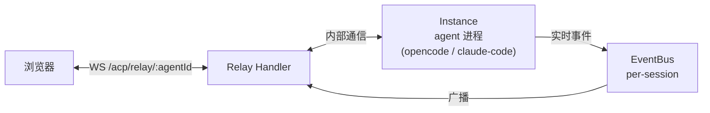
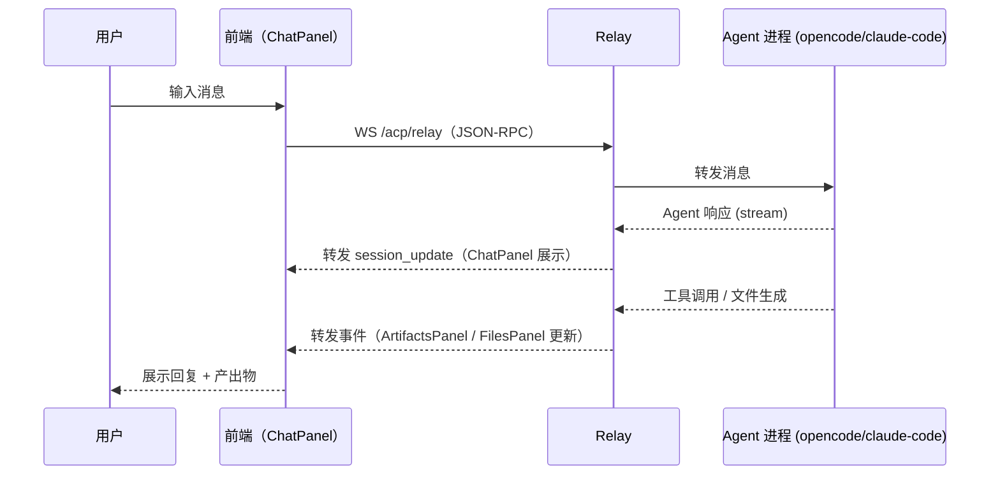
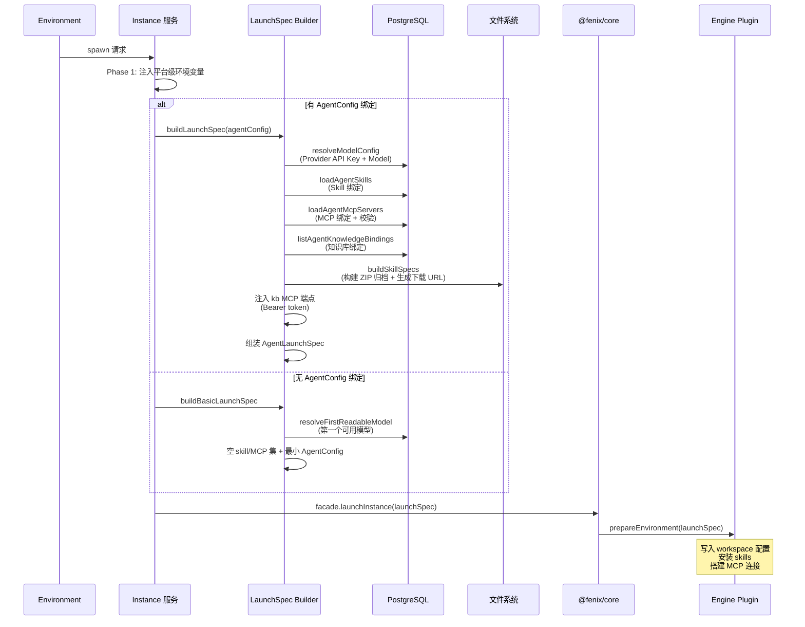
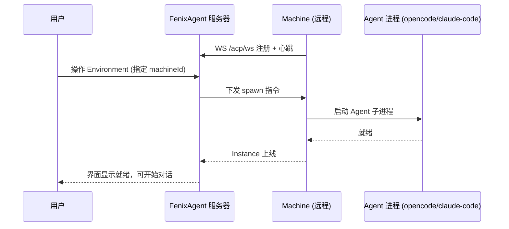

# Agent 界面

> 涉及模块：前端 Agent UI（ChatPanel + ArtifactsPanel + FilesPanel）、Relay Handler、EventBus、Instance 服务、文件服务

## 概述

Agent 界面是用户与 Agent 交互的完整通路——从输入消息到 Agent 返回响应，一条消息经过前端、WebSocket relay、Instance 三层传递。界面按三栏组织，共用同一个 Session 上下文。

前端和 Agent 不直接连接，FenixAgent 服务器充当中继，接收前端消息转发给 Agent，同时将 Agent 的响应推回前端。

## 组件关系

```
Agent 界面（三栏布局）
├── AgentSidebar（左）          ← 导航与环境切换
├── ChatPanel（中）             ← 消息对话
└── RightPanel（右，可调宽度）   ← ArtifactsPanel / FilesPanel tab 切换
```

**关键关系**：

| 关系 | 说明 |
|------|------|
| ChatPanel ↔ ArtifactsPanel | Agent 生成文件/代码 → ArtifactsPanel 刷新展示。共用 Session ID |
| ChatPanel ↔ FilesPanel | 消息走 WebSocket relay，文件走 HTTP API。通过 Session ID 关联，Agent 可直接读取用户上传文件 |
| AgentSidebar → 右侧面板 | Environment 切换 → 断开旧 relay → 建立新 relay → 面板切换 Session |
| 前端 ↔ Relay Handler | 双向 WebSocket（`/acp/relay/:agentId`），JSON-RPC 协议。Relay 负责连接计数和空闲回收 |
| Relay ↔ Instance | local：同进程通过 `@fenix/core` relay handle 直连；remote：通过 Machine WS 注册中继到远端 agent 进程 |
| Instance ↔ EventBus | Instance 事件（工具调用、文件变更、状态切换）写入 per-session EventBus，广播给所有 relay 连接 |
| Relay ↔ EventBus | Relay Handler 订阅 Session EventBus，SSE 断线时通过 `last-event-id` 断点续传 |

## 数据流



**消息交互流程**：



Relay Handler 同时管理 relay 连接计数——当前端全部断开，进入空闲观察窗口，超时后回收 Instance。

Session 按 Environment 隔离——每个 Environment 可以有多个 Session，前端可切换历史会话继续对话。

## 文件工作区

Agent 运行时可读写 Environment 关联的 workspace 目录。前端通过 HTTP 接口（`/web/sessions/:id/user/*`）进行文件的上传、下载、浏览、删除。

文件操作与消息通信独立——消息走 WebSocket relay，文件走 HTTP。两者共享同一 Session 上下文，通过 Session ID 关联。用户上传的文件 Agent 可在对话中直接读取。

## Instance 生命周期

从 Agent 界面视角看 Instance 的生命周期：

```
用户点击 Environment → enterEnvironment()
  → 检查是否有运行中的 Instance
    → 有？复用现有 Instance
    → 无？spawn 新 Instance（加载 Agent Config + 构建 LaunchSpec）
  → 创建或复用 Session
  → 建立 WebSocket relay 连接
  → 面板注入 Session 上下文
  → 用户开始对话

用户离开（关闭页面/切换 Environment）→ relay 断开
  → 全部 WS 连接关闭
  → 空闲观察期（由 `RCS_ACP_IDLE_TIMEOUT_SECONDS` 环境变量控制）
    → 超时？stop Instance
    → 重连？继续使用
```

Spawn 策略由 Environment 统一管理：自动启动开关、并发上限、远程部署配置。

### 资源注入（LaunchSpec 组装）

Instance spawn 时，FenixAgent 负责将 Agent 运行所需的全部资源**注入**为 `AgentLaunchSpec`，通过 `@fenix/plugin-sdk` 传递给 engine plugin。Agent 进程本身不持有配置，每次启动由 FenixAgent 完整注入。

> **原则**：FenixAgent 是所有配置资源的**单一权威来源**。Agent workspace 里的配置文件是注入产物，不是用户直接编辑的对象。

**注入流程**：



**注入的资源维度**：

| 资源 | 注入内容 |
|------|---------|
| **Model** | provider + protocol + baseUrl + apiKey + model（从 Provider/Model 表解析，apiKey 占位符替换） |
| **Agent 配置** | name + system prompt |
| **Skills** | 名称 + 临时下载 URL（源文件打包为 ZIP 归档，HMAC 签名） |
| **MCP Servers** | stdio / streamable-http 配置（缺失或禁用直接拒绝启动） |
| **知识库** | `kb` MCP 端点（streamable-http，Environment Secret 做 Bearer token） |
| **平台变量** | `USER_META_*` 四个元信息（可被调用方 extraEnv 覆盖） |

**无 AgentConfig 绑定的降级路径**：当 Environment 未绑定 `agentConfigId`（如系统级 meta-agent），走 `buildBasicLaunchSpec()`——仅注入第一个可用模型 + 空 skill/MCP 集。不会偷偷继承任何额外配置。

### 远程节点部署

Instance 可指定部署到远程 Machine：


