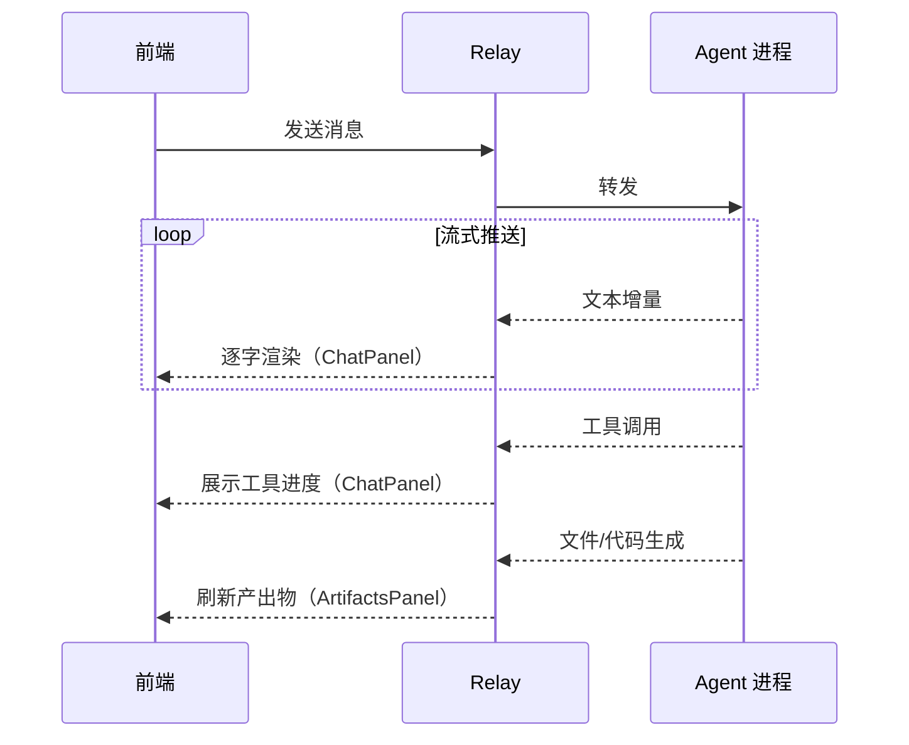
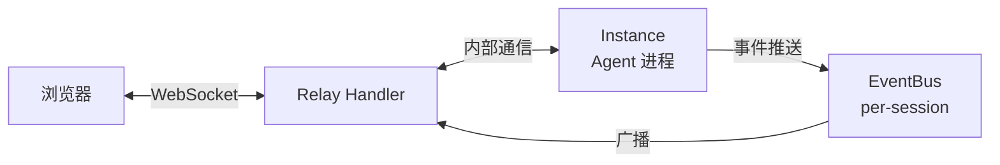

# Agent 接口

> 涉及模块：Relay Handler、前端 ACPClient（`web/src/acp/`）、Vercel AI SDK ChatTransport

## 概述

Agent 接口是前端与 Agent 进程之间的通信抽象——前端通过 Relay 与 Agent 交换消息，Relay 负责转发、流控和连接管理。底层传输细节（WebSocket / JSON-RPC / ACP 协议）由 `web/src/acp/` 封装，业务层不直接接触。

```
浏览器 ←→ Relay Handler ←→ Agent 进程
         ↑
    连接计数 · 空闲回收
```

## 流式渲染

Agent 的响应以**流式**方式推送到前端——不是一次返回完整结果，而是逐条增量下发。Relay 负责将 Agent 的原始事件流转发给前端，前端按事件类型分发到不同面板。



**事件分发**：

| 事件 | 消费方 |
|------|--------|
| 文本增量 | ChatPanel — 逐字追加 |
| 工具调用 | ChatPanel — 工具名 + 进度指示 |
| 文件/代码生成 | ArtifactsPanel — 更新产出物视图 |

## 消息传递

前端通过 Relay 与 Agent 进程交换消息。Relay 是透明的双向管道。



**通道分离**：

| 通道 | 用途 |
|------|------|
| WebSocket | 消息对话、工具调用、事件推送 |
| HTTP REST | 文件上传/下载/浏览（`/web/sessions/:id/user/*`） |

两条通道共享 Session ID——Agent 可直接读取用户上传的文件。Session 按 Environment 隔离，前端可切换历史会话继续对话。

Relay 管理连接计数——前端全部断开后进入空闲观察窗口，超时回收 Instance。

## 前端封装

`web/src/acp/` 封装了与 Relay 通信的底层细节，前端业务代码通过 `useChat`（Vercel AI SDK）消费，不直接处理协议层。

```
业务层（ChatPanel）
    ↓ useChat
Vercel AI SDK（ChatTransport 适配）
    ↓
acp/relay-client.ts（WebSocket 生命周期 + 事件订阅）
    ↓
acp/client.ts（消息编解码 + 请求/响应匹配）
    ↓
Relay Handler
```

## 上下级关系

- **← Agent 实例**：spawn 后建立 relay 连接，在此通道上交互。详见 [Agent 实例文档](./08-instance.md)
- **← Agent Config**：通过 Environment 绑定，决定 Agent 的行为和能力。详见 [Agent Config 文档](./04-agent-config.md)
