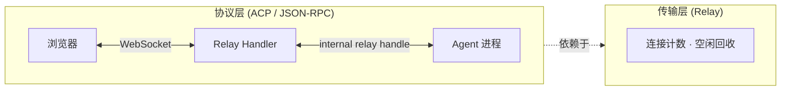
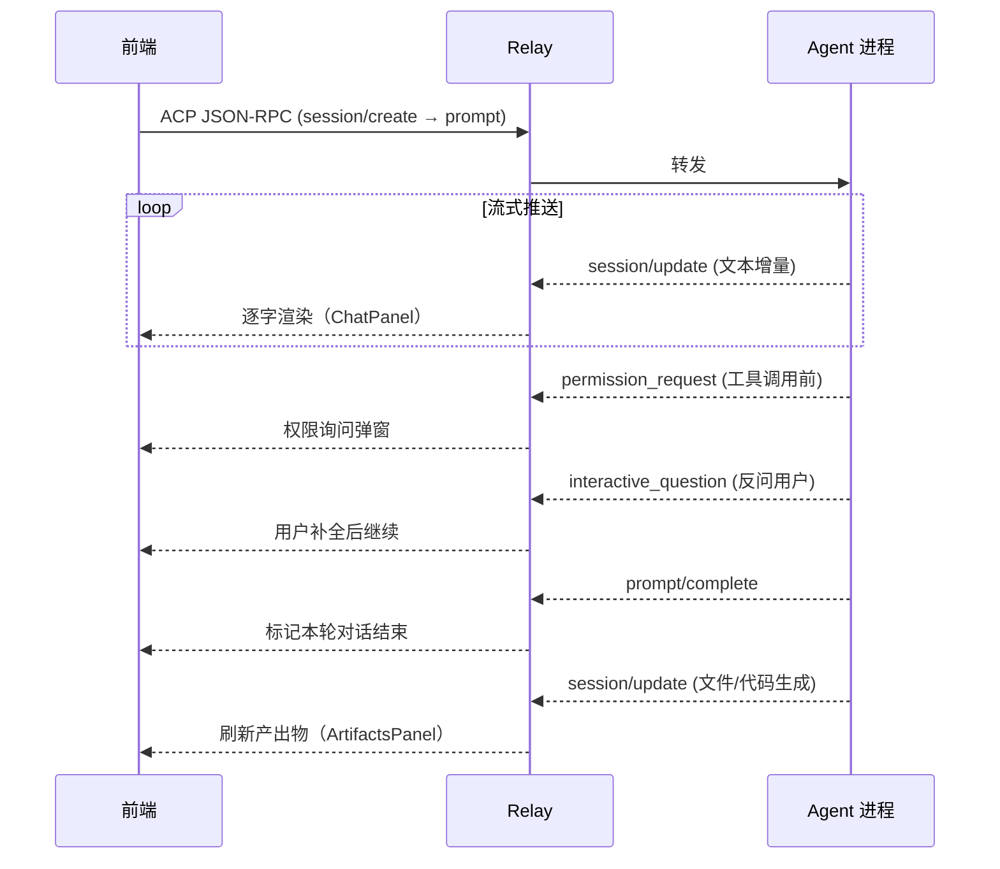
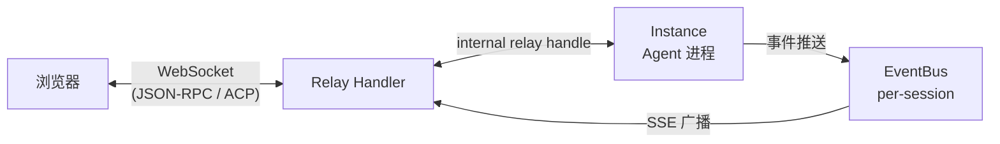

# Agent 接口

> 涉及模块：Relay Handler（`src/transport/relay/`）、前端 ACPClient（`web/src/acp/`、`packages/acp-link/`）、ChatInterface（`web/components/ChatInterface.tsx`）

## 概述

Agent 接口是前端与 Agent 进程之间的通信抽象，由**传输层**和**协议层**两层构成：

- **传输层**：Relay 是透明的双向 WebSocket 管道，负责转发、连接计数和空闲回收。它不解析消息内容，只做透传。
- **协议层**：ACP（Agent Communication Protocol）运行在 WebSocket 之上，使用 JSON-RPC 2.0 定义消息格式——会话管理、prompt 请求/响应、流式增量、工具调用、权限协商、文件操作都由 ACP 协议承载。

两层职责明确：Relay 管"怎么连"，ACP 管"说什么"。前端通过 `web/src/acp/` 封装 JSON-RPC 编解码，业务层（ChatPanel）只消费高层事件，不接触协议细节。



## 前端能力

前端 ChatPanel / ArtifactsPanel 为用户提供以下交互能力：

| 能力 | 承载组件 | 说明 |
|------|---------|------|
| 流式对话 | ChatPanel | 实时逐字渲染 Agent 回复，支持 Markdown / 代码块高亮 |
| 工具调用可视化 | ChatPanel | 展示工具名、参数、执行进度和结果 |
| 权限审批 | 弹窗 | Agent 执行敏感操作前弹出 ask/allow/deny 三态选择 |
| 反问交互 | ChatPanel | Agent 向用户提问时展示问题，用户补全后继续 |
| 产出物浏览 | ArtifactsPanel | 查看 Agent 生成的文件、代码、图片等产出物，支持实时刷新 |
| 工作区文件管理 | ArtifactsPanel / FilePicker | 浏览工作区目录树、上传文件供 Agent 读取、下载生成的文件 |
| 会话切换 | AgentSidebar | 列出历史会话、切换继续对话，通过 `session/list` → `session/load` 实现 |
| Agent 状态感知 | 状态栏 | 显示连接状态、Agent `capabilities`、当前模型等运行时信息 |

这些能力由 ACP 协议事件驱动——Agent 推送什么，前端就渲染什么。组件职责划分：

- **ChatPanel**：对话主面板，消费 `session/update`、`permission_request`、`interactive_question`、`prompt/complete`
- **ArtifactsPanel**：产出物侧边栏，消费 `session/update`（文件类型），可调宽度
- **AgentSidebar**：左侧导航，管理 Instance / Session 列表，触发会话切换

## 流式渲染

Agent 的响应以**流式**方式推送到前端——不是一次返回完整结果，而是逐条增量下发。ACP 协议通过 `session/update` JSON-RPC 通知承载每次增量，Relay 负责将原始事件流转发给前端，前端 `ACPProtocol` 解析后按事件类型分发到不同面板。



**ACP 事件 → UI 分发**：

| ACP 事件 | 协议类型 | 消费方 |
|----------|---------|--------|
| `session/update`（文本增量） | JSON-RPC 通知 | ChatPanel — 逐字追加 |
| `permission_request` | JSON-RPC 通知 | 权限弹窗 — ask/allow/deny |
| `interactive_question` | JSON-RPC 通知 | ChatPanel — Agent 反问用户 |
| `prompt/complete` | JSON-RPC 通知 | ChatPanel — 标记对话完成 |
| `session/update`（文件/代码） | JSON-RPC 通知 | ArtifactsPanel — 更新产出物视图 |
| `status`（capabilities） | 传输层消息 | 前端 — 判断 Agent 能力集 |

会话生命周期同样由 ACP 管理：`session/create` 新建会话、`session/load` 切换到历史会话、`session/resume` 恢复中断的对话。这些都在 `ACPClient` 内部通过 `createRequest()` 发出 JSON-RPC 请求，`ACPPending` 做请求/响应的 id 匹配。

## 消息传递

WebSocket 通道上跑的是 **ACP JSON-RPC 消息**——Relay 不解析内容，只管转发原始字符串。Agent 进程内部通过 EventBus（per-session）广播事件，Relay 订阅 EventBus 后推送给前端；SSE 断线时通过 `last-event-id` 从 EventBus 续传。



**通道分离**：

| 通道 | 协议 | 用途 |
|------|------|------|
| WebSocket | ACP (JSON-RPC 2.0) | 会话管理、消息对话、工具调用、流式推送 |
| HTTP REST | — | 文件上传/下载/浏览（`/web/sessions/:id/user/*`） |

两条通道共享 ACP Session ID——Agent 可直接读取用户上传的文件。Session 按 Environment 隔离，前端可通过 `session/list` 列出并切换历史会话继续对话。

Relay 管理连接计数——前端全部断开后进入空闲观察窗口，超时回收 Instance。

## 前端封装

`ChatPanel` 在挂载时通过 `createRelayClient()`（`web/src/acp/relay-client.ts:26`）创建 `ACPClient` 实例，向下传递给 `ChatInterface`。`ChatInterface` 直接注册 ACP 事件 handler——不经过中间 SDK 适配层。

```mermaid
flowchart TB
    subgraph 路由["路由层"]
        CP[ChatPanel<br/>创建 ACPClient · 管理连接状态]
    end
    subgraph ui["UI 渲染层"]
        AM[ACPMain<br/>会话引导 bootstrap · 布局]
        CI[ChatInterface<br/>注册 handler · 消息提交 · 状态管理]
    end
    subgraph component["子组件"]
        CV[ChatView · ChatComposer · PermissionPanel · TodoPanel]
    end
    subgraph acp["ACP 协议栈（packages/acp-link）"]
        AC["ACPClient<br/>编排 · 会话 · 心跳"]
        AP["ACPProtocol<br/>JSON-RPC 编解码"]
        WS["WSTransport<br/>连接 · 重连"]
    end
    subgraph backend["后端"]
        RH["Relay Handler"]
    end

    CP -->|client prop| AM
    AM -->|client prop| CI
    CI --> component
    CP -->|createRelayClient()| AC
    AC --> AP --> WS
    WS -->|ws://.../acp/relay/:agentId| RH
```

**关键组件职责**：

| 组件 | 文件 | 职责 |
|------|------|------|
| ChatPanel | `web/src/pages/agent-panel/ChatPanel.tsx` | 创建 ACPClient、管理连接状态（connecting/connected/error）、监听 `agent:reconnect` 事件重建连接 |
| ACPMain | `web/components/ACPMain.tsx` | 会话引导（等待 capabilities → `listSessions` → 自动 `loadSession` 或新建）、管理布局与服务端 RCS Session ID |
| ChatInterface | `web/components/ChatInterface.tsx` | 核心中枢——注册所有 ACP handler，通过 `applySessionUpdateToEntries()` 将 ACP 事件映射为 `ThreadEntry[]`，管理 isLoading / errorMessage / todoItems 状态 |

**ACP 协议层**：

| 模块 | 文件 | 职责 |
|------|------|------|
| WSTransport | `packages/acp-link/src/client/transport.ts` | WebSocket 生命周期、自动重连（指数退避 + jitter，最多 5 次）、收发原始字符串 |
| ACPProtocol | `packages/acp-link/src/client/protocol.ts` | 解析原始字符串为传输层消息（status/error/pong）或 JSON-RPC 消息，通知映射为具名事件 |
| ACPClient | `packages/acp-link/src/client/client.ts` | 组合子模块，暴露 `setXxxHandler` API，管理 JSON-RPC 请求/响应匹配（ACPPending）和心跳 |
| relay-client | `web/src/acp/relay-client.ts` | 构建 `/acp/relay/:agentId` URL，创建 ACPClient 实例（通过 cookie 认证） |

## 上下级关系

- **← Agent 实例**：spawn 后建立 relay 连接，在此通道上通过 ACP 协议交互。详见 [Agent 实例文档](./08-instance.md)
- **← Agent Config**：通过 Environment 绑定，决定 Agent 的行为和能力。Agent 的 `status` 消息携带 `capabilities`，前端据此调整交互界面。详见 [Agent Config 文档](./04-agent-config.md)
