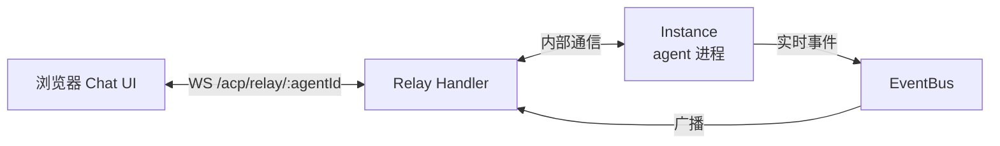
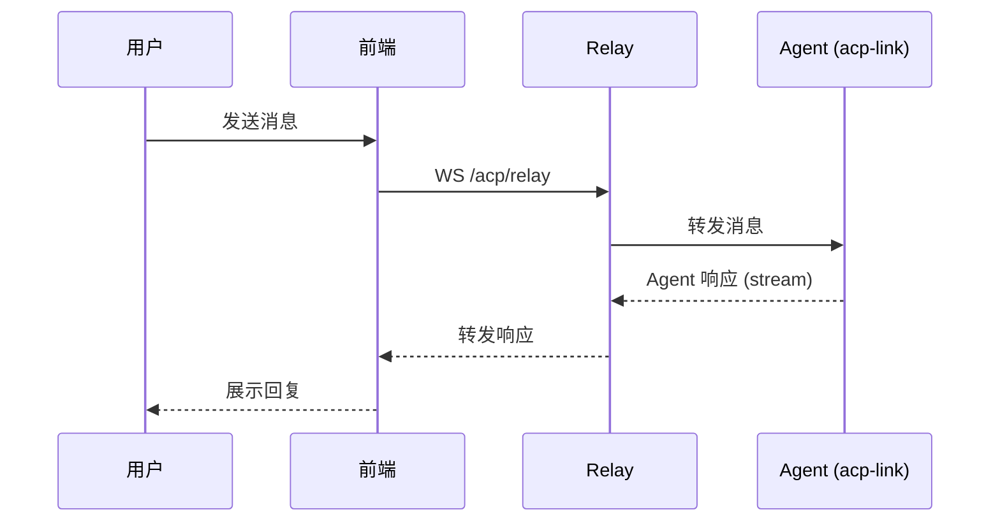
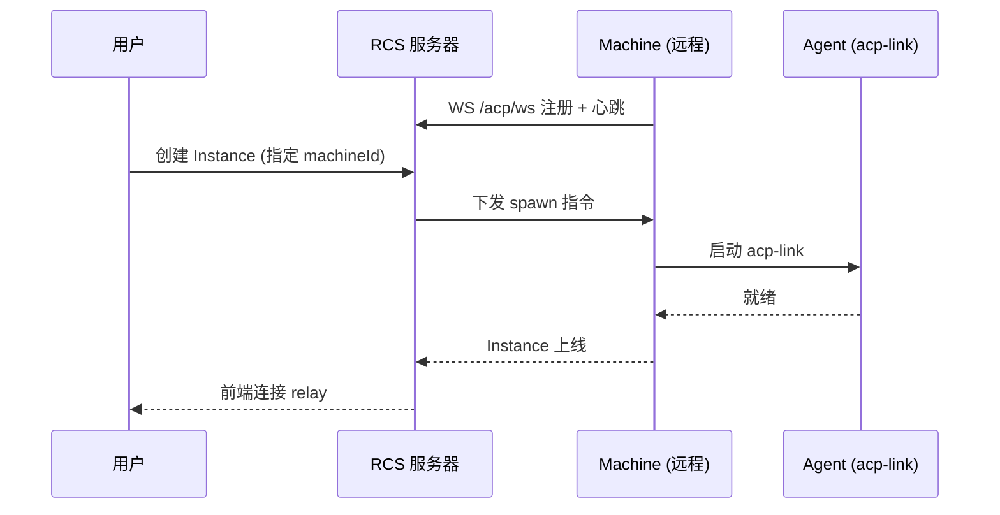

# Chat 界面

> 涉及模块：前端 Chat UI、Relay Handler、EventBus、Instance 服务、Session 服务、文件服务

## 概述

Chat 界面是用户与 Agent 交互的完整通路——从浏览器输入消息到 Agent 返回响应，一条消息经过前端、WebSocket relay、Instance 三层传递。

前端和 Agent 不直接连接，FenixAgent 服务器充当中继，接收前端消息转发给 Agent，同时将 Agent 的响应推回前端。

## 数据流



**消息交互流程**：



Relay Handler 同时管理 relay 连接计数——当前端全部断开后，进入空闲观察窗口，超时后回收 Instance。

## 前端 Chat UI

统一三栏布局：**AgentSidebar**（左）+ **ChatPanel**（中）+ **ArtifactsPanel**（右，可调宽度）。

| 区域 | 职责 |
|------|------|
| AgentSidebar | 环境列表、Agent 切换、Session 历史、导航入口 |
| ChatPanel | 消息输入、对话展示、工具调用进度 |
| ArtifactsPanel | Agent 产出物展示（代码、文件、图表等），与 Files 通过 tab 切换 |

ChatPanel 基于 Vercel AI SDK 的消息流管理，WebSocket 承载 JSON-RPC 协议通信。前端 ACP 客户端负责协议层的请求/响应匹配和 streaming chunk 拼接。

Session 按 Environment 隔离——每个 Environment 可以有多个 Session，前端可切换历史会话继续对话。

## 文件工作区

Agent 运行时可读写 Environment 关联的 workspace 目录。前端通过 HTTP 接口（`/web/sessions/:id/user/*`）进行文件的上传、下载、浏览、删除。

文件操作与消息通信独立——消息走 WebSocket relay，文件走 HTTP。两者共享同一 Session 上下文，通过 Session ID 关联。

## Instance 生命周期

从 Chat 视角看 Instance 的生命周期：

```
用户进入 Agent → enterEnvironment()
  → 检查是否有运行中的 Instance
    → 有？复用
    → 无？spawn 新 Instance（加载 Agent Config + 构建启动规格）
  → 创建或复用 Session
  → 建立 WebSocket relay 连接
  → 用户开始对话

用户离开（关闭页面/切换 Agent）→ relay 断开
  → 空闲观察期
    → 超时？stop Instance
    → 重连？继续使用
```

Spawn 策略由 Environment 统一管理：自动启动开关、并发上限、远程部署配置。

### 远程节点部署

Instance 可指定部署到远程 Machine：


