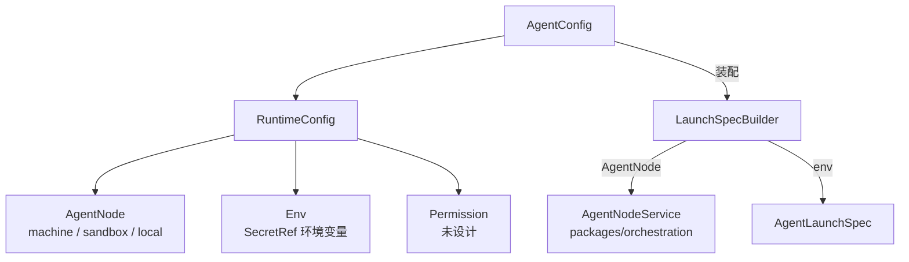

# RuntimeConfig（Agent 运行时参数）

> 涉及模块：AgentConfig、RuntimeConfig、AgentNode、Env、Permission、LaunchSpecBuilder、AgentNodeService
>
> **状态：目标架构（未实现）**。本文定义 RuntimeConfig 的组成与管理边界；AgentConfig 聚合规则以 [Agent Config](./04-agent-config.md) 为准，通用版本语义以 [通用资源版本控制](./07-versioning.md) 为准。

## 概述

RuntimeConfig 是 AgentConfig 的聚合子对象，保存 Agent 运行所需的执行环境参数：**AgentNode（在哪跑）、Env（环境变量引用）、Permission（权限规则）**。它描述"如何运行一个 Agent"，不描述 Agent 的能力构成（专家、连接器）——后者由 ExpertConfigBinding 与 ConnectorBinding 负责（见 04 号文档）。

RuntimeConfig 不提供脱离 AgentConfig 的独立生命周期：随 AgentConfig 一起创建、编辑、锁定和删除，不接受外部直接修改。



## 组成

| 组成 | 职责 | 说明 |
|------|------|------|
| **AgentNode** | 声明 Agent 实例的执行节点 | 支持远程 machine、sandbox 池；为空时按解析链回落到本地执行 |
| **Env** | 声明 Agent 进程的环境变量 | 只保存引用（SecretRef 或普通值），明文密钥不入库 |
| **Permission** | 声明 Agent 工具的权限规则 | 未设计：动作枚举、规则模型与下发机制均未定义 |

三个组成作为整体校验和保存：任一组成非法时拒绝保存整个 RuntimeConfig，不产生部分写入。

## AgentNode

### 结构与语义

```ts
type AgentNode =
  | { kind: "machine"; machineId: string }   // 远程机器节点（file-ws / 远程执行）
  | { kind: "sandbox"; sandboxPoolId: string } // 沙箱池节点
  | {};                                       // 未指定，按解析链回落
```

- `machine`：实例在指定远程机器上运行，`machineId` 对应 machine 表主键；
- `sandbox`：实例在指定沙箱池中运行，`sandboxPoolId` 对应沙箱池资源；
- 空对象：合法值，表示未显式声明，运行时按解析链回落（见下）。

### 解析链

启动装配时按以下顺序解析实际执行节点（现状实现在 `src/services/config/agent-config.ts` 的 `resolveAgentNode` 与 `src/services/orchestration-bootstrap.ts`）：

```text
agentNode 显式声明
  → machineId 历史列（agent_config.machineId，兼容过渡）
    → RCS_DEFAULT_MACHINE_ID（环境变量）
      → local-default（本地执行占位节点）
```

规则：

- `agentNode` 非法（字段缺失、类型不符）时拒绝使用，不得静默跳过；
- 历史列 `machineId` 只作为 `agentNode` 为空的兼容回退，`agentNode` 存在时列被忽略；
- 无 `agentNode`、无历史列、无默认机器时回落到本地执行（`local-default`，见 `src/services/local-node-service.ts`）；
- 配置了远程 machine 但节点不可用（file-ws 未连接等）时明确失败，不得静默回退到本地执行，避免远程/本地执行分裂（与文件 API 的远程/本地不分裂约束同源）。

### 与编排域的关系

AgentNode 是编排域 `AgentNodeService`（`packages/orchestration`）的输入：LaunchSpecBuilder 解析出 `machineId` / `sandboxPoolId` 后，由 `AgentNodeService.ensureNode` 获取或建立节点，Instance 生命周期绑定该节点。RuntimeConfig 只声明"目标节点"，不保存节点连接状态、健康度或运行实例——这些是编排域的运行时状态（见 [20-orchestration-management](./20-orchestration-management.md)）。

## Env

### 存储规则

- Env 是环境变量列表，键为变量名，值为**字符串或 SecretRef**；
- SecretRef 只保存引用标识（如 `{env:RCS_SECRET_<name>}`），实际值在启动装配时从环境/密钥系统解析，解析失败拒绝启动；
- 明文密钥、token、连接串禁止写入 Env、日志或任何错误响应；
- 与 Provider、McpServer 的密钥引用遵循同一 SecretRef 约定（见 [06-config](./06-config.md) 通用管理边界）。

### 运行时装配

LaunchSpecBuilder 将 Env 与装配期注入变量合并为 `AgentLaunchSpec.env`：

- RuntimeConfig.Env 声明的变量；
- 装配期注入变量（如外部服务集成注入的环境变量，现状为 CCB/Hindsight 注入，见 `launch-spec-builder.ts`）；
- 调用方显式传入的 `extraEnv`（优先级最高，同名覆盖）。

SecretRef 解析属于外部操作，在 PostgreSQL 快照读取完成后执行，不得放进数据库事务（与 07 号文档 §7 一致）。

## Permission

### 现状与边界

Permission 声明 Agent 工具的运行时权限策略，目标模型**全部未设计**：动作枚举、规则模型与下发机制均未定义。目标新模型见 [Agent 资源系统重设计](../design/2026-08-11-agent-resource-system-redesign.md)「暂不设计」清单；现状 `agent_config.permission` 仅为 `jsonb` 预留字段（"ask/allow/deny 规则（预留）"，`src/db/schema.ts`），无校验、无装配消费。

- **运行期审批边界**：权限请求的实时审批（pending → resolved 状态机、权限弹窗、超时过期）是 Chat 链路的一部分，权威实现在 [19-yjs-chat-streaming](./19-yjs-chat-streaming.md) 与 `packages/chat-channel/src/state/permission.ts`，RuntimeConfig 只声明规则，不承载审批状态；
- **资源授权边界**：RuntimeConfig.Permission 与资源级权限（RBAC、跨组织共享授权）是两层机制，互不替代；资源权限见 [03-permission-resource](./03-permission-resource.md)。

## 校验与保存

AgentConfig 服务在保存聚合时对 RuntimeConfig 整体校验：

- AgentNode：`machine` 的 `machineId` 必须引用存在的 machine；`sandbox` 的 `sandboxPoolId` 必须引用存在的沙箱池；非法结构拒绝保存；
- Env：键名合法（非空、无控制字符）；SecretRef 格式可识别；明文密钥拒绝保存；
- Permission：未设计，暂无校验；
- 校验失败返回业务错误，不落库。

RuntimeConfig 随 AgentConfig 版本化：编辑 MAX 时整体更新，锁定时随聚合复制为不可变版本，版本规则不在本文重复（见 07 号文档）。

## 运行时装配

启动 Instance 时，LaunchSpecBuilder 按以下顺序消费 RuntimeConfig（第 1 步与 04 号文档装配流程对应）：

1. 读取 AgentConfig 聚合中的 RuntimeConfig（同一 PostgreSQL 快照内）；
2. 解析 AgentNode 执行节点（含解析链回落），交给编排域 `AgentNodeService`；
3. 解析 Env 的 SecretRef 与装配期注入变量，合并为 `AgentLaunchSpec.env`；
4. 生成独立的 `AgentLaunchSpec`，交给编排域启动 Instance。

Permission 未设计，暂不进入装配流程（见上文 §Permission）。

缺失引用、无权访问、配置非法、安全撤销或历史脏数据都应明确拒绝启动，不做静默降级。

## 上下级关系

- **← AgentConfig**：RuntimeConfig 是 AgentConfig 的聚合子对象，随聚合整体管理；
- **→ LaunchSpecBuilder**：消费 RuntimeConfig 生成 `AgentLaunchSpec` 的运行时参数；
- **→ AgentNodeService**（`packages/orchestration`）：消费解析后的执行节点，负责节点生命周期；
- **→ 权限审批链路**：Permission 规则的运行期执行在 Chat 链路（19 号文档），本层只声明规则；
- **→ 通用版本控制**：提供版本能力，不进入 RuntimeConfig 领域规则。
