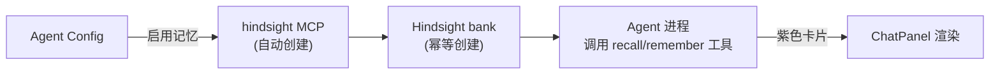

# Hindsight 记忆

> 涉及模块：Hindsight 记忆服务、AgentConfig 配置、Hindsight MCP Server

## 概述

Hindsight 是外部部署的 AI 长期记忆服务——Agent 会话中产生的记忆由 Hindsight 存储与召回。FenixAgent 通过反向代理和 MCP 集成与其交互。

与 RagFlow、Agent Sites 同级，都是独立外部服务。

## 与 Agent 的集成

Agent 通过 **MCP 工具** 访问 Hindsight。创建/更新 AgentConfig 时，若启用记忆功能：

1. 自动创建名为 `hindsight` 的 `streamable-http` MCP server 记录
2. 确保 Hindsight bank 存在（幂等创建）
3. Agent 运行时即可调用 `hindsight_recall`、`hindsight_remember` 等工具

Hindsight 工具在 ChatPanel 中以**紫色卡片**独立渲染，区分于普通工具调用。

## 配置与状态

- **Hindsight URL**：通过环境变量配置，未配置时记忆功能自动禁用
- **Bank 隔离**：每个用户对应独立的 Hindsight bank（按 member ID 映射）
- **状态查询**：前端通过 `/web/hindsight/status` 检查 Hindsight 是否可用

其余 API（记忆 CRUD、图谱查询、文档管理等）直接透传到 Hindsight 外部服务。

## 上下级关系

- **← AgentConfig**：启用记忆时自动绑定 hindsight MCP
- **→ Instance**：Agent 运行中通过 MCP 工具与 Hindsight 交互
- **→ Hindsight 外部服务**：FenixAgent 作为反向代理网关
