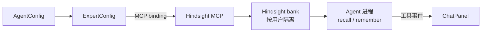

# Hindsight 记忆

> 涉及模块：Hindsight 集成服务、ExpertConfig、Hindsight MCP Server

## 概述

Hindsight 是外部部署的 AI 长期记忆服务。Agent 会话中产生的记忆由 Hindsight 存储和召回，FenixAgent 通过反向代理与 MCP 集成访问它。Hindsight 与 RagFlow、Agent Sites 同级，不属于本地配置数据库。

```mermaid
flowchart LR
    AC[AgentConfig] --> EC[ExpertConfig]
    EC -->|MCP binding| HM[Hindsight MCP]
    HM --> BK["Hindsight bank<br/>按用户隔离"]
    BK --> AG["Agent 进程<br/>recall / remember"]
    AG -->|工具事件| FE[ChatPanel]
```

## 集成资源管理

ExpertConfig 通过普通 McpServer 引用启用 Hindsight，不在 AgentConfig 上增加专用记忆开关，也不创建第二套 MCP 配置模型。

Hindsight 集成服务负责：

- 生成或校验 Hindsight MCP 所需的连接配置；
- 按 member ID 映射用户 bank，并幂等确保 bank 存在；
- 提供 `/web/hindsight/status` 所需的可用性状态；
- 将记忆 CRUD、图谱和文档请求代理到外部服务；
- 隔离外部错误，避免向用户泄露地址、凭据或内部响应。

Hindsight MCP 的版本行为与其他 McpServer 相同，统一遵循 [通用资源版本控制](./07-versioning.md)，本文件不另设规则。

## 启动与故障边界

Hindsight URL 通过环境变量配置；未配置时记忆能力不可用。Instance 启动时检查 Hindsight MCP 配置和服务可用性，不能把保存时的历史探测结果当作可用性保证。

bank 创建和外部连通性检查不得放进本地资源保存事务。外部服务失败应返回可诊断错误，并根据产品策略决定拒绝启动或明确降级，不能静默产生一个看似可用但无法记忆的 Agent。

## 前端呈现

Hindsight 的 recall、remember 等调用沿用 MCP 工具事件。在 ChatPanel 中可以使用紫色卡片区分记忆行为，但前端不得依赖 Hindsight 的内部响应结构绕过统一工具事件模型。

## 上下级关系

- **← ExpertConfig**：通过 McpServer binding 使用 Hindsight；
- **→ Instance**：启动时解析配置，运行中调用记忆工具；
- **→ Hindsight 外部服务**：FenixAgent 提供受控代理和用户隔离。
