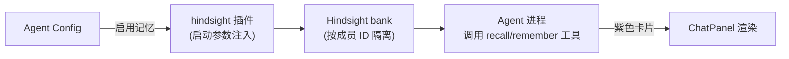

# Hindsight 记忆

> 涉及模块：Hindsight 记忆服务、AgentConfig 配置、Agent 启动参数

## 概述

Hindsight 是外部部署的 AI 长期记忆服务——Agent 会话中产生的记忆由 Hindsight 存储与召回。FenixAgent 通过反向代理与启动参数的插件下发与其交互。

与 RagFlow、Agent Sites 同级，都是独立外部服务。

```mermaid
flowchart LR
    AC[Agent Config] -->|"启用记忆"| HM["hindsight 插件<br/>(启动参数注入)"]
    HM --> BK["Hindsight bank<br/>(按成员 ID 隔离)"]
    BK --> AG["Agent 进程<br/>调用 recall/remember 工具"]
    AG -->|"紫色卡片"| FE[ChatPanel 渲染]
```

## 与 Agent 的集成

Agent 通过 **MCP 工具** 访问 Hindsight。投递面由 Agent 启动参数装配（`@fenix/agent-config` 的
`agent-launch-spec/memory-env`）构造，**不写 `mcp_server` 表，也不登记系统托管 MCP server**：

1. 部署配置了 `HINDSIGHT_MCP_URL` 且 Agent 启用了记忆时，装配层把成员映射解析为 bank ID；
2. 配置值统一经 `AgentLaunchSpec.workspaceFiles` 下发为 `<workspace>/.hindsight/workspace.json`（扁平 camelCase JSON + `managed` 元数据），每次 prepare 全量原子重写；唯一保留的配置 env 是指向该文件绝对路径的 `HINDSIGHT_CONFIG`；
3. `plugins: ["hindsight"]` 显式启用插件：opencode 映射 npm 包 `@konghayao/opencode-hindsight`（空参数），ccb/peri/claude-code 映射市场插件 `hindsight-memory@hindsight-plugin`；
4. 本地 runtime 与远程 machine handler 共用 preparer；平台路径来自 `resolveWorkspacePath`，machine 按自己的 workspace 重定位。Agent 通过插件提供的记忆工具访问 Hindsight，不再由平台注入或按名称剔除 hindsight MCP。

bank 在首次 retain 自动创建，平台不预创建；依据为插件 `src/lib/bank.ts:244-246`、`src/hooks/retain.ts:360-365` 与 `src/mcp/server.ts:282,306`。无成员 bankId 时只关闭本次记忆，不退回共享 bank。托管文件还固定 `bankIdPrefix` / `directoryBankMap` / `dynamicBankId` 与 `recallAdditionalBanks` / `recallAdditionalBankFilters` 等隔离键（插件逐键合并，缺键即被低优先级层接管），并刻意不写 `retainTags` 以保留插件的 `['{session_id}']` 默认——理由与证据见 `packages/resources/memory/README.md` 的工作区配置下发契约。

Hindsight 工具在 ChatPanel 中以**紫色卡片**独立渲染，区分于普通工具调用。

## 配置与状态

- **Hindsight URL**：通过环境变量配置，未配置时记忆功能自动禁用
- **Bank 隔离**：每个用户对应独立的 Hindsight bank（按 member ID 映射）
- **状态查询**：前端通过 `/web/hindsight/status` 检查 Hindsight 是否可用

其余 API（记忆 CRUD、图谱查询、文档管理等）直接透传到 Hindsight 外部服务。

## 上下级关系

- **← AgentConfig**：启用记忆时经 Agent 启动参数注入 hindsight 插件（不写 `mcp_server` 表）
- **→ Instance**：Agent 运行中通过 MCP 工具与 Hindsight 交互
- **→ Hindsight 外部服务**：FenixAgent 作为反向代理网关
