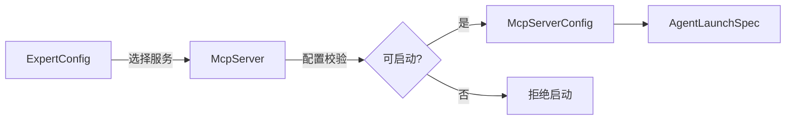

# MCP 配置

> 涉及模块：MCP Server 配置服务、MCP Tool 缓存、ExpertConfig、LaunchSpecBuilder
>
> **状态：目标架构（未实现）**。本文描述 MCP Server 资源及工具发现状态；版本能力遵循 [通用资源版本控制](./07-versioning.md)。

## 概述

McpServer 是 Agent 可调用的外部工具服务配置。它负责描述连接方式，不保存某次运行的连接实例或工具执行结果。

## 支持类型

| 类型 | 说明 | 核心字段 |
|------|------|----------|
| `local` | 命令行启动（stdio transport） | `command`、`args`、`env`、`timeout` |
| `remote` | URL 连接（SSE transport） | `url`、`headers`、`oauth` |
| `streamable-http` | Streamable HTTP 连接 | `url`、`headers`、`timeout` |
| `disabled` | 显式停用该服务 | `enabled: false`，config 为空 |

类型决定配置 schema。保存时必须完成独立转换和校验，不能把未经校验的协议 DTO 直接作为持久化模型。headers、oauth 和 env 中的敏感值只保存 SecretRef。

## MCP Server 管理

- `local` 必须有非空 command，并限制参数与环境变量；
- 远程类型必须使用允许的 URL scheme，并执行 SSRF 防护；
- timeout 必须有合理上下限；
- `disabled` 不参与运行时装配；
- 停用或删除前应能查询引用它的 ExpertConfig；
- 外部连通性检查是辅助反馈，不能替代保存时的结构校验。

McpServer 采用通用版本能力，版本字段、锁定和引用规则不在本领域重复定义。

## Tool 缓存

`mcpTool` 保存最近一次从目标服务发现的工具列表及检查时间。它是可刷新、可失效的运行状态，不属于 McpServer 资源定义。

同一 McpServer 引用的工具集合在事务内原子替换，避免读取到半套结果。连接配置变化、显式刷新或缓存过期时重新发现；探测失败保留诊断信息，但不得泄露凭据。

## 与 ExpertConfig 的关系

ExpertConfig 保存一组 McpServer 引用。保存时拒绝重复或无权访问的目标；启动时再次检查引用存在、权限、安全撤销和配置合法性，再转换为 `McpServerConfig` 注入 `AgentLaunchSpec`。

AgentConfig 不直接绑定 MCP。多个 ExpertConfig 可以共享同一 McpServer，任一 ExpertConfig 的修改不得隐式更新目标服务。

## 跨组织共享

McpServer 可以公开读取，但调用方仍需拥有其 SecretRef 所指密钥的使用权限。配置可见不代表敏感值可见，也不自动授予外部服务访问权。
