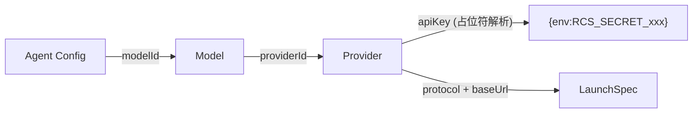

# Provider & Model

> 涉及模块：Provider 配置服务、Model 配置服务、LaunchSpec Builder

## 概述

Provider 代表一个 AI 服务商（如 OpenAI、Anthropic），Model 是挂在 Provider 下的具体模型（如 gpt-4o、claude-sonnet-4）。AgentConfig 只需引用 Model，运行时系统自动通过 Model → Provider 逐级解析出完整的连接配置。

## Provider

每个 Provider 代表一个 AI 服务商，组织内唯一标识。

**设计决策**：

- **API Key 掩码**：响应中不返回完整密钥，仅返回尾部 4 位掩码。短于 4 位统一返回全星号。这是防止密钥泄露的安全措施
- **占位符解析**：apiKey 字段支持 `{env:RCS_SECRET_<name>}` 占位符，spawn 时由 `resolveApiKey()` 从环境变量读取实际值
- **协议白名单**：运行时只支持 `openai` 和 `anthropic` 协议，未知协议拒绝启动
- **跨组织共享**：`publicReadable` 标记后可被其他组织引用（通过复合标识 `来源组织ID/资源UUID`）

## Model

挂在 Provider 下，记录模型的元信息（context limit、cost、modalities 等）。`modelId` 字段即模型的实际标识（如 `deepseek-v4-flash`），spawn 时直接透传给 engine。

**可用性缓存**：按组织隔离的 5 分钟 TTL 内存缓存。Provider 变更时强制刷新，保证一致性。

## 与 AgentConfig 的关系

AgentConfig 通过 `modelId` 引用一个 Model。spawn 时 LaunchSpec Builder 沿着 Model → Provider 链路解析出 `ModelConfig`（含 apiKey、baseUrl、protocol、model），注入到 `AgentLaunchSpec`。详见 [Agent Config 资源引用](./04-agent-config.md)。

## 跨组织共享

Provider 和 Model 支持 `publicReadable` 公开可读。跨组织引用时通过 resourceKey（`来源组织ID/资源UUID`）标识，路由层自动解析。
