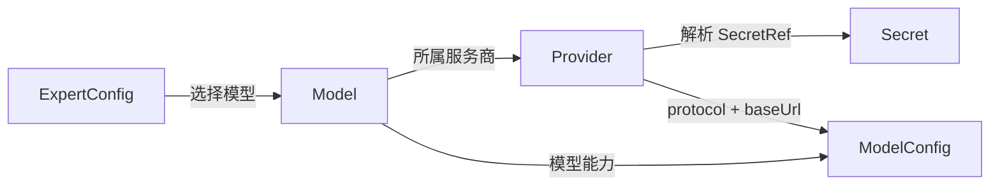

# Provider & Model

> 涉及模块：Provider 配置服务、Model 配置服务、ExpertConfig、LaunchSpecBuilder
>
> **状态：目标架构（未实现）**。本文描述 Provider 与 Model 的资源管理；版本能力遵循 [通用资源版本控制](./07-versioning.md)。

## 概述

Provider 表示一个 AI 服务商连接，Model 表示该服务商提供的具体模型。二者分离后，多个 Model 可以复用同一套协议、地址和密钥配置。

```mermaid
flowchart LR
    EC[ExpertConfig] -->|选择模型| M[Model]
    M -->|所属服务商| P[Provider]
    P -->|解析 SecretRef| S[Secret]
    M -->|模型能力| L[ModelConfig]
    P -->|protocol + baseUrl| L
```

## Provider 管理

Provider 管理以下业务信息：

- 服务商名称和组织内唯一标识；
- `openai`、`anthropic` 等受支持协议；
- `baseUrl` 及协议所需的连接参数；
- API Key 的 SecretRef，不保存明文；
- 是否允许跨组织公开读取。

接口响应不得返回完整密钥。密钥展示只提供安全掩码，短于四位的值全部显示为星号。未知协议、非法 URL 或无法解析的 SecretRef 在运行时拒绝使用。

## Model 管理

Model 属于一个 Provider，记录服务商模型标识 `modelId` 以及 context limit、cost、modalities 等能力元数据。`modelId` 是透传给 engine 的外部模型名称，不是平台资源 ID。

Model 的能力字段用于模型选择、参数校验和运行时限制。删除或停用 Provider 前必须检查其 Model；删除或停用 Model 前必须检查引用它的 ExpertConfig。

## 可用性状态

Provider 可用性是对外部服务的运行时观测，不属于 Provider 或 Model 的资源定义。可用性结果按组织和 Provider 引用隔离，并使用短 TTL 缓存；配置变化或显式刷新时使对应缓存失效。

探测失败不改写资源，仅更新观测状态。启动时仍应根据安全策略决定重新校验或直接拒绝。

## 与 ExpertConfig 的关系

ExpertConfig 选择一个 Model。LaunchSpecBuilder 沿 `ExpertConfig → Model → Provider` 解析模型能力、协议、地址和 SecretRef，生成运行时 `ModelConfig`。AgentConfig 不直接选择 Provider 或 Model。

Provider、Model 以及二者之间的引用采用通用版本能力，具体规则不在本领域重复定义。

## 跨组织共享

Provider 和 Model 可以分别配置公开读取。公开 Model 所引用的 Provider 也必须对使用方可读，否则该 Model 不能被成功解析。保存引用和运行时装配时都必须校验完整链路的可见性。
