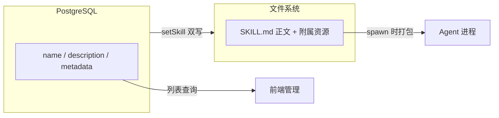

# Skills 配置

> 涉及模块：Skill 配置服务、Skill 文件系统、LaunchSpec Builder

## 概述

Skill 是 Agent 可挂载的技能模块——每个 Skill 包含一个 `SKILL.md` 文件，定义 Agent 的特定能力（如代码审查、文档生成）。Skill 采用 DB + 文件系统双存储架构。

## 存储架构

Skill 采用 DB + 文件系统双存储架构：

**核心契约：双写一致性**。创建或更新 Skill 时，必须**同时写入 DB 和文件系统**。只写 DB 会导致 Skill 内容不下发给 Agent。必须通过 `setSkill`/`importSkillDirectories` 创建，禁止直接调 `upsertSkill`。

## 与 AgentConfig 的关系

AgentConfig 通过 `agentConfigSkill` 多对多表绑定 Skill。更新 AgentConfig 时全量覆盖——新集合替换旧集合，不留残留绑定。

spawn 时 LaunchSpec Builder 将绑定关系转换为 `SkillConfig[]`：从文件系统源目录打包为 ZIP 归档 → 生成 HMAC 签名的一次性下载 URL → 注入到 `AgentLaunchSpec`。

详见 [Agent Config 资源引用](./04-agent-config.md)。

## 跨组织共享

Skill 支持 `publicReadable` 公开可读。跨组织引用时通过 resourceKey 标识。
