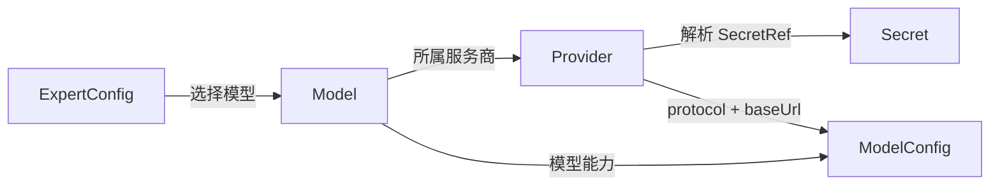
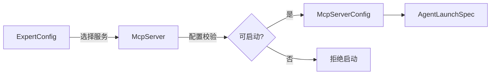

# 配置资源系统

> 涉及模块：Provider、Model、Skill、McpServer、ExpertConfig、ConnectorDefinition、UserConfig、跨组织共享
>
> **状态：目标架构（未实现）**。本文描述配置资源的职责和管理边界；通用版本语义以 [通用资源版本控制](./07-versioning.md) 为准。

## 概述

配置资源系统管理 Agent 运行所需的可复用资源。资源保存在各自的业务表中，按组织隔离，并通过明确的依赖关系组合为 AgentConfig。每类资源拥有自己的字段、校验和生命周期，不使用一张通用 JSON 资源表承载业务数据。

与 [Agent Config](./04-agent-config.md) 的分工：

- **04 号文档**描述 AgentConfig 聚合层：RuntimeConfig、ExpertConfigBinding、ConnectorBinding 三个聚合子对象，以及 ExpertConfig 与 ConnectorDefinition 两个独立资源；
- **本文档**描述 ExpertConfig 之下的资源层（Provider、Model、Skill、McpServer），不重复 AgentConfig 聚合规则。

Hindsight、RagFlow、Agent Sites 等外部服务不属于配置资源；它们通过普通 McpServer 引用接入，其技术架构见 [Hindsight 记忆模块架构](../developer/arch/hindsight-memory-architecture.md)。

## 资源目录

| 资源 | 管理内容 | 使用方 |
|------|----------|--------|
| Provider | AI 服务商协议、地址和密钥引用 | Model |
| Model | 服务商模型标识及能力元数据 | ExpertConfig |
| Skill | `SKILL.md` 与附属文件 | ExpertConfig |
| McpServer | 外部工具服务的连接配置 | ExpertConfig |
| ExpertConfig | 专家的模型、Skill、MCP 和行为配置 | AgentConfig |
| ConnectorDefinition | 可复用连接器定义 | AgentConfig |
| UserConfig | 用户偏好，例如默认 Agent | 用户自身 |

## 组合关系

```text
AgentConfig
├── ExpertConfig
│   ├── Skill
│   ├── McpServer
│   └── Model
│       └── Provider
└── ConnectorDefinition
```

资源关系由具体业务字段表达。多个上游可以共享同一下游，但禁止反向、自引用和未声明的跨类型关联。UserConfig 是用户偏好，不进入 AgentConfig 的资源依赖图。

依赖方向严格遵循 04 号文档的边界：AgentConfig 只直接组合 ExpertConfig 和 ConnectorDefinition；模型、Provider、Skill 与 MCP 由 ExpertConfig 管理，AgentConfig 不跨层直接绑定这些资源。

## 通用管理边界

- 每类资源由自己的 service 和 repository 管理，业务校验留在所属领域；
- 固定结构使用 PostgreSQL 类型字段和关系表，只有天然开放的配置片段才使用 JSON；
- 删除或停用前必须检查仍在使用该资源的上游，行为由具体资源定义；
- Secret 只保存引用，实际值在受控运行时边界解析；
- 资源列表、详情和引用选择器必须按组织与授权过滤；
- 运行时状态、探测结果和缓存不混入资源定义。

需要版本化的具体资源复用 [通用资源版本控制](./07-versioning.md)，作用域与落地清单见其 §2.1；资源的字段、子对象、业务不变量和运行时转换仍由各自领域负责。

## Provider & Model

> 涉及模块：Provider 配置服务、Model 配置服务、ExpertConfig、LaunchSpecBuilder

Provider 表示一个 AI 服务商连接，Model 表示该服务商提供的具体模型。二者分离后，多个 Model 可以复用同一套协议、地址和密钥配置。



### Provider 管理

- 服务商名称和组织内唯一标识；
- `openai`、`anthropic` 等受支持协议；
- `baseUrl` 及协议所需的连接参数；
- API Key 的 SecretRef，不保存明文；
- 是否允许跨组织公开读取。

接口响应不得返回完整密钥。密钥展示只提供安全掩码，短于四位的值全部显示为星号。未知协议、非法 URL 或无法解析的 SecretRef 在运行时拒绝使用。

### Model 管理

Model 属于一个 Provider，记录服务商模型标识 `modelId` 以及 context limit、cost、modalities 等能力元数据。`modelId` 是透传给 engine 的外部模型名称，不是平台资源 ID。

Model 的能力字段用于模型选择、参数校验和运行时限制。删除或停用 Provider 前必须检查其 Model；删除或停用 Model 前必须检查引用它的 ExpertConfig。

### 可用性状态

Provider 可用性是对外部服务的运行时观测，不属于 Provider 或 Model 的资源定义。可用性结果按组织和 Provider 引用隔离，并使用短 TTL 缓存；配置变化或显式刷新时使对应缓存失效。

探测失败不改写资源，仅更新观测状态。启动时仍应根据安全策略决定重新校验或直接拒绝。

## Skills

> 涉及模块：Skill 配置服务、Skill 内容存储、ExpertConfig、LaunchSpecBuilder
>
> **状态：已设计（未实施）**。Skill 内容将迁移到 S3（Bun 内置 `Bun.S3Client`，全量切换）；对象结构、上传/替换与失败补偿、PG 与 S3 一致性、孤儿清理、下载授权与下发协议见 [Skill 存储迁移 S3 设计](../design/2026-08-13-skill-s3-storage-design.md)。本文只定义 Skill 的领域边界。

### 概述

Skill 是 Agent 可挂载的技能资源。一个 Skill 由可查询的元数据和可执行的内容组成，内容通常包含 `SKILL.md` 及其附属文件。

### 资源边界

PostgreSQL 管理 Skill 的身份、名称、说明、所有权、可见性和内容定位信息（`content` 原文 + `objectKey` 引用指针）；S3 保存下发归档（单一 zip 对象，内容寻址 key）。元数据存在但内容不可读的 Skill 不可用于启动。

S3 存储的关键规则（详见设计文档）：

- object key 使用 `skills/{organizationId}/{skillId}/{sha256}.zip`，改名不影响存储位置；
- 写路径遵循「对象先行、指针后行」，PG 可见的 `objectKey` 恒指向已存在对象；
- 孤儿对象由路径内清理 + GC + 可选 lifecycle 规则三层兜底；
- 下发采用 S3 presign URL，只允许短期访问目标对象。

### Skill 管理

- 创建和导入必须同时建立有效元数据与内容，不能只写数据库；
- `SKILL.md` 必须可解析，并在边界处校验名称、说明和所需结构；
- 附属文件路径必须防止绝对路径、目录穿越和符号链接逃逸；
- 更新、删除和恢复必须由 Skill 服务编排存储操作及补偿；
- 内容大小、文件数量和归档大小需要明确上限；
- Secret 不得写入 Skill 内容、元数据或下载 URL。

Skill 采用通用版本能力。`objectKey` 随版本行复制、锁定版本对象永不回收的语义见 [07-versioning](./07-versioning.md) §9；S3 对象结构、写入编排与回收细则见 [Skill 存储迁移 S3 设计](../design/2026-08-13-skill-s3-storage-design.md)。

## MCP Server

> 涉及模块：MCP Server 配置服务、MCP Tool 缓存、ExpertConfig、LaunchSpecBuilder

### 概述

McpServer 是 Agent 可调用的外部工具服务配置。它负责描述连接方式，不保存某次运行的连接实例或工具执行结果。



### 支持类型

| 类型 | 说明 | 核心字段 |
|------|------|----------|
| `local` | 命令行启动（stdio transport） | `command`、`args`、`env`、`timeout` |
| `remote` | URL 连接（SSE transport） | `url`、`headers`、`oauth` |
| `streamable-http` | Streamable HTTP 连接 | `url`、`headers`、`timeout` |
| `disabled` | 显式停用该服务 | `enabled: false`，config 为空 |

类型决定配置 schema。保存时必须完成独立转换和校验，不能把未经校验的协议 DTO 直接作为持久化模型。headers、oauth 和 env 中的敏感值只保存 SecretRef。

### McpServer 管理

- `local` 必须有非空 command，并限制参数与环境变量；
- 远程类型必须使用允许的 URL scheme，并执行 SSRF 防护；
- timeout 必须有合理上下限；
- `disabled` 不参与运行时装配；
- 停用或删除前应能查询引用它的 ExpertConfig；
- 外部连通性检查是辅助反馈，不能替代保存时的结构校验。

McpServer 采用通用版本能力，版本字段、锁定和引用规则不在本领域重复定义。

### Tool 缓存

`mcpTool` 保存最近一次从目标服务发现的工具列表及检查时间。它是可刷新、可失效的运行状态，不属于 McpServer 资源定义。

同一 McpServer 引用的工具集合在事务内原子替换，避免读取到半套结果。连接配置变化、显式刷新或缓存过期时重新发现；探测失败保留诊断信息，但不得泄露凭据。

### 外部服务集成

Hindsight 等外部服务复用普通 McpServer 接入，不在配置资源系统中新增专用资源类型或记忆开关：ExpertConfig 通过 McpServer 引用启用，连接配置由集成服务生成或校验，版本行为与其他 McpServer 相同。外部服务的部署、代理、bank 隔离和前端呈现属于技术工程范畴，见 [Hindsight 记忆模块架构](../developer/arch/hindsight-memory-architecture.md)。

## 与 ExpertConfig 的关系

ExpertConfig 是各资源的直接消费方，AgentConfig 通过 ExpertConfig 间接使用这些资源（见 04 号文档的依赖边界）：

- ExpertConfig 选择一个 Model。LaunchSpecBuilder 沿 `ExpertConfig → Model → Provider` 解析模型能力、协议、地址和 SecretRef，生成运行时 `ModelConfig`。AgentConfig 不直接选择 Provider 或 Model；
- Agent 不直接绑定 Skill。ExpertConfig 维护所需 Skill 的有序集合；保存时校验资源存在性、可见性和重复项。LaunchSpecBuilder 解析该集合，将内容转换为 `SkillConfig[]` 并按运行协议下发；
- ExpertConfig 保存一组 McpServer 引用。保存时拒绝重复或无权访问的目标；启动时再次检查引用存在、权限、安全撤销和配置合法性，再转换为 `McpServerConfig` 注入 `AgentLaunchSpec`。

多个 ExpertConfig 可以共享同一 Skill 或 McpServer，任一 ExpertConfig 的修改不得隐式更新目标资源或 Skill 内容。

## 跨组织共享

资源默认仅本组织可见。允许公开的资源可以被其他组织引用，但公开读取不授予修改、删除或转授权能力。跨组织引用必须保留来源组织，并在保存和运行时重新校验授权。

各类资源的补充规则：

- **Provider / Model**：可以分别配置公开读取。公开 Model 所引用的 Provider 也必须对使用方可读，否则该 Model 不能被成功解析。保存引用和运行时装配时都必须校验完整链路的可见性；
- **Skill**：公开内容的签名下载凭据必须短期有效且只允许访问目标对象；
- **McpServer**：配置可见不代表敏感值可见，调用方仍需拥有其 SecretRef 所指密钥的使用权限，也不自动授予外部服务访问权。

## 上下级关系

- **← ExpertConfig**：按 04 号文档的边界消费 Model、Skill 与 McpServer；
- **← AgentConfig**：通过 ExpertConfig 间接组合本层资源，禁止跨层直接绑定；
- **→ LaunchSpecBuilder**：消费完整资源图并生成 `AgentLaunchSpec` 的运行时配置；
- **→ 通用版本控制**：提供统一的版本能力，不进入各资源领域规则。
