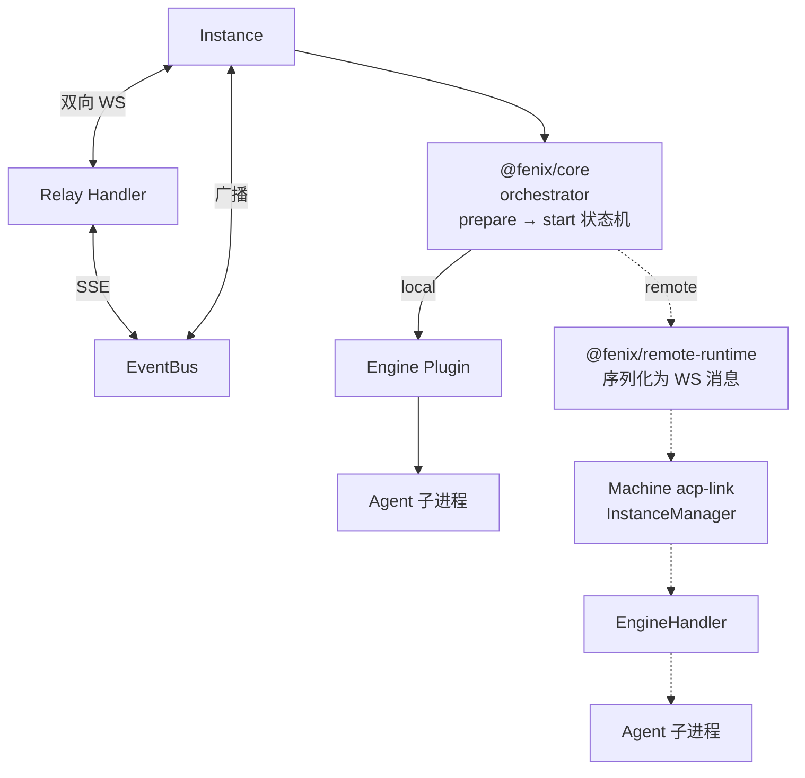
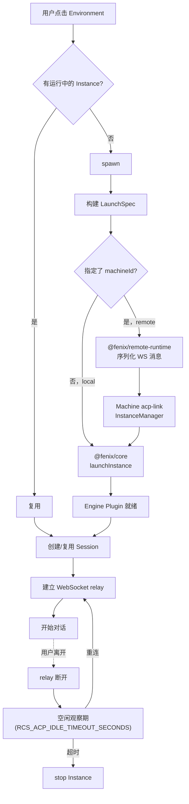
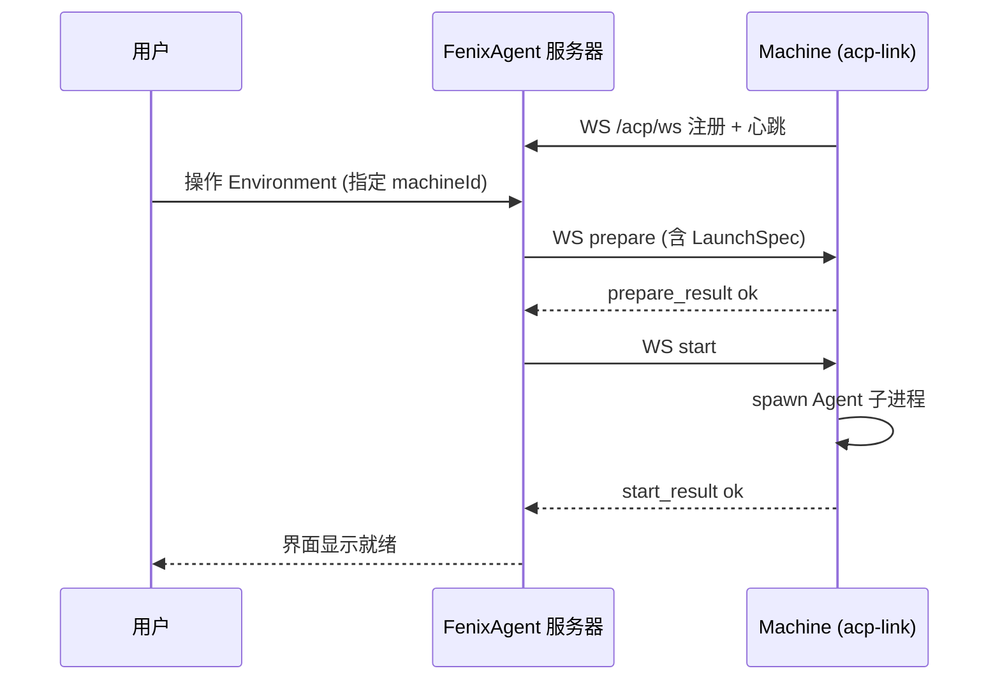

# Agent 实例

> 涉及模块：Instance 服务、@fenix/core、acp-link InstanceManager、Relay Handler、EventBus

## 概述

Instance 是 Agent 的运行实例——Agent Config 定义能力规格，Instance 是这些规格的运行时载体。一个 Environment 同一时间可运行多个 Instance，可部署在本地或远端 Machine。

## 组件关系



| 关系 | 说明 |
|------|------|
| Instance ↔ Relay | local：同进程 relay handle 直连；remote：Machine WS 注册中继 |
| Instance ↔ EventBus | 工具调用、文件变更、状态切换写入 per-session EventBus，广播给所有 relay 连接 |
| Relay ↔ EventBus | Relay 订阅 Session EventBus，SSE 断线时通过 `last-event-id` 续传 |

## 生命周期



Spawn 策略由 Environment 统一管理：自动启动开关、并发上限、远程部署配置。

spawn 时的资源注入详见 [Agent Config 资源引用](./04-agent-config.md)。

## Session 与 Instance

Session 由 Agent 进程管理，FenixAgent 不存储、不管理——只做消息透传。前端通过 ACP 协议与 Agent 进程协商 Session 的创建、加载、切换。

```
Instance（运行载体）
    │
    ├── Session A ←→ Relay ←→ 前端用户 1
    └── Session B ←→ Relay ←→ 前端用户 2（待支持）
```

- 一个 Instance 可承载多个 Session，每个 Session 有独立的 EventBus（per-session 广播）
- 当前架构：同一 Instance 只能有一个活跃的 ACP Session——Machine 端的 SessionManager 用单字段追踪 `currentAcpSessionId`，第二个用户创建新 Session 会覆盖前一个
- Relay 层已支持多连接（多个 `RelayConnectionEntry` 共享同一个 relay handle），但底层的 Session 并发还需后续实现
- 前端切换历史会话时发 `session/load`，不创建新 Instance
- Instance 停止时，其上的所有 Session 随之结束

## 远程部署

Instance 指定 machineId 时，FenixAgent 服务器将完整的 LaunchSpec 通过 WS 协议发送到远端 Machine。Machine 端的 `acp-link` 接收消息后，由 InstanceManager + EngineHandler 完成配置写入和子进程启动——与本地 @fenix/core 是等价的调度角色。




**远端和本地的对应关系**：

| 本地 | 远端 Machine | 职责 |
|------|-------------|------|
| @fenix/core orchestrator | acp-link createAcpClient | 接收指令、回复状态 |
| Engine Plugin Runtime | InstanceManager + EngineHandler | 写入配置、启动进程 |
| Engine Plugin | EngineHandler (opencode-handler) | 引擎特定的 spawn 逻辑 |
| relay handle | WS relay 信封 | 消息双向透传 |

## 上下级关系

- **← Environment**：spawn 入口，提供配置上下文（workspace / secret）
- **← Agent Config**：配置蓝图，spawn 时组装为 LaunchSpec。详见 [Agent Config 文档](./04-agent-config.md)
- **→ Agent 接口**：relay 连接建立后在此交互。详见 [Agent 接口文档](./05-chat.md)
