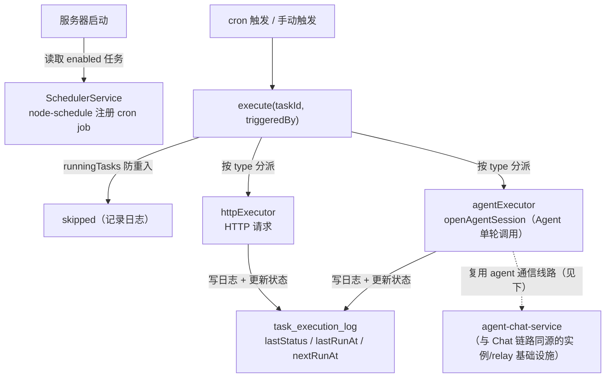

# 定时任务

> 状态：权威文档（2026-08-12 重写，对齐 `scheduled_task_v2` 实现：`src/services/scheduler/`、`src/services/task-v2.ts`、`src/routes/web/tasks-v2.ts`）。旧版 `scheduled_task` 表已下线（迁移 `remove-scheduled-task-v1`），历史数据不迁移。
> 约定：描述与代码一致的真实架构；实现文件以相对路径引用。

## 这个模块干什么

定时任务系统是 **HTTP Cron 触发器 + Agent 执行器**双类型系统——用户配置 cron 表达式，系统按时执行任务并记录日志。支持手动触发、启用/禁用、分页查询历史。

核心模块分工：

- **调度引擎**——`SchedulerService`（`src/services/scheduler/index.ts`）基于 `node-schedule` 管理 cron job 的注册和取消；按任务 `type` 分派到对应 executor；启动时加载、停止时取消
- **任务管理**——任务的 CRUD（`src/services/task-v2.ts`）、执行协调、日志写入
- **执行器**——按类型注册：`httpExecutor`（HTTP 请求）与 `agentExecutor`（Agent 执行），见 [执行器](#执行器)



## 数据模型

### `scheduled_task_v2` 表

| 字段 | 类型 | 说明 |
|------|------|------|
| `id` | uuid | 主键 |
| `userId` | text | 创建者（引用 `user` 表） |
| `organizationId` | text | 所属组织 |
| `name` | varchar | 任务名称 |
| `description` | text | 任务描述 |
| `cron` | varchar | 5 字段 cron 表达式 |
| `timezone` | varchar | 时区（可选） |
| `enabled` | boolean | 是否启用（默认 true） |
| `timeoutSeconds` | integer | 执行超时秒数（默认 300） |
| `agentId` | uuid | Agent ID（仅 agent 类型，引用 `agent_config`，删除置空） |
| `type` | varchar | 任务类型：`http` / `agent` |
| `definition` | jsonb | 类型化定义（见下） |
| `lastRunAt` / `nextRunAt` | timestamp | 最近/下次执行时间 |
| `lastStatus` | varchar | 上次执行状态 |
| `createdAt` / `updatedAt` | timestamp | 时间戳 |

`definition` 按类型区分：

- **http**：`{ url: string, method?: string, headers?: Record<string,string>, body?: string }`（method 默认 POST）
- **agent**：`{ prompt: string }`

### `task_execution_log` 表

| 字段 | 类型 | 说明 |
|------|------|------|
| `id` | uuid | 主键 |
| `taskId` | uuid | 关联任务（CASCADE 删除） |
| `status` | varchar | 执行状态：success / failed / timeout / skipped |
| `error` | text | 错误信息 |
| `duration` | integer | 执行耗时（毫秒） |
| `triggeredBy` | varchar | cron / manual |
| `workspacePath` / `workspaceName` | varchar | Agent 执行器的工作区信息 |
| `taskSnapshot` | jsonb | 执行时的任务定义快照 |
| `skipReason` | text | 跳过原因 |
| `resultSummary` | text | 结果摘要（截断至 2000 字符） |
| `createdAt` | timestamp | 创建时间 |

## 执行器

### httpExecutor（HTTP 请求）

- method 默认 POST（GET 不携带 body），无 Content-Type 时自动补 `application/json`
- 超时经 `AbortSignal.timeout(timeoutSeconds)` 控制
- 结果按 `response.ok` 判定 success / failed，响应体截断至 2000 字符作为 `resultSummary`
- HTTP 任务的典型用法是调用 Workflow 系统提供的 URL，由 Workflow 封装 Agent 编排，任务本身不需要知道 Agent 的存在

### agentExecutor（Agent 执行）

agent 类型任务**复用现有的 Agent 通信线路**，不创建独立的执行通道：

- 通过 `openAgentSession`（`src/services/agent-chat-service.ts`）以 `agentId` 对应的 Agent 执行 `prompt`（`startSource: "scheduled"` 透传到实例审计字段）
- `openAgentSession` 是**程序化单轮调用**的权威路径：解析 `agentConfigId → environment` → `spawnInstanceViaController` 创建**独立实例**（不复用，`dispose` 时自动销毁）→ 连接 relay → `createAgentSession` → `startPromptTurn`
- 它与交互式 Chat（`packages/chat-channel`，见 [19-yjs-chat-streaming](./19-yjs-chat-streaming.md)）共享同一套实例/relay 基础设施（`connectAgentRelay`、编排域），但**实例策略独立**：本路径每次创建独立实例并负责销毁，不走 `ensureRunning` 复用
- 从 ACP 事件流提取纯文本输出作为 `resultSummary`：只保留 `session/update` 通知中 `update.sessionUpdate === "agent_message_chunk"` 的 `update.content.text`，过滤 tool_call / tool_result 帧与 JSON-RPC result（`stopReason` 为结束信号，不参与提取），截断至 2000 字符

```text
cron 触发 → agentExecutor.execute
    │
    ▼
openAgentSession(userId, agentConfigId, organizationId, startSource="scheduled")
    │  每次创建独立实例（spawnInstanceViaController），dispose 时销毁
    ▼
turn.prompt([{ type: "text", text }]) → 流式消费事件
    │
    ├── stopReason 到达 → 正常结束
    ├── AbortSignal 超时（timeoutSeconds）→ status=timeout
    └── 异常 → status=failed（保留错误信息）
    │
    ▼
extractPlainText(events) → resultSummary（≤2000 字符）
```

## 核心流程

### 调度注册与触发

服务器启动时从 DB 读取所有 `enabled=true` 的任务，逐个注册到 `node-schedule`；非法 cron 表达式注册失败并计数告警（任务仍保留在 DB）。停止时取消全部 job 并清空 `runningTasks`。

每次触发（cron 或手动 `POST /tasks/v2/:id/trigger`，均走 `schedulerService.execute(taskId, triggeredBy)`）：

```text
触发
  │
  ▼
runningTasks 已在执行中? ──是──▶ 写 skipped 日志（skipReason=previous_run_still_active），更新 lastStatus=skipped，跳过本次
  │否
  ▼
标记 runningTasks；重新读取任务（不存在/已禁用 → 取消调度并失败）
  │
  ▼
按 type 分派 executor（http / agent）；无对应 executor → 写 failed 日志
  │
  ▼
写执行日志，更新任务 lastStatus / lastRunAt / nextRunAt
  │
  ▼
finally：清除 runningTasks 标记
```

**防重入语义**：同一任务的并发触发（如 cron 与手动触发撞车）只会执行一次，第二次记录 `skipped`；`runningTasks` 是进程内集合，多实例部署时由部署层保证单实例调度（见 [37-coordinate-scheduler-with-distributed-leases](../../need-to-change/37-coordinate-scheduler-with-distributed-leases.md) 的分布式租约设计）。

### 任务变更的调度同步

| 变更 | 调度行为 |
|------|---------|
| 创建（enabled） | 注册 cron job，写入 `nextRunAt` |
| 更新（cron / timezone / enabled 变化） | 自动重新调度；**type 不可修改** |
| 删除 | 取消调度并删除任务（日志 CASCADE 删除） |
| toggle 禁用 | 取消调度；已触发未完成的任务本次继续执行完毕 |

## 任务管理 API

| 方法 | URL | 说明 |
|------|-----|------|
| GET | `/web/tasks/v2` | 列出任务（分页，支持 keyword / type / agentId 筛选） |
| POST | `/web/tasks/v2` | 创建任务（name、cron、type 必填；agent 类型需 agentId + prompt） |
| GET | `/web/tasks/v2/:id` | 获取任务详情 |
| PUT | `/web/tasks/v2/:id` | 更新任务（cron/时区/enabled 变化时自动重新调度；**type 不可修改**） |
| DELETE | `/web/tasks/v2/:id` | 删除任务并取消调度 |
| POST | `/web/tasks/v2/:id/toggle` | 切换启用/禁用 |
| POST | `/web/tasks/v2/:id/trigger` | 手动触发一次执行 |
| GET | `/web/tasks/v2/:id/logs` | 分页查询执行日志 |
| DELETE | `/web/tasks/v2/:id/logs` | 清空任务所有日志 |

## 权威边界

| 关注点 | 权威实现 |
|--------|---------|
| Agent 单轮调用线路（agent 类型任务） | `openAgentSession`（`src/services/agent-chat-service.ts`），独立实例、dispose 销毁；**不走** 19 号 YJS 交互链路与 `ensureRunning` 复用 |
| 交互式 Chat（YJS 链路） | [19-yjs-chat-streaming](./19-yjs-chat-streaming.md)（仅作对比，本模块不消费 Y.Doc） |
| 实例编排与生命周期 | [20-orchestration-management](./20-orchestration-management.md)（`spawnInstanceViaController`） |
| 任务多租户隔离 | 任务表带 `organizationId` / `userId`，路由按组织与所有权过滤（见 [03-permission-resource](./03-permission-resource.md)） |

## 和其他模块的关系

- → **数据库 Schema**：操作 `scheduledTaskV2` 和 `taskExecutionLog` 表
- → **数据访问层**：任务仓储（`src/repositories/task-v2.ts`）和日志仓储（`src/repositories/task.ts`）
- → **Agent 会话服务**：agent 类型经 `openAgentSession` 执行 prompt（复用 Agent 通信线路，见上）
- → **Workflow**：http 类型的典型场景是调用 Workflow URL，由 Workflow 封装 Agent 编排
- ← **服务器入口**：启动时注册 job，关闭时取消所有 job
- ← **路由层**：`src/routes/web/tasks-v2.ts` 调用任务 CRUD 函数
