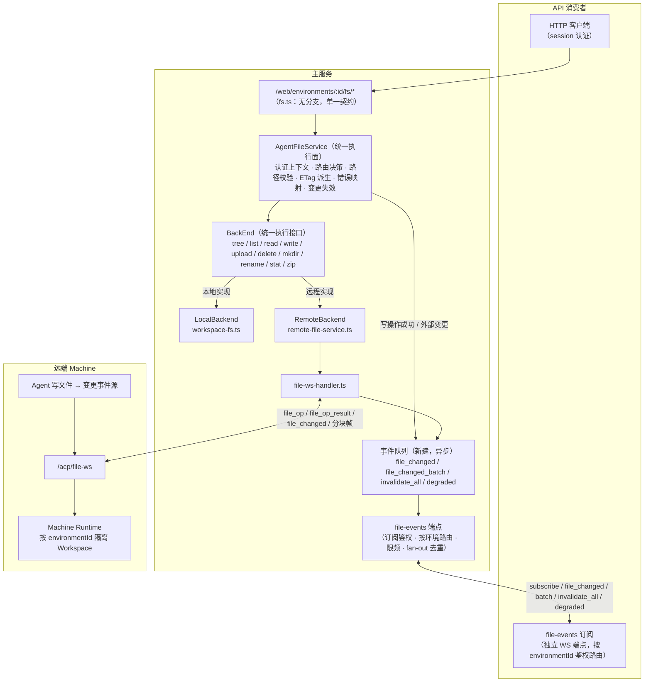
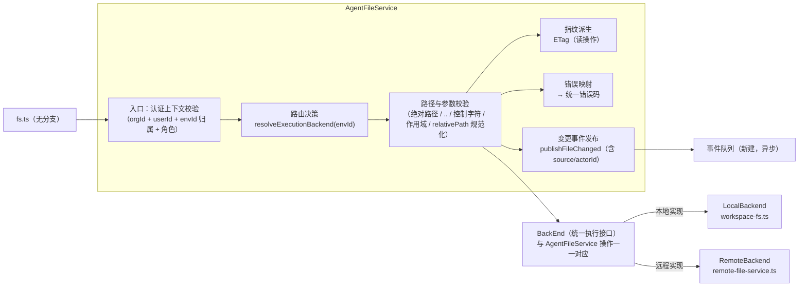
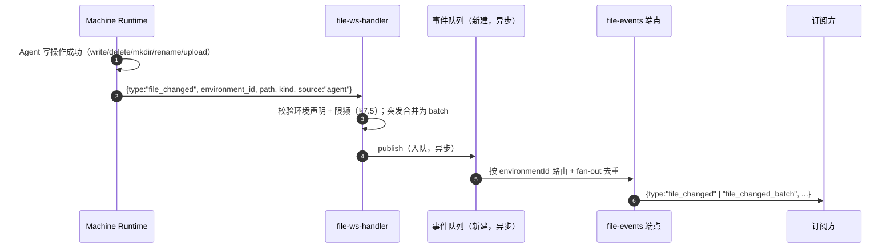
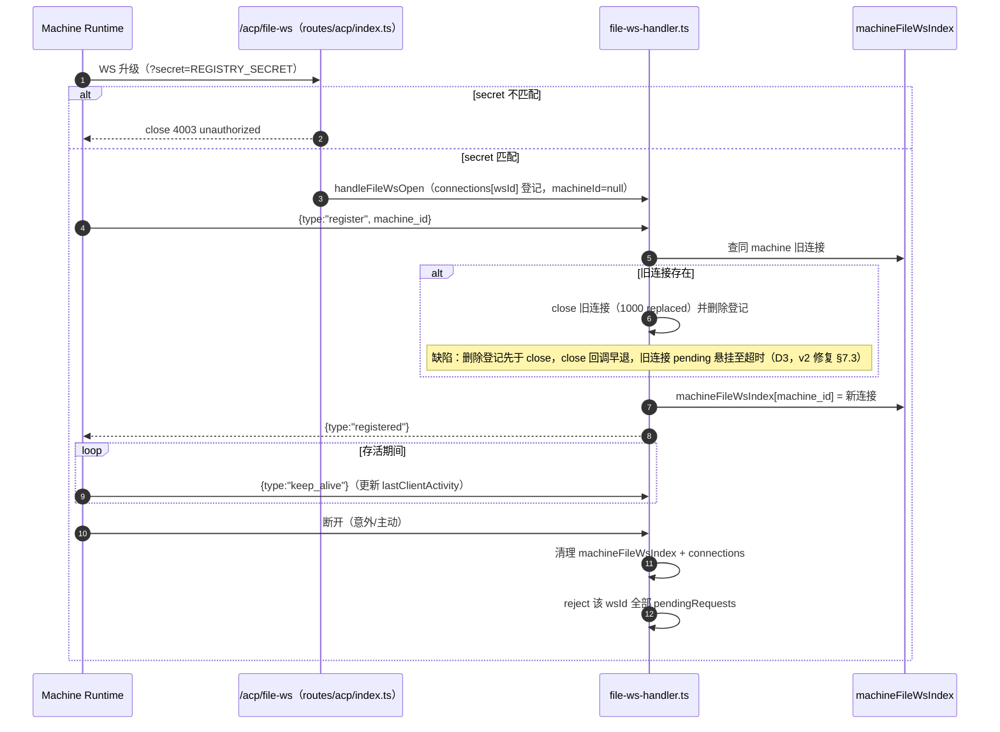

# 文件系统操作传递（权威实现基线）

> 状态：实现基线（2026-08-05 重写，对抗审查 + 三视角用户挑战修订）。§1–§3、§5–§6 为现状契约；§2/§4 与 §7 为**理想态设计**（统一执行面 + 防缓存机制 + v2 协议），评审待办，暂未实施。
> 旧版文档（`/user`、`/user-file` 路由体系）**文档层面已废弃但代码仍挂载**（双面并存，见附录 A），保留于附录 A 供历史追溯与迁移指引。
> 定位：Agent 编排域（acp-ws / AgentNode）见 `docs/arch/20-orchestration-management.md`；Chat 流式（YJS）见 `docs/arch/19-yjs-chat-streaming.md`。文件信道与 acp-ws 是**两条平行的机器级信道**，本文档只描述文件信道。
> 范围：本文档只定义**服务端**的文件操作传递契约（主服务 + 远端 Machine），不覆盖前端消费方式；HTTP 侧契约（路由、错误码、条件请求）对任何 API 消费者统一。file_changed 订阅经独立 WS 端点（§4.3）承载，**不**复用 YJS/relay 通道。
> 约定：描述与代码一致的真实架构；理想态设计以"§"标注待办，实施时先更新本文档再改代码。关键实现文件以相对路径引用。

## 1. 总体架构（理想态）

> 本图为**目标状态**：文件执行面收敛为单一 `AgentFileService`，执行经 `BackEnd` 抽象分化 Local/Remote 两个实现；防缓存由"条件请求 + 变更事件"双机制保证；机器文件能力经 `file-events` 端点对订阅方可见。现状差异见 §1.2。



**三条核心不变量：**

1. **执行面单一**：路由层只调 `AgentFileService`，不出现 `if (machineId)` 双分支；执行统一收敛到 `BackEnd` 抽象层，由它分化 `LocalBackend` / `RemoteBackend` 两个实现（§2）。新操作只实现一次，不存在"本地支持、远程遗忘"。
2. **文件随时变，视图不缓存死**：所有读响应带 ETag 条件请求（§4.2）；文件变更（含机器端 Agent 写入）经 `file_changed`/`file_changed_batch` 事件回流（§4.3），断连窗口由 `invalidate_all` 兜底收敛（§7.3）。
3. **API 消费者无 backend 概念**：响应结构、错误码、变更事件全部统一，消费者不知道文件在哪台机器上执行（§2.4）。能力上限差异（如 upload 大小）必须显式声明，不得暗含。

**机器能力矩阵（与编排域的边界）**：

- 文件信道与 acp-ws 生命周期**互相独立**（文件信道不随 Instance 创建/销毁）。机器能力 = acp 可达 × file 可达 的 2×2 组合；"file 降级"（acp-ws 正常、file-ws 断连）与"机器离线但文件可用"（acp-ws 断连、file-ws 存活）由本文档 §7.4 降级事件表达，**不**扩展 20 号文档机器状态机（20 号文档 §2.1 保持 pending/online/offline，交叉引用本文档）。
- **Agent 的 ACP 文件工具（read_file/write_file 等）经 acp-ws 由机器端 Agent Engine 执行，与 file-ws 无依赖**；file-ws 断连**不影响** Agent 工具可用性，只影响 API 消费者。
- **T6 状态注记（残留进程写入）**：acp-ws 断连、file-ws 存活时（机器"离线但文件可用"），文件变更事件源可能包含**未被清理的机器端残留进程**（20 号文档 §12 T1）——"已停止 Agent 的文件仍在变化"应先检查机器端进程残留。T1 修复（重连携带旧 instanceId 终止列表）与 v2 身份绑定（§7.1）同为机器端注册协议改动，**建议同批次实施**（§10 破坏性升级窗口）。

### 1.2 现状 → 理想态差异

| 维度 | 现状 | 理想态 |
|---|---|---|
| 路由层 | 每个端点 `if (machineId)` 双分支（`fs.ts`） | 单一 `AgentFileService` 调用 |
| 路径校验 | 本地 `resolveWorkspacePath` 有校验（但 upload `relativePath` 可 `../` 逃逸，D16）；远程直接透传 | 统一前置校验（§2.4） |
| 错误语义 | 本地 404/400/413，远程 503 `remote_error`（message 透传机器端）；无 403 角色概念 | 统一错误码表（§2.4，含 403/422/429） |
| 缓存控制 | 无 ETag / Last-Modified / 变更事件 | 条件请求 + `file_changed`/`file_changed_batch`（§4） |
| 变更通道 | 无 | 独立 `file-events` WS 端点（§4.3） |
| download-zip | 仅本地，远程 501 | 远程经 `file_op "zip"` 补齐（§7.9） |
| 前端超时 | 前端 30s vs 后端 60s/120s 错位（D19） | 写操作前端超时不短于后端（§10 P1） |

## 2. AgentFileService（统一文件服务层）

> 理想态设计（评审待办）。目标：把"本地/远程双实现"收敛为"一个契约、一个 `BackEnd` 抽象、两个实现"。

### 2.1 内部结构

`AgentFileService` 是路由层与执行后端之间的**唯一门面**，内部职责严格分层；执行经 `BackEnd` 抽象分化本地/远程：



| 子模块 | 职责 | 不负责 |
|---|---|---|
| 入口（认证上下文） | 校验 orgId/userId/envId 归属 + **角色权限**（403 语义，现状 `getOwnedEnvironment` 无角色检查） | 协议接入、鉴权细节 |
| 路由决策 | `resolveExecutionBackend`：按 machineId 回退链选 Local/Remote（§3） | 执行本身 |
| 路径与参数校验 | 统一前置校验（§2.4），**upload relativePath 规范化**（修复 D16） | 机器端最终隔离 |
| BackEnd（统一执行接口） | 定义十个操作契约，向 LocalBackend / RemoteBackend 分化执行 | 校验、指纹、错误映射、路由决策 |
| 指纹派生 | 读操作统一计算 ETag（§4.2） | 缓存存储（第一版无状态；事件驱动指纹失效列为 P1，有界缓存二期） |
| 错误映射 | BackEnd 异常 → 统一错误码（§2.4），message 模板化 | 日志记录（保留诊断上下文到服务端日志） |
| 变更事件发布 | 写操作成功 / 外部变更 → `publishFileChanged`（含来源字段，§4.3） | 订阅管理、限频细节 |

### 2.2 统一接口

```ts
interface AgentFileService {
  tree(envId, path?): TreeResult;              // 递归文件树（黑名单过滤 + mtime）
  list(envId, path): FileEntry[];              // 列目录
  read(envId, path, mode: "text"|"binary"|"auto"): ReadResult;
  write(envId, path, content): WriteResult;    // 文本写入
  upload(envId, dir, files): UploadResult;     // 多文件上传
  delete(envId, path): void;
  mkdir(envId, path): void;
  rename(envId, oldPath, newPath): void;
  stat(envId, path): StatResult;
  downloadZip(envId, path): ReadableStream;    // 理想态：本地/远程均支持
}
```

- `envId` 之后的所有参数来自**已认证环境上下文**（organizationId + userId + actorId 由调用链注入），API 消费者不可直接指定。
- 实现选择（LocalBackend / RemoteBackend）由"路由决策"子模块按 §3 回退链决定，对路由层不可见。
- **操作者身份（契约先行，审计字段）**：所有写操作由 AgentFileService 注入 `actorId`（userId 或 instanceId）与 `source`（`user` / `agent` / `api`），写入变更事件与（未来）审计落库的契约字段（§4.3/§7.5）。本期只定义字段，不实现审计落库。

### 2.3 BackEnd 抽象

`BackEnd` 是执行层的**稳定契约**：接口与 AgentFileService 的十个操作一一对应，`AgentFileService` 只依赖该接口，不感知具体实现。新增第三种执行面（如远程存储、Bridge 环境）时只新增实现，不改门面与路由。

| 操作 | LocalBackend（workspace-fs.ts） | RemoteBackend（remote-file-service.ts） |
|---|---|---|
| tree | `listPathsRecursive(workspaceDir)` | `remoteTree` |
| list | `listDirectory` | `remoteListDir` |
| read | `readFileContent` / `createFileStream` | `remoteReadFile` / `remoteReadBinaryFile` |
| write | `writeFileContent` | `remoteWriteFile` |
| upload | 本地 multipart 落盘（100MB） | `remoteUploadFiles`（base64，120s，v2 上限 20MB） |
| delete | `deleteNode`（**目录递归一次完成**） | `remoteDeleteFile`（v2 明确目录递归语义，§7.6） |
| mkdir | `mkdirp` | `remoteMkdir` |
| rename | `renamePath` | `remoteRename` |
| stat | `stat` + `isTextFile` | `remoteStat` |
| downloadZip | 系统 `zip` 流式（本地） | `file_op "zip"`（v2，§7.9；现状 501） |

- 两端**不允许**在接口之外产生额外行为（例如现状"本地校验 user/ 作用域、远程不校验"必须在 AgentFileService 统一层消除，backend 只负责执行）。

### 2.4 统一契约（消费者无感保证）

| 契约 | 规则 |
|---|---|
| 路径校验 | AgentFileService 统一前置：拒绝绝对路径、`..` 段、NUL/控制字符；相对路径须落在环境作用域；**upload 的 relativePath 先规范化再 join（修复本地 `../` 逃逸，D16）**；校验失败 → `400 validation_error` |
| 错误码 | `400 validation_error` / `403 forbidden` / `404 not_found` / `413 payload_too_large` / `422 config_error` / `429 busy`（+ `Retry-After`）/ `503 file_service_unavailable`。**现状无 403 角色概念**（`getOwnedEnvironment` 只查归属，成员对共享环境读写自由，权限失败伪装 404）——v2 引入角色化授权，403 与 404 分离（403=有环境但无操作权限，404=环境不存在或不可见） |
| message 语义 | **message 是面向用户的模板化文案（i18n）**，机器端错误细节只进服务端日志；machineId 为组织可见资源标识可保留（供诊断），机器内部路径/错误栈必须脱敏 |
| 响应结构 | 全部 `{ success, data }`，backend 差异不外泄（不出现 `remote_error` 之类的 backend 专属类型）；`/api/*` 文件面（第三套实现 `api-workspace.ts`）收敛到本契约时另行评估（§10） |
| 变更事件 | 任何 backend 的写操作成功都由 AgentFileService 统一发布 `file_changed`（含 `source`/`actorId`，§4.3） |
| 条件请求 | 所有读操作由 AgentFileService 统一派生 ETag（§4.2） |
| **能力上限不对称条款** | 本地/远程的**能力上限差异必须显式声明**（如 upload：本地 100MB、远程 v2 20MB；zip：远程 ≤100MB），不落入"消费者无感"承诺——无感指结构，不是能力。差异需在响应或文档可查（§7.6） |

**machineId 配置校验（v2，区分三种根因）**：`getRemoteMachineId` 增加 DB 存在性校验——machineId 不存在于组织 → `422 config_error`（message 提示去管理面检查配置）；存在但 file-ws 未连 → `503 file_service_unavailable`（现状三种根因都归 503，误导排障）。

## 3. 路由契约（/web/environments/:id/fs/*）

> 现状契约。理想态下路由层只做"认证 + 参数校验 + 调 AgentFileService"，本表行为不变。

全部端点要求 session 认证；`{id}` 为 environmentId（旧 `/user`、`/user-file` 前缀已废弃但**代码仍挂载**，见附录 A）。

| 方法 | URL | 说明 | 理想态 |
|------|-----|------|--------|
| GET | `/fs/tree` | 递归文件树（黑名单过滤 + mtime） | ETag 条件请求；超大目录分页/深度限制逃生舱（§4.2） |
| GET | `/fs` | 列目录，`?path=` 相对路径 | ETag 条件请求 |
| GET | `/fs/*` | 读文件：`?preview=true` 二进制预览；否则 `mode` 显式（v2 移除静默回退） | ETag 条件请求 |
| POST | `/fs/*` | 上传（multipart / 相对路径数组），本地 100MB / 远程 v2 20MB（§7.6） | 写后广播变更 |
| PUT | `/fs/*` | 写入文本内容 | 写后广播变更 |
| DELETE | `/fs/*` | 删除单个文件（v2 明确目录递归语义） | 写后广播变更 |
| POST | `/fs/mkdir` | 创建目录 | 写后广播变更 |
| POST | `/fs/rename` | 重命名/移动 | 写后广播变更 |
| DELETE | `/fs/batch` | 批量删除，返回成功/失败列表（错误项返回错误码而非机器端原文） | 写后广播变更 |
| GET | `/fs/download-zip` | 目录打包 zip 流式下载；**当前仅本地，远程 501** | 远程补齐（§7.9） |

**machineId 回退链**（`getRemoteMachineId`，现收敛为路由决策子模块）：`agentConfig.machineId` → `RCS_DEFAULT_MACHINE_ID` → `null`（本地）。决策不缓存，每次请求实时判定；file-ws 连接状态以 `isFileWsConnected(machineId)` 为准。**拒绝静默回退**：配置了远程 Machine 但 file-ws 未连接时 → `503 file_service_unavailable`，避免"文件在远程、实际落在本地"的分裂场景。

**配置语义警告（Agent 作者视角修订）**：

- **`RCS_DEFAULT_MACHINE_ID` 是部署级全局兜底，故障半径 = 整个平台**：多机器组织中，未显式配置 machineId 的 agentConfig 全部静默落到默认机器。多机器组织必须为每个 agentConfig 显式配置 `machineId`；留空 = 本地仅适用于单机部署。§3"拒绝静默回退"只覆盖"配了 machineId 但未连接"，**不覆盖"未配置但被全局默认值劫持"**——部署文档必须明示。
- **换 machineId 不迁移文件**：改 machineId A→B 后，环境文件树变空（数据仍在 A 的 workspace）。无跨机器迁移通道（人工 zip 下载→上传；远期提供搬运工具），文档此条即契约。

**排他性**：回退链是**环境级排他**的（同一环境要么本地要么远程，remote-file-service.ts:16-49 无混合路径）。"本地+远程混合写同一文件"的场景**不成立**，§4.4 的冲突语义只讨论"多消费者"与"消费者 vs Agent"与"多 Agent 实例"。

**workspace 路径不变量**：`{WORKSPACE_ROOT}/{organizationId}/{userId}/{environmentId}`，DB `workspacePath` 为历史字段，不得用于推导真实目录。

## 4. 防缓存与一致性机制（文件随时变）

> 理想态设计（评审待办）。背景：Agent 在机器上运行时会持续读写 workspace 文件（本地执行时同理），任何文件视图（API 消费者侧）必须能感知外部变更，不能依赖"每次操作后手动刷新"。

### 4.1 问题定义

- **文件是活的**：Agent 工具调用、scheduled 任务、其他进程都可能修改文件，主服务不是唯一写入者（远程尤其如此）。
- **现状缺陷**：读响应无 ETag/Last-Modified（`fs.ts` 无任何缓存控制头）；无变更事件；消费者无法区分"无变化"与"重新拉取"，外部变更只能靠无条件重拉。
- **目标（三视角修订）**：
  - 远程环境：正常时视图过期 ≤ 事件延迟；**断连窗口内的变更由 `invalidate_all` 兜底**，重连后收敛（§7.3）。
  - 本地环境：主服务写操作即时失效；**外部进程变更 ≤ 30s（轮询粒度）**——明确接受的边界，不自称"即时"。
  - **无订阅窗口的上界**：订阅断连 > 30s 即视为视图过期；消费者可见性恢复（`visibilitychange`）、订阅重连成功时强制重校验（带 `If-None-Match`，304 几乎免费）。
- **诚实边界**：ETag 防的是"带宽与视图刷新成本"，**不省服务端扫描负载**（无状态设计下每次请求仍全量扫描）。"读多打爆机器"由事件驱动 + 消费端配合约束（§4.3）；服务端事件驱动指纹失效列为 P1，有界指纹缓存列为二期。
- **本地轮询探测范围（运营修订）**：嵌套目录写入**不更新工作区根目录 mtime**（`user/a/b.txt` 只改 `user/a` 的 mtime）——目录 mtime 轮询的探测范围必须明确为**顶层目录集合**（或递归探测），否则 30s 保证不成立；若无法可靠探测，保证降级为"最佳努力"。

### 4.2 HTTP 条件请求（读侧防缓存）

- **ETag 派生规则**（AgentFileService 指纹派生子模块统一计算）：
  - `read`：`"<size>-<mtimeMs>"`（标准文件指纹），`preview`/下载流同源。
  - `list`：目录条目指纹——`hash(name+type+mtime+size)` 或 `max(mtimeMs) + 条目数`（弱校验）。
  - `tree`：**路径排序 hash + `max(mtimeMs) + 路径数`**（修复 rename 场景 304 误判；路径 hash 由扫描产物直接计算）。
- **304 语义**：消费者携带 `If-None-Match`，服务端比对一致 → 304（无 body）；不一致 → 200 全量。304 仅发生在"完全一致"时。
- **消费者配合**：`If-None-Match` 是 HTTP 原生语义，**任何客户端自愿使用**；不配合的消费者总是收到 200 全量。主消费场景（web 控制台）需配套实现（§10 P1 硬前置）。
- **成本声明（运营修订）**：304 不省扫描——高频轮询（多订阅方 × 大目录 × 30s 周期）下 CPU 预算需评估。一期低成本缓解：**事件驱动指纹失效**（`file_changed` 精确失效路径条目；断连窗口 `invalidate_all` 全量失效缓存条目，重扫推迟到下次请求）。
- **超大目录逃生舱（运营修订）**：tree 响应无分页，10 万文件目录单响应可达 5–20MB JSON——需分页/深度限制参数（v2 可选，`?depth=`/`?limit=`），超限返回 `413` 或截断 + 截断标记。
- **不设置长 TTL 缓存**：文件 API 一律 `Cache-Control: no-cache`（允许条件请求但不允许过期复用）。

### 4.3 变更事件与订阅端点

**通道边界**：file_changed **不**经 YJS/relay 通道（19 号文档按 rcsSessionId 隔离会话数据，CLAUDE.md 不变量 5 禁止全局广播；现有 EventBus 按 agentId/sessionId 隔离 ACP 会话事件）——由**独立 WS 端点承载**，环境级路由。文件域事件队列是**新建结构**（每环境有界、异步），与现有 `EventBus`（同步回调、每 session 5000 条）无关，实施时不得误复用。

**订阅端点契约（`/web/file-events`，v2 新增）：**

| 项 | 契约 |
|---|---|
| 端点 | `WS /web/file-events`（session 认证 + 组织上下文） |
| 订阅帧 | `{ type: "subscribe", environments: [...] }`，服务端逐环境校验订阅者访问权；无权限 → 显式 `{ type: "subscribe_error", environment_id, code: "forbidden" }`（区分"无权限"与"网络故障"） |
| 事件帧 | `{ type: "file_changed", environment_id, path, kind, source, actor_id?, to? }`（`kind`: write/delete/mkdir/rename/upload；`to`: rename 目标路径；`source`: `user`/`agent`/`api`——**契约先行审计字段**，本期只定义不落库） |
| 批量帧 | `{ type: "file_changed_batch", environment_id, changes: [{path, kind, source, actor_id?}] }`——突发合并用**增量语义**（≤50 条路径列表），**不是** invalidate_all（§7.5） |
| 失效帧 | `{ type: "invalidate_all", environment_id }`——仅用于**未知范围**（机器重连、path 未知的外部变更） |
| 降级帧 | `{ type: "degraded", machine_id, capability: "file", status: "down"\|"recovered" }`，限频合并（1 条/30s/machine） |
| 限频 | 事件按环境 20 条/s + **机器级总量 100 条/s**；超限合并为 `file_changed_batch`；`invalidate_all` 与 `degraded` 合并限频 1 条/30s/environment。**本地写路径走同一限频/合并器**（§7.5） |
| 连接上限 | 独立常量 `FILE_EVENTS_MAX_CLIENTS`（默认 200，服务级，与 `YJS_MAX_CLIENTS` **分池**不挤占）；超限关闭码 1013；同环境多订阅由服务端 fan-out 去重（一次计算、多路下发） |
| 订阅生命周期 | 订阅者 WS 断开必须取消订阅；每环境队列无订阅且无机器声明时销毁（防 Map 泄漏） |
| 发布语义 | **异步发布**：每环境有界队列（200 条），慢订阅者不阻塞 file-op 消息循环（19 号原则 8 落地）；**队列溢出 = 该环境触发 `invalidate_all`**（丢弃带收敛，不静默丢） |
| 消费者侧 | 订阅方对同一环境 30s 窗口内的多次失效帧**合并为一次重拉**（coalescing）；收到事件按目录粒度防抖（500ms）局部更新，避免整树重挂载闪烁 |

**事件流（远程）：**



**事件流（本地）**：

- 本地写操作由主服务自己执行 → AgentFileService 变更事件发布子模块成功后直接 `publish(file_changed, source)`，走**同一限频/合并器**（不得跳过）。
- 本地**外部进程**改动（Agent 本地执行写文件）：顶层目录 mtime 轮询探测（30s 粒度，仅当该环境有活跃订阅时启用）；path 未知时发布 `invalidate_all`。

### 4.4 并发写

- **场景澄清**：环境级回退链排他（§3），"本地+远程混合写"不成立；冲突发生在"多消费者写同一环境"、"消费者 vs Agent 写"与**"多 Agent 实例并发写同一环境"**。
- **多 Agent 实例（三视角修订）**：环境级并发闸门 `maxConcurrency` 暂写死 1000（20 号文档 §8.2 D-P2.3），HTTP API 路径（openai-chat 每次独立 spawn）可并行多个实例写同一 workspace——**无保护、LWW 静默覆盖**。契约：**同一环境同一时刻应只有单个活跃实例**（作者操作守则：一个环境一个活跃实例；工作流复用实例而非并发 spawn）；恢复环境级 maxSessions 闸门读取为文件一致性前置（20 号 D-P2.3 移除条件提前）。
- **机器端写串行化（v2 契约，跨仓库）**：机器端对同一环境的写操作（file_op 写 + Agent 工具写）按到达序串行执行（共享写队列）。**依赖等级标注**：串行化强度取决于 acp-link 能全局拦截所有 Agent 进程的工具写，验收时需验证多进程工具写进入同一队列；若无法拦截，§4.4 承诺落空需回退到"无串行化 + LWW"并明示。
- **If-Match（v2）**：写操作携带读取时的 ETag，不一致 → `409 version_conflict`。**分级**：编辑器/交互式写路径**必选（P1）**（用户保存冲突必须显式反馈）；HTTP API 可选（P2）。**边界**：只保护"消费者-消费者"读改写；Agent 写入不走 HTTP、无 ETag，不参与比对。
- **覆盖可感知性（用户视角修订）**：任何被 409 拒绝的写入，响应携带当前版本（ETag/mtime）；"最后一次写入生效"的覆盖（消费者 vs Agent）由 `file_changed` 事件携带 `source:"agent"` 呈现——消费者打开且改过的文件收到 agent 来源的变更事件时，应展示非侵入提示（"该文件已被 Agent/他人修改"）。冲突策略默认"最后一次写入生效"，但**不得静默**。

## 5. file-ws 信道生命周期（现状基线）

机器（acp-link / 兼容运行时）启动后主动建立两条 WS：`/acp/ws`（Agent 控制，编排域）与 `/acp/file-ws`（文件操作，本文档）。file-ws 是**机器级连接**，不随 Instance 创建/销毁，只随机器存在（与 acp-ws 断连清理互不触碰，见 §1 能力矩阵）。



**关键语义（与代码事实对齐）：**

- **身份只靠 machine_id 自报**：register 帧携带 `machine_id`，服务端不做与 acp-ws 机器注册表的对账（缺陷 D1，v2 见 §7.1）。
- **同机器新连接替换旧连接**：机器重连时旧连接被 close(1000)。**现状（D3）**：`handleFileWsRegister` 先 `connections.delete(existing.wsId)` 再 close（file-ws-handler.ts:83-92），`handleFileWsClose` 因 entry 不存在提前 return（file-ws-handler.ts:161-163）——**旧连接的 pending 不被 reject，悬挂至 60s/120s 超时**。v2 契约见 §7.3（先显式 reject 旧连接 pending，再做替换）。
- **无心跳超时回收**：`keep_alive` 只更新 `lastClientActivity`，服务端**没有**超时巡检——half-open 僵尸连接会永久占据索引，`isFileWsConnected` 恒为 true，请求全部 60s 超时才失败（缺陷 D2，v2 见 §7.4）。
- **断连即清理**：`handleFileWsClose` 删除索引并 reject 该连接全部 pending（"Connection closed"），保证无悬挂 Promise（替换路径除外，见上）。
- **优雅关闭**：服务停机时 `closeAllFileWsConnections` reject 全部 pending 并 close 连接。

## 6. 文件操作请求-响应生命线（现状基线）


> 理想态差异：图中 `AgentFileService` + `BackEnd` 收敛了本地/远程分支与归属校验（现状这些逻辑在 `fs.ts` 路由内直接 `if (machineId)` 分叉）；`503 remote_error` 统一为 `file_service_unavailable`；读请求支持 ETag 条件请求（§4.2）。

**请求-响应机制（`file-ws-handler.ts`）：**

- **帧格式**：请求 `{ type: "file_op", request_id, operation, params }`；结果 `{ type: "file_op_result", request_id, status, data?, error? }`；NDJSON 传输（`\n` 分隔），服务端按行解析。
- **request_id**：`freq_{Date.now()}_{counter}`，进程内单调；结果按 request_id 回填 `pendingRequests`。
- **超时**：默认 60s，`upload` 120s（base64 大载荷）；超时 reject 并清理 pending，不产生悬挂。
- **操作清单**：`list` / `stat` / `read` / `read_binary` / `write` / `upload` / `delete` / `rename` / `mkdir` / `tree`（理想态新增 `zip`，§7.9）。
- **environmentId 透传**：由服务端注入 `params.environmentId`（来自已认证环境），机器端据此隔离 Workspace；API 消费者不可指定。

## 7. file-ws v2 协议设计（评审待办）

> 状态：**设计稿**（对抗审查 + 三视角挑战修订）。基于 §9 缺陷清单重新设计，尚未实施。实施时按 §10 拆分为独立提交，并同步更新本文档状态。

### 7.1 连接身份绑定（修复 D1）

- register 帧保持 `{ type: "register", machine_id, environments?: string[] }`（**不引入 node_id**——registry 中 node_id 即 machine.id 别名，无独立用途；`environments` 为环境声明列表，§7.5）。
- **对账查询面**：`machine_id` 必须已存在于 **core runtime node 注册**（`registerRemoteNode` 产物，`src/services/core-bootstrap.ts`）——即 acp-ws 注册链的产物；不存在 → close(**4404** unknown_machine)。
  - **关闭码修订（三视角挑战）**：不用 4004——19 号文档 YJS 客户端 4004 = "环境不存在 = 终态不重试"，与 file-ws "unknown_machine = 可重试"语义相反，同码必然误读。4404 位于应用自定义段（4000–4999），与 YJS 码表不冲突。
  - 不查 DB machine 表：pending/offline 机器也会通过校验，语义错误。
  - 服务端重启（`resetAllMachinesOffline`）后机器并发重连：file-ws 可能先于 acp-ws 到达 → 4404 → 机器侧重试（见下）。
- **机器侧连接时序契约（跨仓库，acp-link 独立仓库）**：先连 acp-ws 完成 `registerMachine` + `registerRemoteNode`，再连 file-ws；file-ws 收到 4404 时重试（退避 ≤ 5s，上限 6 次，耗尽后持续低频退避重试，不放弃）。
- **旧机器端兼容矩阵（发布顺序）**：服务端先上 v2 严格校验会**硬阻塞**旧机器端（旧客户端无 4404 退避语义、可能 file-ws 先连）——发布顺序必须**机器端先行、服务端次之**，或服务端提供 `FILE_WS_IDENTITY_STRICT=false` 软开关两阶段过渡（§10 破坏性升级窗口）。旧机器端 register 无 `environments` 字段 → **宽松模式**（事件放行 + 告警日志，不拒）；无 op_id → 幂等缺席（兼容）。
- **安全边界声明**：REGISTRY_SECRET 是**最终信任根**。v2 防"冒充任意机器"（必须持有合法机器身份 + 与 acp-ws 共存），**不防"顶替已注册机器"**（攻击者拿 secret 后先顶替 acp-ws 再注册 file-ws，共存校验自然通过）——acp-ws 侧无替换旧连接机制（旧连接 90s 后才清理）为已知限制，列入 20 号文档 T1 关联。

### 7.2 请求幂等与重试（修复 D3）

- file_op 增加 `op_id`（调用方生成的领域幂等键，读操作可省略）；机器端对**写操作**（write / mkdir / delete / rename / upload）按 op_id 缓存最近结果（有界：最近 1000 条或 10 分钟），重复 op_id 直接返回缓存结果，**不重复执行**。
- **op_id 契约（运营修订，补全）**：
  - **缺失时语义**：不带 `X-File-Op-Id` 的写操作 = **至少一次、无去重**（幂等保证不成立，文档明示）。
  - **去重作用域**：`(machine, environment_id, op_id)` 三元组（跨消费者 UUID 碰撞隔离）。
  - **缓存淘汰 vs 重试窗口**：机器端缓存 10 分钟；消费者重试晚于缓存淘汰 → 写会重复执行——文档明示该边界，消费者应在 10 分钟内完成重试。
  - **回显**：成功响应 `{success, data, op_id}` 回显同值；错误响应同样回显（消费者据此识别幂等重试）。
  - **HTTP 载体**：请求头 `X-File-Op-Id`（或 body 字段）；无状态 HTTP 下重试由**消费者复用同一 op_id**（前端配套，§10 P1）。
- **读操作重试失败分类矩阵（运营修订）**：自动重试**只对可恢复失败生效**——`timeout`/`closed`（断连）重试一次；`busy`（背压）**不重试**（返回 429 让调用方按 Retry-After 退避）；机器端执行错误（`status:"error"`）**不重试**。重试预算与迁移重发共享（§7.3）。
- **机器级熔断器（运营修订）**：单机器连续 3 次超时/断连 → 熔断 30s（快速失败，立即返回 503 而非继续 60s 双倍耗）+ 标记 file-degraded 并发事件——防止一台僵尸机器占满全局 pending 污染健康机器（§7.6）。
- 与 Chat 域"传输至少一次、领域效果恰好一次"（19 号文档 §2.1-5）对齐。
- **Agent 工具写入的去重边界**：Agent 工具写入不走 file_op、无 op_id——机器端对其生成独立事件去重键（`path + kind + 内容 hash` 或单调序号），事件去重与 file_op 去重相互独立（§7.5）。

### 7.3 机器重连的请求迁移与断连窗口兜底（修复 D3 关联）

- **前置修复（现状 bug）**：`handleFileWsRegister` 替换旧连接时**先显式 reject 旧连接全部 pending**（错误码 `aborted`），再做 `connections.delete` + close——消除 close 回调早退导致的悬挂（§5）。
- **迁移语义**：机器重连 file-ws 时，旧连接的 pending 请求：读操作在新连接上以新 request_id 重发（携带原 op_id）；写操作直接失败返回（调用方重发时幂等去重）。
- **重试预算**：自动重试 + 迁移重发**共享同一预算**——每个请求最多额外执行 1 次（机器端总执行次数 ≤ 2），防止 tree 全量 ×3 放大。预算与背压共享（§7.6）。
- **断连窗口兜底（invalidate_all 治理，三视角修订）**：机器端**重连注册成功时**广播该机器全部环境的 `invalidate_all`。**治理三件套**（防重连风暴，§4.1 目标一致性）：
  1. **机器级聚合限频**：`invalidate_all` ≤ 2 条/s/machine（超限合并为"全部环境失效"单帧）；
  2. **分发抖动**：分发加随机抖动 0–5s；
  3. **订阅方 coalescing**：同一环境 30s 窗口内多次失效帧合并为一次重拉。
  - 消费端动作契约：收到 `invalidate_all` → 自动重拉（错峰）+ 失败保留旧树 + 过期横幅；**断连期间消费者默认表现 = "旧树 + 顶部横幅（文件服务暂时不可用，正在自动重连）"，禁止把加载失败渲染为空目录**（用户视角 P0，§10 P1 前端配套）。
- 由此：断连期间丢失的 file_changed 不必重放，视图在重连后收敛。

### 7.4 心跳与僵尸回收（修复 D2）

- 机器侧 keep_alive 间隔约定 ≤ 30s；服务端按 `lastClientActivity` 超过 **90s（3 倍间隔）** 判定僵尸：关闭连接 + 清理索引 + reject pending + 发布 `degraded` 事件。
- **巡检实现**：**独立遍历 `machineFileWsIndex`**，不复用 `startMachineSweep`——sweep 只查 DB `machine.status === "online"`（registry-heartbeat.ts:75），acp-ws 死后 status=offline，file-ws 僵尸不在其巡检范围。独立巡检定时器常量进 `src/env.ts`。
- **keep_alive 性质**：机器端发送间隔是**跨仓库软契约**（acp-link 独立仓库，无强制机制）。备选强化：服务端主动发 `ping` 要 `pong` 回执（v2 可选）。**v2 巡检上线与旧机器端兼容**：未实现 keep_alive 或间隔 >90s 的旧机器端会被误判僵尸——灰度开关（巡检默认关闭，逐步开启）或宽容期（首月阈值 180s）。
- **能力矩阵联动**：acp-ws 死而 file-ws 活的"机器离线但文件可用"（T6）与 file-ws 死而 acp-ws 活的"file 降级"（T7）只由本文档表达（`degraded` 事件 + HTTP 503），20 号文档状态机不扩展（§1 能力矩阵）。T6 状态下事件源可能含残留进程（§1 注记）。
- **可观测（运营修订）**：file-ws 生命周期事件（register/replace/close/4404/timeout/busy/degraded/recovered）写入 `registry_event` 表（复用现有查询面），`degraded` 不落库的现状需修复。

### 7.5 变更事件（file_changed / file_changed_batch）

- 机器端写操作成功（write/delete/mkdir/rename/upload）后推送 `{ type: "file_changed", environment_id, path, kind, source, actor_id?, to? }`；写操作按 op_id 去重（§7.2），Agent 工具写按 `path+kind+内容 hash` 去重，不重复广播。
- **突发合并语义（三视角修订，修复语义倒挂）**：限频超限 → 合并为 **`file_changed_batch`**（≤50 条路径列表，增量语义，消费端可局部更新），**不是** invalidate_all；`invalidate_all` 仅保留给**未知范围**（机器重连、path 未知的外部变更）。**本地写路径走同一限频/合并器**（§4.3）。
- **环境声明与映射（三视角修订，修复鸡生蛋）**：
  - register 帧扩展 `environments: string[]`（机器端维护，数量上限 500）；事件只接受声明列表内环境，不在声明 → **丢弃并告警**（registryEvent），不静默。
  - **增量声明协议**：机器端在环境首次 prepare/start 成功后发送 `environment_declared` 帧（或重发 register 全量），主服务合并——解决"新建环境后声明滞后，事件被拒"。
  - **主服务侧记账**：file_op 首次出现某环境时登记 `machine→environment` 映射，与声明列表合并成**权威环境集**；`invalidate_all` 用合并集广播——消除"兜底依赖声明、声明又滞后"的鸡生蛋。
  - 超限（>500）行为：拒绝新声明并记录 registryEvent，管理面可见。
- 事件经**新建异步队列**路由到 `file-events` 端点（§4.3）；本地 backend 由 AgentFileService 发布同类事件（含 `source`）。

### 7.6 背压与载荷治理（修复 D4/D8/D12）

- 数量：单连接 pending 上限 64；pendingRequests 全局上限 1024；超限请求立即返回本地错误帧 `{ type: "file_op_error", request_id, code: "busy" }`。
- **busy 的 HTTP 映射（运营修订）**：`busy` → **429 + `Retry-After: 1`**（瞬时容量问题，不是服务端故障）；不得映射 503（503 会让集成方误判故障并停止退避）。`busy` 拒绝计入指标。
- **字节（S2 修复）**：
  - **WS 消息最大载荷 32MB**：在服务端 WS 层配置 maxPayload 并在**消息解析前**做显式检查——现状 `MAX_WS_MESSAGE_SIZE=10MB` 检查在 Elysia 自动 `JSON.parse`（createWSMessageParser 对 `{` 开头字符串先 parse）之后才生效，对大 JSON 帧**形同虚设**，100MB upload 实际以 ~133MB base64 单帧全量进内存（代码改造点，§10 P1）。
  - `upload` 单文件上限：**远程 100MB → 20MB**（base64 帧 ~27MB < 32MB 载荷）；本地保持 100MB（multipart 落盘）。**能力回退声明（三视角修订）**：20MB 是能力回退，破坏性契约变更（>20MB 从可上传变 413）；替代通道——分块上传**从二期提前到 P1 边界**（§10），过渡期 413 响应带用户可读文案（"单文件上限 20MB（远程环境）；更大文件可通过本地环境上传或让 Agent 用工具拉取"）；前端上传大小常量必须与后端同源（现状 100MB 硬编码 5 处，改上限必漂移）。
  - `zip` 单包 ≤ 100MB，**分块回传**（`file_op_chunk` 系列帧，单块 ≤ 1MB）；>100MB 返回明确错误（413 + 建议选择子目录），**不得截断**。分块下载需进度信号（首帧携带总大小/块数），无 Content-Length 的下载必须有块计数帧。
- **重试预算与背压共享**：迁移重发 + 自动重试合计 ≤ 1 次额外执行（§7.3），不放大载荷。
- **批量删除（三视角修订）**：机器端 `delete` 明确**目录递归语义**（一次 file_op 删整树），`/fs/batch` 对目录只发一次；v2 给批量删除分配 op_id 组幂等（现状远程逐文件 N 次往返，10 万文件目录分钟级起步、断连即部分删除）。

### 7.7 路径越界校验前置（修复 D5）

- 主服务在发送 file_op 前对 `path` 做基础校验：拒绝绝对路径、拒绝 `..` 段、拒绝 NUL 与控制字符；远程环境路径必须为相对路径且落在环境作用域前缀（与本地约束同构）。
- 机器端承担**最终隔离**（按 environmentId → WorkspaceRef 解析），主服务校验是防线而非依赖。
- 校验失败返回 400 `validation_error`，不透传机器端。
- **本地 upload relativePath 越界修复（D16）**：`join(resolved, relPath)` 前必须规范化 + 越界检查（现状 `../` 可逃逸 workspace，现网漏洞）。

### 7.8 读文件错误语义（修复 D9）

- 读文件不再"先文本、失败静默回退二进制"（`fs.ts` GET `/fs/*` 非 preview 分支）；改为请求参数 `mode: "text" | "binary" | "auto"`，`auto` 由机器端按扩展名/内容探测并返回 `type` 字段，探测失败返回明确错误。
- 权限错误 / IO 错误不再被伪装成"二进制文件下载"。
- **预览大小上限（用户视角）**：文本预览 > 2MB 提示下载而非内联渲染（防浏览器内存峰值）；预览失败错误分类提示（404="文件已被移动或删除"、503="机器断连"、其余="暂不支持预览"）。

### 7.9 远程 download-zip（修复 D10 关联）

- 远程 `zip` 操作：file_op `{ operation: "zip", params: { path } }`，机器端打包后以 base64 **分块回传**（`file_op_chunk` 系列帧，单块 ≤ 1MB，总包 ≤ 100MB），主服务流式转发给浏览器（§7.6 载荷治理配套）。
- 分块传输的超时语义：默认 60s 不够，**按总包大小派生**（如 60s + 总包/2MB 每秒预算），或下载期间续期。
- 容量边界：≤100MB；GB 级分发不在本通道范围（容量规划明示）。

## 8. 安全与隔离边界

| 边界 | 机制 | 责任方 |
|---|---|---|
| 机器接入认证 | `/acp/file-ws?secret=REGISTRY_SECRET` 共享密钥，不匹配 close(4003) | 主服务 |
| 机器身份真实性 | v2：register 与 **core runtime node 注册对账**（§7.1，4404）；现状：仅 machine_id 自报 | 主服务 |
| 环境归属与角色 | HTTP 层 `getOwnedEnvironment`（现状无角色检查，成员读写自由——v2 引入**角色化授权**，403/404 分离）；file_op 的 environmentId 由服务端从已认证环境派生 | 主服务 |
| 事件环境声明 | file_changed 仅接受声明 + 记账合并集内的环境（§7.5），限频防刷 | 主服务 |
| 订阅鉴权 | `file-events` 端点逐环境校验订阅者访问权，拒绝返回 `subscribe_error`（§4.3） | 主服务 |
| 路径越界 | 本地：`resolveWorkspacePath` 规范化 + user/ 作用域 + **upload relativePath 校验（D16）**；远程：v2 §7.7 前置校验 + 机器端最终隔离；理想态：AgentFileService 统一前置（§2.4） | 主服务 + 机器 |
| 敏感信息 | message 模板化（i18n），机器端原始错误只进服务端日志；统一错误码（§2.4） | 主服务 |
| 拒绝回退 | 配置远程但 file-ws 未连 → 503，禁止静默本地执行 | 主服务 |
| **机器退役联动（运营修订，D18）** | `deleteMachine` 必须清理 file-ws 索引与 core node——**现状退役机器 file-ws 仍存活、文件操作仍可用**，直至 TCP 断开；v2 修复 | 主服务 |
| 信任根声明 | REGISTRY_SECRET 是最终信任根；v2 防"冒充任意机器"，不防"顶替已注册机器"（已知限制，§7.1） | 主服务 |

**身份体系约定**：file-ws 使用 RCS environment 上下文；机器端 file_op 按 `environmentId` 隔离 Workspace，**不**使用 ACP `ses_*` 会话标识；API 消费者不可指定远端物理路径、machine 内部标识或 ACP session ID。操作者身份 `source`/`actorId` 为契约字段（§2.2），审计落库待合规需求明确后实现。

## 9. 现状缺陷 → 理想设计对照

| # | 缺陷（现状代码事实） | 影响 | 理想设计 |
|---|---|---|---|
| D1 | register 仅自报 machine_id，不与 acp-ws 注册链对账 | REGISTRY_SECRET 泄漏可冒充任意机器 file-ws | §7.1 身份绑定（4404 对账） |
| D2 | keep_alive 只更新时间戳，无超时巡检；`startMachineSweep` 只查 online 机器覆盖不到 | half-open 僵尸连接永久占据索引，请求全部 60s 超时 | §7.4 心跳僵尸回收（独立遍历索引） |
| D3 | 同机器替换连接时**先删登记再 close，close 回调早退**（file-ws-handler.ts:83-92+161-163），旧 pending **悬挂至超时**；且无领域幂等键 | 写操作重复执行 + 悬挂占用 pending 槽位 | §7.3 显式 reject 前置修复 + §7.2 op_id 幂等 |
| D4 | pendingRequests 无上限、单连接无并发限制 | 内存无界增长 | §7.6 背压（数量 + 字节 + 429） |
| D5 | 远程分支 path 直接透传机器端，主服务无校验 | 越界路径依赖机器端自觉 | §7.7 前置校验 + §2 统一层 |
| D6 | file-ws 断连仅 reject pending，无能力聚合；acp-ws 在线时消费者无感知 | "机器在线但文件 503" / "机器离线但文件可用"双态无表达 | §7.4 degraded 事件 + §4.3 订阅（能力矩阵 §1） |
| D7 | `getRemoteMachineId` 只查 environment 存在性，归属校验依赖路由层自觉 | service 层被绕过时缺归属校验 | §2 AgentFileService 统一入口 |
| D8 | upload 整体 base64 单帧（100MB → ~133MB 帧），无分块 | 机器端内存峰值高，大文件易超时 | §7.6 载荷上限 20MB + 分块上传（P1 边界） |
| D9 | GET /fs/* 非 preview：文本读取失败**静默**回退二进制 | 权限/IO 错误被伪装为二进制文件 | §7.8 mode 显式 |
| D10 | `fs.ts` 每端点 `if (machineId)` 双分支；远程无路径校验、无 download-zip、错误语义与本地分叉 | 双路径行为漂移，新操作改两处 | §2 AgentFileService + BackEnd 抽象 |
| D11 | 读响应无 ETag/Last-Modified；无变更事件 | 视图过期无界，读多打爆机器 | §4 条件请求 + 变更事件 |
| D12 | WS 帧大小检查在 Elysia 自动 `JSON.parse` 之后才生效，**10MB 上限形同虚设** | 133MB/266MB 单帧内存峰值 | §7.6 解析前检查 + maxPayload 配置 |
| D13 | file_changed 无消费通道与订阅端点契约 | 变更事件设计无落点 | §4.3 file-events 独立 WS 端点 |
| D14 | file-ws 断连窗口内变更事件丢失，无重放/全量失效补救 | 订阅视图过期无界 | §7.3 invalidate_all 兜底（治理三件套） |
| D15 | **废弃路由双面并存**：`files.ts`/`user-file.ts` 仍挂载，Chat 拖拽上传仍走 `/user`；附录 A 迁移表曾把 `/user/*` 误映射为 `/fs/*`（user/ 是独立作用域） | 双 API 面语义不一致（`user/` 前缀 vs workspace 根），迁移脚本读写错误文件 | 附录 A deprecation 策略 + 迁移表修正（`/fs/user/*`） |
| D16 | **本地 upload `relativePath` 越界写**：`join(resolved, relPath)` 无规范化校验，`../` 可逃逸 workspace（fs.ts:354-357） | 现网本地漏洞 | §7.7 relativePath 规范化 + §2.4 统一校验 |
| D17 | 无角色权限检查：`getOwnedEnvironment` 只查归属，成员对共享环境读写自由；权限失败伪装 404 | 越权写 + 错误语义误导 | §2.1 入口角色校验 + §2.4 403 错误码 |
| D18 | `deleteMachine` 不清理 file-ws 索引与 core node（registry.ts:331） | **退役机器文件服务不切断**，数据面残留 | §8 机器退役清理联动 |
| D19 | 前端统一请求超时 30s（request.ts:71）vs 后端 file_op 60s/upload 120s | 前端先断、后端还在执行 → 超时歧义 + 重复写入风险 | §10 P1 超时对齐（写操作前端不短于后端） |
| D20 | 事件限频"超限合并为 invalidate_all"：50 条轻事件 → 1 条全量重拉指令 | 语义倒挂：正常代码生成变成周期性整树扫描；本地路径无限频无兜底 | §7.5 file_changed_batch 增量合并 + 本地同限频器 |

## 10. 实施计划（代码改造点）

按依赖顺序拆分，每步独立可验证、可回滚；标注 `[跨仓库]` 的步骤依赖 acp-link 机器端（独立仓库）同步修改。**破坏性升级窗口**（运营修订）：跨仓库协同变更遵循"机器端先行、服务端次之"或服务端软开关两阶段（`FILE_WS_IDENTITY_STRICT`）；旧服务端忽略未知帧已验证（file-ws-handler.ts:155-157 忽略未知 type），回滚安全。

**P0（止血）**

1. **心跳僵尸回收（D2）**：`file-ws-handler.ts` 增加**独立** lastClientActivity 巡检定时器（遍历 `machineFileWsIndex`，间隔/超时常量进 `src/env.ts`，灰度开关防误杀旧机器端）。验证：模拟 half-open 连接，超时后索引清理、请求立即失败、发布 degraded 事件。
2. **背压（D4 数量侧）**：单连接 pending 上限 64、全局 1024；超限同步拒绝，HTTP 映射 **429 + Retry-After**。验证：并发 100 请求，第 65 个起立即 429。
3. **替换早退修复（D3 前置）**：`handleFileWsRegister` 先显式 reject 旧连接全部 pending（`aborted`），再删除登记 + close。验证：重连瞬间进行中的请求立即收到 aborted，无悬挂。
4. **本地 upload 越界修复（D16）**：relativePath 规范化 + 越界检查。验证：`../` 逃逸被拒。
5. **机器退役清理（D18）**：`deleteMachine` 联动清理 file-ws 索引与 core node。验证：退役后 file-ws 立即拒绝新操作。

**P1（统一执行面 + 缓存 + 事件通道 + 前端配套）**

6. **file-events 订阅端点（D13）**：独立 WS 端点 `/web/file-events`（§4.3 契约：订阅/批量/失效/降级帧、subscribe_error、鉴权、限频、连接上限分池、fan-out 去重、队列生命周期）；**新建异步事件队列**（不得复用现有 EventBus）。验证：订阅者收到按环境路由的事件；无权限环境订阅返回 subscribe_error；慢订阅者不阻塞 file_op_result；队列溢出触发 invalidate_all。
7. **AgentFileService 收敛双路径（D10）**：新增统一层，`fs.ts` 路由删除 `if (machineId)` 分支，路径校验/错误码/响应结构统一（§2.4）；download-zip 远程 `zip` 操作补齐（§7.9）`[跨仓库]`。验证：同一套路由测试分别对本地/远程环境跑通，错误码一致。
8. **路径前置校验（D5/D7 校验侧）**：AgentFileService 统一校验（拒绝绝对路径/`..`/控制字符）+ machineId 存在性校验（`422 config_error` vs `503`）。验证：`/fs/../../etc/passwd` 与不存在 machineId 均被拒（本地与远程一致）。
9. **ETag 条件请求（D11 读侧）**：读操作派生 ETag（tree 用路径排序 hash）+ **事件驱动指纹失效** + `Cache-Control: no-cache`；主消费端配套发送 `If-None-Match`。验证：连续两次请求第二次 304；rename 后 tree ETag 变化；不携带头时恒 200。
10. **file_changed 事件（D11 写侧 + D6 + D20）**：v2 事件帧（含 `source`/`actorId`，§7.5）；突发合并为 `file_changed_batch`；**本地写路径同限频器**；环境声明 + 增量声明 + 主服务记账；register 成功广播 `invalidate_all`（治理三件套：机器级限频 + 抖动 + 订阅方 coalescing）`[跨仓库]`。验证：机器 touch 文件订阅方收到事件；Agent 连写 50 文件收到 batch 而非全量失效；断连重连后收到 invalidate_all；无订阅零开销。
11. **载荷治理（D12/D8 第一版）**：WS maxPayload 32MB + 解析前显式检查（修复 Elysia 绕过）；远程 upload 上限 100MB → 20MB + 413 用户可读文案；**分块上传（P1 边界）**。验证：>32MB 帧被拒/连接关闭；20MB 上限文案正确；分块上传大文件成功。
12. **前端消费配套（用户视角 P0，D19）**：① tree 加载失败**保留旧树 + 过期横幅**（禁止渲染空目录）；② rename/mkdir/newFile 失败 toast；③ 写操作前端超时对齐后端（upload ≥ 120s）+ 自动生成并复用 `X-File-Op-Id`；④ 可见性恢复/订阅重连时 If-None-Match 重校验；⑤ 100MB 硬编码收敛为与后端同源配置。验证：断连期间文件树显示横幅与旧数据；上传慢网络不提前断开；重发复用 op_id。
13. **角色化授权（D17）**：`getOwnedEnvironment` 增加角色检查，403/404 分离。验证：只读成员写操作 403；无环境 404。

**P2（一致性增强）**

14. **身份绑定（D1）**：register 对账 core runtime node；未知 machine close(4404)；机器侧连接时序（先 acp-ws 后 file-ws）+ 4404 退避重试 + 旧机器端宽松模式（`FILE_WS_IDENTITY_STRICT` 软开关）`[跨仓库]`。验证：先连 file-ws 被拒（4404）；反序通过；服务端重启后并发重连无死锁；旧机器端事件放行 + 告警。
15. **op_id 幂等（D3）**：file_op 增加 op_id；HTTP 头 `X-File-Op-Id` 载体 + 回显；机器端写操作结果缓存（`(machine, env, op_id)` 作用域）；读重试失败分类矩阵 + 机器级熔断器（§7.2）。验证：断连重连后重发同 op_id 不重复执行；busy 不重试；连续 3 次超时后熔断快速失败。
16. **读错误语义（D9）**：GET /fs/* 增加 `mode` 参数，移除静默 fallback；预览大小上限。验证：无权限文件返回明确错误而非二进制下载。
17. **并发写 If-Match（§4.4）**：编辑器路径必选（409 + 当前版本回显）。验证：读-改-写窗口被外部写入时收到 409。
18. **审计契约字段（§2.2/§4.3）**：事件帧与 file_op 携带 `source`/`actorId` 落地。验证：事件/日志可区分 user/agent/api 来源。（落库待合规需求明确后另行设计。）

**二期**：远程 zip 分块回传（§7.9）、服务端有界指纹缓存（§4.2）、keep_alive 服务端主动 ping（§7.4 备选）、tree 分页/深度逃生舱（§4.2）、`/api/*` 文件面（`api-workspace.ts` 第三套实现）收敛评估（§2.4）、审计落库（file_op_audit 表 + 保留策略）。

## 附录 A：废弃路由（deprecation 策略）

> 旧版路由体系 **文档层面已废弃，但代码仍挂载**（`src/routes/web/files.ts` 与 `user-file.ts` 仍注册在 `routes/web/index.ts`，Chat 拖拽上传仍经 `web/src/api/files.ts` 消费）——**文档废弃 ≠ 代码下线**。

**deprecation 策略（运营修订）**：① 继续服务，响应加 `Deprecation: true` 头；② 删除条件：替代端点稳定 ≥ 2 个版本且遥测显示零调用；③ 代码下线前必须先在本文档与 changes.md 记录；④ 新前端代码一律走 `/fs/*`，`/user`、`/user-file` 前端调用（files.ts / useDragUpload）迁移到 `fsApi` 列为待办（与 §10 P1 前端配套同批）。

### A.1 废弃路由表（含正确迁移映射）

| 方法 | 废弃 URL | 迁移到 |
|------|----------|--------|
| GET | `/web/environments/:id/user` | `GET /fs` |
| GET | `/web/environments/:id/user/*` | `GET /fs/user/*`（**保留 `user/` 前缀**，user/ 是独立作用域） |
| POST | `/web/environments/:id/user/*` | `POST /fs/user/*` |
| PUT | `/web/environments/:id/user/*` | `PUT /fs/user/*` |
| DELETE | `/web/environments/:id/user/*` | `DELETE /fs/user/*` |
| GET | `/web/environments/:id/user-file/tree` | `GET /fs/tree` |
| POST | `/web/environments/:id/user-file/rename` | `POST /fs/rename` |
| POST | `/web/environments/:id/user-file/mkdir` | `POST /fs/mkdir` |
| DELETE | `/web/environments/:id/user-file/batch` | `DELETE /fs/batch` |
| GET | `/web/environments/:id/user-file/download-zip` | `GET /fs/download-zip` |

> **迁移警告（Agent 作者视角修正）**：`/user/foo.txt` 迁移到 **`/fs/user/foo.txt`**，不是 `/fs/foo.txt`——后者指向 workspace 根下的 `foo.txt`，与 `user/` 作用域是**两个不同文件**（Agent cwd = workspaceDir，旧路由文件都在 userDir）。此前迁移表误映射为 `/fs/*`，自动化脚本按旧表迁移会读写错误文件。

### A.2 废弃表述

- "文件 API 仅允许操作 user/ 子目录下的内容（本地环境）"——已修订为统一路径校验 + 作用域检查（§2.4），路由不再以 user 为前缀（user/ 作为路径前缀仍有效，见上表）。
- 旧 File WS 描述（"远程机器通过 WebSocket 连接到服务端，发送注册消息完成注册，后续请求-响应"）——已被 §5/§6 生命线取代。
