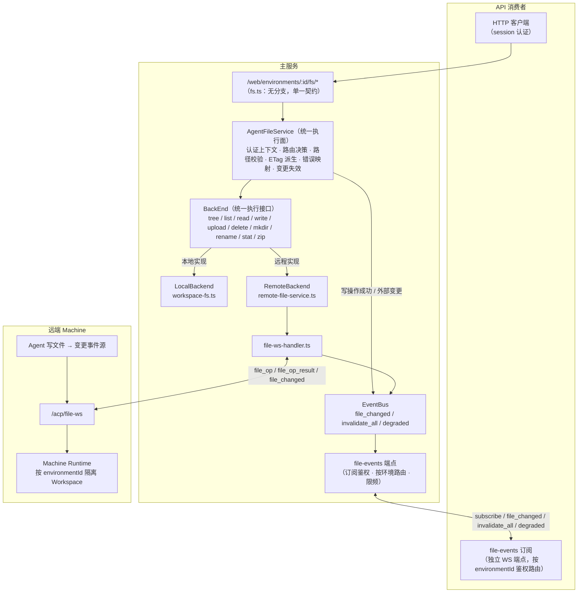
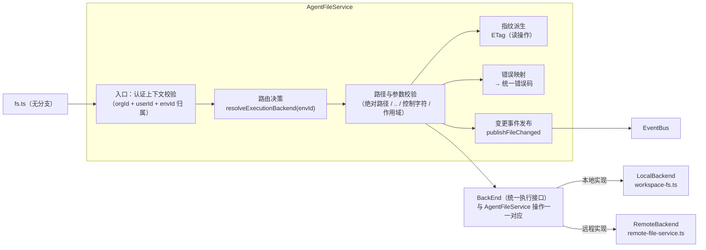
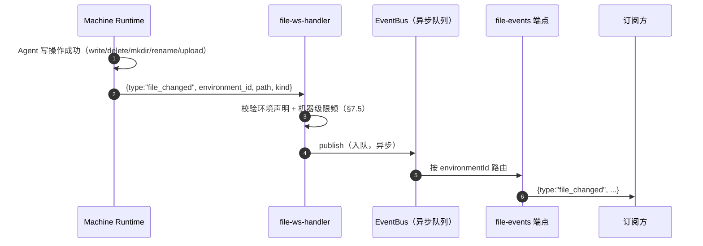
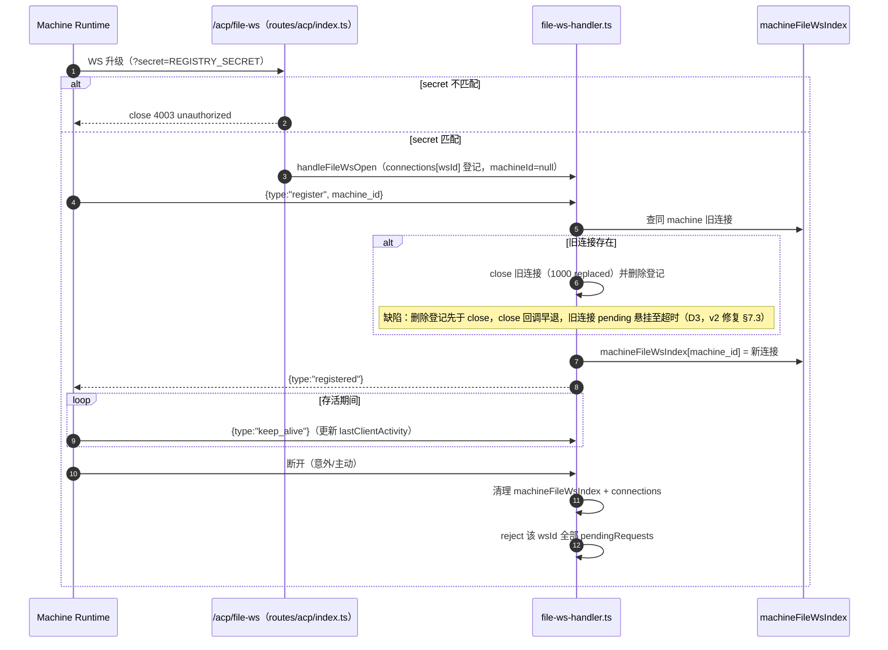
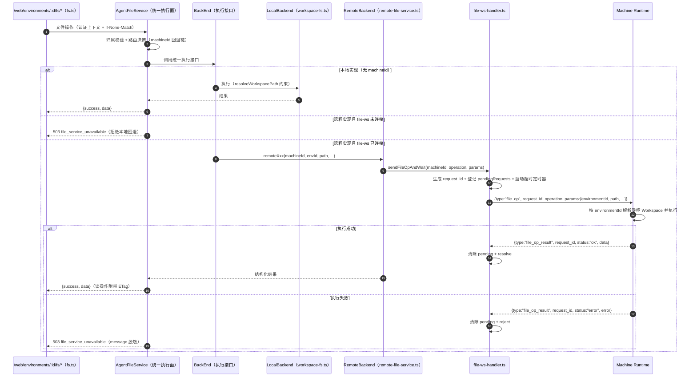

# 文件系统操作传递（权威实现基线）

> 状态：实现基线（2026-08-05 重写，2026-08-05 对抗审查修订）。§1–§3、§5–§6 为现状契约；§2/§4 与 §7 为**理想态设计**（统一执行面 + 防缓存机制 + v2 协议），评审待办，暂未实施。
> 旧版文档（`/user`、`/user-file` 路由体系）已废弃，保留于附录 A 供历史追溯。
> 定位：Agent 编排域（acp-ws / AgentNode）见 `docs/arch/20-orchestration-management.md`；Chat 流式（YJS）见 `docs/arch/19-yjs-chat-streaming.md`。文件信道与 acp-ws 是**两条平行的机器级信道**，本文档只描述文件信道。
> 范围：本文档只定义**服务端**的文件操作传递契约（主服务 + 远端 Machine），不覆盖前端消费方式；HTTP 侧契约（路由、错误码、条件请求）对任何 API 消费者统一。file_changed 订阅经独立 WS 端点（§4.3）承载，**不**复用 YJS/relay 通道。
> 约定：描述与代码一致的真实架构；理想态设计以"§"标注待办，实施时先更新本文档再改代码。关键实现文件以相对路径引用。

## 1. 总体架构（理想态）

> 本图为**目标状态**：文件执行面收敛为单一 `AgentFileService`，执行经 `BackEnd` 抽象分化 Local/Remote 两个实现；防缓存由"条件请求 + 变更事件"双机制保证；机器文件能力经 `file-events` 端点对订阅方可见。现状差异见 §1.2。



**三条核心不变量：**

1. **执行面单一**：路由层只调 `AgentFileService`，不出现 `if (machineId)` 双分支；执行统一收敛到 `BackEnd` 抽象层，由它分化 `LocalBackend` / `RemoteBackend` 两个实现（§2）。新操作只实现一次，不存在"本地支持、远程遗忘"。
2. **文件随时变，视图不缓存死**：所有读响应带 ETag 条件请求（§4.2）；文件变更（含机器端 Agent 写入）经 `file_changed` 事件回流（§4.3），断连窗口由 `invalidate_all` 兜底收敛（§7.3）。
3. **API 消费者无 backend 概念**：响应结构、错误码、变更事件全部统一，消费者不知道文件在哪台机器上执行（§2.4）。

**机器能力矩阵（与编排域的边界）**：文件信道与 acp-ws 生命周期**互相独立**（文件信道不随 Instance 创建/销毁）。机器能力 = acp 可达 × file 可达 的 2×2 组合，其中"file 降级"（acp-ws 正常、file-ws 断连）与"机器离线但文件可用"（acp-ws 断连、file-ws 存活）由本文档 §7.4 降级事件表达，**不**扩展 20 号文档机器状态机（20 号文档 §2.1 保持 pending/online/offline，交叉引用本文档）。

### 1.2 现状 → 理想态差异

| 维度 | 现状 | 理想态 |
|---|---|---|
| 路由层 | 每个端点 `if (machineId)` 双分支（`fs.ts`） | 单一 `AgentFileService` 调用 |
| 路径校验 | 本地 `resolveWorkspacePath` 有校验，远程直接透传 | 统一前置校验（§2.4） |
| 错误语义 | 本地 404/400/413，远程 503 `remote_error`（message 透传机器端） | 统一错误码表（§2.4） |
| 缓存控制 | 无 ETag / Last-Modified / 变更事件 | 条件请求 + `file_changed` 事件（§4） |
| 变更通道 | 无 | 独立 `file-events` WS 端点（§4.3） |
| download-zip | 仅本地 | 远程经 `file_op "zip"` 补齐（§7.9） |

## 2. AgentFileService（统一文件服务层）

> 理想态设计（评审待办）。目标：把"本地/远程双实现"收敛为"一个契约、一个 `BackEnd` 抽象、两个实现"。

### 2.1 内部结构

`AgentFileService` 是路由层与执行后端之间的**唯一门面**，内部职责严格分层；执行经 `BackEnd` 抽象分化本地/远程：



| 子模块 | 职责 | 不负责 |
|---|---|---|
| 入口（认证上下文） | 校验 orgId/userId/envId 归属（替代路由层分散的 `getOwnedEnvironment` 调用） | 协议接入、鉴权细节 |
| 路由决策 | `resolveExecutionBackend`：按 machineId 回退链选 Local/Remote（§3） | 执行本身 |
| 路径与参数校验 | 统一前置校验（§2.4） | 机器端最终隔离 |
| BackEnd（统一执行接口） | 定义十个操作契约，向 LocalBackend / RemoteBackend 分化执行 | 校验、指纹、错误映射、路由决策 |
| 指纹派生 | 读操作统一计算 ETag（§4.2） | 缓存存储（第一版无状态不落缓存；有界指纹缓存列为二期） |
| 错误映射 | BackEnd 异常 → 统一错误码（§2.4），message 脱敏 | 日志记录（保留诊断上下文到服务端日志） |
| 变更事件发布 | 写操作成功 / 外部变更 → `publishFileChanged`（§4.3） | 订阅管理、限频细节 |

### 2.2 统一接口

```ts
interface AgentFileService {
  tree(envId, path?): TreeResult;              // 递归文件树（黑名单过滤 + mtime）
  list(envId, path): FileEntry[];              // 列目录
  read(envId, path, mode: "text"|"binary"|"auto"): ReadResult;
  write(envId, path, content): WriteResult;    // 文本写入
  upload(envId, dir, files): UploadResult;     // 多文件上传
  delete(envId, path): void;
  mkdir(envId, path): void;
  rename(envId, oldPath, newPath): void;
  stat(envId, path): StatResult;
  downloadZip(envId, path): ReadableStream;    // 理想态：本地/远程均支持
}
```

- `envId` 之后的所有参数来自**已认证环境上下文**（organizationId + userId 由调用链注入），API 消费者不可直接指定。
- 实现选择（LocalBackend / RemoteBackend）由"路由决策"子模块按 §3 回退链决定，对路由层不可见。

### 2.3 BackEnd 抽象

`BackEnd` 是执行层的**稳定契约**：接口与 AgentFileService 的十个操作一一对应，`AgentFileService` 只依赖该接口，不感知具体实现。新增第三种执行面（如远程存储、Bridge 环境）时只新增实现，不改门面与路由。

| 操作 | LocalBackend（workspace-fs.ts） | RemoteBackend（remote-file-service.ts） |
|---|---|---|
| tree | `listPathsRecursive(workspaceDir)` | `remoteTree` |
| list | `listDirectory` | `remoteListDir` |
| read | `readFileContent` / `createFileStream` | `remoteReadFile` / `remoteReadBinaryFile` |
| write | `writeFileContent` | `remoteWriteFile` |
| upload | 本地 multipart 落盘 | `remoteUploadFiles`（base64，120s） |
| delete | `deleteNode` | `remoteDeleteFile` |
| mkdir | `mkdirp` | `remoteMkdir` |
| rename | `renamePath` | `remoteRename` |
| stat | `stat` + `isTextFile` | `remoteStat` |
| downloadZip | 系统 `zip` 流式 | `file_op "zip"`（v2，§7.9） |

- 两端**不允许**在接口之外产生额外行为（例如现状"本地校验 user/ 作用域、远程不校验"必须在 AgentFileService 统一层消除，backend 只负责执行）。

### 2.4 统一契约（消费者无感保证）

| 契约 | 规则 |
|---|---|
| 路径校验 | AgentFileService 统一前置：拒绝绝对路径、`..` 段、NUL/控制字符；相对路径须落在环境作用域（与本地 `user/` 约束同构）；校验失败 → `400 validation_error` |
| 错误码 | `400 validation_error` / `404 not_found` / `413 payload_too_large` / `503 file_service_unavailable`（本地磁盘故障与远程 file-ws 断连**同一错误码**，message 脱敏、不含机器内部信息） |
| 响应结构 | 全部 `{ success, data }`，backend 差异不外泄（不出现 `remote_error` 之类的 backend 专属类型） |
| 变更事件 | 任何 backend 的写操作成功都由 AgentFileService 统一发布 `file_changed`（§4.3） |
| 条件请求 | 所有读操作由 AgentFileService 统一派生 ETag（§4.2） |

## 3. 路由契约（/web/environments/:id/fs/*）

> 现状契约。理想态下路由层只做"认证 + 参数校验 + 调 AgentFileService"，本表行为不变。

全部端点要求 session 认证；`{id}` 为 environmentId（旧 `/user`、`/user-file` 前缀已废弃，见附录 A）。

| 方法 | URL | 说明 | 理想态 |
|------|-----|------|--------|
| GET | `/fs/tree` | 递归文件树（黑名单过滤 + mtime） | ETag 条件请求 |
| GET | `/fs` | 列目录，`?path=` 相对路径 | ETag 条件请求 |
| GET | `/fs/*` | 读文件：`?preview=true` 二进制预览；否则 `mode` 显式（v2 移除静默回退） | ETag 条件请求 |
| POST | `/fs/*` | 上传（multipart / 相对路径数组），限制 100MB（v2 降为 20MB，§7.6） | 写后广播变更 |
| PUT | `/fs/*` | 写入文本内容 | 写后广播变更 |
| DELETE | `/fs/*` | 删除单个文件 | 写后广播变更 |
| POST | `/fs/mkdir` | 创建目录 | 写后广播变更 |
| POST | `/fs/rename` | 重命名/移动 | 写后广播变更 |
| DELETE | `/fs/batch` | 批量删除，返回成功/失败列表 | 写后广播变更 |
| GET | `/fs/download-zip` | 目录打包 zip 流式下载 | 远程补齐（§7.9） |

**machineId 回退链**（`getRemoteMachineId`，现收敛为路由决策子模块）：`agentConfig.machineId` → `RCS_DEFAULT_MACHINE_ID` → `null`（本地）。决策不缓存，每次请求实时判定；file-ws 连接状态以 `isFileWsConnected(machineId)` 为准。**拒绝静默回退**：配置了远程 Machine 但 file-ws 未连接时 → `503 file_service_unavailable`，避免"文件在远程、实际落在本地"的分裂场景。

> 排他性：回退链是**环境级排他**的（同一环境要么本地要么远程，remote-file-service.ts:16-49 无混合路径）。"本地+远程混合写同一文件"的场景**不成立**，§4.4 的冲突语义只讨论"多消费者"与"消费者 vs Agent"。

**workspace 路径不变量**：`{WORKSPACE_ROOT}/{organizationId}/{userId}/{environmentId}`，DB `workspacePath` 为历史字段，不得用于推导真实目录。

## 4. 防缓存与一致性机制（文件随时变）

> 理想态设计（评审待办）。背景：Agent 在机器上运行时会持续读写 workspace 文件（本地执行时同理），任何文件视图（API 消费者侧）必须能感知外部变更，不能依赖"每次操作后手动刷新"。

### 4.1 问题定义

- **文件是活的**：Agent 工具调用、scheduled 任务、其他进程都可能修改文件，主服务不是唯一写入者（远程尤其如此）。
- **现状缺陷**：读响应无 ETag/Last-Modified（`fs.ts` 无任何缓存控制头）；无变更事件；消费者无法区分"无变化"与"重新拉取"，外部变更只能靠无条件重拉。
- **目标（对抗审查修订）**：
  - 远程环境：正常时视图过期 ≤ 事件延迟；**断连窗口内的变更由 `invalidate_all` 兜底**，重连后收敛（§7.3）。
  - 本地环境：主服务写操作即时失效；**外部进程变更 ≤ 30s（轮询粒度）**——这是明确接受的边界，不自称"即时"。
- **诚实边界**：ETag 防的是"带宽与视图刷新成本"，**不省服务端扫描负载**（无状态设计下每次请求仍全量扫描）。"读多打爆机器"由变更事件 + 消费端配合约束（§4.3），服务端有界指纹缓存列为二期。

### 4.2 HTTP 条件请求（读侧防缓存）

- **ETag 派生规则**（AgentFileService 指纹派生子模块统一计算）：
  - `read`：`"<size>-<mtimeMs>"`（标准文件指纹），`preview`/下载流同源。
  - `list`：目录条目指纹——`hash(name+type+mtime+size)` 或 `max(mtimeMs) + 条目数`（弱校验）。
  - `tree`：**路径排序 hash + `max(mtimeMs) + 路径数`**（对抗审查修订：仅 max(mtime)+数量在 **rename 场景不更新 mtime 且路径数不变 → 304 误判**；路径排序 hash 由扫描产物直接计算，成本可接受）。
- **304 语义**：消费者携带 `If-None-Match`，服务端比对一致 → 304（无 body）；不一致 → 200 全量。304 仅发生在"完全一致"时。
- **消费者配合**：`If-None-Match` 是 HTTP 原生语义，**任何客户端自愿使用**；不配合的消费者总是收到 200 全量（机制不失效，只是不节省）。主消费场景（web 控制台）需配套实现才生效——这是明确的实施前置（§10 P1）。
- **不设置长 TTL 缓存**：文件 API 一律 `Cache-Control: no-cache`（允许条件请求但不允许过期复用），防强缓存误导。

### 4.3 变更事件（file_changed）与订阅端点

**通道边界（对抗审查修订）**：file_changed **不**经 YJS/relay 通道（19 号文档按 rcsSessionId 隔离会话数据，CLAUDE.md 不变量 5 禁止全局广播；现有 EventBus 按 agentId/sessionId 隔离 ACP 会话事件）——由**独立 WS 端点承载**，环境级路由。

**订阅端点契约（`/web/file-events`，v2 新增）：**

| 项 | 契约 |
|---|---|
| 端点 | `WS /web/file-events`（session 认证 + 组织上下文） |
| 订阅帧 | `{ type: "subscribe", environments: ["env_1", ...] }`，服务端逐环境校验订阅者访问权（`getOwnedEnvironment`），无权限环境拒绝订阅 |
| 事件帧 | `{ type: "file_changed", environment_id, path, kind }`（`kind`: write/delete/mkdir/rename/upload） |
| 失效帧 | `{ type: "invalidate_all", environment_id }`——机器重连后全量失效信号（§7.3） |
| 降级帧 | `{ type: "degraded", machine_id, capability: "file" }`——file 能力降级/恢复（§7.4），限频合并 |
| 限频 | 事件按环境 20 条/s + **机器级总量 100 条/s**（对抗审查修订：防多环境放大）；`invalidate_all` 与 `degraded` 合并限频 1 条/30s/environment |
| 连接上限 | 与 `YJS_MAX_CLIENTS` 同源（默认 200），常量进 `src/env.ts` |
| 发布语义 | **异步发布**（对抗审查修订）：EventBus 发布走每环境有界队列（如 200 条），慢订阅者丢弃/合并而非阻塞——19 号文档原则 8"慢消费者不能阻塞 Agent"在文件域落地，file-ws 消息循环不受订阅方影响 |

**事件流（远程）：**



**事件流（本地）：**

- 本地写操作由主服务自己执行 → AgentFileService 变更事件发布子模块成功后直接 `publish(file_changed)`，同一事件通道。
- 本地**外部进程**改动（Agent 本地执行写文件）：目录 mtime 轮询探测（30s 粒度，仅当该环境有活跃订阅时启用）→ 检测到变更发布 `file_changed`（path 未知时发布 `invalidate_all`）。

**事件帧（v2 协议扩展，§7.5）：**

```json
{ "type": "file_changed", "environment_id": "env_xxx", "path": "user/a.txt", "kind": "write" }
```

### 4.4 并发写

- **场景澄清**：环境级回退链排他（§3），"本地+远程混合写"不成立；冲突只发生在"多消费者写同一环境"与"消费者 vs Agent 写"。
- **机器端写串行化**（v2 契约）：机器端对同一环境的写操作（file_op 写 + Agent 工具写）按到达序串行执行（共享写队列），保证执行序确定。主服务 HTTP 请求并发到达时，file_op 发送序 = NDJSON 帧到达序。
- **If-Match（v2 可选）**：写操作携带读取时的 ETag，不一致 → `409 version_conflict`。**边界**：只保护"消费者-消费者"的读-改-写覆盖（Agent 写入不走 HTTP、无 ETag，不参与版本比对）；"消费者 vs Agent"冲突由变更事件收敛，冲突策略默认"最后一次写入生效"。

## 5. file-ws 信道生命周期（现状基线）

机器（acp-link / 兼容运行时）启动后主动建立两条 WS：`/acp/ws`（Agent 控制，编排域）与 `/acp/file-ws`（文件操作，本文档）。file-ws 是**机器级连接**，不随 Instance 创建/销毁，只随机器存在（与 acp-ws 断连清理互不触碰，见 §1 能力矩阵）。



**关键语义（对抗审查修订，与代码事实对齐）：**

- **身份只靠 machine_id 自报**：register 帧携带 `machine_id`，服务端不做与 acp-ws 机器注册表的对账（缺陷 D1，v2 见 §7.1）。
- **同机器新连接替换旧连接**：机器重连时旧连接被 close(1000)。**现状（D3）**：`handleFileWsRegister` 先 `connections.delete(existing.wsId)` 再 close（file-ws-handler.ts:83-92），`handleFileWsClose` 因 entry 不存在提前 return（file-ws-handler.ts:161-163）——**旧连接的 pending 不被 reject，悬挂至 60s/120s 超时**（文档此前声称"pending 全部失败"，与代码相反，已修正）。v2 契约见 §7.3（先显式 reject 旧连接 pending，再做替换）。
- **无心跳超时回收**：`keep_alive` 只更新 `lastClientActivity`，服务端**没有**超时巡检——half-open 僵尸连接会永久占据索引，`isFileWsConnected` 恒为 true，请求全部 60s 超时才失败（缺陷 D2，v2 见 §7.4）。
- **断连即清理**：`handleFileWsClose` 删除索引并 reject 该连接全部 pending（"Connection closed"），保证无悬挂 Promise（替换路径除外，见上）。
- **优雅关闭**：服务停机时 `closeAllFileWsConnections` reject 全部 pending 并 close 连接。

## 6. 文件操作请求-响应生命线（现状基线）



> 理想态差异：图中 `AgentFileService` + `BackEnd` 收敛了本地/远程分支与归属校验（现状这些逻辑在 `fs.ts` 路由内直接 `if (machineId)` 分叉）；`503 remote_error` 统一为 `file_service_unavailable`；读请求支持 ETag 条件请求（§4.2）。

**请求-响应机制（`file-ws-handler.ts`）：**

- **帧格式**：请求 `{ type: "file_op", request_id, operation, params }`；结果 `{ type: "file_op_result", request_id, status, data?, error? }`；NDJSON 传输（`\n` 分隔），服务端按行解析。
- **request_id**：`freq_{Date.now()}_{counter}`，进程内单调；结果按 request_id 回填 `pendingRequests`。
- **超时**：默认 60s，`upload` 120s（base64 大载荷）；超时 reject 并清理 pending，不产生悬挂。
- **操作清单**：`list` / `stat` / `read` / `read_binary` / `write` / `upload` / `delete` / `rename` / `mkdir` / `tree`（理想态新增 `zip`，§7.9）。
- **environmentId 透传**：由服务端注入 `params.environmentId`（来自已认证环境），机器端据此隔离 Workspace；API 消费者不可指定。

## 7. file-ws v2 协议设计（评审待办）

> 状态：**设计稿**（2026-08-05 对抗审查修订）。基于 §9 缺陷清单重新设计，尚未实施。实施时按 §10 拆分为独立提交，并同步更新本文档状态。

### 7.1 连接身份绑定（修复 D1）

- register 帧保持 `{ type: "register", machine_id }`（**不引入 node_id**——registry 中 node_id 即 machine.id 别名，无独立用途）。
- **对账查询面（对抗审查决策）**：`machine_id` 必须已存在于 **core runtime node 注册**（`registerRemoteNode` 产物，`src/services/core-bootstrap.ts`）——即 acp-ws 注册链的产物；不存在 → close(4004 unknown_machine)。
  - 不查 DB machine 表：pending/offline 机器也会通过校验，语义错误。
  - 服务端重启（`resetAllMachinesOffline`）后机器并发重连：file-ws 可能先于 acp-ws 到达 → 4004 → 机器侧重试（见下）。
- **机器侧连接时序契约（跨仓库，acp-link 独立仓库）**：先连 acp-ws 完成 `registerMachine` + `registerRemoteNode`，再连 file-ws；file-ws 收到 4004 时重试（退避 ≤ 5s，上限 6 次），不放弃。
- **安全边界声明**：REGISTRY_SECRET 是**最终信任根**。v2 防"冒充任意机器"（必须持有合法机器身份 + 与 acp-ws 共存），**不防"顶替已注册机器"**（攻击者拿 secret 后先顶替 acp-ws 再注册 file-ws，共存校验自然通过）——acp-ws 侧无替换旧连接机制（旧连接 90s 后才清理）为已知限制，列入 20 号文档 T1 关联。

### 7.2 请求幂等（修复 D3）

- file_op 增加 `op_id`（调用方生成的领域幂等键，读操作可省略）；机器端对**写操作**（write / mkdir / delete / rename / upload）按 op_id 缓存最近结果（有界：最近 1000 条或 10 分钟），重复 op_id 直接返回缓存结果，**不重复执行**。
- **op_id 的 HTTP 载体（对抗审查修订）**：HTTP 请求头 `X-File-Op-Id`（或 body 字段），响应回显同值；无状态 HTTP 下重试由**消费者**复用同一 op_id（前端配套，§10 P2）。协作型调用方（内部模块）由 AgentFileService 生成。
- **去重边界（对抗审查修订）**：**Agent 工具写入不走 file_op，没有 op_id**——机器端对 Agent 工具写生成独立事件去重键（`path + kind + 内容 hash` 或单调序号），事件去重与 file_op 去重相互独立（§7.5）。
- 主服务侧 `sendFileOpAndWait` 失败（超时/断连）时：读操作（list / read / stat / tree）允许自动重试一次；写操作**不自动重试**，错误上抛由调用方重发（重发时复用 op_id，机器端幂等去重）。
- 与 Chat 域"传输至少一次、领域效果恰好一次"（19 号文档 §2.1-5）对齐。

### 7.3 机器重连的请求迁移与断连窗口兜底（修复 D3 关联）

- **前置修复（现状 bug）**：`handleFileWsRegister` 替换旧连接时**先显式 reject 旧连接全部 pending**（错误码 `aborted`），再做 `connections.delete` + close——消除 close 回调早退导致的悬挂（§5）。
- **迁移语义**：机器重连 file-ws 时，旧连接的 pending 请求：读操作在新连接上以新 request_id 重发（携带原 op_id）；写操作直接失败返回（调用方重发时幂等去重）。
- **重试预算（对抗审查修订）**：自动重试 + 迁移重发**共享同一预算**——每个请求最多额外执行 1 次（机器端总执行次数 ≤ 2），防止 tree 全量 ×3 放大。预算与背压共享（§7.6）。
- **断连窗口兜底（对抗审查修订，修复 S3）**：机器端**重连注册成功时**（register 通过后）广播该机器全部环境的 `invalidate_all`（§4.3 失效帧）→ 订阅方重拉。由此：断连期间丢失的 file_changed 不必重放，视图在重连后收敛；`invalidate_all` 限频合并（1 条/30s/environment）。

### 7.4 心跳与僵尸回收（修复 D2）

- 机器侧 keep_alive 间隔约定 ≤ 30s；服务端按 `lastClientActivity` 超过 **90s（3 倍间隔）** 判定僵尸：关闭连接 + 清理索引 + reject pending + 发布 `degraded` 事件（§4.3 降级帧）。
- **巡检实现（对抗审查修订）**：**独立遍历 `machineFileWsIndex`**，不复用 `startMachineSweep`——sweep 只查 DB `machine.status === "online"`（registry-heartbeat.ts:75），acp-ws 死后 status=offline，file-ws 僵尸不在其巡检范围（C5）。独立巡检定时器常量进 `src/env.ts`。
- **keep_alive 性质（对抗审查修订）**：机器端发送间隔是**跨仓库软契约**（acp-link 独立仓库，无强制机制）。备选强化：服务端主动发 `ping` 要 `pong` 回执（v2 可选），或按 90s 阈值容忍。
- **能力矩阵联动**：acp-ws 死而 file-ws 活的"机器离线但文件可用"状态（T6）与 file-ws 死而 acp-ws 活的"file 降级"状态（T7）都只由本文档表达（`degraded` 事件 + HTTP 503），20 号文档状态机不扩展（§1 能力矩阵）。

### 7.5 变更事件（file_changed，新增）

- 机器端写操作成功（write/delete/mkdir/rename/upload）后推送 `{ type: "file_changed", environment_id, path, kind }`；写操作按 op_id 去重（同 §7.2 缓存），Agent 工具写按 `path+kind+内容 hash` 去重（§7.2 去重边界），不重复广播。
- **环境声明（对抗审查修订）**：register 帧扩展 `{ environments: string[] }`（机器端维护的环境列表，数量上限 500）；事件只接受声明列表内环境，主服务校验格式与数量——现无 machine→environment 映射机制（registry 无此表），以声明列表为 v2 最小实现。
- 主服务 `file-ws-handler` 限频：**每环境 20 条/s + 机器级总量 100 条/s**（§4.3）；超限合并为 `invalidate_all`。
- 事件经 EventBus **异步队列**路由到 `file-events` 端点（§4.3）；本地 backend 由 AgentFileService 发布同类事件。

### 7.6 背压与载荷治理（修复 D4 + 对抗审查 S2）

- 数量：单连接 pending 上限 64；pendingRequests 全局上限 1024；超限请求立即返回本地错误帧 `{ type: "file_op_error", request_id, code: "busy" }`。
- **字节（对抗审查修订，S2）**：
  - **WS 消息最大载荷 32MB**：在服务端 WS 层配置 maxPayload 并在**消息解析前**做显式检查——现状 `MAX_WS_MESSAGE_SIZE=10MB` 检查在 Elysia 自动 `JSON.parse`（createWSMessageParser 对 `{` 开头字符串先 parse）之后才生效，对大 JSON 帧**形同虚设**，100MB upload 实际以 ~133MB base64 单帧全量进内存（代码改造点，§10 P1）。
  - `upload` 单文件上限 100MB → **20MB**（base64 帧 ~27MB < 32MB 载荷）；更大文件走二期分块传输（§10 二期）。
  - `zip` 单包 ≤ 100MB，**分块回传**（`file_op_chunk` 系列帧，§7.9）。
- **重试预算与背压共享**：迁移重发 + 自动重试合计 ≤ 1 次额外执行（§7.3），不放大载荷。

### 7.7 路径越界校验前置（修复 D5）

- 主服务在发送 file_op 前对 `path` 做基础校验：拒绝绝对路径、拒绝 `..` 段、拒绝 NUL 与控制字符；远程环境路径必须为相对路径且落在环境作用域前缀（与本地约束同构）。
- 机器端承担**最终隔离**（按 environmentId → WorkspaceRef 解析），主服务校验是防线而非依赖。
- 校验失败返回 400 `validation_error`，不透传机器端。

### 7.8 读文件错误语义（修复 D9）

- 读文件不再"先文本、失败静默回退二进制"（`fs.ts` GET `/fs/*` 非 preview 分支）；改为请求参数 `mode: "text" | "binary" | "auto"`，`auto` 由机器端按扩展名/内容探测并返回 `type` 字段，探测失败返回明确错误。
- 权限错误 / IO 错误不再被伪装成"二进制文件下载"。

### 7.9 远程 download-zip（修复 D10 关联）

- 远程 `zip` 操作：file_op `{ operation: "zip", params: { path } }`，机器端打包后以 base64 **分块回传**（`file_op_chunk` 系列帧，单块 ≤ 1MB，总包 ≤ 100MB），主服务流式转发给浏览器（§7.6 载荷治理配套）。

## 8. 安全与隔离边界

| 边界 | 机制 | 责任方 |
|---|---|---|
| 机器接入认证 | `/acp/file-ws?secret=REGISTRY_SECRET` 共享密钥，不匹配 close(4003) | 主服务 |
| 机器身份真实性 | v2：register 与 **core runtime node 注册对账**（§7.1）；现状：仅 machine_id 自报 | 主服务 |
| 环境归属 | HTTP 层 `getOwnedEnvironment`（organizationId + userId + envId）；file_op 的 environmentId 由服务端从已认证环境派生 | 主服务 |
| 事件环境声明 | file_changed 仅接受 register 声明的环境列表（§7.5），限频防刷 | 主服务 |
| 订阅鉴权 | `file-events` 端点逐环境校验订阅者访问权（§4.3） | 主服务 |
| 路径越界 | 本地：`resolveWorkspacePath` 规范化 + user/ 作用域；远程：v2 §7.7 前置校验 + 机器端最终隔离；理想态：AgentFileService 统一前置（§2.4） | 主服务 + 机器 |
| 敏感信息 | 机器端错误 message 可能透传内部路径/文件系统细节，理想态统一脱敏（保留诊断到服务端日志）；统一错误码 `file_service_unavailable` | 主服务 |
| 拒绝回退 | 配置远程但 file-ws 未连 → 503，禁止静默本地执行 | 主服务 |
| 信任根声明 | REGISTRY_SECRET 是最终信任根；v2 防"冒充任意机器"，不防"顶替已注册机器"（已知限制，§7.1） | 主服务 |

**身份体系约定**：file-ws 使用 RCS environment 上下文；机器端 file_op 按 `environmentId` 隔离 Workspace，**不**使用 ACP `ses_*` 会话标识；API 消费者不可指定远端物理路径、machine 内部标识或 ACP session ID。

## 9. 现状缺陷 → 理想设计对照

| # | 缺陷（现状代码事实） | 影响 | 理想设计 |
|---|---|---|---|
| D1 | register 仅自报 machine_id，不与 acp-ws 注册链对账（`file-ws-handler.ts` register 分支） | REGISTRY_SECRET 泄漏可冒充任意机器 file-ws | §7.1 身份绑定（core runtime node 对账） |
| D2 | keep_alive 只更新时间戳，无超时巡检；独立巡检缺失（`startMachineSweep` 只查 online 机器，覆盖不到） | half-open 僵尸连接永久占据索引，请求全部 60s 超时 | §7.4 心跳僵尸回收（独立遍历索引） |
| D3 | 同机器替换连接时**先删登记再 close，close 回调早退**（file-ws-handler.ts:83-92+161-163），旧连接 pending **悬挂至超时**而非 reject；且无领域幂等键 | 写操作重复执行（重发时无去重）+ 悬挂占用 pending 槽位 | §7.3 显式 reject 前置修复 + §7.2 op_id 幂等 |
| D4 | pendingRequests 无上限、单连接无并发限制 | 内存无界增长 | §7.6 背压（数量 + 字节） |
| D5 | 远程分支 path 直接透传机器端，主服务无校验（本地分支有 resolveWorkspacePath） | 越界路径依赖机器端自觉 | §7.7 前置校验 + §2 统一层 |
| D6 | file-ws 断连仅 reject pending，无能力聚合；acp-ws 在线时消费者无感知 | "机器在线但文件 503" / "机器离线但文件可用"双态无表达 | §7.4 degraded 事件 + §4.3 订阅（能力矩阵 §1） |
| D7 | `getRemoteMachineId` 只查 environment 存在性，归属校验依赖路由层自觉 | service 层被其他调用方绕过时缺归属校验 | §2 AgentFileService 统一入口 |
| D8 | upload 整体 base64 单帧（100MB → ~133MB 帧），无分块 | 机器端内存峰值高，大文件易超时 | §7.6 载荷上限 + 二期分块 |
| D9 | GET /fs/* 非 preview：文本读取失败**静默**回退二进制 | 权限/IO 错误被伪装为二进制文件 | §7.8 mode 显式 |
| D10 | `fs.ts` 每端点 `if (machineId)` 双分支；远程无路径校验、无 download-zip、错误语义与本地分叉 | 双路径行为漂移，新操作改两处，bug 概率翻倍 | §2 AgentFileService + BackEnd 抽象统一执行面 |
| D11 | 读响应无 ETag/Last-Modified；无变更事件；外部变更只能无条件重拉 | 视图过期无界，读多打爆机器 | §4 条件请求 + file_changed 事件 |
| D12 | WS 帧大小检查在 Elysia 自动 `JSON.parse` 之后才生效，**10MB 上限形同虚设**（大 JSON 帧全量进内存） | 133MB/266MB 单帧内存峰值 | §7.6 解析前检查 + maxPayload 配置 |
| D13 | file_changed 无消费通道与订阅端点契约 | 变更事件设计无落点（P1 无法实施） | §4.3 file-events 独立 WS 端点 |
| D14 | file-ws 断连窗口内变更事件丢失，无重放/全量失效补救 | 订阅视图过期无界，违反 §4.1 目标 | §7.3 invalidate_all 兜底 |

## 10. 实施计划（代码改造点）

按依赖顺序拆分，每步独立可验证、可回滚；标注 `[跨仓库]` 的步骤依赖 acp-link 机器端（独立仓库）同步修改。

**P0（止血）**

1. **心跳僵尸回收（D2）**：`file-ws-handler.ts` 增加**独立** lastClientActivity 巡检定时器（遍历 `machineFileWsIndex`，间隔/超时常量进 `src/env.ts`）。验证：模拟 half-open 连接，90s 后索引清理、请求立即失败、发布 degraded 事件。
2. **背压（D4 数量侧）**：单连接 pending 上限 64、全局 1024；`sendFileOpAndWait` 超限同步 reject。验证：并发 100 请求，第 65 个起立即失败。
3. **替换早退修复（D3 前置）**：`handleFileWsRegister` 先显式 reject 旧连接全部 pending（`aborted`），再删除登记 + close。验证：重连瞬间进行中的请求立即收到 aborted，无悬挂。

**P1（统一执行面 + 缓存 + 事件通道）**

4. **file-events 订阅端点（D13）**：独立 WS 端点 `/web/file-events`（§4.3 契约：订阅帧、事件帧、鉴权、限频、连接上限）；EventBus 异步队列发布。验证：订阅者收到按环境路由的 file_changed；无权限环境订阅被拒；慢订阅者不阻塞 file_op_result 处理。
5. **AgentFileService 收敛双路径（D10）**：新增统一层，`fs.ts` 路由删除 `if (machineId)` 分支，路径校验/错误码/响应结构统一（§2.4）；download-zip 远程 `zip` 操作补齐（§7.9）`[跨仓库]`。验证：同一套路由测试分别对本地/远程环境跑通，错误码一致。
6. **路径前置校验（D5/D7）**：AgentFileService 统一校验（拒绝绝对路径/`..`/控制字符），校验失败 400。验证：`/fs/../../etc/passwd`、`/fs//etc/passwd` 均被拒（本地与远程一致）。
7. **ETag 条件请求（D11 读侧）**：读操作派生 ETag（tree 用路径排序 hash，§4.2）+ `Cache-Control: no-cache`；主消费端（web 控制台）配套发送 `If-None-Match`。验证：连续两次请求第二次 304；rename 后 tree ETag 变化；不携带头时恒 200。
8. **file_changed 事件（D11 写侧 + D6）**：v2 协议事件帧（§7.5）；机器侧写操作后推送 `[跨仓库]`；主服务校验环境声明 + 限频 + 异步路由；本地写由 AgentFileService 直接发布；**register 成功时广播 `invalidate_all`（§7.3）**。验证：远程环境在机器上 touch 文件，订阅方收到事件；无订阅时零开销；断连窗口后重连收到 invalidate_all。
9. **载荷治理（D12/D8 第一版）**：WS maxPayload 32MB + 解析前显式检查（修复 Elysia 绕过）；`upload` 上限 100MB → 20MB。验证：>32MB 帧被拒/连接关闭，内存峰值有界。

**P2（一致性增强）**

10. **身份绑定（D1）**：register 对账 core runtime node；未知 machine close(4004)；机器侧连接时序（先 acp-ws 后 file-ws）+ 4004 退避重试 `[跨仓库]`。验证：先连 file-ws 再连 acp-ws 被拒，反序通过；服务端重启后并发重连无死锁。
11. **op_id 幂等（D3）**：file_op 增加 op_id；HTTP 头 `X-File-Op-Id` 载体 + 响应回显；机器端写操作结果缓存（有界）；读操作重试预算共享（§7.3）。验证：断连重连后重发同 op_id，机器端不重复执行；Agent 工具写事件去重键生效。
12. **读错误语义（D9）**：GET /fs/* 增加 `mode` 参数，移除静默 fallback。验证：对无权限文件返回明确错误而非二进制下载。
13. **并发写 If-Match（§4.4 可选）**：写冲突返回 409。验证：读-改-写窗口被外部写入时收到 409。

**二期**：上传分块传输（D8 完整版）、远程 zip 分块回传（§7.9）、服务端有界指纹缓存（§4.1）、keep_alive 服务端主动 ping（§7.4 备选）。

## 附录 A：废弃内容（旧路由体系）

> 以下内容为旧版文档（2026-08-05 之前）描述，**已废弃**，仅保留供历史追溯。当前实现以 §3 为准。

### A.1 废弃路由表

| 方法 | 废弃 URL | 替代 |
|------|----------|------|
| GET | `/web/environments/:id/user` | `GET /fs` |
| GET | `/web/environments/:id/user/*` | `GET /fs/*` |
| POST | `/web/environments/:id/user/*` | `POST /fs/*` |
| PUT | `/web/environments/:id/user/*` | `PUT /fs/*` |
| DELETE | `/web/environments/:id/user/*` | `DELETE /fs/*` |
| GET | `/web/environments/:id/user-file/tree` | `GET /fs/tree` |
| POST | `/web/environments/:id/user-file/rename` | `POST /fs/rename` |
| POST | `/web/environments/:id/user-file/mkdir` | `POST /fs/mkdir` |
| DELETE | `/web/environments/:id/user-file/batch` | `DELETE /fs/batch` |
| GET | `/web/environments/:id/user-file/download-zip` | `GET /fs/download-zip` |

### A.2 废弃表述

- "文件 API 仅允许操作 user/ 子目录下的内容（本地环境）"——已修订为统一路径校验 + 作用域检查（§2.4），路由不再以 user 为前缀。
- 旧 File WS 描述（"远程机器通过 WebSocket 连接到服务端，发送注册消息完成注册，后续请求-响应"）——已被 §5/§6 生命线取代。
