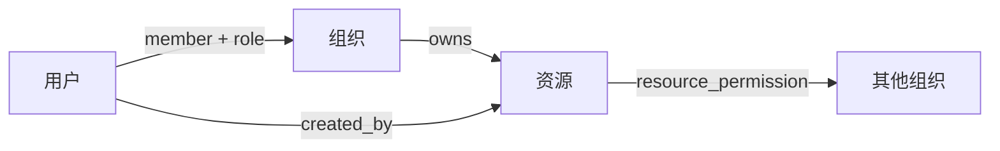
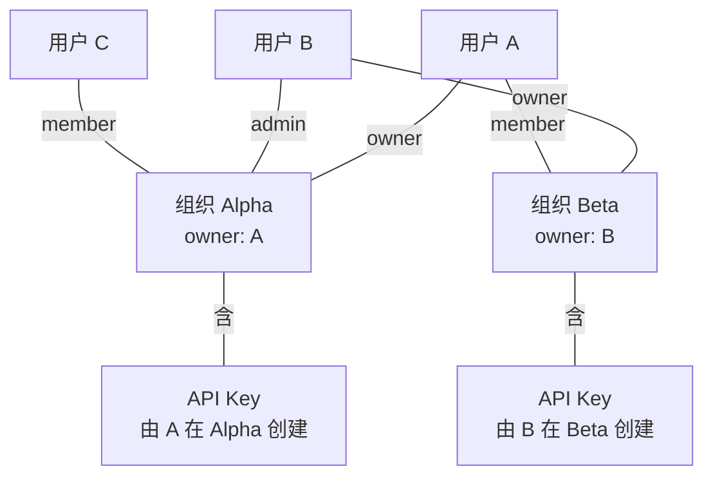

# 用户与组织

## 概述

FenixAgent 实现**多租户组织隔离**模型，核心设计围绕三条主线：

1. **用户身份**：注册、登录、session 管理（见[认证系统](./03-auth.md)）
2. **组织边界**：所有业务资源归属组织，按组织隔离
3. **授权控制**：组织内按角色分级，跨组织通过资源权限表共享

## 组织、资源、用户的关系

三者关系如下：

**用户与组织**：一个用户必须属于至少一个组织（注册时自动创建个人组织），可同时属于多个组织，每个组织内角色独立。组织间通过邀请机制扩展成员。

**组织与资源**：所有业务资源归属一个组织，组织内成员共享可见。修改和删除需校验所有权——owner 可操作任意资源，member 仅能操作自己创建的资源。

**跨组织资源分享**：部分配置类资源可设为全系统公开可读（详见[跨组织资源分享](#跨组织资源分享)）。

### 资源可见性

| 资源归属 | 访问者 | 可见 | 可修改 |
|---------|--------|------|--------|
| 本组织 | 本组织 owner | ✅ | ✅ |
| 本组织 | 本组织 member | ✅ | 仅自己创建的资源 |
| 本组织（已公开） | 其他组织任意角色 | ✅ | ❌ |
| 其他组织（未公开） | 当前组织 | ❌ | ❌ |

## 用户模型

用户通过注册端点创建账号。注册时自动创建以用户名命名的个人组织，用户设为 owner 角色。此后可以创建额外组织、邀请其他用户加入。

## 组织模型

### 角色与权限

| 角色 | 权限边界 |
|------|---------|
| owner | 编辑组织信息、管理成员、修改角色、删除组织 |
| admin | 编辑组织信息、管理成员（不能修改 owner） |
| member | 查看成员列表和资源，创建/修改自己的资源 |

每个用户在不同组织中可以拥有不同角色。

### 当前组织确认方式

认证上下文构建时确定当前组织，多来源优先级：HTTP header（前端请求拦截器自动注入）→ URL query → cookie（组织切换时写入）→ 回退到用户第一个组织。结果按用户 ID 缓存，组织信息写入日志上下文。

### 隔离机制

所有业务资源按三层隔离：

| 层级 | 机制 | 说明 |
|------|------|------|
| 路由栅栏 | 组织隔离屏障 | 校验用户是否属于资源所属组织，不匹配拒绝 |
| 查询注入 | 强制组织过滤 | 所有数据查询自动带组织 ID 条件 |
| 用户隔离 | 资源级过滤 | 敏感资源（如 environment）在组织基础上再加用户过滤 |

权限拒绝统一返回 403。

### 跨组织资源分享

部分配置类资源支持设为全系统公开可读，任何组织都可以引用。公开后的资源不允许其他组织修改。当前支持 provider / skill / mcp_server / agent_config 四种类型，仅 read 操作。

## 前端组织管理

应用启动时获取组织列表并缓存活跃组织 ID。切换组织时乐观更新本地状态后调用服务端确认，失败则回滚。全局请求拦截器自动注入组织 header。

管理功能按角色分级：创建组织（所有用户）、编辑名称和管理成员（admin 及以上）、删除组织（owner，需二次确认）。通过 React Context 管理全局组织状态。

## 已知缺口

| 能力 | 现状 |
|------|------|
| API Key 作用域限制 | 无，一个 Key 可访问用户的所有资源 |
| Workspace 用户间隔离 | 仅系统目录黑名单，无用户间目录隔离 |
| 操作审计日志 | 无 |
| 管理员跨组织视图 | 未实施 |
| 资源级权限（如谁能访问某个 Agent） | 配置资源已支持，运行实例级别暂未支持 |
