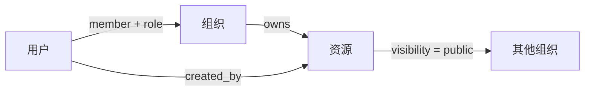
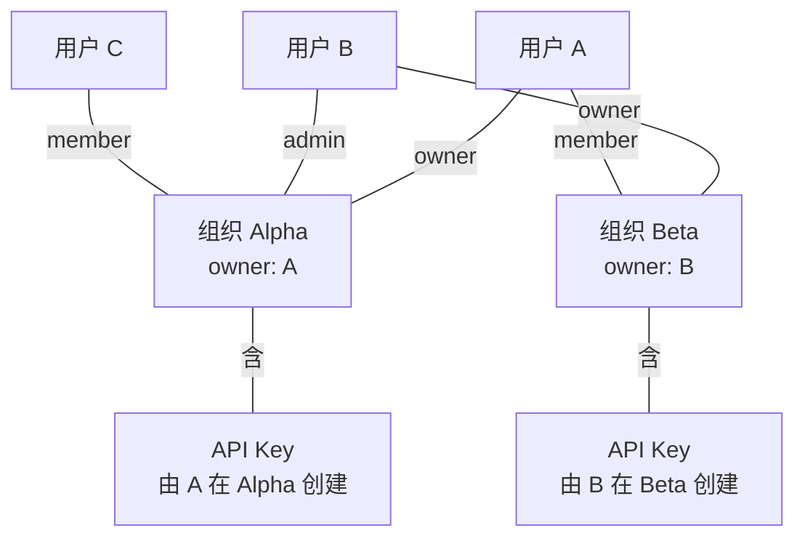

# 用户与组织

## 概述

FenixAgent 实现**多租户组织隔离**模型，核心设计围绕三条主线：

1. **用户身份**：注册、登录、session 管理（见[认证系统](./03-auth.md)）
2. **组织边界**：所有业务资源归属组织，按组织隔离
3. **授权控制**：组织内按角色分级，跨组织通过资源主表的 `visibility` 列共享

## 组织、资源、用户的关系

三者关系如下：

```mermaid
flowchart LR
    U["用户"] -->|"member + role"| O["组织"]
    O -->|"owns"| R["资源"]
    U -->|"created_by"| R
    R -->|"visibility = public"| O2["其他组织"]
```

**用户与组织**：一个用户必须属于至少一个组织（注册时自动创建个人组织），可同时属于多个组织，每个组织内角色独立。组织间通过邀请机制扩展成员。

**组织与资源**：所有业务资源归属一个组织。归属与受众是资源主表上的两列——`organization_id` + `user_id` 决定归属，`visibility` 决定是否对全系统公开。动作由 `@fenix/access-control` 的唯一策略函数推导，资源模块只声明资源类型、表、归属列与 `memberDefaultActions` / `publicDefaultActions`。

**跨组织资源分享**：部分配置类资源可设为全系统公开可读（详见[跨组织资源分享](#跨组织资源分享)）。

### 资源可见性

`member` 对组织资源只有资源声明的 `memberDefaultActions`（agent-config / skill / mcp 为 `read` + `use`，provider 为 `read`），`create` / `update` / `delete` 归 `owner` / `admin`；组织内个人资源例外，其 `owner` 在自己所属组织内可完整管理。

| 资源归属 | 访问者 | 可见 | 可修改 |
|---------|--------|------|--------|
| 本组织 | 本组织 owner / admin | ✅ | ✅ |
| 本组织 | 本组织 member | ✅ | ❌（只有 `read` / `use`） |
| 本组织（个人资源） | 其 owner | ✅ | ✅ |
| 本组织（个人资源） | 本组织 owner / admin | ❌ | ❌（不自动代管） |
| 本组织（已公开） | 其他组织任意角色 | ✅ | ❌ |
| 其他组织（未公开） | 当前组织 | ❌ | ❌ |

## 用户模型

用户通过注册端点创建账号。注册时自动创建以用户名命名的个人组织，用户设为 owner 角色。此后可以创建额外组织、邀请其他用户加入。

```mermaid
graph TD
  U1["用户 A"]
  U2["用户 B"]
  U3["用户 C"]

  Org1["组织 Alpha<br/>owner: A"]
  Org2["组织 Beta<br/>owner: B"]

  U1 ---|"owner"| Org1
  U2 ---|"admin"| Org1
  U3 ---|"member"| Org1

  U2 ---|"owner"| Org2
  U1 ---|"member"| Org2

  AK1["API Key<br/>由 A 在 Alpha 创建"]
  AK2["API Key<br/>由 B 在 Beta 创建"]

  Org1 ---|"含"| AK1
  Org2 ---|"含"| AK2
```

## 组织模型

### 角色与权限

| 角色 | 权限边界 |
|------|---------|
| owner | 编辑组织信息、管理成员、修改角色、删除组织 |
| admin | 编辑组织信息、管理成员（不能修改 owner） |
| member | 查看成员列表和资源，创建新资源，并管理自己作为 owner 的个人资源；对组织资源只有资源声明的默认动作（`read`，部分资源含 `use`） |

每个用户在不同组织中可以拥有不同角色。

### 当前组织确认方式

认证上下文构建时确定当前组织，多来源优先级：HTTP header（前端请求拦截器自动注入）→ URL query → cookie（组织切换时写入）→ 回退到用户第一个组织。结果按用户 ID 缓存，组织信息写入日志上下文。

### 隔离机制

所有业务资源按三层隔离：

| 层级 | 机制 | 说明 |
|------|------|------|
| 路由栅栏 | 可信主体解析 | 无 actor 的请求在 `safeWebHandler` 入口即 401，不进入领域层 |
| 查询注入 | 授权条件下推 | 列表、计数与详情共用同一授权谓词，编译成 WHERE / ORDER BY 后下推；资源 Repository 只声明表、归属列与业务条件 |
| 用户隔离 | 归属过滤 | 个人资源（如 environment）在组织归属之上再加 owner 过滤 |

授权判断只有一处实现（`access-control` 的策略函数）：组织管理动作、成员默认动作、公开默认动作三个来源取并集，都不成立时谓词编译为恒假，而不是放行全量。

权限拒绝统一返回 403。

### 跨组织资源分享

部分配置类资源支持设为全系统公开可读，任何组织都可以引用。公开后的资源不允许其他组织修改。当前支持 provider / skill / mcp_server / agent_config 四种类型，仅 read 操作。

公开是**唯一**的跨组织可见路径：组织资源的可见范围就是 active organization，一个用户属于多个组织时，其他组织的私有资源既不在当前组织的列表里、也不能按 ID 读取或修改（切换组织后才按该组织里的角色获得动作）。成员关系全量传给授权层只用于回答「在当前组织里是什么角色」，不构成可见范围的并集。

## 前端组织管理

应用启动时获取组织列表并缓存活跃组织 ID。切换组织时乐观更新本地状态后调用服务端确认，失败则回滚。全局请求拦截器自动注入组织 header。

管理功能按角色分级：创建组织（所有用户）、编辑名称和管理成员（admin 及以上）、删除组织（owner，需二次确认）。通过 React Context 管理全局组织状态。

## 已知缺口

| 能力 | 现状 |
|------|------|
| API Key 作用域限制 | 无，一个 Key 可访问用户的所有资源 |
| Workspace 用户间隔离 | 仅系统目录黑名单，无用户间目录隔离 |
| 操作审计日志 | 无 |
| 管理员跨组织视图 | 未实施 |
| 资源级权限（如谁能访问某个 Agent） | 配置资源已支持，运行实例级别暂未支持 |
