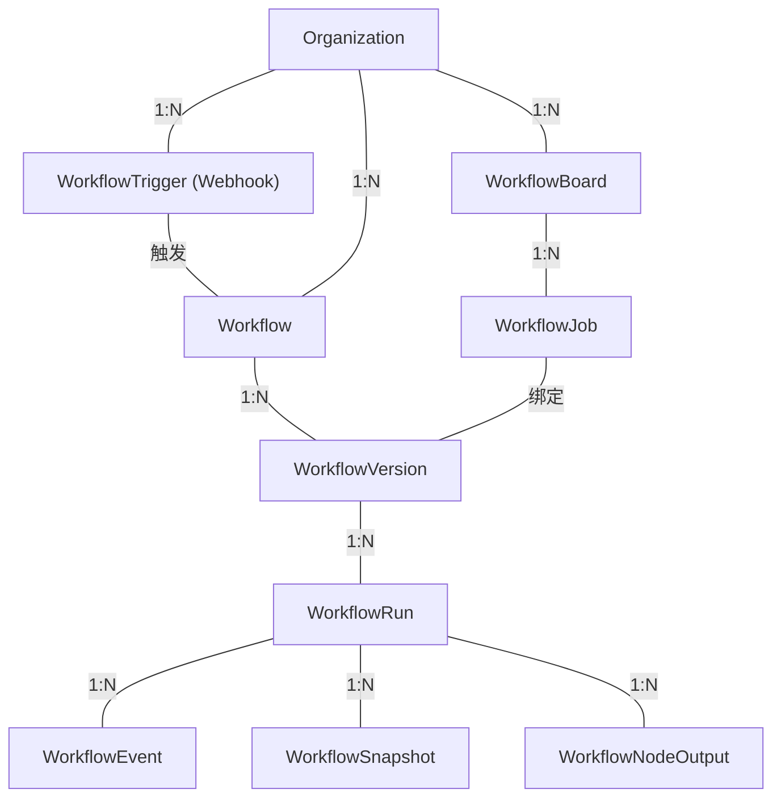

# Workflow 引擎

## 概述

Workflow 引擎提供 DAG 工作流编排能力，通过 YAML 定义节点间的依赖关系和执行顺序。所有 Workflow 数据按组织隔离。

核心实体层级：

**设计原则**："文件夹即项目"——用户产出物（YAML）是纯文件，可 git 版本控制。运行时数据通过数据库持久化。永远向后兼容。

## 节点类型

| 类型 | 执行方式 | 说明 |
|------|----------|------|
| shell | 本地进程 | 执行 Shell 命令 |
| python | 本地进程 | 执行 Python 脚本（含 pip 依赖） |
| agent | 远程执行 | 复用 Agent Environment，通过 ACP 协议通信 |
| api | 远程执行 | HTTP/HTTPS 请求 |
| audit | 等待外部事件 | 人工审批，支持 CLI 和 HTTP 两种恢复模式 |
| workflow | 子流程 | 引用外部 YAML 子流程，独立运行 |
| loop | 循环 | 循环迭代子 DAG，do-while 语义 |
| transform | 内存 | 纯内存 JSON 变换，无外进程 |
| custom | 插件化 | 通过工具目录注册的自定义节点 |

所有节点共享统一输出结构（标准输出、JSON、退出码、输出大小）。

## 依赖与执行

节点通过 `depends_on` 声明依赖，系统自动校验环检测、依赖存在性和变量引用合法性。DAG 级 timeout 控制整体超时，错误传播策略为：节点失败时终止所有依赖它的下游节点，其他分支继续执行。

## 状态模型

**DAG 运行状态**：PENDING → RUNNING → SUCCESS / FAILED / CANCELLED / ERROR。审批节点触发时进入 SUSPENDED。

**存储**：Event Sourcing + 关系数据库。节点完成时原子写入事件 + 快照 + 输出。崩溃后从最近快照恢复并重放事件。

## 配套组件

| 组件 | 说明 |
|------|------|
| Workflow Board | 看板式作业管理，Job 状态 ready → running → suspended → completed，支持拖拽流转 |
| Workflow Trigger | Webhook 外部触发，每个 trigger 生成唯一的公开哈希 URL |
| 可视化编辑器 | 画布式编辑 YAML，文件 → 画布双向同步，支持 git 版本控制 |
| SSE 实时事件 | 按 workflow 推送运行状态变更，前端实时展示 |
