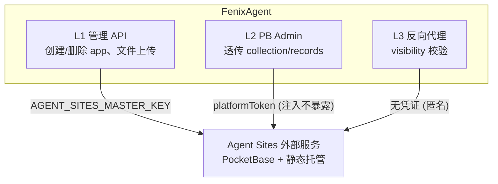
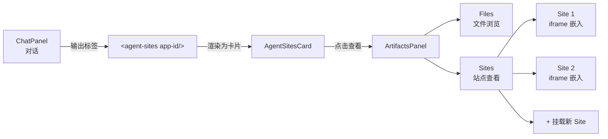
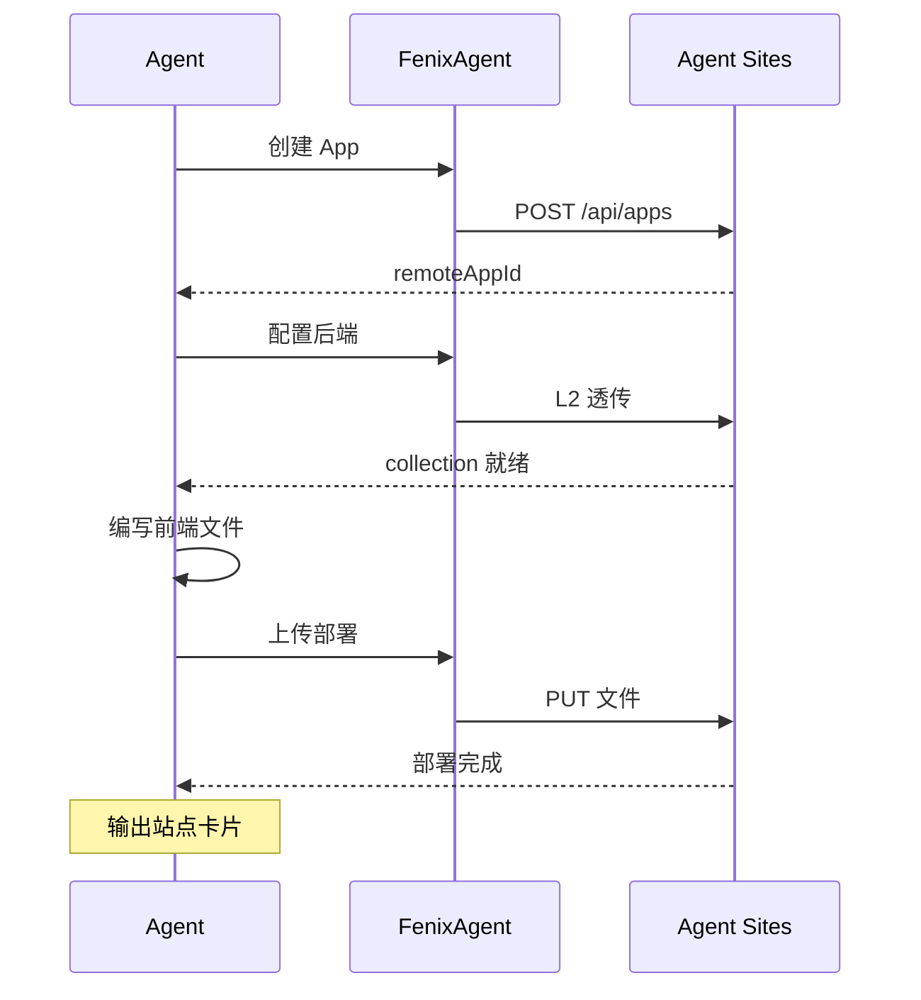

# Agent Sites

> 涉及模块：Agent Sites 代理、ArtifactsPanel、AgentConfig 绑定

## 概述

Agent Sites 让 Agent 不仅能对话，还能直接建站——创建带有独立后端的 Web 应用，一键部署到外部托管平台。用户可在对话中直接查看和使用这些站点。

Agent Sites 是独立部署的外部服务（与 RagFlow、Hindsight 同级），FenixAgent 通过反向代理和 API 调用与其交互。

## 三层架构

Agent Sites 按职责和凭证分离为三层：



| 层级 | 调用方 | 凭证 | 谁持有 |
|------|--------|------|--------|
| L1 | FenixAgent 后端 | `AGENT_SITES_MASTER_KEY` | 环境变量（Agent 永远接触不到） |
| L2 | 前端/Agent → 透传 | `platformToken`（superuser） | RCS DB（注入后透传，不暴露） |
| L3 | 浏览器直接访问 | 无（匿名） | PB collection rules 控制 |

## 与 Agent 的关联

Agent Sites 与 AgentConfig 是**多对多**关系——与 Skill/MCP 绑定层级一致。

```
AgentConfig ←→ agent_config_site_app ←→ SiteApp
```

- 绑定关系由 RCS 维护，Agent 运行时完全不消费
- Chat 的 ArtifactsPanel 中展示已绑定的 Sites（按绑定顺序）
- 绑定/解绑无需重启 Instance

## 前端展示



- **卡片触发**：Agent 在回复中输出站点标签，前端渲染为卡片，点击后 ArtifactsPanel 自动切换到 Sites 模式
- **iframe 嵌入**：同源路径经过 L3 反向代理到外部服务，仅做 visibility 校验

## 建站流程



Agent 不接触任何凭证——平台自动完成 token 注入和代理转发。

## Visibility 权限

L3 反向代理入口对每次请求做权限校验：

| 级别 | 访问规则 |
|------|---------|
| `public` | 任何人可访问 |
| `authenticated` | 已登录用户 |
| `org` | 同组织成员 |
| `private` | 仅创建者 |

未登录或权限不足时返回登录页或 403。权限结果按 60s LRU 缓存，避免每次查 DB。

## 上下级关系

- **→ AgentConfig**：多对多绑定，通过 ArtifactsPanel 展示
- **→ Instance**：Agent 在运行中通过 L2 API 配置和部署站点
- **→ 外部 Agent Sites 服务**：FenixAgent 作为反向代理和管理网关
