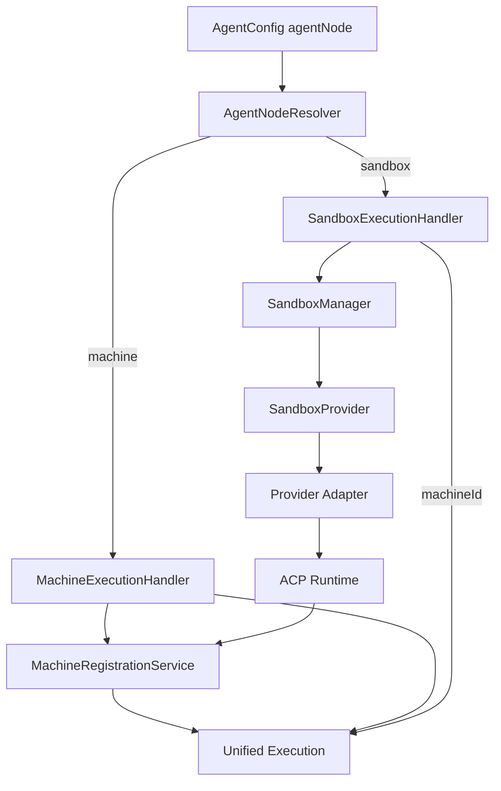
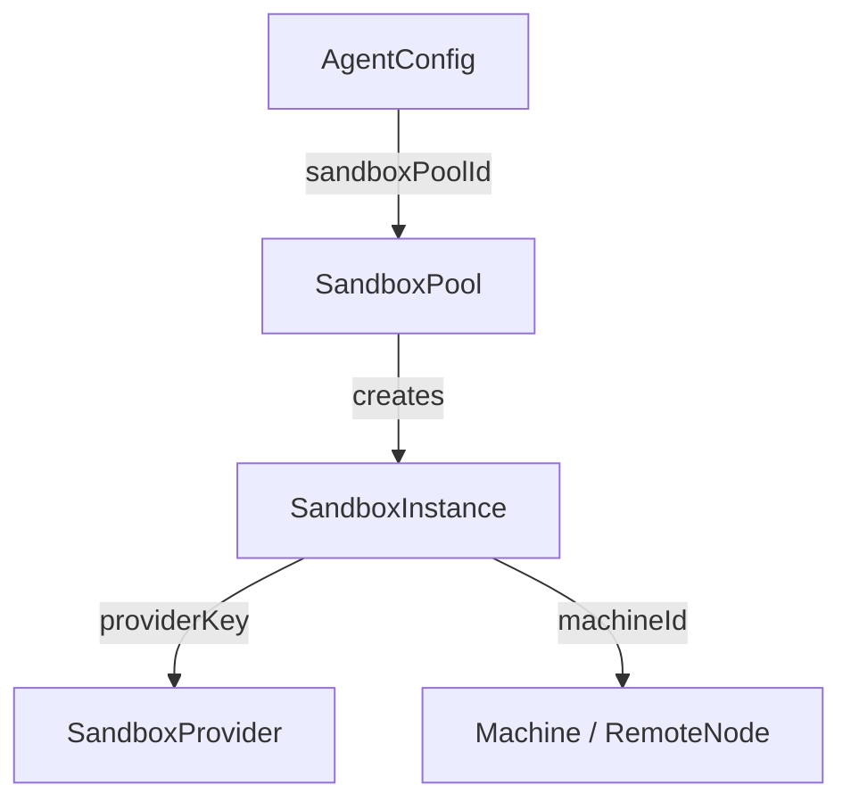
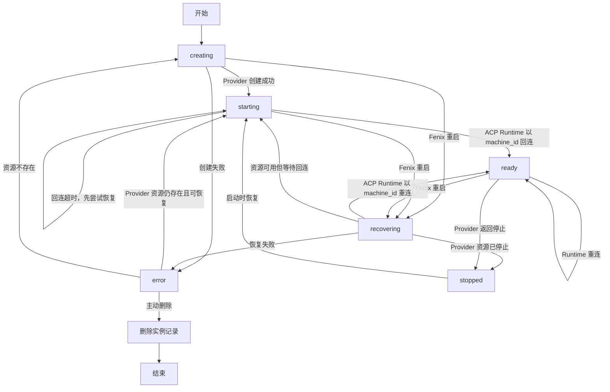
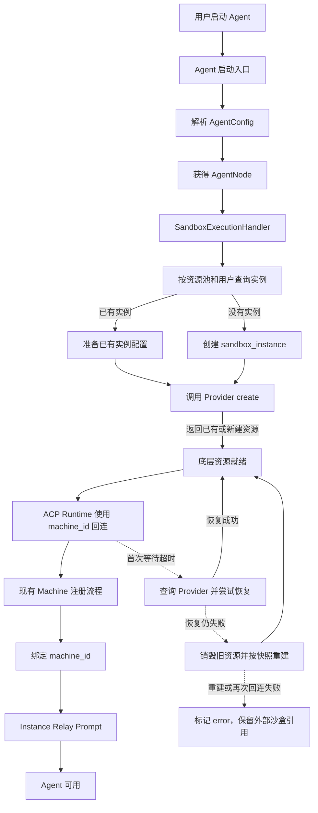
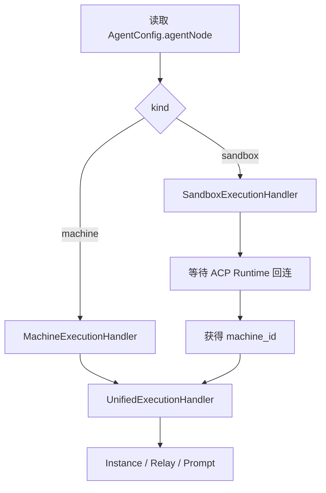
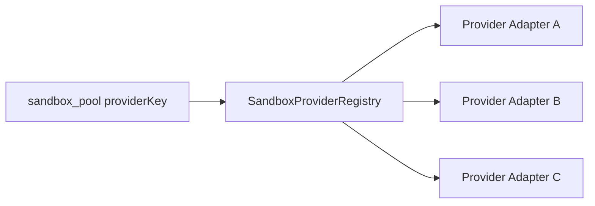

# 沙盒整体架构

## 概述

沙盒（Sandbox）是 FenixAgent 为 Agent 提供的托管执行资源。与用户自行接入的远程机器不同，沙盒由平台负责创建、复用、显式删除和运行状态维护；如果 Provider 返回资源处于停止状态，启动流程负责将其恢复后继续使用。沙盒就绪后，仍然作为一个远程运行时接入现有 ACP（Agent Communication Protocol）执行链路。

本设计的核心目标是把「业务上的资源选择」与「底层沙盒运行方案」解耦：用户选择的是沙盒资源池，FenixAgent 通过统一的 `SandboxProvider` 抽象创建实际资源。Provider 可以对接不同的容器运行时、集群编排方案或云厂商服务，上层业务不依赖具体实现。

本文按照「建模 → 数据结构 → 逻辑流程」说明沙盒架构，供开发实现前建立整体认知。

## 1. 设计边界

### 1.1 核心原则

1. **资源池是产品概念。** 用户只感知 `standard`、`high-performance`、`gpu` 等资源池，不直接操作节点标签、集群对象或 Provider 参数。
2. **Provider 是替换边界。** 沙盒业务服务只依赖 `SandboxProvider` 接口，不把某一种运行时的 API、状态值或资源描述泄漏到领域层。
3. **业务沙盒和运行时 Machine 分开建模。** `sandbox_instance` 管理沙盒业务生命周期；沙盒运行时作为动态 Machine 接入并写入/复用 `machine` 体系，二者通过 `machine_id` 关联。
4. **执行通道统一。** 沙盒内的 ACP runtime 按现有 Machine 协议回连，使用 `machine_id` 注册；后续复用现有 Machine、remote node、instance、relay 和 prompt 流程。
5. **同用户同池唯一。** 同一个用户在同一个资源池中最多拥有一个可复用的沙盒实例；不同资源池之间相互独立。

### 1.2 本期范围

- AgentConfig 选择沙盒资源池。
- 启动 Agent 时按「用户 + 资源池」创建或复用沙盒；组织上下文只用于请求鉴权和运行时资源注入，不参与实例身份。
- Provider 负责创建、查询、恢复和销毁底层沙盒；`create` 的已存在返回只用于幂等兜底，不承担恢复语义。FenixAgent 通过 `resolved_config` 固化实例实际配置，并通过显式 rebuild 使资源池默认配置作用到存量实例。
- 沙盒内 ACP runtime 主动回连 FenixAgent，并作为动态 Machine 注册为可调度远程运行时。
- Provider 返回已停止的沙盒时，启动流程调用独立的恢复接口。
- 资源池参数或镜像变化时，不直接修改正在运行的沙盒；由调用方通过 rebuild 重新计算受影响实例的配置快照，必要时再按新快照重建 Provider 资源。

### 1.3 非目标

- 不向用户暴露底层集群资源。
- 不新增独立于 ACP 的沙盒执行协议。
- 不为 Sandbox 单独设计 ACP 注册、心跳或 relay 协议，Sandbox runtime 完全复用 Machine 链路。
- 本期不设计跨地域调度、跨集群联邦或自动扩缩容编排。
- 不允许多个用户共享同一个沙盒实例。

## 2. 总体架构



各组件职责如下：

| 组件 | 职责 | 不负责的事情 |
| --- | --- | --- |
| `AgentNodeResolver` | 将 AgentConfig 解析为统一 Agent Node | 不创建资源、不连接 ACP |
| `MachineExecutionHandler` | 校验并准备用户机器执行节点 | 不处理沙盒生命周期 |
| `SandboxExecutionHandler` | 编排沙盒创建/复用、等待 runtime 就绪 | 不直接调用 Provider 具体 API |
| `SandboxManager` | 管理 `sandbox_instance` 记录、唯一性和状态 | 不解析 AgentConfig、不实现底层调度 |
| `SandboxProvider` | 抽象底层沙盒的幂等创建、查询和销毁 | 不决定 FenixAgent 侧租约和业务唯一性 |
| `MachineRegistrationService` | 按现有 Machine 协议校验回连并注册统一远程节点 | 不创建或销毁沙盒 |
| 统一执行链路 | 消费最终 `machineId`，启动 Instance 并建立 relay | 不关心 Machine 是人工接入还是由 Sandbox 创建 |

## 3. 建模

### 3.1 Agent Node 模型

AgentConfig 不再把执行位置表达为单一的 `machineId`，而是保存一个可扩展的 Agent Node：

```ts
type AgentNode =
  | {}
  | { kind: "machine"; machineId: string }
  | { kind: "sandbox"; sandboxPoolId: string };
```

`kind` 决定资源准备路线：

- 空对象 `{}`：未显式指定执行节点，运行时按「默认 Sandbox Pool → 组织默认 Machine → `local-default`」解析。
- `machine`：沿用现有用户机器注册和远程执行链路。
- `sandbox`：先通过沙盒资源池创建或复用沙盒，并获得其 `machineId`，再进入统一执行链路。

保留 `agent_config.machine_id` 作为兼容字段。历史 `agent_node=null` 且旧字段有值时，读路径将旧字段转换为 `kind=machine`；历史两个字段都为空时按 `{}` 处理。新 Agent 配置接口只读写 `agentNode`，不再暴露或自动写入 `machineId`。

控制台中的运行节点选择顺序固定为：本地默认、Sandbox Pool、Machine。本地默认保存为 `{}`，不提前固化为 `local-default`，避免跳过默认 Sandbox Pool 或组织默认 Machine。运行时的选择优先级为：显式 Sandbox Pool > 显式 Machine > 系统默认 Sandbox Pool > `RCS_DEFAULT_MACHINE_ID` > `local-default`。

### 3.2 沙盒资源池模型

`SandboxPool` 是平台全局定义的资源档位，描述默认资源、Provider 和沙盒使用的镜像。资源池不归属于某个组织，多个组织和用户可以选择同一个资源池。

资源池只表达「需要什么能力」，不表达「必须由哪种底层产品实现」。例如，GPU 资源池可以由带 GPU 的集群节点、云厂商 GPU 实例或其他运行时提供。

### 3.3 沙盒实例模型

`SandboxInstance` 是 FenixAgent 侧的业务实例记录，代表某个用户在某个资源池中的独立沙盒。它同时承担：

- 业务唯一绑定关系；
- Provider 外部实例的映射；
- 沙盒运行时对应的 `machine_id` 映射；
- ACP runtime 回连前后的生命周期状态；
- 显式删除/重建和故障排查所需的审计信息。

### 3.4 Provider 适配模型

Provider 负责把领域层的沙盒资源配置翻译成具体运行方案，并把外部状态映射回统一的沙盒引用。领域层只处理统一状态，不依赖 Provider 的原始对象结构。



### 3.5 用户工作区

沙盒宿主机工作区按用户稳定复用，不按沙盒业务 ID 建目录。Fenix 在生成并持久化 `sandbox_instance.resolved_config` 时，把调用方的逻辑挂载源转换为：

```text
{userId}/{relativePath}
```

例如用户 `user-123` 的 `ws`、`/ws` 和 `./ws` 都保存为 `user-123/ws`。同一用户的沙盒删除后重建，新的业务 `sandboxId` 仍使用同一用户目录，历史文件不会因为沙盒 ID 变化而丢失。

OpenSandbox Cluster 不接收或保存用户 ID，只把快照中的相对路径映射到对应 Server 的 `workspace_root`：

```text
Fenix 逻辑路径：user-123/ws
Server 宿主机路径：{workspace_root}/user-123/ws
```

Cluster 负责校验路径穿越、Windows 绝对路径和 NUL 字符；容器内 `mountPath` 由上游根据业务镜像配置决定。

## 4. 数据结构

### 4.1 `agent_config`

新增字段：

| 字段 | 类型 | 说明 |
| --- | --- | --- |
| `agent_node` | `jsonb` | Agent Node，结构由 `AgentNode` 定义 |
| `machine_id` | 原有类型，可空 | 仅用于兼容历史配置，新的 Agent 配置接口不再读写 |

示例：

```json
{ "kind": "machine", "machineId": "mach_xxx" }
```

```json
{ "kind": "sandbox", "sandboxPoolId": "sp_xxx" }
```

### 4.2 `sandbox_pool`

| 字段 | 类型 | 说明 |
| --- | --- | --- |
| `id` | `text` | 主键，由调用方控制 |
| `organization_id` | `text`，可空 | 兼容组织归属；为空表示全局资源池 |
| `name` | `varchar` | 展示名称 |
| `provider_key` | `varchar` | Provider 注册键，不写死具体实现名称 |
| `image` | `varchar` | 沙盒使用的镜像名 |
| `default_resources` | `jsonb` | 默认资源配置，包括 CPU、内存、磁盘、GPU、环境变量和卷 |
| `extra` | `jsonb`，可空 | Provider 专属默认配置，按 `provider_key` 分组保存 |
| `created_at` / `updated_at` | `timestamptz` | 审计时间 |

`default_resources` 结构为：

```json
{
  "cpu": 0.5,
  "memoryMb": 512,
  "diskGb": 5,
  "gpuCount": 0,
  "environment": {},
  "volumes": []
}
```

实例配置生成规则如下：

1. 以资源池的 `image`、`default_resources` 和 Provider 专属 `extra` 为基础；
2. 使用 Instance 的 `resource_overrides` 覆盖资源池默认资源，同名字段以 Instance 覆盖值为准，`environment` 按键合并，`volumes` 以 Instance 配置为准；
3. 将用户稳定工作区路径和该实例的 `RCS_MACHINE_ID` 写入最终配置；
4. 将最终结果保存为 `sandbox_instance.resolved_config`，后续 Provider 创建、恢复和重建均使用该快照。

资源池默认配置只用于生成新 Instance 或执行 rebuild 时重新计算快照。资源池更新不会自动修改存量 Instance 的 `resolved_config`，因此不会改变正在运行的沙盒。

约束：

- `id` 由调用方控制；资源池不依赖系统生成的编码，Agent Node 直接通过资源池 ID 引用。
- `provider_key` 必须能解析到已注册的 Provider，否则无法创建或使用该资源池。
- `image` 只保存镜像名，不在资源池模型中配置 Dockerfile 或镜像构建过程。
- `organization_id` 为空表示全局资源池；有值时仅对对应组织可读。

### 4.3 `sandbox_instance`

| 字段 | 类型 | 说明 |
| --- | --- | --- |
| `id` | `text` | FenixAgent 侧主键，由 FenixAgent 生成 |
| `provider_key` | `varchar` | 实际使用的 Provider |
| `sandbox_pool_id` | `text` | 所属资源池 |
| `user_id` | `text` | 用户归属 |
| `machine_id` | `varchar` | 该沙盒 ACP runtime 注册使用的 Machine ID |
| `external_sandbox_id` | `varchar`，可空 | Provider 返回的外部实例 ID |
| `status` | `varchar` | FenixAgent 侧状态机状态 |
| `resolved_config` | `jsonb` | 创建实例时固化的镜像、资源和 Provider 配置快照 |
| `resource_overrides` | `jsonb`，可空 | 针对该实例的资源覆盖值 |
| `provider_payload` | `jsonb`，可空 | Provider 原始响应或排障信息 |
| `last_heartbeat_at` | `timestamptz`，可空 | 最近一次心跳时间，与 machine 保持一致 |
| `created_at` / `updated_at` | `timestamptz` | 审计时间 |

核心约束：

```text
unique (provider_key, sandbox_pool_id, user_id)
```

唯一索引为 `(provider_key, sandbox_pool_id, user_id)`，与 create-or-reuse 的并发冲突处理一起保证同一用户、同一 Provider、同一资源池最多只有一条实例记录。实例删除采用物理删除，因此删除后可以重新创建同一维度的实例。资源池本身可以跨组织复用。

实例表保存业务唯一性、Provider 管理所需的外部 ID、统一 Machine 映射、生命周期状态和必要的配置/审计信息。`machine_id` 用于保存该沙盒 ACP runtime 注册使用的 Machine ID，沙盒创建时生成并注入 `RCS_MACHINE_ID`。

`environment_id` 不放在实例表中，因为同一个用户在同一个资源池中的沙盒可能被多个 Environment 使用；Environment 与沙盒实例不是一对一关系。`endpoint` 和 `node_name` 是 Provider 的运行时返回信息，当前执行链路通过 ACP 主动回连，不依赖这两个字段，因此不持久化。

### 4.4 状态模型



状态含义：

- `creating`：已建立 FenixAgent 记录，正在请求 Provider 创建资源。
- `starting`：Provider 已返回底层沙盒，但 ACP runtime 尚未回连。
- `recovering`：FenixAgent 重启后，保留的沙盒实例正在等待 Provider 状态确认和 ACP runtime 使用原 `machine_id` 重连；该状态不是 Provider 的停止状态。
- `ready`：已注册为统一 runtime，可用于启动 Agent Instance。
- `stopped`：Provider 返回底层沙盒已停止；保留实例记录，下一次启动时由 Provider 恢复。
- `error`：创建、回连或资源运行异常；保留外部沙盒信息。后续请求会先查询并尝试恢复；资源无法恢复时才按实例快照销毁并重建。

## 5. 逻辑流程

### 5.1 Agent 启动总流程



### 5.2 Agent Node 分流



统一执行链路只接收最终 `machine_id`，因此不需要知道该 Machine 是人工接入的远程机器，还是由 Sandbox Provider 创建的运行时。Provider 创建逻辑仍由 `SandboxExecutionHandler` 负责，不进入 ACP 和 relay 实现。

### 5.3 沙盒创建与复用

`SandboxExecutionHandler` 的核心操作是 `createOrReuse`：

1. 根据 `sandboxPoolId` 查询资源池，并校验 Provider 可用。
2. 查询同一 Provider、资源池和用户的 `sandbox_instance`；不存在时创建 Instance 记录并固化 `resolved_config`。
3. 按 Instance 的 `resolved_config` 调用 Provider 创建或查询底层资源，不重新读取资源池默认值覆盖快照。
4. 已存在且状态为 `ready`：检查对应 Machine 是否在线，在线则直接复用。
5. 已存在但 runtime 不在线：调用 Provider `get` 查询外部资源状态。
6. Provider 返回资源不存在：调用幂等 `create` 创建新资源。
7. Provider 返回资源已停止：调用独立的 `resume(providerSandboxId, businessSandboxId)` 恢复资源，不重新创建。
8. Provider 返回资源已就绪或仍在创建：保存外部沙盒 ID 和 `starting` 状态，等待 ACP runtime 回连。
9. ACP runtime 使用实例的 `machine_id` 回连并完成现有 Machine 注册后，状态改为 `ready`。
10. ACP 首次回连等待超时：先查询 Provider 并尝试恢复原资源；仍无法回连时，销毁旧资源并按 `resolved_config` 重建；重建后仍失败才进入 `error`，保留可用的外部资源引用。

Provider 创建失败时，实例状态必须转为 `error`，并保存可用于排障的 Provider 信息。并发请求通过数据库唯一约束、冲突处理和 Provider 的幂等 `create` 一起收敛为同一个实例；冲突请求复用已提交的实例，不创建第二个业务实例。

### 5.4 ACP 回连与 Machine 注册

Sandbox runtime 完全复用现有 Machine 的 ACP 连接和注册逻辑。

创建 `sandbox_instance` 时，同时生成并保存一个 `machine_id`。Provider 创建沙盒时，将这个 ID 注入沙盒环境变量：

```env
RCS_MACHINE_ID=mach_xxx
RCS_SECRET=...
RCS_URL=ws://...
```

沙盒内的 ACP runtime 使用 `RCS_MACHINE_ID` 发送现有 Machine 注册消息，并继续通过 `RCS_SECRET` 完成认证。FenixAgent 按 Machine 注册流程处理该连接：

1. 校验 `RCS_SECRET`；
2. 按 `machine_id` 创建或恢复 Machine 记录；
3. 注册统一 remote node、transport 和 heartbeat；
4. 将该 Machine 的在线状态同步到对应 `sandbox_instance`；
5. 继续使用现有 Instance、relay、session 和 prompt 流程。

从 ACP 层看，人工接入的远程 Machine 和 Sandbox runtime 没有协议差异。差异只存在于 FenixAgent 是否负责创建、恢复和销毁该 Machine 背后的底层资源。

Provider 返回资源已就绪，不代表 FenixAgent 已经可以使用该沙盒。只有使用对应 `machine_id` 的 ACP runtime 回连并完成现有 Machine 注册后，`sandbox_instance` 才能进入 `ready`。如果沙盒进程启动成功但 ACP runtime 没有回连，启动流程会先查询并尝试恢复原 Provider 资源，仍失败时再销毁并重建；重建后仍未回连才进入 `error`，并保留外部资源引用。

### 5.5 显式删除与重建

修改资源池或 Instance 的沙盒配置时，变更只写入数据库，不直接修改正在运行的 Provider 沙盒。需要让配置对已有 Instance 生效时，调用 rebuild；rebuild 按资源池当前默认配置和 Instance 的 `resource_overrides` 重新生成 `resolved_config`，只有快照发生变化的 Instance 才销毁旧 Provider 资源，并在下次进入 Agent 时按新快照创建。

delete 用于删除目标沙盒配置，日常较少使用。它销毁 Provider 资源并物理删除 `sandbox_instance` 记录，下次进入 Agent 时按资源池默认配置创建新的 Instance。rebuild 和 delete 都不清理宿主机上的用户工作区、OpenCode 配置或会话数据。

批量 rebuild 可以按资源池选择全部实例，也可以按 `instanceIds` 或 `userIds` 二选一选择目标；支持 dry-run，只返回配置发生变化的 Instance，不执行销毁和重建。

删除流程：

1. 清理运行时 Machine、transport 和 relay 的临时映射；
2. 调用 Provider `destroy(providerSandboxId, businessSandboxId)` 销毁底层资源；
3. Provider 销毁成功后删除 `sandbox_instance` 记录；
4. 销毁失败时保留实例记录并标记为 `error`，避免丢失故障排查所需的外部资源引用。

## 6. Provider 抽象

### 6.1 接口

```ts
type SandboxTemplate = {
  type: "image";
  value: string;
};

type SandboxResources = {
  cpu: number;
  memoryMb: number;
  diskGb: number;
  gpuCount: number;
  environment: Record<string, string>;
  volumes: Array<{
    name: string;
    source?: string;
    target: string;
    readOnly?: boolean;
  }>;
};

type SandboxCreateInput = {
  /** FenixAgent 生成的稳定 ID，同时作为 Provider 的幂等键。 */
  sandboxId: string;
  poolId: string;
  template: SandboxTemplate;
  resources: SandboxResources;
  providerExtra?: Record<string, unknown>;
};

type SandboxRef = {
  /** Provider 侧沙盒 ID，写入 sandbox_instance.external_sandbox_id。 */
  sandboxId: string;
  status: "creating" | "ready" | "stopped" | "error";
};

interface SandboxProvider {
  /** 不存在则创建，已存在则返回已有沙盒；已存在返回只用于幂等兜底。 */
  create(input: SandboxCreateInput): Promise<SandboxRef>;
  get(providerSandboxId: string, businessSandboxId: string): Promise<SandboxRef | null>;
  resume(providerSandboxId: string, businessSandboxId: string): Promise<SandboxRef>;
  destroy(providerSandboxId: string, businessSandboxId: string): Promise<void>;
}
```

Provider 接口中的两个 ID 含义不同：`businessSandboxId` 是 FenixAgent 生成的业务沙盒 ID，用于幂等创建以及让 Cluster 定位绑定的 Server；`providerSandboxId` 是 Provider 创建后返回的底层沙盒 ID，用于 OpenSandbox Server 的查询、恢复和删除。Provider 负责维护这两个 ID 在请求链路中的对应关系，上层业务只持久化两者各自的用途，不把底层 ID 当作业务沙盒 ID 使用。

`machineId` 不属于 Provider 创建接口的领域参数。FenixAgent 在生成 `resolved_config` 时将其写入资源环境变量 `RCS_MACHINE_ID`，Provider 只负责把最终资源配置传给底层运行方案。

Provider 接口只覆盖 FenixAgent 需要的最小生命周期能力。ACP runtime 的回连等待由 `SandboxExecutionHandler` 和现有 Machine 注册流程负责，不放入 Provider。

- `create(input)`：幂等创建入口。Provider 不存在则创建；已存在则直接返回。已存在返回只是并发或重复请求下的兜底，不负责恢复停止资源。
- `get(providerSandboxId, businessSandboxId)`：只读查询 Provider 当前资源状态；`businessSandboxId` 用于通过 Cluster 找到目标 Server，返回 `stopped` 是正常结果，不在 `get` 内执行恢复。
- `resume(providerSandboxId, businessSandboxId)`：恢复已停止的沙盒，不创建新资源。
- 如果启动流程通过 `get` 发现 `stopped`，应调用 `resume(providerSandboxId, businessSandboxId)`，恢复完成后再等待 ACP runtime 回连。
- `destroy(providerSandboxId, businessSandboxId)`：销毁底层沙盒，只由主动删除或不可恢复重建流程调用；销毁成功后由上层删除或更新 `sandbox_instance` 记录。

Provider 不负责：

- 判断「同一用户同一资源池」是否已有实例；
- 注册 ACP runtime；
- 决定实例是否可以被另一个用户复用。

沙盒管理页面的列表由 `SandboxManager` 查询 `sandbox_instance` 表提供，不直接调用 Provider 的列表接口；Provider 只负责单个底层沙盒的生命周期操作。

### 6.2 Provider 注册与选择



资源池保存 Provider 注册键，而不是把具体实现散落在业务代码中。`SandboxProviderRegistry` 在启动时装配 Provider；资源池创建或使用时校验注册键存在。

Provider 适配器内部可以将统一规格映射为任意底层能力，例如：

- 集群调度型 Provider：将资源和放置策略映射为工作负载、节点选择和运行时配置。
- 云实例型 Provider：将资源规格映射为实例类型、镜像和网络配置。
- 单机开发型 Provider：将规格映射为本地容器或进程。

这些映射只属于适配器实现，不应成为 `SandboxPool`、`SandboxManager` 或 `SandboxExecutionHandler` 的条件分支。

## 7. 与现有模块的集成边界

### 7.1 Agent 启动入口

现有 Agent 启动流程在创建或复用 `environment` 后，先调用 `AgentNodeResolver`：

```text
connectAgentInstance()
  → ensure environment
  → resolve agent node
  → machine: MachineExecutionHandler
  → sandbox: SandboxExecutionHandler
  → UnifiedExecutionHandler
  → spawn instance → relay → prompt
```

当沙盒功能开启时，未显式指定运行节点的 Agent 必须使用默认 Sandbox Pool；默认 Pool 未配置或初始化失败时，启动请求返回错误，不回退到 Machine。只有沙盒功能关闭时，才继续使用默认 Machine 或 `local-default`。

FenixAgent 启动时按环境配置 upsert 默认 Sandbox Pool：资源池 ID、名称、Provider、镜像、默认资源和 Provider 专属配置都以当前配置为准。这个同步只更新资源池本身，不改写已有 Instance 的 `resolved_config`；存量实例是否切换到新配置由运维显式执行 rebuild 决定。

沙盒管理能力通过系统级接口提供资源池和实例的查询、创建、修改、删除以及批量 rebuild。管理页面或运维工具读取 FenixAgent 的实例表，不通过 Provider 的 list 接口获取业务实例列表。

### 7.2 Instance 服务

`spawnInstanceFromEnvironment` 负责解析 `AgentNode`；当节点类型为 sandbox 时委托 `SandboxExecutionHandler` 准备沙盒并等待对应 `machine_id` 的 ACP 回连，之后把 Machine ID 交给 Core Runtime，不直接调用 Provider。

### 7.3 Registry 与 Core Runtime

Registry 只保留一套 Machine 注册流程：

- 人工接入的机器和 Sandbox runtime 都使用现有 `RCS_SECRET`、`machine_id` 和注册消息；
- Core Runtime、transport、heartbeat、重连和 relay 清理全部按 Machine ID 处理；
- SandboxManager 通过 `sandbox_instance.machine_id` 关联底层 Sandbox 与 Machine 状态；
- 沙盒资源由 Provider 管理，但其 ACP runtime 对 FenixAgent 来说就是一个动态创建的 Machine。

不再存在 Sandbox 专用 ACP 注册分支，也不再使用 `sandbox:<sandbox_id>` 作为 remote node ID。

## 8. 可靠性与安全

### 8.1 失败处理

| 场景 | 处理 |
| --- | --- |
| Provider 创建失败 | 状态置为 `error`，保存 Provider 信息，返回可重试错误 |
| 底层资源调度失败 | 状态置为 `error`，保留资源池和 Provider 上下文，便于定位容量问题 |
| Provider 不可用 | 转换为服务不可用错误，不回退到 Machine |
| 资源已创建但 ACP 未回连 | 先查询并尝试恢复原 Provider 资源；仍失败时销毁并按快照重建，重建后仍未回连才置为 `error` |
| Machine 连接断开 | 按现有 Machine 断连流程清理 transport、relay 和实例运行态；底层沙盒是否销毁由 Sandbox 生命周期策略决定 |
| 记录存在但 runtime 离线 | 查询 Provider 状态；停止资源调用 `resume`，可用资源重新进入 `starting`，不可恢复时按快照重建 |
| 同一用户并发启动 | 依赖唯一约束、事务和冲突重试，最终复用同一实例 |
| Provider 销毁失败 | 状态置为 `error`，进入可重试的删除任务 |

### 8.2 隔离边界

每个用户在每个资源池中拥有独立沙盒，隔离至少包括：

- 独立 workspace；
- 独立 ACP runtime 进程；
- 独立资源配额；
- 独立凭证和环境变量注入；
- Provider 侧的网络和运行时隔离策略。

FenixAgent 不应把组织级共享凭证直接注入节点或 Provider 全局配置；凭证应绑定到具体沙盒实例的启动上下文。

## 9. 架构结论

- 用户选择的是沙盒资源池，不直接选择底层节点或编排产品。
- `SandboxPool` 描述业务资源能力，`SandboxInstance` 描述用户实际拥有的沙盒。
- `SandboxProvider` 是底层运行方案的唯一抽象边界，不预设某一种 Provider 为架构前提。
- 沙盒创建、Provider 恢复和显式删除/重建由沙盒领域服务负责，ACP runtime 回连由 Machine 注册流程接入。
- 业务 Sandbox 与运行时 Machine 在资源生命周期上分开，在 Machine 注册、transport、Instance、relay 和 prompt 层统一。
- `machine_id` 是资源准备层与现有执行链路之间的稳定交界面。
