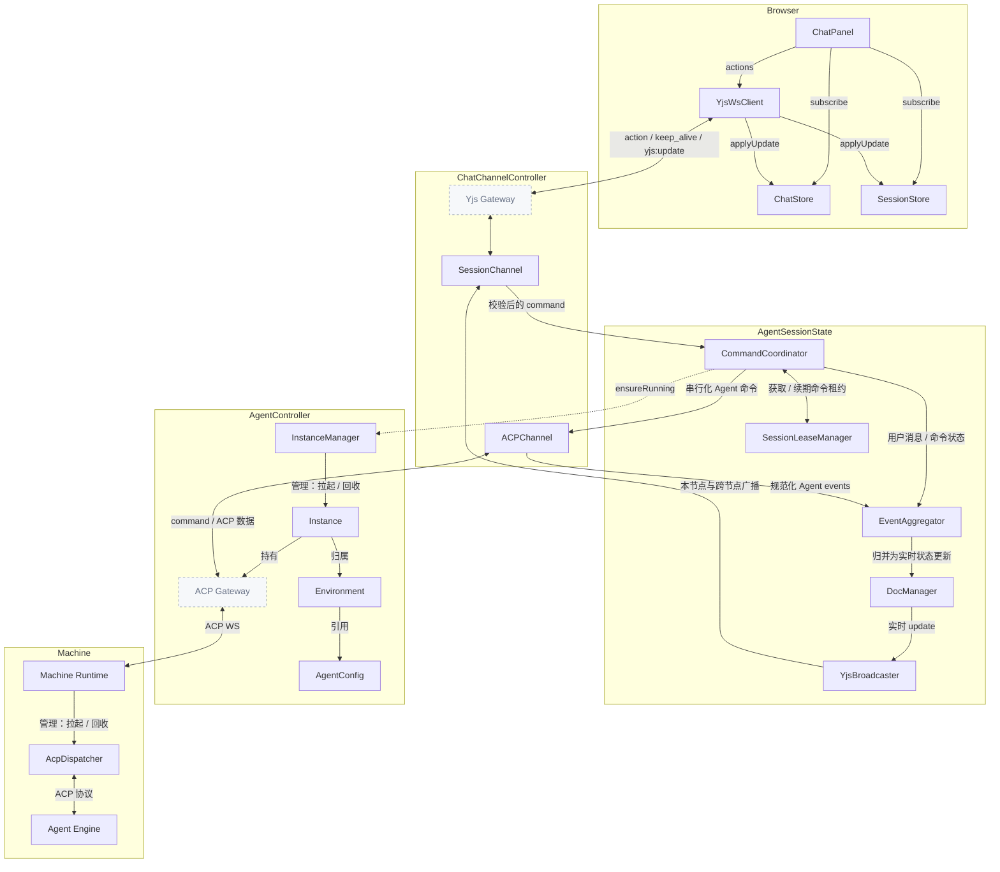
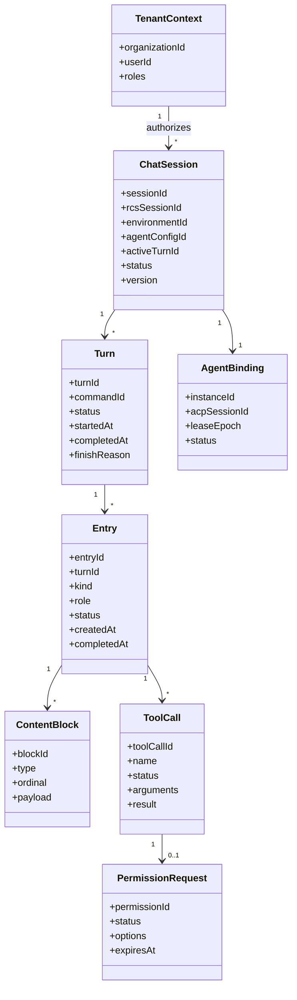
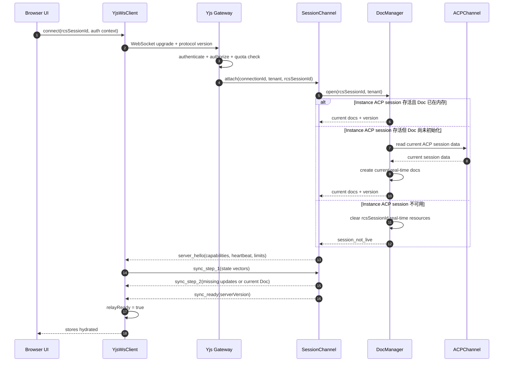
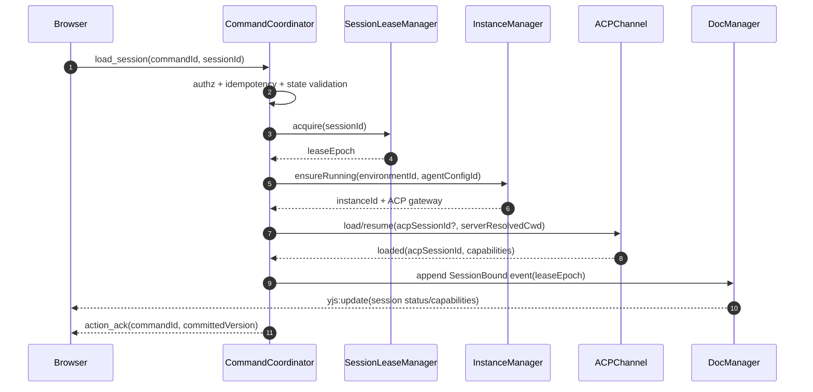
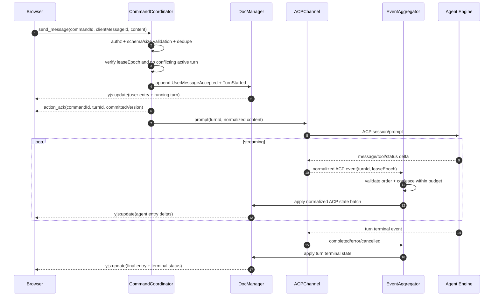
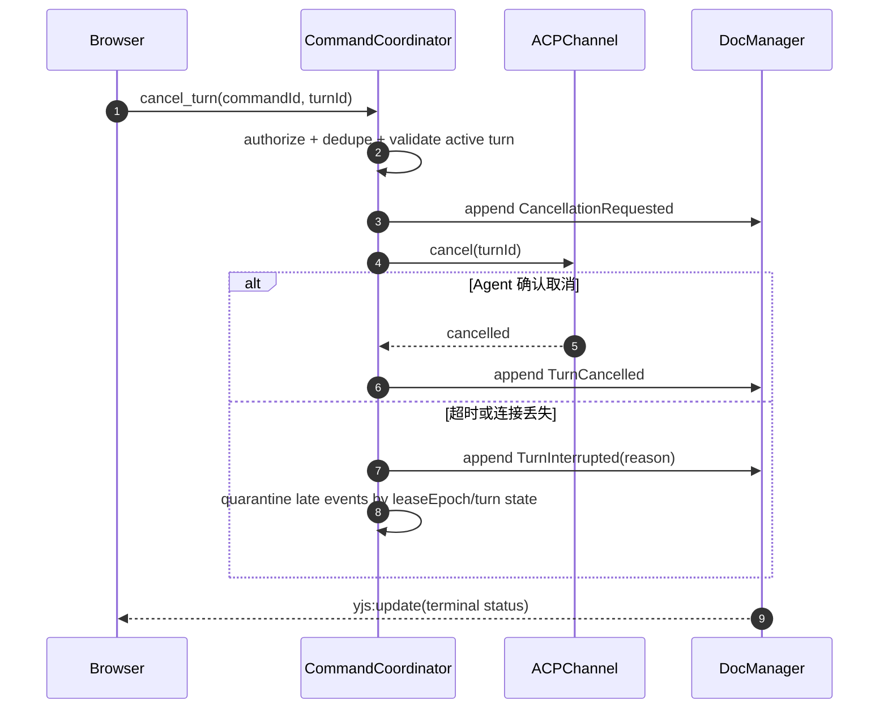
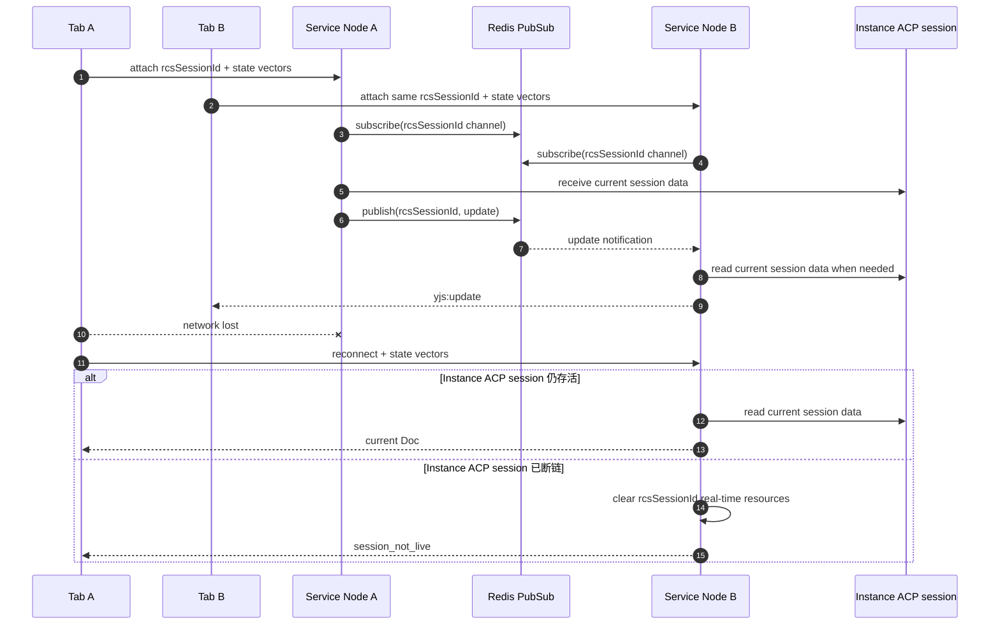
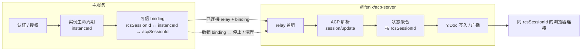
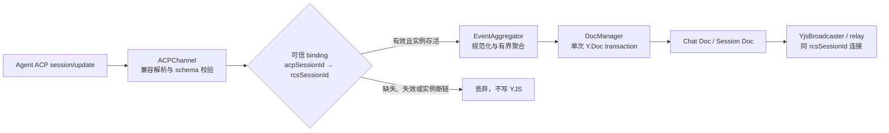
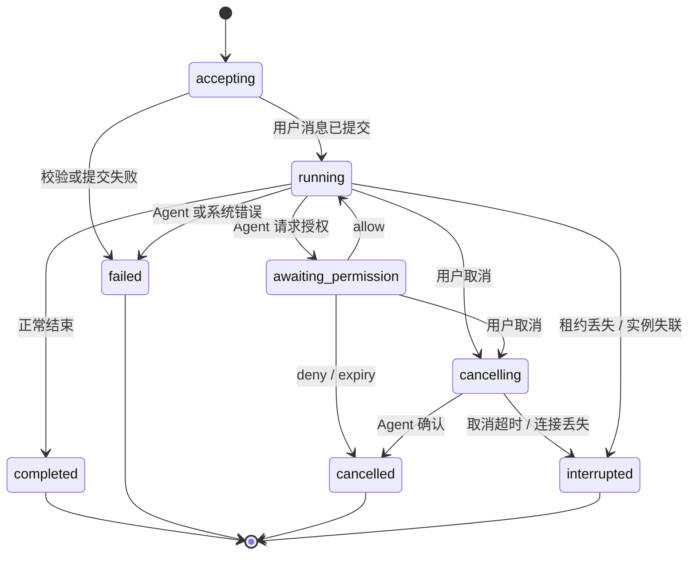

# Chat 流式对话全链路架构
# YJS Chat Streaming 目标架构

> 状态：理想架构（目标设计基线）
> 范围：浏览器 → 主服务 → Machine 的流式对话链路、关键实体生命周期、数据归属与隔离、典型用户场景。
> 定位：本文档描述**最佳设计与最终形态**，是前端交互式 Chat（YJS 路径）的权威架构契约。实现若与本文档存在差异，以本文档为准并持续推进对齐。
> 约定：本文档不绑定具体代码位置；模块归属以职责域表述。

## 1. 总体架构



## 2. 架构原则与权威边界

### 2.1 核心原则

1. **业务事实由服务端单写**：浏览器可以提交意图，但不能直接写入共享 Chat Doc。用户消息、Agent 消息、工具调用和会话状态仅由当前会话的服务端写入者提交。
2. **YJS 是实时状态投影，不是业务命令总线**：YJS Update 用于同步已经确认的会话事实；创建会话、发送消息、取消生成、权限应答等操作使用显式 Action。
3. **Instance ACP session data 是实时恢复真相，Y.Doc 是随实例生命周期存在的镜像**：Durable Store 仅保存业务会话元数据；Redis 只承担有界热缓存和连接协调，均不能恢复已断链实例的 YJS 状态。
4. **同一 Instance ACP session 的消息按其协议顺序处理**：服务端必须将其数据单写入对应 `rcsSessionId` 的 Y.Doc，避免重连或复用实例产生混写。
5. **传输至少一次，领域效果恰好一次**：客户端和 ACP 链路允许重发；服务端通过 `commandId`、`turnId`、事件序号和状态机实现幂等。
6. **流式增量可丢、最终状态不可丢**：短暂的 token delta 可以合并；turn 完成、错误、取消、工具调用和权限决策必须可靠落盘。
7. **租户边界先于资源定位**：任何 `sessionId`、`environmentId`、`instanceId` 都必须在认证主体与组织上下文内解析，不能仅凭 ID 访问。
8. **慢消费者不能阻塞 Agent**：广播与 ACP 读取解耦；连接达到背压阈值后重新同步当前实时 Doc 或断开重连，而不是无限缓存。

### 2.2 控制面与数据面

| 平面 | 请求 | 返回 | 一致性要求 |
|---|---|---|---|
| 控制面 | `create_session`、`load_session`、`send_message`、`cancel_turn`、`permission_response` | Action Ack / Error | 强校验、幂等、可审计 |
| 数据面 | YJS state vector、当前 Doc、incremental update | Chat Doc / Session Doc 更新 | 仅镜像存活 Instance ACP session 的当前状态 |
| Agent 协议面 | ACP command | ACP event | 单会话有序、可取消、超时明确 |
| 生命周期面 | `ensureRunning`、lease、keep-alive、dispose | instance/session status | fencing、防泄漏、资源有界 |

### 2.3 模块职责

| 模块 | 单一职责 | 不应承担 |
|---|---|---|
| `Yjs Gateway` | 认证、连接限流、协议解码、心跳与背压 | 领域状态变更、Agent 编排 |
| `SessionChannel` | 将连接绑定至安全上下文和会话频道，路由 Action/Update | 直接调用 Agent Engine |
| `CommandCoordinator` | Action 校验、幂等、单写租约、会话状态机、命令串行化 | 解析厂商特定 ACP 事件 |
| `ACPChannel` | ACP command/event 适配、超时、取消和协议兼容 | 持久化 Chat Doc |
| `EventAggregator` | 将 ACP 增量聚合为稳定领域事件，节流 token 更新 | 连接管理 |
| `DocManager` | 维护 Instance ACP session 的实时 Y.Doc 镜像、生成 update | 处理未经确认的客户端业务写入、持久化或恢复旧 Y.Doc |
| `YjsBroadcaster` | 本节点 fan-out、跨节点 PubSub、慢消费者隔离 | 业务去重 |
| `SessionLeaseManager` | 租约获取、续期、释放与 fencing token | 会话内容存储 |
| `InstanceManager` | Agent 实例拉起、复用、健康检查、空闲回收 | 浏览器会话状态 |

## 3. 领域模型与标识体系

### 3.1 聚合与实体



### 3.2 标识规则

- `sessionId`：平台持久化的业务会话标识，用于保存会话记录及建立前端 Agent 实例状态的确定性输入；本身不作为 YJS 或 relay 的隔离命名空间。
- `rcsSessionId`：由服务端基于 `agentId`、`userId` 及必要时的 `sessionId` 确定性生成的前端 Agent 实例标识；它是 YJS Doc、relay handle、广播频道、缓存及会话级资源隔离的唯一命名空间。
- `instanceId`：AgentController 管理的运行实例标识，仅用于向目标实例投递命令和维护实例生命周期；不是前端 Agent 实例或 YJS 隔离键。
- `acpSessionId`：Agent Engine 的 ACP 协议会话标识，仅用于 ACPChannel/relay 链接中的会话定位与消息投递；不可充当平台或 YJS 隔离标识。
- `connectionId`：单个 WebSocket 连接标识；仅用于诊断和连接级限流。
- `clientId`：浏览器安装或标签页实例标识；不具备授权能力。
- `commandId`：客户端为一次 Action 生成的幂等键；同一会话内唯一。
- `turnId`：一次用户输入至 Agent 终态的业务生命周期标识。
- `entryId`：时间线项目标识；用户消息、Agent 消息、工具调用摘要、系统事件均可成为 Entry。
- `eventId` / `eventSeq`：持久领域事件的全局唯一标识与会话内单调序号。
- `leaseEpoch`：会话写入租约的 fencing token，仅用于拒绝失去写权限后的晚到写入；它不参与前端 Agent 实例隔离或 ACP 消息路由。

## 4. 端到端流程

### 4.1 建立连接与初始同步



**约束：**

- `sync_ready` 之前 UI 可以读取本地缓存，但不得把会话视为在线可写。
- 服务端必须先完成 Chat Doc 与 Session Doc 的同步，再接受依赖当前状态的 Action。
- 客户端上传的 state vector 只是同步提示，不是业务版本或授权依据。
- 协议协商失败应返回稳定错误码并关闭连接，不得静默降级成未知语义。

### 4.2 创建或恢复 Agent 会话



- `cwd`、environment 与 Agent config 必须由服务端可信数据解析，浏览器不能覆盖。
- 能恢复既有 `acpSessionId` 时优先恢复；恢复失败应显式进入 `degraded` 或创建新绑定，且记录原因，不得伪装为原会话连续。
- Agent capability 未确认前，相关 Action 必须拒绝或排队在有界队列中。

### 4.3 发送消息与流式响应



**提交点：**服务端确认用户消息已成功投递到当前 Instance ACP session 后，才向 Y.Doc 写入对应状态；否则重试可能产生“Agent 已执行但 UI 无记录”的幽灵 turn。终态以当前 ACP session 返回的数据为准；实例 ACP session 已断链时不得从旧 Y.Doc、快照或历史事件推断终态。

**流式合并策略：**

- 文本 delta 在固定时间窗或字节阈值内合并，减少 YJS transaction 和广播次数。
- 工具调用状态、权限请求、错误和 turn 终态立即 flush，不参与延迟合并。
- 每个 flush 只修改对应 `entryId/blockId`，避免重写整个消息数组。
- 最终状态以当前 Instance ACP session data 为准；客户端发现 gap 或 hash/version 不一致时，重新同步当前实时 Doc，不得请求或应用旧快照。

### 4.4 取消生成



取消是状态迁移而非简单断开连接。任何晚到的 delta 都必须依据 `turnId + leaseEpoch + terminal state` 被丢弃并计量。

### 4.5 断线重连、多标签页与跨节点



- 多标签页共享同一 `rcsSessionId` 的实时 Y.Doc，但每个连接拥有独立流控和 awareness；一个慢标签页不能拖慢其他连接。
- Awareness 是短暂在线信息，不落持久状态，不参与业务决策。
- 浏览器连接断开只释放该 `connectionId` 的连接级资源；只要对应 Instance ACP session 仍存活，服务端继续持有该 `rcsSessionId` 的 Y.Doc。
- Instance ACP session 断链或实例被回收时，服务端删除其 `rcsSessionId` 的 Chat Doc、Session Doc、relay handle、广播订阅与热缓存；后续建立新实例时创建新的实时投影，不恢复旧 Y.Doc。

## 5. YJS 数据结构设计

### 5.1 文档拆分

每份业务会话记录保存其 `rcsSessionId`；实时层按该值命名两份独立 Y.Doc：

| Doc | 名称 | 内容 | 生命周期 |
|---|---|---|---|
| Chat Doc | `chat:{rcsSessionId}` | 消息时间线、内容块、工具调用、turn 投影 | 与前端 Agent 实例数据保留期一致 |
| Session Doc | `session:{rcsSessionId}` | 会话元信息、Agent 状态、能力、活动 turn、同步版本 | 与前端 Agent 实例一致，更新频率较低 |

拆分的原因是隔离高频内容流与低频控制状态，降低订阅和同步成本。两份 Doc 都是 Instance ACP session data 的实时镜像，不是持久化恢复源；跨文档更新按 ACP 会话内事件顺序应用，不依赖 YJS 跨 Doc transaction。

### 5.2 Chat Doc schema

```ts
interface ChatDocRoot {
  schemaVersion: number;
  projectionVersion: number;
  entryOrder: string[];
  entries: Record<string, ChatEntry>;
}

interface ChatEntry {
  entryId: string;
  turnId: string | null;
  kind: "message" | "tool" | "system";
  role: "user" | "assistant" | "system";
  status: "pending" | "streaming" | "completed" | "cancelled" | "error";
  authorUserId: string | null;
  createdAt: string;
  completedAt: string | null;
  blockOrder: string[];
  blocks: Record<string, ContentBlock>;
  error: PublicError | null;
}

type ContentBlock =
  | { blockId: string; type: "text"; text: string }
  | { blockId: string; type: "reasoning"; text: string; visibility: "summary" | "hidden" }
  | { blockId: string; type: "tool_call"; toolCallId: string }
  | { blockId: string; type: "resource"; resourceId: string; mediaType: string; name: string };

interface ToolCallProjection {
  toolCallId: string;
  turnId: string;
  name: string;
  status: "pending" | "awaiting_permission" | "running" | "completed" | "error" | "cancelled";
  arguments: JsonValue | null;
  result: JsonValue | null;
  publicError: PublicError | null;
  permissionId: string | null;
}
```

物理映射建议：

- 根对象、`entries`、`blocks`、`toolCalls` 使用 `Y.Map`；顺序索引使用 `Y.Array<string>`。
- 流式文本使用 `Y.Text`，避免每个 token 替换完整字符串。
- 大型二进制、附件和超大工具结果只保存受授权的资源引用，不嵌入 Y.Doc。
- `entryOrder` 与 `entries` 分离，便于稳定定位、局部更新和未来分页。
- 删除采用领域 tombstone 或保留删除事件；不要由客户端物理删除权威记录。

### 5.3 Session Doc schema

```ts
interface SessionDocRoot {
  schemaVersion: number;
  projectionVersion: number;
  session: {
    sessionId: string;
    title: string | null;
    status: "initializing" | "ready" | "running" | "degraded" | "closed";
    environmentId: string;
    agentConfigId: string;
    activeTurnId: string | null;
    createdAt: string;
    updatedAt: string;
  };
  agent: {
    instanceId: string | null;
    acpSessionId: string | null;
    status: "offline" | "starting" | "ready" | "busy" | "error";
    capabilities: Record<string, boolean>;
    lastActivityAt: string | null;
    publicError: PublicError | null;
  };
  pendingPermissions: Record<string, PermissionProjection>;
}

interface PermissionProjection {
  permissionId: string;
  turnId: string;
  toolCallId: string | null;
  title: string;
  description: string | null;
  options: Array<"allow_once" | "allow_session" | "deny">;
  status: "pending" | "resolved" | "expired";
  expiresAt: string;
}
```

`organizationId`、完整授权规则、密钥、内部错误、原始凭证和机器连接信息不得进入 Y.Doc。租户上下文由服务端连接绑定提供，而不是由文档字段声明。

### 5.4 Schema 演进

- `schemaVersion` 描述结构版本，`projectionVersion` 描述当前 Instance ACP session data 已镜像到 Y.Doc 的进度，两者不可混用。
- 服务端升级实时 schema 时，应为仍存活的 Instance ACP session 以兼容方式更新 Y.Doc；客户端只能消费服务端声明支持的版本。
- 更新必须做到“旧客户端忽略未知字段仍安全”；破坏性变更通过协议版本协商和双读窗口发布。
- Doc 更新失败时仅将当前实时链接标记为 `degraded` 并报警；实例 ACP session 仍是权威状态，重连或新建实例时不得依赖旧 Y.Doc 继续写入。

## 6. ACP 到 YJS 状态聚合

ACP 到 YJS 的聚合层是唯一允许把 Agent 运行时数据写入 Y.Doc 的边界。它只消费**当前存活的 Instance ACP session data**，将其转换为前端可消费的稳定状态；浏览器、旧实例、已解绑 ACP session 和未通过校验的协议帧都不能直接修改 YJS。

### 6.1 模块边界与交接契约



主服务只管理可信 binding 与实例生命周期；`@fenix/acp-server` 是唯一的 ACP 解析和 YJS 投影边界。

### 6.2 输入、路由与输出



1. `ACPChannel` 先使用既有 `extractJsonRpc()` 兼容原始 JSON-RPC 与包裹格式；只接受 `method === "session/update"` 的通知。
2. 事件类型必须从 `params.update.sessionUpdate` 读取，事件载荷使用同一 `update` 对象；文本内容通常位于 `update.content`。不得读取不存在的 `update.agent_message_chunk`，也不得把 `sessionUpdate` 自身当作文本。
3. `acpSessionId` 只能在服务端维护的、当前 Instance ACP session 的 binding 中反查 `rcsSessionId`。浏览器提供的 `rcsSessionId`、ACP 帧携带的任意额外上下文字段均不能覆盖该 binding。
4. 聚合后的状态仅写入 binding 对应的 `chat:{rcsSessionId}` 与 `session:{rcsSessionId}`。`acpSessionId` 只用于协议投递，不能成为 YJS Doc 名称、广播频道或缓存键。
5. binding 不存在、已解绑、Instance ACP session 已断链，或 `rcsSessionId` 的实时资源已删除时，立即丢弃事件；不得重新创建旧 Doc，也不得缓存给未来实例使用。

### 6.3 规范化状态映射

聚合器将各 Agent 的 ACP 差异转换为有限的前端状态，保留展示与交互所需字段，过滤内部实现信息、Machine 信息、密钥、原始工具参数和内部错误。

| ACP `sessionUpdate` | YJS 写入位置 | 聚合规则 |
|---|---|---|
| Agent 文本增量 | Chat Doc 的当前 assistant `Y.Text` | 追加到当前 `entryId/blockId`；没有活跃 assistant entry 时创建一个 |
| 思考/推理增量 | Chat Doc 的 reasoning block | 按产品可见性写入 `summary` 或 `hidden`，不得把隐藏内容发送给无权客户端 |
| 工具调用开始、更新、完成 | Chat Doc 的 `toolCalls` | 按 `toolCallId` upsert；结构化状态立即同步，超大结果仅保留受授权资源引用 |
| 权限请求、解决或过期 | Session Doc 的 `pendingPermissions` | 按 `permissionId` upsert；选项、状态和过期时间由服务端规范化 |
| Agent status、capabilities、session info | Session Doc 的 `agent` / `session` | 覆盖当前状态；能力未确认前保持不可用 |
| turn 完成、失败、取消或中断 | Chat Doc entry 与 Session Doc 活动 turn | 终态立即写入，清除 `activeTurnId`，之后的同 turn 增量直接丢弃 |

映射必须是幂等的：重放同一 ACP 帧不应重复创建 Entry、工具调用或权限请求。聚合器以 `turnId`、`entryId`、`toolCallId`、`permissionId` 和终态状态机确定写入目标；缺少必要关联信息的帧拒绝投影并记录脱敏诊断。

### 6.4 顺序、微批处理与事务边界

- 同一 `rcsSessionId` 的 ACP 帧按收到顺序进入独立有界缓冲区，绝不与其他 `rcsSessionId` 混批。
- 文本与 reasoning 增量可在固定时间窗或字节阈值内合并；单个批次通过一次 Y.Doc transaction 写入，减少 `yjs:update` 与渲染压力。
- 工具状态、权限、Agent status、错误、turn 终态及 Instance ACP session 断链是控制类更新：先 flush 当前内容批次，再立即写入，保证用户看到的状态不倒退。
- 批次达到大小上限、等待超时或 YJS 背压时立即 flush；广播失败只影响连接传递，不能阻塞 ACP 读取循环。
- 不对 token 逐条创建领域事件、日志或 trace；仅在聚合窗口、工具/权限状态和 turn 终态形成可观测的状态变化。

### 6.5 断链与清理

Instance ACP session 断链或实例回收时，聚合器必须先停止接收该 binding 的新事件并取消其 `rcsSessionId` 待 flush 批次，再删除 Chat Doc、Session Doc、relay handle、广播订阅和热缓存。已排队或晚到的 ACP 帧均丢弃。

前端 WebSocket/relay 断开不触发聚合器取消批次或删除 Y.Doc；只要同一 Instance ACP session 仍存活，聚合器继续维护该 `rcsSessionId` 的实时镜像。新的 Instance ACP session 即使复用确定性 `rcsSessionId`，也只能创建新的空批次和当前实时投影，绝不得接续旧批次或旧 Y.Doc。

## 7. Action、Ack 与领域事件

### 7.1 Action envelope

```ts
interface ClientAction<TType extends string, TPayload> {
  protocolVersion: number;
  type: TType;
  commandId: string;
  sessionId: string;
  expectedProjectionVersion?: number;
  payload: TPayload;
  client: {
    clientId: string;
    sentAt: string;
  };
}

interface ActionAck {
  type: "action_ack";
  commandId: string;
  status: "accepted" | "committed" | "duplicate";
  turnId?: string;
  committedProjectionVersion?: number;
}

interface ActionError {
  type: "action_error";
  commandId: string;
  code:
    | "UNAUTHENTICATED"
    | "FORBIDDEN"
    | "SESSION_NOT_FOUND"
    | "VERSION_CONFLICT"
    | "INVALID_STATE"
    | "RATE_LIMITED"
    | "AGENT_UNAVAILABLE"
    | "PAYLOAD_TOO_LARGE";
  message: string;
  retryable: boolean;
  retryAfterMs?: number;
}
```

`accepted` 只表示进入有界处理队列，`committed` 才表示业务事实已持久化。客户端在超时后可使用相同 `commandId` 重发，不得换 ID 猜测执行结果。

### 7.2 领域事件 envelope

```ts
interface SessionEvent<TType extends string, TPayload> {
  eventId: string;
  eventSeq: number;
  sessionId: string;
  organizationId: string;
  type: TType;
  occurredAt: string;
  commandId: string | null;
  turnId: string | null;
  leaseEpoch: number;
  payload: TPayload;
  schemaVersion: number;
}
```

推荐事件族：

- 会话：`SessionCreated`、`SessionBound`、`SessionDegraded`、`SessionClosed`。
- Turn：`TurnStarted`、`CancellationRequested`、`TurnCompleted`、`TurnCancelled`、`TurnFailed`、`TurnInterrupted`。
- 消息：`UserMessageAccepted`、`AgentEntryOpened`、`AgentContentAppended`、`AgentEntryCompleted`。
- 工具：`ToolCallStarted`、`ToolCallUpdated`、`PermissionRequested`、`PermissionResolved`、`ToolCallCompleted`。
- 生命周期：`AgentInstanceAttached`、`AgentInstanceDetached`、`AcpSessionRecovered`。

事件日志保存可恢复的稳定语义，不要求永久保存每个 token。`AgentContentAppended` 应按聚合窗口批量记录；快照建立后可依据保留策略压缩已覆盖的高频增量，但不得破坏审计要求。

## 8. 状态机与并发规则

### 7.1 Turn 状态机



终态不可逆。恢复执行必须创建显式的新 turn 或 reconciliation 事件，不能把已终止 turn 改回 `running`。

### 7.2 并发控制

1. 同一 `sessionId` 的状态迁移按 `eventSeq` 串行提交。
2. 默认每个会话仅允许一个活动 turn；若未来支持并行 turn，必须先引入独立 branch/thread 聚合，不能直接放宽约束。
3. 所有外部副作用前后均校验 `leaseEpoch`。旧持有者失去租约后即使仍存活，也不能提交事件或向客户端广播权威更新。
4. `commandId` 去重记录至少覆盖客户端最大重试窗口；已提交命令返回原 Ack，不重复调用 Agent。
5. Permission resolution 使用 compare-and-set：仅 `pending` 可迁移一次，重复或过期回答返回幂等结果。
6. 标题更新、已读状态等非 Agent 操作可独立排队，但仍通过服务端领域命令写入；不能借 YJS client update 绕过授权。

## 9. 运行时权威性与断链

### 8.1 数据权威顺序

实时对话状态按以下顺序归属：

```text
Instance ACP session data（权威状态）
→ YJS Chat Doc / Session Doc（前端实时镜像）
→ ACPChannel / relay 消息（传递载体）
```

YJS 不保存可跨 Instance ACP session 恢复的旧投影，也不作为 Agent 状态的持久化真相。`rcsSessionId` 仅在对应 Instance ACP session 存活期间，为该前端 Agent 实例的实时资源提供隔离命名空间。

### 8.2 两类断链

| 断链对象 | YJS 处理 | 后续行为 |
|---|---|---|
| 前端 WebSocket / relay 断开 | 不对 `rcsSessionId` 执行任何 YJS 状态清理 | Instance ACP session 存活时，客户端重连后同步当前实时 Y.Doc |
| Instance ACP session 断链或实例回收 | 删除该 `rcsSessionId` 的 Chat Doc、Session Doc、relay handle、广播订阅和热缓存 | 后续启动或连接的是新的 Instance ACP session，并创建新的 YJS 实时投影；不加载旧 Y.Doc |

### 8.3 运行时更新

服务端将当前 Instance ACP session data 转换并单写入 Y.Doc，再通过 ACPChannel / relay 广播给同一 `rcsSessionId` 下的前端连接。前端不得直接写入业务内容。

当 YJS 更新或广播失败时，只影响当前实时链接；服务端必须保留 ACP session 的诊断上下文并返回可恢复错误，但不得把旧 Y.Doc 作为恢复输入。Instance ACP session 已断链时，任何晚到 ACP 消息均被丢弃。

## 10. 安全、隔离与隐私

- WebSocket upgrade 和每个 Action 均绑定认证会话；长连接期间权限撤销必须通过短期凭证、定期复验或主动踢除生效。
- 授权条件至少包含 `organizationId + userId + sessionId`，并校验 environment、Agent config、附件和工具资源属于同一租户边界。
- 浏览器输入、ACP 事件、工具参数与资源 URL 全部视为不可信；在进入领域事件前执行 schema、大小、编码和策略校验。
- 日志只记录关联 ID、状态、耗时和大小，不记录消息正文、工具参数、token、密钥或原始凭证。
- 错误分为内部诊断错误与 `PublicError`；Y.Doc 和 ActionError 只允许稳定、脱敏的公开信息。
- 对消息发送、连接、同步流量、工具调用和权限应答分别限流；租户、用户、会话和连接四级配额同时生效。
- 导出、删除和保留策略作用于业务会话记录、附件与缓存；删除任务应可审计且最终清除所有派生副本。

## 11. 背压、超时与资源治理

- 每连接维护有界发送队列。超过软阈值时合并 update 或切换到“需要重新同步当前 Doc”；超过硬阈值时以可恢复错误关闭连接。
- ACP 读取循环与客户端广播解耦，单个浏览器永远不能阻塞 Agent stdout/WebSocket 消费。
- `send_message`、Agent 启动、首 token、turn 总时长、工具执行、权限等待和取消分别配置超时，避免用一个总超时掩盖阶段故障。
- 会话队列、事件批次、Y.Doc 大小、单消息大小、工具结果和附件均有硬上限。
- Agent 实例按租户与用户并发配额治理；空闲回收必须确保无活动 turn、无待处理权限和无未提交事件。
- 服务关闭时停止接收新 Action，完成或中断在途提交，释放租约，然后关闭连接和实例引用。

## 12. 可观测性与 SLO

### 11.1 关键指标

- 连接：在线连接数、认证失败、重连率、心跳超时、背压断连。
- 同步：初始同步耗时、当前 Doc 大小、update 大小/频率、连接重同步耗时。
- 交互：Action Ack 延迟、消息提交延迟、首 token 延迟、turn 完成时长、取消延迟。
- Agent：启动成功率、ACP 断连、实例复用率、空闲回收、僵尸实例。
- 一致性：命令去重命中、晚到 ACP 消息丢弃、YJS 镜像失败、Instance ACP session 断链数量。
- 资源：每会话 Doc 内存、广播队列深度、事件批次大小、Redis/Durable Store 延迟。

### 11.2 Trace 与日志关联

统一携带 `traceId`、`organizationId`（可哈希）、`sessionId`、`rcsSessionId`、`turnId`、`commandId`、`instanceId`、`acpSessionId` 和 `connectionId`。从浏览器 Action 到 Agent command、ACP session data 更新及 YJS 广播形成一条 trace，但正文和敏感参数不进入 span attribute。

建议 SLO：

- 已热启动会话的 Action committed Ack：P95 < 300 ms（不含 Agent 响应）。
- Agent 首个可见增量：在 Agent 产生后 P95 < 200 ms 到达健康客户端。
- 断线重连后状态恢复：P95 < 2 s（常规 Doc 大小范围内）。
- 已提交消息丢失率：0；重复业务效果率：0。

## 13. 失败矩阵

| 故障 | 用户可见行为 | 系统动作 | 数据保证 |
|---|---|---|---|
| 浏览器短暂断线 | 显示离线/重连 | 仅释放连接级资源；Instance ACP session 存活时重新同步当前 Y.Doc | 不影响实例内实时状态 |
| 服务节点崩溃 | 短暂重连或实例断开 | 能重新连接仍存活的 Instance ACP session 时同步其当前 Y.Doc；否则清理 YJS 实时状态 | 不伪造完成 |
| Redis 不可用 | 跨节点实时广播受限 | 降级或关闭受影响连接；不得以 Redis 恢复旧 Y.Doc | ACP session data 不被缓存替代 |
| Durable Store 不可用 | 不影响已运行实例的实时流 | 不把业务持久化故障伪装成 YJS 恢复；按业务存储策略处理 | YJS 不承担持久化真相 |
| Agent 启动失败 | Session `degraded`，允许重试 | 不创建 YJS 实时投影，记录脱敏原因 | 不产生幽灵实例 |
| ACP 中途断开 | 当前交互中断 | 删除该 `rcsSessionId` 的 YJS 实时资源，丢弃晚到 ACP 消息 | 不伪造完成 |
| 慢消费者 | 短暂落后后重新同步当前 Doc | 合并更新或断开重连 | 不影响 Agent 与其他用户 |
| 客户端重复 Action | 返回原结果 | `commandId` 去重 | 副作用一次 |
| Y.Doc 镜像损坏 | 当前连接 `degraded` 或断开 | 从仍存活的 Instance ACP session data 重新生成当前实时 Doc；若实例已断链则删除 Doc | 不使用旧 Y.Doc 作为恢复源 |

## 14. 典型用户场景验收

### 隔离维度速览

| 隔离维度 | 主区分键 | 强制机制 |
|---|---|---|
| 组织 | `organizationId` | 认证上下文中的组织授权，以及存储、缓存、租约和广播键的组织命名空间 |
| 智能体配置与运行环境 | 持久化的 `environmentId + agentConfigId` | 服务端从会话绑定解析可信配置，忽略客户端覆盖字段 |
| 前端 Agent 实例 | `rcsSessionId` | 以 `rcsSessionId` 唯一命名 Chat Doc、Session Doc、relay handle、缓存与广播通道；一个 ID 对应一份前端 Agent 实例状态 |
| Agent 运行实例 | `instanceId` | 仅用于服务端选择命令投递目标与管理实例生命周期，不承担隔离职责 |
| ACP 会话投递 | `acpSessionId` | 仅用于 ACPChannel/relay 将协议消息投递至既有的 `rcsSessionId` 上下文，不承担隔离职责 |
| 同前端 Agent 实例的连接 | `connectionId` | 独立心跳、awareness、背压队列和连接级限流；共享同一 `rcsSessionId` 的服务端权威投影 |

### 场景 A：首次进入会话

用户打开 ChatPanel 后先看到 loading；认证、授权和两份 Doc 同步完成后进入 ready。Agent 尚未启动不影响浏览历史；第一次需要 Agent 的 Action 才触发 `ensureRunning`。失败时显示可重试错误，不清空已有消息。

### 场景 B：发送消息并收到流式回复

用户消息在服务端提交后只出现一次；Agent 文本稳定增量更新同一个 `Y.Text`；工具调用和权限请求作为结构化内容呈现；完成后 turn 和 entry 同时进入终态。刷新页面得到相同顺序和内容。

### 场景 C：刷新与多标签页

刷新或新标签页使用相同 `rcsSessionId` 恢复同一份前端 Agent 实例状态与 Doc。用户消息不由前端乐观写入共享 Doc，因此不会与后端回显双写。两个标签页都能看到更新，但 awareness 和发送队列互不影响。

### 场景 D：生成期间服务切换节点

连接中断后客户端自动重连，并重新连接仍存活的 Instance ACP session；服务端据当前 ACP session data 同步实时 Y.Doc。若无法重新连接该 Instance ACP session，则当前 YJS 实时状态被清理，turn 明确标记为 `interrupted`，不会自动重发用户 prompt。

### 场景 E：权限请求

Agent 产生结构化 `PermissionRequested`；有权限的用户只能解决一次。允许后继续原 turn，拒绝或超时后进入清晰终态。权限原始策略与敏感工具参数不进入公开 Doc。

### 场景 F：组织隔离——同一资源 ID 不可跨组织访问

组织 A 与组织 B 分别拥有会话、Environment、Agent config 和 Agent 实例。**区分依据是认证上下文的 `organizationId`；服务端以它作为资源查询条件和存储/缓存/租约/广播命名空间，绝不只凭资源 ID 定位。**组织 B 的用户即使通过地址栏、WebSocket Action、重放历史报文或缓存内容提交组织 A 的 `sessionId`、`environmentId`、`agentConfigId` 或 `instanceId`，服务端仍必须先以当前认证主体的组织上下文解析资源，再决定是否继续处理。

### 场景 G：智能体隔离——不同 Agent config 与 Environment 的会话互不串流

同一组织中，用户同时使用智能体 A 和智能体 B；两者可以配置不同的 `agentConfigId`、Environment、Machine、workspace、模型、工具和 Permission 策略。**区分依据是会话创建时持久化的 `environmentId + agentConfigId` 绑定；每次动作均由服务端按该绑定解析运行环境，而非接受浏览器提供的配置。**浏览器只提交会话和动作意图，不能在后续请求中改写绑定。

### 场景 H：同一智能体的多个前端实例隔离

同一 `agentConfigId` 可因不同用户、不同持久化会话、不同 Environment、并发打开或故障恢复而对应多个前端 Agent 实例。**区分依据唯一是 `rcsSessionId`：每个 `rcsSessionId` 对应一份前端 Agent 实例状态，并独立命名 Chat Doc、Session Doc、relay handle、缓存和广播频道。**`instanceId` 只用于服务端选择命令投递目标，`acpSessionId` 只用于该链路内的协议消息投递；两者均不能决定数据归属或隔离边界。

### 场景 I：同一智能体、同一实例的会话投递

在实例复用策略允许时，一个 Agent 运行实例可承载多个前端 Agent 实例。**每个前端 Agent 实例仍仅以 `rcsSessionId` 区分，并独立绑定两份 Y.Doc、事件序列、租约、缓存和广播通道。**同一 relay/Channel 内的 `acpSessionId` 仅用于将 ACP 协议消息投递回已绑定的 `rcsSessionId`，不承担隔离职责。

前端在该 Channel 为 `loading` 时禁止切换会话，因此单条交互信道不支持多个会话并发切换或同时生成；会话切换只发生在非 loading 状态。该限制避免了同一信道中 ACP 消息在活跃会话之间竞争路由，实例级连接和进程资源仍可复用。

### 场景 J：同一会话的多标签页与多节点隔离

同一用户在两个标签页打开同一前端 Agent 实例，或连接因负载均衡落在不同服务节点时，应共享已确认的会话投影，但不共享连接级状态。**会话数据以同一 `rcsSessionId` 归并，连接状态则以 `connectionId` 独立管理。**该场景验证“共享前端 Agent 实例”与“隔离连接”的边界。

### 场景 K：并发受限时建立 YJS 链接

用户进入 ChatPanel 时，服务端先按可信的 `environmentId + agentConfigId` 执行 `ensureRunning`：已有可复用的运行实例则复用；只有需要创建新实例时才检查 Environment `maxSessions`、平台与用户实例并发上限。**并发配额约束的是 Agent 运行实例，不是 `rcsSessionId` 或既有 YJS 链接。**

实例可用后，前端再以 `rcsSessionId` 建立 YJS 链接；YJS 连接数另受 `YJS_MAX_CLIENTS` 限制。任一限制拒绝时，服务端返回明确错误并关闭或拒绝本次链接；前端显示失败状态，不自动排队、轮询或无限重试，也不得影响已有 `rcsSessionId` 的连接和投影。

### 场景 L：实例回收后的 YJS 链接恢复

实例 ACP session 断链或实例被回收时，服务端关闭相关前端链接并删除该 `rcsSessionId` 的 Chat Doc、Session Doc、relay handle、广播订阅与热缓存；前端将该 `rcsSessionId` 标记为已断开。前端 WebSocket 断开本身只释放连接级资源，不触发上述 YJS 清理。

当用户重新进入时，服务端重新执行 `ensureRunning` 并为新的 Instance ACP session 创建新的 YJS 实时投影；如重新使用同一确定性 `rcsSessionId`，也只能创建空的当前投影，绝不得加载已删除的旧 Y.Doc。普通网络断线可在原实例仍存活时按既有退避策略重连；因实例回收关闭或页面隐藏导致 keepalive 超时的链接，不在后台自动重连，而是在 ChatPanel 从隐藏变为可见时触发一次连接尝试。Machine 不可用仍保留用户显式重试，避免无意义循环。

## 15. 设计决策摘要

1. **服务端单写 Y.Doc 业务内容**，以消除回显双写、越权修改和冲突语义不清。
2. **Action 与 YJS Update 分离**，用命令表达意图，用投影表达已确认事实。
3. **事件日志 + 周期快照**作为恢复机制，避免把 Redis 或进程内 Y.Doc 当作唯一真相。
4. **单会话租约 + fencing token**保证分布式单写，而不仅依赖进程内 mutex。
5. **Chat Doc / Session Doc 分离**控制高低频状态耦合，并以统一 `projectionVersion` 关联。
6. **单活动 turn**作为当前领域不变量；并行对话未来通过 branch/thread 模型显式引入。
7. **至少一次传输 + 幂等命令**替代对网络“恰好一次”的不现实假设。
8. **不可证明的恢复不自动重放 prompt**，优先避免重复外部副作用。

以上约束共同定义目标形态：YJS 提供低延迟、多端一致的交互投影；领域事件提供可靠恢复；CommandCoordinator 和租约提供分布式单写；ACPChannel 隔离 Agent 协议；各层都能独立扩容、失败和演进，而不破坏会话事实的一致性。
