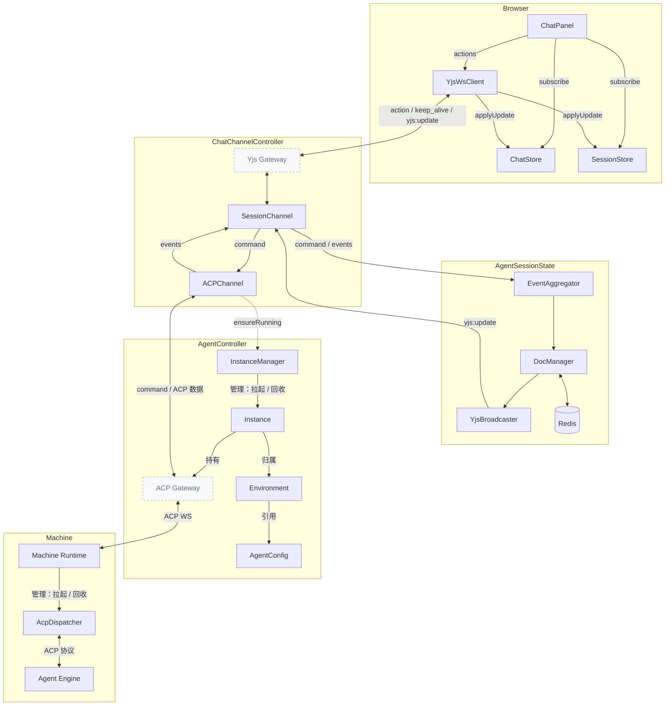

# Chat 流式对话全链路架构

> 状态：理想架构（目标设计基线）
> 范围：浏览器 → 主服务 → Machine 的流式对话链路、关键实体生命周期、数据归属与隔离、典型用户场景。
> 定位：本文档描述**最佳设计与最终形态**，是前端交互式 Chat（YJS 路径）的权威架构契约。实现若与本文档存在差异，以本文档为准并持续推进对齐。
> 约定：本文档不绑定具体代码位置；模块归属以职责域表述。

## 1. 总体架构

