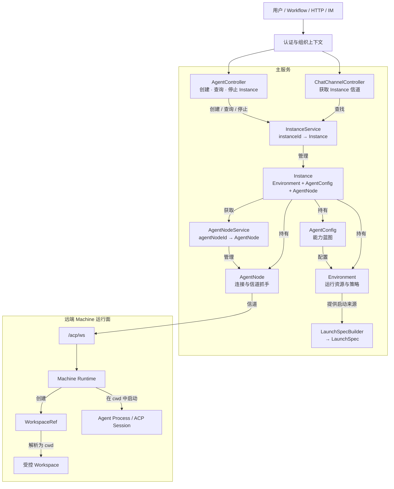
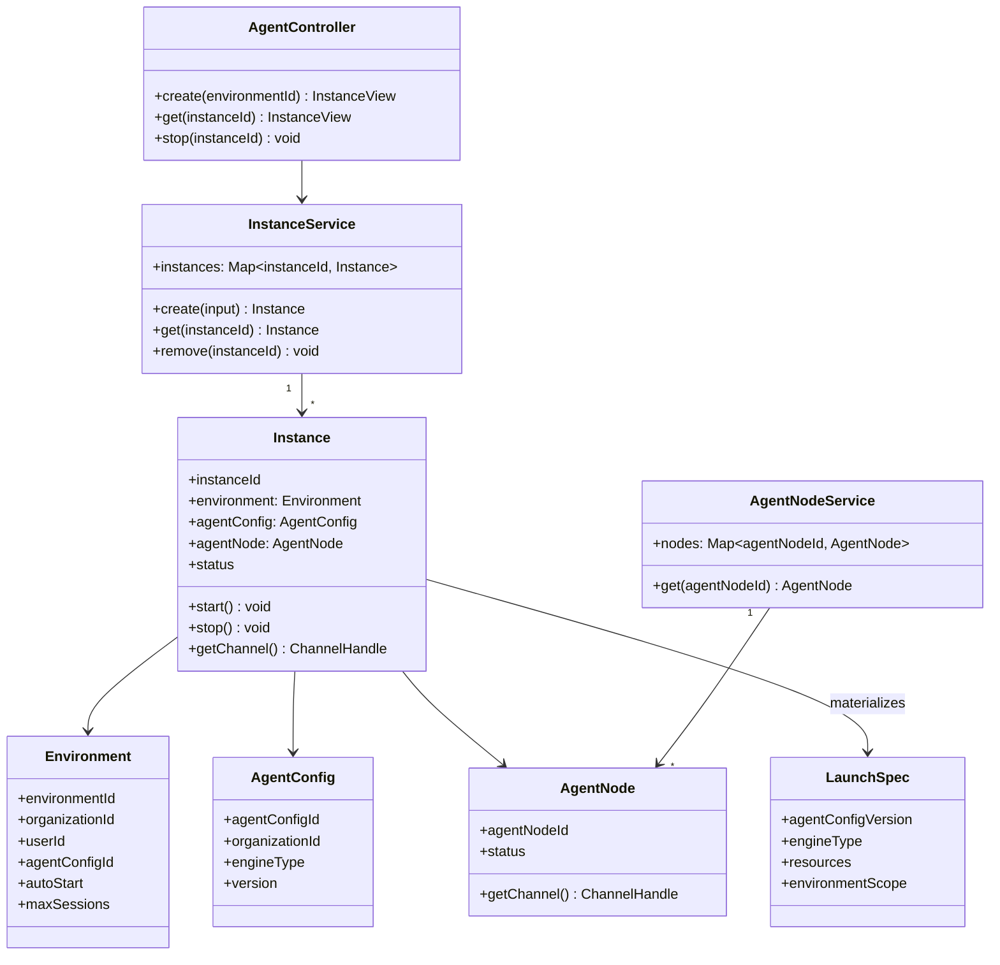
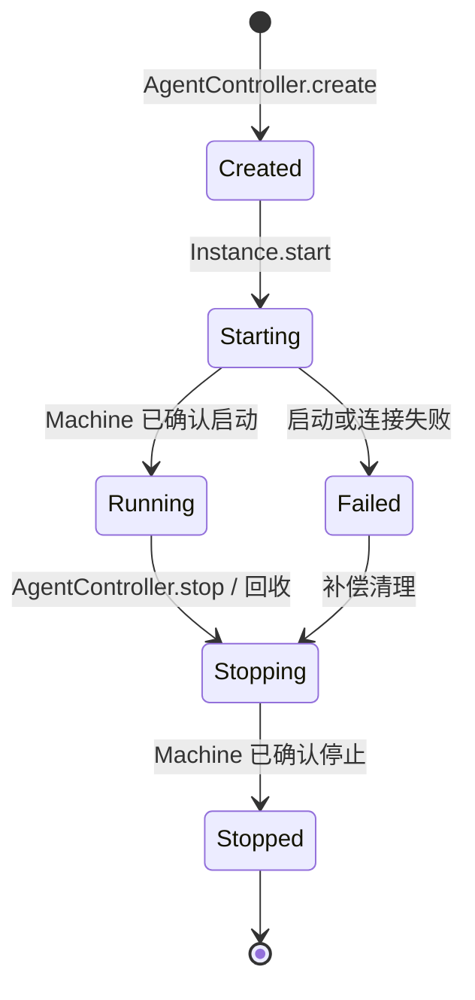
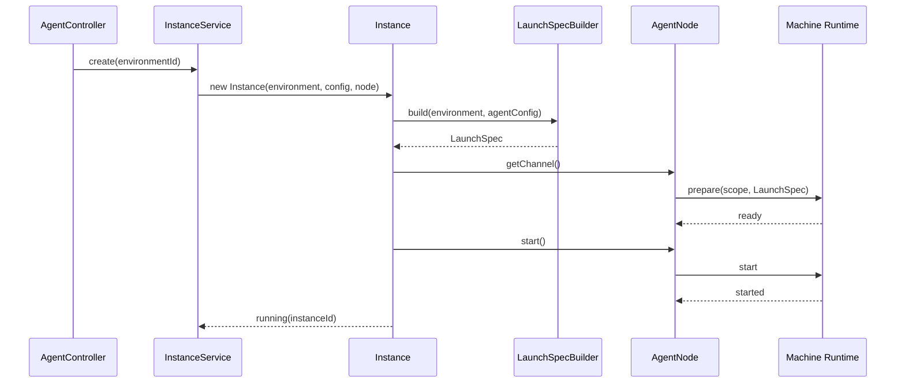
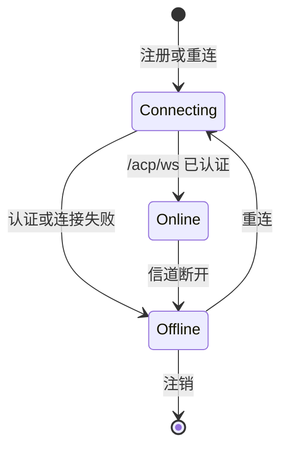

# AgentController 目标架构

> 状态：理想架构（目标设计基线）
> 范围：AgentController、InstanceService、Instance、AgentNodeService、AgentNode 与远端 Machine 运行面的创建、连接和生命周期。
> 定位：本文档只定义 Agent 实例的控制与运行边界。ChatChannelController、YJS 与 ACP 到 YJS 的状态聚合不属于本文职责。
> 约定：本文档不绑定具体代码位置；实现若与本文档存在差异，以本文档为准并持续推进对齐。

## 1. 总体架构



`AgentController` 管理实例命令，`ChatChannelController` 只查询既有实例以取得信道。`InstanceService` 管理 `instanceId → Instance`；Instance 持有 Environment、AgentConfig 和 AgentNode。AgentNode 通过 `/acp/ws` 对接远端 Machine。

## 2. 领域模型

### 2.1 核心对象



| 对象 | 责任 | 不负责 |
|---|---|---|
| `AgentController` | 鉴权后处理 Instance 创建、查询和停止命令 | 不持有实例、不解析 ACP、不维护聊天状态 |
| `InstanceService` | 持有 `instanceId → Instance`，控制实例注册与移除 | 不管理 Agent Node 连接、不解析 LaunchSpec 资源 |
| `Instance` | 自主管理启动、停止与失败终态；持有运行所需 Environment、AgentConfig、AgentNode | 不管理其他 Instance、不作为跨用户共享状态 |
| `Environment` | 提供用户运行资源、策略和受控执行范围 | 不持有 Instance、不持有远端路径或聊天状态 |
| `AgentConfig` | 定义独立能力蓝图 | 不绑定特定 Agent Node、不表示运行实例 |
| `AgentNodeService` | 持有 `agentNodeId → AgentNode` 并管理节点注册 | 不管理 Instance |
| `AgentNode` | 管理到远端 Machine 的连接与节点生命周期，提供信道抓手 | 不持有用户 Environment 或 AgentConfig |

### 2.2 身份与授权

| 标识 | 归属 | 用途 |
|---|---|---|
| `environmentId` | Environment | 用户运行资源与策略的授权范围 |
| `agentConfigId` | AgentConfig / Instance | 选择能力蓝图并固化到 Instance |
| `instanceId` | InstanceService | 主服务侧运行实例标识 |
| `agentNodeId` | AgentNodeService | 主服务侧 Agent Node 标识 |
| `machineId` | AgentNode 的远端注册信息 | 定位对接的 Machine，不作为 AgentConfig 字段 |

所有 Controller 命令先根据认证得到 `organizationId`、`userId` 与角色，再验证 Environment 归属及关联 AgentConfig 的可见性。`instanceId` 和 `agentNodeId` 仅在已授权的 Environment 范围内解析；浏览器不可指定远端物理路径、Node 内部连接 ID 或 ACP session ID。

## 3. Instance 生命周期



- `InstanceService` 只在 Instance 成功注册后公开 `instanceId`；启动失败必须删除或标记不可用，不能留下可被 ChatChannelController 取得的半初始化实例。
- Instance 的 `start()` 先从自身的 Environment 与 AgentConfig 物化 LaunchSpec，再从自身的 AgentNode 取得信道执行远端 `prepare`、`start`。
- Instance 的 `stop()` 必须通过同一 AgentNode 信道请求远端停止；无论远端返回成功、超时还是连接断开，最终都从 InstanceService 移除本地实例并释放信道引用。
- 回收策略可请求 `stop()`，但不能绕过 Instance 生命周期直接操作远端进程。

## 4. LaunchSpec 与远端启动

### 4.1 LaunchSpec 的位置

`LaunchSpec` 是 Instance 启动时从其 Environment 与 AgentConfig 物化出的不可变载荷：它只描述**如何运行 Agent**，不描述 Machine 的本机文件路径、Instance 内部连接或聊天状态。



### 4.2 LaunchSpec 内容与边界

| 内容 | 说明 |
|---|---|
| Agent 定义 | 名称、提示词、Engine 和配置版本 |
| 模型资源 | 已授权并解析的模型、Provider 与运行所需凭据引用 |
| 能力资源 | 已授权的 Skill、MCP、Knowledge、Memory 配置 |
| 执行范围 | `organizationId`、`userId`、`environmentId` |

LaunchSpec 不包含 `agentNodeId`、Machine 本机绝对路径、`WorkspaceRef`、`cwd`、`instanceId`、ACP session ID、聊天内容或 YJS 数据。敏感运行凭据仅通过 AgentNode 的认证信道传递，禁止写入日志、前端响应或持久化记录。

### 4.3 Machine 运行面

Machine Runtime 收到 `prepare(scope, LaunchSpec)` 后，才创建内部 `WorkspaceRef`、解析受控 Workspace 并将 `cwd` 注入 Agent Process。主服务只能传递可信执行范围，不能拼接或覆盖 Machine 本机路径。

```text
可信执行范围
→ Machine WorkspaceRef
→ 受控 Workspace
→ cwd
→ Agent Process / ACP session
```

## 5. Agent Node 生命周期与信道



- `AgentNodeService` 维护 `agentNodeId → AgentNode`，负责注册、重连、注销和节点能力更新。
- `AgentNode` 是唯一的远端连接拥有者；Instance 只能调用 `getChannel()`，不能自行创建、替换或关闭底层 `/acp/ws`。
- 一个 AgentNode 可以为多个已授权 Instance 提供信道抓手；每个远端命令必须携带目标 `instanceId` 与可信执行范围，避免同一 Node 上的运行串扰。
- 信道断开时，AgentNode 将自身置为 `Offline` 并通知持有它的 Instance 进入失败或停止清理；不得将远端状态伪装为仍在运行。

## 6. Controller 与 ChatChannelController 边界

`AgentController` 与 `ChatChannelController` 并列，不相互调用。

| 组件 | 输入 | 输出 | 禁止 |
|---|---|---|---|
| `AgentController` | 已授权的 Environment、Instance 命令 | Instance 视图与生命周期结果 | 解析 ACP、维护聊天状态 |
| `ChatChannelController` | 已授权的 `instanceId` | Instance 的 ChannelHandle | 创建、停止或重配 Instance |

`ChatChannelController` 通过 InstanceService 查找 Instance，再调用 `Instance.getChannel()`。它不能直接访问 AgentNodeService，也不能绕过 Instance 按 `agentNodeId` 获取信道。

## 7. 隔离、并发与失败

### 7.1 隔离

- Environment 是用户级运行资源边界；同一 AgentConfig 被不同用户使用时必须进入不同 Environment，并创建独立 Instance。
- Instance 只持有一个 Environment、一个 AgentConfig 和一个 AgentNode；不得在运行中切换任一对象。
- AgentNode 可被多 Instance 复用，但每个命令按 `instanceId + environmentId` 路由；Node 连接共享不代表工作区、进程或 ACP session 共享。
- Workspace 仅由远端 Machine 按可信执行范围创建；不同 `{organizationId, userId, environmentId}` 必须映射到隔离空间。

### 7.2 并发

- AgentController 创建前检查 Environment 的 `maxSessions` 与平台并发配额；检查与 InstanceService 注册必须在同一临界区完成。
- 对同一 Environment 的并发 create 请求按幂等键合并，避免重复创建 Instance。
- AgentNodeService 的连接状态变化不得阻塞其他 AgentNode 或无关 Environment 的 Instance 操作。

### 7.3 失败与补偿

| 失败点 | Instance 行为 | AgentController 结果 |
|---|---|---|
| AgentNode 不在线 | 不发送启动命令，进入 `Failed` 并清理 | 返回可重试的节点不可用错误 |
| prepare 失败 | 不执行 start，释放临时引用 | 返回脱敏启动失败 |
| start 超时 | 请求远端 stop，移除 Instance | 返回可重试超时错误 |
| AgentNode 运行中断线 | 进入 `Failed` 或 `Stopping`，执行清理 | 返回当前状态，不伪造运行中 |
| stop 失败或超时 | 移除本地 Instance，记录待远端对账 | 返回已受理停止或脱敏错误 |

## 8. 典型用户场景

### 场景 A：创建 Agent 实例

用户选择一个可见 AgentConfig 后，AgentController 在认证上下文中定位或创建用户的 Environment。InstanceService 创建 Instance；Instance 持有 Environment、AgentConfig 和从 AgentNodeService 获取的在线 AgentNode。Instance 物化 LaunchSpec，经 AgentNode 信道启动远端 Agent Process，成功后才返回 `instanceId`。

### 场景 B：获取聊天信道

ChatChannelController 接收已授权 `instanceId`，仅通过 InstanceService 查找 Running Instance 并取得其 ChannelHandle。它不创建 Instance，不直接查询 AgentNode，也不解析 ACP/YJS 数据。

### 场景 C：停止与回收

用户停止或策略触发回收时，AgentController 请求 Instance.stop()。Instance 通过已持有的 AgentNode 请求远端 Machine 停止 Agent Process，释放本地信道引用并由 InstanceService 移除。远端无法确认停止时仍清理本地 Instance，并交由后续 Node 对账处理。

### 场景 D：Agent Node 断线

AgentNode 的 `/acp/ws` 断开后，AgentNodeService 标记节点离线。所有持有该 Node 的 Instance 不能再接受新启动或信道请求，并进入失败或停止清理；同一用户或其他 Node 上的 Instance 不受影响。

## 9. 设计决策摘要

1. **Controller 与运行对象分离**：AgentController 处理命令，InstanceService 持有实例，Instance 管理自身生命周期。
2. **Instance 显式持有依赖**：Environment、AgentConfig 与 AgentNode 在创建时固化，运行中不可隐式替换。
3. **节点连接集中管理**：只有 AgentNodeService 管理 `agentNodeId → AgentNode`；Instance 只通过 AgentNode 获得信道。
4. **远端优先执行**：Machine Runtime 才创建 WorkspaceRef 和 `cwd`，主服务不直接运行 Agent 进程。
5. **聊天链路独立**：ChatChannelController 只消费 Instance 的 ChannelHandle；YJS 与 ACP 状态投影在独立架构边界演进。
