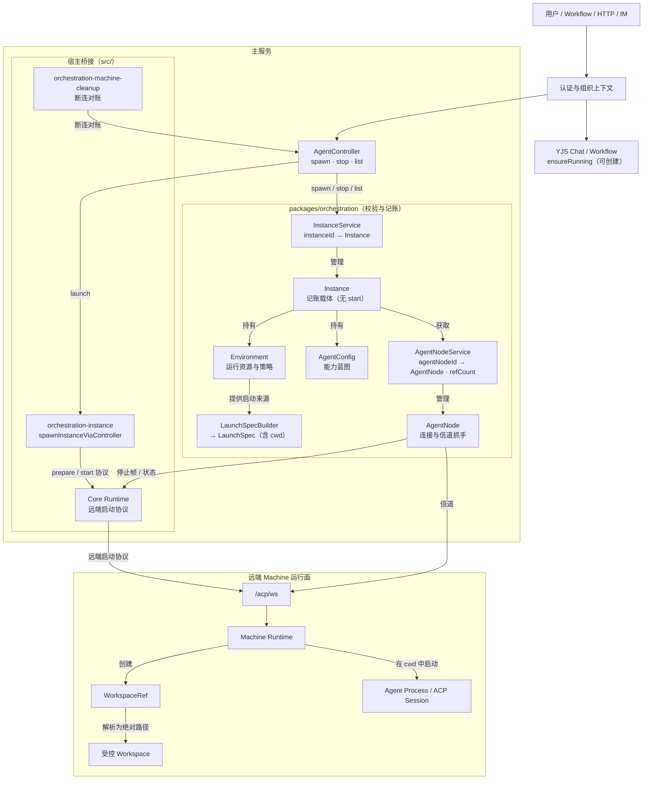
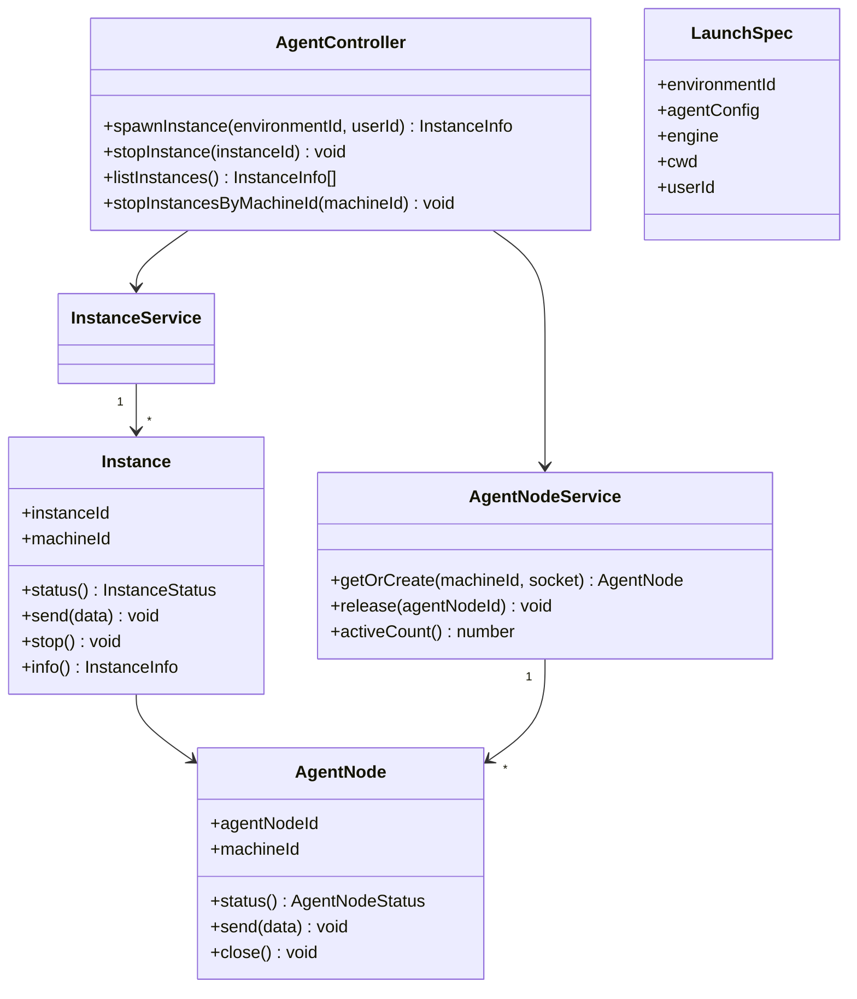
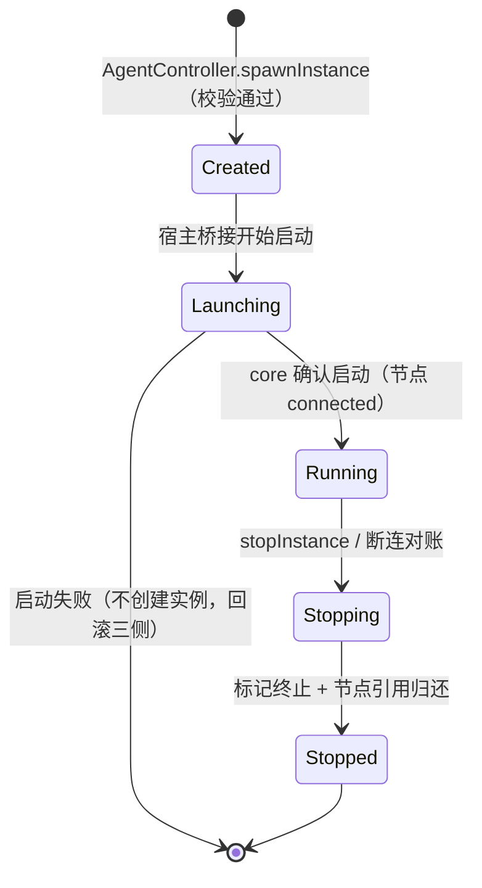
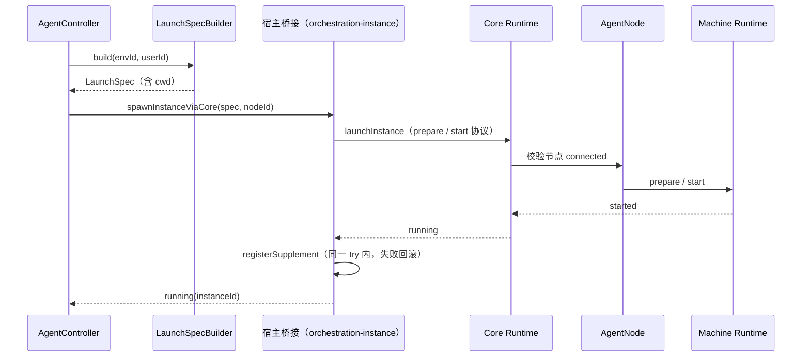
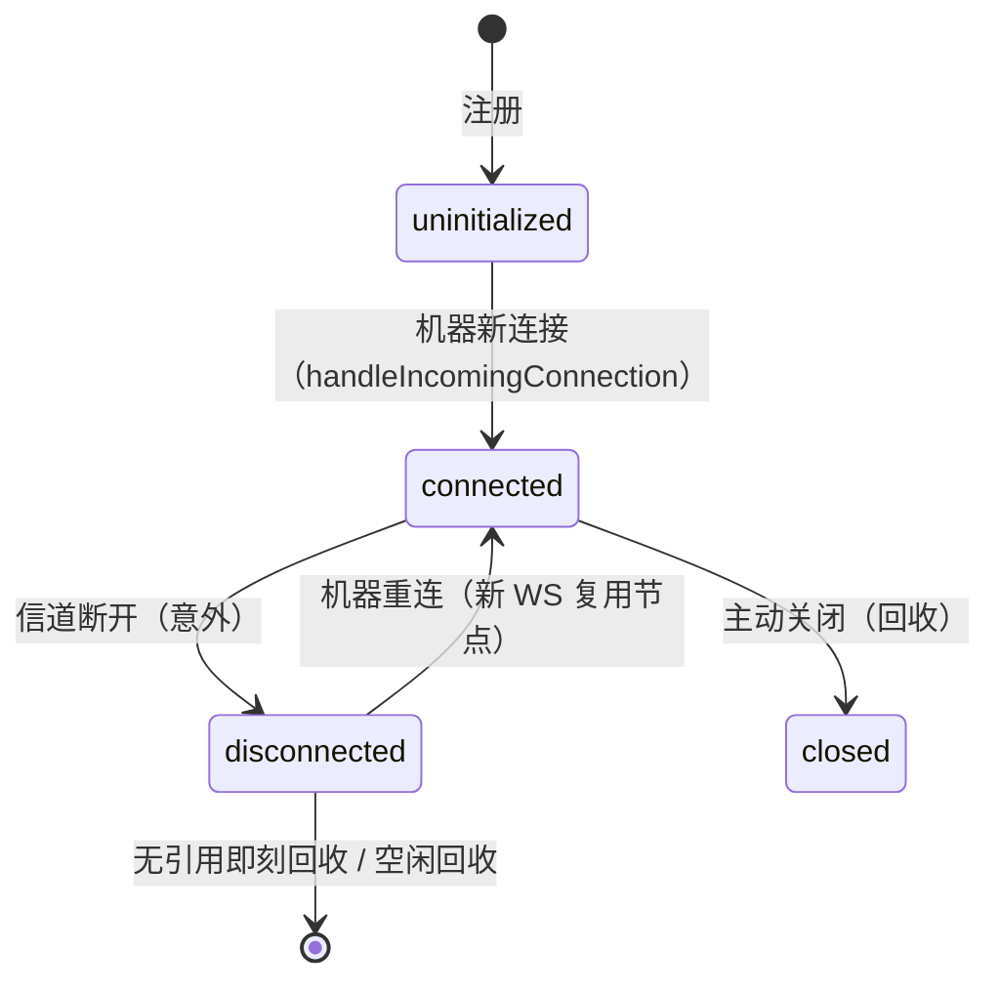

# AgentController 编排域架构（实现基线）

> 状态：实现基线（2026-08-04，对齐 `refactor/agent-controller` 分支，验证测试 215 个全绿）
> 范围：编排域独立包 `packages/orchestration`（AgentController、AgentNodeService、AgentNode、Instance、LaunchSpecBuilder）与宿主桥接（`src/services/orchestration-instance.ts`、`orchestration-bootstrap.ts`、`orchestration-machine-cleanup.ts`、`src/transport/agent-node-bridge.ts`、`local-node-service.ts`、`external-relay.ts`）的创建、连接和生命周期。
> 定位：本文档只定义 Agent 实例的控制与运行边界。YJS / ACP 到 YJS 的状态聚合与 Chat 域见 `docs/arch/19-yjs-chat-streaming.md`。
> 配套文档：`docs/arch/agent-controller-consumers-audit.md`（消费者审计报告与验收点）、`docs/arch/pending-design-decisions.md`（E-P2.2 断连终态、C-P2.5 用户配额决策）、`docs/design/2026-08-03-orchestration-package-prd.md` 与 `spec/global/adr/2026-08-03-orchestration-package-design.md`（重构立项与 ADR）。
> 约定：本文档从"目标设计基线"修订为"已验证实现基线"，描述与代码一致的真实架构；代码演进偏离时，先更新本文档再改代码。关键实现文件以相对路径引用（行号不维护，以语义为准）。

## 1. 总体架构

编排域采用**双层模型**：编排域（`packages/orchestration`）只负责校验、记账与停止帧，不触碰远端启动协议；真正的远端启动由宿主 core runtime（remote transport）完成。



- **编排域不发起远端启动协议**：`prepare` / `start` 由 core runtime 经 remote transport 下发（`acp-ws-handler.ts` 路由 prepare_result / start_result）；编排域 AgentNode 只管 WS 生命周期与停止帧。
- **本地执行回退**：无 machineId 配置时回退链为 `config.machineId → RCS_DEFAULT_MACHINE_ID → local-default`（`local-node-service.ts` 占位节点），旧本地执行语义保留。
- **YJS Chat / Workflow 路径经 `ensureRunning` 可创建实例**（见 §7），不是"只读查询"。

## 2. 领域模型

### 2.1 核心对象



| 对象 | 责任 | 不负责 |
|---|---|---|
| `AgentController` | 鉴权后处理实例 spawn / stop / list；维护 `instanceId → Instance` 活跃表；并发二次检查与回滚 | 不解析 ACP、不维护聊天状态、不发起远端 prepare/start 协议 |
| `Instance` | **记账载体**：懒查询状态、停止帧、终止标记；N 个 Instance 可共享一个 AgentNode | 不管理自身启动（启动在宿主桥接 + core）、不关闭共享节点连接 |
| `AgentNode` | 唯一的远端连接拥有者：持有 WS、暴露 send/close；`connected` 是可用性门禁 | 不解析 ACP 消息、不承载业务协议 |
| `AgentNodeService` | `agentNodeId → AgentNode` 注册、复用、引用计数、空闲回收 | 不管理 Instance |
| `LaunchSpecBuilder` | 从 Environment + AgentConfig + Engine 聚合不可变 LaunchSpec（含 cwd） | 不读取环境变量（workspaceRoot 宿主注入） |

**状态推导**：`Instance.status()` 是懒查询（`instance.ts`），由 `#terminated` 标记 + AgentNode 状态映射得出，无显式状态机：

| AgentNode 状态 | Instance 可见状态 |
|---|---|
| uninitialized / connecting | `starting` |
| connected | `running` |
| disconnected | `error`（意外断连，可用性不可确认） |
| closing / closed / destroyed | `stopped` |

### 2.2 身份与授权

| 标识 | 归属 | 用途 |
|---|---|---|
| `environmentId` | Environment | 用户运行资源与策略的授权范围 |
| `agentConfigId` | AgentConfig / Instance | 选择能力蓝图并固化到 Instance |
| `instanceId` | InstanceService | 主服务侧运行实例标识 |
| `agentNodeId` | AgentNodeService | 主服务侧 Agent Node 标识 |
| `machineId` | AgentNode | 定位对接的 Machine；由 AgentConfig.machineId → `RCS_DEFAULT_MACHINE_ID` → `local-default` 回退链解析 |

所有 Controller 命令先根据认证得到 `organizationId`、`userId` 与角色，再验证 Environment 归属及关联 AgentConfig 的可见性。`instanceId` 和 `agentNodeId` 仅在已授权的 Environment 范围内解析；浏览器不可指定远端物理路径、Node 内部连接 ID 或 ACP session ID。

**userId 传递规则**（C-P2.5 决策）：实例创建必须携带**真实触发用户**的 userId；workflow 路径由 route 透传 `authCtx.userId`（无触发者的 scheduled 回退 `"system"`），sub-workflow 沿用父级 `callerUserId`。userId 决定用户级并发配额桶归属，禁止用字面量 `"system"` 代替真实用户（否则跨租户共享同一配额桶，破坏多租户隔离）。

## 3. 实例生命周期



- **spawn 失败不创建实例**：`spawnInstanceViaController` 的 try 块覆盖 build → launch → registerSupplement 全链路；任一步失败走 `stopInstanceViaController` 回滚三侧（controller 活跃表 + core 进程 + registry supplement），不留下可被查询的半初始化实例（A/D-P1.3 修复）。
- **`stop()` 语义**（`instance.ts`）：节点 `connected` 时发送带 `instance_id` 的停止帧（snake_case，与机器端协议对齐），随后置位 `#terminated`；停止帧发送失败不阻断停止流程（避免产生幽灵活跃表残留）。**不关闭共享的 AgentNode 连接**——同节点其他实例仍在使用；节点引用归还由 `AgentController.stopInstance` 负责。
- **`stopInstance` 幂等**：三侧状态（supplement / 活跃表 / core 快照）任一存在即执行幂等停止，全无墓碑时返回 "Already stopped"（web DELETE 连续两次均 200，A/E-P2.1）。
- 回收策略可请求 `stop()`，但不能绕过 Instance 生命周期直接操作远端进程——**断连对账除外**（机器不可达时无法走正常停止链，见 §6）。

## 4. 双层启动模型与 LaunchSpec

### 4.1 启动时序



- 并发二次检查：controller 在 spawn 前检查活跃表与配额（`agent-concurrency.ts` 同步段登记预留），启动失败或超发时回滚活跃表（A-P2.1 修复）。
- **nodeId 单一来源**：core nodeId 直接取 `instance.machineId` 快照，禁止二次读 env 推导（消除双构建 TOCTOU，A-P2.2 修复）。

### 4.2 LaunchSpec 内容与边界

`LaunchSpec` 是启动 Agent 实例所需的全部静态信息聚合视图，构建后不可变：

| 内容 | 说明 |
|---|---|
| Agent 定义 | 扁平聚合的配置（skills / knowledgeBases / mcpServers 已内嵌） |
| 引擎信息 | 按 `agentConfig.engineId` 解析 |
| **cwd** | 主服务按 `{workspaceRoot}/{organizationId}/{userId}/{environmentId}` 确定性计算（workspace 路径不变量） |
| 执行范围 | `environmentId`、`userId` |

**cwd 归属（D1 修订）**：cwd 由主服务计算并下发（`launch-spec-builder.ts`），机器端再将其解析为受控 Workspace 的绝对路径。cwd 是确定性派生值而非"机器本机路径"，因此不违反可信执行范围约束；但文档旧版"LaunchSpec 不包含 cwd、主服务不能拼接路径"的表述已废弃。

**双份构建过渡态（D5 记录）**：编排域 LaunchSpec 只有上述扁平视图；运行时字段（密钥、skill 下载 token、MCP 详细配置）由宿主 `buildAgentLaunchSpecForCore` 从 DB 重建后经 core 下发。当前存在"双份构建"，收敛计划见 PRD（Phase C）。

LaunchSpec 不包含 `agentNodeId`、Machine 本机绝对路径、`instanceId`、ACP session ID、聊天内容或 YJS 数据。敏感运行凭据仅经认证信道传递，禁止写入日志、前端响应或持久化记录。

### 4.3 Machine 运行面

Machine Runtime 收到启动载荷后创建内部 `WorkspaceRef`、将 cwd 解析为受控 Workspace 并在其中启动 Agent Process。主服务只传递可信执行范围与派生 cwd，不拼接 Machine 本机路径。

```text
可信执行范围 + 派生 cwd
→ Machine WorkspaceRef
→ 受控 Workspace（绝对路径）
→ Agent Process / ACP session
```

## 5. Agent Node 生命周期与信道



- **断连即终态（E-P2.2 方案 A）**：server 端**不做自动重连**——`disconnected` 不接受 connect 事件，节点进入等待机器重连的终态；恢复完全由远端 Machine 主动重连驱动（宿主 `handleIncomingConnection` 复用节点、attach 新 socket）。FSM 不再有 connecting 中间态与空转定时器。
- **引用计数与空闲回收**：`AgentNodeService` 维护 `#refCounts`（每 Instance 一次），引用归零且节点 `disconnected` 时触发空闲回收；**connected 节点不回收**——关闭 connected 节点会切断机器真实 WS（E-P1.1 教训：节点回收不得引发机器断连风暴）。
- `AgentNode` 是唯一的远端连接拥有者；Instance 只能调用 `send()`/`stop()`，不能自行创建、替换或关闭底层 WS。
- 一个 AgentNode 可为多个已授权 Instance 提供信道；停止帧必须携带目标 `instanceId`（snake_case），避免同节点运行串扰。
- **断连即失败（E-P2.1 教训）**：`WsAgentNodeSocket.send` 在 `readyState !== 1` 时抛 `AgentNodeUnavailableError`，禁止静默丢弃（静默丢包会让停止帧无回执、调用方误以为可达）。

## 6. 三侧状态对账（断连语义的根）

实例状态分布在三侧，**必须同生共死**：

| 状态侧 | 载体 | 清理入口 |
|---|---|---|
| controller 活跃表 | `AgentController`（`packages/orchestration`） | `stopInstance` / `stopInstancesByMachineId` |
| core 快照 | `CoreRuntime.listInstances()` | `runtime.deleteInstance` |
| registry supplement | `globalInstanceRegistry` | `unregister` / `reconcile` |

**E-P0.1 教训（幽灵实例）**：任何一侧的清理路径（断连、重连、sweep、rollback、幂等 DELETE）都必须收敛到统一入口——机器断连由 `cleanupOrchestrationInstancesForMachine`（`orchestration-machine-cleanup.ts`）→ `AgentController.stopInstancesByMachineId` 完成活跃表删除 + `releaseNode` 配对归还；机器重连分支同样先清理再接受新连接。缺失任何一侧都会产生幽灵实例：占用并发额度、web DELETE 永久 404、refCount 残留节点永久滞留。

**断连对账例外（D15 记录）**：机器不可达时无法走正常停止链，断连清理直接 `runtime.deleteInstance` + 删表 + 活跃表清理，绕过 `Instance.stop()` 的远端停止帧——这是唯一允许绕过正常生命周期路径的场景。

**已知缺口（R4）**：sweep 路径 `triggerMachineCleanupByMachineId`（entry 已消失时）未执行 `globalInstanceRegistry.reconcile`，与 `performMachineCleanup` 不一致，可能残留孤儿 supplement（量级小，属状态不一致，见 §11）。

## 7. 消费者边界

编排域上层消费者（审计报告场景划分）：

| 场景 | 入口 | 实例语义 |
|---|---|---|
| A. HTTP 程序化单轮 | `routes/api/openai-chat.ts` → `openAgentSession` → `spawnInstanceViaController` | 每次独立实例，dispose 销毁 |
| B. 前端交互式 Chat | `/acp/yjs/:agentId` → `ws-lifecycle.handleOpen` → `ensureRunning` | 复用语义，**可创建**实例 |
| C. Workflow | `workflow/agent-chat-transport.ts` → `ensureRunning(userId, ...)` → `connectAgentRelay` | 复用，不随单次执行销毁，租约保护 |
| D. 外部 API + meta-agent | `api-instance.ts` / `meta-agent.ts` → `spawnInstanceViaController` | 每次独立实例 |
| E. 停止 / 回收 / 断连 | `instance.ts` stopInstance / `acp-idle-monitor.ts` / `acp-ws-handler.ts` 机器清理 | AgentNode FSM + 断连对账 |

- **Chat 路径的 ensureRunning 可创建实例**（D6 修订）：文档旧版假设的"ChatChannelController 只查询不创建"未落地；YJS 前端 open 时若实例不存在会 spawn 新实例（复用语义要求）。边界实际是：Chat / Workflow 路径经 `ensureRunning` 获取或创建实例，再经 relay 取得信道；编排域本体仍是唯一创建者。
- **Workflow 复用租约（C-P1.1 教训）**：共享实例被多 run 复用时，"创建者结束即清理"会连坐使用者。`instance-lease.ts` 的 `acquireInstanceLease` 紧贴 `ensureRunning` 返回（同 tick 消除 async-gap 竞态），`cleanupSpawnedInstances` 按 instanceId + 租约守卫停止——只清理本 run spawn 的实例，正在被其他 run 使用的实例跳过。
- **relay 与实例复用正交**：`turn.release()` 只注销 listener 不关 handle；`relayCount` / `touchInstanceActivity` 是实例级"前台使用"的唯一观测信号，idle 回收据此判断。

## 8. 隔离、并发与失败

### 8.1 隔离

- Environment 是用户级运行资源边界；同一 AgentConfig 被不同用户使用时必须进入不同 Environment，并创建独立 Instance。
- Instance 只持有一个 Environment、一个 AgentConfig 和一个 AgentNode；不得在运行中切换任一对象。
- AgentNode 可被多 Instance 复用，但每个命令按 `instanceId + environmentId` 路由；Node 连接共享不代表工作区、进程或 ACP session 共享。
- Workspace 由远端 Machine 按可信执行范围创建；不同 `{organizationId, userId, environmentId}` 映射到隔离路径（§4.2 cwd 不变量）。

### 8.2 并发治理分层（A-P2.1 教训）

三套闸门并存，职责不同：

| 层级 | 机制 | 状态 |
|---|---|---|
| 用户级 / 平台级 | `agent-concurrency.ts` `beginSpawnReservation`（检查与登记同一同步段，pending 计入计数，finally 释放） | ✅ 生效（RCS_USER_AGENT_MAX_CONCURRENCY 等） |
| 环境级 | controller 活跃表 + spawn 二次检查 + 超发回滚 | ⚠️ `maxConcurrency` 暂写死 1000（D-P2.3，Web 控制台提供 maxSessions 配置入口后恢复 DB 读取） |
| 会话级 | `maxSessions` 检查（旧 ensureRunning 路径） | ✅ 生效 |

**TOCTOU 教训**："检查 → 注册"之间不得存在 await 窗口；用户级/平台级由 reservation 同步段消除，环境级目前因闸门虚设被掩盖，恢复 DB 读取时必须同步补环境级 reservation（否则并发超发 1+）。文档旧版"对同一 Environment 的并发 create 按幂等键合并"**未实现**，实际策略是"二次检查 + 超发回滚"。

### 8.3 失败与补偿

| 失败点 | 行为 | 对外结果 |
|---|---|---|
| AgentNode 不在线 | `ensureNode` 只放行 `connected`，否则抛 `AgentNodeUnavailableError`（不创建实例） | 503（message 脱敏） |
| LaunchSpec 构建失败 | 抛 `LaunchSpecBuildError`，回滚 | 422 |
| spawn 任一步失败（含 registerSupplement） | `stopInstanceViaController` 回滚三侧（A/D-P1.3） | 脱敏错误，不泄漏 envId/machineId |
| 会话中途失败（connectRelay / prompt 抛错） | 有 dispose 的路径自动清理（A/D-P1.4） | 脱敏错误 |
| AgentNode 运行中断线 | 节点断连即终态；宿主断连对账清理实例（§6） | 返回当前状态，不伪造运行中 |
| stop 失败或超时 | 标记终止 + 移除本地实例 + 归还节点引用 | 已受理停止 |
| workflow 执行超时 | reject `NODE_TIMEOUT`（不再 no-op 挂起）+ 配对释放租约/relay 计数（C-P1.3） | 有界失败 |
| workflow relay 关闭 | 识别 `relay_closed` → exit_code=1，engine 按 NODE_FAILED 重试自愈 | 有界失败 |

### 8.4 错误映射与脱敏（A-P1.1 / D-P2.2 教训）

- 路由本地 catch 一律移除，统一走全局 errorPlugin（`src/plugins/error-handler.ts`）按稳定错误码映射：`ORCHESTRATION_STATUS_MAP`（404 / 409 / 422 / 503）+ `ORCHESTRATION_MESSAGE_MAP` 通用模板。
- 编排域错误 message 可能携带 envId / machineId（如 `ConcurrencyExceededError` 拼接环境 ID），对外必须脱敏，完整诊断留服务端日志；SSE 流中途错误的 chunk 只输出固定通用文案。
- 新错误码漏登记时保守落 500 也不得泄漏内部标识。

## 9. 典型用户场景

### 场景 A：创建 Agent 实例

用户选择可见 AgentConfig 后，`spawnInstanceViaController` 在认证上下文中定位或创建 Environment；controller 检查配额（用户级 reservation）→ 构建 LaunchSpec（含 cwd）→ 宿主桥接经 core 启动远端 Agent Process（编排域不触碰 prepare/start 协议）→ 成功后才注册 supplement 并返回 `instanceId`。

### 场景 B：前端交互式 Chat

浏览器 WS 打开 → `ws-lifecycle.handleOpen` → `ensureRunning`（不存在则创建）→ Chat Doc / Session Doc 初始快照 → `relayReady`。实例复用语义与 YJS 不变量（rcsSessionId 确定性、cwd 注入、status 门禁、广播隔离）见 `19-yjs-chat-streaming.md`。

### 场景 C：Workflow 复用与清理

workflow run 经 `ensureRunning` 复用实例并 acquire 租约；run 结束 cleanup 只停止本 run spawn 的实例（按 instanceId + 租约守卫），正在被其他 run 使用的实例跳过；执行超时 / relay 关闭均产生有界失败。

### 场景 D：停止与回收

用户停止或策略触发回收时，`AgentController.stopInstance` → Instance 发停止帧并标记终止 → core 停止 → registry 移除 supplement → 节点引用归还。远端无法确认停止时仍清理本地状态，交由断连对账处理。DELETE 幂等：重复删除返回 200。

### 场景 E：Agent Node 断线

`/acp/ws` 断开 → 节点进入 disconnected 终态（不再自动重连）→ 宿主断连对账（`cleanupOrchestrationInstancesForMachine`）清理该机器全部实例的三侧状态并归还节点引用 → 机器重连后 `handleIncomingConnection` 复用节点。断连期间对该节点的 spawn 返回 503；其他机器上的实例不受影响。

## 10. 设计决策摘要

1. **双层模型**：编排域校验/记账/停止帧，core runtime 负责远端启动协议；编排域不触碰 prepare/start。
2. **Instance 是记账载体**：懒查询状态（终止标记 + 节点状态推导），无 start()，启动在宿主桥接 + core。
3. **断连即终态**：server 端无自动重连，disconnected 只接受机器新连接的 open（E-P2.2 方案 A）。
4. **节点连接集中管理**：只有 AgentNodeService 管理节点注册/复用/引用计数/空闲回收；connected 节点不被空闲回收。
5. **三侧状态对账**：controller 活跃表 / core 快照 / registry supplement 同生共死，清理统一收敛（E-P0.1）。
6. **复用显式租约**：workflow 共享实例必须 acquire lease，cleanup 按 instanceId + 租约守卫（C-P1.1）。
7. **cwd 主服务派生**：cwd = `{workspaceRoot}/{organizationId}/{userId}/{environmentId}`，机器端解析落地。
8. **真实 userId 配额桶**：workflow 实例按触发用户计用户级配额，禁止字面 "system" 聚合（C-P2.5）。
9. **错误边界统一收敛 + 脱敏模板**：路由本地 catch 移除，全局 errorPlugin 按稳定 code 映射。
10. **断连对账可绕过正常停止链**：机器不可达时直接删 core 快照 + 活跃表（唯一例外）。
11. **本地执行回退保留**：machineId 回退链 `config → RCS_DEFAULT_MACHINE_ID → local-default`。
12. **聊天链路独立**：YJS / Chat 域只经 `ensureRunning` 与 relay 消费实例，编排域本体不维护聊天状态。

## 11. 本次重构经验教训（bug 修复模式）

以下模式来自重构后消费者审计（`agent-controller-consumers-audit.md`）与 P0-P2 修复批次，是编排域维护的**防复发清单**：

1. **三侧状态不一致 = 幽灵实例**（E-P0.1）：任何清理路径漏掉 controller 活跃表 / core 快照 / supplement 任一侧，都会造成"额度被占、API 404、refCount 残留"。所有清理必须走统一收敛入口。
2. **错误被吞 = 静默故障**（E-P2.1）：`send` 静默丢弃、路由 catch 扁平化、`relay_closed` 未识别，都是"无异常无回执"的静默故障。断连/发送失败必须显式抛错或产生有界失败。
3. **超时兜底必须 settle**（C-P1.3）："到点只置标志不 reject"会让 Promise 永不 settle，节点永久挂起。超时兜底必须产生有界失败，并配对释放租约与 relay 计数。
4. **async-gap 竞态**（A-P2.1 / C-P1.1-R）："检查 → 注册/acquire"之间只要有 await 窗口就存在超发/误杀。检查与登记必须在同一同步段；acquire 必须紧贴返回（同 tick）。
5. **泄漏路径必须包 try 且可回滚**（A/D-P1.3 / A/D-P1.4）：registerSupplement、openAgentSession 后续步骤抛错时必须有补偿（stopInstanceViaController），否则实例残留到 idle 回收，期间占用户额度。
6. **回收不切断真实连接**（E-P1.1）：空闲回收只回收已断连节点；回收 connected 节点会切断机器 WS，引发断连-重连风暴。
7. **FSM 语义必须与现实一致**（E-P2.2）：声称"自动重连"却没有连接工厂的 FSM 是空转表演，产生虚假状态抖动与诊断误导；无能力即移除，不保留装饰。
8. **双份构建是过渡态**（D5）：编排域扁平 LaunchSpec 与宿主 DB 重建的运行时载荷并存，必须记录收敛计划，禁止在扁平视图中继续堆积运行时字段。
9. **断连清理要管到机器端**（R1）：三侧对账只覆盖主服务内存；机器端 InstanceManager 的进程残留无对账通道，每次断连-重连可能泄漏一个机器端 Agent 进程（见 §11 技术债）。

## 12. 已知限制与技术债

| # | 项目 | 严重度 | 说明与移除条件 |
|---|---|---|---|
| T1 | 机器端旧实例进程残留 | P1 | 断连-重连时主服务清理三侧状态但**不向机器补发 stop**（acp-link 指数退避重连不断连不杀子进程），每次重连泄漏一个机器端 Agent 进程直到机器重启。移除条件：registerRemoteNode 重连分支携带"需终止的旧 instanceId 列表"下发机器端对账 |
| T2 | openai-chat `turn.prompt` 抛错无 dispose | P1 | `routes/api/openai-chat.ts` 的 `turn.prompt(...)` 在 try 之外（同步 send 抛错时泄漏实例至 idle 回收）。修复：包 try/catch，失败 `turn.dispose()` 后 rethrow（scheduler 路径已有同款保护） |
| T3 | workflow 超时后事件流继续 touchActivity | P1 | `agent-chat-transport.ts` 超时 reject 后 `iterateEvents` 未终止，agent 持续推消息会刷新 `lastActivityAt`，实例滞留时间不可控（窗口 = agent 持续输出时长）。修复：超时/abort 分支先 `turn.release()` 再 reject |
| T4 | sweep 路径缺 supplement reconcile | P2 | `triggerMachineCleanupByMachineId` 无 `globalInstanceRegistry.reconcile`（与 performMachineCleanup 不一致），孤儿 supplement 残留（量级小）。修复：收敛两路径 |
| T5 | `WsAgentNodeSocket.send` 的 ws.send 异常被吞 | P2 | `agent-node-bridge.ts` catch 只记日志不 rethrow，停止帧可能静默丢失。修复：rethrow 或与 readyState 门禁同语义 |
| T6 | meta-agent 吞错 | P2 | `meta-agent.ts` ensure 路径 `catch { return { environmentId, status } }` 吞掉 spawn 错误，success:true 无 instanceId（D-P2.1，审计后未修复）。修复：错误上抛或响应携带错误码 |
| T7 | 环境级 maxConcurrency 写死 1000 | P2 | D-P2.3 有意保留；Web 控制台提供 maxSessions 配置入口后恢复 DB 读取，并同步补环境级 reservation（A-P2.1 教训） |
| T8 | local stub 恒 connected | 已知限制 | `local-node-service.ts` 占位节点不触发节点级断连（N:1 共享节点语义）；无 relay 消费者且进程死亡的本地实例靠 idle 300s 兜底。移除条件：core 暴露进程退出事件 |
| T9 | 测试缺口 | P2 | 以下修复无测试保护：D-P2.1（meta 堆积）、C-P2.1/C-P2.2（审批/子流程泄漏）、机器重连对账（验收点 12 单侧）、C-P2.5（配额桶归属） |

> 验证记录：2026-08-04 校验，215 个相关测试全绿，server / orchestration / web 三侧 tsc 通过；本表 T1-T5 为校验中新发现（已交叉验证），T6/T7 为审计已知未修复项。
