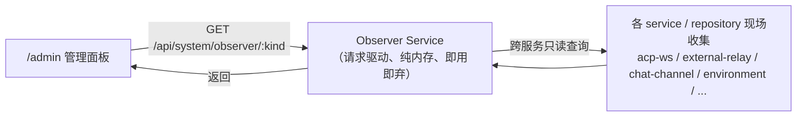

# 可观测性：后台 Observer Service（统一观察中心）

> 状态：实现基线（2026-08-19 实现，与代码核对一致）
> 范围：平台统一可观测性的**观察与关系建模**——Observer Service 的**纯内存**观察库、
> 实体关系图谱、按观察类型（kind）的可扩展接入，以及面向管理面板的只读查询面。
> 首个观察类型为「ACP 活跃链接」（见 §6），后续可扩展 workflow 运行、定时任务、agent 事件、
> 实例资源指标等。
> 定位：本文档是**可观测性监控的权威来源**。它定义「业务实体之间的关系图谱」如何被唯一
> 记录、分类（kind）、查询与一致性校验。它不定义实例控制/运行边界（见
> `docs/arch/20-orchestration-management.md`）、不定义 YJS 状态聚合（见
> `docs/arch/19-yjs-chat-streaming.md`）、不定义指标采集管道与告警。观察面**纯只读**，不干预
> 任何连接、实例或任务生命周期。
> 配置：Observer Service 不引入任何新环境变量、不连接 Redis/DB/任何外部存储。
> 约定：本文档从「实现基线」推进，代码演进偏离时先更新本文档再改代码；关键实现文件以
> 相对路径引用（行号不维护，以语义为准）。

## 0. 纪律（硬边界，不可违背）

1. **请求驱动的拉取模型（无被动采集）**：Observer Service **不挂接任何生命周期事件去被动收集**
   （不提供 `record()/unrecord()` Collector、不被各模块在 open/close 时回调）。它只在**收到接口
   请求时**，主动去所需的 service / repository 现场收集当前关系，组装后返回；请求结束即释放，
   不常驻维护一份关系快照。
2. **纯内存，完全不持久化**：Observer 不写数据库、Redis、文件或任何外部存储；禁止「日后补一套
   持久化快照」的增强（不留后门、不预留 `RCS_OBSERVER_*` 持久化配置）。由于是请求驱动、结果
   按需组装即用即弃，天然零持久化。这是**最终纪律**，不是临时取舍。
3. **可以跨服务查询**：Observer 在**每次请求时**调用其他 service / repository 查询权威数据
   （如 `environment` 表回查 `userId / agentConfigId / organizationId`、解析 machine 名、查实例
   状态），以建立并校验逻辑关系。它是**消费者**，不复制、不缓存、不持久化这些查询结果。
4. **对内只读、对外只读**：Observer 只调用其他服务**只读能力**（查询），不触发被观察对象的
   任何写操作；对外查询面同样只读，不提供 kill / 断开 / 停实例等管控动作（管控走编排面）。

## 1. 定位与价值

平台运行着多种「会随时间变化、且彼此存在业务归属关系」的对象：活跃的 ACP 链接、运行中的
实例、workflow run、定时任务执行、agent 事件等。它们当前分散在各模块的内存注册表里，彼此
缺少一张统一的业务关系图，也无法回答「这个对象属于哪个用户/哪个智能体、跑在哪个 machine 上」。

**Observer Service** 是平台可观测性的统一观察中心：以**最小内核 + 可扩展观察类型（kind）**
的方式，在**接口请求到达时**主动向各 service 收集并组装业务实体之间的归属关系。它不只服务
ACP 链接——ACP 链接只是第一个 kind，后续 kind 以同类机制接入，形成一张按需组装的
「平台关系图谱」。

本中心解决三件事：

1. **按需统一**：Observer 在收到请求时，从分散的各注册表/服务现场收集「业务 id 之间的关系」，
   组装成一张统一关系图再返回——单一出口，杜绝各注册表各说各话；
2. **可扩展**：新增观察类型只需为它声明「从哪些服务收集、如何映射 role」，复用同一关系图与
   查询面，不改内核；
3. **关系自证**：所有 join key 在组装时经权威表（如 `environment`）回查对齐，归属不一致被显式
   标记而非静默丢弃。

## 2. 领域模型：请求驱动的收集与输出

Observer 不常驻存对象，而是**收到请求 → 现场收集 → 组装 → 返回 → 释放**（§0.1）：



### 2.1 Output：Observation（输出行，节点）

每个 kind 的请求处理中，Observer 从各来源现场收集「对象当前存在的证据」，组装成统一形状的
输出行，`kind` 区分类型：

```ts
interface Observation {
  id: string;                       // 业务 id（如 acp-link 的 source+linkId）
  kind: string;                     // "acp-link" | "workflow-run" | ...
  entityIds: { role: string; id: string }[];  // 该对象在关系图谱中的各角色 id
  source: string;                   // 现场收集来源（注册表名，用于信任标记）
  ts: number;                       // 收集时间
  payload?: Record<string, unknown>; // 类型化负载（capabilities、状态等）
  verified?: boolean;               // 角色 id 是否经权威表回查对齐
}
```

### 2.2 RelationGraph（关系图谱，边）

把不同 kind 的 Observation 统一接入「实体 → 归属」的边。实体角色（role）是跨 kind 稳定的
词汇表：`organizationId / userId / agentConfigId / instanceId / machineId / linkId / sessionId / ...`。
不同 kind 映射到同一组角色时，边自动合并到同一张图（例如 workflow 也归属 user/agent/instance），
因此图谱是**跨类型的整体关系图**，而不是每种类型各自一套表。**该图只在请求处理期间存在**，
随响应结束即释放。


两类关系视图：
- **归属树**（组织 → 用户 → 智能体 → 实例 → 叶子对象）；
- **反向/机器树**（machine id → 其承载的 n 个叶子对象，如 n 个 acp 链接）。

### 2.3 扩展契约（新增 kind 的成本）

新增一个观察类型不改 Observer 内核，只需在请求处理描述（Provider）里声明：
1. 定义该 kind 的 `entityIds` 角色映射（复用词汇表或登记新角色）；
2. 声明**从哪些 service / repository 现场收集**，以及如何把来源字段映射到各 role。

`kind → Provider` 的解析表可独立注册/摘除，随时可回滚，不触碰被观察对象本身（§0.1 拉取模型）。

### 2.4 Provider（收集器）

每个 kind 对应一个 **Provider**：`collect(): Promise<Observation[]>`。它在**每次请求调用时**，
只读遍历该 kind 所依赖的来源（acp-ws 注册表、external-relay entries、chat-channel registry、
`environment` repo 等），现场组装 Observation 并返回。**无 open/close 事件回调、无常驻状态、
无写路径**。

```ts
interface KindProvider {
  kind: string;
  collect(ctx: ObserverContext): Promise<Observation[]>;  // 只读跨服务收集
}
```

## 3. Observer Service 设计

### 3.1 职责与边界

- **请求驱动的聚合面（纯内存）**：Observer 只是「收到请求 → 调各 Provider 现场收集 → 组装关系
  图 → 返回」的入口（§0.1）。**不常驻关系库、不维护快照**，单一出口收敛各来源，杜绝各说各话。
- **只观察、不干预**：只调其他服务**只读**能力收集现状，不创建/不销毁被观察对象，不触发
  session/调度操作。
- **角色 id 解析外置（跨服务查询）**：收集时用权威数据（`environment` 等，经 service/repository
  只读查询）回查补齐业务角色 id。字段未就绪（如 ACP identify 前 `agentId` 就是 envId）不占位、
  不猜测。查询结果只用于本次组装/校验，**不缓存、不持久化**（§0.3）。

```ts
class ObserverService {
  provider(kind: string): KindProvider | undefined;       // kind → Provider 路由
  async tree(kind: string, opts?): Promise<RelationTreeView>; // 现场收集并组装关系树
  async list(kind: string): Promise<Observation[]>;       // 现场收集并返回平坦行
}
```
> 无 `record/unrecord`：Observer 不维护任何内部状态，每次调用都重新经 Provider 现场收集（§0.1）。

### 3.2 收集来源（以首 kind acp-link 为例）

Provider 在**每次请求时**只读遍历下列来源，不挂接任何 open/close 事件、不改来源内部状态：

| 来源 | 现有注册表 | 可取的字段 |
|------|-----------|-----------|
| `acp-ws` | `src/transport/acp-ws-handler.ts: connections` | `userId`、`agentId`（identify 后）/`boundEnvId`、`machineId`、`isMachine` |
| `machine` | 同上 `isMachine=true` | `machineId`、`userId` |
| `external-relay` | `src/transport/relay/external-relay.ts: entries` | `agentId`、`instanceId`、`authCtx.userId/orgId` |
| `chat-relay` | `@fenix/chat-channel` `ConnectionRegistry.clients` | `userId`、`agentId`、`instanceId`、`rcsSessionId`、`acpSessionId` |

角色 id 补齐与一致性校验，由 Observer 在收集后经 `environment` 等权威数据回查完成（§0.3）。

### 3.3 数据结构：kind 与角色词汇表

```
kind: "acp-link"
entityIds: [
  { role: "organizationId", id },
  { role: "userId",       id },
  { role: "agentConfigId", id },   // identify 前缺省，不占位
  { role: "instanceId",   id },
  { role: "linkId",       id },    // 见 §7 开放问题 1
  { role: "machineId",    id },    // 承载 machine，本地 fallback
]
payload: { source, rcsSessionId?, acpSessionId?, openTime, capabilities? }
```

link 到 machine 是「承载于」的弱边（反向树），归属树到 link 是主边。

### 3.4 存储（硬边界）

- **不存储**：Observer **没有任何常驻数据**——不写 DB、Redis、文件或任何外部存储；不维护快照、
  不缓存跨服务查询结果（§0.1 / §0.3）。
- 所有输出均为**请求期间现场收集、即用即弃**；请求结束即释放，无迁移、无恢复、无回滚负担。

### 3.5 一致性校验（关系自证）

- 记录时核对各角色 id 与权威表归属一致；不一致或关键角色缺省时 `verified=false`，计入
  `integritySummary`（只含 `kind+id`，不含敏感字段）。
- 验证方式：单测直接调用各 `Provider.collect()` 并断言组装的关系树正确、无孤立节点（§8）。

## 4. 查询面（API）

面向管理面板的**只读**查询面，受 master key 保护。首版暴露 acp-link 视图，接口以 kind 参数
预留扩展：

### `GET /api/system/observer/:kind?kind=acp-link`（master key 保护）

- 认证：复用 `systemApiAuthPlugin`（`systemApiKeyAuth` macro），`RCS_SYSTEM_API_KEYS` 之一，
  `Authorization: Bearer <key>` 或 `?token=<key>`。系统级视角，不恢复用户/组织上下文。
- 首版固定 `kind=acp-link`（路由为 `GET /api/system/observer/acp-link`），响应（`{ success, data }`）：

```ts
data: {
  generatedAt: string;
  kind: "acp-link";
  total: number;
  trees: {
    byEntity: { machineId: string; count: number;
                leaves: { id: string; source; roleId }[] }[];   // machine 树
    byOrg: OrgNodeView[];                                         // 归属树
  };
  integrity: { checked: number; mismatched: number;
               mismatchedItems: { kind: string; id: string }[] };
  names: {                                                       // name(id) 展示字典
    organizationId: Record<string, string>;                      // id → 名称
    userId: Record<string, string>;
    agentConfigId: Record<string, string>;
    instanceId: Record<string, string>;                          // environment 名 + 实例序号
    machineId: Record<string, string>;                           // name ?? agentName
  };
}
```

> `names` 为实现期新增的可选增强字段（additive，向后兼容）：各角色 id → 可读名称字典，
> 缺失 id 不出现在字典，由前端回退显示原始 id。名称在**请求时**经权威表批量只读回查
> （`organization` / `user` / `agent_config` / `machine` 表 + `environment` 名 + 实例序号），
> 即用即弃、不缓存，遵循 §0.3「不复制、不缓存、不持久化」纪律。

```ts
interface OrgNodeView {
  organizationId: string;
  userCount: number; agentCount: number; instanceCount: number; leafCount: number;
  children: UserNodeView[];
}
interface UserNodeView { userId; agentCount; leafCount; children: AgentNodeView[] }
interface AgentNodeView { agentConfigId; instanceCount; leafCount; children: InstanceNodeView[];
                           leaves?: LeafView[] }
interface InstanceNodeView { instanceId; leafCount; leaves: LeafView[] }
interface LeafView { id; source; machineId; payload?: Record<string, unknown> }
```

> 实现澄清（与代码核对）：`integrity.mismatchedItems` 承接原草案里「`mismatched` 数组」的
> 命名（原文档把 `mismatched` 同时用作计数与数组名，已拆分）；`AgentNodeView.leaves` 为可选字段，
> 承载无 `instanceId` 归属的叶子（如本地 acp-link 无实例，无法落到 `InstanceNodeView`）。

- 状态机约束（遵循 `docs/arch/19-yjs-chat-streaming.md` 不变量）：本面**只读**快照，不触发
  `session/load`、不 `list_sessions`、不 `.spawn` 实例，不做任何 replay，与 `external-relay` 的
  「薄转发 / 只读」边界一致。
- 后续新 kind：`/api/system/observer/:kind` 天然扩展，无需改认证与响应骨架。

## 5. 前端面板（独立 `/admin`）

- 路由：`web/src/routes/admin/index.tsx`（`routeTree.gen.ts` 由工具生成）。
- **MasterKeyGate 登录**：输入 master key → 存 `sessionStorage` → `request.ts` 统一注入
  `Authorization: Bearer <key>`；401 清 key 回登录。不纳入 better-auth 会话体系。
- **仪表盘（按 kind tab 组织，首版仅 acp-link）**：
  1. 概览卡：总量、来源分布、活跃 machine 数、`integrity.mismatched`；
  2. **归属树（byOrg）**：树形钻取 `organizationId → userId → agentConfigId → instanceId →
     leafId`，叶子行内显示 `source` badge 与 `machineId`；
  3. **machine 树（byEntity）**：每行 `machineId` + 计数，展开列出名下全部 leaf；
  4. 全部观察平坦表：`id / source / 各角色 id / openTime`，便于对照；
  5. 一致性告警区：`mismatched>0` 列出 `kind+id` 及可能原因。
- 拓扑反查：同一 `machineId` 可在归属树高亮其所有 leaf，强化整体关系可辨。
- 刷新：手动按钮 + 定时轮询（`useRequest` / `ahooks` 模式）；补 loading / empty / error / retry
  状态（遵循前端规范）。

## 6. 首个 kind：ACP 活跃链接详情

本节锁定首版实现范围（对应 §2/§3 通用模型的落地）：

- **统一业务 id**：`linkId` 以 `source + 来源连接 id` 归一化（`acp-ws` 的 `connectionId/wsId`、
  `external-relay` 的 `relayWsId`、`chat-relay` 的 `wsId`），面板显示业务 id，不暴露底层 socket 句柄。
- **归属树**：`组织 → 用户 → 智能体 → 实例 → linkId`；每个 link 标记 `machineId`（「mark 属于哪个
  machine」）。
- **machine 树**：`machineId → n 个 linkId`（本地链接 fallback 到 `RCS_DEFAULT_MACHINE_ID`）。
- **一致性**：记录时用 `environment` 表回查补齐 `userId / agentConfigId / organizationId`；identify
  前 `agentId` 为 envId，不占位；归属不一致置 `verified=false`。

## 7. 安全、验证与回滚

### 7.1 安全与隐私边界

- 全部数据仅经 `/api/system/*` 返回，受 `RCS_SYSTEM_API_KEYS` 保护；master key 不落日志、仅存
  `sessionStorage`。
- 面板不暴露连接 token、secret、workspace 路径、机器凭据；只暴露业务 id 与 payload 概要。
- Observer Service **只读**；无新增写库/写 registry 的破坏面，不影响现有 ACP/编排/调度生命周期。

### 7.2 验证与回滚

- Observer 只经 Provider 在请求时**只读**遍历既有来源，不改被观察对象语义；某 kind 未注册 Provider
  即不返回该视图，随时可摘除，无迁移、无回滚负担。
- 后端单测：`src/__tests__/observer-service.test.ts`（各 kind 回调 → 关系树正确、join key 一致、
  未就绪角色不占位、归属不一致置 `verified=false`）。
- API 单测：`src/__tests__/api-system-observer-links.test.ts`（鉴权 401、结构、integrity）。
- 变更后遵循 CLAUDE.md：后端 `bun test src/__tests__/...` + `bun run precheck`；前端 `bun run build:web`
  + `precheck`。

## 8. 里程碑（垂直切片）

1. **切片 A（Observer 内核 + 首 kind）**：ObserverService 内核、acp-link Provider（四来源现场收集）、
   `GET /api/system/observer/acp-link`（byEntity / byOrg / integrity）+ 单测。验证：curl 带 master
   key 返回两棵树与一致性。
2. **切片 B（前端只读面板）**：`/admin` 路由、MasterKeyGate、概览、归属树、machine 树、平坦表、
   告警区。验证：登录后两棵树逐层钻取正确、机器归属反查清晰。
3. **切片 C（增强）**：来源筛选、后续新 kind（workflow-run 等）、可访问性打磨。
   （定时轮询已随切片 B 落地：§5 面板刷新采用手动按钮 + 定时轮询。）

## 9. 开放问题（实现前确认）

1. **linkId 形态**：acp-link 用 `source + 来源连接 id` 归一化，还是生成独立 `link_*` 业务前缀？
   默认前者。
2. **machine 归属**：本地链接（无 `mach_*`）统一用 `RCS_DEFAULT_MACHINE_ID` 还是 `local`？默认前者。
3. **machine 是否计入 acp-link 总量**：默认计入并在 machine 树体现。
4. **是否需管控动作**（断开某链接 / 停实例 / kill run）：面板纯只读；管控能力属下一阶段并需单独
   鉴权设计，且不属 Observer Service 职责（Observer 只观察，管控走编排面）。
5. **角色词汇表范围**：首版仅 `organizationId/userId/agentConfigId/instanceId/linkId/machineId`；
   是否需预登记 `sessionId/taskId/runId` 等供后续 kind 使用。
