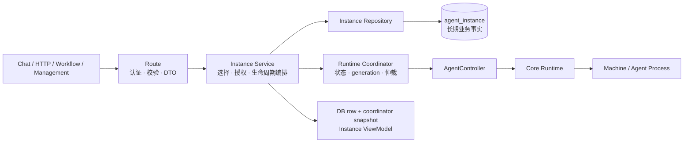

# Agent Instance 持久化与生命周期架构（目标设计权威）

> 状态：目标设计，待实施（2026-08-31 评审确认）。
> 范围：Agent Instance 的持久身份、用户归属、来源、默认实例、统一运行时、生命周期、状态权威，以及 HTTP、Workflow、Interactive Chat 三条调用路径的共同契约。
> 权威性：本文是 Agent Instance **业务身份与生命周期语义**的唯一架构权威。详细数据结构、状态转移、并发矩阵、接口与实施切片见 [`../design/agent-instance.md`](../design/agent-instance.md)。现有实现与本文冲突时，实施阶段直接替换旧逻辑，不建立兼容层。
> 非目标：跨节点 runtime owner lease、旧 runtime 认领、服务启动自动恢复、Instance rename、切换默认实例、独立 start API。本期只规定未来多节点演进边界。

## 1. 决策摘要

1. Agent Instance 是持久化业务实体；所有 runtime 必须对应一条 `agent_instance`，不得存在无持久身份的请求级 Instance。
2. HTTP 单轮、Workflow、Interactive Chat 无例外地使用同一套 Instance Repository、Service、Runtime Coordinator 和状态模型。
3. 稳定 ID 使用 `inst_*`，同时作为 DB ID、对外 `instanceUid`、Controller `instanceId` 和 Core runtime `instanceId`；删除后永不复用。
4. Instance 明确且只属于一个 `ownerUserId`。同一 Environment 下不同用户的 Instance、runtime、workspace、sandbox、配额和 relay 完全隔离，不存在跨用户启动或复用。
5. 持久创建来源为 `user | api | workflow`，创建后不可变；本次运行的调用线路与触发方式属于进程内 operation context，不得复用持久来源字段表达。
6. 每个 `(environmentId, ownerUserId)` 最多一个默认 Instance。默认 Instance 固定为 `creationSource=user`、`name=default`、`isDefault=true`，三者构成双向不变量。
7. 不传 `instanceUid` 时按调用线路的确定性键查找或创建；传入时必须精确使用指定 Instance。任何失败均不得随机回退、按运行时编号猜测或创建替代 Instance。
8. HTTP 请求、Workflow run 和 Chat 连接结束只释放各自的 PromptTurn、relay 引用和执行资源，不自动停止 runtime，也不删除 Instance row。
9. DB 只保存长期业务事实，不保存 runtime 状态、generation、PID、端口、连接、relay、operation、lock 或 runtime handle。
10. Runtime Coordinator 是运行态和生命周期操作的唯一权威。旧 Controller/Core/route 多套状态逻辑全部重写，不作为兼容约束。
11. 生命周期冲突优先级固定为 `delete > stop > restart > ensure/enter`；协调状态和 `runtimeGeneration` 只保存在进程内。
12. `stop` 分为 strict 与 best-effort。用户 stop、restart、delete 和资源删除使用 strict；shutdown、迟到结果补偿和孤儿清理使用 best-effort。
13. 服务重启采用 Machine clean-slate：旧控制连接断开后，Machine 有界终止其启动的全部 Agent 进程；新服务确认清理完成前不得启动相同 Instance。
14. ACP session ID 是受信任 Agent Engine 的不透明协议标识，不绑定 organization、Environment、Instance、workspace 或 owner，也不作为 RCS 授权凭据。
15. `instanceUid`、`rcsSessionId`、ACP session ID 是三个独立标识，不得相互编码或替代。

## 2. 领域边界与依赖方向



默认依赖方向：

```text
routes → Instance Service → Instance Repository → DB
                         → Runtime Coordinator → Controller → Core → Machine
```

| 边界 | 权威职责 | 明确禁止 |
|---|---|---|
| `agent_instance` | 身份、Environment、owner、创建来源、名称、默认关系、审计 | runtime 状态、generation、PID、连接、relay、operation |
| Instance Service | 授权、准确选择、创建幂等、领域规则和事务边界 | 直接操作底层 WS 或拼装 Core 状态 |
| Repository | 查询、约束冲突收敛、短事务持久化 | runtime 启停和业务选择 |
| Runtime Coordinator | 当前运行状态、generation、生命周期仲裁和 singleflight | 持久化业务身份、持有 DB 事务等待远端 |
| Controller/Core/Machine | 执行启动、停止及报告底层事实 | 生成第二套业务 ID、直接决定对外 Instance 状态 |
| Chat/YJS | `rcsSessionId` 下的实时投影、广播和 relay 引用 | 默认 Instance 选择、Instance 身份真相 |

## 3. 持久身份、用户归属与来源

### 3.1 Instance owner

`ownerUserId` 是不可变的执行归属，决定：

- workspace/cwd；
- sandbox 选择和复用；
- 用户并发配额；
- Instance 查询、授权和 runtime 启动；
- Workflow 执行归属及 relay 隔离。

`actorUserId` 只记录谁发起操作，不得改变 owner。同一 Environment 下不同 owner 的任何运行资源都不得共享。客户端不能提交任意 `ownerUserId`；HTTP/Chat 从认证上下文确定，Workflow 使用当前执行上下文已经携带的 `userId`，缺失时返回 `INSTANCE_OWNER_REQUIRED`。Workflow 不新增 `workflow_run.owner_user_id`，不回填历史 run，也不得回退 Environment owner、Workflow 创建者或组织管理员。

### 3.2 创建来源与运行上下文

持久来源仅表示 Instance row 首次创建入口：

```text
user | api | workflow
```

它不可变，但不限制后续调用线路；同 owner 可以通过显式 `instanceUid` 从另一条线路复用该 Instance。

本次调用另行携带非持久化 operation context：

```ts
interface InstanceOperationContext {
  channel: "chat" | "http" | "workflow" | "management";
  trigger: "user" | "scheduled" | "system";
  actorUserId: string | null;
}
```

日志和 trace 必须区分 `creationSource`、`channel` 与 `trigger`。

### 3.3 默认实例

默认关系按用户而非仅按 Environment 建立：

```text
isDefault = true
⇔ creationSource = user AND name = default
```

- `default` 是保留名；
- 每个 `(environmentId, ownerUserId)` 至多一个默认 Instance；
- 默认 Instance 仅由 Interactive Chat 无 uid 进入时原子创建；
- 普通 create DTO 不接受 `ownerUserId`、`creationSource` 或 `isDefault`；
- 默认 Instance 可以 stop/restart，但禁止 delete；
- 默认关系、名称、owner 和创建来源本期均不可修改。

## 4. 三条调用路径统一契约

所有线路遵循：

```text
确定 ownerUserId
→ 解析并授权 Environment
→ 精确选择或按线路自动 find-or-create Instance
→ ensureRuntime(instanceUid)
→ 创建或恢复 ACP Session
→ 执行 PromptTurn
→ 仅释放本次调用资源
```

自动选择矩阵：

| 线路 | 自动选择键 | 请求/run/连接结束 |
|---|---|---|
| Interactive Chat | `(environmentId, ownerUserId, user, default)` | 释放连接和 relay 引用，不停止 runtime |
| HTTP 单轮 | `(environmentId, ownerUserId, api, primary)` | 释放 PromptTurn 和请求资源，不停止 runtime |
| Workflow | `(environmentId, ownerUserId, workflow, primary)` | 释放节点执行资源和 use lease，不停止 runtime |

显式传入 `instanceUid` 时：

- 精确查询并按 owner 与 Environment fail-closed 授权；
- 不要求其 `creationSource` 与当前线路一致；
- stopped/failed 时按同一 uid 懒启动；
- uid 不存在、owner 不匹配或状态不可进入时不得回退自动 Instance。

## 5. 标识与 Session 边界

| 标识 | 生命周期与用途 |
|---|---|
| `instanceUid` | 持久 Instance 身份和 runtime 路由键 |
| `(instanceUid, runtimeGeneration)` | 当前进程内的一次 Runtime Incarnation |
| `rcsSessionId` | Chat/Y.Doc、广播和 relay projection 隔离 |
| ACP session ID | Agent Engine 管理的不透明协议会话 |

一个 Instance 可先后拥有多个 Runtime Incarnation，也可承载多个 RCS/ACP Session。restart 不更换 `instanceUid`，但会替换 runtime generation。

前端和 API 应直接传递 `instanceUid`。旧 `instanceNumber` 和 `ses_inst_{environmentId}_{instanceNumber}` 不得猜测映射；旧链接应明确失效，不能回退默认 Instance。不得再把 `ses_inst_{instanceUid}` 定义成新的业务 Session ID。

ACP session 本期不绑定 RCS 资源。该决策成立的信任前提与重新评估触发条件见详细设计；无论如何，ACP session ID 都不是授权凭据，RCS 必须先完成 Instance 授权。

## 6. Runtime 状态权威

Runtime Coordinator 是唯一运行态权威，对外状态集合为：

```text
reconciling | starting | running | stopping | stopped | failed | unknown
```

| 状态 | 定义 |
|---|---|
| `reconciling` | 正在确认或执行 Machine clean-slate，尚不可启动 |
| `starting` | 当前 generation 的启动已被接受但未确认 running |
| `running` | 当前 generation 已确认运行 |
| `stopping` | 当前 generation 已失效，正在停止和清理 |
| `stopped` | 已确认不存在活跃进程 |
| `failed` | 操作失败，但已确认不存在未知残留进程 |
| `unknown` | 无法确认远端是否仍有活跃进程 |

DB row 存在但无内存 snapshot 不再一律解释为 `stopped`：只有本地进程退出或远端 Machine clean-slate 已确认时才是 `stopped`；事实无法确认时必须是 `unknown`。

Controller、Core 和 Machine adapter 只报告底层事实；route 不得直接映射底层状态。现有状态模型与映射全部删除，由新 Coordinator 统一重写。

## 7. 生命周期与并发

冲突优先级固定为：

```text
delete > stop > restart > ensure/enter
```

- 同一 `instanceUid` 的全部生命周期请求必须经过同一进程内 coordinator entry；
- `enter` 完成 DB 选择与授权后调用 `ensure`，不是独立 runtime operation；
- 并发 ensure、restart、stop、delete 在各自允许范围内 singleflight；
- 更高优先级操作使低优先级 generation 失效；
- 单个 waiter 取消只取消自己的等待，不取消共享 operation；
- 所有异步结果必须携带捕获时的 `runtimeGeneration`；迟到结果只能补偿清理，不得恢复旧状态；
- operation、gate、generation、reservation、Promise 和 `AbortController` 全部只在内存维护；
- coordinator 不持有 DB 事务等待 Controller、Machine、relay 或 Y.Doc。

`unknown` 禁止直接 ensure、restart 或 delete，必须先完成 clean-slate/reconcile，以避免重复进程。

## 8. Stop、Restart 与 Delete

### 8.1 Strict stop

用于用户 stop、restart、delete、Environment 删除及 owner 删除前清理。成功必须确认 Agent process 已停止或不存在，并清理关键 runtime registry；Machine 不可达且无法确认时进入 `unknown`，不得报告成功。

### 8.2 Best-effort stop

用于服务 shutdown、stale generation 补偿、Machine 断连辅助清理和 orphan sweep。它尝试所有清理阶段并返回结构化结果，但不得被 delete 当作 strict stop 成功。

### 8.3 Restart

restart 对相同 uid singleflight，先 strict stop，再以同一 uid 和新 generation 启动。它不修改 DB row、不静默重试，也不重放未完成 PromptTurn。

### 8.4 Delete

```text
查询并授权
→ 在任何 stop 前拒绝默认 Instance
→ 设置 deleting gate 并使低优先级 generation 失效
→ strict stop
→ 短事务删除 DB row
→ 清理 coordinator entry
```

- strict stop 失败：保留 row并释放 gate；
- strict stop 成功但 DB 删除失败：保留 row，状态为 `stopped`，允许重试；
- DB 删除成功后，任何迟到结果不得恢复 runtime；
- 删除后的 uid 永不复用。

## 9. 服务重启与 Machine Clean-slate

当前单节点阶段采用 clean-slate，不认领或恢复旧远端进程：

1. 主服务启动生成进程级 `serverEpoch`；
2. Machine 上的 Agent process 绑定其控制连接和 `serverEpoch`；
3. 控制连接断开后，Machine 在有界宽限期内终止该连接启动的全部 Agent process；
4. 清理完成前不得向新连接报告 ready；
5. 重连后先确认前一连接世代 `cleanup_complete`；
6. 主服务收到确认前不得在该 Machine 上启动相同 Instance；
7. Machine 长期不可用时，相关 Instance 保持 `unknown`，本期不提供 force-delete。

服务重启不扫描 DB 自动启动 Instance。clean-slate 完成后，后续 enter/ensure 才能以原 `instanceUid` 创建新的 Runtime Incarnation。

## 10. 安全、故障与观测

- `instanceUid` 只是资源定位符，不是授权凭据；每次操作必须从 DB 恢复 owner、Environment 和组织上下文后重新授权。
- workspace 路径固定按 `{WORKSPACE_ROOT}/{organizationId}/{ownerUserId}/{environmentId}` 计算，浏览器或调用方不能覆盖 cwd。
- file-ws 与 Agent runtime 是独立能力平面；file-ws 不可用只降级文件能力，不自动改变 Instance runtime 状态。
- relay 断连不等于 Agent process 已停止；只有 strict stop 或 Machine clean-slate 可确认不存在进程。
- 日志和 trace 至少区分 `operationId`、`instanceUid`、owner、actor、creation source、channel、trigger、operation、generation、前后状态、timeout phase 和补偿结果。
- 密钥、relay token、完整 ACP session ID、workspace 绝对路径和内部进程命令不得进入对外响应或普通日志。

## 11. 发布与演进边界

实施采用一次性目标模型切换：

- 删除无持久 row runtime、运行时编号身份、随机回退、每请求 spawn/stop 和旧状态映射；
- 不增加双写、deprecated shim 或旧编号到 uid 的猜测映射；
- schema 可先部署，代码回滚时保留新表和数据，不以 DROP 表作为紧急回滚；
- 实施完成后同步修订 Chat、Workflow、Orchestration 和文件架构中的旧实现描述。

未来多节点必须增加 runtime owner node、owner lease、fencing token、全局状态查询和跨节点生命周期命令。在此之前，部署必须保证同一 Instance 的生命周期请求落到同一有状态主服务节点。

## 12. 关联文档

| 文档 | 权威范围 |
|---|---|
| [`../design/agent-instance.md`](../design/agent-instance.md) | 本架构的详细数据模型、状态机、并发矩阵、接口、测试和实施切片 |
| [`20-orchestration-management.md`](./20-orchestration-management.md) | Controller、AgentNode、Core runtime 与 Machine 编排实现 |
| [`19-yjs-chat-streaming.md`](./19-yjs-chat-streaming.md) | Chat/YJS 实时投影、relay、ACP Session、多标签页与重连 |
| [`03-auth.md`](./03-auth.md) | 认证、组织上下文与授权边界 |
| [`04-agent-config.md`](./04-agent-config.md) | AgentConfig 业务配置 |
| [`12-files.md`](./12-files.md) | workspace、远程文件与 file-ws 安全边界 |
| [`17-workflow.md`](./17-workflow.md) | Workflow run、节点执行、timeout 与取消 |
| [`21-observability-observer-service.md`](./21-observability-observer-service.md) | 运行态观测投影 |

本文不替代专项协议文档；它定义所有相关路径共同依赖的 Instance 身份、用户隔离和生命周期不变量。
