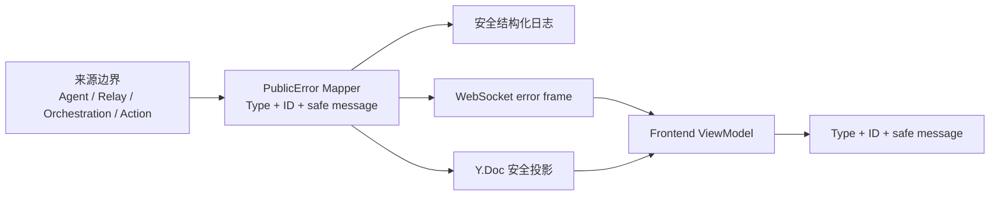

# Chat 错误公开与诊断关联架构

> 状态：权威目标设计（2026-08-31）
> 范围：交互式 Chat 路径中错误从 Agent Runtime、Sync Relay、Control Plane、Action 边界产生，经 WebSocket / Y.Doc 投影到浏览器并关联服务端日志的公开契约。
> 定位：本文档是 **Chat 用户可见错误 Type、Error ID、脱敏摘要与诊断关联的权威来源**。YJS 状态聚合见 `docs/arch/19-yjs-chat-streaming.md`，实例生命周期见 `docs/arch/20-orchestration-management.md`，Observer Service 关系图谱见 `docs/arch/21-observability-observer-service.md`。
> 约定：代码演进偏离时先更新本文档再改代码。本文不定义错误恢复产品流程，也不授权 UI 提供重试、重连、重新发送、重新执行或配置跳转操作。

## 0. 硬边界

1. **用户错误只展示 Type、ID 和安全摘要**：默认结构固定为错误标题、`Type`、`ID`、安全摘要。不得使用内部异常原文替代安全摘要。
2. **不提供恢复操作**：错误展示不得提供或建议重试、重连、重新发送、重新执行、修改配置、管理实例等操作。系统既有连接状态机可以自行运行，但错误卡片不得驱动用户执行可能重复或错误的操作。
3. **Type 在来源边界唯一确定**：最先掌握因果事实的服务端边界生成 Type；application、transport、Y.Doc、ViewModel 和 UI 只能传递，不能重新分类。
4. **Error ID 端到端不变**：一次独立故障只生成一个随机 Error ID；服务端安全日志、WebSocket 错误帧、Y.Doc、ViewModel 和用户界面必须复用同一 ID。
5. **未知错误不甩锅**：无法安全分类的异常统一为 `INTERNAL.UNCLASSIFIED`，不得默认归为 Agent Runtime、Sync Relay 或其他业务域。
6. **传输信号不等于业务事实**：WebSocket close code 只表达连接生命周期；close reason 不参与业务 Type 分类。前端不得根据 close code/reason 覆盖已收到的 Type。
7. **原始异常不出服务端受控边界**：Agent payload、RPC message、stderr、stack、prompt、tool arguments/result、token、Authorization、workspace path、URL query 和内部连接串不得进入公开错误、Y.Doc、DOM 或普通日志。
8. **公开 Type 只能追加**：已发布 Type 不得重命名、复用或改变语义。新增 Type 必须同步注册表、映射、i18n、日志和测试。
9. **不以本地化掩盖诊断事实**：`Type` 与 `ID` 原样显示；只有标题和安全摘要按语言本地化。不得把 Type 翻译成不稳定自然语言标识。

## 1. 用户界面契约

用户可见错误统一采用以下信息顺序：

```text
执行出错

Type: AGENT_RUNTIME.PROMPT_REJECTED
ID: err_01K3R7Z2X8H9...

Agent request failed.
```

不同承载位置可以使用与对象一致的固定标题，例如“执行出错”“连接出错”“操作出错”，但必须满足：

- `Type` 完整显示且可复制；
- `ID` 完整显示且可复制；
- 摘要来自受控 Type 注册表，不读取原始 `Error.message`；
- 不显示重试能力或恢复建议；
- 不显示原始 stderr、stack 或 payload；
- 同一 Error ID 在同一视觉上下文不得重复展示。

责任域名称是 Type 的稳定前缀，不另行显示 `Agent Runtime Error`、`Sync Relay Error`、`Control Plane Error`、`Action Error` 作为主要用户标题。

## 2. 公开错误契约

```ts
export interface PublicError {
  /** 稳定、有限、可直接展示的错误 Type。 */
  type: PublicErrorType;
  /** 随机且不携带业务语义的公开诊断标识。 */
  id: string;
  /** 由受控注册表生成的脱敏摘要，不是原始异常 message。 */
  message: string;
}
```

公开契约不包含：

- `retryable`
- `retryAfterMs`
- `recovery`
- `outcome`
- 原始 `code`
- 内部资源或租户 ID

这些字段即使在内部业务逻辑中存在，也不得驱动用户错误展示。

### 2.1 Error ID

Error ID 格式为：

```text
err_<随机标识>
```

要求：

- 至少 128 bit 随机性；
- 不从 user/org/agent/instance/session/command ID、错误文本或路径派生；
- 最先确认公开故障的服务端边界生成；
- 下游不得重新生成；
- 同一底层故障若同时经错误帧、Y.Doc 与 close 传播，必须保持相同 ID；
- ID 可以公开给用户并用于受控日志查询，但不能作为认证或授权凭据。

## 3. PublicErrorType 注册表

首版只登记已有真实故障，不为推测性场景预留 Type。

### 3.1 Agent Runtime

```text
AGENT_RUNTIME.REQUEST_FAILED
AGENT_RUNTIME.SESSION_FAILED
AGENT_RUNTIME.PROMPT_REJECTED
AGENT_RUNTIME.PROMPT_TIMEOUT
AGENT_RUNTIME.LLM_API_CONFIGURATION_ERROR
AGENT_RUNTIME.DISCONNECTED
```

只允许 Agent 进程、ACP Session、Prompt 执行与 Agent relay 明确报告的运行时事实进入此域。`AGENT_RUNTIME.LLM_API_CONFIGURATION_ERROR` 只对白名单 Peri 文案 `An LLM API error occurred. Please check your API configuration.`（允许传输换行与空白差异）进行稳定映射；其他 Agent `Error.message` 仍不得进入公开错误。

### 3.2 Sync Relay

```text
SYNC_RELAY.CONNECTION_LOST
SYNC_RELAY.CAPACITY_EXCEEDED
SYNC_RELAY.KEEPALIVE_TIMEOUT
SYNC_RELAY.SYNC_FAILED
```

只允许 YJS 文档同步、Relay 容量、保活与同步应用失败进入此域。Agent 错误即使通过 YJS WebSocket 送达，仍属于 Agent Runtime。

### 3.3 Control Plane

```text
CONTROL_PLANE.ENVIRONMENT_UNAVAILABLE
CONTROL_PLANE.MACHINE_UNAVAILABLE
CONTROL_PLANE.INSTANCE_RECLAIMED
CONTROL_PLANE.INSTANCE_START_FAILED
CONTROL_PLANE.INSTANCE_LIMIT_REACHED
CONTROL_PLANE.CONFIGURATION_INVALID
```

Environment、Machine、实例编排、启动与生命周期事实进入此域。

### 3.4 Action

```text
ACTION.UNAUTHENTICATED
ACTION.FORBIDDEN
ACTION.SESSION_NOT_FOUND
ACTION.VERSION_CONFLICT
ACTION.INVALID_STATE
ACTION.RATE_LIMITED
ACTION.PAYLOAD_TOO_LARGE
ACTION.AGENT_UNAVAILABLE
ACTION.FAILED
```

只表示当前控制命令边界报告的失败，不推断命令是否已执行，也不向用户建议再次操作。

### 3.5 Internal

```text
INTERNAL.UNCLASSIFIED
```

当异常无法在可信来源边界安全映射时使用。它明确表示平台尚未分类，而不是将责任归给某个下游系统。

## 4. 来源边界与数据流



依赖纪律：

- 来源 adapter 将已知内部错误映射成 `PublicError`；
- application 可以补充内部诊断上下文，但不能覆盖 `type` 或 `id`；
- transport 只序列化 DTO 和决定 close 生命周期；
- Y.Doc 只投影完整、schema-valid 的 `PublicError`；
- ViewModel 只复制公开字段；
- UI 按 `id` 去重并渲染，不解析 Type 反推业务动作。

禁止：

```text
close reason → Type
close code → 覆盖服务端 Type
Error.message → public message
Y.Doc aggregator → 猜测 Agent Runtime
UI → 根据 Type 生成恢复操作
```

## 5. WebSocket 与 Y.Doc 规则

1. 已知服务端错误优先发送完整 `PublicError` 帧；若同时关闭连接，close code 只控制连接生命周期。
2. 浏览器缓存最近一条完整错误帧；close 后不得用本地推断覆盖它。
3. 未收到错误帧的异常关闭只能生成客户端 transport fallback；它不能伪装成 Machine、Agent 或 Environment 的确定事实。
4. Y.Doc 仅接收完整、合法的 `PublicError`。非法结构应被拒绝并在服务端生成独立 `INTERNAL.UNCLASSIFIED` 诊断，不能把原始值写入文档。
5. Tool、Message、Session、Connection 等展示位置可以不同，但载荷契约一致。
6. 同一 `id` 的 WS 与 Y.Doc 错误只显示一次；优先附着于最具体的已有对象，不重复堆叠 banner。

## 6. Action 错误信封

Action 仍需 `commandId` 完成协议关联，但错误载荷统一：

```ts
export interface ActionErrorFrame {
  type: "action_error";
  commandId: string;
  error: PublicError;
}
```

- `commandId` 不属于 `PublicError`；
- UI 可以用它将错误附着到原操作，但不得据此生成重试操作；
- 不再向公开错误暴露 `retryable` 或 `retryAfterMs`；
- Action 内部调度如需重试策略，应留在服务端内部模型中。

## 7. 日志与诊断关联

每个用户可见错误必须写入安全结构化事件：

```json
{
  "event": "chat.error",
  "errorId": "err_01K3R7Z2X8H9...",
  "errorType": "AGENT_RUNTIME.PROMPT_REJECTED",
  "stage": "relay.prompt.response",
  "occurredAt": "2026-08-31T04:15:22.000Z",
  "internalCode": -32000
}
```

其中：

- `errorId` 与 UI 完全一致；
- `errorType` 使用公开 Type；
- `stage` 是有限的服务端诊断阶段；
- `internalCode` 仅可使用不含敏感信息的有限值；
- 原始异常对象、message、payload、stack 和 stderr 不进入普通日志；
- 若受控错误采集系统保存完整异常，必须通过 `errorId` 关联并执行独立访问控制。

## 8. 安全摘要与本地化

Type 注册表同时定义中英文安全摘要 key。摘要必须：

- 陈述已确认事实；
- 不声称操作未执行或可安全重试，除非该事实本身是 Type 的严格语义；
- 不包含动态原始异常文本；
- 不包含内部 ID、路径、host、端口、Provider 响应或租户信息；
- 不提供恢复建议。

示例：

| Type | 中文安全摘要 | English safe message |
|---|---|---|
| `AGENT_RUNTIME.PROMPT_TIMEOUT` | `Agent 请求处理超时。` | `The Agent request timed out.` |
| `CONTROL_PLANE.MACHINE_UNAVAILABLE` | `Agent 运行机器当前不可用。` | `The Agent machine is unavailable.` |
| `SYNC_RELAY.CAPACITY_EXCEEDED` | `同步服务当前无法接受更多连接。` | `The synchronization service cannot accept more connections.` |
| `ACTION.FORBIDDEN` | `当前操作未获授权。` | `The action is not authorized.` |
| `INTERNAL.UNCLASSIFIED` | `系统发生未分类错误。` | `An unclassified system error occurred.` |

## 9. 迁移策略

本路径是内部 Chat 协议，迁移采用直接替换，不新增 deprecated shim 或长期双写：

1. 将当前 `area + code + message + retryable` 替换为 `type + id + message`；
2. 将 ActionError 的公开字段收敛为统一 `error: PublicError`；
3. 在所有来源边界使用唯一 mapper；
4. 删除 Aggregator 中按 fallback area 猜测责任域的逻辑；
5. 删除前端按 close code/reason 推断业务 Type 的逻辑；
6. 删除错误展示中的重连、重试、重新发送和配置跳转能力；
7. 完成后删除旧类型、旧 i18n key 和仅为旧契约存在的测试 fixture。

回滚以 Git commit 回退，不保留两套运行时契约。

## 10. 验收不变量

实现完成必须由测试证明：

1. 每个公开 Type 都在有限注册表中，并有中英文安全摘要；
2. 同一故障在日志、WS、Y.Doc、ViewModel 和 DOM 中使用同一个 Error ID；
3. 下游层不能改变 Type 或重新生成 ID；
4. `auto_start_disabled` 等精确来源 Type 不被 `4502` 覆盖；
5. 未分类错误为 `INTERNAL.UNCLASSIFIED`，不归 Agent Runtime；
6. Agent 原始 error message、stderr、stack 和 payload 不进入 WS、Y.Doc、DOM 或普通日志；
7. UI 明确显示完整 `Type` 和 `ID`；
8. 同一 ID 不重复显示；
9. 错误 UI 不含重试、重连、重新发送、重新执行或配置跳转操作；
10. `bun run build:web` 与 `bun run precheck` 全绿。
