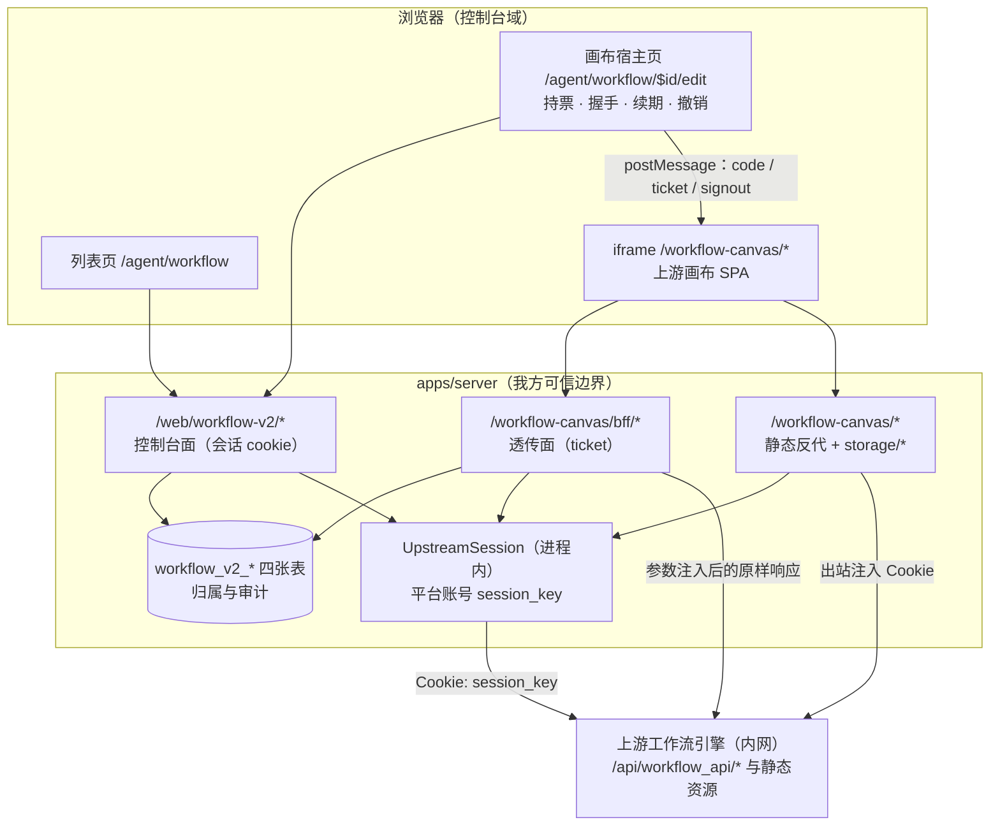

# Workflow V2 模块架构（workflow-v2）

> 状态：实现中（2026-09-29）。模块已进 `deploy/assembly/ce.json`（`resources` 与 `web` 两个列表），控制台已接线，自研 workflow 前端已删除；**画布端到端链路仍未跑通**（缺上游账号密码，见 §8）。
> 范围：模块定位、运行拓扑、身份与租户映射、归属真相源、三条路径面、票据链路、数据模型与补偿语义。
> 权威性：接口表、参数注入白名单、握手逐字段口径、节点白名单与删除计划以 [Workflow V2 设计](../design/2026-09-29-workflow-v2-upstream-studio-bridge.md)（下称「设计」）与 [接口冻结](../design/2026-09-29-workflow-v2-interface-freeze.md)（下称「冻结」）为准，本文只给结论与导航。
> 术语：**上游** 指外部仓库 `/Users/konghayao/code/ai/workflow-studio`（上游工作流引擎），**画布**指其 FlowGram 工作流编辑器页面。
> 命名：模块代码、环境变量、数据库列与用户可见文案一律用中立词（`upstream*` / `platform*` /「工作流空间」），不出现上游产品名；**唯一例外是上游契约**，见 §10。

## 1. 模块定位

`workflow-v2`（`@fenix/resource-workflow-v2`，`kind: "resource"`，能力 `resource.workflow-v2`）是上游工作流能力的接入模块，owner 身份映射、归属登记、票据、参数注入、透传与审计。

| 模块 | owner 什么 | 本期关系 |
|---|---|---|
| `packages/resources/workflow`（自研引擎，见 [17-workflow](./17-workflow.md)） | DAG 引擎与执行通道：`/web/workflow-defs`、`/web/workflow-runs`、`/api/workflows/:workflowId/execute`、`/hooks/:publicHash`、`/workflow-ui` 静态代理，以及全部 workflow 表 | **控制台前端已删除**（`web/**` 与 `exports["./web"]`，2026-09-29）；服务端与引擎保留，两个模块在装配面上并存 |
| `packages/resources/workflow-v2` | 上游接入面：身份与租户映射、归属真相源、票据、透传、审计 | 新增，与上者并存 |

边界：workflow-v2 **不解释 workflow schema、不执行节点、不落 workflow 定义**——定义、版本、运行、发布的权威实现是上游；上游侧按黑盒使用，只调其现成 HTTP API，改造仅允许落在其 `frontend/**`。

## 2. 运行拓扑

| 组件 | 负责 | 不负责 |
|---|---|---|
| 控制台（`apps/web` + `workflow-v2/web`） | 列表/创建/删除、iframe 宿主、握手与票据转发、错误与降级 UI | 不直连上游；不持有平台凭据 |
| workflow-v2（后端） | 身份映射、归属真相源、参数注入、票据签发与校验、上游会话、透传、审计 | 不解释 workflow schema；不执行节点 |
| 上游服务 | workflow 定义/版本/运行/发布的权威实现；画布静态资源 | 不感知我方租户与用户 |

## 3. 身份与租户映射

| 平台侧 | 上游侧 | 承载 |
|---|---|---|
| FenixAgent 平台整体 | 1 个上游用户，及其个人空间（space） | 凭据只存 env secret（`secret: true`）；`session_key` 只住在 workflow-v2 的会话存储（共享存储 Redis，未配置或不可用时降级为进程内单例，见 §6），不入库、不入日志、不进响应 |
| organization（租户） | 1 个 App（bot，`POST /api/draftbot/create`） | `workflow_v2_org_app`，`unique(organization_id)` / `unique(app_id)` |
| workflow | 租户 App 下的一个 workflow | 创建时注入 `space_id`=平台个人空间、`project_id`=租户 App |
| 平台用户 | **无对应物** | 上游侧 creator 恒为平台账号 → 用户归属只存在于本地注册表的 `owner_user_id` |

- 空间 ID 由 `space/list` 选出个人空间（`space_type === 1`）后落 `workflow_v2_platform_account`，是建 App 与建 workflow 的 `space_id` 注入源。
- 登录面 `POST /api/passport/web/email/login/`：`session_key` **只出现在 `Set-Cookie`**，必须解析响应头而非 body；同一账号同时只有一个有效会话，重登即踢旧键——多副本各自登录会互相踢键，4B 起由共享存储 + 登录租约规避（见 §6 第 6 条）。
- **账号供给（2026-09-30 补记）**：账号由**引导路径自助注册**——`bootstrapPlatformAccount()` 在登录前调一次上游注册端点（`POST /api/passport/web/email/register/v2/`，邮箱已存在按成功处理，故顺次重复执行幂等），部署方只需注入 `WORKFLOW_V2_PLATFORM_ACCOUNT_EMAIL` / `WORKFLOW_V2_PLATFORM_ACCOUNT_PASSWORD`，**不必先人工建号**。注册**只**发生在「台账无行、需要现场确定账号身份」的引导路径，常规登录失败路径（`login()` / `ensureCookie()` / 鉴权失败重登）不触达——否则 env 邮箱写错会凭空造号。边界：账号必须按**保留账号**管理（任何人用同一邮箱在上游 UI 登录都会覆盖 `user.session_key` 并踢掉我方会话）；上游注册白名单存在缺陷（读错 env 变量），**不可依赖**。详见[平台账号供给设计](../design/2026-09-29-workflow-v2-account-provisioning.md)。

## 4. 归属真相源（本设计的核心安全约束）

上游不提供 workflow 级归属判定，跨租户隔离**必须**由 workflow-v2 承担：

1. `checkUserSpace` 只证明「平台账号属于该 space」，**不校验 workflow ↔ App 归属**，也不表达我方用户。
2. `workflow_list` 的 `project_id` 是硬过滤，但列表项**不回显归属**——出问题后也无法从上游反查。
3. 因此 `workflow_v2_workflow`（本地注册表）是归属的唯一真相源：所有带 `workflow_id` 的请求**先在注册表校验「存在 + 属于当前组织 + 当前用户有权」，未命中一律 404**（不泄漏资源存在性），再转发上游。
4. 客户端自报的 `space_id`、`project_id`、`bot_id`、`owner_id`、`login_user_create`、`creator`/`operator` 一律 strip；POST 只注入绑定的 `space_id` 与 `project_id`，GET 只补 `space_id`。本模块使用 App 上下文，`bot_id` 是与 `project_id` 互斥的 Agent 上下文，不得同时注入；`workflow_id` 只做归属校验、不改写。
5. 控制台不直连上游、不持有平台凭据；平台会话与租户映射不出现在浏览器侧。

## 5. 三条路径面

| 面 | 路径 | 鉴权 | 响应口径 |
|---|---|---|---|
| 控制台面 | `/web/workflow-v2/*` | 控制台会话 cookie（`web` 槽注入会话守卫） | 归一化为 `{ success, data }` / `{ success: false, error }` |
| 画布透传面 | `/workflow-canvas/bff/*` | 请求头 `X-Fenix-Workflow-Ticket` | **上游原生 `{ data, code, msg }`**（含 HTTP status，原样回传） |
| 静态反代 | `/workflow-canvas/*`（`/workflow-canvas/storage/*` 映射存储域） | 无（同源） | 上游字节流 |

透传面只开放三条上游前缀，其余一律 404：`/api/workflow_api/`、`/api/common/upload/`、`/api/playground_api/get_imagex_url`（后两条来自阶段 0 实测，见设计 §9.1.1 第 5 条）。

工程口径：

- **两条响应口径在路由层分界，不得混用**：画布 SDK 按上游信封解析，且部分上游接口是裸对象（`list_spans` 只有顶层 `spans`），任何「统一包一层」都会打断它（冻结 §6）。
- **限流在服务层判定、路由层落头**：画布透传按票据 `sub` 计数（`WORKFLOW_V2_BFF_RATE_LIMIT_PER_MINUTE`，默认 1200），免票的 `session/exchange` 与无有效票据的 `refresh`/`revoke` 按来源地址计数（`WORKFLOW_V2_SESSION_RATE_LIMIT_PER_MINUTE`，默认 60）；超限是**真实 HTTP 429 + `Retry-After`**。按 `sub` 而非来源地址是因为反代之后全站往往共用同一个入口 IP，按来源限流会把「一个用户在刷」放大成「同源用户一起被拒」。桶住在进程内，多副本下实际阈值 ≈ 配置值 × 副本数，全局阈值归部署层。
- 路由声明序：`bff` 必须先于静态反代——后者是通配路由，顺序错会吞掉透传请求。
- 静态反代**出站**注入平台账号 `session_key`：上游除静态白名单外全站经 session 中间件，`/workflow-canvas/*` 不带 cookie 时连 JS 资源都 401。**入站**剥离上游 `Set-Cookie` 并注入 `frame-ancestors`；两个方向不可混为一谈。
- 两处例外改写（均属「无法只靠透传解决」，须在代码内注明移除条件）：上游 panic 响应（`code 777777775`，`msg` 含 Go 堆栈与内部路径）替换为固定文案；图片/附件直链是存储服务内网地址，按已知 origin 前缀改写为 `/workflow-canvas/storage/*`，不做泛化重写。
- 节点范围裁剪的权威在服务端：`node-scope.ts` 对 `node_type` / `node_template_list` / `node_panel_search` 按 **fail-closed 许可集**（节点类型为数字字符串）过滤，客户端无法绕过。

## 6. 票据链路

1. 宿主（控制台）以会话 cookie 调 `POST /web/workflow-v2/iframe-code` 取**一次性 code**（60s，绑定 user + org + workflow）。
2. code 经 `postMessage` 下发，**不进 URL**（URL 会进 referrer、历史与代理日志）；兑换 `POST /workflow-canvas/bff/session/exchange` 得到 **HMAC 票据**（payload 含 `sid/sub/org/wf/iat/exp/jti`，TTL 15 分钟）。
3. 画布所有透传请求携带 `X-Fenix-Workflow-Ticket`；票据只存内存，不入 cookie/storage/URL，日志只记 `sid`/`jti` 前缀。
4. 续期与撤销：`session/refresh`（不超过原过期时间）、`session/revoke`（登出/切组织）——两者都要求票据头，因此**票据持有方决定续期与撤销能力**。宿主页据此走 `token` 路径（票据在宿主内存，两条链路都在宿主侧闭环）；`bind` 是画布侧保留的兼容路径，用它则撤销不可达（冻结 §7）。
5. 换票触发口径：画布只在 `error.response.status === 401` 时发 `refresh-request`，因此 BFF 的票据失败**必须是真实 HTTP 401**；`HTTP 200 + {code:401}` 会走业务错误分支、永不换票。同理**限流必须是真实 429**（带 `Retry-After`）而不得用 401 表达：429 落进画布的普通失败分支正是我们要的，被当成票据失效只会让它去换一张同样被限的票（冻结 §6）。
6. 多副本会话：权威副本在共享存储（Redis），进程内 5s 缓存；登录走 `SET NX PX` 租约 + Lua 比删释放，抢不到租约的副本在等待窗口内等对方发布会话，等不到再抢一次、仍失败才如实回 `busy`；`loggedInAt` 作失效水位，避免「读得到、删不掉」时复活本进程刚判定失效的会话。Redis 不可用时降级为进程内单例并**节流告警**（不静默改变鉴权语义：降级只影响谁能复用登录态，票据与归属判定不经过它）。

## 7. 数据模型与一致性

四张表归本包 `db/schema.ts`（迁移 `drizzle/0030_workflow-v2-init.sql`；`drizzle/0031_workflow-v2-audit-action-index.sql` 为补偿标记的反查补索引）：

| 表 | 职责 | 关键约束 |
|---|---|---|
| `workflow_v2_platform_account` | 平台账号与个人空间台账（单行） | `unique(platform_user_id)`；**不存 `session_key`** |
| `workflow_v2_org_app` | 租户 ↔ App 映射 | `unique(organization_id)`、`unique(app_id)` |
| `workflow_v2_workflow` | 归属注册表（本模块的真相源） | `unique(upstream_workflow_id)`、`index(organization_id, deleted_at)`；含 `owner_user_id`、`visibility`、`published_version`、`sync_state` |
| `workflow_v2_audit_log` | 审计流水（只追加） | `index(organization_id, created_at)`、`index(action, upstream_workflow_id)`（对账反查补偿标记用，迁移 0031）；不记 body 与凭据 |

一致性策略：

| 数据 | 真相源 | 同步策略 |
|---|---|---|
| workflow schema、版本、发布状态、运行记录 | 上游 | 透传读取；列表以上游分页结果为主 |
| 归属（org/app/owner）、本地可见性、审计 | 本地 | 创建走「先上游后本地 + 失败补偿删除」；本地缺失时按需补写 |
| 删除 | 双方 | 本地软删 + 调上游删除；上游删除失败置 `sync_state = pending_delete`，由对账任务重试 |

`sync_state` 因此是**补偿状态机**而非业务状态：`active` / `pending_delete` 两值，`pending_delete` 表示「本地已不可见、上游对象可能仍在」，只能由对账任务收敛（4A 已落地：上游确认后硬删本地行并写 `workflow.delete.upstream` / `reconciled` 审计，双闸预算与退避见 §8）。发布版本号是另一处本地持久化必需项：上游的 `workflow_version` 必须严格自增且没有可靠的「当前版本」读接口，递增只能由本地注册表承担。

## 8. 现状（2026-09-29）

**已落盘（工作区，未提交）**：包骨架与模块清单（三条路由贡献 `web-control` / `canvas-bff` / `canvas-static` + 十二枚 `envDefinitions`）；`db/schema.ts` 与迁移 0030；服务层（上游会话、一次性 code 与票据、本地注册表、租户 App 绑定、节点白名单、透传、静态反代、审计、发布与熔断）；控制台界面（列表页、画布宿主页、握手与降级视图）；包内测试；宿主侧配置投影（`apps/server` 的 `module-configs.ts` 已含 `workflow-v2` 块）；**装配面启用与控制台接线（2F，2026-09-29）**——`deploy/assembly/ce.json` 的 `resources` 加入 `workflow-v2`、`web` 列表改由本包贡献（id 沿用 `workflow`），`apps/web` 的路由、i18n、依赖与生成物一并指向本包，旧 `packages/resources/workflow/web/**` 与宿主 `/agent/workflow/$id/versions` 已删除（删除台账见该包 `README.md` 末条）；**门禁（2G，2026-09-29）**——`bun run precheck` 16 步全绿（server/script 916、package 8812、web-app 259 用例全过）与 `bun run build:web` 均通过，连带重生成 `deploy/manifests/**` 并同步 `frontend-development.md` 里随旧前端失效的引用（SSE 例外点、file-events 域模块落点）；**对账与多副本加固（4A/4B，2026-09-29）**——周期对账任务（`pending_delete` 硬删重试 + `reconciled` 审计、孤儿补写、创建补偿收敛）随模块装配启动、经 `registerCleanup` 停止且**无手工触发端点**，单行重试退避 30s × 2ⁿ、封顶 30min；上游会话改由共享存储（Redis）承载，不可用时降级进程内并节流告警；画布透传与票据端点加进程内令牌桶限流，超限返回真实 429 + `Retry-After`；**平台账号自助注册（2026-09-30，`54831be59`）**——引导层在登录前调一次上游注册端点（邮箱已存在按成功处理），部署方不再需要人工建号；注册只在台账无行的引导路径发生，`login()` / `ensureCookie()` / 鉴权失败重登分支均不触达（env 邮箱写错不会凭空造号），上游关注册时仍照常尝试登录以兼容「人工建号 + 关注册」的既有部署；本轮**未新增 env**，仅更新两枚账号 env 的描述文案与三份生成样例（详见[平台账号供给设计](../design/2026-09-29-workflow-v2-account-provisioning.md)）。

**未落地与已知边界**：

- **1J 已在本机真实跑通，但部署面仍需自证（2026-09-30 更新）**：1J（打开 → 编辑 → 保存、伪造 `space_id`/`project_id` 被覆盖、跨租户 404）三条判据已在本机以 `RCS_PORT=3100` 的独立实例真实执行完毕，**24 PASS / 0 FAIL、退出码 0**（上游 `http://127.0.0.1:18080`；控制台侧为新账号经 `POST /api/auth/sign-in/email` 登录；平台上游账号由引导路径**自助注册**，账号本身**不需要预先存在**，注入任意邮箱/密码即可）。**部署方仍需注入三枚 env**（`WORKFLOW_V2_PLATFORM_ACCOUNT_EMAIL` / `WORKFLOW_V2_PLATFORM_ACCOUNT_PASSWORD` / `WORKFLOW_V2_TICKET_SECRET`，缺失即启动失败），且本机结论只覆盖「单进程实例 + 单组织账号 + 本机上游」这一形态：本机 `.env` 未配 `RCS_REDIS_URL`（会话退回进程内单例），**多副本会话共享、反代与容器等部署形态下的行为仍未验证**。（画布可达的服务端前置——`GET /web/workflow-v2/platform-account` 的 `spaceId` 投影——已于 3E 落地：改读平台账号台账，未引导账号回 `null`、读库失败回 500，画布页据此区分 `space-missing` 与 `probe-failed`。）
- **对账已落地，但有三处边界**：① 孤儿扫描以「本地已绑定 App」为入口，`workflow_list` 的 `project_id` 是硬过滤，因此**只看得到挂在某个租户 App 下的对象**——平台账号直接建在个人空间、不属于任何 App 的对象不在扫描范围内（没有 `project_id` 就没有可反查的归属，补写只会是猜测）；移除条件：上游提供「按 space 列出全部对象并回显归属」的接口时，改为按 space 全量对账。② `workflow_list` 列表项的真实字段形态**只按契约快照实现、尚未用真实响应验证**：真实形态不同则扫描 fail-closed 成「跳过 + 告警」，不会误写归属。③ 待删重试的**次数**预算住在进程内（重启即重置），只有**年龄**预算（按 `deleted_at`）持久——重启后同一行最多再被重试 5 次，最终由年龄闸兜底收敛。
- **平台账号供给的三处边界（2026-09-30 补记）**：① 邮箱拼错仍会在**首次引导**按错邮箱建出账号（自助注册的固有代价；触发面已收窄到「台账无行」这一条路径，整条部署生命周期最多建错一次，但该邮箱会被占用，纠错需改 env 后重新引导 + 人工清理上游旧号；移除条件：上游支持按邮箱删号，或改回「人工建号 + 关注册」）。② 上游注册默认开放，建号窗口内「谁先注册谁拥有该邮箱」；生产建议建号后关闭注册（`DISABLE_USER_REGISTRATION=true`），但上游 `ALLOW_REGISTRATION_EMAIL` 白名单读错了 env 变量（开关一开白名单必失效），因此「只允许特定邮箱注册」这个中间档当前不可用。③ 账号必须登记为**保留账号**：`user.session_key` 按用户只存一个值、登录即覆盖，任何人在上游 UI 用同一邮箱登录都会踢掉我方会话（我方拿到 `700012006` 后重登，双边会互相顶键）。并发注册的败者撞上游唯一索引、以 HTTP 500 归为 `failed`，无功能故障（账号已由赢家建出，随后登录照常）。
- **限流是进程内的**：令牌桶住在各副本自己的进程里，多副本下实际阈值 ≈ 配置值 × 副本数。这是显式接受的取舍——不做分布式计数（每次请求一次 Redis 往返的代价与本模块流量规模不成比例）；需要全局阈值时应在反代层做，本模块不承担。
- **技术债：`src/server/services/canvas-passthrough.ts` 605 行**，超出「单文件 ≤ 500 行」指引（既有状况，4A/4B 本轮未拆）。影响范围：透传面是租户隔离的唯一权威，该文件同时住着「票据与归属校验、上游路径分类、panic 脱敏、节点白名单调用、`get_process` 轮询预算、三个会话端点、限流取值」；风险是安全关键逻辑继续在同一文件里增长，后续改动容易被无关段落淹没、review 难以聚焦。移除条件：把「调试运行的轮询预算（`get_process`）」与「会话端点（`handleSessionExchange` / `handleSessionRefresh` / `handleSessionRevoke`）」两段各拆成独立模块即可回到阈值内（两段合计约 150 行，拆出后约 455 行）。
- **上游仓侧**（外部仓库，工作区未提交）：`frontend/**` 的宿主桥与 axios 注入、rsbuild 资源前缀与路由 basename、画布注桩、头部裁剪与埋点静默已改（清单见[前端改造记录](../design/2026-09-29-workflow-v2-upstream-frontend-changes.md)）。

阶段划分与任务编号见 [任务清单](../design/2026-09-29-workflow-v2-task-list.md)。

## 9. 相关文档

- 设计：[Workflow V2：接入上游工作流引擎画布与工作流平台设计](../design/2026-09-29-workflow-v2-upstream-studio-bridge.md)
- 契约：[接口冻结](../design/2026-09-29-workflow-v2-interface-freeze.md)、[上游契约快照基线](../design/2026-09-29-workflow-v2-upstream-contract-snapshot.md)、[上游前端改造记录](../design/2026-09-29-workflow-v2-upstream-frontend-changes.md)
- 决策：[ADR: workflow-v2 以 iframe + BFF 票据接入上游工作流引擎](../adr/2026-09-29-workflow-v2-upstream-bridge.md)
- 相邻：[17-workflow](./17-workflow.md)（自研引擎）、[14-user-org](./14-user-org.md)（租户）、[03-auth](./03-auth.md)（控制台会话）

## 10. 命名边界：有意保留的上游契约

模块的内部标识（代码标识符、文件名、环境变量、数据库列、日志命名）与用户可见文案在 2026-09-30 的
「内部标识中性化」中统一改为中立词（`upstream*` / `platform*` /「工作流空间」「工作流应用」），不再出现
上游产品名。以下四类**有意保留**，不是清理遗漏：

1. **上游线协议**（改即断链）：三个透传前缀 `/api/workflow_api/`、`/api/common/upload/`、
   `/api/playground_api/get_imagex_url`；上游信封 `{code,msg,data}` 与其中的 `msg` / `message` 键；
   注入白名单字段名 `space_id` / `project_id` / `bot_id` / `owner_id` / `creator` / `operator` /
   `login_user_create`；上游自身的路由字面量（如 `/api/permission_api/coze_web_app/impersonate_coze_user`）。
2. **迁移与历史痕迹**：已发布的 drizzle 迁移文件（`drizzle/00*`）与其 snapshot 记录的是**当时**的列名，
   改写它们等于篡改已执行的历史；列改名只以新迁移 `0032_workflow-v2-rename-upstream-identifiers.sql`
   表达（`RENAME COLUMN`，保数据）。
3. **上游仓库路径与存储常量**：上游源码路径（`backend/api/router/coze/api.go`、
   `apps/coze-studio/**`、`frontend/apps/coze-studio/**`、`@coze-studio/app`）与对象存储桶
   `opencoze`（部署模板 `STORAGE_BUCKET` 的取值，直属上游 MinIO 路径 `/opencoze/...`）。
4. **上游产品自身的名称**：仅在「外部仓库位置/构建方式」这类必须指名道姓的排障与改造说明里出现。
