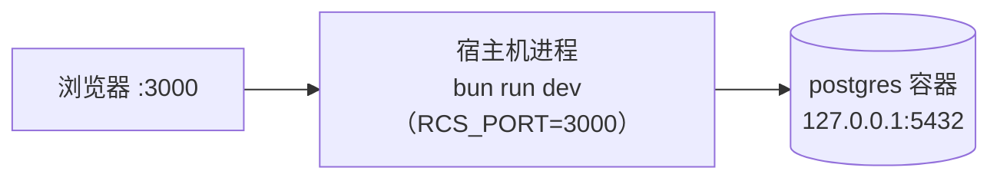
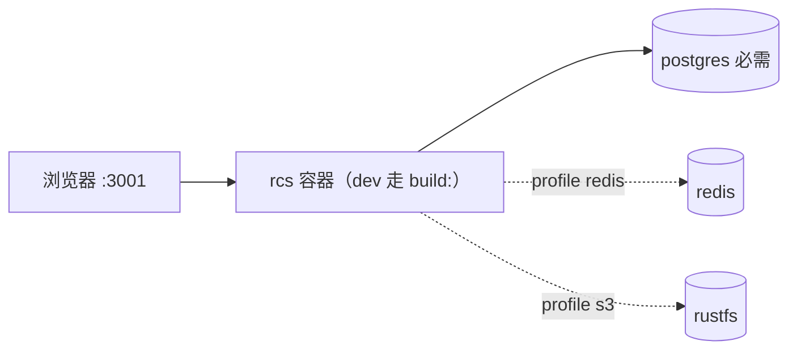
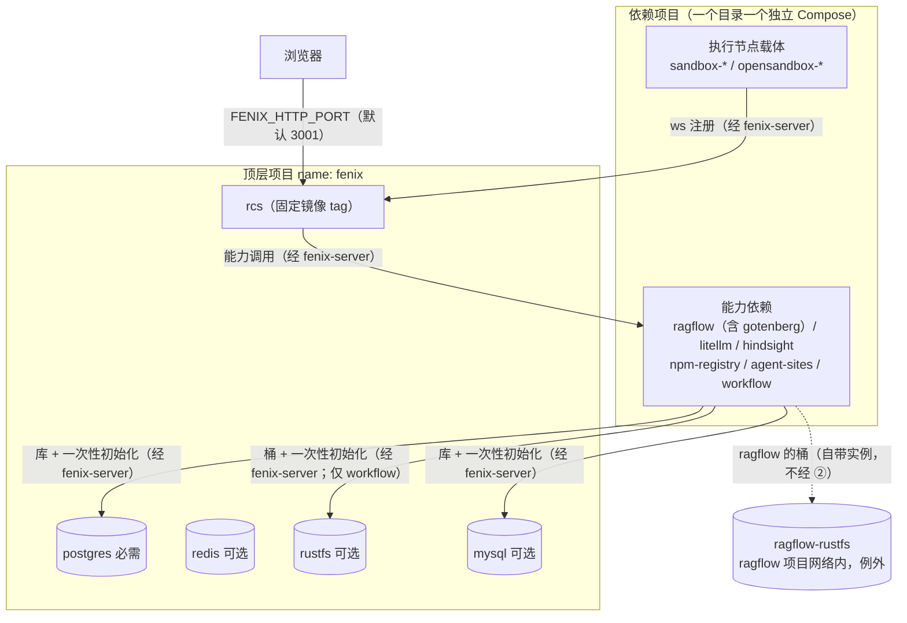
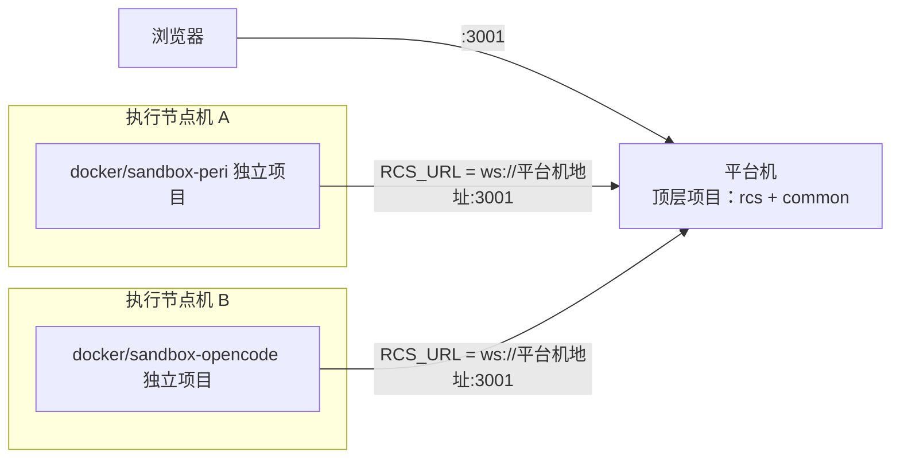
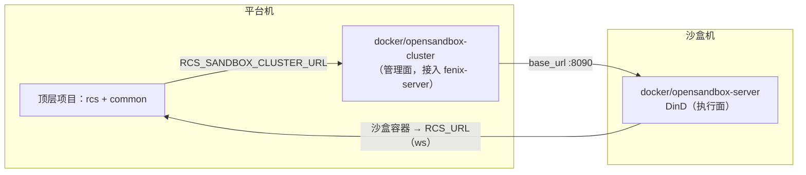

# Docker 部署架构与拓扑（权威）

> 状态：现状基线（2026-10-08）。
> 范围：FenixAgent 的 Docker 部署体系——编排结构（顶层项目 / `docker/common/` / `docker/<name>/` / 交付面）、网络分层、四种部署方式（本地开发 / 生产单机 / 执行节点分离 / OpenSandbox 分离）及各自的容器与网络拓扑、数据落点、配置与发布契约。
> 权威性：本文是部署**结构与拓扑**的权威。脚本用法、逐键配置说明与排障步骤见运维文档：[部署](../operations/deployment.md)、[Docker 编排体系](../operations/docker-topology.md)、[升级](../operations/upgrade.md)；OpenSandbox 集群的数据模型与接口见 [OpenSandbox Cluster 当前架构](./opensandbox-cluster.md)。
> 非目标：应用层运行架构（执行节点模型、ACP 信道、沙盒 Provider、Instance 生命周期）见 [沙盒整体架构](./19-sandbox.md)、[AgentController 编排域架构](./20-orchestration-management.md)；K8s 等平台的原生编排仓库不提供，其他平台以镜像 + `deploy/env/rcs.example` 清单接入。

## 1. 决策摘要

1. **顶层 `docker-compose.yml` 是主服务与基础服务的唯一编排**；每个可选能力 / 执行节点对应 `docker/<name>/` 一个独立 Compose 项目。
2. **dev / prod 共用同一份顶层文件**：dev 走 `build:`，prod 用固定 tag 的 `image:`，差异只由配置表达。
3. **网络两层**：各 Compose 项目的默认网络 + 唯一的共享网络 `fenix-server`；共享网络成员是最小必要集。
4. **基础服务收敛在 `docker/common/`**：PostgreSQL 必需，Redis / RustFS / MySQL 由开关启停；四个服务都是**共享实例**
   （多个栈共用一套，消费方须接入 `fenix-server`；消费方清单见 §2.4 与 §3）。共享实例只提供实例，库 / 账号 / 桶
   由消费方自己的一次性初始化服务创建。
5. **一个开关对应一个目录**：`docker/deploy.env` 的 `FENIX_FEATURE_<NAME>` 决定依赖项目是否启动；未知开关是错误。
6. **一键入口 `./docker/deploy.sh`**：`init` / `validate` / `up` / `deploy` / `down` / `ps` / `logs`，任意机器只需 Docker + bash + 一份配置。
7. **数据一律 bind 挂载在各编排同级的 `./data/`**（不用命名卷）：备份 = 打包交付目录，搬迁 = 整目录拷走。
8. **版本与身份写死在文件里**：镜像 tag 在各 compose 的 `image:` 行，Compose 项目名写死 `name:`，都不做环境变量插值。
9. **发布顺序固定**：DDL 迁移 → 数据迁移 → 应用启动；主服务容器启动命令含 DDL 迁移，数据迁移由发布任务承担。
10. **部署方式的差异只在「哪些目录出现在哪台机器」**：单机 = 全部目录一台机器；分离 = 顶层留平台机，执行节点 / OpenSandbox 目录放独立机器，跨机用宿主可达地址连接。

## 2. 编排结构

### 2.1 三层职责

| 层 | 内容 | 生命周期 |
| --- | --- | --- |
| 顶层项目 | 主服务 `rcs` + 基础服务（`include docker/common/`）；裸 `docker compose up -d` 即最小可用集（rcs + postgres） | 与部署同生共死 |
| 依赖目录 | 可选能力与执行节点（`docker/<name>/`，一个目录一个独立 Compose 项目） | 独立起停、独立升级 |
| 交付面 | `docker/deploy.sh` + `docker/deploy.env` + 上述文件 | 随版本发布 |

### 2.2 仓库布局

```text
仓库根
├── docker-compose.yml          # 顶层项目（dev / prod 共用）
├── .env / .env.example         # 应用配置与密钥
├── data/ workflow/ workspaces/ # 运行期数据（bind 挂载点，不进版本控制）
└── docker/
    ├── common/                 # 基础服务：postgres / redis / rustfs / mysql；运行期数据在 common/data/
    ├── deploy.sh               # 一键入口
    ├── lib/config.sh           # 配置解析、必填项校验、依赖发现（被 deploy.sh source；交付面必须带上）
    ├── deploy.env / .example   # 部署配置（开关与参数；.example 是生成物）
    ├── ragflow/  litellm/  hindsight/  npm-registry/  agent-sites/
    ├── workflow/               # Workflow V2 上游栈
    ├── sandbox-peri/  sandbox-dsh/  sandbox-ccb/  sandbox-opencode/   # 执行节点（引擎沙箱）
    └── opensandbox-cluster/  opensandbox-server/  opensandbox-server-tunnel/
```

### 2.3 顶层项目（`docker-compose.yml`）

```yaml
include:
  - path: docker/common/docker-compose.yml   # 相对本文件解析（Compose ≥ 2.20）
name: fenix   # 固定项目名，不做插值：卷与容器都带项目名前缀
networks:
  fenix-server:
    name: fenix-server      # 主服务层网络（§3），唯一共享网络
services:
  rcs:
    image: ghcr.io/huangpustar/fenixagent:sha-<...>   # 固定版本；发布时更新本行
    build: { context: ., dockerfile: Dockerfile }     # dev 用 --build；prod 只用 image
    networks: [fenix-server]
```

要点：

- `rcs` 的启动命令为 `bun migrate.js && exec bun --no-install run dist/index.js`——DDL 迁移先于应用进程。
- 数据挂载：`./data/peri-home`、`./data`、`./workflow`、`./workspaces`（全部相对顶层文件）。
- 宿主端口：`FENIX_HTTP_PORT`（默认 `3001`）→ 容器 `3000`；`depends_on: postgres: { condition: service_healthy }` 直接可用（同属顶层项目）。
- `include` 是模型复制：common 的服务名（`postgres` / `redis` / `rustfs` / `mysql`）是全局保留名。
- common 的服务不得引用任何依赖目录的文件与路径（顶层 `config` 在任何机器上都要能解析）。

### 2.4 基础服务（`docker/common/`）

| 服务 | 必需性 | 缺失后果 | 开关 |
| --- | --- | --- | --- |
| `postgres` | 必需 | `DATABASE_URL` 必填无默认值，缺失即启动失败 | 恒启动 |
| `redis` | 可选 | 缓存回退进程内 Map；Y.Doc 快照不做持久化 | `FENIX_FEATURE_REDIS` |
| `rustfs` | 可选 | 消费方（`docker/workflow/`）的一次性初始化服务失败、对应栈起不来。`docker/ragflow/` 的自带实例 `ragflow-rustfs` 不属于本行——它随该目录启停、不受此开关影响（见 §2.4 与 [编排体系](../operations/docker-topology.md) §5） | `FENIX_FEATURE_S3` |
| `mysql` | 可选 | 消费方（`docker/workflow/`、`docker/ragflow/`）的初始化服务失败、对应栈起不来 | `FENIX_FEATURE_MYSQL` |

四者都接入 `fenix-server`，也都是**共享实例**（服务名是 `fenix-server` 上的跨项目 DNS 名，属全局保留名）；
`redis` / `rustfs` 默认不发布宿主端口，`postgres` / `mysql` 的宿主端口分别由 `POSTGRES_PORT` / `MYSQL_HOST_PORT`
控制（只绑回环，供本地源码开发与运维排查）。数据 bind 到 `docker/common/data/**`。消费方清单：`postgres` 只被
`rcs` 使用（另有 `docker/litellm/` 的库 `litellm`）、`redis` 只被 `rcs` 使用、`rustfs` 只被 `docker/workflow/` 使用
（`docker/ragflow/` 的桶在它**自带**的实例 `ragflow-rustfs` 里）、`mysql` 被 `docker/workflow/` 与 `docker/ragflow/` 使用
（逐项对照表与数据落点见 [Docker 编排体系](../operations/docker-topology.md) §5.1）。

**共享实例的初始化归消费方**（2026-10-08 起，MySQL 从 `docker/workflow/` 上移、LiteLLM / RAGFlow / Workflow 的
辅助服务随之收敛过来）：common 只提供实例与账号，不含任何业务 schema / 桶初始化，库、账号、桶由消费方自己的
**一次性初始化服务**创建（`litellm-db-init`、`ragflow-mysql-init` + `ragflow-s3-init`、`mysql-init` + `s3-init`）。
因此这些依赖目录都**不自足**：它们依赖顶层项目先起，消费方容器要接入 `fenix-server` 才能按名访问共享实例。
已知代价：消费方同时挂在两个网络上，与栈内同名服务会解析歧义（`docker/workflow/` 的 `redis`；RAGFlow 的栈内
Valkey 已改名 `ragflow-redis` 做保留名避让），判定与处理见 `docker/workflow/README.md` §9、
[Docker 编排体系](../operations/docker-topology.md) §3 规则 7。

两处**刻意没有收敛**：缓存（共享 `redis` 只服务 `rcs`；RAGFlow 的栈内实例因共享实例无鉴权、淘汰策略按消费方
不可配、键空间冲突而改名保留，证据见 `docker/ragflow/README.md`）与 **Elasticsearch**（仍是 `docker/workflow/`
的栈内服务，是需求方的明确裁定，不是遗漏——数据落点、健康检查与上游插件 / 索引模板都在该目录）。

### 2.5 依赖目录契约（`docker/<name>/`）

每个依赖目录必须满足（逐条细则与自检清单见 [Docker 编排体系](../operations/docker-topology.md) §6）：

1. `docker-compose.yml` 是唯一入口，目录自包含；以**独立项目**方式启动，不与顶层 `-f` 叠加。
2. 网络按 §3 分层：需要与主服务互通的服务接入 `fenix-server`（`external: true`），服务名全局唯一；栈内辅助服务（数据库、缓存、对象存储等）不声明 `networks`。
3. 宿主端口只绑回环或不发布；面向外部用户的入口（如 `agent-sites` 站点端口）才绑 `0.0.0.0` 且可用环境变量覆盖。
4. 数据 bind 到本目录同级的 `./data/`；禁止命名卷。
5. 自带 README（用途、配置、网络接入清单、验证命令）与 `.env.example`（必需 → 可调 → 默认三段式）。

## 3. 网络分层

两层网络，职责不重叠：

| 层 | 网络 | 成员 | 可见性 |
| --- | --- | --- | --- |
| ① 项目内层 | 各 Compose 项目的默认网络 | 项目声明的全部服务 | 仅同项目内互相可见 |
| ② 主服务层 | `fenix-server`（顶层项目创建） | `rcs`、common 的基础服务、各依赖中需要与主服务互通的服务 | 网络内全部容器互相可见（跨项目） |

成员判定标准唯一：**这个服务是否需要与主服务（或需要访问主服务的执行节点）直接通信。**

- 必须接入 ②：`rcs`；common 的全部基础服务（`postgres` / `redis` / `rustfs` / `mysql`）；依赖的对外出口服务（RAGFlow API 与同栈的 `gotenberg`、`litellm`、`hindsight`、`npm-registry`、`agent-sites`、Workflow 的 `coze-web` 与共享实例消费方 `coze-server` / `milvus`、各栈的一次性初始化服务 `mysql-init` / `s3-init` / `ragflow-mysql-init` / `litellm-db-init`（`ragflow-s3-init` 不在其中——它只访问同项目的自带实例）、sandbox / opensandbox 的管理面与节点）。
- 不得接入 ②：依赖栈内部的辅助服务（数据库、缓存、对象存储、消息队列、搜索引擎、向量库等，如 RAGFlow 的 `ragflow-redis` / `infinity` / 自带的 `ragflow-rustfs`、Workflow 的 `redis` / `elasticsearch` / `etcd` / `milvus`）——它们只在 ① 内被本项目的出口服务访问；**common 提供的共享实例是例外**（跨项目按名访问只能经 ②）。
- 同时挂在 ① 与 ② 上的容器，遇到同名服务时 Docker DNS 没有优先级约定（§2.4 的已知代价）；因此共享实例的服务名是全局保留名，依赖栈不应再占用（RAGFlow 的栈内 Valkey 与自带对象存储已改名 `ragflow-redis` / `ragflow-rustfs`；workflow 的 `redis` 未改，只在两个开关同时打开时有歧义）。
- 依赖项目里只有显式声明 `networks`（`external: true`）的服务进入 ②；接入 ② 的服务名是跨项目 DNS 名，必须全局唯一。
- ② 由顶层项目定义并创建，依赖只引用——**依赖启动前顶层必须已启动**（顺序不变量）。
- 跨机通信不走 `fenix-server`（该网络只在单机 Docker 内成立），走宿主可达地址（`RCS_URL`、`RCS_SANDBOX_CLUSTER_URL`、`FRP_PUBLIC_ADDRESS`）。

## 4. 部署方式与拓扑

四种方式共用同一套编排文件与配置契约，差异只在「哪些目录出现在哪台机器」与「跨机地址怎么填」。

### 4.1 本地开发

#### 4.1.1 源码运行

只有数据库用 Docker，后端在宿主机跑源码。



```bash
docker compose up -d postgres     # 仅数据库
bun install
bun run db:migrate                # DDL 迁移
bash restart-server.sh            # 停旧进程 → build:web → bun run dev
```

后端挂载 `apps/web/dist/`，页面看到改动必须 `bun run build:web`；前端单独热更新用 `bun run dev:web`。

#### 4.1.2 容器全栈



`docker compose up -d --build` 即最小可用集（rcs + postgres）；`--profile redis` / `--profile s3` 附加可选基础服务。与生产单机共用同一份顶层编排。

### 4.2 生产单机

全部目录在同一台机器：顶层项目（主服务 + 基础服务）+ 按 feature 开关启动的依赖项目。



```bash
./docker/deploy.sh init        # 生成 docker/deploy.env 与各依赖 .env（已存在则跳过，绝不覆盖）
./docker/deploy.sh validate    # 按提示补齐必填项，直到这一步通过
./docker/deploy.sh deploy      # 拉镜像 → DDL 迁移 → 数据迁移 → 启动
```

最小交付面（目标机**无需源码与 bun**）：`docker-compose.yml`、`docker/deploy.sh`、`docker/lib/`、`docker/deploy.env`、`docker/common/`、启用的依赖目录与根 `.env`。

### 4.3 生产 · 执行节点分离

平台机只放顶层项目；`docker/sandbox-*` 以独立交付目录部署在一台或多台执行节点机上，容器内 runtime 主动出网连主服务（`RCS_URL`）。



- 节点机填 `RCS_URL`（平台机可达地址）、`RCS_SECRET`（与主服务 `REGISTRY_SECRET` 同值）、`RCS_MACHINE_ID`（控制台预创建或自动创建）三项即可 `docker compose up -d`。
- 节点容器不发布宿主端口，只出网，无需为节点开放入站端口；跨机时不依赖 `fenix-server`。
- 节点机的 `./data/` 与工作区是该机器自己的数据落点，随该机交付目录备份/搬迁。

### 4.4 生产 · OpenSandbox 分离

把沙盒的创建、调度与销毁交给独立的 OpenSandbox 沙盒机：管理面（Cluster）与执行面（Server）可以都在沙盒机，也可以把 Cluster 留在平台机。业务沙盒容器仍通过 `RCS_URL` 回连主服务。



三种部署变体：

| 变体 | 编排 | 适用条件 |
| --- | --- | --- |
| direct | Cluster 在平台机（`docker/opensandbox-cluster/`），Server 在沙盒机（`docker/opensandbox-server/`） | Cluster 能访问 Server 的 `base_url`（沙盒机开放管理端口与沙盒端口段） |
| tunnel | Server 换用 `docker/opensandbox-server-tunnel/`（frpc 主动连 Cluster 侧 frps 的 `FRP_BIND_PORT`） | 沙盒机无法提供入站端口；该目录不接入 `fenix-server` |
| 三合一 | 沙盒机用 `docker/opensandbox-cluster/deploy/`（Cluster + frps + Server 同机，自建 `opensandbox` 网络） | 不跑平台的独立沙盒机、离线交付；平台只配 `RCS_SANDBOX_CLUSTER_URL` 指向该机 |

同机部署（作为单机形态的扩展）也支持：`FENIX_FEATURE_OPENSANDBOX_CLUSTER/SERVER` 开关随主服务一键启动，`RCS_SANDBOX_CLUSTER_URL=http://opensandbox-cluster:8080` 经 `fenix-server` 调用。

## 5. 配置与环境文件

| 文件 | 内容 | 说明 |
| --- | --- | --- |
| 根 `.env` | 应用配置与密钥（含共享键） | `deploy/env/rcs.example` 是清单真相来源；`.env` 不进版本控制 |
| `docker/deploy.env` | 依赖开关（`FENIX_FEATURE_*`，含 common 的 `REDIS` / `S3` / `MYSQL`）与部署参数（`FENIX_HTTP_PORT` / `POSTGRES_PORT` / `MYSQL_HOST_PORT`） | 模板 `deploy.env.example` 是生成物 |
| `docker/<name>/.env` | 依赖私有键 | 各目录自带 `.env.example`，三段式排序 |

规则：

- 密钥只进 `.env`：不进 `deploy.env`、不进 compose 文件、不进 git。
- 必填项的真相只在 compose 的 `${VAR:?}`；`up` / `deploy` 在动任何容器前先过这道校验；`init` 只创建缺失文件，绝不覆盖已有 `.env`。
- 两层开关不得混淆：应用装配 profile（`deploy/assembly/<profile>.json`，`RCS_ASSEMBLY_PROFILE_PATH` 覆盖）决定启动期**加载哪些模块**；部署 feature 开关决定**启动哪些依赖服务**。两者按能力名对齐但不做自动映射。

## 6. 数据落点与交付面

- 数据落点 = 各编排文件同级的 `./data/`：顶层 `data/`、`workflow/`、`workspaces/`；基础服务 `docker/common/data/**`
  （`postgres` 里另有网关库 `litellm`，`mysql` 里另有 workflow 的 `opencoze` 与 ragflow 的 `rag_flow`，`rustfs` 里是
  workflow 的桶；RAGFlow 的桶在它自带的 `docker/ragflow/data/rustfs`；都随交付面一起备份与搬迁）；依赖与节点各自目录的 `./data/`。全部 bind 挂载。
- 交付面 = `docker-compose.yml` + `docker/deploy.sh` + `docker/lib/` + `docker/deploy.env` + `docker/common/` + 启用的依赖目录 + 根 `.env`；运行期数据就在这份目录里。
- 备份 = 打包交付目录（跳过容器与镜像）；搬迁 = 整目录拷走；`data/`、`workspaces/` 等必须进 `.gitignore`。

## 7. 发布与升级

- 主服务升级：更新顶层 `rcs` 的 `image:` 行为目标 tag（进版本控制、经评审合入）→ 交付该文件 → `./docker/deploy.sh deploy`。应急时可直接改目标机文件，事后必须把同一 tag 回写仓库。
- 依赖升级独立于主服务：改对应目录的镜像 tag 后单独 `up -d`；主服务重启不会顺带升级依赖。
- 消费共享实例的依赖（`ragflow` / `workflow` / `litellm`）升级时，栈内的一次性初始化服务会先跑一遍（幂等，
  只同步口令、不动已有数据）；验收看它的 `Exited (0)` 与日志末行的完成行——它失败时该栈的主服务不会启动。
- 发布顺序：DDL 迁移 → 数据迁移 → 应用启动，任何路径不得颠倒；数据迁移不写进容器启动命令。

## 8. 部署不变量

1. 顶层是主服务与基础服务的唯一归属；依赖目录不得再定义 `postgres` / `redis` / `rustfs` / `mysql`
   （**已知例外**：`docker/ragflow/` 自带的 `ragflow-rustfs`——用户裁定，理由与边界见 [编排体系](../operations/docker-topology.md) §5）。
2. 网络只有两层；共享网络名唯一 `fenix-server`；接入它的服务名全局唯一（共享实例是「辅助服务不进 ②」的例外）；依赖启动前顶层必须已启动。
3. 依赖目录以独立项目启动，禁止与顶层 `-f` 叠加。
4. feature 开关与依赖目录一一对应，未知开关报错。
5. 发布顺序 DDL → 数据 → 应用，不得颠倒；数据迁移不进容器启动命令。
6. 密钥只进 `.env`。
7. 镜像 tag 与 Compose 项目名写死在文件里，不做环境变量插值，不用 `latest`。
8. 数据一律 bind 挂载在交付目录内，禁止命名卷与匿名卷。
9. Compose ≥ 2.20；include 与独立启动文件的相对路径均相对其自身目录解析。
10. 每个依赖目录必须有 README 与 `.env.example`；新增依赖 = 新目录 + 开关登记。

## 9. 相关文档

| 文档 | 关系 |
| --- | --- |
| [Docker 编排体系](../operations/docker-topology.md) | 编排实现细则：目录契约自检、`deploy.env` 键表、env 规范、`docker/deploy.sh` 命令、发布与升级、旧体系退役记录 |
| [部署](../operations/deployment.md) | 依赖服务、环境文件来源、启动顺序与启动后自检（操作步骤） |
| [升级](../operations/upgrade.md) / [迁移](../operations/migration.md) | 镜像与代码升级、DDL 与数据迁移的先后关系与失败判定 |
| [备份与恢复](../operations/backup-and-restore.md) | 备份对象与恢复顺序 |
| [OpenSandbox Cluster 当前架构](./opensandbox-cluster.md) | 集群数据模型、接口、代理与错误一致性 |
| [沙盒整体架构](./19-sandbox.md) / [AgentController 编排域架构](./20-orchestration-management.md) | 应用层运行架构：执行节点模型、Provider 抽象、Instance 生命周期 |
