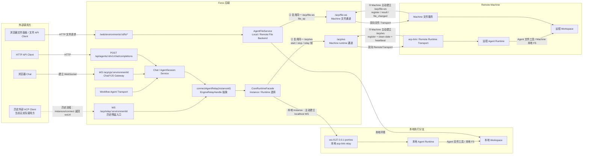
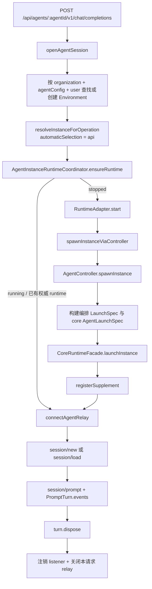
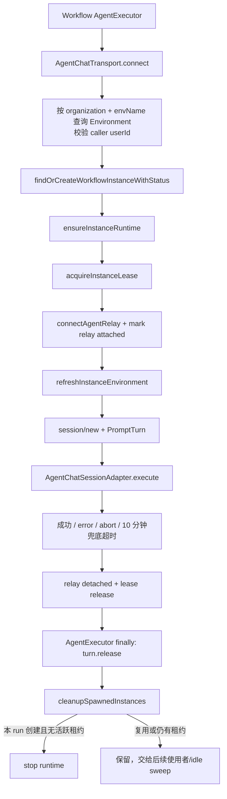
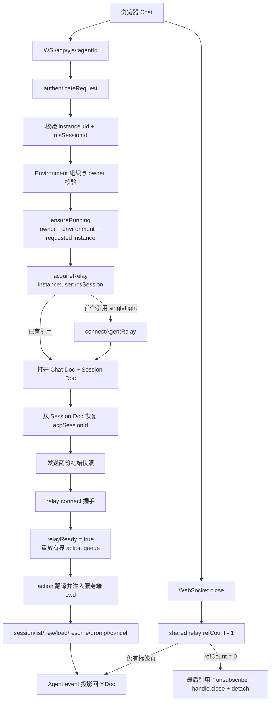
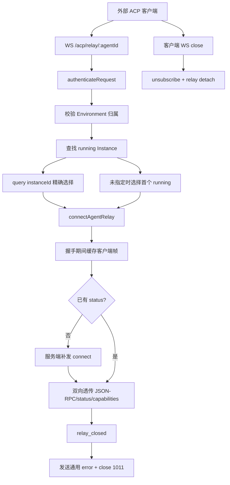
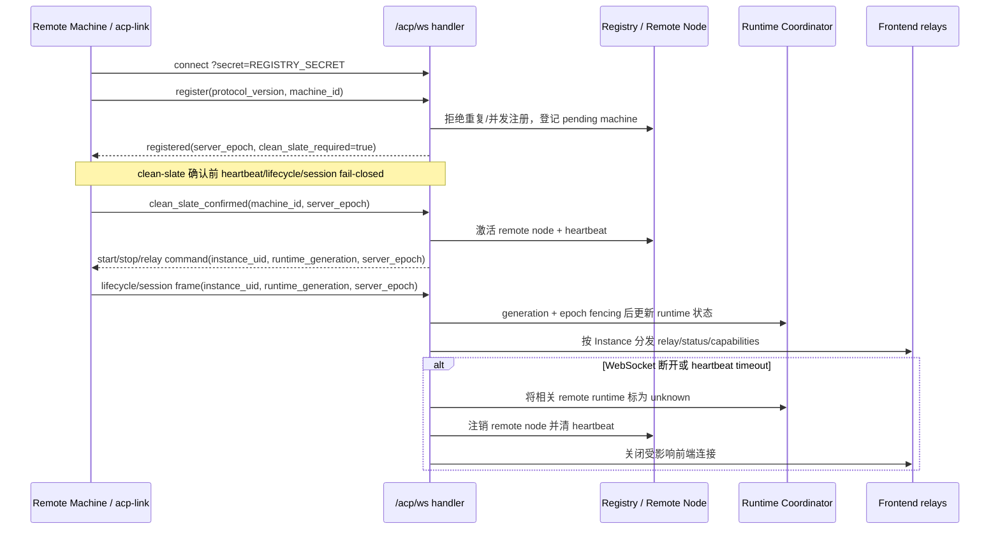

# Agent Runtime 提取地图（AGT-00）

> 盘点基线：2026-09-10，代码 revision `66f2077a`。本文只冻结当前行为与提取边界，
> 不代表 ARC-03 已批准最终 package API。

## 结论

当前 Agent 运行链路不是“每次请求或 WebSocket 创建独立实例”。HTTP、Workflow 分别通过
`(environmentId, ownerUserId, creationSource, name)` 选择持久 `api/primary` 与
`workflow/primary` Agent Instance；浏览器 Chat 通常连接显式指定且重新校验归属的持久
Instance，未指定时才自动选择 `chat/default`。三者都由 `AgentInstanceRuntimeCoordinator`
确保 runtime 存在，请求、Workflow 节点和浏览器连接只拥有各自的协议会话资源。

盘点时发现 `AGENTS.md` 中仍写着“`openAgentSession` 每次创建独立实例并在 dispose 时销毁”；
本次已同步修正该总览。AGT-01 应以本文和特征测试冻结的现状为准。

WebSocket 不是单一路径：浏览器交互式 Chat 使用 `/acp/yjs/:agentId`，远端 Machine 使用
`/acp/ws` 承载 runtime lifecycle 与 relay 帧。`/acp/relay/:agentId` 是已确认无实际调用方的历史
残留入口，不作为当前运行主链路或 AGT 提取目标。
`/acp/file-ws` 只承载远程文件操作，不属于 Agent runtime/relay 生命周期，本次仅记录为同级入口，
不纳入提取候选接口。

运行职责目前分散在宿主 `src/services/`、`src/transport/`、`packages/chat-channel`、
`packages/orchestration`、`packages/remote-runtime` 和 core/plugin SDK 之间；
`launch-spec-builder.ts` 同时读取 AgentConfig、模型、Skill、MCP、知识库、记忆与环境密钥，
是提取时最主要的资源反向依赖风险。

目标方案已确定：先将 Environment、Instance、Runtime、relay、ACP session、Chat 与 YJS 作为一个
高耦合整体迁入单一 `@fenix/agent` 包，不为追求分包改写在线逻辑。AgentConfig 仍是对外资源和权限
边界；Environment 降为包内运行上下文，不再作为长期对外资源。认证、资源授权和 HTTP/WS 响应映射
留在宿主 routes/resource facade，包内只维护租户隔离、实体一致性和运行生命周期不变量。

## WebSocket 入口总览

| 入口 | 调用方与认证 | 是否启动 runtime | 协议职责 | 连接释放 |
| --- | --- | --- | --- | --- |
| `/acp/ws` | Machine；query `secret` 必须匹配 `REGISTRY_SECRET` | 不直接启动 Agent；注册/激活远端节点并承载 start/stop/relay 帧 | Machine 注册、clean-slate、heartbeat、fencing、远程 lifecycle/session 分发 | 断连清 Machine/remote node/core 快照关联、关闭受影响前端连接 |
| `/acp/yjs/:agentId` | 浏览器；better-auth session / Environment Secret / API Key，随后校验确定性 locator、组织与 owner | `ensureRunning(owner, environment, instanceUid)` | YJS Chat/Session Doc、ACP action 翻译、session 恢复、多标签页共享 relay | 单标签页仅减引用；最后引用关闭 handle/listener，保留 runtime 与热 Doc |
| `/acp/relay/:agentId` | **历史残留，当前无实际调用方**；旧外部 ACP Client | 否 | 旧 ACP/JSON-RPC 薄转发；不纳入 AGT 活跃链路提取 | 待与 `instances/connect` 返回契约一起评估删除；当前还存在 handle 未关闭缺口 |
| `/acp/file-ws` | Machine；`REGISTRY_SECRET` | 否 | 远程文件 NDJSON/二进制帧 | file transport 独立释放，非 AGT-00 runtime 范围 |

## 外部入口到 Agent Runtime 与 Workspace 的端到端连接图



图中存在两条并行链路，不能串成一条：

1. **Agent 会话/控制链路**：当前活跃入口 `/acp/yjs`、HTTP 与 Workflow 最终调用
   `connectAgentRelay()`。本地 Instance 连接 localhost acp-link；远程 Instance 将 `relay` 帧复用在
   Machine 主动建立的 `/acp/ws` 上，最终到达 Agent Runtime。图中虚线 `/acp/relay` 是无调用方的
   历史流程，仅用于解释残留代码，不代表现行架构。
2. **文件 API 链路**：`/web/environments/:id/fs/*` 进入 `AgentFileService`。本地环境直接操作本地
   workspace；远程环境将 `file_op` 复用在 Machine 主动建立的 `/acp/file-ws` 上，由 Machine 文件
   服务操作远程 workspace。

两条链路只在执行侧共享同一 Remote Machine/workspace。Agent Runtime 自己执行 ACP 文件工具时，
在 Machine 内直接访问 workspace，不绕回 Fenix 的 `/acp/file-ws`；因此 file-ws 断开只影响 Fenix
文件 API，不应被解释为 Agent relay 或 Agent 文件工具同时断开。

## 标识与所有权

| 标识/对象 | 当前格式或选择键 | 创建者 | 生命周期所有者 |
| --- | --- | --- | --- |
| 持久 Instance uid | `inst_` + 32 位小写十六进制 | `createAgentInstanceUid()` / `agent_instance` repository | `AgentInstanceService` |
| HTTP 自动实例 | `environment + owner + api + primary` | `resolveInstanceForOperation(..., "api")` | Coordinator；请求不拥有 runtime |
| Workflow 自动实例 | `environment + owner + workflow + primary` | `findOrCreateWorkflowInstanceWithStatus()` | Coordinator；创建它的 run 可在结束时尝试 stop runtime |
| Chat 默认实例 | `environment + owner + user + default`；正常 YJS 入口显式携带 `instanceUid` | `resolveInstanceForOperation(..., "chat")` | Coordinator；WebSocket 不拥有 runtime |
| 编排 `Instance.instanceId` | 直接复用持久 Instance uid | `AgentController.spawnInstance(..., instanceUid)` | `AgentController` 活跃表 |
| core instance id | 同一个持久 Instance uid | `CoreRuntimeFacade.launchInstance()` | core runtime facade |
| ACP session id | Agent 返回的 `ses_*`；无响应时本地生成 `ses_*` fallback | `session/new` / `session/load` | 单次 `PromptTurn` |
| JSON-RPC request id | 进程内随机偏移后单调递增 | `nextRpcId()` | 单次握手或 turn |
| relay handle | `(instanceId, sessionId)` 连接参数 | `connectAgentRelay()` | HTTP 请求或 Workflow 节点；不是 runtime 所有者 |
| RCS session id | `createDeterministicRcsSessionId(environmentId, userId, instanceUid)` | 服务端/前端 locator | YJS Doc 与 shared relay 隔离键 |
| Y.Doc name | `chat:{rcsSessionId}` / `session:{rcsSessionId}` | Chat `DocManager` | 同一 RCS session 的实时投影 |
| runtime generation | 每个 Instance uid 的进程内递增整数 | `AgentInstanceRuntimeCoordinator` | Coordinator，用于 fencing 迟到事件/stop |

`api/primary`、`workflow/primary` 与 `chat/default` 的 `creationSource/name` 不同，因此同一
环境、同一用户下也不会共享自动选择记录。YJS 正常入口会传 `instanceUid`，服务端仍按
`ownerUserId` 重新查询，不信任浏览器 locator。多用户和多租户隔离首先由环境查询、确定性
RCS session id 与 Instance ownership 保证，runtime 不得自行放宽该边界。

## HTTP 单轮调用实际链路



关键特征：

- `ensureRuntime` 对同一 uid 是 singleflight；本地状态丢失但 controller/core 仍有权威实例时，
  直接接管而不重复 launch。
- `openAgentSession` 每次都重新连接 relay 并创建或加载 ACP session，但两次调用可返回同一
  `api/primary` Instance uid。
- `turn.dispose()` 只释放 turn listener 和本请求 relay。当前 `createAgentSession` 未传
  `stopInstance`，因此正常完成、session 创建失败、HTTP 超时和客户端断流均不停止持久 runtime。
- 流式请求以 300 秒 `AbortController` 终止响应消费；非流式请求以 300 秒 `Promise.race`
  返回 504。两者都没有发送 ACP `session/cancel`，Agent 侧当前回合可能继续运行。这是当前行为，
  不是建议的目标语义。

## Workflow 实际链路



关键特征：

- Workflow 使用独立的 `workflow/primary` 持久记录；并发或后续 run 复用该记录和已运行 runtime。
- 每次 `connect()` 建立自己的 relay handle 和 ACP session。底层可能 fan-out 同一实例消息，
  `PromptTurn` 必须按 ACP session id 与 JSON-RPC turn id 过滤，避免并发 run 串流。
- 选择实例后同一 tick 获取进程内 lease；`execute` 的成功、事件错误、abort、兜底超时都归还
  lease 与 relay 计数。`AgentExecutor.finally` 只调用 `turn.release()`，不关闭共享 runtime。
- 仅当持久 Workflow 记录由本 run 首次创建时，id 才加入 `spawnedInstanceIds`。run 结束后 cleanup
  尝试停止该 runtime；仍有其他 lease 时跳过。被复用的记录不属于本 run，交给空闲回收。
- DAG/节点取消通过 `AbortSignal` 使本地 `execute()` reject；当前同样不发送 ACP
  `session/cancel`。10 分钟 transport 兜底超时映射为 `WorkflowErrorCode.NODE_TIMEOUT`，不重试。

## 浏览器交互式 Chat（`/acp/yjs/:agentId`）实际链路



关键特征：

- 路由要求 `instanceUid` 与 `rcsSessionId`，并验证后者等于
  `createDeterministicRcsSessionId(environmentId, userId, instanceUid)`；Environment 必须属于当前
  组织且 owner 是当前用户。Gateway 在宿主边界再次校验 owner，`ensureRunning` 再按 owner 查询
  requested Instance，形成纵深隔离。
- shared relay 以 `instanceId:userId:rcsSessionId` 隔离。同一会话并发首开由 singleflight 合并，
  多标签页增加引用计数；单个标签页关闭不会影响其他连接，也不会停止持久 runtime。
- `relayReady = true` 前必须先打开 Chat/Session Doc、恢复 `chatMeta.activeSessionId` 对应的
  ACP session、完成两份初始快照并发送 relay `connect`。期间到达的文本 action 进入有界队列，
  ready 后按原顺序重放。
- `session/list`、`session/new`、`session/load`、`session/resume` 的 `cwd` 由服务端 translator 注入；
  Agent status 到达前不发送 `list_sessions`。同一 ACP session 的 load 跳过 Agent 全量回放，避免
  与已有 Y.Doc 消息重复。
- Chat 的 cancel 会实际转发 ACP `session/cancel`，并等待 Agent 事件收敛终态。这与 HTTP、Workflow
  当前仅停止本地等待不同，提取时不能把三条入口统一成错误的取消语义。
- 广播遇到 `bufferedAmount > 64 KB` 时把单连接标为 lagging；缓冲恢复后向该连接发送全量快照，
  持续拥塞 30 秒则 close(1013)。连接上限默认 200，pending 与 active 一并计数。
- 最后一个标签页断开后关闭 shared relay listener/handle 并 detach idle 计数，但保留 runtime 与热
  Y.Doc；relay loss、Instance stop 或 Machine 断连才回收实例相关实时资源。

## 历史残留：外部 ACP Relay（`/acp/relay/:agentId`）

> 状态：已确认当前无实际调用方，不属于现行 Agent 运行主链路，也不纳入 AGT package 提取目标。
> `POST /api/agents/:agentId/instances/connect` 仍会返回该端点的 `wsUrl`，属于同一组待清理残留契约。



以下内容只盘点残留实现的现有行为，不表示仍有生产消费者。该入口是薄传输适配器，不创建、不
ensure 也不停止 Instance；只允许连接目标 Environment 下已处于 running 的持久 Instance。客户端
`connect` 帧会被丢弃；服务端在未观察到 status 时补发一次 `connect`，随后原样透传
status/capabilities 与两种兼容 JSON-RPC 包装。

盘点还发现 `handleExternalRelayClose()` 注销 listener 并执行 relay detach，但没有调用
`relayHandle.close()`。鉴于通道已无调用方，AGT-00 只记录该缺口，不应为了修复它而把残留实现
迁入新 `@fenix/agent` 包；优先评估连同 route、`instances/connect` 返回字段和相关测试整体删除。

## Machine Runtime 通道（`/acp/ws`）实际链路



- Machine query secret 只接受 `REGISTRY_SECRET`；普通请求认证、Environment Secret 与 API Key 均
  不能替代它。注册要求受支持的协议版本和 `machine_id`，重复或并发注册直接拒绝。
- `server_epoch` 用于隔离服务重启前的旧 Machine 状态，`runtime_generation` 用于隔离同一持久
  Instance 的迟到 lifecycle/session 帧。远端事件必须同时通过 uid、generation 与 epoch fencing。
- `/acp/ws` 是 runtime starter 的远程 transport adapter：它承载远程 start/stop/relay 帧和状态
  回传，但不负责 AgentConfig 授权、持久 Instance 选择或 YJS 协议投影。
- 断连与 heartbeat timeout 不假装 Agent 已正常停止，而是将协调器状态标为 unknown、注销节点并
  关闭受影响的前端连接，等待后续 ensure/重连重新建立权威状态。

## 启动、停止与失败释放

### 启动数据流

1. `AgentInstanceService` 解析或创建持久 Instance 记录。
2. Coordinator 为 uid 分配 `runtimeGeneration`，合并并发 ensure，并用 AbortSignal 隔离 waiter
   取消与共享启动。
3. `spawnInstanceViaController` 同步预留全局、用户和 scheduled 并发额度。
4. `AgentController` 校验 Environment，构建编排域 `LaunchSpec`，解析 machine/node，并以持久 uid
   创建内存 `Instance`。
5. 宿主桥接层再次构建 core `AgentLaunchSpec`，调用 core 启动进程，随后注册 RCS supplement。
6. 无论成功失败，spawn reservation 都在 `finally` 释放；成功后正式 core/supplement 统计接管。

步骤 4 与 5 当前存在两次 LaunchSpec 构建：编排域规格用于 Environment/node/工作区聚合，core
规格包含模型密钥、Skill URL、MCP、知识库与动态环境变量。AGT-01 不应把这份重复构建原样搬进
新 `@fenix/agent` 包之外形成第二套实现；提取阶段先保持现有调用顺序，是否合并必须另行审核。

### 失败与停止矩阵

| 场景 | 当前结果 | 必须释放/保留的资源 |
| --- | --- | --- |
| 并发检查失败 | 启动前抛 429 | 不创建 reservation 或实例 |
| controller spawn 失败 | ensure 失败，Coordinator 回到 `stopped` | reservation |
| core launch 失败 | 原错误上抛 | controller 活跃表、node ref、core 幂等 stop、supplement、reservation |
| supplement 注册失败 | 原错误上抛 | 与 core launch 失败相同的三侧回滚 |
| HTTP relay 连接失败 | 请求失败 | 保留持久 runtime；无 handle 可关 |
| HTTP session/new 失败 | 请求失败 | 关闭本请求 relay；保留持久 runtime |
| Workflow relay 连接失败 | 节点失败 | 归还 lease；未 attach relay count |
| Workflow session/new 失败 | 节点失败 | relay count detach、lease release；runtime 交给 cleanup/idle |
| Workflow execute error/abort/timeout | 节点失败或取消 | relay count detach、lease release、turn listener release |
| YJS 鉴权/locator/owner 校验失败 | 关闭 4003/4004 或公开错误 | pending client slot；不得触达 runtime |
| YJS ensure/relay/Doc/握手失败 | 关闭 1011/4500/4502 | pending/active client、已获取的 shared relay 引用；保留持久 runtime |
| YJS 单标签页断开 | 其余标签页继续 | keepalive、client；shared relay 仅减引用 |
| YJS 最后标签页断开 | 关闭共享 relay | listener、handle、relay count；保留 runtime 与热 Doc |
| YJS 慢消费者 | 跳帧并追赶；持续 30 秒 close 1013 | 仅隔离该连接，不阻塞同 Doc 其他连接 |
| 外部 relay 客户端断开 | 注销中继 | listener、relay count；当前 handle 未显式 close（已记录缺口） |
| 外部 Agent relay 断开 | 通用 error 后 close 1011 | listener、relay count；不替客户端启动替代实例 |
| Machine 断连/心跳超时 | runtime 标为 unknown | remote node、heartbeat、受影响前端连接；不伪造 stopped |
| 显式 stop | best-effort 或 strict | controller 实例/node ref、core 进程、supplement、YJS client 与 Doc |
| 重复 stop/dispose | 幂等 | `INSTANCE_NOT_FOUND` 不作为失败；strict 仅聚合真实 stop 失败 |
| relay 意外关闭 | 本地实例触发 fire-and-forget 死亡清理 | 当前本地实例；不影响同节点其他实例 |

停止的权威 funnel 是 `stopInstanceViaController()`。顺序为 controller stop、core stop、
supplement unregister、关闭实例关联的 YJS client、回收 Y.Doc。YJS 清理失败只记录诊断，strict
模式仅聚合 controller/core 的非 `INSTANCE_NOT_FOUND` 失败。

## 目标抽取方案

### 包与权限边界

| 归属 | 内容 | 约束 |
| --- | --- | --- |
| `@fenix/agent` | Environment、Instance、Runtime、relay、ACP session、Chat、YJS、持久化 repository 与生命周期协调 | 先整体迁移并保留现有模块结构；不读取 cookie、API Key、成员关系或 `AuthContext`，不决定 AgentConfig 是否可读 |
| AgentConfig 资源层 | Agent 配置及模型、Skill、MCP、知识库、记忆等资源授权与解析 | 继续由宿主提供；只向 agent facade 传已解析输入或通过受控 port 提供能力 |
| routes/resource facade | HTTP/WS 认证、AgentConfig 访问判断、参数/schema、错误与关闭码映射 | 允许人工审核后调整，是本次入口迁移与 package 装配位置 |
| Machine/file transport | `/acp/ws` runtime/relay 与 `/acp/file-ws` 文件传输 | 保持现有注册方向、fencing 和文件通道独立性；认证留在宿主入口 |

包内仍使用 `organizationId`、`userId`、`environmentId` 做 workspace、Doc、Instance 与租户隔离；这些是
运行数据，不是权限策略。`organizationId` 对 agent 包是不透明隔离值，由上层将当前 `scopeId`
映射后传入；包内不解释其 Organization 语义。Environment 可以作为包内实体继续存在，迁移阶段
不改表结构、字段名和 ID 生成。

### Machine 入口归属

`/acp/ws` 与 `/acp/file-ws` 均由 **Machine 资源模块**暴露；`apps/server` 只装配 route
contribution。保留现有 URL，避免同时修改 Machine 客户端。

```text
Machine Resource Routes
├── WS /acp/ws
│     → Machine Facade
│     → AgentMachineTransportPort
│     → @fenix/agent runtime/control/relay
│
└── WS /acp/file-ws
      → Machine File Facade
      → RemoteFileTransportPort
      → Workspace/File 模块
```

Machine 资源层负责路径、schema、Machine 认证、upgrade、帧限制及连接生命周期；
`@fenix/agent` 和 Workspace/File 只实现对应 port，不读取 Machine Secret，也不直接暴露 route。

### 交互式 Chat 新入口

```text
前端提交 agentConfigId + 可选 instanceUid
              │
              ▼
POST /api/agents/:agentConfigId/instances
              │
              ▼
后端内部：
AgentConfig
→ Environment
→ Instance
→ Runtime
→ Chat/YJS 连接定位
              │
              ▼
前端直接使用返回的连接信息
```

新入口把当前由前端完成的 AgentConfig → Environment 查找/创建和 `enter` 组装移到后端。为保持现有
访问行为，处理顺序必须是：

1. 先按当前 `organizationId + userId + agentConfigId` 查找已有 Environment；找到后沿用原
   `getOwnedEnvironment` 的组织/owner 校验，不额外收紧 AgentConfig 权限。
2. 未找到时才调用资源层的 `getReadableAgentConfigById`；可读后原样复用
   `createWebEnvironment` 的复用、唯一约束、并发冲突回查与 machine 解析逻辑。
3. 不传 `instanceUid` 时原样选择 `user/default`；传入时原样校验 Instance owner 及其
   `environmentId`，随后调用相同的 `ensureInstanceRuntime`。
4. 404、runtime/编排错误映射与敏感信息脱敏保持原 `enter` 行为。

不能直接复用旧 `POST /api/agents/:agentConfigId/instances/connect` 的完整实现：该残留入口每次先检查
AgentConfig 可读性且选择 `api/primary`，而交互式 Chat 需要保持上述已有 Environment 访问语义和
`user/default` 选择。

### 兼容迁移

第一阶段新接口暂时返回 `environmentId + instanceUid`，前端停止自行查找/创建 Environment，但继续
使用现有 `/acp/yjs/:environmentId`、确定性 RCS session、页面路由和文件接口。此时
`environmentId` 只是过渡 locator，不再作为新业务资源推广。

第二阶段由接口返回服务端生成的 `wsUrl/sessionLocator`，YJS 路由在服务端通过
`agentConfigId + userId + organizationId + instanceUid` 解析内部 Environment；前端再移除
`environmentId`。该阶段会影响 Chat 路由、RCS session、文件与 Artifacts，须单独冻结兼容和恢复
策略，不与 package 机械搬迁混改。

### Agent package 出口

对外只暴露按 AgentConfig/Instance 表达的 facade；Environment API 仅供包内组装，不进入公开契约。
底层继续复用现有 `AgentInstanceService`、Coordinator、relay、session 与 Chat/YJS 控制流，不新建
第二套协议栈。AgentConfig 授权和 LaunchSpec 资源解析通过宿主 facade/port 注入，package 不反向
依赖宿主 `src/services/**`。

## 特征测试索引

| 行为 | 保护测试 |
| --- | --- |
| HTTP 选择 `api/primary`、连续请求复用 uid、每请求独立释放 relay | `openai-chat-service.test.ts`、`agent-chat-service-boundaries.test.ts` |
| Workflow 选择独立 `workflow/primary`，首次创建状态可追踪 | `agent-instance-runtime-coordinator.test.ts` |
| 同 uid 并发 ensure singleflight、waiter 取消不取消共享启动 | `agent-instance-runtime-coordinator.test.ts` |
| 启动成功与 core/supplement 失败三侧回滚 | `orchestration-instance-rollback.test.ts` |
| 显式停止、批量停止、租户隔离和单实例失败隔离 | `orchestration-instance-cleanup-isolation.test.ts`、`workflow-cleanup.test.ts` |
| 并发 spawn 配额预留及失败释放 | `agent-concurrency-toctou.test.ts`、`instance-concurrency.test.ts` |
| 并发 ACP session/turn 消息隔离 | `agent-chat-service-concurrency.test.ts` |
| Workflow 正常、错误、abort、超时的 relay count 与 lease 释放 | `agent-chat-transport.test.ts` |
| relay 建立失败和意外关闭后的本地死亡清理 | `agent-relay-death-hook.test.ts`、`local-instance-death-cleanup.test.ts` |
| Workflow 创建者 cleanup 与并发租约保护 | `workflow-cleanup.test.ts` |
| YJS locator 的 requested Instance 原样进入 owner 校验/runtime 边界 | `chat-channel-bootstrap.test.ts` |
| YJS 初始快照先于 relay ready、action 缓冲、共享 relay singleflight 与引用计数 | `gateway-shared-relay.test.ts` |
| YJS 单连接断开、relay loss、Instance stop 的差异化清理 | `disconnect-semantics.test.ts` |
| Chat action 注入 cwd、session 恢复与端到端 `session/cancel` | `session-channel-action.test.ts` |
| YJS 64 KB 背压、全量追赶与 30 秒 close(1013) 隔离 | `broadcaster.test.ts` |
| 历史 `/acp/relay` 残留行为（不代表活跃调用方或提取目标） | `external-relay.test.ts` |
| Machine `/acp/ws` 仅接受 registry secret | `acp-ws-auth.test.ts` |
| Machine 注册、clean-slate、epoch/generation fencing 与断连清理 | `round43-acp-ws-handler.test.ts` |

最小回归命令：

```bash
bun test \
  src/__tests__/openai-chat-service.test.ts \
  src/__tests__/agent-instance-runtime-coordinator.test.ts \
  src/__tests__/orchestration-instance-rollback.test.ts \
  src/__tests__/orchestration-instance-cleanup-isolation.test.ts \
  src/__tests__/agent-chat-transport.test.ts \
  src/__tests__/workflow-cleanup.test.ts \
  src/__tests__/agent-chat-service-concurrency.test.ts \
  src/__tests__/agent-relay-death-hook.test.ts \
  src/__tests__/chat-channel-bootstrap.test.ts \
  src/__tests__/external-relay.test.ts \
  src/__tests__/acp-ws-auth.test.ts \
  src/__tests__/round43-acp-ws-handler.test.ts \
  packages/chat-channel/src/channel/gateway-shared-relay.test.ts \
  packages/chat-channel/src/channel/disconnect-semantics.test.ts \
  packages/chat-channel/src/channel/session-channel-action.test.ts \
  packages/chat-channel/src/channel/broadcaster.test.ts
```

## 提取实施流程与人工审核门禁

Instance、runtime、relay、ACP session 与 Chat/YJS 目前形成一组高耦合但已在线运行的行为整体。
AGT-01 的首要目标是移动边界并建立稳定出口，不是在迁移过程中同时重写内部设计。采用以下分层
策略：

| 层级 | 提取策略 | 允许的变动 |
| --- | --- | --- |
| `service` 及以下底层 | 默认原样迁移，保留控制流、状态机、时序、错误映射和资源释放顺序 | 仅做新目录/package 所必需的 import、依赖注入和类型路径调整 |
| Chat/YJS 协议与状态层 | 视同受保护底层整体迁移；保留与前端之间的 locator、action、Doc schema、关闭码和同步时序 | 不得在提取中顺手解耦前端、改协议或重写状态模型 |
| `routes` | 作为协议出口，继续负责认证、授权、输入校验与响应/关闭码映射 | 可在人工审核后改为调用新 facade，不下沉业务逻辑 |
| `facade` / bootstrap / composition root | 作为 package 出口和宿主组装层，封装依赖注入与 DTO 转换 | 可在人工审核后调整接口，但必须保持底层行为等价 |

### 推荐迁移顺序

1. 先以本文测试矩阵冻结 HTTP、Workflow、YJS Chat、外部 relay 与 Machine transport 的现状。
2. 在单一 `@fenix/agent` 包内保留现有目录职责，按依赖方向机械迁移 Environment、Instance、
   Runtime、relay/session、Chat/YJS；一次只移动一个可验证切片。
3. 通过 facade/port 装配 AgentConfig、LaunchSpec、认证和 transport 宿主能力，不把权限实现迁入包。
4. 增加 `POST /api/agents/:agentConfigId/instances`，先保留 `environmentId` 过渡返回；前端切换后删除
   `enter` 主调用链，YJS 与文件链路暂不改。
5. 每个切片运行迁移前后相同的特征测试，核对 Instance uid、runtime generation、消息顺序、错误码
   与释放信号；通过后再删除旧入口，禁止双栈长期并存。
6. 机械提取稳定后，单独实施无 Environment 的 `wsUrl/sessionLocator` 和前端清理。

### 底层逻辑变更门禁

任何对 `service` 及以下底层逻辑的非机械性变更，都必须在修改代码前单独声明，并等待人工审核
通过。声明至少包含：

- 必须变更的原因，以及为何无法通过 routes/facade 适配解决；
- 当前行为与目标行为的明确差异；
- 影响的 HTTP、Workflow、YJS Chat、外部 relay、Machine transport 入口；
- 并发、取消、重连、背压、资源释放、多租户与前端兼容性风险；
- 特征测试增补、验证命令和回滚方式。

未经人工审核不得先改后报，也不得把底层行为调整混入“机械提取”提交。审核通过后的逻辑变更应
与目录移动/导入调整分开提交，确保 diff 可审计、行为可回退。

## AGT-01 提取守则

1. `service` 及以下默认原样迁移；除必要的 import、DI 和类型路径调整外，任何逻辑变化先走上述
   人工审核门禁。routes/facade 是允许审核后调整的出口与组装边界。
2. Environment、Instance、Runtime、relay/session、Chat/YJS 先进入同一 `@fenix/agent` 包；
   AgentConfig 授权和资源解析通过宿主 facade/port 接入，不把 `AuthContext` 传入底层模块。
3. 保持持久 Instance uid、编排 Instance id 与 core instance id 一致；不要恢复第二套随机 id。
4. 保留 Coordinator singleflight、generation fencing、shutdown bounded drain 和权威 runtime 接管。
5. 保留 spawn reservation、Workflow lease、relay count 三种不同作用域的并发保护，不能合并成
   一个模糊计数器。
6. 所有启动失败继续汇聚到三侧回滚，所有显式停止继续汇聚到统一 stop funnel。
7. HTTP 与 Workflow 的持久实例选择和生命周期所有权不同；不得因都使用
   `agent-chat-service` 而合并 selection key。
8. 保持取消语义按入口区分：HTTP/Workflow 目前只取消本地等待，Chat 会转发
   `session/cancel`。任何统一都属于行为变更，必须单独设计兼容性、幂等性和测试。
9. 保留 YJS 确定性 locator、owner 纵深校验、初始快照先于 `relayReady`、session 恢复、shared
   relay 引用计数与 Doc 隔离；Y.Doc 可归属 `@fenix/agent` 的 Chat/YJS 子模块，但不得下沉到
   Runtime/Instance 子模块。
10. 保留 64 KB 背压、30 秒慢消费者隔离、pending + active 连接上限和单连接故障隔离。
11. 保留 Machine clean-slate、server epoch 与 runtime generation 的完整 fencing；断连继续标记
    unknown，不能为了简化状态机直接映射成 stopped。
12. `/acp/relay` 已无实际调用方，不迁入新 `@fenix/agent` 包；后续单独评估删除 route、
    `instances/connect` 的 `relay.wsUrl` 返回字段、残留实现与测试，而不是先修复其 handle 释放缺口。
