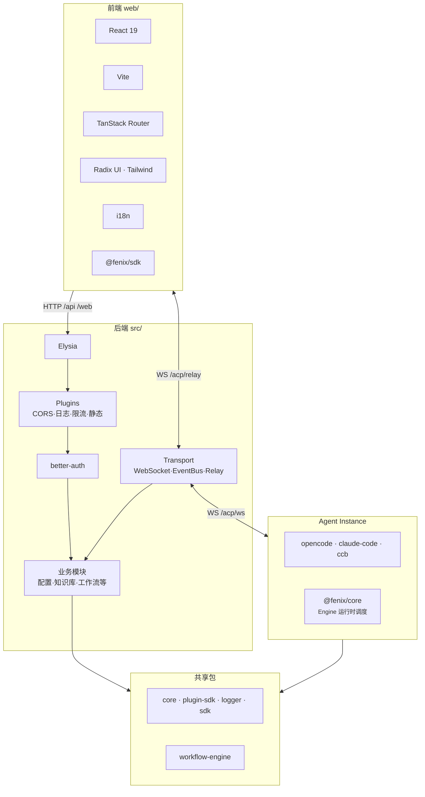
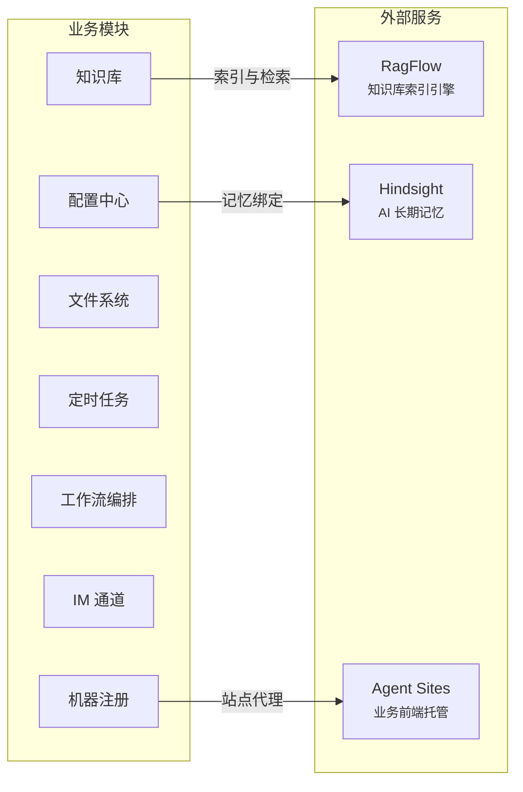
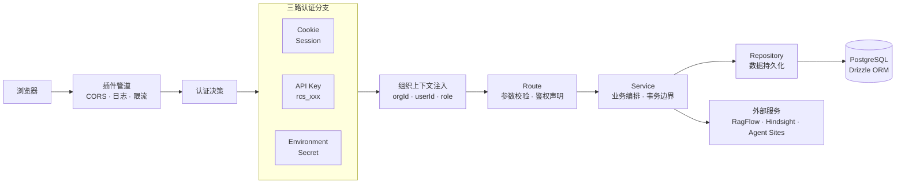
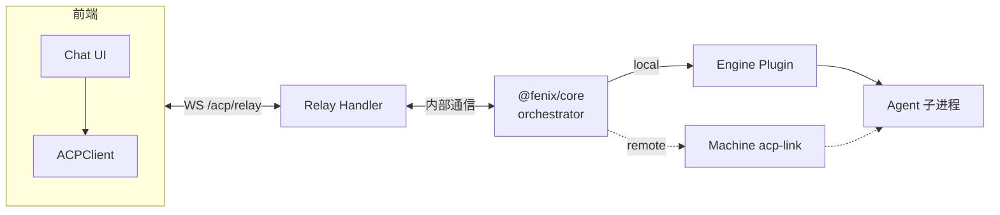

# 设计原则与总体架构

> 从技术选型与整体架构角度梳理各层职责、交互关系 | 日期：2026-06-29 | 修订：v1.3

## 1. 设计原则

1. **统一主运行时**：主服务进程全栈统一 [TypeScript](https://www.typescriptlang.org)，前后端共享类型定义。[Bun](https://bun.sh) 同时承载 HTTP 服务、WebSocket、静态文件分发和脚本执行，消除 Node.js/Bun 混用带来的工具链碎片化。Plugin 子进程（opencode、claude-code 等）按自身需求选择运行时，通过 ACP 协议与主服务通信。
2. **Schema 驱动**：数据库结构、API 校验、前端表单——三者共享 [Zod](https://zod.dev) v4 Schema 定义。改一处 Schema，全链路类型安全。禁止在 route 内联声明请求体结构。
3. **渐进式复杂度**：核心路径走最小依赖（[Elysia](https://elysiajs.com) + [Drizzle](https://orm.drizzle.team) + [React](https://react.dev)），高级能力按需引入（[Redis](https://redis.io) 缓存、Hermes 推送、RagFlow 检索）。不强依赖外部中间件，保持启动流程可控。
4. **协议优先**：Agent 间通信走 ACP（Agent Communication Protocol），而非临时约定。ACP 定义 Agent 注册、会话管理、工具调用的标准契约，使 opencode、claude-code 等异构 runtime 能统一接入。ACP 是项目早期确立的内部协议，先于行业标准（如 A2A）存在，其设计深度耦合 session 模型、relay 桥接和权限系统，因此保持自研而非迁移到外部协议。
5. **静态优于动态**：前端路由走文件系统生成（TanStack Router file-based），UI 图标走本地打包（`@lobehub/icons`），禁止 CDN 外链字体。构建产物自包含，无运行时外部依赖。
6. **插件隔离**：plugin 类 workspace 包（opencode、claude-code、ccb）通过 `@fenix/plugin-sdk` 与核心系统交互，不直接依赖核心内部模块。plugin 运行时通过子进程 spawn，崩溃不拖垮主服务。

---

## 2. 总体架构

### 2.1 内部架构

系统内部自上而下分四层：前端 → 后端 → Agent 实例 → 共享包。

### 2.2 外部服务集成

业务模块按需对接以下独立部署的外部服务。

| 外部服务 | 对接模块 | 关系说明 |
|---------|---------|---------|
| [RagFlow](https://ragflow.io) | 知识库 | 知识库通过 Provider 抽象层委托给 RagFlow 做索引与检索，RagFlow 是当前唯一实现 |
| Hindsight | 配置中心 | Agent 配置时自动绑定 Hindsight，Agent 会话产生的长期记忆由 Hindsight 存储与召回 |
| Agent Sites | 机器注册 | Agent 生成的 Web 应用托管在 Agent Sites，控制平面通过机器注册表路由转发 |

### 2.3 层级职责

| 层级 | 技术选型 | 职责边界 |
|------|---------|---------|
| 运行时 | [Bun](https://bun.sh) | 包管理、脚本执行、HTTP/WS 服务、文件 IO；不做 Node.js 兼容层 |
| 后端框架 | [Elysia](https://elysiajs.com) | 路由、中间件、插件、OpenAPI 文档；ORM / 认证交给专门库 |
| 数据库 | [PostgreSQL](https://www.postgresql.org) + [Drizzle ORM](https://orm.drizzle.team) | Schema 定义、迁移、查询、事务；缓存交给 Redis |
| 认证 | [better-auth](https://www.better-auth.com) | 用户 / 组织 / API Key 认证；授权策略由 Permission 系统承担 |
| 前端框架 | [React 19](https://react.dev) + [Vite](https://vitejs.dev) | 组件渲染、路由、状态管理；纯 CSR，不做 SSR |
| UI 组件 | [Radix UI](https://www.radix-ui.com) + [Tailwind CSS v4](https://tailwindcss.com) | 无障碍原语、样式系统；品牌图标由 `@lobehub/icons` 承担 |
| AI 集成 | [Vercel AI SDK](https://sdk.vercel.ai) | 前端消息流管理、`useChat` hook；Agent 运行时调度由 ACP 承担 |
| 实时通信 | WebSocket + ACP | Agent 中继、会话事件推送；详见 [Agent 接口](./05-chat.md) |
| 类型校验 | [Zod](https://zod.dev) v4 | API 入参 / 出参校验、DB Schema 类型推断；运行时类型由 TypeScript 承担 |
| 文档 | [VitePress](https://vitepress.dev) + [Scalar](https://scalar.com) | 开发者文档 + API 交互式文档；不做业务知识库 |

### 2.4 关键交互路径

**用户请求链路**：

**Agent 实时会话链路**：

---

## 3. 技术债务与演进方向

| 现状 | 问题 | 方向 |
|------|------|------|
| 单体 schema 文件过大 | DB schema 定义集中在一个文件，随业务增长维护困难 | 按业务域拆分 schema |
| workspace 包无版本管理 | 内部 `@fenix/*` 包全部 `private`、版本号固定，改接口需手动确认所有消费方 | 引入 changeset 或内部版本号 |
| Redis 可选 | 无缓存层下高频查询直接打 DB | Instance 状态缓存、Session 元数据热数据 |
| 路由级懒加载未启用 | Vite 仅有 vendor chunk 拆分，无 TanStack Router lazy 加载 | 推进路由级 code splitting |
| Biome + TypeScript 双重 lint | 规则偶有冲突 | 跟踪 Biome TS 规则成熟度，逐步替换 tsc lint |
| `workflow-engine` 包名不规范 | 未带 `@fenix` 作用域，与其他内部包不一致 | 重命名为 `@fenix/workflow-engine` |
| 前端测试覆盖率偏低 | 前端测试文件数远少于后端，"只测关键流程"无量化标准 | 逐步补充核心流程测试 |
| 无分布式消息队列 | workflow 引擎、定时任务全靠进程内存调度 + DB snapshot 恢复，无持久化队列和死信处理 | 评估 Redis Stream 或轻量级队列方案 |
| 可观测性不完整 | 结构化日志成熟（pino + requestId），但 metrics 端点、分布式 tracing、alerting 全部缺失 | 补充 Prometheus metrics 端点，引入 OpenTelemetry |
| ACP 为自研协议 | ACP 先于行业标准（A2A）存在，与外部 Agent 生态不兼容 | 评估 ACP 与 A2A 的桥接方案，逐步向外开放 |
| `acp-link` 包职责膨胀 | 从 stdio↔WS 桥接器膨胀为包含 InstanceManager/SessionManager/EngineHandler 的运行时框架；与 `@fenix/core` 功能重叠 | `acp-link` 收缩为纯传输/协议层，运行时调度职责归一至 `@fenix/core` |
| `acp-link` 版本碎片化 | workspace 内用 v2.0.0，`@fenix/ccb`/`@fenix/opencode` 通过 npm 引用 v1.1.0，Dockerfile 又全局安装 npm 版——三套接口不同 | 统一为 workspace:\* 引用 |
