# ACP 统一生命周期协议

> 日期: 2026-07-27
> 状态: 设计确认
> 层次: 高层协议设计 (不含代码)

## 1. 背景与动机

当前系统在 ACP 通信层面存在三套 WS 端点并行运作（relay WS、Yjs WS、machine WS），各端点的生命周期管理分散在 `connection-manager`、`agent-chat-service`、`machine-registry` 等模块中，彼此缺乏统一的协调规则。

**现存问题**：

| 问题 | 表现 | 影响 |
| :-- | :-- | :-- |
| 端点割裂 | relay WS / Yjs WS / machine WS 各自独立管理连接状态，无全局视图 | 一个端点断连后，其他端点不知情，孤儿状态残留 |
| 状态分散 | Agent Instance 生命周期在 `agent-chat-service`、Session 状态在 `session-state-service`、Machine 状态在 `machine-registry` | 跨实体级联动作靠隐式假设，无显式协议 |
| Idle 回收无标准 | 各模块自行判断超时，阈值不统一，清理逻辑不可预测 | 资源泄漏或误杀活跃会话 |
| 跨节点无规则 | 多 RCS 实例场景下，谁负责 Idle Monitor、谁持有 Y.Doc 写权，全凭运气 | 分布式环境下行为不确定 |

**改造目标**：定义一套覆盖 ACP Session、Agent Instance、Machine Node、Chat Y.Doc、Yjs WS Connection 六个实体的统一生命周期协议，作为所有模块的状态机实现基准。

## 2. 协议二分

整个 ACP 通信平面分为方向相反的两套协议：

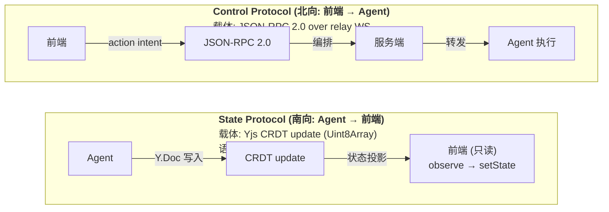

| 维度 | State Protocol | Control Protocol |
| :-- | :-- | :-- |
| **方向** | Agent → 前端 (南向) | 前端 → Agent (北向) |
| **权威源** | 服务端 (aggregator) | 服务端编排，Agent 最终执行 |
| **载体** | Yjs CRDT binary update | JSON-RPC 2.0 |
| **通道** | Yjs WS 连接 (或 relay WS 复用 yjs:update) | relay WS / Socket.IO |
| **前端角色** | 只读投影 (observe → setState) | intent 发起者 (send action → 等待编排结果) |
| **状态语义** | "当前是什么" | "要做什么" |
| **本协议覆盖** | 状态机定义、生命周期规则 | action 字典、路由规则 |
| **本协议不覆盖** | Y.Doc 内部字段定义 (属于 `@fenix/chat-channel` 的 aggregator 层) | action 的 JSON-RPC params/result 具体 schema |

## 3. 六个实体及其身份标识

本协议涉及六个独立实体，各有自己的 ID 命名空间和生命周期：

| # | 实体 | 标识符 | ID 格式 | 生命周期范围 | 说明 |
| :-- | :-- | :-- | :-- | :-- | :-- |
| E1 | **ACP Session** | `acpSessionId` | `ses_xxxxxxxx` | 单次对话会话 | ACP 协议层会话，从用户开始对话到会话结束或超时回收 |
| E2 | **RCS Session Record** | `rcsSessionId` | `session_xxxxxxxx` / `cse_xxxxxxxx` | 持久存储 | RCS 层的 Session 持久化记录，与 ACP Session 一对多关系 |
| E3 | **Agent Instance** | `instanceId` | `inst_xxxxxxxx` | 一次 Agent 进程生命周期 | Agent 运行时实例，包含内存中的对话上下文、工具状态 |
| E4 | **Yjs WS Connection** | `connectionId` | `conn_xxxxxxxx` | 单次 WebSocket 连接 | 前端与服务端的 Yjs 同步通道，承载 State Protocol 的二进制 update |
| E5 | **Machine Node** | `machineId` | `mac_xxxxxxxx` | 跨 Agent Instance 生命周期 | 实际执行 Agent 的物理/虚拟节点，承载 CPU/GPU/网络资源 |
| E6 | **Chat Y.Doc** | `chatKey` | `chat:{userId}:{agentId}` | 与 Chat 页面同生命周期 | 一个 Chat 入口的全局状态容器（Agent 信息、Session 列表、连接状态、权限队列） |

**ID 空间隔离原则**：六个实体使用独立 ID 前缀，不可混用。`acpSessionId` 和 `rcsSessionId` 是两个独立命名空间——映射关系由 `session-state-service` 维护。

## 4. 六个实体状态机

### 4.1 ACP Session 状态机

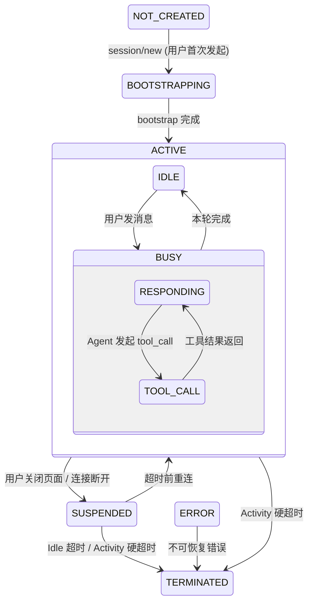

**关键说明**：

- **NOT_CREATED**：Session 尚未创建，不存在对应的 Session Y.Doc。前端 Chat 页面可能有 `activeSessionId = null`。
- **BOOTSTRAPPING**：服务端正在创建 Session Y.Doc、通知 Agent 执行 `session/new`、等待 Agent 返回首条握手消息。此阶段前端显示 loading (`kind: "session/bootstrap"`)。
- **ACTIVE.IDLE**：Session 就绪，等待用户输入。Agent Instance 保持运行但无活跃 PromptTurn。
- **ACTIVE.BUSY.RESPONDING**：Agent 正在流式输出文本。`meta.status = "responding"`。
- **ACTIVE.BUSY.TOOL_CALL**：Agent 正在执行工具调用。`meta.status = "tool-calling"`。可能暂停流式输出，等工具结果返回后恢复 RESPONDING。
- **SUSPENDED**：前端所有 Yjs WS 连接均已断开（页面关闭/网络中断）。Agent Instance 和 Session Y.Doc 仍在内存，等待重连。此状态有时效——见 Idle 超时规则。
- **TERMINATED**：终态。Session Y.Doc 从内存移除（Redis 可保留），Agent Instance 收到 `session/delete` 后关闭。
- **ERROR → TERMINATED**：不可恢复错误（如 Agent 进程崩溃、消息协议非法），自动转入 TERMINATED。

### 4.2 Agent Instance 状态机

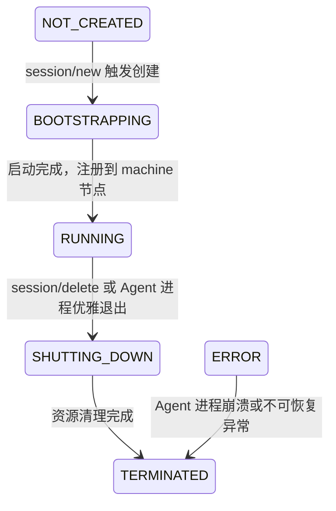

**关键说明**：

- **NOT_CREATED**：尚无 Agent 进程/容器。当 ACP Session 进入 BOOTSTRAPPING 时，检查是否已有 RUNNING Instance 可复用（同 `acpSessionId` 或同 `chatKey`），若无则触发创建。
- **BOOTSTRAPPING**：包含 Agent 进程启动、模型加载、上下文初始化。耗时可能较长（冷启动数十秒），需通过 State Protocol 向前端报告进度。
- **RUNNING**：稳定运行态。可同时服务多个 ACP Session（如果 Agent 支持多 Session 复用），每个 Session 有独立的 PromptTurn 栈。
- **SHUTTING_DOWN**：收到 `session/delete`（最后一个 Session 关闭时）或 Machine 下线通知。Agent 在此时保存 checkpoint、释放 GPU 显存、关闭子进程。
- **ERROR → TERMINATED**：不可绕过 SHUTTING_DOWN——ERROR 表示意外终止，但清理逻辑（释放 Machine 资源、移除注册表条目）仍需执行。
- **与 ACP Session 的关系**：一个 Agent Instance 可对应多个 ACP Session（复用场景），但一个 ACP Session 在任意时刻只绑定一个 Agent Instance。

### 4.3 Machine Node 状态机

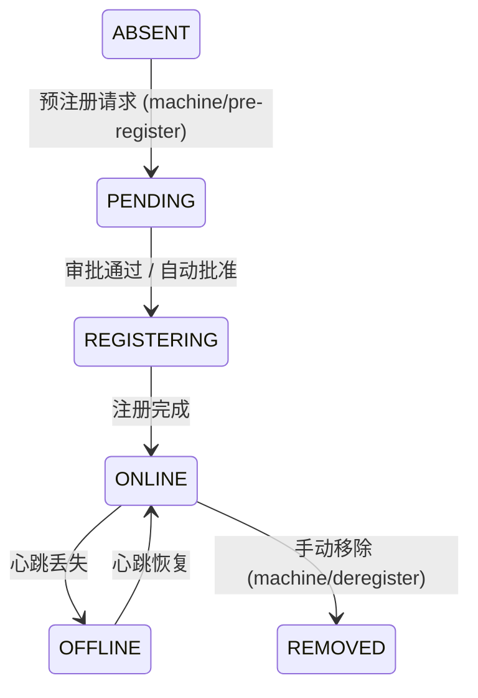

**关键说明**：

- **ABSENT**：该 Machine 在系统中无任何记录。对应 `machine-registry` 中无条目。
- **PENDING**：Machine 发起预注册请求但尚未批准。此状态下不参与 Agent 调度，不接收心跳。
- **REGISTERING**：注册信息正在写入持久存储，分配 `machineId`，建立心跳通道。短暂瞬态。
- **ONLINE**：正常在线，定期发送心跳。可以接收 Agent Instance 调度请求。心跳间隔由 `@fenix/config` 的 `machine.heartbeatIntervalMs` 控制。
- **OFFLINE**：心跳超时未到达（默认 3 倍心跳间隔）。Machine 上的所有 Agent Instance 进入级联终止流程。Machine 注册信息保留，等待重新上线。
- **REMOVED**：管理员主动移除。终态。Machine 上的所有 Agent Instance 立即终止，注册信息从持久存储清除或标记为 `removed`。

### 4.4 Chat Y.Doc 状态机

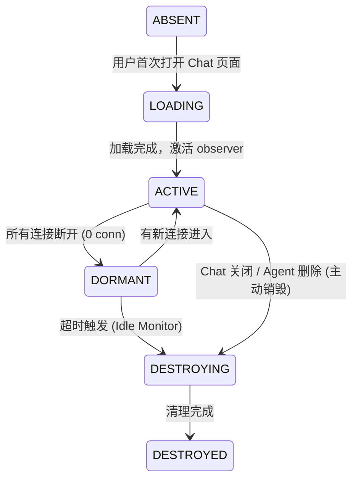

**关键说明**：

- **ABSENT**：该 Chat 的 Y.Doc 不在当前 RCS 实例内存中。Redis 中可能存在持久化的历史状态。
- **LOADING**：从 Redis 加载已有 Y.Doc 状态或创建新的空 Doc。此阶段不可写入——observer 尚未激活。
- **ACTIVE**：至少有一个活跃的 Yjs WS 连接。Doc 可读写，observer 广播 update 到所有连接的前端。
- **DORMANT**：所有 Yjs WS 连接均已断开，但 Chat Y.Doc 仍在内存中保留。此状态有时效——由 Idle Monitor 决定何时转入 DESTROYING。
- **DESTROYING → DESTROYED**：主动销毁流程：先级联关闭所有关联 Session Doc → 移除 Redis key（可选——取决于保留策略）→ 释放内存。

### 4.5 Yjs WS Connection 状态机

**关键说明**：

- **DISCONNECTED**：前端尚未发起 WS 连接，或上次连接已关闭。
- **CONNECTING**：浏览器 WebSocket 构造函数执行中，TCP/TLS 握手阶段。此阶段无业务数据交换。
- **HANDSHAKING**：连接建立后，前端发送 `{ type: "yjs:handshake", chatKey, acpSessionId, authToken }`，服务端验证并绑定连接。失败则直接 CLOSED。
- **SYNCING**：服务端通过此连接推送 Chat Y.Doc 和 Session Y.Doc 的完整当前状态 (`Y.encodeStateAsUpdate`)。前端可能短暂显示空白——由 `meta.loading` 控制 UI。
- **READY ⇄ RECONNECTING**：READY 是稳态——实时接收 Yjs update 二进制块并 apply 到本地 Doc。连接意外断开时进入 RECONNECTING（带指数退避，最大重试次数由前端配置），重连成功后通过 HANDSHAKING → SYNCING 恢复 READY。
- **CLOSED**：终态。连接资源释放，从 `connection-manager` 移除。

## 5. 全链路生命周期串联规则

以下 11 个场景定义了六个实体之间的级联状态转换。每个场景以触发事件为起点，沿实体链向下级联。

### S1: 用户冷启动打开 Chat

| 步骤 | 实体 | 状态转换 | 触发动作 |
| :-- | :-- | :-- | :-- |
| 1.1 | Yjs WS Connection | DISCONNECTED → CONNECTING | 前端发起 WebSocket 连接 |
| 1.2 | Yjs WS Connection | CONNECTING → HANDSHAKING → SYNCING → READY | 握手成功，接收初始 state |
| 1.3 | Chat Y.Doc | ABSENT → LOADING → ACTIVE | 服务端首次引用该 chatKey |
| 1.4 | ACP Session | 取决于历史 | 若此前有 SUSPENDED Session → 恢复为 ACTIVE.IDLE |
| 1.5 | Agent Instance | 取决于 | 若此前无 RUNNING Instance 且 Session 为 ACTIVE → 触发创建 |

**规则**：Chat Y.Doc 的 ACTIVE 是后续所有操作的先决条件——无 ACTIVE Chat Doc 不处理任何 Control Protocol 消息。

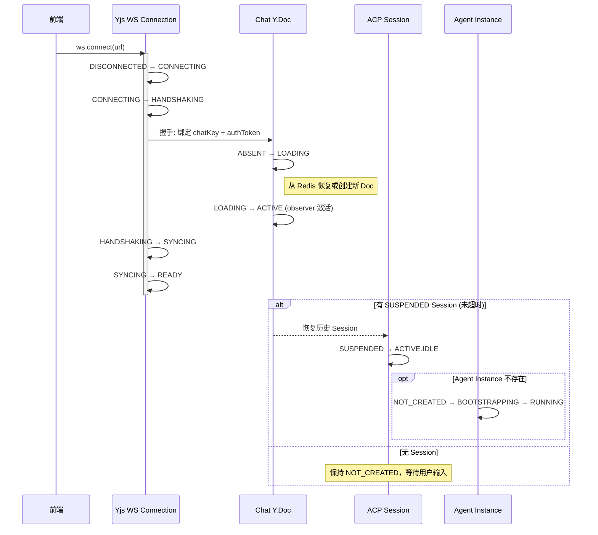

### S2: 用户发送首条 Prompt

| 步骤 | 实体 | 状态转换 | 触发动作 |
| :-- | :-- | :-- | :-- |
| 2.1 | ACP Session | NOT_CREATED → BOOTSTRAPPING (若首条) | Control action: `session/new` |
| 2.2 | Agent Instance | NOT_CREATED → BOOTSTRAPPING → RUNNING (若首条) | 调度到 Machine 节点，启动 Agent 进程 |
| 2.3 | ACP Session | BOOTSTRAPPING → ACTIVE → ACTIVE.BUSY.RESPONDING | Agent 就绪，开始处理 prompt |

**规则**：若 ACP Session 已存在且为 ACTIVE.IDLE，步骤 2.1-2.2 跳过，直接 2.3（IDLE → BUSY）。

### S3: Agent 处理中 (BUSY 周期)

ACP Session 在 BUSY 内部的子状态流转：

```
IDLE ──► RESPONDING ──► TOOL_CALL ──► RESPONDING ──► ... ──► IDLE
         (流式输出)     (工具执行)     (恢复输出)            (本轮完成)
```

| 事件 | ACP Session 子状态 | State Protocol 写入 |
| :-- | :-- | :-- |
| Agent 开始处理 prompt | RESPONDING | `meta.status = "responding"`, `meta.loading = null` |
| Agent 发起 tool_call | TOOL_CALL | `meta.status = "tool-calling"`, `tools.set(id, ...)` |
| 工具需要用户审批 | TOOL_CALL (挂起) | `meta.loading = { kind: "permission/pending" }`, `meta.status = "waiting-user"` |
| 用户审批/拒绝 | RESPONDING (恢复) | `meta.loading = null`, `meta.status = "responding"` |
| 本轮回复完成 | IDLE | `meta.status = "idle"`, `streaming` 清空 |

**规则**：BUSY → IDLE 的转换仅由 Agent 驱动（`prompt_complete` / `agent_message_complete` 事件）。前端无法中途中断 BUSY 周期——中断需通过 Control Protocol 发送 `session/cancel`。

### S4: 页面关闭 / 连接断开 (触发 SUSPENDED)

| 步骤 | 实体 | 状态转换 | 条件 |
| :-- | :-- | :-- | :-- |
| 4.1 | Yjs WS Connection | READY → CLOSED (最后一条连接) | 前端关闭 Tab / 网络断开 |
| 4.2 | Chat Y.Doc | ACTIVE → DORMANT | 所有该 chatKey 的 Yjs WS Connection 均已 CLOSED |
| 4.3 | ACP Session | ACTIVE → SUSPENDED | Chat Y.Doc 进入 DORMANT |

**规则**：

- Agent Instance 保持 RUNNING——不随连接断开而终止。
- Step 4.3 只在 ACP Session 当前为 ACTIVE 时触发。若已为 TERMINATED，不重复转换。
- SUSPENDED 计时器从 Step 4.3 完成时启动 (`suspendedAt = now()`)。

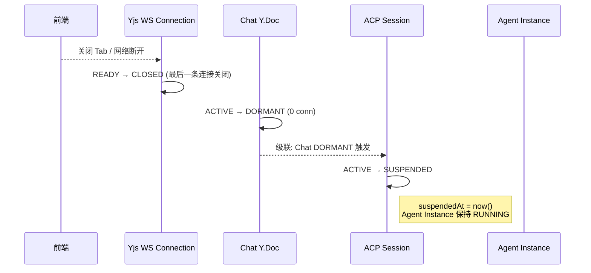

### S5: 超时前重连 (SUSPENDED 恢复)

| 步骤 | 实体 | 状态转换 | 条件 |
| :-- | :-- | :-- | :-- |
| 5.1 | Yjs WS Connection | DISCONNECTED → ... → READY | 前端重新打开页面或网络恢复 |
| 5.2 | Chat Y.Doc | DORMANT → ACTIVE | 新的 Yjs WS Connection 绑定 |
| 5.3 | ACP Session | SUSPENDED → ACTIVE (恢复原子状态) | `now() - suspendedAt < idleTimeoutMs` |

**规则**：

- 恢复为 ACTIVE 后，SUSPENDED 计时器清零。
- 若恢复时 ACP Session 原本为 BUSY，Agent 可能已产生新的 ACP 事件——这些事件在 SUSPENDED 期间未被前端消费，重连后通过 Yjs SYNCING 阶段的全量 state 一次性同步。

### S6: Idle 超时 (SUSPENDED → TERMINATED 级联)

| 步骤 | 实体 | 状态转换 | 触发动作 |
| :-- | :-- | :-- | :-- |
| 6.1 | ACP Session | SUSPENDED → TERMINATED | Idle Monitor 检测 `now() - suspendedAt > idleTimeoutMs` |
| 6.2 | Agent Instance | RUNNING → SHUTTING_DOWN (若无其他 ACTIVE/SUSPENDED Session) | 级联终止 |
| 6.3 | Agent Instance | SHUTTING_DOWN → TERMINATED | Agent 进程退出 |
| 6.4 | Chat Y.Doc | DORMANT → DESTROYING (若无可恢复 Session) | 级联清理 |
| 6.5 | Chat Y.Doc | DESTROYING → DESTROYED | 内存释放 |

**规则**：

- `idleTimeoutMs` 默认值由 `@fenix/config` 的 `session.idleTimeoutMs` 定义（建议 30 分钟）。
- Idle 判定仅针对 SUSPENDED 状态——ACTIVE 状态的 Session 即使长时间 IDLE 子状态也不触发超时（用户可能正在阅读长回复）。
- Step 6.2 的条件检查：Agent Instance 上是否还有其他 ACP Session 处于 ACTIVE 或 SUSPENDED。若有，Agent Instance 保持 RUNNING。

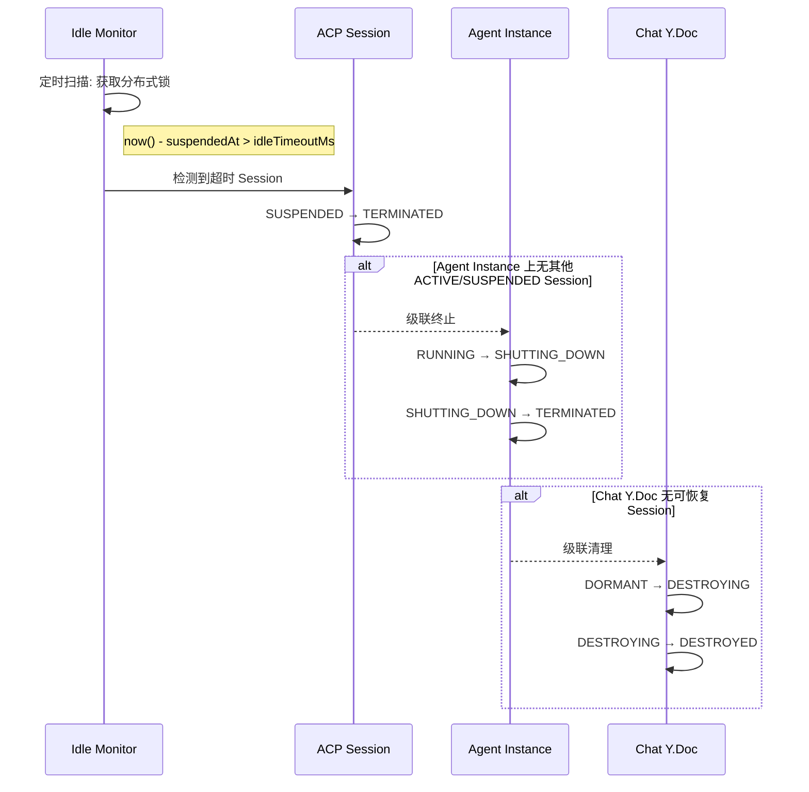

### S7: Activity 硬超时 (即使有 Relay 连接)

区别于 Idle 超时：Activity 硬超时统计的是 Session 从创建以来的**总存活时间**，不论状态。

| 步骤 | 实体 | 状态转换 | 条件 |
|:--|:--|:--|:--|
| 7.1 | ACP Session | ACTIVE → TERMINATED | `now() - createdAt > maxSessionLifetimeMs` |

**规则**：

- `maxSessionLifetimeMs` 默认值由 `@fenix/config` 的 `session.maxLifetimeMs` 定义（建议 4 小时）。
- 即使 Session 处于 ACTIVE.BUSY 中，到期也强制终止——Agent 收到 `session/cancel` 后进入 SHUTTING_DOWN。
- Activity 硬超时优先级高于 Idle 超时——两者同时满足时，执行 Activity 硬超时逻辑。

### S8: Machine 下线级联

| 步骤 | 实体 | 状态转换 | 触发动作 |
| :-- | :-- | :-- | :-- |
| 8.1 | Machine Node | ONLINE → OFFLINE | 心跳超时 (3x heartbeatIntervalMs) |
| 8.2 | Agent Instance | RUNNING → SHUTTING_DOWN (所有在该 Machine 上的 Instance) | 级联终止 |
| 8.3 | Agent Instance | SHUTTING_DOWN → TERMINATED | Agent 进程退出 |
| 8.4 | ACP Session | ACTIVE / SUSPENDED → ERROR → TERMINATED | 绑定 Agent Instance 终止 |

**规则**：

- Machine OFFLINE 时，其上的所有 Agent Instance 无条件进入 SHUTTING_DOWN——不考虑 SUSPENDED 恢复。
- Session Y.Doc 写入 error 状态后保留在内存中，等待用户重连时展示错误信息。

### S9: Machine 重新上线

| 步骤 | 实体 | 状态转换 | 条件 |
| :-- | :-- | :-- | :-- |
| 9.1 | Machine Node | OFFLINE → ONLINE | 心跳恢复，连续 N 次成功 |
| 9.2 | Agent Instance | — (不自动恢复) | 旧的 Instance 已 TERMINATED，需用户重新发起 Session |

**规则**：

- Machine 重新上线不自动恢复其上的 Agent Instance——旧 Instance 的上下文已丢失（进程已退出）。
- ACP Session 保持 TERMINATED（或 ERROR），需用户重新发送 prompt 触发新的 Session 创建。

### S10: Chat 关闭 / Agent 删除 (主动销毁级联)

| 步骤 | 实体 | 状态转换 | 触发动作 |
| :-- | :-- | :-- | :-- |
| 10.1 | ACP Session | ANY → TERMINATED (所有关联 Session) | Control action: `session/delete` × N |
| 10.2 | Agent Instance | RUNNING → SHUTTING_DOWN → TERMINATED | 收到最后一组 `session/delete` |
| 10.3 | Chat Y.Doc | ACTIVE / DORMANT → DESTROYING → DESTROYED | 所有 Session 清理完成 |
| 10.4 | Yjs WS Connection | READY → CLOSED (所有该 chatKey 的连接) | 服务端主动关闭 |

**规则**：

- 主动销毁区别于超时回收——不等待 SUSPENDED 计时器，直接 TERMINATED。
- 若 Agent 删除触发，Machine Node 状态不受影响（Machine 可服务其他 Agent）。

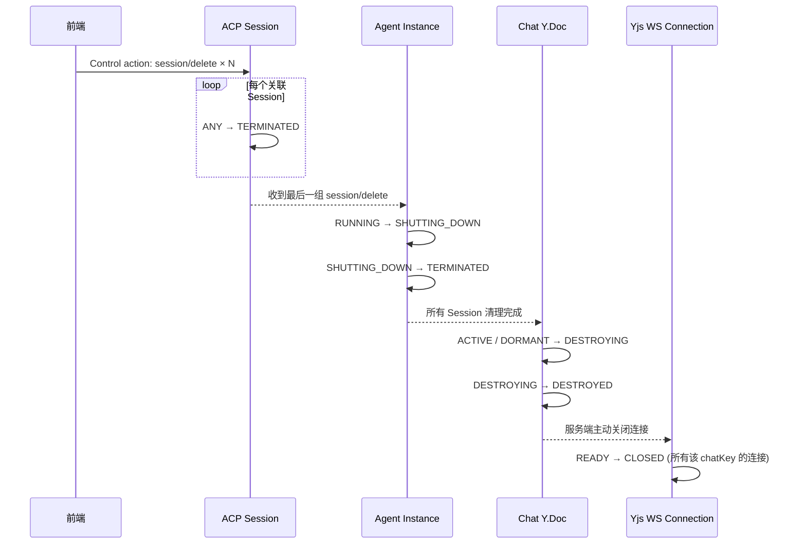

### S11: 服务端重启 (故障恢复)

| 步骤 | 实体 | 状态转换 | 触发动作 |
| :-- | :-- | :-- | :-- |
| 11.1 | 所有实体 | ANY → (内存状态丢失) | RCS 进程重启 |
| 11.2 | Machine Node | 重新上报心跳 → ONLINE | Machine 进程独立于 RCS |
| 11.3 | Chat Y.Doc | ABSENT → LOADING → ACTIVE / DORMANT | 用户重新连接时从 Redis 恢复 |
| 11.4 | ACP Session | (从 Redis Session Doc 推断) → 若 Session Doc 存在 + 未超时 → SUSPENDED / ACTIVE | 见下规则 |
| 11.5 | Agent Instance | NOT_CREATED → (需重新创建) | 旧 Instance 进程已随 RCS 退出而孤立或终止 |

**规则**：

- RCS 重启后，Machine 心跳恢复，Machine 重新注册为 ONLINE。
- Chat Y.Doc 和 Session Y.Doc 从 Redis 恢复后，根据 `meta.status` 和 `meta.updatedAt` 推断 Session 状态：
  - 若 `meta.status` 为终端态 (`done` / `error`) → 不做恢复
  - 若 `now() - meta.updatedAt < idleTimeoutMs` → SUSPENDED
  - 否则 → TERMINATED（视为已超时）
- Agent Instance 在 RCS 重启后不自动恢复——用户下次发送 prompt 时重新创建。
- 若 RCS 重启时 Machine 上的 Agent 进程仍在运行（孤儿进程），Machine 的心跳上报应携带 Agent 进程信息，RCS 据此决定是否复用或终止孤儿 Agent。

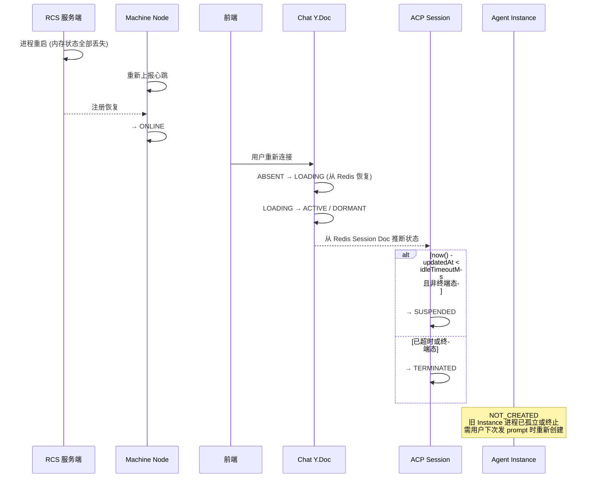

## 6. 分布式跨节点协调规则

### D1: Y.Doc 单写入口 (Writer Node)

**规则**：每个 Chat Y.Doc 和 Session Y.Doc 在同一时刻只有一个 RCS 实例持有写入权（writer node），其他实例仅做只读转发（reader node）。

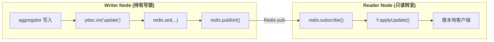

**能力依赖**：Yjs Redis Provider 负责 Doc 持久化与跨节点同步，写锁由 Redis 分布式锁保证互斥。

### D2: Instance 调度亲和性 (与 Machine 同节点)

**规则**：Agent Instance 应优先调度到与其目标 Machine 同 RCS 实例的节点上，减少跨节点 RPC 延迟。

| 场景 | 调度策略 |
| :-- | :-- |
| Machine 在当前节点注册 | 直接在本节点创建 Agent Instance (亲和) |
| Machine 在其他节点注册 | 通过内部 RPC 委托目标节点创建 |
| Machine 未绑定节点 (新注册) | 由负载最低的节点接收 |

### D3: Idle Monitor 单例执行 (分布式锁)

**规则**：全局 Idle Monitor 定时扫描任务同时只有一个 RCS 实例执行，通过 Redis 分布式锁保证单例。

### D4: Machine 心跳单节点负责 (故障接管)

**规则**：每台 Machine 的心跳只由一个 RCS 实例负责监控。当负责节点宕机时，其他节点通过 socket.io Redis Adapter 自动接管。

### 分布式实体存储总结表

| 实体类型 | 持久化存储 | 内存驻留 | 分布式协调 |
| :-- | :-- | :-- | :-- |
| ACP Session 状态 | Redis Session Y.Doc | 持有锁的 writer node | D1 (单写入口) |
| Agent Instance 状态 | Redis `agent:instance:{instanceId}` | 调度目标节点 | D2 (亲和性) |
| Machine Node 注册 | PostgreSQL / Redis | 负责心跳的节点 | D4 (心跳接管) |
| Chat Y.Doc | Redis Chat Y.Doc | 持有锁的 writer node | D1 (单写入口) |
| Yjs WS Connection | 无持久化 | 接收连接的节点 | 无——连接即会话 |
| Idle Monitor 状态 | Redis lock key | 仅监控执行期间 | D3 (单例锁) |

## 7. Control Protocol 字典

Control Protocol 定义前端可发起的 8 个 action。每个 action 遵循 JSON-RPC 2.0 格式。以下仅定义命令级别，不定义 params/result 的详细字段（属于后续 aggregator 实现层定义）。

| # | action | 方法 | 方向 | 触发条件 | ACP Session 状态要求 | 级联实体 |
| :-- | :-- | :-- | :-- | :-- | :-- | :-- |
| C1 | `session/new` | `session/new` | 前端 → 服务端 → Agent | 用户首次发送 prompt，或无活跃 Session | NOT_CREATED | ACP Session, Agent Instance, Chat Y.Doc |
| C2 | `session/prompt` | `session/prompt` | 前端 → 服务端 → Agent | 用户在已有 Session 中发送消息 | ACTIVE.IDLE | ACP Session (IDLE → BUSY) |
| C3 | `session/cancel` | `session/cancel` | 前端 → 服务端 → Agent | 用户点击停止生成或超时中断 | ACTIVE.BUSY | ACP Session (BUSY → TERMINATED / IDLE) |
| C4 | `session/delete` | `session/delete` | 前端 → 服务端 → Agent | 用户删除对话 / Chat 关闭 | ANY (非 TERMINATED) | ACP Session, Agent Instance (若最后一个 Session), Chat Y.Doc |
| C5 | `session/load` | `session/load` | 前端 → 服务端 → Agent | 用户切换 Session 或恢复历史对话 | NOT_CREATED 或 SUSPENDED | ACP Session, Agent Instance (若需要) |
| C6 | `session/switch` | `session/switch` | 前端 → 服务端 | 用户点击 Sidebar 切换活跃 Session | ANY | Chat Y.Doc (更新 activeSessionId) |
| C7 | `permission/resolve` | `permission/resolve` | 前端 → 服务端 → Agent | 用户审批/拒绝权限请求 | ACTIVE.BUSY (TOOL_CALL + waiting-user) | Chat Y.Doc (permissions)，ACP Session (恢复 RESPONDING) |
| C8 | `chat/close` | `chat/close` | 前端 → 服务端 | 用户关闭所有 Chat Tab 或退出登录 | ANY | 所有关联 ACP Session, Agent Instance, Chat Y.Doc, Yjs WS Connection |

**路由规则**：

- C1-C5, C7：服务端接收后转发给 Agent Instance，等待 Agent 响应后再写入 State Protocol。
- C6：服务端直接编排，不经过 Agent——仅涉及 Chat Y.Doc 写入。
- C8：服务端编排销毁级联（见 S10），不等待 Agent 逐个响应。

## 8. 未定义项

以下内容明确不在本协议范围内，属于后续设计范畴：

| 未定义项 | 归属 | 说明 |
| :-- | :-- | :-- |
| State Protocol 的 Y.Doc 字段定义 | `@fenix/chat-channel` aggregator 层 | `meta.status`、`messages[]`、`streaming`、`tools` 等字段的完整类型和语义 |
| Control Protocol 的 JSON-RPC params/result schema | `@fenix/chat-channel` + `agent-chat-service` | 每个 action 的请求参数和响应结构 |
| ACP 事件类型与 Session 状态的映射表 | `@fenix/chat-channel` aggregator | `agent_message_chunk` → `meta.status = "responding"` 等详细规则 |
| 具体的超时数值 | `@fenix/config` | `idleTimeoutMs`、`maxSessionLifetimeMs`、`heartbeatIntervalMs` 等默认值 |
| Machine 预注册审批流程 | `machine-registry` | PENDING → REGISTERING 的审批策略和 UI |
| Agent Instance 的错误分类与重试策略 | `agent-chat-service` | 区分可恢复错误与不可恢复错误 |
| RCS 节点间内部 RPC 协议 | RCS 基础设施层 | 调度请求、心跳转发的序列化格式 |
