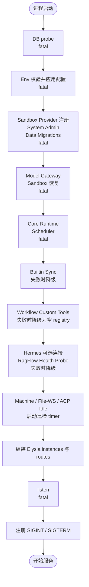
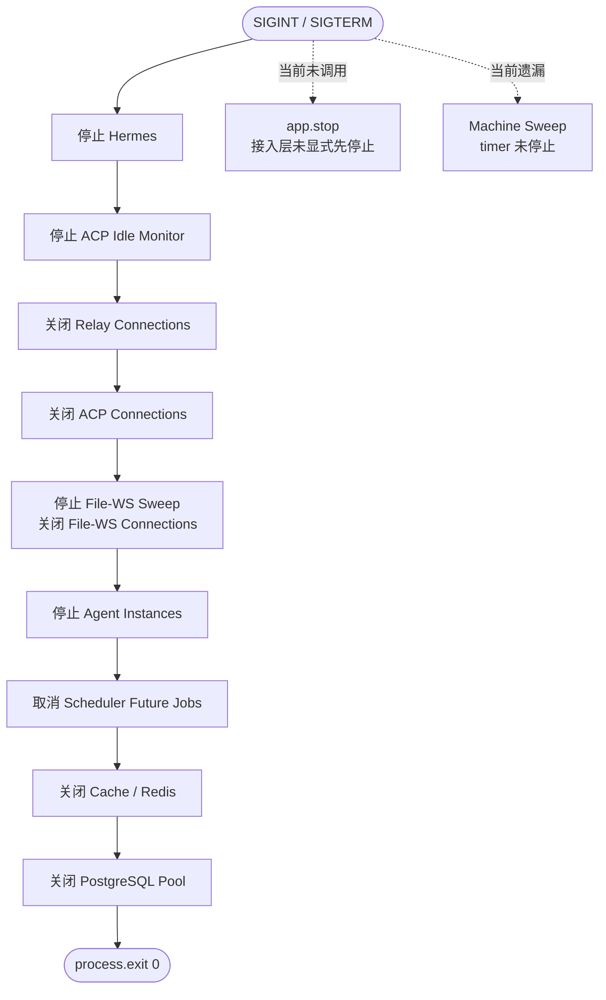
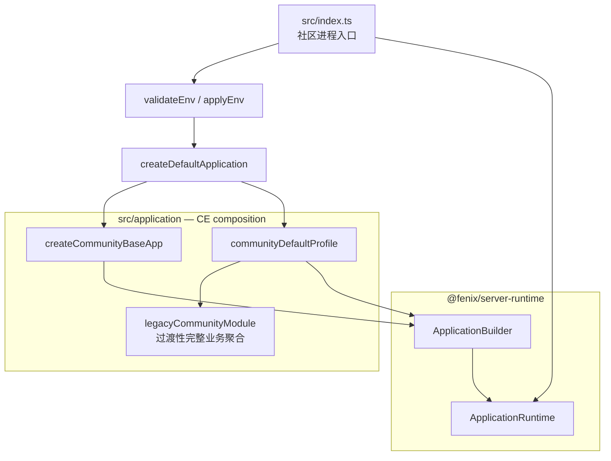
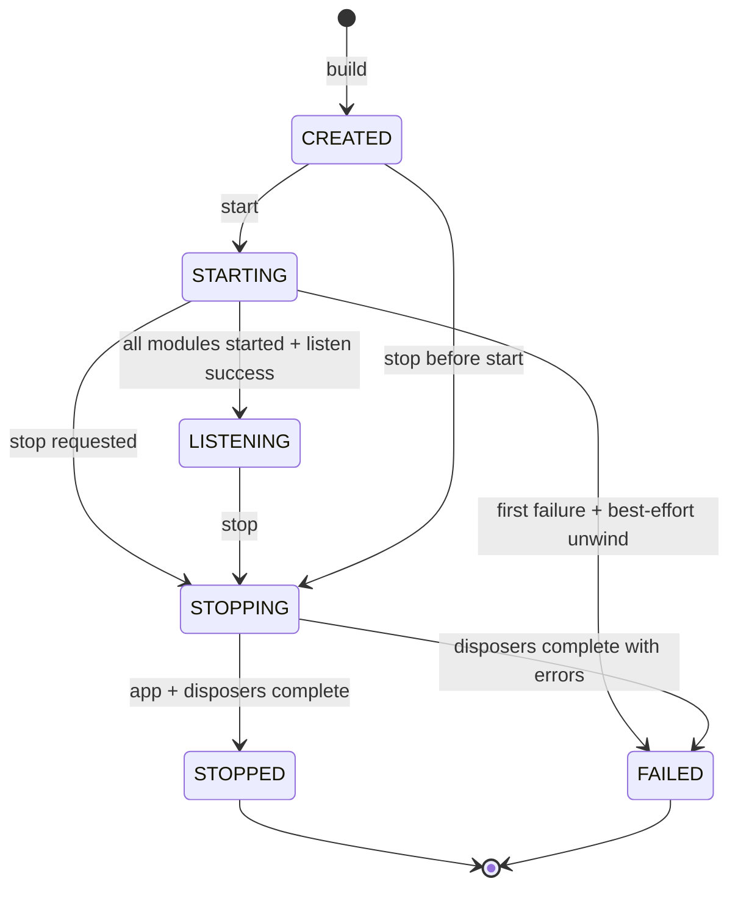
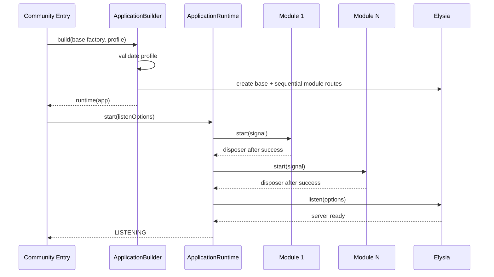
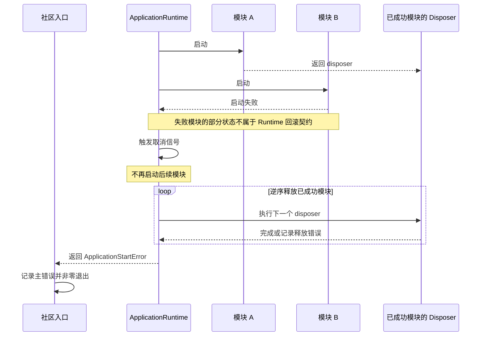
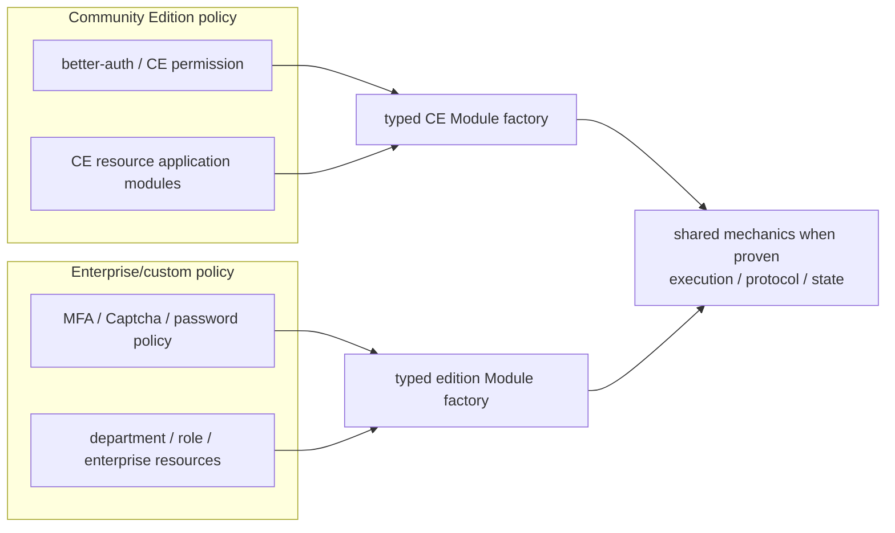

# App Builder 设计

> 状态：草案，基础原型正在按设计评审修订，待维护者评审与 Linux CI 验证；日期：2026-09-04；最后校准：2026-09-04
>
> 本文同时描述本期 App Builder 的实现契约，以及它与未来企业版、定制版和 Git submodule 路线的关系。带“长期目标”标记的内容不属于本期交付。

## 文档职责

本文是可随评审和实现证据修订的详细设计，负责说明问题、范围、接口、时序、兼容要求、验证方式和后续演进边界。`docs/adr/0001-application-profile-composition.md` 是对应的架构决策记录，只保留需要长期遵守的决策、理由与后果；它在本文通过评审和实现验证前保持“提议中”，不复制本文的实现步骤和未来模块清单。

实现完成后的真实目录和调用关系记录在当前态架构文档中。三类文档分别回答“准备怎样设计”“为何作出这项长期决策”和“代码现在实际怎样运行”，不能用 ADR 代替尚未完成的设计评审，也不能让设计文档声称尚未落地的结构已经存在。

## 背景

FenixAgent 当前由 `src/index.ts` 完成整个服务进程的装配。该文件同时承担：

- 环境校验和全局配置应用；
- 数据库、系统管理员、数据迁移和运行时初始化；
- Sandbox、Model Gateway、Workflow、Hermes、RagFlow 等能力启动；
- 后台巡检任务启动；
- Elysia 全局插件和全部 routes 注册；
- HTTP/WebSocket listen；
- SIGINT/SIGTERM 和资源释放。

这些动作的依赖、故障策略和关闭顺序由代码位置隐式表达。新增能力时，开发者必须同时记住路由位置、启动位置和 shutdown 清单；裁剪能力则需要修改同一个入口和多个聚合文件。当前已经出现以下具体问题：

1. 启动到一半失败时，已经成功启动的 timer、连接或服务缺少统一释放入口，测试或嵌入式宿主可能遗留进程资源。
2. `startMachineSweep()` 已启动，但 graceful shutdown 没有调用已有的 `stopMachineSweep()`。
3. `app.stop()` 不在当前 shutdown 路径中，进程依赖最终 `process.exit(0)` 终止接入。
4. 启动顺序和关闭顺序不是由同一个所有权模型生成，新增资源容易遗漏。
5. 导入、构造、启动和进程控制没有清晰边界，难以测试完整应用而不触发真实副作用。
6. `export type App = typeof app` 依赖静态链式装配，直接改成运行期动态数组可能丢失 Eden route 类型。

本设计以一个真实的第二种装配需求检验边界：未来可能存在企业版或其他定制版，整体省略或替换部分 CE Module。但 App Builder 首先解决社区项目自身的入口职责、可测试性和生命周期可靠性，不以企业版作为本期功能。

## 当前生命周期基线

### 当前启动顺序

| 顺序 | 当前动作 | 当前失败语义 | 长期资源 |
| --- | --- | --- | --- |
| 1 | `initDb()` | 抛出并阻断 | PostgreSQL Pool 在模块求值时已创建 |
| 2 | `validateEnv()` / `applyEnv()` | 测试抛错，生产退出 | 全局 `config` |
| 3 | 注册 Sandbox providers | 抛出并阻断 | 进程内 provider registry |
| 4 | deprecated env 告警 | 不阻断 | 无 |
| 5 | `ensureSystemAdmin()` | 抛出并阻断 | DB 数据 |
| 6 | `runDataMigrations()` | 抛出并阻断 | DB 数据 |
| 7 | Model Gateway runtime/provider | 抛出并阻断 | 进程内 services 与 credential resolver |
| 8 | 默认 Sandbox Pool | 捕获、记录并降级 | DB 数据 |
| 9 | Sandbox restart recovery | 抛出并阻断 | DB 状态 |
| 10 | `initCoreRuntime()` | 抛出并阻断 | Core Runtime singleton |
| 11 | `schedulerService.start()` | 抛出并阻断 | schedule jobs |
| 12 | `syncBuiltin()` | 捕获、记录并降级 | DB/文件数据 |
| 13 | Workflow custom tools | 内部捕获并降级为空 registry | 进程内 registry |
| 14 | Hermes | 仅配置时启动，异步错误记录 | WebSocket、重连/心跳 timer |
| 15 | RagFlow health probe | 返回 degraded 结果，不抛出 | 最长 5 秒探测 timer |
| 16 | machine/file-ws/ACP idle sweeps | callback 内部捕获 | interval timers |
| 17 | 构造 Elysia app 并 `listen()` | 抛出并阻断 | Bun server |
| 18 | 注册 SIGINT/SIGTERM | 无 | process listeners |



当前 DB probe 早于完整环境校验。本设计把“校验并应用配置”放在任何显式启动副作用之前，以便失败更早且不先访问外部系统。这是本期唯一计划内的启动前置顺序校正；它不改变正常运行时协议，但必须在测试和 PR 说明中明确。

### 当前关闭顺序



已知边界：

- machine sweep 未停止；
- Scheduler 只取消未来 job，不等待或取消正在运行的 executor；
- file event batch、Chat/Y.Doc persistence 等完整 flush 不在当前路径；
- 多个 singleton/registry 没有正式 reset/dispose API；
- 这不是有 deadline 的 drain protocol。

App Builder 负责建立统一 disposer seam，但本期不冒充已经解决 `docs/need-to-change/42-make-process-shutdown-a-drain-protocol.md` 的全部问题。

## 目标与非目标

### 本期目标

1. 用代码级 Profile 显式声明应用包含哪些 Module，以及它们的顺序。
2. ServerModule 同时拥有 Elysia routes factory 和进程生命周期启动逻辑。
3. 在 listen 前完成 Module 启动；遇到首个错误立即停止，不启动后续 Module。
4. Module 成功启动后返回 disposer；后续 Module/listen 失败时 best-effort 释放已成功 Module，随后由社区入口非零退出。
5. stop 时先停止接入，再逆序执行已成功 Module 的 disposer；重复和并发 stop 幂等。
6. 构造应用不连接外部系统、不启动 timer、不 listen、不注册 signal。
7. 保持默认 Profile 的 HTTP、WebSocket、OpenAPI、鉴权和前端行为。
8. 保持默认 `App` 的完整 Elysia/Eden 类型。
9. 用 package 内的可执行源码示例和单元测试，以小型测试 Module 验证增减、顺序、路由类型和生命周期，不为证明机制而人为拆分生产模块。
10. 默认社区装配先以一个过渡性 Module 接入现有完整业务聚合，保持原有 route 和启动顺序。
11. 将通用 Builder/Runtime 放入独立 package，且不依赖 Fenix 业务实现。

### 本期非目标

- 运行期热插拔或无重启切换；
- 从环境变量解析模块 allowlist/denylist；
- 插件目录扫描或第三方代码动态加载；
- `provides/requires` 能力注册表；
- 通用 DI 容器或 Service Locator；
- 同名 Module、service 或 route 覆盖；
- 公共 auth/permission/resource contract；
- 为演示 App Builder 而拆分现有生产路由或启动链；
- 确定 Channels、Agent Sites、Workflow、Knowledge 等业务能力的长期 Module 边界；
- 领域代码迁入 packages；
- 多个真实 Fenix app 在同一进程并行运行；
- 数据库 schema/迁移拆分；
- 前端 capability/plugin 系统；
- 持久化副作用或当前 Module 部分启动的事务式回滚；
- 完整 readiness、deadline drain 和在途任务取消；
- 企业版实现或 Git submodule 切换。

## 术语与边界

| 术语 | 含义 | 不负责 |
| --- | --- | --- |
| ApplicationBuilder | 校验 Profile、构造 base app、按顺序合并 ServerModule routes | 业务依赖解析、认证、配置发现 |
| Application Runtime | 协调 Module start、listen、fail-fast unwind 和 stop | `process.exit()`、signal 策略、持久化回滚、领域业务 |
| ServerModule | 一个 edition 中可整体增减的路由与生命周期装配单元 | 自动成为 CE/EE 共享业务包 |
| ApplicationProfile | 有名称、通过 fluent `.use(module)` 声明固定顺序的代码级配置 | 运行期变更、隐式覆盖 |
| Base App | edition 自己提供的 Elysia 横切内核 | 业务 routes 与后台能力 |
| Module factory | 通过类型化参数把 edition 依赖注入 Module 闭包 | 从全局容器按 token 查找依赖 |
| Domain Application Module | 承载命令、事务、授权和补偿的领域边界 | 进程级 Elysia 装配 |

`ServerModule` 和领域 Application Module 不是同一抽象。一个 ServerModule 可以暂时聚合多个尚未拆分的 CE 领域；一个成熟领域也可能由多个协议 adapter 使用。App Builder 只规定已有边界如何装配，不负责发现或证明业务边界，也不改变 `routes → services → repositories → db` 的依赖方向。生产 Profile 的 Module 粒度可以暂时很粗；在没有领域依据时，粗而真实的边界优于为了展示 `.use(module)` 而形成的任意半拆分。

## 总体架构

### 本期结构



依赖方向：

```text
src/index.ts
  → src/application
      → @fenix/server-runtime
      → routes/services/repositories/db

@fenix/server-runtime
  → Elysia
  ✕ src/**
  ✕ CE auth / DB / config / logger
```

### 为什么不直接使用 Elysia `onStart/onStop`

ServerModule 通过独立 Elysia 实例提供 routes、hooks、models 与 WebSocket 端点，但进程资源不分散注册到这些实例的 `onStart/onStop`：

- fatal initialization 必须在 listen 前完成，避免未 ready 的实例短暂接流量；
- fatal initialization 必须在首个错误处停止，不能继续启动后续 ServerModule；
- 已成功 ServerModule 的 disposer 必须跨 Module 逆序执行，并在单项失败后继续；
- signal、退出码和二次 signal 属于进程入口，而不是路由实例；
- 集中的 Runtime 更容易测试 fail-fast、stop 幂等和释放顺序。

因此 ApplicationRuntime 包围 `app.listen()` / `app.stop()`，而不是复制一套请求生命周期。Elysia 仍然负责 HTTP/WS routes 与 request hooks。

## 公共契约

### ServerModule

```ts
import type { AnyElysia } from "elysia";

export type ModuleDisposer = () => void | Promise<void>;

export interface ModuleStartContext {
  readonly signal: AbortSignal;
}

export interface ServerModule<TRoutes extends AnyElysia = AnyElysia> {
  readonly name: string;
  createRoutes(): TRoutes;
  start?(context: ModuleStartContext):
    | undefined
    | ModuleDisposer
    | Promise<undefined | ModuleDisposer>;
}
```

设计理由：

- Runtime 只传取消信号，不传 host context、cleanup registrar 或 service map。
- 未来提取出有领域依据的 Module 后，其 factory 以闭包接收窄依赖，例如：

```ts
createDomainModule({
  createRoutes,
  applicationService,
});
```

- Module 只有在完整启动成功后才返回 disposer；Runtime 将它与 Module 名一起记录。
- `start()` 若成功后留下 timer、socket、连接池、订阅、子进程等进程级易失资源，就必须返回覆盖全部这些资源的 disposer；返回 `undefined` 等价于声明没有需要 Runtime 管理的资源。
- 一个 Module 拥有多个易失资源时，由它返回的单一 disposer 按领域正确顺序释放；Runtime 不管理 Module 内部步骤。
- 当前 Module 启动到一半失败时，其局部状态不进入 Runtime disposer 栈；Module 可以在安全且简单时自行清理，但这不是通用 Runtime 的事务式保证。
- `signal` 允许 stop 与 startup 并发时请求合作式取消；当前不支持 signal 的旧初始化函数可以在步骤之间检查取消，后续再逐项下传。
- `createRoutes()` 必须是纯构造。副作用只能进入 `start()`。

### ApplicationProfile

Profile 是静态 TypeScript 配置函数，通过 fluent builder 逐项声明 Module：

```ts
const communityDefaultProfile = {
  name: "community-default",
  configure(builder: ApplicationBuilder<CommunityBaseApp>) {
    return builder.use(legacyCommunityModule);
  },
};
```

它不是运行期数组，也不是用户输入。每次 `.use(module)` 都在调用 routes factory 前检查 Module 名称非空且不重复；Builder 不解析依赖 token、不自动排序。依赖通过 Module factory 参数在 TypeScript 中显式满足，生命周期顺序由 Profile 中可见的调用顺序决定。

### ApplicationBuilder

概念接口：

```ts
const builder = ApplicationBuilder.create({
  profileName: profile.name,
  createBaseApp,
});
const runtime = profile.configure(builder).build();

await runtime.start(listenOptions);
await runtime.stop();
```

每次 `.use(module)` 返回携带新 Elysia route tree 与 Module 顺序的新 builder 描述，但不立即构造 Elysia 实例；`build()` 才执行纯 routes factories，并按 Profile 顺序逐个 `.use(instance)`。类型层不会在每一步重新展开完整 Elysia 状态，而是保留具体 app 并惰性累积 Module 的 Eden `~Routes`；非空 base prefix 使用 Elysia 导出的 `CreateEden` 映射到最终 route tree。

### 可执行组合示例

`packages/server-runtime/src/examples/profile-composition.ts` 使用同一个 base app 和同一组小型 Module 构造 `public-example` 与 `internal-example` 两个不同应用。前者只包含 messages routes，后者额外包含 admin routes；示例同时记录所选 Module 的启动和逆序释放事件。

该文件是源码级沟通入口，可通过 `bun run --cwd packages/server-runtime example` 直接执行，并由测试导入验证路由集合、静态类型和生命周期，避免文档片段随 API 演进失效。它不读取 Fenix 配置或外部资源，不作为第二个社区服务入口，也不从 package 根入口导出。

### Module factory，而非依赖容器

```ts
const domainModule = createDomainModule({
  createRoutes: createDomainRoutes,
  applicationService,
});
```

该示例描述未来已经确认边界的 Module，并不表示本期要创建通用 `DomainModule` 抽象。Module factory 的 options 是该 Module 的公开依赖边界。不得传入以下对象：

- 全部 services/repositories 的 map；
- 可按字符串 token 任意读取对象的 container；
- 整个请求认证上下文；
- 允许 Module 绕过所属领域接口的 DB/service locator。

未来真实业务 Module 的 options 若逐渐膨胀，应重新检查边界是否过粗或领域 service 是否缺少深接口，而不是把参数收回全局容器。`legacyCommunityModule` 为迁移现有入口而聚合 CE 装配参数，是明确的过渡例外；它保持仓库内部可见且不定义可复用的稳定 factory 契约，退出条件是相关能力按上述领域标准逐步提取。

## 生命周期语义

### 状态机



规则：

- 一个 Runtime 只能成功 start 一次；`STOPPED`/`FAILED` 不可重新 start。
- `stop()` 在 `CREATED` 时合法，直接进入空清理终态。
- `stop()` 在 `STARTING` 时 abort signal，不再启动后续 Module；当前 Module负责收敛自己的局部启动，Runtime 随后释放此前已成功 Module。
- 多次或并发 `stop()` 返回同一个 Promise。
- Runtime 终态后仍保留 state/error 供诊断，但不保留敏感配置。

### 正常启动



### 启动失败：fail-fast + best-effort unwind



保证边界：

- **快速失败**：首个 Module/listen 错误立即终止启动序列，后续 Module 不执行。
- **主错误优先**：disposer 失败只能附加为 `unwindErrors`，不能覆盖最初导致启动失败的错误。
- **只释放成功 Module**：Runtime 只调用已经由成功 `start()` 返回的 disposer，不理解或撤销 Module 内部步骤。
- **失败 Module 不纳入 unwind**：一个 Module 只有成功返回 disposer 后才进入 Runtime 管理；部分启动状态随进程快速失败结束，Module 仅在已有简单安全清理方式时自行处理。
- **不回滚持久化事实**：数据迁移、system admin、默认 Pool 和恢复状态等成功写入不做逆向操作；它们必须自身幂等，下一次进程启动继续收敛。
- **进程终止**：社区入口收到启动失败后非零退出，不尝试在同一进程重新启动真实 Fenix Runtime。

unwind 的目的只是避免测试、嵌入式宿主和 listen 失败遗留已成功启动的本地资源，不提供事务原子性。

### 正常停止

目标顺序：

```text
app.stop()：停止新接入并等待框架 stop 语义
→ abort lifecycle signal
→ legacy community disposer（Module 内部顺序）：
   Hermes
   → monitors/timers
   → Scheduler future jobs
   → relay/ACP/file-ws connections
   → Agent instances
   → Cache/Redis
   → PostgreSQL
→ report STOPPED or aggregated disposer failure
```

相较当前实现，本期有三项有意变化：

1. 先调用 `app.stop()`，不再只依赖最终 `process.exit()`；
2. Scheduler cleanup 按依赖逆序早于 Agent Runtime 资源释放，降低新任务继续创建实例的窗口；
3. machine sweep 与现有 `stopMachineSweep()` 成对释放。

本期不补齐运行中 Scheduler executor、Y.Doc persistence、file event batch 等完整 drain；相关缺口保留在独立整改中。

### 进程 signal

`@fenix/server-runtime` 不注册 signal。社区入口：

1. 为 SIGINT/SIGTERM 注册持久 handler；
2. 首次 signal 调用 `runtime.stop()`；
3. 记录停止成功或失败；
4. 由入口决定退出码；
5. 二次 signal 的强制退出语义属于后续 drain 设计，本期不新增。

## 社区默认装配

### Base app

社区 base app 保持以下固定顺序：

```text
CORS
→ External OpenAPI
→ Web OpenAPI
→ request-id derive
→ request/response logging + response request-id
→ ctrlStaticPlugin
→ errorPlugin
→ payload limit
→ path normalization
→ /health + /
→ better-auth
```

`ctrlStaticPlugin` 必须位于 `errorPlugin` 前：其 `/ctrl/*` SPA fallback 需要先处理静态 404；顺序反转会使统一 JSON error 提前终止 error hook 链。

better-auth 属于 CE base app，不属于通用 Runtime。未来其他 edition 可以提供另一份完整且安全的 base app，但不能通过普通业务 Module 在已组装后覆盖认证 route/hook。

### 默认 Profile

```ts
const communityDefaultProfile = {
  name: "community-default",
  configure(builder: ApplicationBuilder<CommunityBaseApp>) {
    return builder.use(legacyCommunityModule);
  },
};
```

`legacyCommunityModule` 是现有社区应用的过渡性适配边界，而不是新发现的领域或平台边界。它完整拥有当前业务 routes 聚合和既有启动/释放链；命名中的 `legacy` 明确表示该粒度用于无行为变化地接入 Runtime，不能被解释为长期公共 API、企业扩展点或高度内聚的业务模块。

`src/routes/web/index.ts` 继续聚合 Channels、Agent Sites 及其他现有 Web routes。这个聚合不会阻止 App Builder 工作：`createRoutes()` 可以直接返回包含它的完整 Elysia route tree。它只意味着默认 Profile 暂时不能单独省略其中某个能力，这是当前业务尚未完成模块边界分析的真实状态。

### 为什么本期不拆生产 Module

曾考虑把 Channels 和 Agent Sites 作为首批真实 Module，以演示一个带 Hermes 生命周期的能力和一个带最终 fallback 的纯路由能力。这个选择只能证明技术上可以拆，不能证明它们是正确的领域边界；抽取后剩余内容会成为按排除法形成的 `communityPlatformModule`，其成员没有共同领域语义，却会在 Profile 中被误读为已经确认的平台内核。

因此本期采用以下边界：

- 生产默认 Profile 只有一个过渡性社区 Module，不声称已经完成业务模块化；
- Channels 和 Agent Sites 保持原 route 聚合、启动位置和相对顺序；
- Module 增减、route 类型累积、fail-fast 和 disposer 顺序由源码示例中的小型 Module 及其测试完整证明；
- 应用级测试证明真实社区应用能够通过 Builder 构造和 Runtime 启停，并保持现有协议与行为；
- 不以演示 App Builder 为理由改变生产模块所有权。

粗粒度降低了首期可裁剪能力，但避免把测试需要伪装成生产架构。App Builder 的成立不以默认 Profile 至少包含多个 Module 为条件。

### 路由与启动顺序

本期不从 `src/routes/web/index.ts` 移出 Channels 或 Agent Sites，也不调整 Hermes 相对 RagFlow、monitors 等启动步骤的位置。现有 route precedence、OpenAPI path 输出和启动顺序原样进入 `legacyCommunityModule`；唯一独立调整仍是环境校验早于显式外部启动副作用。

正常停止统一进入 Module disposer，并补齐 `app.stop()` 和 machine sweep 释放，但这不改变各业务能力的模块归属。未来提取真实 Module 时，route 与启动顺序变化必须在对应 PR 中基于依赖证据单独评估。

## 失败、并发与可观测性

### 错误模型

Runtime 对外至少区分：

| 错误 | 内容 |
| --- | --- |
| Profile error | profile/module 名称与冲突位置，无配置值 |
| Module start error | Module 名、原始 cause、此前成功 Module 的 unwind errors |
| Listen error | 原始 cause、全部成功 Module 的 unwind errors |
| Stop error | 全部失败 disposer 的 Module 名与 errors，执行完成后统一返回 |

错误和日志不得包含 env 值、连接串、token、URL query、请求/消息正文或任意业务 payload。

### 并发

- `start()` 使用单一 start Promise/状态门禁；并发 start 不启动第二套资源。
- `stop()` 使用单一 stop Promise；并发 signal 不执行两遍 cleanup。
- stop during start 先 abort，再阻止启动下一个 Module。
- cleanup 顺序执行而不是 `Promise.all()`，因为后启动资源可能依赖先启动资源。
- Runtime 不做无边界重试；Module 现有内部重试策略保持其自身所有权。

### 观测

通用 Runtime 暴露结构化、无业务 payload 的生命周期事件或错误字段：

- profile；
- module；
- phase：build/start/listen/stop/unwind；
- disposer 所属 Module；
- duration；
- result：success/failed/skipped。

首版可通过可选 observer 回调交给社区 logger；Runtime package 不依赖 `@fenix/logger`。`/health` 本期不增加模块状态，避免把 liveness、readiness 和 degraded capability 再次混成一个响应；后续 readiness 设计可消费 Runtime state。

## 多租户与安全

App Builder 不参与请求级认证授权，但必须守住装配边界：

1. 社区默认 base app 继续注册 better-auth，现有业务 routes 继续使用当前 auth guard。
2. 省略 Module 只能减少攻击面，不能通过 fallback 暴露其内部 route。
3. 禁止同 path override，避免企业/定制 Module 依赖注册顺序绕过原 route 的认证。
4. Module factory 的 options 只来自服务端可信 composition；浏览器、请求 header 或租户配置不能决定进程级 Module 列表。
5. 一个 Module 内部的多租户隔离仍由领域 route/service/repository 负责；App Builder 不代替这些校验。
6. lifecycle 日志只记录 Module/phase/耗时，不记录配置和用户数据。

## 类型与兼容性

### 类型保持

Builder 的运行时装配按 Profile 顺序逐个调用 Elysia 官方 `.use(instance)`，但类型层不会在每一步重新展开已经很大的完整 Elysia 状态。空 base prefix 保留具体 app 类型，并惰性相交 Module route factory 返回类型的 `~Routes`；非空 base prefix 使用 Elysia 导出的 `CreateEden` 将 Module route tree 映射到该前缀下。这样既保留 Eden route inference，也避免默认社区应用触发 TypeScript 递归展开深度上限。

`legacy-community` 的 route tree 已足够大，因此该过渡 Module 使用一个有序 `as const` route tuple 作为唯一来源：运行时循环该 tuple 并逐个执行 `.use(instance)`，静态类型从同一 tuple 的 `~Routes` 推导交集，再规范化为仅携带该 route tree 的 Elysia 类型。该 tuple 不传给 Elysia 的 `.use(tuple)` overload。局部 `unknown` 类型断言只跨越由同一顺序来源证明的编译器深度边界，不使用 `as any`，也不把 custom Profile 强制转换为默认应用类型。

类型门禁验证：

- Base route 与每个已挂载 Module route 都存在；
- 未挂载 Module route 在 Eden route tree 中不存在；
- 非空 base prefix 同时反映在运行时路径和静态 route tree；
- 默认 `App` 包含完整社区 route tree，并排除未注册 route；
- Profile 调用顺序与运行时 Module 顺序一致；
- routes factories 延迟到 `build()` 执行，fluent 配置本身不创建 Elysia 实例。

### 兼容矩阵

| 契约 | 本期要求 |
| --- | --- |
| `/web/*` | 默认 Profile path/method/auth/schema/response 不变 |
| `/api/*` | 对外稳定 API 不变 |
| ACP/MCP/skills/proxy | path 和协议不变 |
| OpenAPI | path/schema/tag 集合不变，顺序可变 |
| WebSocket limits | Elysia constructor 与 listen 的 payload 配置不变 |
| 环境变量 | 不新增、删除、改义或为 Module 拆分而重新映射 |
| 数据库 | 无 schema/migration 变更 |
| 前端 | 默认全量能力不变；自定义 Profile 的 UI 协同不属于本期 |
| Eden `App` | 默认全量类型保持，custom Profile 精确缩窄 |

## 业务模块化的持续演进

> 本节描述独立于本期 App Builder 验收的后续改进方向。

App Builder 与业务模块化相关，但不存在强绑定关系：

- App Builder 回答“已经确定的装配单元如何组合、启动和释放”；
- 业务模块化回答“哪些 routes、用例、数据和资源应当共同演进”；
- App Builder 为未来模块提供显式挂载点，但不会自动产生内聚边界，也不能证明某个拆分合理；
- 业务模块化即使没有 App Builder 也需要继续推进，不能把 `.use(module)` 当成拆分完成的标准。

后续应以 `docs/need-to-change/22-deepen-backend-application-modules.md` 为主线持续分析和提取真实边界。每个候选 Module 至少满足：

1. 有可命名的领域职责或独立运行能力，而不是“移走其他模块后的剩余内容”；
2. routes、应用服务、后台资源和 disposer 的所有权能够一致解释；
3. 跨边界依赖可以通过已有稳定接口或因真实第二用例形成的窄 port 表达，不依赖 Service Locator；
4. 省略或替换存在真实 edition、部署或产品需求，不只是为了演示 Builder；
5. 认证、授权、多租户、事务和数据边界已经明确，不因拆分产生旁路；
6. route precedence、OpenAPI、启动顺序、故障语义和停止顺序能够独立验证。

演进方式采用小型垂直切片：先记录候选能力的 routes、启动资源、数据访问和调用依赖，再一次提取一个完整边界，并在对应 PR 中说明收益与兼容证据。不得先挑选容易移动的文件，再把余下内容命名为 `platform`、`core` 等看似稳定的模块。随着真实边界形成，默认 Profile 可以逐步从单一 `legacyCommunityModule` 演进为多个内聚 ServerModule；这不是 App Builder 首期实现的一部分，也不阻塞其合并。

## Edition architecture（长期目标）

> 本节是前瞻性背景，不属于本期实现或验收。

### Edition 拥有什么

CE、企业版和其他定制版分别拥有：

- 进程入口与退出策略；
- base app；
- 代码级 Profile；
- 策略型 ServerModules；
- 认证方式、账户安全和管理入口；
- 部门、角色、权限和资源管理；
- edition-specific routes/application services/UI；
- 部署配置、静态资源和迁移编排。

App Builder 只提供：

- 类型保持的 Module 组合；
- 启动/listen/stop 状态；
- 成功 Module disposer 的逆序释放与启动 fail-fast；
- 显式顺序和整体替换机制。

它不规定 CE 与企业版必须共享哪一个业务模块。

### 共享机制，而非政策



CE 与企业版可以分别实现登录、部门、角色、资源 CRUD、授权和 HTTP/UI 编排。只有出现第二个真实消费者后，才从具体实现中抽取共享机制；共享接口位于策略判断之后，只接收已授权、已解析的命令和 opaque IDs，不理解 MFA、角色、部门或资源可见性。

能力 token 只能描述“谁声称提供某能力”，不能消除模块内部耦合。因此长期路线也不把 Runtime 变成 provider registry。粗粒度 Module 可以整体替换；更低层复用通过明确 package API 和构造函数 ports 完成。

### 依赖方向

目标依赖方向：

```text
edition entry/profile
  → edition policy Modules
      → shared mechanism packages（仅在真实复用后形成）
  → @fenix/server-runtime

shared packages ✕ CE src
shared packages ✕ edition auth/resource models
```

当前 `legacyCommunityModule` 只是 CE 现有应用接入 Runtime 的过渡 seam，不是企业扩展 API。未来从中提取的业务 Module 也不会仅因实现 `ServerModule` 就自动成为跨 edition 公共接口。

## fork → submodule 路线（长期目标）

> 本节记录路线和门槛，不授权本期实现这些阶段。

### 目标拓扑

```text
enterprise-or-custom/
  package.json                 # 顶层 workspace
  bun.lock                     # 唯一完整依赖锁
  src/index.ts                 # edition entry/profile
  packages/edition-*/          # edition-only code
  vendor/fenix/                # pinned, clean Git submodule
```

源码 Workspace 纳入：

```text
vendor/fenix
vendor/fenix/packages/*
packages/*
```

企业/定制代码最终只消费 package export map，不 deep import `vendor/fenix/src/**` 或 package 内部文件。submodule SHA 是社区版本边界，更新通过独立 PR 审查。

### 阶段 0：直接 fork

- App Builder 合入后，把 fork 差异优先收敛到一个 edition Profile、edition packages 和少量 host adapters。
- 通用 seam 通过小型上游 PR 推进；合入后删除对应 fork patch。
- 不引入自动套 patch、源码复制、兼容 shim 或双写。

### 阶段 1：可嵌入应用边界

进入条件由真实 edition 接入提出，候选工作包括：

- 根包受控 embedding facade；
- 显式 config 与 runtime paths；
- 消除公共导入路径的 DB/network 副作用；
- listen/signal/exit 完全留在 edition entry；
- external-host contract CI；
- 前端 capability manifest 和扩展点。

这些接口不能仅凭未来想象在本期预建。

### 阶段 2：按真实第二用例迁移 packages

不是机械“把 `src` 移到 packages”，而是每次选择一条真实复用 seam：

1. 识别 CE 与 edition 真正共同的机制；
2. 让策略层先完成认证、授权和资源解析；
3. 为共享机制定义最小类型化输入/ports；
4. package 不反向 import `src`；
5. CE 与 edition 两个宿主分别提供 adapter 和契约测试；
6. 删除旧实现，不保留双路径。

Agent/ACP、Chat/YJS、Workflow/Scheduler、Files/Workspace 的具体顺序尚未决定，由第二消费者和当前耦合证据单独规划。

### 阶段 3：生产 submodule 切换门槛

切换前至少满足：

- submodule 工作树始终 clean，构建不应用 patch；
- edition 源码无 deep import；
- 配置、静态资源、builtin、workspace、logs 和临时目录不依赖 submodule cwd；
- 社区默认应用和 external host 均有 CI；
- 前端不会导航到被裁剪的后端 Module；
- Docker build context、产物复制和版本记录可重复；
- submodule 更新/回滚只修改 SHA 与 edition 代码，不修改社区源码。

### 数据库选择

当前预期是企业版使用独立数据库实例，但以社区 Drizzle migration chain 为基线，再执行企业 migrations。其含义是：

- 企业不修改 submodule 的 `src/db/schema.ts`、`drizzle/*.sql` 或 journal；
- 空库按“社区 migrations → 企业 migrations”初始化；
- 每次 submodule 升级必须审查社区 schema 变化；
- 即使企业替换 auth/resource，未使用的 CE 表可以暂时保留，但不能被企业代码误读或形成权限旁路；
- 代码回滚与不可逆 migration 的补偿必须共同设计。

如果长期发现社区 schema 基线成本不可接受，再通过独立 ADR 评估 module-owned migrations；App Builder 本期不改变数据库体系。

## 维护者评审与展示

本节记录每次实现都应证明的稳定预期。实际命令输出、diff 统计、运行截图和本次 PR 的具体结果不写死在设计文档中，由 PR 描述提供。

### 评审主线

向维护者展示时按以下顺序组织，而不是从抽象接口开始：

1. **问题证据**：当前入口同时拥有配置、初始化、routes、listen、signal 和 shutdown，且已经存在 machine sweep 启停不对称。
2. **默认兼容**：默认 Profile 仍包含全部社区能力，HTTP/WS/OpenAPI/鉴权、route precedence 和启动顺序保持。
3. **最小抽象**：ApplicationBuilder 只负责有序组合与生命周期；没有热插拔、能力注册表、DI 容器或 route override。
4. **机制证据**：可执行源码示例用多个小型 Module 组合两种 Profile，测试验证省略、类型累积以及 route 与 disposer 的共同所有权，不为演示而拆生产模块。
5. **边界诚实**：默认 Profile 暂时只有一个过渡性社区 Module；真实业务模块化作为独立持续改进方向，不冒充本期成果。
6. **故障语义**：首错即停；失败 Module 不进入 disposer 栈；此前成功 Module 逆序释放；原始错误保持优先并由入口非零退出。
7. **正常停止**：先停止 Elysia 接入，再逆序释放成功 Module；同一 disposer 只执行一次。

### 必须演示的场景

| 场景 | 操作 | 必须观察到的结果 |
| --- | --- | --- |
| 社区默认装配 | 使用 `communityDefaultProfile` 启动 | 全部既有 routes 可用，OpenAPI、route precedence 和启动顺序不变 |
| 测试 Profile 组合 | 按顺序装配测试 Module A/B，并另建省略 B 的 Profile | route 类型和注册顺序精确累积；省略 B 时 B 的 routes 与启动资源都不存在 |
| 启动失败 | Module A 成功、Module B 抛错、Module C 排在后面 | C 不启动，A disposer 执行一次，B 原始错误是主错误 |
| listen 失败 | 所有 Module 成功后端口绑定失败 | 已成功 Module 逆序释放，不遗留监听端口 |
| SIGTERM | 默认应用正常运行后发送 signal | 先停止接入，再按 Module 逆序释放，进程按入口策略退出 |

### 证据放置

| 载体 | 内容 |
| --- | --- |
| 本设计文档 | 长期有效的目标、边界、时序、兼容矩阵、演示场景和验收标准 |
| 可执行源码示例 | 展示两个不同 Profile 的完整 Builder 用法、路由差异和生命周期顺序 |
| 自动化测试 | 可重复证明默认兼容、示例 Module 组合/省略、类型、fail-fast、unwind 和 stop 幂等 |
| ADR | 提议中或已接受的长期架构决策、理由与后果，不承载实现计划 |
| 当前态架构文档 | 实现完成后代码实际采用的目录、依赖和运行路径 |
| PR 描述 | 本次实际测试结果、OpenAPI/route 对比、受控顺序变化、已知限制和回退方式 |

企业版或定制版只作为“为何需要第二种组合方式”的背景，不作为要求维护者接受私有路线的理由。上游价值必须独立成立：入口更易测试、资源所有权更清晰、Module 可整体增减且默认行为稳定。

## 测试与验收

### `@fenix/server-runtime`

- Profile/Module 重名在对应 routes factory/start 前失败；
- base app 和 Module routes 严格按 fluent `.use()` 顺序装配；
- routes factory 每次 build 返回独立 Elysia wrapper；
- Module 顺序启动，成功 Module 的 disposer 逆序执行；
- Module 失败后不启动后续 Module，失败 Module 不进入 Runtime disposer 栈；
- listen 失败时 best-effort unwind 全部成功 Module 且不遗留监听端口；
- unwind/stop disposer 失败后继续释放，启动主错误保持优先；
- stop during start 发出 abort，不启动后续 Module；
- 重复/并发 stop 只执行一次；
- 重复 start 被拒绝；
- fluent builder 保留完整 route 类型；
- 源码示例的两个 Profile 产生不同 routes，并只启动和释放实际选择的 Module。

每个 `test(...)` 上方写一行中文行为注释。

### 社区应用

- 构造默认应用不执行 DB probe、timer、listen 或 signal 注册；
- 默认 Profile 通过一个过渡性 Module 包含全部社区能力；
- `src/routes/web/index.ts` 的聚合成员和顺序不因接入 Builder 改变；
- 默认 `/health`、根跳转、request ID 和 error mapping 不变；
- 默认 OpenAPI path/schema/tag 集合不变；
- 默认 `App` route 类型保持完整；
- 真实社区启动链的 fatal/degraded 语义和相对顺序保持；
- package boundary 测试拒绝 `packages/**` import 根 `src/**`。

### 验证命令

```bash
bun run --cwd packages/server-runtime example
bun run --cwd packages/server-runtime test
bun test src/__tests__/default-application.test.ts
bun test src/__tests__/round54-channels-routes.test.ts src/__tests__/agent-sites-routes.test.ts src/__tests__/registry-routes.test.ts
bun run docs:build
bun run precheck
```

依赖服务可用时补充人工 smoke：

1. 默认 Profile 启动成功；
2. `/health`、控制台、一个 `/web` 和一个 `/api` 请求成功；
3. ACP WebSocket upgrade 成功；
4. SIGTERM 后停止接入；
5. 日志显示 Module cleanup 逆序且无敏感配置。

## 风险与回滚

| 风险 | 控制 |
| --- | --- |
| fluent `.use(module)` 封装后类型退化 | 已用真实默认 route tree 排除 tuple 方案；继续以类型测试和 `tsc` 作为门禁 |
| 包装现有聚合时意外改变 route/start 顺序 | 不移动 `src/routes/web/index.ts` 成员或业务启动步骤，并对默认 route/OpenAPI 和启动链做回归 |
| 过渡性 Module 被误认为长期领域边界 | 使用明确的 `legacy` 命名并记录退出条件；真实拆分走独立领域分析和 PR |
| 为展示 Builder 而制造任意生产模块 | 组合和省略能力由测试 Module 验证；生产拆分必须有真实职责、依赖和消费者证据 |
| best-effort unwind 被误认为事务回滚 | 明确只释放成功 Module disposer；持久化事实不逆转，启动失败后默认入口退出进程 |
| disposer 调整引发关闭竞态 | app 先 stop、Module 逆序、相关 lifecycle 测试；完整 drain 独立推进 |
| 未来 Module factory 退化为大 options/service bag | 提取真实 Module 时检查窄 ports；过渡性聚合不得作为公共 factory 契约 |
| 为企业版过早抽象 | 企业路线只做审查背景；本期不添加 edition API、auth ports 或 capability registry |

本期无 API、schema、迁移或生产业务模块归属变化。若默认应用接入 Runtime 出现不可接受回归，可以保留独立的 `@fenix/server-runtime` package，并将社区入口恢复到原启动路径；不得通过双注册 routes 或并行启动两套资源实现兼容。

## 实施门禁

1. 本文先完成评审。
2. 文档确认前不修改生产代码、测试或 package 配置。
3. 文档确认后才进入 App Builder 代码实现。
4. 实现若偏离本文，先更新本文并重新确认相关设计。
5. 代码完成后同步当前态架构文档和 ADR，再执行全部验证。
