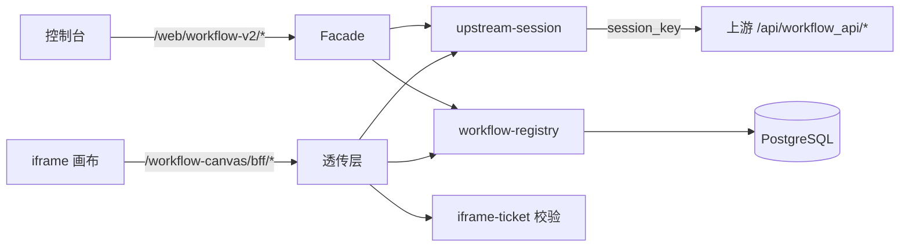

# Workflow V2：接入上游工作流引擎画布与工作流平台设计

> 状态：设计草案（待评审）
> 日期：2026-09-29
> 关联仓库：`/Users/konghayao/code/ai/workflow-studio`（上游工作流引擎，下文简称 **上游**）
> 关联文档：`docs/design/ce-ee-refactoring/ce-ee-engineering-standards.md`、`docs/developer/guide/backend-development.md`

## 1. 背景、目标与非目标

### 1.1 背景

- 我方现有 workflow 前端（`packages/resources/workflow/web`，约 100 文件 / 1.7 万行）与后端（`packages/resources/workflow` + `packages/workflow-engine`）为自研实现，画布基于 `@xyflow/react`，能力与产品体验上限有限。
- 上游工作流引擎 提供了成熟的工作流平台：FlowGram 画布（编辑态）、节点体系、调试运行（test_run + 轮询）、版本发布、运行 trace，并且其 Go 服务启动时**自带前端静态资源**。
- 本次决策：删除我方全部 workflow 前端界面，新增 **workflow-v2** 后端模块转接上游的 workflow 能力；控制台通过 **iframe 嵌入上游画布页面**，画布内请求**透传给 workflow-v2**，由 workflow-v2 以平台身份转接上游后端。

### 1.2 目标

1. 删除我方 workflow 前端界面（页面、路由、导航接线、i18n、测试、生成物），不删除我方 workflow 后端与引擎（仍有 `/api/workflows/:id/execute`、`/hooks/:publicHash` 等消费者）。
2. 新增 `workflow-v2` 模块，落地身份映射：
   - **FenixAgent 平台整体 ↔ 上游的 1 个用户**（其个人空间是唯一 space）；
   - **租户（organization）↔ 上游的 1 个 App（bot）**；
   - 每个用户创建的 workflow 创建在该租户 App 下（`space_id`=平台个人空间，`project_id`=租户 App）。
3. 控制台提供最小可用界面：workflow 列表/创建/重命名/删除 + 画布宿主页（iframe）；画布内完成编辑、调试运行、发布。
4. 首版只覆盖**工作流本身**：基础节点（开始/结束/LLM/HTTP/代码/条件/问答/文本处理/变量等），不含知识库、插件、数据库、子流程、循环等重型节点。

### 1.3 非目标

- **不修改上游的 Go 后端**（黑盒集成），只使用其现成 HTTP API，并允许改造其**前端**代码以适配嵌入与透传。
- 不把上游前端源码整体拷贝进本仓，不自研画布（复制 20+ 子包及其构建链等于承接其全部升级成本）。
- 不承诺上游能力（知识库/插件/发布渠道）与我方能力打通。
- 不在本设计内决定我方 workflow 后端的最终去留；本期只冻结“前端删除 + v2 并存”的边界。

### 1.4 关键决策摘要

| 决策 | 结论 |
|---|---|
| 平台身份 | FenixAgent 整体 ↔ 上游 1 个用户，1 个个人空间 |
| 租户映射 | organization ↔ 上游应用（bot，`/api/draftbot/create` 创建） |
| workflow 归属 | 创建时 `space_id`=平台空间、`project_id`=租户 App |
| 归属校验 | 上游侧只校验 space 成员关系（`checkUserSpace`）、不校验 workflow↔App → **归属校验必须由 workflow-v2 的本地元数据承担** |
| 集成形态 | iframe 嵌入 + 同源反代；不拷贝源码、不做 Module Federation |
| 请求路径 | 画布 → `/workflow-canvas/bff/*`（workflow-v2 透传，参数注入+归属校验）→ 上游 `/api/workflow_api/*` |
| 画布认证 | 控制台签发一次性 code → iframe 兑换短期 HMAC ticket（内存持有，请求头携带） |
| 上游认证 | 平台账号 email/password（env secret）→ passport 登录拿 `session_key`（仅出现在 `Set-Cookie`），workflow-v2 内存持有 + 单飞重登 |
| 控制台界面 | 新包 `packages/resources/workflow-v2/web`：列表页 + 画布宿主页；导航 id `workflow`、路由 `/agent/workflow*` 保持不变 |

## 2. 总体架构

```text
┌─────────────────────────── 浏览器（控制台域 console.<domain>）───────────────────────────┐
│  apps/web 控制台                                                                          │
│   /agent/workflow            列表页（/web/workflow-v2/*）                                  │
│   /agent/workflow/$id/edit   画布宿主页（iframe）                                          │
│      └─ iframe src=/workflow-canvas/?wf=..&view=..  ──────┐                               │
└───────────────────────────────────────────────────────────┼───────────────────────────────┘
                                                            │ postMessage（code/ticket/navigate）
┌───────────────────────────────────────────────────────────▼───────────────────────────────┐
│  apps/server（我方可信边界）                                                                │
│   /web/workflow-v2/*       控制台管理面（会话 cookie 鉴权）                                  │
│   /workflow-canvas/*       反代上游静态资源（SPA，basename=/workflow-canvas）             │
│   /workflow-canvas/bff/*   workflow-v2 画布透传面（ticket 鉴权）→ 注入 space_id/project_id   │
└───────────────────────────────────────────┬───────────────────────────────────────────────┘
                                            │ 平台账号 session_key（Cookie）
                              ┌─────────────▼──────────────┐
                              │  上游服务（黑盒，内网）      │
                              │  /api/workflow_api/*        │
                              │  （Go + Hertz，自带前端静态）  │
                              └────────────────────────────┘
```

两条数据流：

1. **管理面**（我方体系内闭环）：控制台会话 → `/web/workflow-v2/*` → workflow-v2（Facade 鉴权 + 归属校验）→ 必要时代调上游 `/api/workflow_api/*` → 归一化为 `{success,data}`。
2. **画布面**（上游协议透传）：iframe 页面 → `/workflow-canvas/bff/api/workflow_api/*`（ticket 鉴权，服务端注入 `space_id`/`project_id`、校验 `workflow_id` 归属）→ 上游原样调用 → **响应原样回传**（保持上游的 `{data,code,msg}` 形状，画布 SDK 依赖该形状）。

组件职责：

| 组件 | 职责 | 不负责 |
|---|---|---|
| 控制台（apps/web） | 列表/创建/删除、iframe 宿主、握手与票据转发、错误与降级 UI | 不直连上游；不持有平台凭据 |
| workflow-v2（后端） | 身份映射、归属真相源、参数注入、票据签发与校验、上游会话、透传、审计 | 不解释 workflow schema；不执行节点 |
| 上游服务 | workflow 定义/版本/运行/发布的权威实现；画布静态资源 | 不感知我方租户与用户 |

## 3. 身份与租户映射

### 3.1 平台账号（1 个上游用户）

- 平台在上游侧注册/持有一个服务账号，其个人空间（space）是平台所有 workflow 的物理容器。
- 凭据（email/password）只存在于 workflow-v2 部署环境的 secret（`envDefinitions` 的 `secret: true`），不入库、不入日志、不进响应、不进前端 bundle。
- 登录方式：`POST /api/passport/web/email/login/`；`session_key` **只出现在 `Set-Cookie`**，响应体 `code/msg/data` 不含凭据，实现时必须解析响应头而非 body。

### 3.2 租户 → App（bot）

- 租户首次使用 workflow-v2 时，workflow-v2 调用 `POST /api/draftbot/create` 在平台空间下创建该租户的 App，并写入本地映射表。
- App 是租户资源的物理边界：workflow 创建时带 `project_id`=App id；列表查询强制带 `project_id` 过滤。
- 映射关系以我方数据库为真相源（`workflow_v2_org_app`），App 在上游侧的展示信息由 workflow-v2 维护。

### 3.3 用户级归属与可见性

- 上游侧所有 workflow 的 `creator` 都是平台账号，**无法表达我方用户归属**；因此 workflow-v2 必须维护本地注册表（`workflow_v2_workflow`）记录：`organization_id`、`upstream_workflow_id`、`owner_user_id`、可见性、发布状态快照。
- 所有涉及 `workflow_id` 的请求：先按本地注册表校验「存在 + 属于当前组织 + 当前用户有权操作」，未命中一律返回 404（不泄漏资源存在性），再转发上游。
- 跨组织隔离不依赖上游的 `checkUserSpace`（它只证明「平台账号属于该 space」）。这是本设计的**核心安全约束**。

### 3.4 一致性策略

| 数据 | 真相源 | 同步策略 |
|---|---|---|
| workflow schema、版本、发布状态、运行记录 | 上游 | 透传读取；列表以上游分页结果为主 |
| 归属（org/app/owner）、本地可见性、审计 | 我方 | 创建走「先上游后本地 + 失败补偿删除」；本地缺失时按需补写 |
| 删除 | 双方 | 我方软删 + 调上游删除；上游删除失败置 `sync_state=pending_delete`，由对账任务重试 |

## 4. workflow-v2 后端设计

### 4.1 模块位置与分层

新增 `packages/resources/workflow-v2`（包名 `@fenix/resource-workflow-v2`），与现有 `packages/resources/workflow` 并存（后者本期只删前端）。目录遵循后端开发规范：

```text
packages/resources/workflow-v2/
  fenix.module.ts            # route 贡献（web / canvas）+ envDefinitions
  db/schema.ts               # 本地元数据表（Drizzle，经 exports["./db"] 公开）
  src/server/
    routes/web/              # /web/workflow-v2/*（控制台面）
    routes/canvas/           # /workflow-canvas/bff/*（画布透传面）
    facades/                 # 授权、租户解析、编排（org → app → workflow 链路）
    services/
      upstream-client.ts         # 透传、参数注入、错误映射、超时与重试预算
      upstream-session.ts        # passport 登录、session_key 生命周期、单飞重登
      iframe-ticket.ts       # 一次性 code 与短期 ticket 的签发/兑换/撤销
      workflow-registry.ts   # 本地注册表读写与对账
      node-scope.ts          # 节点白名单过滤
    repositories/            # 仅封装持久化与事务原语
  web/                       # 控制台界面（列表页、iframe 宿主、api、i18n、contribution）
```



### 4.2 上游接口最小集

以下路径已对照上游 `idl/workflow/workflow_svc.thrift` 与前端生成物 `frontend/packages/arch/idl/src/auto-generated/workflow_api/index.ts` 核验。

| 上游接口 | 用途 | 服务端注入/重写 | 归属校验 |
|---|---|---|---|
| `POST /api/workflow_api/workflow_list` | 列表 | 强制 `space_id`=平台空间、`project_id`=租户 App；忽略 `login_user_create` | App 属于当前 org |
| `POST /api/workflow_api/create` | 新建 | `space_id`、`project_id`；清空 `bind_biz_*` | 租户已绑定 App |
| `POST /api/workflow_api/canvas` | 拉画布 | `space_id` | `workflow_id` ∈ 本租户 |
| `POST /api/workflow_api/history_schema` | 版本历史 | `space_id` | 同上 |
| `POST /api/workflow_api/save` | 保存草稿 | `space_id`；`commit` 一致性以服务端校验为准 | 同上 |
| `POST /api/workflow_api/latest` / `submit` | 提交版本 / 冲突检查 | `space_id` | 同上 |
| `POST /api/workflow_api/update_meta` | 重命名/描述/图标 | `space_id` | 同上 |
| `POST /api/workflow_api/delete` / `batch_delete` / `delete_strategy` | 删除与引用策略 | `space_id` | 同上 + 本地软删 |
| `POST /api/workflow_api/test_run` / `test_resume` / `cancel` | 调试运行 | `space_id`、`bot_id`/`project_id` | 同上 |
| `GET /api/workflow_api/get_process` / `get_node_execute_history` | 运行过程轮询 | `space_id` | 同上 |
| `POST /api/workflow_api/publish` | 发布版本 | `space_id`；`workflow_version` 由 workflow-v2 递增生成 | 同上 |
| `POST /api/workflow_api/list_publish_workflow` | 发布记录 | `space_id`、`owner_id` 收窄为平台账号 | 同上 |
| `POST /api/workflow_api/list_spans` / `get_trace` | 运行 trace | `space_id` | 同上 |
| `POST /api/workflow_api/node_type` / `node_template_list` / `node_panel_search` | 节点面板 | `space_id`；**响应按白名单过滤**（§4.8） | 同上 |
| `POST /api/workflow_api/validate_tree` | 画布校验 | `space_id` | 同上 |
| `POST /api/workflow_api/sign_image_url`、`copy`、`released_workflows`、`workflow_detail*` | 按画布实际调用补入 | `space_id` | 同上 |
| `POST /api/draftbot/create` | 建租户 App（运维面） | `space_id` | 平台运维动作 |
| `POST /api/passport/web/email/login/` | 平台账号登录（运维面） | — | 平台运维动作 |

### 4.3 控制台接口面（`/web/workflow-v2/*`）

统一响应 `{ success, data }` / `{ success: false, error }`，会话 cookie 鉴权，全部按 `activeOrganizationId` 做组织隔离。

| Method + Path | 请求 | 响应 |
|---|---|---|
| `GET /platform-account` | — | `{ platformUserId, spaceId, status, lastProbeAt }`（**不含凭据**） |
| `POST /platform-account/login` | `{ reason? }` | `{ status }`（系统管理员触发重登） |
| `GET /org-app` | — | `{ appId?, status }` |
| `POST /org-app` | `{ name }` | `{ appId }`（建租户 App 并绑定） |
| `POST /org-app/rebind` | `{ appId }` | `{ ok }` |
| `GET /workflows` | query `page/size/name/status` | `{ items: [{ id, upstreamWorkflowId, name, desc, iconUri, status, ownerUserId, publishedVersion, updatedAt }], total }` |
| `POST /workflows` | `{ name, desc?, iconUri? }` | `{ id, upstreamWorkflowId }` |
| `PATCH /workflows/:id` | `{ name?, desc?, iconUri? }` | `{ ok }` |
| `DELETE /workflows/:id` | query `force?` | `{ deleted, strategy? }` |
| `POST /workflows/:id/publish` | `{ description?, force? }` | `{ version, commitId }` |
| `POST /iframe-code` | `{ workflowId, view? }` | `{ code, expiresIn }`（一次性，60s，绑定 user+org+workflow） |

### 4.4 画布透传面（`/workflow-canvas/bff/*`）

| Method + Path | 说明 |
|---|---|
| `POST /session/exchange` | `{ code }` → `{ ticket, expiresAt }`，code 单次消费 |
| `POST /session/refresh` | ticket 续期（≤ 控制台会话剩余时长） |
| `POST /session/revoke` | 登出/切组织时撤销 |
| `ALL /api/workflow_api/*` | 透传：ticket 鉴权 → 归属校验 → 参数注入 → 上游调用 → **原样回传上游响应** |

两条响应口径**在路由层分界，不得混用**：`/web/*` 归一化为我方 `{success,data}`；`bff` 面保持上游原生 `{data,code,msg}`（画布 SDK 依赖该形状）。

### 4.5 数据模型（Drizzle，owner：workflow-v2 包 `db/schema.ts`）

| 表 | 关键字段 | 约束 |
|---|---|---|
| `workflow_v2_platform_account` | `platform_user_id`, `platform_space_id`, `email`, `status`, `last_login_at`, `last_probe_at`, `last_error` | 单行；**不存 session_key** |
| `workflow_v2_org_app` | `organization_id`, `app_id`, `status` | `unique(organization_id)`、`unique(app_id)` |
| `workflow_v2_workflow` | `id`, `organization_id`, `upstream_workflow_id`, `app_id`, `name`, `owner_user_id`, `visibility`, `published_version`, `sync_state`, `deleted_at` | `unique(upstream_workflow_id)`、`index(organization_id, deleted_at)` |
| `workflow_v2_audit_log` | `organization_id`, `actor_user_id`, `action`, `upstream_workflow_id`, `request_id`, `result`, `error_code`, `created_at` | `index(organization_id, created_at)` |

迁移流程遵循仓库规范：`bun run db:generate --name workflow-v2-<change>` → 审查 SQL → `bun run db:migrate`；`drizzle.config.ts` 需登记新包 schema 出口。

### 4.6 上游会话管理

- **登录**：`POST /api/passport/web/email/login/`（email/password 来自 env secret）；解析 `Set-Cookie` 取 `session_key`（**响应体不含凭据**）。
- **持有**：仅进程内存单例（模块私有）；不落库、不入日志、不进响应；多副本部署时需要确认是否能各自独立登录（见 §9 待验证清单）。
  - **状态更新（2026-09-29，4B）**：待验证项已定论——§9.1.1 第 3 条实测「同一账号单会话、重登即踢旧键」，故多副本**不能各自独立登录**；会话权威副本已移到共享存储（Redis）+ 登录租约，不可用时才降级进程内单例并节流告警，见 [25-workflow-v2](../arch/25-workflow-v2.md) §6 第 6 条。
- **有效期**：上游侧声明约 30 天（`SessionMaxAgeSecond`），实施时以实测为准；到期前主动探活刷新。
- **失效识别**：HTTP 401 或响应 `code` 命中鉴权失败码；触发**单飞重登**（互斥锁，仅重放一次原请求），失败即返回 `PLATFORM_SESSION_UNAVAILABLE`。
- **降级**：只读接口可回退到本地元数据视图（列表降级为本地注册表数据并标注 stale）；写接口直接失败，不做无边界重试；不静默切换账号。

### 4.7 透传工程规则

- **参数注入白名单**（服务端覆盖，客户端同名一律 strip）：`space_id`、`project_id`、`bot_id`、`owner_id`、`login_user_create`、`creator/operator`；`workflow_id` 只做归属校验不改写。
- **超时与重试**：只读接口（canvas/list/get_process/node_type）超时 10s、退避重试 ≤ 2；写接口（create/save/submit/publish/test_run/delete）**不自动重试**，以幂等键/版本号互斥兜底。
- **限流与背压**：按组织 + 全局令牌桶；`get_process` 轮询设预算与退避；SSE 通道单独超时与心跳。
  - **实现现状（2026-09-29，4B）**：维度改为**按票据 `sub`**（画布透传）/ **按来源地址**（免票的 `session/exchange` 与无有效票据的续期撤销），桶在**进程内**——多副本下实际阈值 ≈ 配置值 × 副本数，全局阈值归部署层；`get_process` 轮询预算已按本条落地，超限返回真实 429 + `Retry-After`；本包当前无 SSE 面（画布用 iframe + BFF 轮询）。见 [25-workflow-v2](../arch/25-workflow-v2.md) §5 工程口径。
- **错误映射**：`code≠0`/4xx → `UPSTREAM_PERMISSION_DENIED | NOT_FOUND | INVALID_REQUEST`；5xx/超时 → `UPSTREAM_UNAVAILABLE`（标记可重试）；日志保留 `upstreamCode/upstreamLogId`，响应不泄漏上游原文敏感字段。
- **审计与可观测**：审计表 + 结构化日志 `{ module, orgId, userId, upstreamWorkflowId, upstreamLogId, action, upstreamStatus, durationMs, ticketJti }`；指标：上游成功率与延迟分位、会话重登次数、票据签发/校验失败率、限流拒绝数。

### 4.8 节点范围裁剪（首版白名单）

- **权威白名单由 workflow-v2 承担**：在 `node-scope.ts` 对 `node_type`、`node_template_list`、`node_panel_search` 的响应做过滤，客户端无法绕过。
- **保留**：`start`、`end`、`llm`、`http`、`code`、`if`（条件）、`question`（问答）、`output`、`text-process`、`json-stringify`、`input`、`set-variable`、`variable`、`comment`。
- **剔除**：`loop`、`batch`、`break`、`continue`、`sub-workflow`、`plugin`、`dataset/*`、`database/*`、`ltm`、`image-*`、`trigger-*`。
- 画布侧注册表**保持完整**（不做删除），以保证存量 workflow JSON 反序列化不出现 Unknown 节点；隐藏入口只依赖服务端过滤（若面板存在前端硬编码分类，再叠加前端过滤）。

## 5. 画布集成（iframe）

### 5.1 部署形态与同源反代

- 上游服务（Go + 自带前端）部署在内网，作为静态资源与 API 上游。
- 控制台域（`console.<domain>`）下由我方服务器反代：
  - `/workflow-canvas/*` → 上游静态资源（SPA，需上游前端支持 `basename=/workflow-canvas` 与资源前缀）；
  - `/workflow-canvas/bff/*` → workflow-v2 透传面（**必须优先于静态反代匹配**，否则请求会被吞掉）。
- 同源（same-origin）带来三个收益：无 CORS、cookie 同站可直接用于控制台会话、ticket 通过请求头传递最简单。
- 开发态：上游前端 dev server 将 `/workflow-canvas/bff` 代理到 workflow-v2；我方 dev 环境将 `/workflow-canvas` 代理到上游服务。

### 5.2 握手协议与票据

iframe URL 约定：

```text
/workflow-canvas/work_flow?workflow_id=<upstreamWorkflowId>&space_id=<platformSpaceId>
                        &apiBase=/workflow-canvas/bff&lng=zh-CN&theme=light
```

**参数映射责任方在宿主页**（1I）：上游画布入口是从 query 读 `workflow_id` / `space_id` 的（`frontend/packages/workflow/adapter/playground/src/hooks/use-page-params.ts`），i18n 检测器读的是 `lng`（`packages/arch/i18n/src/raw/index.ts` 的 `querystring → cookie → localStorage → navigator` 顺序）。
宿主页必须**直接拼上游认识的名字**，不要自造 `wf` / `view` / `locale` 一套参数再指望画布侧翻译（1F 实测结论见 `2026-09-29-workflow-v2-upstream-frontend-changes.md` §1.3）。
`apiBase` 由 1F 的 `host-bridge` 读取，用来决定 API 基址；缺省时画布按同源相对路径发请求。
**workflow 标识仍不放 URL**：URL 里的 `workflow_id` 是上游侧 id，平台侧归属校验只认 ticket 的 `wf` claim（见 §5.3 越权行）。

父子消息（`postMessage`，envelope `{ v, id, type, ts, payload }`，父→子固定 `targetOrigin`，子→父校验 `event.origin`）：

| type | 方向 | 语义 |
|---|---|---|
| `ready` | 子→父 | 画布挂载完成（含 build、capabilities）；父未绑定时按 500ms 重试发送 `bind` |
| `bind` / `bound` | 父→子 / 子→父 | 父下发一次性 `code`；子兑换后回报 `{ ok, expiresAt }` |
| `refresh-request` / `token` | 子→父 / 父→子 | 票据过期前 2 分钟，父静默换新 code 并下发 |
| `navigate-out` | 子→父 | 画布内返回/跳转请求，交由宿主路由处理（不允许 iframe 自行整页跳转） |
| `error` | 子→父 | 子侧致命错误（含 `code`、`retryable`），父端展示降级页 |
| `signout` | 父→子 | 登出/切组织，画布进入中性页 |
| `resize` / `theme` / `locale` | 双向 | 尺寸与外观同步 |

票据链路：

1. 宿主（控制台）以会话 cookie 调 `POST /web/workflow-v2/iframe-code` 取**一次性 code**（60s，绑定 user + org + workflow）。
2. 宿主经 `postMessage` 下发 code（**不放入 URL**：URL 会进 referrer、历史、代理日志）。
3. 画布调 `POST /workflow-canvas/bff/session/exchange` 兑换**短期 ticket**：`base64url(payload).base64url(HMAC-SHA256)`，payload `{ typ, sid, sub, org, wf, iat, exp, jti }`，TTL 15 分钟，与既有 skill 下载令牌同构（`packages/resources/skill/src/server/services/skill-download-token.ts`）。
4. 画布所有透传请求携带 `X-Fenix-Workflow-Ticket`；过期由 `refresh-request` 兜底，401 走同一路径。
5. 登出/切组织：宿主调 `POST /web/workflow-v2/iframe-code` 无关的 `session/revoke` + `signout`；撤销记录保留至票据最大 TTL。

### 5.3 安全设计

| 面 | 约束 |
|---|---|
| CORS | 同源反代下无需 CORS；若未来拆子域，显式 origin 白名单、`credentials:false`、仅收 header 票据，禁用 `*` |
| Cookie | 控制台会话维持 `HttpOnly; Secure; SameSite=Lax`；反代剥离上游 `Set-Cookie`；画布不写平台 cookie |
| iframe | `sandbox="allow-scripts allow-same-origin allow-forms allow-popups allow-downloads allow-modals"`、`referrerpolicy="no-referrer"`；明示：`allow-same-origin` 与 `allow-scripts` 并存时 sandbox 不构成安全边界，真实边界是 CSP + ticket + BFF 校验 |
| CSP | 控制台 `frame-ancestors 'self'`；画布响应（反代层注入）`frame-ancestors 'self'`、`frame-src 'self'` |
| 票据保护 | 仅请求头传递；日志只记 `sid`/`jti` 前缀；不入 query、不入 referrer、不入前端持久化（内存持有） |
| 越权 | 每请求复核 ticket ↔ workflow 归属；跨租户统一 404；平台账号 session 只存于 workflow-v2 |
| 防重放 | code 单次消费 + `jti` 去重；时钟偏差容忍 ±60s；撤销表兜底 |
| 审计 | 记录时间、user、org、workflow、sid、方法、归一化路径、状态、耗时、上游请求 id；不记 body 与凭据 |

### 5.4 异常与体验

- **上游不可用**：workflow-v2 熔断返回 503，画布显示「工作流服务暂不可用」+ 重试（0.5s/1.5s/4s，之后 30s 自动重试）；不阻塞控制台其它页面。
- **加载态**：`ready` 前渲染等高骨架；10s 未就绪显示错误卡并区分「加载失败 / 初始化超时」。
- **会话过期**：刷新失败展示覆盖层提示，登录后按 `wf` 深链回跳。
- **多标签页**：每标签独立 `sid`；登出经 `BroadcastChannel` 广播 `signout`。
- **深链与返回**：列表 → `/agent/workflow/$id/edit` → 画布；画布内返回经 `navigate-out` 交宿主路由（遵守仓库「禁止 window.location」导航约束）。
- **主题与尺寸**：父端变更即时下发；`ResizeObserver` + `resize` 消息并 clamp 视口高度。

### 5.5 上游侧前端改造清单（交付给上游仓的需求）

> 路径相对上游仓根；改造只动 `frontend/`，不动 Go 后端。

| 改造项 | 文件/模块 | 改动与验收 | 工作量 |
|---|---|---|---|
| API baseURL 与鉴权注入 | `frontend/packages/arch/bot-http/src/axios.ts` | 请求拦截器注入 `baseURL`（指向 `/workflow-canvas/bff`）与 `X-Fenix-Workflow-Ticket`；验收：画布全部请求命中 workflow-v2 | S |
| 401 解除整页劫持 | 同上（现 `redirect(redirect_uri)`） | 改为 `postMessage` 发 `refresh-request` 并等待 `token` 后重放一次（**消息类型以接口冻结 §7 为准，不使用早期的 `auth-expired` 命名**）；非嵌入场景保持整页跳转不变；验收：嵌入下 401 不跳转、由宿主接管 | S |
| 一次性 code 兑换与续期 | `frontend/packages/arch/bot-http/src/host-bridge.ts`（1F 已落地） | 接收 `bind` 消息 → 兑换 ticket（仅内存）→ `refresh-request` 续期；验收：无 URL 凭据、可续期 | M |
| 路由 basename 与资源前缀 | `frontend/apps/coze-studio/src/routes/index.tsx`（`createBrowserRouter`）与 rsbuild 配置 | 单变量 `WORKFLOW_CANVAS_BASE`（默认 `/`）同时驱动 `output.assetPrefix` 与 router basename；**二者缺一即白屏**；验收：子路径直达与刷新均不 404 | M |
| Space/用户态注桩 | `frontend/packages/workflow/playground/src/workflow-playground.tsx`（`useSpaceStore` 分支）与 `global-adapter` 的 `useUserInfo` | 跳过空间列表拉取、写入满足 `setSpace`/`checkSpaceID` 的 stub（`inited:true`）、最小 user stub；验收：无上游登录态可独立渲染 | M |
| ~~Provider 自举~~ **（已核销：不需要）** | — | 1F 实测：Theme Provider 由应用壳提供、i18n 是模块单例且语言可经 `lng` 注入、全局常量是构建期 define——只要走同一 rsbuild 管线就不缺，**无需新增 Provider**。真正要做的是去掉画布路由的登录闸门（`requireAuth`，用嵌入判定分支，不要改 `useCheckLogin` 本身）。验收：直开画布无 `ReferenceError` 且不跳登录页 | S |
| 壳与导航裁剪 | `frontend/packages/workflow/playground/src/components/workflow-header/index.tsx`、`publish-button-v2/*`、`adapter/playground/src/hooks/use-navigate-back.tsx` | 隐藏返回、Reference、协作者、积分、渠道发布等入口；返回/发布改走 `postMessage`；验收：头部仅保留历史、调试、发布（简版） | M |
| 节点面板过滤（兜底） | `frontend/packages/workflow/playground/src/components/node-panel/hooks/use-search-node.ts` | 若存在前端硬编码分类，按同一白名单过滤；验收：面板仅出现保留节点 | S |
| 埋点与上报静默 | `frontend/packages/arch/{tea,slardar,report-events,report-tti}` | 关闭或不初始化上报；验收：请求面板无第三方埋点流量 | S |
| 反代与响应头 | 我方服务（`packages/resources/workflow-v2` 的 `routes/canvas/static-proxy.ts`，无外部 nginx） | 入站剥离上游 `Set-Cookie`、注入 `frame-ancestors 'self'`；**出站必须注入平台账号 `session_key`**——上游除静态白名单外全站过 session 中间件，实测 `/workflow-canvas/*` 不带 cookie 时连 JS 都 401（见接口冻结 §2.1.1 / 设计 §9.1.1 第 2 条）；验收：可嵌入、仅同源可嵌、子路径资源可达 | S |

### 5.6 方案取舍

- **选择 iframe + BFF 票据**：上游画布是持续演进的重型前端（20+ 子包、生成式 IDL、主题与 i18n 体系、596 个文件依赖其内部设计系统）；拷贝源码等于承接其构建链与全部升级成本，与「删除自研 workflow 前端」的目标相悖；Module Federation 要求跨仓 lockstep 共享 React 与构建版本，运行时契约脆弱且无法约束子应用网络行为。
- **放弃条件**：出现必须共享 React context / DOM 的深度交互；`bind`/`refresh` 失败率长期 > 1%；上游前端无法完成上述裁剪。
- **迁移路径**：① 同源反代 + ticket（本次）→ ② 拆子域 + 强 sandbox + CORS（如需更硬隔离）→ ③ 若深度集成确有必要，把上游的 workflow 包以 npm 依赖引入本仓，保留 BFF 与票据协议不变，iframe 退化为降级路径。

## 6. 控制台界面替换与删除计划

### 6.1 保留的导航与路由

- 侧栏导航项 id 保持 `workflow`（`groupId: core`、`order: 30`），文案与图标零变化（新包复用 `workflows` i18n 命名空间与 `nav.workflow` 键）。
- 路由 `/agent/workflow`（列表）保留；`/agent/workflow/$id/edit` 改为画布宿主页；`/agent/workflow/$id/versions` 删除（版本与发布在画布内完成）。

### 6.2 新界面（`packages/resources/workflow-v2/web`）

| 页面 | 内容 | 必备状态 |
|---|---|---|
| 列表页 | 表格（名称、状态、发布版本、负责人、更新时间）、创建、打开画布、删除 | loading / empty / error+retry / 删除确认与失败回滚提示 / 权限不足态 |
| 画布宿主页 | 全高 iframe、握手（bind/refresh/signout）、错误与超时降级、返回导航 | 骨架 / 初始化超时 / 上游不可用 + 重试 / 会话过期覆盖层 |

请求一律经 `@fenix/web-runtime/api/request` + `unwrap()`；组件复用 `@fenix/ui-components`，图标用 `lucide-react`，用户可见文案全部走 `t()`。

### 6.3 删除清单

| 动作 | 目标 |
|---|---|
| 删除目录 | `packages/resources/workflow/web/**`（含 `__tests__`、`contribution.ts`、`i18n`、`api`，约 100 文件） |
| 删除文件 | `apps/web/src/routes/agent/_panel/workflow_.$id.versions.tsx`、`apps/web/src/hooks/use-open-workflow-editor.ts` |
| 重写文件 | `apps/web/src/routes/agent/_panel/workflow.tsx`（新的列表页接线）、`workflow_.$id.edit.tsx`（iframe 宿主） |
| 修改 | `packages/resources/workflow/fenix.module.ts`（移除 `web` 贡献块，保留服务端 8 条贡献）、`packages/resources/workflow/package.json`（移除 `./web*` exports 与前端依赖 `@xyflow/react` 等） |
| 修改 | `apps/web/src/i18n/index.ts`（工作流命名空间登记改指向新包）、`apps/web/package.json`（依赖替换为 `@fenix/resource-workflow-v2`） |
| 修改 | `apps/web/src/__tests__/web-contributions.test.ts`、`shell-navigation.test.ts`、`package-error-text-echo.test.ts`（快照与引用更新） |
| 修改 | `deploy/manifests/modules.json`（新增 workflow-v2 模块条目）、`deploy/assembly/ce.json`（web 列表替换） |
| 重跑生成物 | `apps/generated/web-contributions.ts`、`apps/web/src/routeTree.gen.ts`（生成器会校验 exports，**必须与目录删除同批落盘**，否则 `precheck` 失败） |

**保留不动**：`packages/resources/workflow/src/server/**`（`/web/workflow-defs`、`/web/workflow-runs`、`/api/workflows/:id/execute`、`/hooks/:publicHash` 等）、`packages/workflow-engine`、全部 workflow 相关 DB 表与迁移。API 面文档中标注「控制台界面已由 workflow-v2 接管」即可。

### 6.4 执行顺序与验证

1. 新包与生成物先落盘（`bun run generate:web-contributions` + 路由生成），确认 `routeTree.gen.ts` 不再引用被删文件；
2. 同批删除旧 web 目录与 exports，更新宿主接线；
3. 验证：`bun test apps/web/src/__tests__/<相关>`、`bun run build:web`、`bun run precheck` 全绿；
4. 回归检查：侧栏导航与文案不变；`/api/workflows/:id/execute`、hooks 路径（webhook）行为不变。

## 7. 分阶段交付（垂直切片）

> 每层从最小端到端版本起步，保持可测试、可观测、可回滚，不一次性铺完整层再联调。

### 阶段 0：连通性与事实核验（无用户可见变更）

- 部署上游服务（内网、自带前端），验证 `make fe` 产物与静态服务路径；
- 用脚本完成平台账号注册/登录、建 App、建 workflow、保存、`test_run` 全链路调用，逐条核销 §9 的「待运行时验证清单」；
- 交付物：核验记录（更新进本文档附录）；回滚：无落地变更。

### 阶段 1：画布可达（打通 iframe 与票据）

- workflow-v2 骨架（module、route 贡献、`envDefinitions`、db schema、审计表）；
- `/workflow-canvas/*` 反代与 `/workflow-canvas/bff/*` 透传最小集（canvas / save / node_type）；
- 画布宿主页 + 握手协议 + 一次性 code/ticket 全链路；
- 上游侧前端完成 §5.5 前 4 项改造；
- 验证：打开一个手工在上游建的 workflow，编辑并保存成功；伪造 `space_id`/`project_id` 被服务端覆盖；跨租户 ticket 被拒（404）；
- 回滚：隐藏导航入口（路由回滚到旧实现）。

### 阶段 2：CRUD 闭环与旧前端下线

- 租户 App 映射、workflow 列表/创建/重命名/删除（含本地注册表与创建补偿）；
- 节点白名单过滤上线（§4.8）；
- 同批执行 §6.3 删除清单，新列表页替换旧页面；
- 验证：新租户首次访问自动完成 App 绑定；列表/创建/删除全流程；`bun run precheck` + `bun run build:web` 全绿；侧栏与路由无回归；
- 回滚：恢复上一个 release tag（旧前端随之恢复；上游侧数据不删除）。

### 阶段 3：调试与发布

- `test_run` / `test_resume` / `cancel`、过程轮询、`publish`、发布记录与运行 trace；
- 审计与指标接入；错误降级与重试预算；
- 验证：编辑→调试→发布→运行历史闭环；上游 503 时控制台其余功能不受影响；
- 回滚：关闭画布内发布入口（保留编辑与调试）。

### 阶段 4：对账与加固

- `sync_state` 对账任务（`pending_delete`、孤儿 workflow 补写）；
- 限流与配额、压测、会话探活告警；
- 验证：删除失败重试收敛；并发压测下无连接耗尽与错误风暴。

## 8. 验证与可观测性

### 8.1 测试重点（后端，`packages/resources/workflow-v2/src/__tests__/`）

- 票据：签发/兑换/过期/重放/撤销/跨租户（必须 404）；
- 参数注入：客户端伪造 `space_id`、`project_id`、`owner_id` 一律被覆盖；
- 归属校验：本地注册表缺失或归属不符时拒绝且不泄漏存在性；
- 会话：401 单飞重登、重放一次原请求、连续失败降级 `PLATFORM_SESSION_UNAVAILABLE`；
- 错误映射与幂等：只读可重试、写接口不重试、删除失败置 `pending_delete`；
- 节点白名单：三类节点接口的过滤结果稳定（含分页与分类）。

### 8.2 测试重点（前端）

- 列表页：loading/empty/error+retry/删除失败回滚、权限不足态；
- 宿主页：握手时序（ready→bind→bound）、超时降级、`navigate-out` 交宿主路由；
- 使用 stub 模拟 `postMessage` 与 BFF，不做跨域真实联调断言。

### 8.3 观测

- 指标：上游成功率/延迟分位、会话重登次数、票据签发与校验失败率、`canvas_ready_latency`、限流拒绝数；
- 日志：结构化字段见 §4.7，凭据与 ticket 全文禁止入日志；
- 健康检查：聚合「画布静态可达」「上游轻量接口探活」「平台会话有效」，失败降级为 `degraded` 并驱动前端降级页；
- 告警：会话失效、上游 5xx 比例、票据失败率、下游补偿积压。

## 9. 风险与开放问题

### 9.1 待运行时验证清单（阶段 0 必须逐条核销）

1. BFF 以服务端身份（无浏览器 Cookie/CORS 上下文）调用 `/api/workflow_api/*` 是否受 Origin/CSRF/UA 校验；
   - ✅ 结论：**无 Origin/CSRF/UA 校验**，服务端身份带 `Cookie: session_key` 即可直连；但必须 `POST` + `Content-Type: application/json`，否则请求体不参与绑定。证据：`curl -X POST /api/workflow_api/workflow_list -H 'Cookie: session_key=<redacted>'`（不带 Origin/Referer、UA 置空）→ `HTTP 200 {"code":0,...workflow_list[...]}`；追加 `Origin: https://evil.example` 与 `Origin/Referer: http://localhost:5173` 均仍返回 `code:0`；去掉 Cookie → `HTTP 401 {"code":401,"msg":"missing session_key in cookie"}`；改用 `GET` → `HTTP 404 {"code":404,"msg":"not found"}`；`Content-Type: text/plain` → `HTTP 200 {"code":777777775,"msg":"Workflow operation failure: space id is required"}`（body 未绑定，实现时须固定 JSON 头）。
2. `project_id` 挂载的 workflow 是否必须随 App 发布才能运行；`test_run` 在 App 内是否可独立调试；
   - ✅ 结论：App 内的 workflow **无需随 App 发布即可独立 test_run**（探针 workflow 全程 `status=0`，调试跑通 `executeStatus=2`）；`test_run` 甚至**只传 `space_id` 即可**，`project_id`/`bot_id` 非必需。但调试通道**对模型配置有硬依赖**，本实例未配置任何模型，含 LLM 节点的图必然失败。证据：`POST /api/workflow_api/save {workflow_id,schema,space_id,submit_commit_id:""}` → `code:0`；`POST /api/workflow_api/test_run {workflow_id,space_id,input:{input:"hello"}}` → `{"code":0,"data":{"execute_id":"76909069...","session_id":""}}`；`GET /api/workflow_api/get_process?workflow_id=..&execute_id=..&space_id=..` → `{"executeStatus":2,"nodeResults":[{"nodeId":"100001","NodeType":"Start","nodeStatus":3,"input":"{\"input\":\"hello\"}","output":"{\"input\":\"hello\"}"}]}`。换 start→LLM(`type:"3"`)→end 图后 `test_run` → `HTTP 200 {"code":777777772,"msg":"create node LLM failed: get model by id failed: model 0 not found"}`，且 `backend/conf/model/` 下只有 `model_meta.json` 与 `template/`，无已启用模型配置。
3. 平台账号并发登录/单会话限制：重新登录是否踢掉旧 `session_key`；多副本部署能否各自独立登录；
   - ✅ 结论：**单会话、重登即踢旧键**——旧 `session_key` 在下一次登录后立即失效，因此多副本**不能各自独立登录**（详见 9.1.1 第 3 条）。证据：连续两次 `POST /api/passport/web/email/login/` 取 `Set-Cookie` 得 K1(206B)、K2，`K1 != K2`；用 K1 再请求 → `HTTP 200 {"code":700012006,"msg":"authentication failed: session not exist"}`，K2 正常 `code:0`；第三次登录后 K2 同样失效。连续 6 次登录均 `HTTP 200 code:0`，错误密码 3 次仅 `code:700000003`，均无登录限流或账号锁定（对自动重登友好）。
4. `session_key` 实际有效期与失效响应形态（HTTP 401 或业务 `code`）；
   - ✅ 结论：声明有效期 **30 天**（`Set-Cookie: ...; max-age=2592000`，与 `backend/types/consts/consts.go` 的 `SessionMaxAgeSecond = 30*24*60*60` 一致）；**失效响应是 HTTP 200 + 业务 `code`，不是 HTTP 401**——HTTP 401 只在完全没有 Cookie 时出现。证据：`Cookie: session_key=deadbeef-deadbeef` → `HTTP 200 {"code":700012006,"msg":"authentication failed: access denied"}`；被踢掉的旧键 → `HTTP 200 {"code":700012006,"msg":"authentication failed: session not exist"}`；不带 Cookie → `HTTP 401 {"code":401,"msg":"missing session_key in cookie"}`。实际到期时长未跨天等待验证（仅核销声明值与失效形态）。
5. 上游侧的限流配额与时间戳单位（秒/毫秒）；
   - ✅ 结论：本实例（自托管、无网关）**未观察到应用层限流**；`workflow_list` 时间戳单位为**秒**，但 trace 侧为毫秒（见 9.1.1 第 4 条）。证据：突发 300 次 `workflow_list`（并发 50，耗时 198ms ≈ 1515 rps）状态分布 `200/code=0 × 300`，无 `X-RateLimit-*`/`Retry-After`/`X-Tt-*`/`quota` 类响应头（60 次并发 20 亦全绿）；`workflow_list` 首条 `create_time=1790678418, update_time=1790678418`，同期 `now_s=1790678425`（差 7s），若按毫秒解读为 1970 年量级，故为秒。未验证模型/知识库等重型调用的配额（本实例无可用模型）。
6. 上游静态资源响应头（`X-Frame-Options`/CSP）与 basename/资源前缀改造的实际可行性；
   - ✅ 结论：上游**完全不发 `X-Frame-Options`/CSP/`X-Content-Type-Options`**，iframe 不被上游阻止（`frame-ancestors` 须我方反代注入）；资源前缀改造是**必须项**且**反代必须注入上游会话 cookie**——除根路径与静态白名单外全站过 session 中间件，`/workflow-canvas/*` 不带 cookie 时连 JS 资源都 401。证据：`curl -I` 对 `/`、`/favicon.png`、`/static/js/index~0.e53a5992.js` 均无 `X-Frame-Options`/`Content-Security-Policy`/安全头；`index.html` 引用为**绝对路径** `/static/js/...`、`/favicon.png`，且 `frontend/apps/coze-studio/rsbuild.config.ts` 未设 `base`/`publicPath`（前缀改造需改构建配置或反代重写）；无 cookie 请求 `/workflow-canvas/`、`/workflow-canvas/static/js/index~0.e53a5992.js`、`/workflow-canvas/favicon.png` → 全部 `HTTP 401`，而同源 `/`、`/static/js/...`、`/favicon.png` → `HTTP 200`（静态白名单见 `backend/api/middleware/request_inspector.go` 的 `isStaticFile`）。
7. 运行历史取数通道选择：`list_spans`/`get_trace`（session）与 `/v1/workflow/get_run_history`（PAT）的字段与权限差异；
   - ✅ 结论：两条通道都可用且**字段口径不同**——session 通道（POST）给**节点级**明细但 trace 两接口在本例返回空；PAT 通道给**运行级**记录且 `execute_id` 为必填（缺失会 panic）。证据：session 通道 `POST /api/workflow_api/list_spans {workflow_id,space_id,start_at,end_at(毫秒),limit}` → `{"spans":null}`（**裸形状，无 `{code,msg}` 包装**）；`POST /api/workflow_api/get_trace?...` → `{}`；`GET /api/workflow_api/get_node_execute_history?workflow_id=..&execute_id=..&node_id=..&node_type=1&space_id=..` → `{"code":0,"data":{"nodeId":"100001","nodeStatus":3,"input":"...","output":"...","nodeExeCost":"0.007s",...}}`（注意 `list_spans`/`get_trace` 用 `GET` 会 `HTTP 404`，二者仅注册为 POST）。PAT 通道：`POST /api/permission_api/pat/create_personal_access_token_and_permission {name,duration_day:"30"}` → `code:0` 返回 `pat_<redacted>`（`duration_day:"permanent"` 会 `HTTP 500`，必须用数字天数）；`GET /v1/workflow/get_run_history?workflow_id=..&execute_id=.. -H 'Authorization: Bearer pat_<redacted>'` → `{"data":[{"execute_id":...,"execute_status":"Success","log_id":"09a808fc-...","input":"{\"input\":\"hello\"}","output":"{\"output\":\"hello\"}","cost":"0.00000","debug_url":"http://localhost:18080/work_flow?...","create_time":1790678461}],"BaseResp":null}`——`execute_status` 是字符串而 session 通道 `executeStatus` 是数字枚举；缺 `execute_id` → `HTTP 200 {"code":777777775,...strconv.ParseInt: parsing \"\"...Go 堆栈外泄}`。
8. 上传与图片签名（`sign_image_url`、上传 token）在反代路径下的可用性。
   - ❌ 不通过（接口本身可用，但产物在反代路径下**不可直接使用**，需先补反代与白名单，详见 9.1.1 第 5 条）：证据：`POST /api/workflow_api/sign_image_url {uri:"default_icon/default_workflow_icon.png"}` → `{"code":0}`，返回 `http://127.0.0.1:9000/opencoze/...`（**存储服务预签名直链，host 非上游自身**，浏览器无法经 `/workflow-canvas/*` 到达）；`POST /api/playground_api/get_imagex_url {uris:[...]}` 同样返回 `127.0.0.1:9000` 链接；`POST /api/workflow_api/upload/auth_token {scene:"imageflow"}` → `{"code":0,"data":{"upload_path_prefix":"imageflow-","upload_host":"127.0.0.1:18080/api/common/upload/apply_upload_action","schema":"http","auth":{凭据字段全空}}}`，`scene` 仅支持 `imageflow`（其它值 → `{"code":777777775,"msg":"Workflow operation failure: scene  is not supported"}`），而 `/api/common/upload/*` 与 `/api/playground_api/get_imagex_url` 均**不在** §6 的 `/api/workflow_api/` 白名单内。未端到端验证浏览器上传链路。

#### 9.1.1 假设修正

> 以下 6 条为运行时实测**推翻或需修正**设计既有假设之处，均已在上方对应条目取证。核验环境：上游工作流引擎 自托管实例（`http://127.0.0.1:18080`，中间件 docker 内），探针账号临时注册，未改动上游仓任何文件。

1. **会话失效识别口径**（§4.6「失效识别」、接口冻结 §4 的 `callUpstream`）
   - 原假设：失效以「HTTP 401 或响应 `code` 命中鉴权失败码」识别。
   - 实测结论：携带**非法/已失效** `session_key` 时上游返回 **HTTP 200** + `{"code":700012006}`；HTTP 401 只出现在**完全没有 Cookie** 时。
   - 需要改什么：`callUpstream` 的失效判定必须以业务码 `700012006` 为主、HTTP 401 为辅，两条路径都触发 `invalidate()` + 单飞重登；若只匹配 401，会话失效后将永远进不了重登分支。同时须把 `400`（缺参数）、`777777775`（上游 panic）排除在鉴权失败之外，避免误判触发重登风暴。

2. **静态反代必须注入上游会话**（§5.1 部署形态与同源反代）
   - 原假设：`/workflow-canvas/*` 反代上游静态资源即可；§5.3 只提到「反代剥离上游 `Set-Cookie`」。
   - 实测结论：上游除 `/`、`/static`、`/static/`、`/sign`、`/favicon.png`、`/explore/`、`/admin/`、`/space/` 白名单（`request_inspector.go` 的 `isStaticFile`）外全站经 `SessionAuthMW`；`/workflow-canvas/*` 及其所有资源在不带上游 cookie 时一律 `HTTP 401`。
   - 需要改什么：§5.1 补充「静态反代在**出站**方向注入平台账号 `session_key`」，并明确 SPA 深链（`/workflow-canvas/?wf=..`）同样依赖该注入；「剥离 `Set-Cookie`」仅指**入站**方向，二者不可混为一谈。

3. **多副本独立登录不成立（原开放问题已定论）**（§4.6「持有」、§9.3 开放问题 3）
   - 原假设：多副本「需要确认是否能各自独立登录」，`session_key` 可仅存进程内存单例。
   - 实测结论：同账号二次登录立即踢掉旧键，第三次登录再踢第二次——同一账号**同时只有一个有效会话**。
   - 需要改什么：关闭该开放问题；多副本必须**共享同一 `session_key`**（集中存储 + 失效后广播重取），否则各副本互相踢键会造成全平台随机 401；§4.6「仅进程内存单例」在水平扩容下不成立，需改为共享会话来源。

4. **时间戳单位并非全局一致**（§9.1 第 5 条的口径）
   - 原假设：只问「秒/毫秒」，隐含服务内统一口径。
   - 实测结论：`workflow_list` 的 `create_time`/`update_time`、`/v1/workflow/get_run_history` 的 `create_time` 为**秒**；而 `list_spans` 的 `start_at`/`end_at` 在 IDL（`idl/workflow/trace.thrift`）中明确标注为**毫秒**。
   - 需要改什么：透传层不做单位换算（原样透传）；仅 workflow-v2 自行构造查询窗口时按端点区分单位，并在测试中固化（秒/毫秒混用是易错点）。

5. **图片签名与上传落在白名单外、且产物是内网直链**（§4.2、§6 透传白名单、§5.1）
   - 原假设：`sign_image_url`/上传 token「按画布实际调用补入」即可，透传前缀限 `/api/workflow_api/`。
   - 实测结论：`sign_image_url` 与 `get_imagex_url` 返回**存储服务预签名直链**（host 非上游自身）；上传动作落在 `/api/common/upload/apply_upload_action`（实际上传为 `POST /api/common/upload/*tos_uri`），`get_imagex_url` 落在 `/api/playground_api/get_imagex_url`，均不在 `/api/workflow_api/` 前缀内。
   - 需要改什么：§6 白名单补入 `/api/common/upload/*` 与 `/api/playground_api/get_imagex_url`（两者都仍需 ticket 鉴权与归属校验）；§5.1/§5.5 增加「图片与附件直链的存储域反代或 URL 改写」改造项，否则画布内图片在浏览器侧加载不出来。

6. **节点白名单的映射表需按上游实际枚举落地**（§4.8、接口冻结 §5）
   - 原假设：白名单以 `start,end,llm,http,code,if,question,output,text-process,json-stringify,input,set-variable,variable,comment` 这类**名称**书写，且「数字↔名称映射」可事后补。
   - 实测结论：节点面板与 `node_type` 返回的均为**数字字符串**（`node_template_list` 项如 `"type":57,"node_type":"57"`；`node_type` 返回 `{"node_types":["1","2"]}`）；且上述别名与上游枚举名不一致（无 `text-process`/`json-stringify` 成员）。权威表为 `frontend/packages/workflow/base/src/types/node-type.ts`：`Start='1'、End='2'、LLM='3'、Api='4'（HTTP 节点）、Code='5'、If='8'、Variable='11'、Output='13'、Text='15'、Question='18'、SetVariable='20'、Input='30'、Comment='31'、Http='45'、JsonStringify='58'、JsonParser='59'`。
   - 需要改什么：`node-scope.ts` 的映射表以上表为准（`http`→`Http='45'`、`text-process`→`Text='15'`、`json-stringify`→`JsonStringify='58'`）；黑名单的 `dataset/*`、`database/*` 同样跨多个数字（`Dataset='6'`/`DatasetWrite='27'`，`Database='12'/'42'/'43'/'44'/'46'`），须按数字集合而非名称前缀匹配。

### 9.2 风险

| 风险 | 影响 | 缓解 |
|---|---|---|
| 上游侧契约漂移（升级） | 透传接口不兼容 | 固定镜像 digest；升级前跑 `/api/workflow_api/*` 契约快照回归；按组织灰度 |
| 平台账号单点 | 会话失效 → 全平台 workflow 不可用 | 主动探活 + 自动重登 + 告警；只读降级到本地元数据视图 |
| 归属校验遗漏 | 跨租户越权 | 归属校验集中在 Facade/透传入口，单测覆盖伪造参数；跨租户统一 404 |
| 反代路由顺序错误 | 画布请求被静态反代吞掉 | 明确 `/workflow-canvas/bff/*` 优先匹配，纳入部署检查清单 |
| iframe 同源共享 origin | sandbox 不构成边界 | 真实边界 = CSP frame-ancestors + ticket + BFF 校验；票据短 TTL 且可撤销 |
| 前端硬编码节点分类 | 白名单被绕过展示 | 服务端过滤为权威；发现硬编码即叠加前端过滤（§5.5） |
| 运营误操作（删 App/改平台账号） | 租户 workflow 全失效 | 运维接口限管理员 + 审计 + 二次确认 |

### 9.3 开放问题（不阻塞本期，但需登记）

> 2026-09-29 复核：每条给出当前状态、依据与阻塞条件。「已关闭」指问题本身已有定论；「仍开放」指等待产品/部署决策，代码侧无阻塞动作。

1. **我方现有 workflow 后端（`resource-workflow` / `workflow-engine`）的最终去留** —— 仍开放，本期边界不变。
   - 依据：本期只删前端（§6.3「保留不动」），`packages/resources/workflow/src/server/**`、`workflow-engine` 与全部 workflow 表继续在役，消费者 `/api/workflows/:id/execute`、`/hooks/:publicHash` 未动；上游侧已证明 App 内的 workflow 可独立 `test_run` 与 `publish`（§9.1 第 2 条、快照 F11），因此「替换为上游执行」在能力上成立。
   - 阻塞条件：缺少消费者盘点（谁在用 `execute` 与 webhook 路径）与语义等价评估——自研引擎的 `audit`（挂起审批）、`loop`、子流程等能力都在首版节点白名单之外；该项属产品决策，另立设计。
2. **是否需要 workflow-v2 对外提供 `/api/*` 运行接口** —— 仍开放：技术通道已验证，决策未做。
   - 依据：PAT 通道可用性已在阶段 0 验证（§9.1 第 7 条：`/api/permission_api/pat/create_personal_access_token_and_permission` + `/v1/workflow/get_run_history`，`execute_id` 必填），但**未纳入契约快照基线**（快照 §5.1 明确未覆盖），且其字段口径与页面会话通道不同（`execute_status` 是字符串枚举）；当前实现也没有 `/api` 面（`fenix.module.ts` 只有 `web` 与两条 `canvas` 贡献）。
   - 阻塞条件：先定对外身份与凭据生命周期（PAT 轮换、失效降级）与归属口径；定案后需把 PAT 通道补进快照基线并做升级回归。
3. **多副本部署下的上游会话共享方案** —— 「能否各自登录」已关闭，~~「共享方案」未落地~~ **共享方案已落地（2026-09-29，4B）**。
   - 依据：§9.1.1 第 3 条已定论——同一账号同时只有一个有效会话、重登即踢旧键，多副本各自登录会互相踢键；~~当前实现仍是进程内单例（`upstream-session.ts` 顶部已登记「共享会话来源是部署面待办」）~~——**2026-09-29 起权威副本在共享存储（Redis），只用登录租约 + 轮询收口「同时登录互相踢键」，不可用时才降级进程内并节流告警，见 [25-workflow-v2](../arch/25-workflow-v2.md) §6 第 6 条**。
   - 阻塞条件：需要集中会话来源与失效广播（任务 4B），单副本部署下不阻塞；多副本形态上线前必须完成，否则表现为全平台随机 401。
4. **团队空间（space 级多用户）或渠道发布能力是否需要升级映射模型** —— 仍开放，无进展。
   - 依据：平台账号当前只使用个人空间（`platform-account-bootstrap.ts` 按 `space_type === 1` 挑选）；上游没有「按空间列 App」的接口（快照 F9），App 映射只能本地持久化；渠道发布需要把 App 作为产品走上游上架链路，探针未采集到非空样本（快照 §5.2）。
   - 阻塞条件：取决于产品是否需要多用户空间与对外发布渠道；届时上游只校验 space 成员关系的边界（§3.3）与本地 org 隔离需重新对齐，`organization ↔ App` 的 1:1 约束要做兼容迁移。

## 附录 A：配置项（`fenix.module.ts` 的 `envDefinitions`）

| 键 | 用途 | 备注 |
|---|---|---|
| `WORKFLOW_V2_UPSTREAM_BASE_URL` | 上游 API 内网基址 | 必填 |
| `WORKFLOW_CANVAS_UPSTREAM_URL` | 上游静态资源上游基址（反代目标） | 必填 |
| `WORKFLOW_V2_PLATFORM_ACCOUNT_EMAIL` / `WORKFLOW_V2_PLATFORM_ACCOUNT_PASSWORD` | 平台账号凭据 | `secret: true`，不入库不入日志 |
| `WORKFLOW_V2_TICKET_SECRET` | 票据 HMAC 密钥 | `secret: true`；同名键不得与既有 `RCS_WORKFLOW_HMAC_SECRET` 两处声明 |
| `WORKFLOW_V2_IFRAME_CODE_TTL_SECONDS` / `WORKFLOW_V2_IFRAME_TICKET_TTL_SECONDS` | 60 / 900 | 默认值 |
| `WORKFLOW_V2_UPSTREAM_TIMEOUT_MS` | 上游超时（SSE 单列） | 默认 10000 |
| `WORKFLOW_V2_NODE_WHITELIST` | 节点白名单（逗号分隔） | 可选覆盖，默认见 §4.8 |
