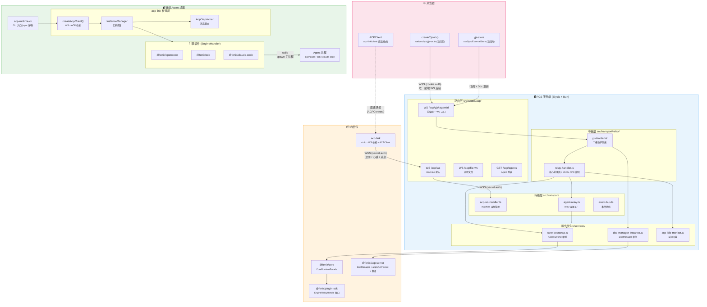

# ACP 主工作流程 — 全栈技术栈连线

> **架构演进说明**：前端已从"Relay + YJS 双通道"收拢为单 `/acp/yjs` 统一通道（详见 [改动 13](../arch/changes.md#改动-13前端-ws-通道从-relayyjs-双通道收拢为单-acpyjs-通道)）。`/acp/relay/:agentId` 端点服务侧仍存在，但前端不再使用；`createRelayClient()` / `buildRelayUrl()` 为死代码。

## 整体分层架构


ACP 主工作流程 — 全栈技术栈连线


```
│ ┌─────────────────────────────────────────────────────────────────────────┐
│ │                           🌐 浏览器 (Frontend)                            │
│ │                                                                          │
│ │  前端通过单条 /acp/yjs WS 连接与 RCS 通信:                                │
│ │                                                                          │
│ │  web/src/yjs/yjs-ws.ts ─── 【我们的】createYjsWs() + buildYjsUrl()        │
│ │        (构建 /acp/yjs/:agentId URL，cookie 认证，支持 sessionId)          │
│ │                                                                          │
│ │  web/src/pages/agent-panel/ChatPanel.tsx ─── 前端 WS 唯一入口             │
│ │        (挂载时创建 WS 连接，onYjsUpdate 回调解码 Y.Doc 更新)               │
│ │                                                                          │
│ │  单通道统一承载两种数据流:                                                 │
│ │  ┌──────────────────────────────────────────────────────────────────┐   │
│ │  │  📡 /acp/yjs/:agentId (唯一前端 WS 连接)                           │   │
│ │  │                                                                   │   │
│ │  │  ┌─ yjs:update 消息 ──────────────────────────────────────────┐  │   │
│ │  │  │ • Chat Doc (chat:{rcsSessionId})                            │  │   │
│ │  │  │   ─ 对话消息列表、tool_call、错误等                          │  │   │
│ │  │  │ • Session Doc (session:{rcsSessionId})                      │  │   │
│ │  │  │   ─ 会话元数据、权限请求、Todo 列表等                        │  │   │
│ │  │  │ • 微批次合并 (16ms) + 增量广播                               │  │   │
│ │  │  └────────────────────────────────────────────────────────────┘  │   │
│ │  │                                                                   │   │
│ │  │  ┌─ JSON-RPC 控制消息 ────────────────────────────────────────┐  │   │
│ │  │  │ • session/new、session/load、session/list                   │  │   │
│ │  │  │ • session/update、set_permission_mode、set_model 等          │  │   │
│ │  │  │ • relay-event-handler.ts 翻译前端 action → JSON-RPC         │  │   │
│ │  │  └────────────────────────────────────────────────────────────┘  │   │
│ │  └──────────────────────────────────────────────────────────────────┘   │
│ │                                                                          │
│ │  packages/acp-server/src/state/yjs-store.ts ── 【我们的】YjsStore (React)  │
│ │        (前端使用 useSyncExternalStore 订阅服务端推送的 Y.Doc 更新)         │
│ │                                                                          │
│ │  ── 已废弃: createRelayClient() / buildRelayUrl() ──                      │
│ │  web/src/acp/relay-client.ts (死代码，前端不再调用)                        │
│ │                                                                          │
│ │  ── 独立路径: ACPConnect (直连模式) ──                                    │
│ │  web/components/ACPConnect.tsx                                           │
│ │        (用户手动输入 acp-link 地址+token，通过 ACPClient 直连，不走 RCS)   │
│ └─────────────────────────────────────────────────────────────────────────┘
│                                     │
│                                     │ HTTPS / WSS (cookie auth)
│                                     ▼
│ ┌─────────────────────────────────────────────────────────────────────────┐
│ │                      🖥️ RCS 服务端 (Elysia + Bun)                         │
│ │                                                                          │
│ │  路由层 src/routes/acp/index.ts ─── 【我们的】ACP 路由入口                  │
│ │  ├── GET  /acp/agents        ── 组织内 ACP Agent 列表                    │
│ │  ├── WS   /acp/ws            ── Machine 接入端点 (acp-link 注册用)        │
│ │  ├── WS   /acp/file-ws       ── 远程文件操作 WebSocket                   │
│ │  └── WS   /acp/yjs/:agentId  ── 前端统一 WS 入口 (ChatPanel 唯一连接)    │
│ │                                                                          │
│ │  路由层 src/transport/                                                    │
│ │  ├── acp-ws-handler.ts ─────── 【我们的】Machine WS 消息处理器              │
│ │  │     (连接生命周期、注册、心跳、消息路由)                                 │
│ │  ├── agent-relay.ts ────────── 【我们的】Agent Relay 连接工厂               │
│ │  │     (通过 CoreRuntimeFacade 连接 Agent relay handle)                   │
│ │  ├── event-bus.ts ──────────── 【我们的】发布-订阅事件总线                   │
│ │  └── ws-types.ts ──────────── 【我们的】WebSocket 类型抽象                 │
│ │                                                                          │
│ │  中继层 src/transport/relay/                                              │
│ │  ├── relay-handler.ts ──────── 【我们的】Relay 核心处理器                   │
│ │  │     (open/message/close 生命周期，extractJsonRpc, translateSimpleAction)│
│ │  ├── connection-manager.ts ─── 【我们的】Relay 连接管理器                    │
│ │  ├── message-router.ts ─────── 【我们的】消息路由 + 过滤                     │
│ │  └── yjs-frontend/ ─────────── 【我们的】YJS 前端完整子系统 (7 个模块)       │
│ │        ├── ws-lifecycle.ts ── WS 生命周期 (open/message/close)            │
│ │        ├── connection-registry.ts ── 连接注册表 + 引用计数                 │
│ │        ├── relay-event-handler.ts ── Relay 事件 → Y.Doc 写入              │
│ │        ├── session-transition.ts ── 会话切换编排                          │
│ │        ├── yjs-broadcaster.ts ── Y.Doc 快照 + 增量广播                    │
│ │        └── types.ts ── ClientConnection / SharedRelay                    │
│ │                                                                          │
│ │  服务层 src/services/                                                     │
│ │  ├── core-bootstrap.ts ─────── 【我们的】CoreRuntime 启动 & 单例管理        │
│ │  ├── doc-manager-instance.ts ─ 【我们的】DocManager 单例服务               │
│ │  ├── acp-idle-monitor.ts ───── 【我们的】空闲回收 (双指标超时检测)          │
│ │  └── workspace-resolver.ts ─── 【我们的】工作空间路径解析                   │
│ └─────────────────────────────────────────────────────────────────────────┘
│                                     │
│                                     │ EngineRelayHandle (IPC/内存)
│                                     ▼
│ ┌─────────────────────────────────────────────────────────────────────────┐
│ │                       📦 内部包 (packages/)                                │
│ │                                                                          │
│ │  packages/core/ ── 【我们的】核心运行时                                    │
│ │  └── CoreRuntimeFacade ── 统一 Agent 生命周期 API                         │
│ │        connectInstanceRelay() / ensureRunning() / instance 管理          │
│ │                                                                          │
│ │  packages/plugin-sdk/ ── 【我们的】插件 SDK                                │
│ │  └── EngineRelayHandle 接口 ── relay 连接的抽象契约                       │
│ │                                                                          │
│ │  packages/acp-server/ ── 【我们的】ACP 服务端包 (纯逻辑)                    │
│ │  ├── DocManager ── Chat Doc + Session Doc 双 Y.Doc 管理                  │
│ │  ├── applyACPEvent ── ACP 事件 → Yjs 结构聚合                            │
│ │  ├── 微批次合并 (16ms) ── 同一帧内多条消息合并为一个 yjs:update            │
│ │  ├── translateSimpleAction ── 前端 action → ACP JSON-RPC                 │
│ │  ├── Redis 持久化 ── CAS 快照保存/恢复                                    │
│ │  └── 同构 WS 客户端 ── 前后端共享的 Yjs WebSocket 实现                     │
│ │                                                                          │
│ │  第三方基础依赖: Yjs (CRDT), ioredis                                       │
│ └─────────────────────────────────────────────────────────────────────────┘
│                                     │
│                                     │ WebSocket (secret auth)
│                                     ▼
│ ┌─────────────────────────────────────────────────────────────────────────┐
│ │                     🖥️ 远端 Agent 机器 — 三层架构                           │
│ │                                                                          │
│ │  ┌─────────────────────────────────────────────────────────────────────┐ │
│ │  │  第 1 层: CLI 入口                                                  │ │
│ │  │                                                                     │ │
│ │  │  packages/acp-runtime-cli/bin.ts ── 薄壳入口                        │ │
│ │  │  • 解析环境变量 / CLI 参数                                          │ │
│ │  │  • 调用 acp-link 的 startServer() 启动整个运行时                    │ │
│ │  │  • npm 发布为 @fenix-agent/acp-runtime-cli                          │ │
│ │  ├─────────────────────────────────────────────────────────────────────┤ │
│ │  │  第 2 层: acp-link 桥接层 (核心)                                    │ │
│ │  │                                                                     │ │
│ │  │  packages/acp-link/src/server.ts ── startServer() 入口              │ │
│ │  │  • 有 rcsUrl → createAcpClient() (生产模式)                         │ │
│ │  │    └── WS 连接 RCS → InstanceManager 调度引擎                      │ │
│ │  │  • 无 rcsUrl → createAcpServer() (调试模式)                         │ │
│ │  │    └── 本地 WS server → 直接 spawn 子进程                          │ │
│ │  │                                                                     │ │
│ │  │  InstanceManager (instance-manager.ts) ── 实例生命周期              │ │
│ │  │  • prepare(workspace) → start() → stop() / cleanup()                │ │
│ │  │  • 持有 EngineHandler 映射表，根据 engineType 调度                  │ │
│ │  │                                                                     │ │
│ │  │  AcpDispatcher (acp-dispatcher.ts) ── WS ↔ stdio 消息路由          │ │
│ │  │  • WS 消息 → ACP JSON-RPC → 写入子进程 stdin                       │ │
│ │  │  • 子进程 stdout → ACP 响应/通知 → 通过 relay → RCS                │ │
│ │  │                                                                     │ │
│ │  │  职责总结：进程生命周期 + WS↔ACP 协议转换 + 消息路由                │ │
│ │  ├─────────────────────────────────────────────────────────────────────┤ │
│ │  │  第 3 层: 引擎插件 (EngineHandler 实现)                             │ │
│ │  │                                                                     │ │
│ │  │  packages/plugin-opencode/src/opencode-handler.ts                   │ │
│ │  │  packages/plugin-ccb/src/ccb-handler.ts                             │ │
│ │  │  packages/plugin-claude-code/src/claude-code-handler.ts             │ │
│ │  │                                                                     │ │
│ │  │  接口: EngineHandler { prepareWorkspace, startInstance, stopInstance }│ │
│ │  │  (instance-manager.ts:27-34，静态 import，无动态加载)               │ │
│ │  │                                                                     │ │
│ │  │  startInstance() 逻辑:                                              │ │
│ │  │  1. 准备 workspace 配置文件 (Agent 配置、MCP、Skill 等)             │ │
│ │  │  2. 调用 spawnAcpAgent() → child_process.spawn(executable, args)    │ │
│ │  │  3. 将子进程 stdio 包装为 ACP ndJson 协议流                        │ │
│ │  │  4. 创建 AcpDispatcher 处理权限请求回调                             │ │
│ │  │                                                                     │ │
│ │  │  职责总结：配置准备 + 子进程启动 + 权限桥接                         │ │
│ │  │  (不管理进程生命周期——由 InstanceManager 统一 stop/cleanup)        │ │
│ │  └─────────────────────────────────────────────────────────────────────┘ │
│ │                                                                          │
│ │  通信路径:                                                               │
│ │  • 前端 → Agent: WS(RCS) → relay → createAcpClient → InstanceManager    │
│ │    → AcpDispatcher → stdin → Agent 子进程                                │
│ │  • Agent → 前端: Agent 子进程 stdout → ACP ClientSideConnection          │
│ │    → relay → WS(RCS) → Y.Doc → yjs:update → 前端                         │
│ │                                                                          │
│ │  第三方: @agentclientprotocol/sdk (ACP 协议规范)                           │
│ │           @anthropic-ai/claude-agent-sdk (Claude Agent SDK)              │
│ └─────────────────────────────────────────────────────────────────────────┘
```
