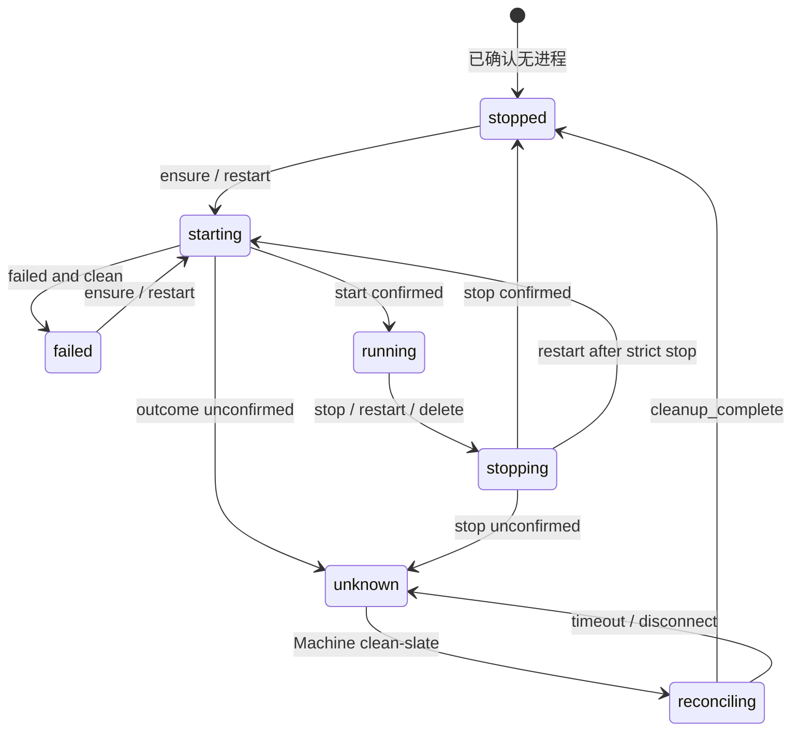

# Agent Instance 详细设计

> 状态：待实施（2026-08-31 评审确认）。
> 架构依据：[`../arch/22-agent-instance-management.md`](../arch/22-agent-instance-management.md)。
> 目标：将架构决策细化为可直接实施的数据模型、运行状态机、生命周期并发语义、调用路径、接口、故障处理、测试矩阵和交付切片。
> 迁移原则：现有 Instance 状态、运行时编号、随机回退和请求级临时实例逻辑不规范，实施时直接删除并替换，不增加兼容层或双写。

## 1. 目标与非目标

### 1.1 目标

- HTTP 单轮、Workflow、Interactive Chat 全部使用持久 `agent_instance`；
- Instance 具备稳定 `inst_*` 身份、明确用户 owner 和不可变创建来源；
- 同一用户可跨调用线路显式复用 Instance，不同用户绝不共享运行资源；
- 统一 Runtime Coordinator，提供确定性状态、singleflight、优先级、取消、超时和迟到结果 fencing；
- 通过 strict stop 保证 delete、restart 和资源删除不会遗留无 DB 身份的进程；
- 服务重启后先完成 Machine clean-slate，再允许重新启动远端 Instance；
- 行为可测试、可观测、可回滚，并为未来多节点 fencing 留出边界。

### 1.2 非目标

- 跨节点 owner lease、旧 runtime adoption 或自动故障转移；
- Instance rename、切换默认 Instance、独立 start API；
- ACP session 与 RCS 资源绑定；
- 将 runtime 状态、generation、PID、relay 或 operation 写入 DB；
- 保留 `instanceNumber`、`preferNewInstance` 或旧 `ses_inst_*` 路由兼容。

## 2. 领域模型与标识

### 2.1 持久 Instance

```ts
type InstanceCreationSource = "user" | "api" | "workflow";

interface AgentInstanceRecord {
  id: string; // inst_*
  environmentId: string;
  ownerUserId: string;
  creationSource: InstanceCreationSource;
  name: string;
  isDefault: boolean;
  createdByUserId: string | null;
  createdAt: Date;
  updatedAt: Date;
}
```

| 字段 | 语义 |
|---|---|
| `id` | 稳定、不可复用的业务身份，同时传入 Controller 和 Core |
| `environmentId` | 所属 Environment，不可变 |
| `ownerUserId` | 唯一执行 owner，不可变 |
| `creationSource` | 首次创建入口，不可变 |
| `name` | 来源命名空间内的幂等键，不可变 |
| `isDefault` | 该 owner 在该 Environment 下的 Chat 默认 Instance |
| `createdByUserId` | 创建 actor，仅用于审计，系统创建可为空 |

Instance row 不保存 runtime 状态、generation、Machine snapshot、PID、连接、relay、ACP/RCS session 或 operation gate。

### 2.2 Runtime Incarnation

一个持久 Instance 可以先后拥有多个 Runtime Incarnation，同一时刻只能有一个被 Coordinator 接受的当前世代：

```text
(instanceUid, runtimeGeneration)
```

`runtimeGeneration`：

- 只存在于当前服务进程及下发的 runtime 协议；
- 不写入 DB；
- 每次新的 start attempt，或 lifecycle intent 使当前 runtime 失效时单调递增；
- 所有 start/stop/relay 回调必须携带捕获时的 generation；
- 迟到结果的 generation 不匹配时只能做补偿清理。

服务重启后 generation 可从进程内初值重新开始，因为 Machine clean-slate 保证旧服务世代的进程先被清除。

### 2.3 Session 标识

| 标识 | 作用 | 是否持久化到 `agent_instance` |
|---|---|---:|
| `instanceUid` | Instance 身份和 runtime 路由 | 是，作为主键 |
| `rcsSessionId` | Chat/Y.Doc、广播和 relay projection 隔离 | 否 |
| ACP session ID | Agent Engine 协议会话 | 否 |

一个 Instance 可承载多个 RCS session 和 ACP session。一个 `rcsSessionId` 在任一时刻只绑定一个当前 Runtime Incarnation。

前端和 API 直接传 `instanceUid`，不再把 Instance locator 编码成 Session ID。旧 `instanceNumber` 和 `ses_inst_{environmentId}_{instanceNumber}` 明确失效。

## 3. 数据库设计

### 3.1 约束

数据库必须保证：

```text
PRIMARY KEY (id)

UNIQUE (
  environment_id,
  owner_user_id,
  creation_source,
  name
)

UNIQUE (
  environment_id,
  owner_user_id
)
WHERE is_default = true

CHECK (
  creation_source IN ('user', 'api', 'workflow')
)

CHECK (
  is_default = (
    creation_source = 'user'
    AND name = 'default'
  )
)
```

最后一个 CHECK 是双向不变量：

```text
isDefault=true ⇔ creationSource=user AND name=default
```

因此 `user/default/false`、`api/default` 和 `workflow/default` 均非法。

### 3.2 外键

建议：

```text
environment_id
  REFERENCES environment(id)
  ON DELETE CASCADE

owner_user_id
  REFERENCES user(id)
  ON DELETE RESTRICT

created_by_user_id
  REFERENCES user(id)
  ON DELETE SET NULL
```

Environment 或 owner 删除必须先经过 Instance Service，对关联 Instance 执行 strict stop。FK 只负责数据一致性，不能代替 runtime 清理。

### 3.3 名称规则

- 普通名称先 `trim`，空字符串非法；
- 最大长度 64；
- `default` 为保留名；
- 大小写语义必须与 PostgreSQL 唯一索引一致；
- 本期不支持 rename；
- 自动 API Instance 固定为 `primary`；
- 自动 Workflow Instance 固定为 `primary`。

### 3.4 原子 find-or-create

创建幂等键：

```text
(environmentId, ownerUserId, creationSource, name)
```

Service 可先查后插优化正常路径，但并发正确性必须依赖 DB 唯一约束。唯一冲突后重新读取相同完整键；不得返回 500，也不得读取其他 owner/source 的 row。

默认 Instance 只能调用专用 `findOrCreateDefaultInstance`，普通 create DTO 在 service 层先拒绝 `name=default`，DB CHECK 作为最终防线。

## 4. Owner、授权与运行上下文

### 4.1 Owner 不变量

所有 runtime 启动按以下链路恢复上下文：

```text
instanceUid
→ agent_instance
→ ownerUserId
→ Environment / organization
→ AgentConfig / machine route
→ workspace / sandbox / quota
→ start runtime
```

以下行为统一使用 `ownerUserId`：

- workspace：`{WORKSPACE_ROOT}/{organizationId}/{ownerUserId}/{environmentId}`；
- sandbox 选择与复用；
- owner runtime quota；
- Workflow use lease；
- relay registry 与 runtime coordinator 隔离；
- Instance 查询、列表和统计。

请求 actor、浏览器 session user 或 Workflow 临时默认身份不得覆盖 owner。客户端不能提交任意 owner；Workflow 只使用当前执行上下文已经携带的 `userId`，缺失返回 `INSTANCE_OWNER_REQUIRED`，且不得回退 Environment owner。此次不新增 `workflow_run.owner_user_id`，不回填历史 run owner；缺少执行上下文 owner 的历史恢复同样 fail-closed。

指定 uid 时，owner 不匹配与不存在统一 fail-closed 为 `INSTANCE_NOT_FOUND`。

### 4.2 创建来源与 Operation Context

持久字段：

```ts
type InstanceCreationSource = "user" | "api" | "workflow";
```

它只描述 row 首次创建入口，不限制后续消费线路，也不因跨线路显式使用而变化。

每次调用携带非持久化上下文：

```ts
interface InstanceOperationContext {
  channel: "chat" | "http" | "workflow" | "management";
  trigger: "user" | "scheduled" | "system";
  actorUserId: string | null;
}
```

| 场景 | `channel` | `trigger` |
|---|---|---|
| Chat 打开或重连 | `chat` | `user` |
| HTTP/OpenAI 单轮 | `http` | `user` |
| 用户手工 Workflow | `workflow` | `user` |
| 定时 Workflow | `workflow` | `scheduled` |
| 系统/Webhook Workflow | `workflow` | `system` |
| 用户管理命令 | `management` | `user` |
| shutdown、sweep、reconcile | `management` | `system` |

`trigger` 可用于 scheduled quota；owner quota 始终按 `ownerUserId` 统计。

## 5. 三条调用路径

### 5.1 通用流程

```text
确定 ownerUserId
→ 解析并授权 Environment
→ 有 uid：精确查询；无 uid：按线路键 find-or-create
→ ensureRuntime(instanceUid)
→ 创建或恢复 ACP Session
→ 执行 PromptTurn
→ 释放调用级资源
```

有 uid 时不要求 `creationSource` 与当前线路一致，但必须 owner 相同。找不到、不可见或状态冲突时不得回退自动 Instance。

### 5.2 Interactive Chat

无 uid 自动选择：

```text
(environmentId, ownerUserId, user, default, isDefault=true)
```

行为：

- 复用当前 running runtime；stopped/failed 时按同 uid 懒启动；
- 多个 Chat session 可以共享 runtime，各自使用独立 `rcsSessionId` 和 ACP session；
- 标签页关闭、断连或切换 Chat session 只释放连接和 relay 引用；
- 不停止 runtime，不删除 Instance row；
- 有 uid 时精确进入，绝不回退默认 Instance。

### 5.3 HTTP 单轮

接口接受可选请求头：

```text
X-Instance-Uid: inst_*
```

响应返回实际使用的同名 header。无 uid 自动选择：

```text
(environmentId, ownerUserId, api, primary, isDefault=false)
```

行为：

- 复用当前 runtime；
- 每个请求创建独立 PromptTurn，可新建或 load ACP session；
- 请求结束只释放 PromptTurn listener、请求级 relay 引用和请求资源；
- 客户端取消或 HTTP timeout 只取消当前 PromptTurn/等待；
- 不停止共享 runtime，不删除 Instance row；
- 删除现有每请求 spawn、finally dispose-stop 逻辑。

### 5.4 Workflow

Workflow run 必须具有持久 `ownerUserId`。Agent node 可选：

```yaml
instance_uid: inst_...
```

无 uid 自动选择：

```text
(environmentId, workflowRun.ownerUserId, workflow, primary, isDefault=false)
```

行为：

- 连续 run 复用同一持久 Instance 和当前 runtime；
- 每个 node execution 使用独立 ACP session/PromptTurn；
- run/node settle、cancel 或真实 timeout 后释放 turn、relay 和 Workflow use lease；
- 同步 HTTP 等待 timeout 不等于 Workflow run cancel；
- run 结束不停止 runtime，不删除 Instance row；
- use lease 防止 Workflow 自身错误清理共享资源，不覆盖统一 lifecycle 优先级。

## 6. Runtime Coordinator

### 6.1 唯一权威

Coordinator 是对外状态和 lifecycle operation 的唯一运行态权威：

```ts
interface InstanceRuntimeEntry {
  instanceUid: string;
  runtimeGeneration: number;
  currentOperation: LifecycleOperation | null;
  deleting: boolean;
  runtimeSnapshot: RuntimeSnapshot | null;
  lastFailure: RuntimeFailure | null;
  machineReconciled: boolean;
  abortController: AbortController | null;
}
```

Controller、Core、Machine adapter 只执行命令和报告底层事实。旧状态映射、supplement 业务身份、route 拼装状态和 runtime counter 全部删除。

### 6.2 对外状态

```text
reconciling | starting | running | stopping | stopped | failed | unknown
```

状态派生优先级：

```text
1. Machine clean-slate 正在执行              → reconciling
2. currentOperation 为 start/restart-start   → starting
3. currentOperation 为 strict-stop/delete    → stopping
4. 当前 generation 有确认 running snapshot  → running
5. 操作失败且确认无残留进程                  → failed
6. 已确认无当前或旧 generation 活跃进程      → stopped
7. 无法确认 Machine 或进程事实               → unknown
```

`failed` 表示失败但资源边界已确认；`unknown` 表示可能仍有进程，因此不能安全启动或删除。

### 6.3 状态转移



## 7. 生命周期优先级与并发

### 7.1 固定优先级

```text
delete > stop > restart > ensure/enter
```

`enter` 完成 DB 查询与授权后调用 `ensure`，不是独立 runtime operation。

### 7.2 通用规则

1. 每个 uid 只有一个 coordinator entry；
2. 相同操作在允许时 singleflight；
3. 更高优先级操作使较低优先级 generation 失效；
4. 单个 waiter 取消只取消自身等待，不取消共享 operation；
5. 全部 waiter 取消也不自动终止已下发的远端 start；
6. operation timeout 或更高优先级操作可以触发 operation-owned `AbortController`；
7. generation 不匹配的结果不得写入当前 snapshot，必须 best-effort 补偿并记录指标；
8. lock、gate、reservation、Promise 和 AbortController 必须在 `finally` 释放；
9. 不持 DB 事务等待 Controller、Core、Machine、relay 或 Y.Doc；
10. `unknown` 拒绝 ensure、restart 和 delete，只允许 reconcile 或 best-effort stop。

### 7.3 冲突矩阵

| 当前操作 | 新请求 | 结果 |
|---|---|---|
| ensure/start | ensure | 加入 start singleflight |
| ensure/start | restart | 旧 start 失效，补偿后 restart |
| ensure/start | stop | 旧 start 失效，最终 stopped |
| ensure/start | delete | delete 接管，strict stop 后删除 |
| restart | restart | 加入 restart singleflight |
| restart | ensure | 等待 restart 并复用结果 |
| restart | stop | 取消后续 start，最终 stopped |
| restart | delete | delete 接管 |
| stop | stop | 加入 stop singleflight |
| stop | ensure/restart | `INSTANCE_STOPPING`，不自动排队启动 |
| stop | delete | delete 复用或等待 strict stop |
| delete | delete | 加入 delete singleflight |
| delete | 其他操作 | `INSTANCE_DELETING` |
| unknown/reconciling | ensure/restart/delete | 明确拒绝 |

### 7.4 Ensure

- `running`：立即复用；
- `starting`：加入 singleflight；
- 合法 `restart`：等待并复用结果；
- `stopped/failed`：新建 start generation；
- `stopping`：返回 `INSTANCE_STOPPING`；
- `deleting`：返回 `INSTANCE_DELETING`；
- `unknown/reconciling`：返回对应不可用错误。

### 7.5 Restart

- 首个请求建立 singleflight，后续 restart 加入；
- 立即使当前 generation 失效；
- 先 strict stop，再以同一 uid 启动新 generation；
- stop/delete 到达时取消 restart 的后续 start；
- restart start 失败且确认无残留时为 `failed`，无法确认时为 `unknown`；
- 不静默重试，不重放未完成 PromptTurn。

### 7.6 Stop

- 已 `stopped` 时幂等成功；
- `failed` 且确认无进程时收敛为 `stopped`；
- 到达 start 时使 start generation 失效并执行 strict stop；
- 到达 restart 时阻止后续 start；
- `unknown` 可尝试 best-effort stop，但除非重新确认无进程，否则不能报告 strict 成功。

### 7.7 Delete

```text
DB 查询 + owner/Environment 授权
→ 默认 Instance 立即拒绝
→ deleting=true、generation++、取消低优先级 operation
→ strict stop
→ 短事务删除 row
→ 清理 coordinator entry
```

- strict stop 失败：保留 row，释放 gate，按事实恢复 `failed/unknown`；
- strict stop 成功但 DB delete 失败：保留 row，释放 gate，状态为 `stopped`；
- row 已删除时，对同 owner 的重复 delete 幂等成功；
- DB 删除成功后的迟到结果只能补偿清理；
- uid 永不复用。

### 7.8 Timeout 与迟到结果

每个远端阶段独立配置有界 timeout：

- prepare/start；
- relay readiness；
- strict stop；
- Machine clean-slate；
- 等待前序 operation。

Timeout 后：

1. abort 当前 operation；
2. 使 generation 失效；
3. 执行有界 best-effort 补偿；
4. 确认无残留时进入 `failed`，否则进入 `unknown`；
5. 返回稳定错误码；
6. 迟到成功不得恢复 `running`。

## 8. Strict 与 Best-effort Stop

### 8.1 Strict stop

使用场景：用户 stop、restart、delete、Environment 删除、owner 删除前清理。

成功条件：

1. 当前及旧 generation 已失效；
2. Agent process 已确认停止或不存在；
3. Core/runtime handle 已清理；
4. Controller/node 引用已归还；
5. 禁止建立新 relay；
6. 关键 runtime registry 已清理。

relay client close、Y.Doc reclaim 或观测清理失败可进入后续补偿，但必须记录。Machine 不可达且不能确认进程不存在时 strict stop 失败并进入 `unknown`。

### 8.2 Best-effort stop

使用场景：shutdown、stale completion、Machine 断连辅助清理、orphan sweep。

它必须尝试所有阶段并返回结构化阶段结果，不能因为一个阶段失败而跳过后续清理，也不能被 delete 当作 strict 成功。

## 9. Machine Clean-slate

### 9.1 单节点协议

主服务每次启动生成进程级 `serverEpoch`，不写入 `agent_instance`。Machine 必须：

1. 将 Agent process 绑定到控制连接和 `serverEpoch`；
2. 控制连接断开后停止接受该连接的新命令；
3. 在 bounded grace period 内终止该连接启动的全部进程；
4. 终止完成前不向新连接报告 ready；
5. 重连后先返回前一世代的 `cleanup_complete`；
6. 拒绝旧 epoch 的迟到命令和回调。

主服务：

```text
Machine 未连接              → unknown
Machine 正在清理            → reconciling
收到 cleanup_complete       → stopped
clean-slate timeout/offline → unknown
```

确认 clean-slate 前不得在该 Machine 上启动相同 uid。本期不采用 Machine 上报的旧进程 inventory，不恢复或认领旧 runtime，不提供 force-delete unknown Instance。

### 9.2 未来多节点

多节点必须增加 owner node、owner lease、fencing token、跨节点命令转发和全局状态查询。Machine 必须按 fencing token 拒绝旧 owner。实施前，同 uid 请求必须 sticky 到同一有状态服务节点。

## 10. ACP Session 信任边界

本期决策：ACP session ID 不绑定 organization、Environment、Instance、workspace 或 owner；RCS 不维护其归属映射。在 Instance 授权完成后，它作为不透明参数传给受信任 Agent Engine。

适用前提：

- Agent Engine/Machine 属于受信任执行面；
- ACP session ID 不会向未授权租户泄露或被安全边界外枚举；
- Engine 的 session store 不会暴露其他用户数据；
- RCS 不把 ACP session ID 当作授权凭据；
- 日志、trace 和错误响应不泄露完整 ID。

重新评估触发条件：

- Engine 引入跨用户或跨组织共享 session store；
- ACP session 支持跨 Machine 加载；
- Instance 支持跨 owner 共享；
- session ID 可预测、可枚举或由不受信任外部系统生成；
- 引入公开分享、第三方委托或多节点 runtime adoption；
- 出现跨用户 `session/load` 数据事件。

## 11. API 与 DTO

### 11.1 ViewModel

```ts
interface InstanceView {
  instanceUid: string;
  environmentId: string;
  ownerUserId: string;
  creationSource: "user" | "api" | "workflow";
  name: string;
  isDefault: boolean;
  status:
    | "reconciling"
    | "starting"
    | "running"
    | "stopping"
    | "stopped"
    | "failed"
    | "unknown";
  createdAt: string;
  updatedAt: string;
  lastFailure?: {
    code: string;
    occurredAt: string;
  };
}
```

`runtimeGeneration` 仅在受控诊断接口按权限暴露。响应不得包含 PID、relay token、machine credential、环境变量、完整 workspace 路径或内部异常原文。

### 11.2 创建与进入

Web 用户创建：

```ts
interface CreateUserInstanceRequest {
  name: string;
}
```

Route 固定 owner 为认证用户、source 为 `user`，拒绝 `name=default`。

外部 API 创建同样只接受 `name`，route 固定 source 为 `api`。Workflow 自动创建不暴露通用 DTO。

进入：

```ts
interface EnterEnvironmentRequest {
  instanceUid?: string;
}
```

无 uid 使用当前 owner 的 `user/default`，有 uid 精确进入。

删除旧字段：

- `instance_number`；
- `preferNewInstance`；
- 作为 Instance locator 的 `session_id`；
- 客户端提交的 `source`、`ownerUserId`、`isDefault`。

### 11.3 错误码

| HTTP | code | 语义 |
|---:|---|---|
| 404 | `INSTANCE_NOT_FOUND` | uid 不存在或 fail-closed 不可见 |
| 409 | `DEFAULT_INSTANCE_CANNOT_BE_DELETED` | 默认 Instance 禁止删除 |
| 409 | `INSTANCE_DELETING` | deleting gate 已设置 |
| 409 | `INSTANCE_STOPPING` | stop 已接受，后续启动不排队 |
| 409 | `INSTANCE_OPERATION_CONFLICT` | lifecycle 冲突 |
| 409 | `INSTANCE_RUNTIME_UNKNOWN` | 无法确认进程事实 |
| 409 | `INSTANCE_NAME_CONFLICT` | 非幂等唯一键冲突 |
| 422 | `INSTANCE_RESERVED_NAME` | 普通创建使用保留名 |
| 422 | `INSTANCE_OWNER_REQUIRED` | Workflow 等路径缺少 owner |
| 422 | `INVALID_INSTANCE_UID` | uid 格式非法 |
| 429 | `INSTANCE_OWNER_QUOTA_EXCEEDED` | owner runtime quota 超限 |
| 429 | `INSTANCE_GLOBAL_QUOTA_EXCEEDED` | 全局 runtime quota 超限 |
| 429 | `INSTANCE_BUSY` | PromptTurn/session 容量不足 |
| 503 | `MACHINE_UNAVAILABLE` | Machine 不可用 |
| 503 | `MACHINE_RECONCILING` | clean-slate 未完成 |
| 504 | `INSTANCE_START_TIMEOUT` | start timeout |
| 504 | `INSTANCE_STOP_TIMEOUT` | strict stop timeout |
| 500 | `INSTANCE_PERSISTENCE_FAILED` | 生命周期完成后持久化失败 |

## 12. 配额、背压与资源释放

启动新 Runtime Incarnation 时检查：

- 全局 runtime quota；
- owner runtime quota；
- `(environmentId, ownerUserId)` quota；
- scheduled trigger quota。

复用 running runtime 不重复消耗 spawn reservation。PromptTurn/ACP session 容量独立于 runtime quota；容量不足时返回 `INSTANCE_BUSY`，不得创建替代 Instance 绕过限制。

所有路径必须成对释放请求级 listener、PromptTurn、relay 引用、Workflow use lease 和 reservation。relay 断连不等于进程终止，不能直接派生 `stopped`。

file-ws 是独立能力平面；file-ws 不可用只返回明确的文件能力错误，不改变 Instance runtime 状态，也不阻塞进程 strict stop。

## 13. 可观测性

每个 lifecycle operation 使用稳定 `operationId`，结构化记录：

```text
operationId
instanceUid
environmentId
ownerUserId
actorUserId
creationSource
channel
trigger
operation
runtimeGeneration
stateBefore
stateAfter
machineId/nodeId（仅内部）
duration
timeoutPhase
singleflightWaiterCount
compensationResult
staleCompletion
```

指标至少覆盖：

- Instance 数量，按 creation source 和状态聚合；
- 三条路径自动创建与唯一冲突收敛数；
- ensure/restart/stop/delete singleflight merge 数；
- owner/global quota 拒绝数；
- lifecycle latency 与各阶段 timeout；
- unknown/reconciling 数量和持续时间；
- Machine clean-slate latency/failure；
- stale generation completion；
- orphan runtime、DB/runtime mismatch；
- strict/best-effort stop 分阶段失败；
- relay/Y.Doc 补偿失败。

高基数 ID 进入日志和 trace，不直接作为 Prometheus label。任何日志和错误不得包含密钥、token、完整 ACP session ID 或敏感启动参数。

## 14. 测试矩阵

### 14.1 数据与隔离

- 同 owner 同完整键并发创建只产生一行；
- 同 Environment 不同 owner 可分别拥有默认 Instance；
- DB 与 service 同时拒绝所有非法 default 组合；
- owner/source/name/default 修改被拒绝；
- 跨 owner uid 查询返回 `INSTANCE_NOT_FOUND`；
- A/B 用户的 workspace、sandbox、quota、relay 和 coordinator 完全隔离；
- Workflow 缺 owner 明确失败。

### 14.2 Runtime 与并发

- Controller、Core、Machine 全程使用同一 `inst_*`；
- 并发 ensure 只启动一次；
- 冲突矩阵逐项覆盖；
- waiter 取消不取消共享 operation；
- start timeout 后迟到 success 被补偿停止；
- stale generation 不能覆盖新状态；
- strict stop 失败时 delete 不删 row；
- strict stop 成功、DB delete 失败时 row 保留且状态 stopped；
- 默认 Instance 在任何 stop 前拒绝删除；
- best-effort 结果不会被误判为 strict 成功。

### 14.3 三条路径

- 不存在无 DB row runtime；
- Chat 无 uid 复用 owner 的 `user/default`；
- HTTP 连续请求复用 owner 的 `api/primary`；
- Workflow 连续 run 复用 owner 的 `workflow/primary`；
- 显式 uid 可跨线路复用且 owner 必须一致；
- 请求/run/连接结束不停止 runtime；
- 非法或旧 route key 不回退默认 Instance；
- `instanceUid`、`rcsSessionId`、ACP session ID 不可互换。

### 14.4 Machine 与故障

- 服务重启后未完成 clean-slate 时相同 uid 不得重复启动；
- Machine 清理确认后状态收敛为 stopped；
- Machine 不重连或清理 timeout 时保持 unknown；
- 旧 epoch 命令和回调被拒绝；
- relay 断连不伪报 stopped；
- file-ws 断连只降级文件能力；
- local runtime 在宿主退出后可确认 stopped。

## 15. 实施切片

### 切片 1：持久身份与 DB 不变量

- 新增 schema、repository、迁移和 `inst_*` 生成器；
- 增加 owner、creation source、唯一键和 default CHECK；
- 实现原子 find-or-create 和 fail-closed 查询。

验证：数据约束、并发创建、owner 隔离测试通过；按项目流程生成并审查 Drizzle migration。

### 切片 2：Runtime Coordinator 与新状态机

- 建立 uid 级 coordinator；
- 增加 generation、operation、deleting 和 cancellation；
- Controller/Core/Machine 接受上层 uid 与 generation；
- 删除旧状态映射、runtime counter 和随机复用。

验证：状态转移、singleflight、stale completion 和孤儿清理测试通过。

### 切片 3：Lifecycle 仲裁与 Stop 模式

- 实现固定优先级和完整冲突矩阵；
- 实现 strict/best-effort stop；
- 为各远端阶段增加 timeout；
- delete 使用 strict stop 和短 DB 事务。

验证：冲突矩阵、取消、timeout、部分失败和 DB 删除失败测试通过。

### 切片 4：三条路径统一接入

- Chat 接入 `user/default`；
- HTTP 接入 `api/primary` 并删除请求级 spawn/stop；
- Workflow run 持久 owner，Agent node 接入 `workflow/primary`；
- 三条路径统一使用 Instance Service 和 Coordinator。

验证：自动选择、跨线路显式复用、owner 隔离、资源释放测试通过。

### 切片 5：Machine Clean-slate

- 引入 `serverEpoch`；
- Machine 绑定连接世代并在断连后 bounded terminate-all；
- 重连增加 `cleanup_complete`；
- 主服务增加 unknown/reconciling gate。

验证：服务重启、Machine 离线、旧 epoch 和重复启动集成测试通过。

### 切片 6：DTO、前端与标识迁移

- 删除 `instanceNumber`、`preferNewInstance` 和旧 route key；
- 分别传递 `instanceUid`、`rcsSessionId`、ACP session ID；
- 管理 UI 使用新 ViewModel 和七状态；
- 旧链接显示明确失效错误。

验证：相关前端测试和 `bun run build:web` 通过。

### 切片 7：观测、文档与发布

- 增加 operation/generation/path 观测；
- 同步修订 Chat、Workflow、Orchestration 和文件架构；
- 建立迁移与回滚 runbook；
- 代码回滚时保留新表和数据，不 DROP 表。

验证：相关测试、`bun run docs:build`、`bun run precheck` 全部通过。

## 16. 回滚与验收标准

上线采用单版本切换，不双写、不猜测映射旧编号：

1. 先部署 schema，旧代码不读取新表；
2. 停止旧 runtime，避免迁移期间存在无 row 进程；
3. 部署新后端和 Machine clean-slate 协议；
4. 部署新前端路由与 ViewModel；
5. 旧 route key 返回稳定失效错误；
6. 紧急回滚只回滚代码，新表和 row 保留供再次上线使用。

最终验收必须满足：

- 三条路径全部通过持久 Instance；
- 不存在跨用户运行资源复用；
- 不存在无 row runtime、随机回退或可复用编号身份；
- Coordinator 是唯一状态权威；
- delete 不会在 strict stop 失败时删除 row；
- 服务重启不会与旧 Machine 进程重复启动；
- `unknown` 不被伪装成 `stopped`；
- 相关测试、迁移审查、`bun run docs:build`、`bun run precheck`，以及前端受影响时的 `bun run build:web` 全绿。
