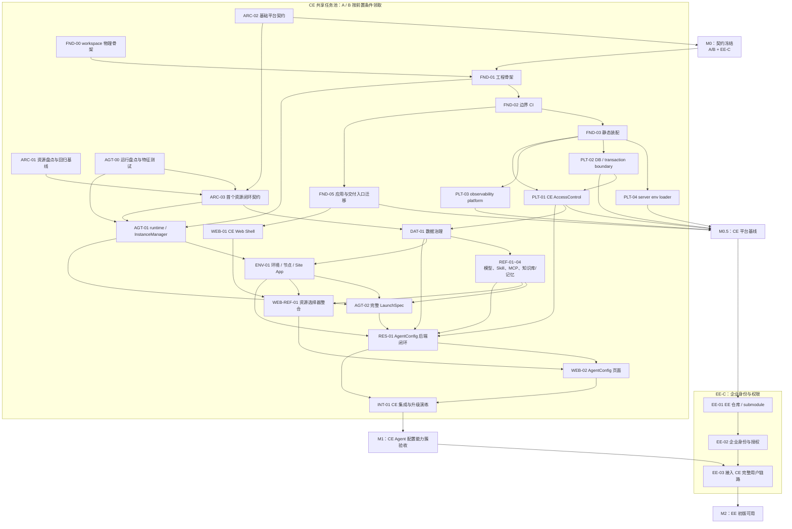

# CE/EE 架构重构多人协作计划

**目标：** 先交付可运行的 CE「Agent 配置能力簇」（身份与授权、模型/Provider、Skill、MCP、知识库、环境节点、AgentConfig、Agent 执行、`/app` 与 Web），再以该闭环为固定 CE 基线交付 EE 的用户体系与授权整体替换。

**范围：** 本计划不一次性迁移所有历史功能，但不会错误地将 AgentConfig 与其强依赖资源拆开。Skill、MCP、模型/Provider、知识库、记忆、Environment/Machine/Sandbox、站点应用的 **AgentConfig 所需能力** 属于首个闭环；工作流、调度、Chat/YJS 等其余能力在首个闭环验收后按本文的“资源迁移任务模板”逐个迁移。

**原则：** 不重写 Elysia、Drizzle 或前端路由框架；不建设动态插件平台。使用 workspace、package exports、依赖边界检查等开源能力，仅保留 `fenix.module.ts + assembly profile + 构建期 registry` 这一层静态产品线装配逻辑。

关联设计：[CE/EE 工程架构设计](./ce-ee-engineering-architecture.md)。

---

## 1. 团队协作模型

按当前 **2 位 CE + 1 位 EE** 配置，CE 不固定分为 A、B 两条职责线，而是使用一个按依赖排序的共享任务池：A 或 B 完成当前任务后，领取任意一个前置条件已满足的 CE task。不要按后端/前端机械拆分：AgentConfig 的后端、运行、页面与其强依赖资源必须按领域聚合，才能持续交付可运行能力。

| 工作流 | 负责人 | 工作方式 | 首要交付 |
| --- | --- | --- | --- |
| CE 共享任务池 | A、B | 从文末总表领取“前置已完成”的 task；一个进行中的 task 只允许一位负责人修改其主要文件 | 可运行的 CE Agent 配置能力簇 |
| EE 身份与权限 | C | 基于固定 CE revision 独立开发；仅在契约评审、集成验证时与 CE 协作 | 用同一 CE 资源 Service 运行的企业身份/权限版本 |

**协作约束：**

1. `platform-sdk`、assembly schema、根 workspace、Drizzle migration journal 不属于任何固定人员；由**当前领取对应 task 的 CE 负责人**独占修改。涉及这些共享文件的 task 未合并前，其他 CE task 不得修改同一文件。
2. 任何跨包依赖只能通过公开 package export；新增依赖必须同时更新 package dependency 和边界测试。
3. 每个 PR 只完成一个 task；不要把目录搬迁、表结构治理和业务行为重写混在一个 PR。
4. 同一个资源切片的旧/新写路径不能并存。切换的新 route/service 合并后，在同一发布窗口删除旧写入口。
5. EE-C 只依赖已固定的 CE revision；EE 开发分支禁止直接修改 CE submodule 工作树。EE-C 可以在 CE 的平台基线冻结后并行开发身份模块，但不能提前开发 CE 资源扩展或复制 CE 页面。

### 任务编号规则

任务 ID 的**前缀表示工作类别，不表示迁移阶段**；阶段以“架构阶段与 task 归属”表和总表的“阶段”列为准。同一阶段出现多个前缀是正常的，跨阶段的工作必须拆为不同 task。

| 前缀 | 含义 | 适用内容 |
| --- | --- | --- |
| `ARC` | Architecture | 架构盘点、边界与契约冻结 |
| `FND` | Foundation | workspace、包边界、应用入口等工程骨架 |
| `PLT` | Platform | 授权、数据库/事务、观测、env 等平台能力 |
| `AGT` | Agent | runtime、实例、LaunchSpec |
| `DAT` | Data | schema、数据迁移与数据治理 |
| `REF` | Resource Foundation | 首个闭环所需的依赖资源能力 |
| `RES` | Resource | 首个闭环中的 AgentConfig 资源模块 |
| `WEB` | Web | Web Shell、资源页面与调用方迁移 |
| `INT` | Integration | 集成验证、升级演练与验收 |
| `RSC` | Resource Slice | 首期以外单个资源的标准迁移任务组 |
| `EXE` | Execution | 运行、连接与执行基础设施 |
| `ORC` | Orchestration & Collaboration | Chat/YJS、Workflow、Scheduler、Webhook、Channel 等协作与编排能力 |
| `DEL` | Delivery | 发布、部署、运维与治理 |
| `EE` | Enterprise Edition | EE 产品线任务，不属于 CE 的 0–7 迁移阶段 |

## 2. 关键里程碑与并行关系

### 架构阶段与 task 归属

每个 task **只能属于一个** [架构设计第 13.2 节](./ce-ee-engineering-architecture.md#132-阶段与顺序)的阶段；跨阶段事项必须拆为独立 task。阶段定义交付边界，依赖关系只表达“何时可开始”，不得据此把多个阶段的工作混进一个 task。

| 架构阶段 | 本计划 task | 阶段边界 |
| --- | --- | --- |
| 0. 基线冻结 | ARC-01、AGT-00 | 盘点、回归特征测试与迁移风险；不改目标架构实现 |
| 1. 工程骨架 | FND-00、FND-01、FND-02、FND-05 | workspace、公开包边界、应用入口和构建/测试入口；不抽取平台实现或业务代码 |
| 2. 平台基础 | ARC-02、FND-03、PLT-01、PLT-02、PLT-03、PLT-04 | 可替换的 platform 契约/实现、静态装配、env、DB/事务与观测；不迁移资源领域 |
| 3. 最小闭环 | ARC-03、DAT-01、AGT-01、REF-01 至 REF-04、ENV-01、AGT-02、WEB-01、WEB-REF-01、RES-01、WEB-02、INT-01 | AgentConfig 及其当前运行必需资源能力的唯一闭环；不迁移其余历史资源能力 |
| 4. 资源目录 | RSC-xx-01 至 RSC-xx-06 | 首个闭环外的资源按单资源完整迁移；每一资源另建一组 task |
| 5. 执行与连接 | EXE-01 | AgentConfig 闭环外的 Machine、workspace/file、Sandbox、ACP relay 与引擎能力迁移 |
| 6. 自动化与协作 | ORC-01 | Chat/YJS、Workflow、Scheduler、Webhook、Channel 的任务拆分与迁移 |
| 7. 交付与治理 | DEL-01、DEL-02、DEL-03、DEL-04 | release/preflight、镜像/Compose、operations、历史入口退役与遗留目录归属确认 |

EE-01 至 EE-03 是基于 CE 阶段 2/3 产物的产品线工作，不计入 CE 迁移阶段；其前置条件在第 9 节单独维护。

`M0.5` 是已可独立构建、部署并替换平台模块的 CE 平台基线：它要求工程入口、env/deploy、数据库事务、可观测性和 CE `AccessControlModule` 均已就位。达到该基线后，EE-C 才可基于固定 CE tag 并行实现自己的身份模块。`M1` 才是 EE-C 将企业授权实现接入完整 AgentConfig 用户链路、执行端到端验证的准入门槛。

## 3. 准备阶段：架构冻结与可回归基线

### ARC-01：建立重构清单与责任地图

**负责人：** CE 任务池；EE-C 参与企业身份/权限边界盘点  
**前置：** 无  
**产出：** `docs/arch/ce-refactoring-inventory.md`、每个首批 task 的 owner 和依赖关系。

- [x] 从 `FUNCTIONAL_MODULE_INVENTORY.md`、`src/`、`web/`、`src/db/schema.ts` 汇总首批 AgentConfig 闭环涉及的表、route、service、页面、外部依赖和调用方。
- [x] 为每一项标注目标归属：`platform`、`agent`、`resources/agent-config`、`apps/server` 或 `apps/web`。
- [x] 明确保留的公开行为：资源 ID、现有数据可读性、AgentConfig 创建/查询/更新/删除/run、认证失败和越权失败语义。
- [x] 明确删除清单：切换完成后必须删除的旧 route/service/page；禁止新增长期兼容转发。
- [x] 为 AgentConfig 的 list、CRUD、run 和权限拒绝补齐或确认现有回归测试；记录当前耗时、错误日志字段和关键 API 返回样例。

**验收：** 任意开发者能根据清单定位一个旧实现、它的目标包、迁移风险、测试入口和删除条件。

### ARC-02：冻结基础平台公共契约

**负责人：** CE 任务池；EE-C 对 `AccessControlModule` 的企业替换需求签字确认  
**前置：** 无；可与 ARC-01、AGT-00 并行
**产出：** 更新 `docs/design/ce-ee-engineering-architecture.md`；必要时创建 `docs/adr/` 下的 ADR。

- [ ] 确认 `ResourceScope`、`ResourceContext`、`ResourceQueryConstraint`、`AccessControlModule` 的 TypeScript 签名和拒绝语义。
- [ ] 确认平台与应用的 package ID、公开入口、module kind、assembly profile 与 env 声明形态；资源和 Agent 的具体 package export 留给 ARC-03。
- [ ] 确认数据库/事务、可观测性、认证主体到 `AccessControlModule` 的基础依赖方向与拒绝语义；平台实现不得依赖任何资源领域模型。

**验收：** A、B、EE-C 对可替换平台边界无阻塞问题；阶段 1、2 的工程与平台任务无需等待业务盘点即可开始。冻结后只能通过 ADR 修改。

### ARC-03：冻结首个资源闭环契约

**负责人：** CE 任务池；AgentConfig 与强依赖资源整理负责人参与确认
**前置：** ARC-01、ARC-02、AGT-00
**产出：** `docs/arch/ce-refactoring-inventory.md` 的冻结版本，以及资源/Agent 公开接口与迁移范围记录。

- [ ] 确认 AgentConfig 对 Agent 的唯一边界：资源层产生已授权启动参数，`AgentInstanceStarter` 仅执行该参数。
- [ ] 确认 AgentConfig、Agent runtime/instance 和强依赖资源的 package ID、公开 Service/DTO、module ID、`/app/agent-configs` 路由与 Web contribution ID。
- [ ] 确认模型/Provider、Skill、MCP、知识库、记忆、Environment/节点、Site App 的首期迁移范围与依赖顺序；新包不得调用旧 `src/services/**`。

**验收：** 资源迁移负责人对首个闭环的接口、路由、数据治理范围与运行边界无阻塞问题；后续资源/Agent task 不再重新定义平台契约。

### AGT-00：Agent 运行链路盘点与特征测试

**负责人：** CE 任务池  
**前置：** 无；与 ARC-01、ARC-02 并行  
**主要文件：** `src/services/orchestration-instance.ts`、`src/services/launch-spec-builder.ts`、`src/services/environment-*.ts`、`src/transport/agent-relay.ts`、`packages/orchestration/`、`packages/plugin-sdk/` 及现有运行测试。

- [ ] 画出实例创建/复用/停止、ACP relay、LaunchSpec、Environment、引擎调用和资源释放的实际调用图，标明哪些逻辑属于 runtime、哪些属于 AgentConfig 或其他资源。
- [ ] 记录当前实例 ID、session ID、relay、取消、超时、失败释放和并发额度的行为样例，写入 `docs/arch/agent-runtime-extraction-map.md`。
- [ ] 为运行链路补齐不依赖新 package 的特征测试，覆盖“启动成功、启动失败释放、停止、复用、取消/超时”最小集合。
- [ ] 向 ARC-03 提供 `AgentRuntimeModule`、`AgentInstanceStarter`、LaunchSpec 输入输出的候选签名；由 ARC-03 冻结后再开始代码提取。

**验收：** 负责人不修改共享 workspace、SDK 或 migration 文件，也能完成真实调用图和可保护现有行为的测试；`AGT-01` 不需要再次探索运行链路。

## 4. 第一波：工程骨架与可执行治理

### FND-00：建立可并行的 CE workspace 物理骨架

**负责人：** CE 任务池  
**前置：** 无；可与 ARC-01、ARC-02 并行
**状态：** ✅ 已完成
**主要文件：** 根 `package.json`、`bun.lock`、`apps/`、`packages/platform/`、`packages/agent/`、`packages/resources/`。

- [x] 将 workspace 规则扩展为覆盖 `apps/*` 与两级 `packages/*/*`，同时保留当前已有 `packages/*` 的构建入口。
- [x] 创建 `apps/server`、`apps/web`、`platform-sdk`、`access-control`、`observability`、`agent-config` 的最小 `package.json` 和 README，以及 `packages/agent/` 的职责 README；README 仅说明目标职责和预计承载的实现。
- [x] 每个 manifest 只声明 package 名称、描述、私有属性和 ESM 类型；不声明 exports、跨包依赖、module ID、入口文件或 TypeScript path/project reference。
- [x] 不移动现有 `src/index.ts` 或 `web/src/main.tsx`，不创建运行时/实例 package，也不改变根入口的运行方式。
- [x] 通过 `bun install` 更新 workspace lockfile，并验证 `bun install --frozen-lockfile`、`bun run build:web`、`bun run precheck` 不被骨架改动破坏。
- [x] 在具备 PostgreSQL 的环境运行 `bun run dev`，确认数据库初始化完成并监听 `0.0.0.0:3000`。

**验收：** Bun 可识别新 package；当前根入口仍是唯一运行入口；ARC-02 可在既有目录中冻结正式 package 契约，而无需重新安排 workspace 或目录结构。

### FND-01：完善 workspace package 与应用入口骨架

**负责人：** CE 任务池
**前置：** FND-00
**状态：** ✅ 已完成
**主要文件：** 根 `package.json`、`tsconfig.json`、`apps/server/`、`apps/web/`、`packages/platform/`、`packages/agent/`、`packages/resources/`。

- [x] 为 `apps/*` 和既有一级 `packages/*` 建立 workspace package 的基础 metadata、构建配置与 TypeScript 项目边界；两级领域 package 在 ARC-02/ARC-03 后由其所属阶段任务声明公开 export。
- [x] 配置 TypeScript path/project reference，使跨包只能通过包名导入；本 task 不迁移任何领域实现。
- [x] 只创建 `apps/server`、`apps/web` 的空装配入口和构建配置，不在本 task 移动现有 `src/index.ts` 或 `web/src/main.tsx`；入口迁移由 FND-05 独立完成，避免与 package 契约冻结互相阻塞。
- [x] 在 CI 验证当前 `bun run dev`、`bun run build:web`、`bun run precheck` 未被骨架改动破坏。

**验收：** 后续负责人可在新 package 目录独立开发；当前根入口仍是唯一运行入口且全量检查通过。

### FND-02：将包依赖矩阵变成 CI 规则

**负责人：** CE 任务池  
**前置：** FND-01  
**主要文件：** `dependency-cruiser` 配置、Biome/ESLint import 限制、`scripts/ci.ts`、开发规范文档。

- [x] 引入并配置 `dependency-cruiser`，检查循环依赖及 `platform → agent/resources/apps`、`agent → resources`、CE → EE 等禁止方向。
- [x] 增加规则：禁止跨包导入 `packages/**/src/**`；只能导入 package export。
- [x] 将检查加到 `precheck`，输出违反依赖的源文件、目标文件和规则名称。
- [x] 为一条合法公开导入、一条非法内部导入、一条循环依赖分别建立 fixture 或 CI 校验用例。

**验收：** 人为添加一次非法 `src/**` 跨包导入时 CI 明确失败；合法包导入通过。

### FND-03：实现配置驱动的静态模块装配

**负责人：** CE 任务池  
**前置：** FND-02、ARC-02
**主要文件：** `packages/platform/platform-sdk/`、`scripts/generate-module-registry.ts`、`apps/generated/module-registry.ts`、`deploy/assembly/ce.json`、`apps/server/src/bootstrap.ts`。

- [ ] 定义 `ModuleManifest`、`AssemblyProfile`、module kind、依赖校验和 Web contribution 类型；SDK 不依赖 CE 的具体授权或资源包。
- [ ] 每个基础平台可装配包提供 `fenix.module.ts`，声明稳定 ID、类别、装配依赖、env 声明及贡献；资源与 Agent manifest 在 ARC-03 后随各自 task 添加。
- [ ] 编写构建期扫描脚本，生成仅含静态 import 的 registry；生成文件加入 `.gitignore` 或 CI 再生成校验，二选一并写清规则。
- [ ] 实现 assembly JSON/YAML 的 Zod 校验：禁止 import 路径、URL、代码片段；校验重复模块、类别不匹配和未满足依赖。
- [ ] 在 bootstrap 中完成“读取 profile → registry 校验 → 汇总 env → 创建模块 → 挂载贡献”的顺序，不引入运行时下载或热加载。

**验收：** 修改 profile 可替换已内置模块组合；引用未知 ID、漏依赖或类型错误时启动失败；新增 manifest 后只需生成 registry，无需手改 app 注册表。

### PLT-04：统一 server env loader

**负责人：** CE 任务池  
**前置：** FND-03  
**主要文件：** `packages/platform/platform-sdk/`、`apps/server/` bootstrap、env loader 测试。

- [ ] 将当前 `src/env.ts` 的进程变量拆成 server host env 与模块声明 env；模块禁止自行读取 `process.env`。
- [ ] 在 bootstrap 汇总启用 manifest 的 env 定义，使用 Zod 一次性读取/校验并以构造参数注入模块。

**验收：** 缺失 EE 专属 env 不影响 CE；启用 EE 模块时缺失变量阻止启动；所有 server module 仅消费注入的配置对象。

### FND-05：迁移应用与交付入口

**负责人：** CE 任务池
**前置：** FND-02
**主要文件：** `apps/server/`、`apps/web/`、根 `package.json`、`scripts/ci.ts`、Bun/Vite/测试配置与入口文档。

- [x] 将现有 `src/index.ts` 与 `web/src/main.tsx` 分别迁入 `apps/server`、`apps/web`；保留现有服务和前端模块，只改变应用入口与装配位置，不迁移资源领域代码。
- [x] 修正根 `package.json` 的 Bun scripts、TypeScript/Vite 配置、测试解析路径及生产构建产物路径，使开发、测试和生产构建均从 `apps/*` 入口执行；不得新增指向旧入口的兼容 script。
- [x] 更新根 `scripts/ci.ts` 的 format、lint、typecheck 与 test 路径：纳入 `apps/*`，并删除仅为已迁移 app 入口保留的根路径。尚未迁移的领域代码仍位于根 `src/`、`web/` 时，保留其检查路径并在 task 清单中标记后续归属，不得为了路径整洁提前排除检查。
- [x] 删除已迁移的根入口，并逐项记录仍引用根 `src/`、`web/` 的构建、测试、Vite、Docker、Compose、脚本和文档路径及其所属后续 task；运行 server、Web build 与测试，确认根目录不再存在第二条应用启动路径。

**验收：** `apps/server`、`apps/web` 是唯一应用入口；现有功能行为不变，开发、测试与生产构建均可运行；根 `scripts/` 只保留全仓薄命令，不承载复制出的 app 或领域逻辑。镜像与 Compose 切换由阶段 7 的 DEL-02 完成。

#### FND-05 遗留路径处置映射

| 路径或引用 | 当前处理 | 后续唯一归属 |
| --- | --- | --- |
| 根 `src/`、`web/` 的领域实现与其测试 | 保留；应用入口已移除，不为目录整洁提前迁移业务实现或排除 CI 检查 | 阶段 3 的 ARC-03、AGT-01、REF-xx、ENV-01、WEB-xx 及阶段 4 的 RSC-xx，最终由 DEL-04 人工确认目录处置 |
| `Dockerfile` 的 `src/index.ts` 构建、`web/dist` 复制路径 | 保留旧交付路径；本 task 不修改 Docker 以避免与交付阶段并发冲突 | DEL-02 |
| `docker-compose.yml` 与 `docker/prod/` Compose | 本轮不变；逐项确认镜像启动与卷挂载是否依赖旧产物 | DEL-02 |
| `build-image.sh`、`restart-server.sh` | 继续调用根 `package.json` 薄命令，已随新 script 自动进入 apps 入口；不得在脚本中新增旧入口路径 | DEL-03 复核发布脚本 |
| `CONTRIBUTING.md`、`CLAUDE.md`、`drizzle/README.md` 与源码内启动路径说明 | 已更新活动入口说明；历史盘点、设计和 issue 文档中的旧路径不按文本批量改写 | DEL-04 人工确认文档归属 |

## 5. 第二阶段：平台基础与后续领域任务

### PLT-01：抽取 CE 身份、授权与资源范围实现

**负责人：** CE 任务池  
**前置：** ARC-02、FND-03、PLT-02
**主要文件：** `packages/platform/platform-sdk/`、`packages/platform/access-control/`、现有认证/组织上下文代码。

- [ ] 保留当前 session、API Key、组织上下文的认证入口语义，但将 member/role 查询封装在 `AccessControl` 内。
- [ ] 实现 `createResourceContext()`、`buildResourceQueryConstraint()`、`authorize()`；资源 service 不再直接读取 member/role 表。
- [ ] 为不同主体、无组织成员、跨组织访问、写入归属、列表范围约束建立单测与集成测试。
- [ ] 提供供 repository 使用的声明式范围条件；禁止授权模块返回 SQL fragment。

**验收：** CE 默认实现通过 `AccessControlModule` 契约测试；平台代码不向未来资源调用方暴露 member/role 查询，且授权查询约束可由 repository 端口消费。

### PLT-02：建立数据库连接与事务边界

**负责人：** CE 任务池
**前置：** FND-03
**主要文件：** `packages/platform/platform-sdk/`、`apps/server/` 的数据库装配、`db/` 的迁移执行入口及数据库测试基础设施。

- [ ] 定义供 repository 与 data migration runner 使用的最小数据库访问与事务执行端口；端口只表达查询执行、事务边界和取消/失败语义，不泄漏资源领域模型。
- [ ] 提供 PostgreSQL + Drizzle 的 CE host adapter，并由 server bootstrap 注入；保持 `drizzle.config.ts` 与模块 schema 所有权规则不变。
- [ ] 让 migration runner 使用受限的数据库访问入口；迁移逻辑仍归模块所有，应用进程启动时不得自动执行 data migration。
- [ ] 建立连接初始化失败、事务提交、事务回滚与 migration runner 无业务 service 依赖的测试。
- [ ] 不为尚未存在的第二种数据库实现引入 `databaseType` 分支或通用 ORM 抽象，也不迁移任何资源 schema、repository 或业务 service。

**验收：** server、repository 和 data migration runner 通过明确的数据库/事务边界协作；测试证明失败不会提交半完成事务，资源领域仍不依赖具体连接创建过程。

### PLT-03：实现可观测性平台

**负责人：** CE 任务池
**前置：** FND-03
**主要文件：** `packages/platform/observability/`、`apps/server/` bootstrap 与 route context、观测测试。

- [ ] 定义并导出 `Logger`、`AuditRecorder`、`Metrics`、`Tracer` 的稳定端口与上下文字段；禁止在端口中出现资源领域 DTO 或 Edition 条件。
- [ ] 提供 CE 默认实现：结构化 JSON stdout 日志、审计/指标/trace 的可替换 adapter；默认实现不得记录 token、Cookie、密码、连接串、完整 prompt 或未脱敏外部响应。
- [ ] 在 server route 入口建立 request/trace context，并为异步任务、实例、队列、relay 定义显式传递方式；不在本 task 接入资源动作审计。
- [ ] 覆盖 context 字段传播、敏感字段脱敏、adapter 失败隔离和无配置 exporter 的降级行为。

**验收：** 平台包可由 CE/EE app 注入替换实现；每个请求拥有可关联的日志/trace 上下文，观测 adapter 的故障不影响主请求且不会泄露敏感数据。

### DAT-01：治理 AgentConfig 能力簇的资源数据模型和迁移

**负责人：** CE 任务池；领取者独占 Drizzle migration journal，其他 schema task 等待该 task 合并  
**前置：** PLT-01、ARC-03
**主要文件：** `packages/resources/agent-config/db/schema.ts`、根 Drizzle 配置、`db/migrations/`、`packages/resources/agent-config/db/data-migrations/`。

- [ ] 将 AgentConfig 及归属明确的绑定表 schema 移到模块内；仅移动定义时生成并审查“无 DDL 差异”的迁移结果。
- [ ] 为历史的 name CRUD 增加稳定不可变 `id` 路径；盘点并迁移所有引用、URL、权限判断和删除更新条件。
- [ ] 将资源业务属性与 ownership/authorization 元数据拆分：建立资源基础归属表或等价结构，属性表不再重复承载组织/角色授权字段。
- [ ] 使用 expand → backfill → switch → contract：先增加结构、幂等回填历史组织归属、切换读写、观测后删除废弃字段和 name 写路径。
- [ ] 迁移必须记录 journal、可重复执行，并提供失败补偿和发布回滚限制说明。

**验收：** AgentConfig 及其绑定关系中的任一现有记录都可映射到稳定 ID 与唯一 ownership scope；新旧应用兼容窗口内数据不丢失；切换完成后业务 CRUD 不以 name 为主键。

### AGT-01：抽取无权限 Agent runtime 与 InstanceManager

**负责人：** CE 任务池  
**前置：** ARC-03、FND-01、AGT-00
**主要文件：** `packages/agent/agent-runtime/`、`packages/agent/agent-instance/`、现有 `src/services/instance*.ts`、`packages/orchestration/` 中的实例职责。

- [ ] 定义 runtime port、通用 launch spec、执行结果、取消/超时/释放语义；保留 ACP/relay 的既有权威路径。
- [ ] 将实例创建、复用、状态记录、停止和资源释放迁入 `AgentInstanceManager`；它不得接收 actor、role、organization 或 AgentConfig service。
- [ ] 将引擎选择与执行实现置于 `agent-runtime` 的静态适配点；不改变已支持引擎的协议行为。
- [ ] 建立实例创建、重复启动、失败释放、超时/取消和不含授权依赖的测试。

**验收：** 可仅凭通用 launch spec 启动/停止实例；在 package 中搜索不到成员、角色、组织或资源权限查询。

### WEB-01：建立 CE Web Shell 与资源 Web 装配骨架

**负责人：** CE 任务池  
**前置：** FND-03、FND-05
**主要文件：** `apps/web/src/shell/`、`apps/web/src/routes/`、`apps/web/src/app.tsx`。

- [ ] 将当前全局 Provider、认证后布局、导航和首页责任收敛到 CE `apps/web` Shell。
- [ ] 建立 profile 驱动的静态 Web contribution 读取与薄 route adapter；不做运行时远程脚本加载。
- [ ] 禁止 Web 子路径导入 server-only package root、service、repository、db 或 adapter。

**验收：** CE Shell 可渲染；profile 选择的已存在资源 Web contribution 可注册路由；浏览器 bundle 不含 server-only 依赖。本 task 不创建任何 AgentConfig 或其他业务资源页面。

## 6. AgentConfig 的真实依赖与前置资源任务

当前实现不是“一个 AgentConfig 表 + run 按钮”。盘点 `src/routes/web/config/agents.ts`、`src/services/config/agent-config*.ts`、`src/services/launch-spec-builder.ts` 和相关 schema 后，首期必须保留的依赖如下：

| 依赖资源/能力 | AgentConfig 在何处使用 | 首期必须迁移的能力 |
| --- | --- | --- |
| 模型、Provider、模型网关凭证 | 创建/编辑选择 `modelId`；run 解析协议、地址、模型名和凭证 | 可见模型查询、模型/Provider 校验、运行配置解析、网关凭证解析 |
| Skill | 编辑绑定 Skill；详情/列表显示；run 读取源目录并生成/使用归档 | 可见 Skill 查询、ID 校验、绑定、Skill 文件/归档运行解析 |
| MCP Server | 编辑绑定 MCP；详情显示；run 转换为 MCP launch config | 可见 MCP 查询、ID 校验、绑定、运行配置解析 |
| 知识库、Agent knowledge binding | 编辑绑定和策略；详情展示；run 加入知识库 MCP | 可见知识库查询、绑定及策略、运行时知识库解析 |
| Agent memory | 编辑 `enableMemory`；run 决定 Hindsight/记忆配置 | 记忆开关和运行时配置解析 |
| Machine、Sandbox、Environment | 编辑 `agentNode`；运行时选择执行节点；删除 AgentConfig 时停止并清理关联 Environment | 节点可用性校验、Environment 关联、实例停止与清理 |
| Site App | 编辑绑定、详情显示并提供站点应用能力 | 可见站点应用查询、ID 校验、绑定和运行所需解析 |

这些任务不是要求所有资源的所有历史页面和边缘功能一次性完全重写；但凡 AgentConfig 当前创建、查询、编辑、删除或运行会调用的能力，都必须迁入目标 package 并提供公开 Service，不能让新 `agent-config` 反向调用旧 `src/services/**`。

### REF-01：迁移模型、Provider 与运行凭证能力

**负责人：** CE 任务池  
**前置：** PLT-01、DAT-01  
**主要文件：** `packages/resources/model/`、`packages/resources/provider/`，以及模型网关运行凭证的公开服务。

- [ ] 将模型和 Provider 的 schema、repository、scope 查询和 `/app` 管理 route 移入各自资源包；AgentConfig 可通过根入口公开的 `ModelService` / `ProviderService` 查询可见项。
- [ ] 导出仅供运行使用的 `resolveRuntimeModel()` 服务，返回协议、模型名、base URL 和受控凭证引用；密钥不得返回给 Web 或日志。
- [ ] 迁移模型网关凭证分配/预算拒绝逻辑，作为 runtime model 解析的依赖，不使 `agent-runtime` 直接访问 Provider 表。
- [ ] 迁移 AgentConfig 的 `modelId` 外键、历史 `model` 字段清理和回填测试。

**验收：** AgentConfig 用稳定 `modelId` 选择可见模型；缺失模型、无权限模型、无可用凭证、预算耗尽均在启动前给出明确错误。

### REF-02：迁移 Skill 资源与运行时文件解析

**负责人：** CE 任务池  
**前置：** PLT-01、DAT-01  
**主要文件：** `packages/resources/skill/`、Skill 文件/归档服务、AgentConfig Skill binding schema。

- [ ] 迁移 Skill CRUD、scope list、按 ID 查询、来源目录和归档管理；保留 `setSkill` / 导入时的文件写入、归档和失败回滚语义。
- [ ] 根入口导出 `SkillService`：提供 AgentConfig 所需的可见性校验、批量 ID 查询和运行时 Skill 描述；不让 AgentConfig 读取 Skill 表或文件目录。
- [ ] 迁移 `agent_config_skill` 绑定的读取、全量替换和删除引用检查；写入前校验所有 Skill 对当前主体可用。
- [ ] 将 launch spec 中的 Skill 源目录、归档过期重建、下载地址生成转为 SkillService 的公开运行解析能力。

**验收：** AgentConfig 能管理和运行其 Skill；不存在、不可见或归档失败的 Skill 不会生成伪成功的启动请求。

### REF-03：迁移 MCP Server 资源与运行配置解析

**负责人：** CE 任务池  
**前置：** PLT-01、DAT-01  
**主要文件：** `packages/resources/mcp/`、`agent_config_mcp` binding、MCP runtime config 解析。

- [ ] 迁移 MCP Server CRUD、scope list、ID 查询与配置校验；公开 `McpService`。
- [ ] 迁移 AgentConfig MCP 绑定的读取、全量替换和删除引用检查；写入前校验 MCP 对当前主体可用。
- [ ] 由 McpService 负责将持久化配置转换为受 runtime 使用的 MCP launch config，并对未知类型、无效 URL/命令、超时等给出确定错误。

**验收：** AgentConfig 的 MCP 选择、详情展示和启动配置均只经 McpService；runtime 不访问 MCP 表。

### REF-04：迁移知识库绑定与 Agent memory 配置

**负责人：** CE 任务池  
**前置：** PLT-01、DAT-01  
**主要文件：** `packages/resources/knowledge-base/`、Agent knowledge binding、`packages/resources/agent-memory/`。

- [ ] 迁移知识库可见性查询、Agent knowledge binding、优先级/策略校验、绑定计数和删除引用检查。
- [ ] 公开知识库运行解析服务，供 launch spec 生成知识库 MCP；AgentConfig 不直接读取 knowledge 表或 binding repository。
- [ ] 迁移 Agent memory 的启停状态和运行配置解析，保留当前 Hindsight 默认项与失败语义。

**验收：** 知识库绑定可按 scope 校验和持久化；已启用的知识库/记忆会进入 launch spec，未授权或不存在的引用明确失败。

### ENV-01：迁移运行节点、Environment 与 Site App 引用能力

**负责人：** CE 任务池  
**前置：** PLT-01、AGT-01、DAT-01  
**主要文件：** `packages/resources/environment/`、Machine/Sandbox/Site App 资源包、AgentConfig 绑定与删除编排。

- [ ] 将 `agentNode` 的 machine/sandbox 选择和节点可用性校验归到对应公开 Service；AgentConfig 只保存已校验的节点引用。
- [ ] 迁移 Environment 与 AgentConfig 的关联、实例复用和删除清理规则；删除 AgentConfig 前由资源层调用无权限 InstanceManager 停止关联实例。
- [ ] 迁移 Site App 的 scope 查询、绑定和详情展示所需解析；写入前校验关联资源可用。
- [ ] 覆盖节点不存在、节点无权限、停止实例失败、删除事务失败和 Site App 不可见的边界测试。

**验收：** AgentConfig 的节点、Environment、站点应用行为不依赖旧 service；删除不会留下运行实例或孤立 Environment。

### AGT-02：从依赖资源组装完整 LaunchSpec

**负责人：** CE 任务池  
**前置：** REF-01、REF-02、REF-03、REF-04、ENV-01  
**主要文件：** `packages/agent/agent-runtime/` 中的 LaunchSpec builder，及其公开输入类型。

- [ ] 定义由 AgentConfig 提供的已授权配置快照和各资源 Service 提供的运行解析结果；不将数据库行或 resource service 泄漏到 runtime。
- [ ] 将现有 `launch-spec-builder.ts` 的模型、Skill、MCP、知识库、记忆、系统提示、凭证和节点解析迁移为显式注入的公开 Service 调用。
- [ ] 保持 ACP/relay、plugin-sdk、引擎协议和错误码行为；失败必须在实例启动前被记录和返回。
- [ ] 覆盖完整 launch spec、每一种缺失/无权限依赖、凭证失败、Skill 归档失败和 MCP 配置失败。

**验收：** `AgentInstanceManager` 只接收完整 LaunchSpec；`agent-runtime` 不直接查询任意资源表或读取资源权限。

### WEB-REF-01：迁移 AgentConfig 所需的资源管理与选择页面

**负责人：** CE 任务池；若资源页面随对应 REF/ENV task 完成，本 task 只整合选择器、路由和导航  
**前置：** REF-01 至 REF-04、ENV-01、WEB-01  
**主要文件：** 各资源包 `web/`、`apps/web` 薄路由和导航 contribution。

- [ ] 为模型/Provider、Skill、MCP、知识库、节点/Environment、Site App 提供当前 AgentConfig 用户流程所需的列表、创建/编辑或选择页面和 `/app` client。
- [ ] AgentConfig 表单通过各资源 Web API 获取可见可用项；不直接请求数据库或复用旧 `/web/config/*` endpoint。
- [ ] 保留每类引用资源的 loading、空状态、无权限、错误和重试体验。

**验收：** 用户能在新 CE Web 中先管理/选择所有 AgentConfig 必需资源，再创建、编辑和运行 AgentConfig。

## 7. 第三波：CE AgentConfig 端到端闭环

### RES-01：迁移 AgentConfig repository、service 与资源动作

**负责人：** CE 任务池  
**前置：** PLT-01、DAT-01、AGT-01、AGT-02、REF-01 至 REF-04、ENV-01  
**主要文件：** `packages/resources/agent-config/src/domain/`、`services/`、`repositories/`、`schemas/`、`routes/`、现有 AgentConfig service/repository。

- [ ] 迁移 AgentConfig DTO、领域规则、repository；所有 list/get/update/delete 查询接收 `ResourceQueryConstraint`，由 Drizzle 编译为查询条件。
- [ ] 实现 create/list/get/update/delete facade：从 `AccessControlModule` 获取 resource context、写入 ownership、执行动作授权；不直接读取 member/role。
- [ ] 通过注入模型/Provider、Skill、MCP、知识库/记忆、Environment/节点、Site App 的根入口公开 Service 完成引用校验、绑定、列表/详情展示和删除保护；不得导入其 `src/**`、repository 或 schema，也不得调用旧 `src/services/**`。
- [ ] 实现 `resolveForRun()`：检查 `agent-config:use`，委托 AGT-02 生成完整 LaunchSpec；再由 `AgentConfigRunFacade` 经 `AgentInstanceStarter` 调用 InstanceManager。
- [ ] 将 route contribution 统一为 `/app/agent-configs` 和 `POST /app/agent-configs/:id/run`；删除同资源旧 `/web`、`/api` 写入口。
- [ ] 覆盖 CRUD、分页 list scope、跨 scope 拒绝、run 授权、runtime 失败映射和并发更新的测试。

**验收：** CE 用户可通过稳定 ID 管理和运行 AgentConfig；授权发生在资源层；runtime 不包含权限；同资源不存在旧/新双写路径。

### WEB-02：完成 AgentConfig CE 页面并切换调用方

**负责人：** CE 任务池  
**前置：** RES-01、WEB-01、WEB-REF-01  
**主要文件：** `packages/resources/agent-config/web/`、`apps/web/src/routes/`、现有 AgentConfig 页面/API 文件。

- [ ] 实现列表、创建/编辑、详情、删除和 run 的 API client、页面容器与路由适配；所有 URL 使用 `agentConfigId`，不以 name 操作资源。
- [ ] 为列表、表单提交、run、无权限、空状态、请求失败和重试实现用户反馈与 i18n。
- [ ] 完成调用方切换后删除旧 AgentConfig 页面、旧 API client、过期 i18n key 和导航入口。
- [ ] 添加关键交互测试：带 scope 的列表、无权限资源不可见、run 成功/失败反馈。

**验收：** CE Web 只调用 `/app/agent-configs`；构建通过；旧 AgentConfig Web 路径不再被引用。

### INT-01：CE 最小闭环集成与发布演练

**负责人：** CE 任务池；EE-C 参与企业授权兼容性验证  
**前置：** FND-05、PLT-01 至 PLT-04、REF-01 至 REF-04、ENV-01、AGT-02、RES-01、WEB-02
**主要文件：** CI、部署 preflight、集成测试、operations 文档。

- [ ] 在空库和含历史 AgentConfig 数据的升级库分别执行 Drizzle migration 与 data migration。
- [ ] 执行 CE 身份/范围、AgentConfig CRUD/list/run、runtime 释放、Web UI 的端到端测试。
- [ ] 验证日志/审计不含密钥，且含 actor、resource、scope、instance 等必要诊断上下文。
- [ ] 演练失败处理：DDL 成功而 data migration 失败、runtime 启动失败、发布后发现 scope 回填异常；记录补偿/回滚操作。
- [ ] 将通过的 CE revision 打 tag，作为 EE submodule 固定基线。

**验收（M1）：** 新目录和新 `/app` 是 AgentConfig 唯一权威路径；`bun run precheck`、`bun run build:web`、升级演练及关键端到端测试全绿。

## 8. 阶段 4 至 7：后续迁移与交付治理

以下 task 不属于 AgentConfig 最小闭环，必须在 M1 后按阶段领取；它们不得反向阻塞阶段 1 至 3。

### EXE-01：迁移非 AgentConfig 执行与连接能力

**所属阶段：** 5. 执行与连接
**前置：** M1、ARC-01
**主要文件：** `packages/agent/`、Machine/workspace/file/Sandbox/ACP relay 对应模块、执行链路专项测试。

- [ ] 基于 ARC-01 的盘点，将非 AgentConfig 使用的 Machine、workspace/file、Sandbox、ACP relay 与引擎实现拆为边界清晰的后续子 task；每个子 task 只迁移一个可验证能力簇。
- [ ] 迁移时维持 runtime 不读取 actor、role、scope、资源发布状态或资源表的边界，并使用公开 port 连接资源与执行模块。
- [ ] 为连接、断连、取消、超时、重试、资源释放与远程/本地隔离建立专项测试和观测信号。

**验收：** 非 AgentConfig 执行与连接能力均有独立、可领取的迁移 task；完成的能力不依赖旧运行路径且保持 runtime 无授权依赖。

### ORC-01：拆分并迁移协作与编排能力

**所属阶段：** 6. 自动化与协作
**前置：** EXE-01 相关依赖完成
**主要文件：** Chat/YJS、Workflow、Scheduler、Webhook、Channel 对应模块与专项测试。

- [ ] 为 Chat/YJS、Workflow、Scheduler、Webhook、Channel 分别建立迁移 task，明确其资源、执行器/触发器、长连接/恢复与数据迁移边界。
- [ ] 每个 task 仅通过阶段 2 的平台端口和阶段 5 的执行端口接入，禁止新建独立 JSON-RPC、授权或实例生命周期实现。
- [ ] 覆盖长连接断连恢复、调度幂等、取消、背压、权限隔离与失败释放的专项测试。

**验收：** 协作与编排能力按领域独立迁移，静态插件点与运行边界一致，不复制已有协议或生命周期栈。

### DEL-01：建立发布 preflight 与 release 编排

**所属阶段：** 7. 交付与治理
**前置：** M1、PLT-04
**主要文件：** `deploy/env/`、`scripts/preflight.ts`、`scripts/release.ts`、`docs/operations/`。

- [ ] 创建无密钥 env 模板，并在 preflight 校验 assembly、DB 连通性与 migration/data migration 状态、必需目录和外部服务健康状态。
- [ ] 实现 release 薄编排：备份/preflight → migration → data migration → deploy → readiness → 回滚判断；迁移和代码回滚必须独立决策。
- [ ] 记录 CE tag、EE submodule 指针、migration 版本与回滚限制，并为失败路径提供可执行的 operations 文档。

**验收：** 发布前可发现配置、迁移和依赖服务问题；一次发布可追溯版本、执行顺序和回滚判断。

### DEL-02：迁移镜像与 Compose 交付入口

**所属阶段：** 7. 交付与治理
**前置：** FND-05、DEL-01
**主要文件：** `deploy/images/`、`deploy/compose/`、镜像构建与启动 smoke test。

- [ ] 将 Dockerfile、Compose 和部署脚本切换到 `apps/server`、`apps/web` 的唯一构建/运行入口，保留监听、健康检查和既有环境变量语义。
- [ ] 使用基础编排与静态 assembly 对应的 profile/overlay 表达数据库、模型网关、知识库、Sandbox 等依赖服务，不由业务代码自行启动容器。
- [ ] 在干净环境验证镜像构建、Compose 启动、readiness 和最小 API/Web smoke test。

**验收：** 镜像与 Compose 不再引用旧根入口；部署交付物可从静态 assembly 重现并健康启动。

### DEL-03：完成交付治理与历史入口退役

**所属阶段：** 7. 交付与治理
**前置：** ORC-01、DEL-02
**主要文件：** Site/Product View、系统管理、`docs/operations/`、CI/release 配置与旧根目录文档。

- [ ] 为 Site/Product View、系统管理和其余交付能力创建按领域拆分的迁移 task，明确数据、route、Web、权限、运维和删除条件。
- [ ] 将模块边界检查、release manifest、升级演练和 operations 文档纳入 CI/release 流程。
- [ ] 在全部替代入口验证后，完成已明确归属的旧入口、过时部署脚本和失真架构文档退役；更新根 `package.json`、`scripts/ci.ts`、测试/Vite 配置、Docker/Compose 与文档中所有已删除根 `src/`、`web/` 路径，并用 `rg` 验证无残留引用；尚未确认归属的目录不得在本 task 中猜测删除，转交 DEL-04。

**验收：** 新目录、CI、部署和 operations 文档是唯一权威入口；历史入口已删除且发布治理可审计。

### DEL-04：人工确认遗留目录归属并完成清理

**所属阶段：** 7. 交付与治理
**前置：** DEL-03
**主要文件：** `docs/operations/legacy-directory-disposition.md`、相关迁移目标、根 `package.json`、`scripts/`、CI/release 配置与文档。

- [ ] 建立遗留目录处置清单。逐项列出根 `src/`、`web/`、`drizzle/`、`docker/`、`scripts/`，以及 `packages/` 的旧一级包、`docs/` 的旧权威内容、`tools/`、`spec/`、`demo/`、`side-project/`、`workflow-examples/` 中每个候选子目录或文件；不得将 `packages/`、`docs/` 或 `scripts/` 整个目录作为删除目标。
- [ ] 每一项由人工确认且只选择一种处置：`保留`（记录长期职责、owner 与下次复核条件）、`迁移`（记录唯一目标路径、执行 task/PR、验证命令与源文件删除条件）或 `删除`（记录无替代保留理由、删除范围与回归验证）。未确认项保持在清单中，禁止凭目录名推断删除。
- [ ] 对已选择迁移的项，先在目标位置完成验证并切换全部调用方、构建/测试/交付脚本与文档引用，再删除源项；禁止复制后长期双存或新增兼容 shim。
- [ ] 对已选择删除的项，在删除后以 `rg` 检查仓库配置、CI/release、Docker/Compose、测试与文档不存在旧路径引用；按受影响范围运行 `precheck`、Web build、docs build、镜像/Compose smoke test 或对应专项验证。
- [ ] 清单中没有未确认项、没有缺少 owner/验证记录的保留项，且所有迁移/删除项均已在对应 PR/commit 或 task 中完成后，才可将本 task 标记完成。

**验收：** 每个遗留候选都有经人工确认的唯一处置与可追溯证据；仓库不保留未说明的旧/新同职责逻辑、入口或文档；没有因批量删除目录而误删仍在使用的示例、规格或运行能力。

## 9. EE 初版：仅替换用户体系与权限

EE 初版的差异只限于用户体系、认证和授权。它复用 CE 的 AgentConfig、模型/Provider、Skill、MCP、知识库、Environment、runtime、资源 Web contribution 和业务页面；不创建 EE AgentConfig 发布模块、不复制 CE CRUD、不增加 EE 专属资源表。

### EE-01：建立 EE 仓库、submodule 和发布流水线

**负责人：** EE-C  
**前置：** M0.5 CE 平台基线  
**主要文件：** EE 根 workspace、`upstream/fenix`、EE `deploy/assembly/`、EE CI/release scripts。

- [ ] 创建 EE 仓库，按固定 CE tag/commit 加入 `upstream/fenix` submodule；EE workspace 从 CE 的公开 package export 导入。
- [ ] 实现 CE submodule 更新检查：CI 确认指针变化、重新生成 EE registry、运行 EE typecheck/边界检查/migration preflight。
- [ ] 创建 EE assembly profile，选择 EE access-control 与 CE 的全部资源/runtime/Web contribution；初版不选择 EE 资源扩展模块。
- [ ] 固化升级顺序：更新 CE 指针 → 审查 CE breaking changes/migrations → EE migration → data migration → server/web 发布 → smoke test。

**验收：** EE 不复制 CE 源码、不导入 CE `src/**`；给定 CE 指针可在干净环境构建并启动。

### EE-02：整体替换企业身份与授权模型

**负责人：** EE-C；当前 `platform-sdk` task 负责人负责契约评审  
**前置：** EE-01、ARC-02  
**主要文件：** `packages/platform/access-control/`、EE env/assembly、企业身份集成代码。

- [ ] 实现 `AccessControlModule` 的企业身份、主体、scope、查询约束和动作授权，不复用 CE role 模型或 CE role 表。
- [ ] 通过 manifest 声明企业 SSO/身份服务所需 env，并由 EE bootstrap 统一校验、注入配置对象。
- [ ] 建立企业主体、跨 workspace、服务账号、scope list、写入归属及拒绝审计测试。
- [ ] 验证 CE AgentConfig service 无需条件分支即可运行于企业授权实现。

**验收：** 切换 assembly 的 access-control ID 即完成授权模型替换；资源 service 中没有 `edition === "ee"`、角色模型判断或 SQL 权限片段。

### EE-03：将企业身份/权限接入 CE 完整用户链路

**负责人：** EE-C；当前 AgentConfig task 负责人提供联调支持  
**前置：** M1、EE-02  
**主要文件：** EE `apps/server/`、EE `apps/web/`、企业登录/主体映射代码、EE assembly 与集成测试。

- [ ] 在 EE server 以 EE access-control 装配 CE resource services，验证无需 `edition` 条件分支即可替换 CE 授权实现。
- [ ] 接入企业登录/SSO 后的主体映射、会话或服务账号认证；Web 只新增身份初始化、登录跳转和必要的企业导航/品牌，不复制 CE AgentConfig 页面。
- [ ] 使用 CE 资源 Web contribution 和业务页面，验证模型/Skill/MCP/知识库/节点的可见范围，以及 AgentConfig create/list/update/delete/run 的企业权限语义。
- [ ] 覆盖未认证、跨 workspace、服务账号、列表范围、写入归属、资源动作拒绝和审计事件。

**验收（M2）：** EE 能以企业身份管理和运行 CE AgentConfig；CE 仍可独立构建运行，且不包含企业身份模型、SSO 配置或权限分支。

## 10. 阶段 4：后续资源迁移任务模板

首期能力簇以外的每个资源都创建一组 `RSC-<resource>-01` task，不允许用“批量迁移所有资源”的大 ticket。Skill、MCP、模型/Provider、知识库、记忆、Environment/节点、Site App 已在首期以 AgentConfig 所需能力迁移；它们剩余的非首期功能也应按本模板补齐。

| 子任务 | 负责人 | 前置 | 完成标准 |
| --- | --- | --- | --- |
| RSC-xx-01 盘点与设计 | CE 任务池领取者 | 无 | 旧代码/表/route/web/依赖清单，资源 ID、scope、动作、删除规则明确 |
| RSC-xx-02 数据治理 | CE 任务池领取者；独占 migration journal | 01 | schema 归属模块；ID CRUD；ownership 与属性拆分；migration/data migration 已演练 |
| RSC-xx-03 后端资源模块 | 资源负责人 | 02 | repository/service/公开 service export、scope list、授权动作、`/app` contribution 与测试完成 |
| RSC-xx-04 Web 迁移 | 对应领域负责人 | 03 | `web/` contribution、薄路由、加载/错误/无权限/i18n、旧页面删除完成 |
| RSC-xx-05 引用者切换 | 各调用方负责人 | 03 | 仅依赖该资源公开 Service/DTO；无跨包 `src/**`、无循环依赖 |
| RSC-xx-06 发布验收 | CE 任务池；涉及 EE 时由 EE-C 加入 | 02-05 | migration、权限、集成、回滚演练、旧写路径删除、文档更新完成 |

建议后续顺序：先补齐首期资源未覆盖的边缘功能，再处理 Machine/Sandbox/ACP 的非 AgentConfig 能力，之后是 Chat/YJS、Workflow/Scheduler/Webhook。AgentConfig 仅在强依赖资源的首期能力均完成后进入 EE 的端到端接入验证。

## 11. 集成与发布规则

1. **分支：** 每个 task 使用独立短分支/PR；不要让多个开发者编辑同一个 package 的入口、schema 或 assembly 文件。
2. **合并：** 只按任务依赖顺序合并；先平台契约与工程骨架，再领域模块，再调用方与 UI，最后删除旧路径。
3. **数据库：** 一项 schema 变更必须附带 Drizzle 生成物、meta、回填方案、验证 SQL/测试和补偿说明；生产禁止 `db:push`。
4. **质量门：** 后端修改运行目标测试与 `bun run precheck`；Web 修改额外运行 `bun run build:web`；schema 修改额外运行 `bun run db:generate --name <name>` 与 `bun run db:migrate`。
5. **集成窗口：** 每周至少一次从主干创建干净数据库的 CE upgrade 演练；EE 开始后再增加“固定 CE submodule 指针”的 EE upgrade 演练。
6. **范围控制：** 首个商业版仅承诺 M2；后续资源进入独立 RSC task 队列，按客户价值排序，不阻塞商业版发布。

## 12. CE 共享任务总表

A、B 每次完成 task 后，从下表领取一个状态为“可领取”的 task。领取时将状态改为 `🟨 进行中（A/B）`；PR 合并且验收通过后改为 `✅ 已完成（PR/commit）`，使依赖它的 task 变为可领取。不要同时领取两个 task，也不要为了并行跳过前置条件。

`Drizzle migration journal` 是唯一的强互斥资源：状态为 `🟨 进行中` 的 `DAT`、`REF`、`ENV`、`RES` 数据 task 未合并前，其他会生成 migration 的 task 即使前置完成也保持 `🔒 等待 DB 锁`。不改 schema/migration 的运行、Web、测试任务仍可并行。

| 阶段 | Task | 状态（初始） | 前置已完成条件 | 共享文件锁 / 交付物 |
| --- | --- | --- | --- | --- |
| 0 | ARC-01 重构清单与回归基线 | ✅ 已完成（liu xue yan） | 无 | `docs/arch/ce-refactoring-inventory.md`；旧实现、表、route、页面映射 |
| 0 | AGT-00 运行链路盘点与特征测试 | ⬜ 可领取 | 无 | `docs/arch/agent-runtime-extraction-map.md` 与运行链路特征测试；不改共享骨架 |
| 1 | FND-00 workspace 物理骨架 | ✅ 已完成 | 无 | 根 `package.json`、`bun.lock`、最小 package manifests 与 README；独占 workspace 配置 |
| 1 | FND-01 workspace package 与应用入口骨架 | ✅ 已完成 | FND-00 | workspace metadata、`tsconfig`、app 空入口；独占 package manifest 与 TypeScript 配置 |
| 1 | FND-02 包依赖边界 CI | ✅ 已完成 | FND-01 | `dependency-cruiser`、CI 规则；独占边界配置 |
| 1 | FND-05 应用入口迁移 | ✅ 已完成 | FND-02 | `apps/server`、`apps/web`、Bun/Vite/测试入口；独占 app 入口 |
| 2 | ARC-02 冻结基础平台公共契约 | ⬜ 可领取 | 无 | `platform-sdk`、AccessControl、DB/transaction、observability 的基础契约；需 EE-C 确认替换需求 |
| 2 | FND-03 静态 registry 与 assembly | 🔒 等待 FND-02 与 ARC-02 | FND-02、ARC-02 | `platform-sdk` manifest/profile、生成脚本、bootstrap；独占 assembly/SDK |
| 2 | PLT-01 CE AccessControl 与资源范围 | 🔒 等待 PLT-02、FND-03、ARC-02 | PLT-02、FND-03、ARC-02 | CE 身份/授权实现及范围测试；必要时独占 SDK 变更 |
| 2 | PLT-02 数据库连接与事务边界 | 🔒 等待 FND-03 | FND-03 | DB/transaction port、Drizzle host adapter、migration runner 接口；不改资源 schema |
| 2 | PLT-03 可观测性平台 | 🔒 等待 FND-03 | FND-03 | `platform/observability` 端口/CE 默认实现、request/trace context；不接入资源业务审计 |
| 2 | PLT-04 统一 server env loader | 🔒 等待 FND-03 | FND-03 | env loader、模块 env 声明与 bootstrap 注入；不改 deploy |
| 3 | ARC-03 冻结首个资源闭环契约 | 🔒 等待 ARC-01、ARC-02、AGT-00 | ARC-01、ARC-02、AGT-00 | AgentConfig/Agent/强依赖资源的公开接口、路由与迁移范围 |
| 3 | DAT-01 AgentConfig 能力簇数据治理 | 🔒 等待 PLT-01 与 ARC-03 | PLT-01、ARC-03 | 资源 ID、ownership、绑定表治理；独占 Drizzle migration journal |
| 3 | AGT-01 runtime 与 InstanceManager | 🔒 等待 AGT-00、FND-01、ARC-03 | AGT-00、FND-01、ARC-03 | `agent-runtime`、`agent-instance`；不改资源 schema |
| 3 | WEB-01 CE Web Shell 与装配骨架 | 🔒 等待 FND-03、FND-05 | FND-03、FND-05 | `apps/web` Shell、路由装配；不创建资源页面 |
| 3 | REF-01 至 REF-04 资源运行能力 | 🔒 等待 DAT-01 | DAT-01、DB 锁空闲 | 模型/Provider、Skill、MCP、知识库/记忆的首期 service/route/web/运行解析；独占 DB 锁 |
| 3 | ENV-01 Environment、节点、Site App | 🔒 等待 DAT-01、AGT-01 | DAT-01、AGT-01、DB 锁空闲 | 首期节点/Environment/Site App service/route/web、删除清理；独占 DB 锁 |
| 3 | AGT-02 完整 LaunchSpec 组装 | 🔒 等待所有运行依赖 | AGT-01、REF-01 至 REF-04、ENV-01 | 只消费公开 Service 的 LaunchSpec builder；不直接查资源表 |
| 3 | WEB-REF-01 资源管理/选择器整合 | 🔒 等待资源 Web | WEB-01、REF-01 至 REF-04、ENV-01 | AgentConfig 表单所需选择器、路由、导航；不改 server service |
| 3 | RES-01 AgentConfig 后端闭环 | 🔒 等待完整 LaunchSpec | PLT-01、DAT-01、AGT-02、REF-01 至 REF-04、ENV-01、DB 锁空闲 | AgentConfig repository/service/`/app` route；独占 DB 锁 |
| 3 | WEB-02 AgentConfig 页面与调用方切换 | 🔒 等待 AgentConfig 和资源页面 | RES-01、WEB-01、WEB-REF-01 | AgentConfig Web、旧页面/API 删除 |
| 3 | INT-01 CE 最小闭环集成演练 | 🔒 等待 CE 闭环 | REF-01 至 REF-04、ENV-01、AGT-02、RES-01、WEB-02 | CE M1；EE-C 加入授权兼容性验证 |
| 4 | RSC-xx-01 至 RSC-xx-06 | 🔒 等待 M1 | M1；每项资源另定依赖 | 首期以外资源的完整迁移 task 模板 |
| 5 | EXE-01 非 AgentConfig 执行与连接能力 | 🔒 等待 M1 | M1、ARC-01 | Machine/workspace/file/Sandbox/ACP relay/引擎的后续 task 拆分与迁移 |
| 6 | ORC-01 协作与编排能力 | 🔒 等待阶段 5 相关依赖 | EXE-01 相关依赖完成 | Chat/YJS、Workflow、Scheduler、Webhook、Channel 的 task 拆分与迁移 |
| 7 | DEL-01 发布 preflight 与 release 编排 | 🔒 等待 M1 | M1、PLT-04 | env 模板、preflight、release、operations 文档 |
| 7 | DEL-02 镜像与 Compose 交付入口 | 🔒 等待 DEL-01 | FND-05、DEL-01 | Dockerfile、Compose、镜像/启动 smoke test |
| 7 | DEL-03 交付治理与历史入口退役 | 🔒 等待阶段 6、DEL-02 | ORC-01、DEL-02 | Site/Product View、系统管理 task 拆分、CI/release、旧入口/文档退役 |
| 7 | DEL-04 遗留目录归属确认与清理 | 🔒 等待 DEL-03 | DEL-03 | 人工确认的遗留目录处置清单、迁移/删除证据；独占最终目录退役 |

EE-C 的 `EE-01` 在 M0.5 平台基线（FND-05、PLT-01 至 PLT-04 均完成）后开始，`EE-02` 依赖 EE-01 与 ARC-02，`EE-03` 依赖 CE M1 和 EE-02；详见第 9 节。这样 A、B 可以先完成阶段 1、2 的非业务任务，再与资源迁移任务并行领取后续工作，而 C 不与 CE 资源迁移争抢文件。
