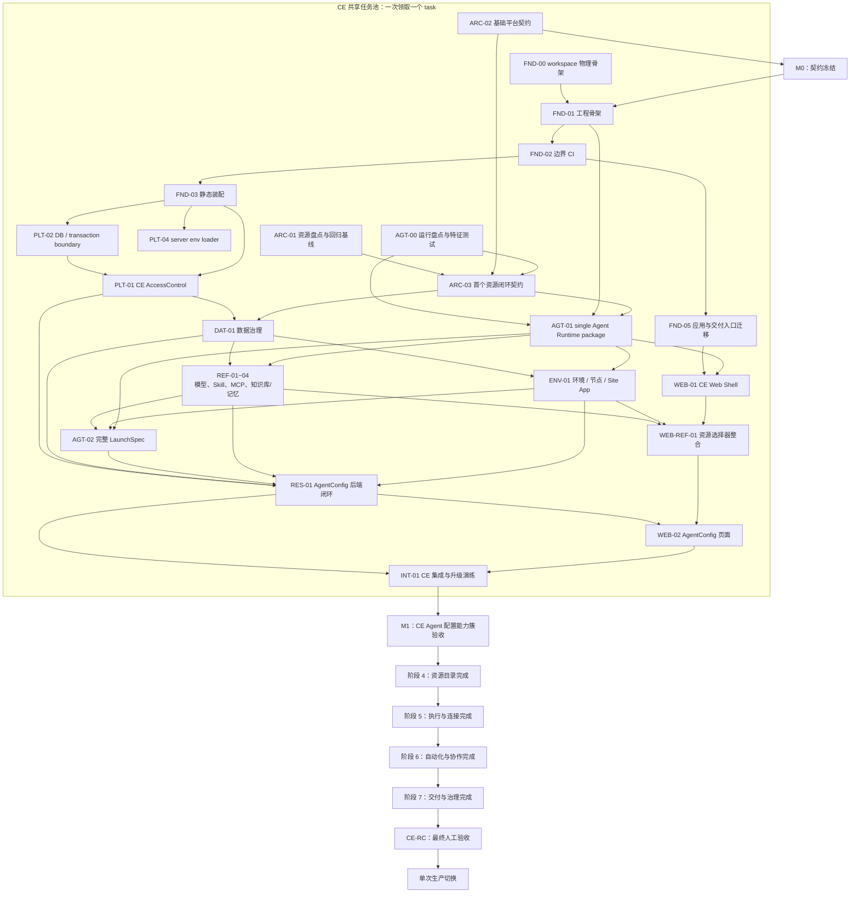

# CE 架构重构协作计划

**目标：** 先完成可运行的 CE「Agent 配置能力簇」（身份与授权、模型/Provider、Skill、MCP、知识库、环境节点、AgentConfig、Agent 执行、`/web` 与 Web）并通过 M1 人工验收，再继续完成阶段 4 至 7 的全部 CE 重构。阶段 7 的 `CE-RC` 最终验收通过后，从冻结的线上版本一次性迁移并切换到最终 CE 版本。

**范围：** 本计划覆盖 CE 阶段 0 至 7，不执行 EE task、EE 仓库修改、submodule 接入或 EE 联调。AGT-01 只将原 `src` 中最终属于 Environment、Instance、Runtime 生命周期与 relay/session 组合的实现迁入 `@fenix/agent-runtime`；LaunchSpec 资源解析、Machine 接线和 Workflow transport 留在原位置，随后由 REF/ENV/EXE/ORC/AGT-02 直接迁到最终模块。Core、orchestration、Chat/YJS 与 remote runtime 四个基础包始终独立；Skill、MCP、模型/Provider、知识库、记忆、Machine/Sandbox、站点应用的 **AgentConfig 所需能力** 属于首个闭环，其剩余能力按第 10 节冻结的资源清单在 M1 后完成。

**原则：** 不重写 Elysia、Drizzle 或前端路由框架；不建设动态插件平台。使用 workspace、package exports、依赖边界检查等开源能力，仅保留 `fenix.module.ts + assembly profile + 构建期 registry` 这一层静态产品线装配逻辑。

关联设计：[CE/EE 工程架构设计](./ce-ee-engineering-architecture.md)、[ADR-0001](../../adr/0001-ce-local-refactoring-and-api-boundaries.md)。

---

## 1. 团队协作模型

CE 使用一个按依赖排序的共享任务池；当前执行者一次只领取一个前置条件已满足的 task。不要按后端/前端机械拆分：资源的后端、页面、数据、调用方和测试应按可运行垂直切片交付。

| 工作流 | 负责人 | 工作方式 | 首要交付 |
| --- | --- | --- | --- |
| CE 共享任务池 | 当前执行者 | 从文末总表领取“前置已完成”的 task；一次只执行一个 task | M1 闭环、阶段 4 至 7、CE-RC |
| 人工验收 | 用户 | 审查 M1 与 CE-RC 的 review/e2e 证据，明确允许后才进入下一段 | M1 后继续；CE-RC 后允许生产切换 |

**协作约束：**

1. `platform-sdk`、assembly schema、根 workspace、Drizzle migration journal 不属于任何固定人员；由**当前领取对应 task 的 CE 负责人**独占修改。涉及这些共享文件的 task 未合并前，其他 CE task 不得修改同一文件。
2. 任何跨包依赖只能通过公开 package export；新增依赖必须同时更新 package dependency 和边界测试。
3. 每个 task 只产生一个实现 commit；不要把不属于该 task 的目录搬迁、表结构治理和业务行为重写混入。review 文档和 M1/CE-RC 的 E2E 结果文档保留在工作区但不提交。
4. 每个 task 依次执行“实现 → review → 修复 → 再 review”，直到没有问题，再运行规定验证并提交。若出现无法安全决策且影响重大的问题才暂停；可自行决策的问题必须记录在该 task 的 review 文档中。
5. 同一个资源切片的旧/新写路径不能并存。中间版本不发布，调用方切换后直接删除旧内部入口，不创建兼容 facade、alias 或双写。
6. EE 位于独立仓库并平行推进，不属于本计划任务、依赖或验收范围；CE 仍保持已冻结的公开扩展边界，但不为 EE 执行集成工作。

### 任务编号规则

任务 ID 的**前缀表示工作类别，不表示迁移阶段**；阶段以“架构阶段与 task 归属”表和总表的“阶段”列为准。同一阶段出现多个前缀是正常的，跨阶段的工作必须拆为不同 task。

| 前缀 | 含义 | 适用内容 |
| --- | --- | --- |
| `ARC` | Architecture | 架构盘点、边界与契约冻结 |
| `FND` | Foundation | workspace、包边界、应用入口等工程骨架 |
| `PLT` | Platform | 授权、数据库/事务、观测、env 等平台能力 |
| `AGT` | Agent | runtime、实例、LaunchSpec |
| `DAT` | Data | schema、数据迁移与数据治理 |
| `REF` | Resource Foundation | 首个闭环所需的依赖资源能力 |
| `RES` | Resource | 首个闭环中的 AgentConfig 资源模块 |
| `WEB` | Web | Web Shell、资源页面与调用方迁移 |
| `INT` | Integration | 集成验证、升级演练与验收 |
| `RSC` | Resource Slice | 首期以外单个资源的标准迁移任务组 |
| `EXE` | Execution | 运行、连接与执行基础设施 |
| `ORC` | Orchestration & Collaboration | 基于 `@fenix/chat-channel` 既有 Chat/YJS 边界及 `@fenix/agent-runtime` 组合入口的 Workflow、Scheduler、Webhook、Channel 等协作与编排能力 |
| `DEL` | Delivery | 发布、部署、运维与治理 |

## 2. 关键里程碑与并行关系

### 架构阶段与 task 归属

每个 task **只能属于一个** [架构设计第 13.2 节](./ce-ee-engineering-architecture.md#132-阶段与顺序)的阶段；跨阶段事项必须拆为独立 task。阶段定义交付边界，依赖关系只表达“何时可开始”，不得据此把多个阶段的工作混进一个 task。

| 架构阶段 | 本计划 task | 阶段边界 |
| --- | --- | --- |
| 0. 基线冻结 | ARC-01、AGT-00 | 盘点、回归特征测试与迁移风险；不改目标架构实现 |
| 1. 工程骨架 | FND-00、FND-01、FND-02、FND-05 | workspace、公开包边界、应用入口和构建/测试入口；不抽取平台实现或业务代码 |
| 2. 平台基础 | ARC-02、FND-03、PLT-01、PLT-02、PLT-04 | 可替换的 platform 契约/实现、静态装配、env 与 DB/事务；不迁移资源领域 |
| 3. 最小闭环 | ARC-03、DAT-01、AGT-01、REF-01 至 REF-04、ENV-01、AGT-02、WEB-01、WEB-REF-01、RES-01、WEB-02、INT-01 | AgentConfig 及其当前运行必需资源能力的唯一闭环；不迁移其余历史资源能力 |
| 4. 资源目录 | 第 10 节冻结的 `RSC-<resource>-01` 至 `06` | 首个闭环外的资源按单资源完整迁移；Machine/Sandbox 本阶段只完成资源控制面，执行与连接归阶段 5 |
| 5. 执行与连接 | EXE-01 至 EXE-04 | AgentConfig 闭环外的 Machine、workspace/file、Sandbox 与引擎适配能力迁移；复用 `@fenix/agent-runtime` relay/runtime port |
| 6. 自动化与协作 | ORC-01 至 ORC-04 | 基于已迁移 Chat/YJS 边界迁移 Workflow、Scheduler、Webhook、Channel，并完成阶段集成验收 |
| 7. 交付与治理 | DEL-01、DEL-02、DEL-03、DEL-04、CE-RC | release/preflight、镜像/Compose、operations、历史入口退役、遗留目录归属确认、最终升级与恢复验收 |

`M1` 是 AgentConfig 最小闭环的人工验收节点，不是生产发布点。M1 必须留下未提交的 review 历史和 `e2e.md`，全绿并经人工确认后才进入阶段 4。`CE-RC` 是阶段 7 后的最终人工验收节点；只有冻结线上版本到最终版本的完整迁移、恢复演练和全量 E2E 均通过并经人工确认后，才进入停机维护窗口执行单次生产切换。

## 3. 准备阶段：架构冻结与可回归基线

### ARC-01：建立重构清单与责任地图

**负责人：** CE 任务池；历史上由 EE-C 参与企业身份/权限边界盘点，该参与不构成后续依赖
**前置：** 无  
**产出：** `docs/arch/ce-refactoring-inventory.md`、每个首批 task 的 owner 和依赖关系。

- [x] 从 `FUNCTIONAL_MODULE_INVENTORY.md`、`src/`、`web/`、`src/db/schema.ts` 汇总首批 AgentConfig 闭环涉及的表、route、service、页面、外部依赖和调用方。
- [x] 为每一项标注目标归属：`platform`、`agent-runtime`、`resources/agent-config`、`apps/server` 或 `apps/web`。
- [x] 明确保留的公开行为：资源 ID、现有数据可读性、AgentConfig 创建/查询/更新/删除/run、认证失败和越权失败语义。
- [x] 明确删除清单：切换完成后必须删除的旧 route/service/page；禁止新增长期兼容转发。
- [x] 为 AgentConfig 的 list、CRUD、run 和权限拒绝补齐或确认现有回归测试；记录当前耗时、错误日志字段和关键 API 返回样例。

**验收：** 任意开发者能根据清单定位一个旧实现、它的目标包、迁移风险、测试入口和删除条件。

### ARC-02：冻结基础平台公共契约

**负责人：** CE 任务池；历史上由 EE-C 确认 `AccessControlModule` 的企业替换需求，该确认不构成后续依赖
**前置：** 无；可与 ARC-01、AGT-00 并行
**状态：** ✅ 已完成
**产出：** 更新 `docs/design/ce-ee-refactoring/ce-ee-engineering-architecture.md`；必要时创建 `docs/adr/` 下的 ADR。

- [x] 确认 `ResourceScope`、`ResourceContext`、`ResourceQueryConstraint`、`AccessControlModule` 的 TypeScript 签名和拒绝语义。

  > **NOTE:** “拒绝语义”尚未具体定义，应在开发过程中逐步完善。

- [x] 确认平台与应用的 package ID、公开入口、module kind、assembly profile 与 env 声明形态；资源和 Agent 的具体 package export 留给 ARC-03。
- [x] 确认数据库/事务、认证主体到 `AccessControlModule` 的基础依赖方向与拒绝语义；平台实现不得依赖任何资源领域模型。

**验收：** 既有参与者已确认可替换平台边界无阻塞问题；阶段 1、2 的工程与平台任务无需等待业务盘点即可开始。冻结后只能通过 ADR 修改。

### ARC-03：冻结首个资源闭环契约

**负责人：** CE 任务池；AgentConfig 与强依赖资源整理负责人参与确认
**前置：** ARC-01、ARC-02、AGT-00
**状态：** ✅ 已完成；冻结契约见 `docs/arch/ce-refactoring-inventory.md` 第 14 节，后续只能通过 ADR 修改
**产出：** `docs/arch/ce-refactoring-inventory.md` 的冻结版本，以及资源/Agent 公开接口与迁移范围记录。

- [x] 确认 AgentConfig 对 Agent 的唯一授权边界，并冻结 AGT-01 阶段性 `HostLaunchSpecPort` 与 AGT-02 完整 spec 切换；AGT-01 不重排 Environment→Instance→controller→builder→core 现有链路，runtime 不查询权限。
- [x] 确认 AgentConfig、`@fenix/agent-runtime` 组合 package 和强依赖资源的公开 Service/DTO、module ID、经 ADR-0001 修订的 `/web/agent-configs` 路由与 Web contribution ID；运行隔离主体 DTO 归属 `@fenix/platform-sdk`，Agent Runtime package ID 不再作为待选项；既有四个基础运行包保持独立。
- [x] 确认模型/Provider、Skill、MCP、知识库、记忆、节点/Sandbox、Site App 的首期迁移范围与依赖顺序，并确认 Environment 只作为 `@fenix/agent-runtime` 包内运行上下文；AGT-01 不迁移其他领域逻辑，REF/ENV/EXE/ORC/AGT-02 分别从原位置直接迁到最终模块。

**验收：** 资源迁移负责人对首个闭环的接口、路由、数据治理范围与运行边界无阻塞问题；后续资源/Agent task 不再重新定义平台契约。

### AGT-00：Agent 运行链路盘点与特征测试

**负责人：** CE 任务池
**前置：** 无；与 ARC-01、ARC-02 并行  
**状态：** ✅ 已完成
**主要文件：** `src/services/orchestration-instance.ts`、`src/services/launch-spec-builder.ts`、`src/services/environment-*.ts`、`src/transport/agent-relay.ts`、`packages/orchestration/`、`packages/plugin-sdk/` 及现有运行测试。

- [x] 画出实例创建/复用/停止、ACP relay、LaunchSpec、Environment、引擎调用和资源释放的实际调用图，标明哪些逻辑属于 runtime、哪些属于 AgentConfig 或其他资源。
- [x] 记录当前实例 ID、session ID、relay、取消、超时、失败释放和并发额度的行为样例，写入 `docs/arch/agent-runtime-extraction-map.md`。
- [x] 为运行链路补齐不依赖新 package 的特征测试，覆盖“启动成功、启动失败释放、停止、复用、取消/超时”最小集合。
- [x] 向 ARC-03 提供 `AgentRuntimeModule`、`AgentInstanceStarter`、LaunchSpec 输入输出的候选边界；具体公开签名由 ARC-03 冻结后再开始代码提取。

**验收：** 负责人不修改共享 workspace、SDK 或 migration 文件，也能完成真实调用图和可保护现有行为的测试；`AGT-01` 不需要再次探索运行链路。

## 4. 第一波：工程骨架与可执行治理

### FND-00：建立可并行的 CE workspace 物理骨架

**负责人：** CE 任务池
**前置：** 无；可与 ARC-01、ARC-02 并行
**状态：** ✅ 已完成
**主要文件：** 根 `package.json`、`bun.lock`、`apps/`、`packages/platform/`、`packages/agent-runtime/`、`packages/resources/`。

- [x] 将 workspace 规则扩展为覆盖 `apps/*` 与两级 `packages/*/*`，同时保留当前已有 `packages/*` 的构建入口。
- [x] 创建 `apps/server`、`apps/web`、`platform-sdk`、`access-control`、`agent-config` 的最小 `package.json` 和 README，以及 `packages/agent-runtime/` 的职责 README；README 仅说明目标职责和预计承载的实现。
- [x] 每个 manifest 只声明 package 名称、描述、私有属性和 ESM 类型；不声明 exports、跨包依赖、module ID、入口文件或 TypeScript path/project reference。
- [x] 不移动现有 `src/index.ts` 或 `web/src/main.tsx`，不创建运行时/实例 package，也不改变根入口的运行方式。
- [x] 通过 `bun install` 更新 workspace lockfile，并验证 `bun install --frozen-lockfile`、`bun run build:web`、`bun run precheck` 不被骨架改动破坏。
- [x] 在具备 PostgreSQL 的环境运行 `bun run dev`，确认数据库初始化完成并监听 `0.0.0.0:3000`。

**验收：** Bun 可识别新 package；当前根入口仍是唯一运行入口；ARC-02 可在既有目录中冻结正式 package 契约，而无需重新安排 workspace 或目录结构。

### FND-01：完善 workspace package 与应用入口骨架

**负责人：** CE 任务池
**前置：** FND-00
**状态：** ✅ 已完成
**主要文件：** 根 `package.json`、`tsconfig.json`、`apps/server/`、`apps/web/`、`packages/platform/`、`packages/agent-runtime/`、`packages/resources/`。

- [x] 为 `apps/*` 和既有一级 `packages/*` 建立 workspace package 的基础 metadata、构建配置与 TypeScript 项目边界；两级领域 package 在 ARC-02/ARC-03 后由其所属阶段任务声明公开 export。
- [x] 配置 TypeScript path/project reference，使跨包只能通过包名导入；本 task 不迁移任何领域实现。
- [x] 只创建 `apps/server`、`apps/web` 的空装配入口和构建配置，不在本 task 移动现有 `src/index.ts` 或 `web/src/main.tsx`；入口迁移由 FND-05 独立完成，避免与 package 契约冻结互相阻塞。
- [x] 在 CI 验证当前 `bun run dev`、`bun run build:web`、`bun run precheck` 未被骨架改动破坏。

**验收：** 后续负责人可在新 package 目录独立开发；当前根入口仍是唯一运行入口且全量检查通过。

### FND-02：将包依赖矩阵变成 CI 规则

**负责人：** CE 任务池  
**前置：** FND-01  
**主要文件：** `dependency-cruiser` 配置、Biome/ESLint import 限制、`scripts/ci.ts`、开发规范文档。

- [x] 引入并配置 `dependency-cruiser`，检查循环依赖及 `platform → agent-runtime/resources/apps`、`agent-runtime → resources`、CE → EE 等禁止方向。
- [x] 增加规则：禁止跨包导入 `packages/**/src/**`；只能导入 package export。
- [x] 将检查加到 `precheck`，输出违反依赖的源文件、目标文件和规则名称。
- [x] 为一条合法公开导入、一条非法内部导入、一条循环依赖分别建立 fixture 或 CI 校验用例。

**验收：** 人为添加一次非法 `src/**` 跨包导入时 CI 明确失败；合法包导入通过。

### FND-03：实现配置驱动的静态模块装配

**负责人：** CE 任务池  
**前置：** FND-02、ARC-02
**主要文件：** `packages/platform/platform-sdk/`、`scripts/generate-module-registry.ts`、`apps/generated/module-registry.ts`、`deploy/assembly/ce.json`、`apps/server/src/bootstrap.ts`。

- [x] 定义 `ModuleManifest`、`AssemblyProfile`、module kind、依赖校验和 Web contribution 类型；SDK 不依赖 CE 的具体授权或资源包。
- [x] 每个基础平台可装配包提供 `fenix.module.ts`，声明稳定 ID、类别、装配依赖、env 声明及贡献；资源与 Agent Runtime manifest 在 ARC-03 后随各自 task 添加。
- [x] 编写构建期扫描脚本，生成仅含静态 import 的 registry；生成文件加入 `.gitignore` 或 CI 再生成校验，二选一并写清规则。
- [x] 实现 assembly JSON/YAML 的 Zod 校验：禁止 import 路径、URL、代码片段；校验重复模块、类别不匹配和未满足依赖。
- [x] 在 bootstrap 中完成“读取 profile → registry 校验 → 汇总 env → 创建模块 → 挂载贡献”的顺序，不引入运行时下载或热加载。

**验收：** 修改 profile 可替换已内置模块组合；引用未知 ID、漏依赖或类型错误时启动失败；新增 manifest 后只需生成 registry，无需手改 app 注册表。

**阶段说明：** FND-03 使用注入式 manifest 验证上述通用装配行为；`deploy/assembly/ce.json` 先固定目标模块 ID，不以占位实现伪造当前可启动组合。PLT-01 补齐真实 access-control 工厂，AGT-01 补齐 Agent Runtime manifest，并在两者均进入 registry 的集成基线上增加不注入 manifest 的默认 bootstrap smoke test。

### PLT-04：统一 server env loader

**负责人：** CE 任务池  
**前置：** FND-03  
**主要文件：** `packages/platform/platform-sdk/`、`apps/server/` bootstrap、env loader 测试。

- [ ] 将当前 `src/env.ts` 的进程变量拆成 server host env 与模块声明 env；模块禁止自行读取 `process.env`。
- [ ] 在 bootstrap 汇总启用 manifest 的 env 定义，使用 Zod 一次性读取/校验并以构造参数注入模块。

**验收：** 缺失 EE 专属 env 不影响 CE；启用 EE 模块时缺失变量阻止启动；所有 server module 仅消费注入的配置对象。

### FND-05：迁移应用与交付入口

**负责人：** CE 任务池
**前置：** FND-02
**主要文件：** `apps/server/`、`apps/web/`、根 `package.json`、`scripts/ci.ts`、Bun/Vite/测试配置与入口文档。

- [x] 将现有 `src/index.ts` 与 `web/src/main.tsx` 分别迁入 `apps/server`、`apps/web`；保留现有服务和前端模块，只改变应用入口与装配位置，不迁移资源领域代码。
- [x] 修正根 `package.json` 的 Bun scripts、TypeScript/Vite 配置、测试解析路径及生产构建产物路径，使开发、测试和生产构建均从 `apps/*` 入口执行；不得新增指向旧入口的兼容 script。
- [x] 更新根 `scripts/ci.ts` 的 format、lint、typecheck 与 test 路径：纳入 `apps/*`，并删除仅为已迁移 app 入口保留的根路径。尚未迁移的领域代码仍位于根 `src/`、`web/` 时，保留其检查路径并在 task 清单中标记后续归属，不得为了路径整洁提前排除检查。
- [x] 删除已迁移的根入口，并逐项记录仍引用根 `src/`、`web/` 的构建、测试、Vite、Docker、Compose、脚本和文档路径及其所属后续 task；运行 server、Web build 与测试，确认根目录不再存在第二条应用启动路径。

**验收：** `apps/server`、`apps/web` 是唯一应用入口；现有功能行为不变，开发、测试与生产构建均可运行；根 `scripts/` 只保留全仓薄命令，不承载复制出的 app 或领域逻辑。镜像与 Compose 切换由阶段 7 的 DEL-02 完成。

#### FND-05 遗留路径处置映射

| 路径或引用 | 当前处理 | 后续唯一归属 |
| --- | --- | --- |
| 根 `src/`、`web/` 的领域实现与其测试 | 保留；应用入口已移除，不为目录整洁提前迁移业务实现或排除 CI 检查 | 阶段 3 的 ARC-03、AGT-01、REF-xx、ENV-01、WEB-xx 及阶段 4 的 RSC-xx，最终由 DEL-04 人工确认目录处置 |
| `Dockerfile` 的 `src/index.ts` 构建、`web/dist` 复制路径 | 保留旧交付路径；本 task 不修改 Docker 以避免与交付阶段并发冲突 | DEL-02 |
| `docker-compose.yml` 与 `docker/prod/` Compose | 本轮不变；逐项确认镜像启动与卷挂载是否依赖旧产物 | DEL-02 |
| `build-image.sh`、`restart-server.sh` | 继续调用根 `package.json` 薄命令，已随新 script 自动进入 apps 入口；不得在脚本中新增旧入口路径 | DEL-03 复核发布脚本 |
| `CONTRIBUTING.md`、`CLAUDE.md`、`drizzle/README.md` 与源码内启动路径说明 | 已更新活动入口说明；历史盘点、设计和 issue 文档中的旧路径不按文本批量改写 | DEL-04 人工确认文档归属 |

## 5. 第二阶段：平台基础与后续领域任务

### PLT-01：抽取 CE 身份、授权与资源范围实现

**负责人：** CE 任务池  
**前置：** ARC-02、FND-03、PLT-02
**主要文件：** `packages/platform/platform-sdk/`、`packages/platform/access-control/`、现有认证/组织上下文代码。

- [ ] 保留当前 session、API Key、组织上下文的认证入口语义，但将 member/role 查询封装在 `AccessControl` 内。
- [ ] 实现 `createResourceContext()`、`buildResourceQueryConstraint()`、`authorize()`；资源 service 不再直接读取 member/role 表。
- [ ] 为不同主体、无组织成员、跨组织访问、写入归属、列表范围约束建立单测与集成测试。
- [ ] 提供供 repository 使用的声明式范围条件；禁止授权模块返回 SQL fragment。
- [ ] 在 `access-control` manifest 中装配真实工厂并登记资源 cleanup；禁止保留缺失工厂或占位实现。

**验收：** CE 默认实现通过 `AccessControlModule` 契约测试；平台代码不向未来资源调用方暴露 member/role 查询，且授权查询约束可由 repository 端口消费。

### PLT-02：建立数据库连接与事务边界

**负责人：** CE 任务池
**前置：** FND-03
**主要文件：** `packages/platform/platform-sdk/`、`apps/server/` 的数据库装配、`db/` 的迁移执行入口及数据库测试基础设施。

- [x] 明确 repository 与 data migration runner 直接使用 PostgreSQL + Drizzle；事务边界由现有 Drizzle transaction 保证，不提前引入通用数据库端口。
- [x] 保持 PostgreSQL + Drizzle 的 CE host 连接由 server 统一创建和关闭；repository 直接接收已创建的 Drizzle db，保持 `drizzle.config.ts` 与模块 schema 所有权规则不变。
- [x] 让 migration runner 直接使用专用的 Drizzle migration client/连接；迁移逻辑仍归模块所有，应用进程启动时不得自动执行 data migration。
- [x] 建立连接初始化失败、事务提交、事务回滚与 migration runner 无业务 service 依赖的测试；测试直接针对 Drizzle host 与 migration runner 边界。
- [x] 不为尚未存在的第二种数据库实现引入 `databaseType` 分支或通用 ORM 抽象，也不迁移任何资源 schema、repository 或业务 service。

**验收：** server、repository 和 data migration runner 通过明确的 PostgreSQL/Drizzle 数据库与事务边界协作；测试证明失败不会提交半完成事务，资源领域不自行创建连接。未来出现第二种数据库实现或独立迁移连接时，再按真实用例设计窄接口。

### DAT-01：治理 AgentConfig 能力簇的资源数据模型和迁移

**负责人：** CE 任务池；领取者独占 Drizzle migration journal，其他 schema task 等待该 task 合并  
**前置：** PLT-01、ARC-03
**主要文件：** `packages/resources/agent-config/db/schema.ts`、根 Drizzle 配置、`db/migrations/`、`packages/resources/agent-config/db/data-migrations/`。

- [ ] 将 AgentConfig 及归属明确的绑定表 schema 移到模块内；生成结果证明物理移动没有旧表 drop/recreate，仅保留冻结的 expand DDL。
- [ ] 沿用稳定不可变 UUID；引用、URL、Machine name 与动态 payload 清单供后续实际迁移 task 使用，DAT-01 不改写这些现有引用。
- [ ] 按 ARC-03 冻结的等价结构保留 `organization_id + user_id` 物理 ownership，业务 visibility 与历史 permission grant 分离，不创建通用 ownership JSONB 或新 grant 表。
- [ ] AgentConfig 功能性 schema 变更仅新增 `visibility`；不新增 revision、built-in、生命周期、删除恢复、删除幂等或迁移审计结构。RES-01 在写入口切换窗口复用同一 planner 做 permission delta 回填与核查，期间禁止双写。
- [ ] `user_config` 标记为废弃；DAT-01 不修改其 schema、service 或 route，也不迁入新 package。后续清理旧配置接口时删除相关无调用方前端代码和整张表。
- [ ] migration journal 与独立 data-migration 进程复用既有 `data_migrate_record` 标记完成，并通过空库与升级库演练。

**验收：** AgentConfig 与五组既有聚合表的物理定义归包且没有 drop/recreate；迁移只增加 `visibility` 并安全回填可无损映射的公开 grant；`user_config` 和其他引用保持原样。业务 CRUD 的 stable ID 切换由 WEB-02/RES-01 在 M1 验收。

### AGT-01：抽取无权限 Agent Runtime 组合 package

**负责人：** CE 任务池  
**前置：** ARC-03、FND-01、AGT-00
**主要文件：** `packages/agent-runtime/` 与原 `src` 中的 Environment/Instance 生命周期、并发及 relay/ACP session 组合实现；`packages/core/`、`packages/orchestration/`、`packages/chat-channel/`、`packages/remote-runtime/` 作为保持不变的依赖边界。LaunchSpec 资源解析、Machine、Workflow 和非 runtime route 不在本任务迁移文件范围内。

- [ ] 将原 `src` 中 Environment、Instance、生命周期、并发、relay 与 ACP session 的运行编排迁入 `@fenix/agent-runtime`，形成统一对外入口和组合层；不为迁移改写在线控制流、状态机、协议或释放顺序。
- [ ] `@fenix/agent-runtime` 通过公开 exports 依赖 `@fenix/core`、`@fenix/orchestration`、`@fenix/chat-channel` 与 `@fenix/remote-runtime`；四个基础包的源码、manifest、依赖和测试边界保持不变，不复制进组合包。
- [ ] LaunchSpec 资源解析、Machine 接线、Workflow transport 与不属于 runtime 的协议 route 保持原位置；只建立维持现有调用链所需的最小接口，等待对应任务时直接迁到最终归属。
- [ ] 阶段性 `HostLaunchSpecPort` 原样保留当前受信 `extraEnv` 覆盖与 `interactive | scheduled | system` 来源；现有资源 I/O 保持原位置，AGT-02 再直接迁到公开 resolver。
- [ ] 保留实例创建/复用/停止、Coordinator singleflight 与 generation fencing、relay/session 隔离、Chat/YJS 恢复和背压等 AGT-00 特征行为。
- [ ] 在 ARC-03 冻结后定义组合 package 的内部目录、公开 exports、通用 launch spec 与启动端口；新增的 Environment/Instance/生命周期编排归组合包，既有基础能力继续使用各自 workspace package。
- [ ] 在 `packages/agent-runtime/fenix.module.ts` 提供稳定 ID 和 kind 均为 `agent-runtime` 的 manifest，并由 profile 的 `agentRuntime` 槽位选择；在 PLT-01 工厂已进入 registry 的集成基线上，增加默认 CE profile 不注入 manifest 的 bootstrap smoke test。
- [ ] 将仅由官方 Web 使用的交互式启动入口迁到 `POST /web/agent-configs/:agentConfigId/instances`，使用 `/web` 标准 envelope，并复用同一 interactive runtime facade；前端停止自行查找或创建 Environment。
- [ ] 删除未发布的 `POST /api/agents/:agentId/instances`，不建立 alias 或转发；保留已发布的 `POST /api/agents/:agentId/instances/connect` 的路径、DTO、认证、错误与 relay 行为。
- [ ] 内部 connect/relay 类型使用中性的 external 命名；这只调整内部命名，不改变外部 HTTP 合同。
- [ ] 覆盖 `/web` interactive start、旧未发布入口不再挂载、外部 connect 合同保持不变，以及原有无 Environment 时自动创建、额外实例创建和错误映射行为。

**验收：** `@fenix/agent-runtime` 是 Environment、Instance、Runtime 生命周期与 relay/session 组合实现的唯一新归属；四个既有基础运行 package 均保持独立且由组合包通过公开 exports 引用；根 `src` 不保留同职责实现或转发桥；AGT-00 特征测试保持通过。资源、Machine、Workflow 逻辑仍在原位置且行为不变，只通过最小接口接入；其最终迁移由 REF/ENV/EXE/ORC/AGT-02 验收，不伪装成 AGT-01 已完成。

### WEB-01：建立 CE Web Shell 与资源 Web 装配骨架

**负责人：** CE 任务池  
**前置：** FND-03、FND-05、AGT-01
**主要文件：** `apps/web/src/shell/`、`apps/web/src/routes/`、`apps/web/src/app.tsx`。

- [ ] 将当前全局 Provider、认证后布局、导航和首页责任收敛到 CE `apps/web` Shell。
- [ ] 建立 profile 驱动的静态 Web contribution 读取与薄 route adapter，并真实接入 TanStack Router；不做运行时远程脚本加载，不以仅供导航消费的路由元数据代替路由注册。
- [ ] 禁止 Web 子路径导入 server-only package root、service、repository、db 或 adapter。

**验收：** CE Shell 可渲染；profile 选择的已存在资源 Web contribution 可注册路由；浏览器 bundle 不含 server-only 依赖。本 task 不创建任何 AgentConfig 或其他业务资源页面。

## 6. AgentConfig 的真实依赖与前置资源任务

当前实现不是“一个 AgentConfig 表 + run 按钮”。盘点 `src/routes/web/config/agents.ts`、`src/services/config/agent-config*.ts`、`src/services/launch-spec-builder.ts` 和相关 schema 后，首期必须保留的依赖如下：

| 依赖资源/能力 | AgentConfig 在何处使用 | 首期必须迁移的能力 |
| --- | --- | --- |
| 模型、Provider、模型网关凭证 | 创建/编辑选择 `modelId`；run 解析协议、地址、模型名和凭证 | 可见模型查询、模型/Provider 校验、运行配置解析、网关凭证解析 |
| Skill | 编辑绑定 Skill；详情/列表显示；run 读取源目录并生成/使用归档 | 可见 Skill 查询、ID 校验、绑定、Skill 文件/归档运行解析 |
| MCP Server | 编辑绑定 MCP；详情显示；run 转换为 MCP launch config | 可见 MCP 查询、ID 校验、绑定、运行配置解析 |
| 知识库、Agent knowledge binding | 编辑绑定和策略；详情展示；run 加入知识库 MCP | 可见知识库查询、绑定及策略、运行时知识库解析 |
| Agent memory | 编辑 `enableMemory`；run 决定 Hindsight/记忆配置 | 记忆开关和运行时配置解析 |
| Machine、Sandbox、Environment | 编辑 `agentNode`；运行时选择执行节点；删除 AgentConfig 时停止并清理关联 Environment | 节点可用性校验、Environment 关联、实例停止与清理 |
| Site App | 编辑绑定、详情显示并提供站点应用能力 | 可见站点应用查询、ID 校验、绑定和运行所需解析 |

这些任务不是要求所有资源的所有历史页面和边缘功能一次性完全重写；但凡 AgentConfig 当前创建、查询、编辑、删除或运行会调用的资源能力，都必须迁入目标 package 并提供公开 Service，不能让新 `agent-config` 反向调用旧 `src/services/**`。Environment 是例外：其实体、repository 和生命周期迁入 `@fenix/agent-runtime`，AgentConfig 只经 AgentConfig/Instance facade 接入，不公开 Environment Service。

### REF-01：迁移模型、Provider 与运行凭证能力

**负责人：** CE 任务池  
**前置：** PLT-01、DAT-01、AGT-01
**主要文件：** `packages/resources/model/`，以及模型网关运行凭证的公开服务。

- [ ] 只保留 `@fenix/model`：由 Provider 聚合根拥有 scope 与授权，Model 作为二级资源严格继承所属 Provider 权限；同包 repository 在数据库关联 Provider 后下推授权条件，并由一个 module contribution 挂载两组 `/web` 管理 route。AgentConfig 可通过同一根入口公开的 `ModelService` / `ProviderService` 查询可见项。
- [ ] 导出仅供运行使用的 `resolveRuntimeModel()` 服务，返回协议、模型名、base URL 和受控凭证引用；密钥不得返回给 Web 或日志。
- [ ] 迁移模型网关凭证分配/预算拒绝逻辑，作为 runtime model 解析的依赖，不使 `@fenix/agent-runtime` 直接访问 Provider 表。
- [ ] 迁移 AgentConfig 的 `modelId` 外键、历史 `model` 字段清理和回填测试。

**验收：** AgentConfig 用稳定 `modelId` 选择可见模型；Model 不具有独立 scope，Provider 权限变化自然作用于其全部 Model；缺失模型、无权限模型、无可用凭证、预算耗尽均在启动前给出明确错误。

### REF-02：迁移 Skill 资源与运行时文件解析

**负责人：** CE 任务池  
**前置：** PLT-01、DAT-01  
**主要文件：** `packages/resources/skill/`、Skill 文件/归档服务、AgentConfig Skill binding schema。

- [ ] 迁移 Skill CRUD、scope list、按 ID 查询、来源目录和归档管理；保留 `setSkill` / 导入时的文件写入、归档和失败回滚语义。
- [ ] 根入口导出 `SkillService`：提供 AgentConfig 所需的可见性校验、批量 ID 查询和运行时 Skill 描述；不让 AgentConfig 读取 Skill 表或文件目录。
- [ ] 迁移 `agent_config_skill` 绑定的读取、全量替换和删除引用检查；写入前校验所有 Skill 对当前主体可用。
- [ ] 将 launch spec 中的 Skill 源目录、归档过期重建、下载地址生成转为 SkillService 的公开运行解析能力。

**验收：** AgentConfig 能管理和运行其 Skill；不存在、不可见或归档失败的 Skill 不会生成伪成功的启动请求。

### REF-03：迁移 MCP Server 资源与运行配置解析

**负责人：** CE 任务池  
**前置：** PLT-01、DAT-01  
**主要文件：** `packages/resources/mcp/`、`agent_config_mcp` binding、MCP runtime config 解析。

- [ ] 迁移 MCP Server CRUD、scope list、ID 查询与配置校验；公开 `McpService`。
- [ ] 迁移 AgentConfig MCP 绑定的读取、全量替换和删除引用检查；写入前校验 MCP 对当前主体可用。
- [ ] 由 McpService 负责将持久化配置转换为受 runtime 使用的 MCP launch config，并对未知类型、无效 URL/命令、超时等给出确定错误。

**验收：** AgentConfig 的 MCP 选择、详情展示和启动配置均只经 McpService；runtime 不访问 MCP 表。

### REF-04：迁移知识库绑定与 Agent memory 配置

**负责人：** CE 任务池  
**前置：** PLT-01、DAT-01  
**主要文件：** `packages/resources/knowledge-base/`、Agent knowledge binding、`packages/resources/agent-memory/`。

- [ ] 迁移知识库可见性查询、Agent knowledge binding、优先级/策略校验、绑定计数和删除引用检查。
- [ ] 公开知识库运行解析服务，供 launch spec 生成知识库 MCP；AgentConfig 不直接读取 knowledge 表或 binding repository。
- [ ] 迁移 Agent memory 的启停状态和运行配置解析，保留当前 Hindsight 默认项与失败语义。

**验收：** 知识库绑定可按 scope 校验和持久化；已启用的知识库/记忆会进入 launch spec，未授权或不存在的引用明确失败。

### ENV-01：迁移运行节点、Site App 与 Environment 过渡 facade

**负责人：** CE 任务池  
**前置：** PLT-01、AGT-01、DAT-01  
**主要文件：** Machine/Sandbox/Site App 资源包、`apps/server` 的 Environment 过渡 facade、AgentConfig 绑定与删除编排。

- [ ] 将 `agentNode` 的 machine/sandbox 选择和节点可用性校验归到对应公开 Service；AgentConfig 只保存已校验的节点引用。
- [ ] 通过公开 port 接入 `@fenix/agent-runtime` 已迁移的 Environment/Instance 关联、实例复用和删除清理规则；Environment 只作为包内运行上下文和兼容期 locator，不创建独立 Environment 资源包、公开 Environment Service 或新的资源 API。
- [ ] 删除 AgentConfig 前由资源层调用无权限实例停止能力；现有 Environment route/page 只作为迁移期 facade 评估调用方和删除窗口，不进入长期公开契约。
- [ ] 迁移 Site App 的 scope 查询、绑定和详情展示所需解析；写入前校验关联资源可用。
- [ ] 覆盖节点不存在、节点无权限、停止实例失败、删除事务失败和 Site App 不可见的边界测试。

**验收：** AgentConfig 的节点、站点应用和包内 Environment 关联不依赖旧 service；删除不会留下运行实例或孤立 Environment；不存在独立 Environment 资源包或长期公开 API。

### AGT-02：从依赖资源组装完整 LaunchSpec

**负责人：** CE 任务池  
**前置：** REF-01、REF-02、REF-03、REF-04、ENV-01  
**主要文件：** `packages/agent-runtime/` 内部的 LaunchSpec builder，及其公开输入类型；具体路径由 ARC-03 冻结。

- [ ] 将仍在原位置的 LaunchSpec 资源 I/O 直接迁到所属资源 resolver；REF/ENV 完成后由 AGT-02 切为 AgentConfig 已授权快照生成的完整 spec，不将数据库行或 resource service 泄漏到稳定 runtime 内核。
- [ ] 将现有 `launch-spec-builder.ts` 的模型、Skill、MCP、知识库、记忆、系统提示、凭证和节点解析迁移到资源层显式注入的公开 resolver 调用，再将完整解析结果交给 runtime 的纯 `AgentLaunchSpecAssembler`；runtime 不注入或调用资源 Service。
- [ ] 保持 ACP/relay、plugin-sdk、引擎协议和错误码行为；失败必须在实例启动前被记录和返回。
- [ ] 覆盖完整 launch spec、每一种缺失/无权限依赖、凭证失败、Skill 归档失败和 MCP 配置失败。

**验收：** AGT-01 保持现有启动顺序和失败释放；AGT-02 切换后 runtime 只经宿主 port 获得完整 LaunchSpec，不直接查询任意资源表或读取资源权限。

### WEB-REF-01：迁移 AgentConfig 所需的资源管理与选择页面

**负责人：** CE 任务池；若资源页面随对应 REF/ENV task 完成，本 task 只整合选择器、路由和导航  
**前置：** REF-01 至 REF-04、ENV-01、WEB-01  
**主要文件：** 各资源包 `web/`、`apps/web` 薄路由和导航 contribution。

- [ ] 为模型/Provider、Skill、MCP、知识库、节点/Sandbox、Site App 提供当前 AgentConfig 用户流程所需的列表、创建/编辑或选择页面和 `/web` client；不创建 Environment 管理页面或公开 client。
- [ ] AgentConfig 表单通过各资源 Web API 获取可见可用项；不直接请求数据库或复用旧 `/web/config/*` endpoint。
- [ ] 保留每类引用资源的 loading、空状态、无权限、错误和重试体验。

**验收：** 用户能在新 CE Web 中先管理/选择所有 AgentConfig 必需资源，再创建、编辑和运行 AgentConfig。

## 7. 第三波：CE AgentConfig 端到端闭环

### RES-01：迁移 AgentConfig repository、service 与资源动作

**负责人：** CE 任务池  
**前置：** PLT-01、DAT-01、AGT-01、AGT-02、REF-01 至 REF-04、ENV-01  
**主要文件：** `packages/resources/agent-config/src/domain/`、`services/`、`repositories/`、`schemas/`、`routes/`、现有 AgentConfig service/repository。

- [ ] 迁移 AgentConfig DTO、领域规则、repository；所有 list/get/update/delete 查询接收 `ResourceQueryConstraint`，由 Drizzle 编译为查询条件。
- [ ] 实现 create/list/get/update/delete facade：从 `AccessControlModule` 获取 resource context、写入 ownership、执行动作授权；不直接读取 member/role。
- [ ] 通过注入模型/Provider、Skill、MCP、知识库/记忆、节点/Sandbox、Site App 的根入口公开 Service 完成引用校验、绑定、列表/详情展示和删除保护；Environment/Instance 关联仅通过 `@fenix/agent-runtime` 的启动 facade 处理，不依赖公开 Environment Service；不得导入其他包的 `src/**`、repository 或 schema，也不得调用旧 `src/services/**`。
- [ ] 实现 `resolveForRun()`：检查 `agent-config:use`，委托 AGT-02 的宿主 port 生成完整 LaunchSpec，再由 `AgentConfigRunFacade` 按 interactive/API/Workflow/legacy 入口接入现有 runtime 链路；本轮不新增 AgentConfig 生命周期状态机。
- [ ] 将第一方资源 route contribution 统一为 `/web/agent-configs` 和 `POST /web/agent-configs/:id/run`；删除旧 `/web/config/agents` name CRUD。既有外部 `/api/agents` 仅按 ARC-03/ADR-0001 冻结规则重接同一 Facade，禁止形成第二写路径，其删除必须另走 ADR 与退役窗口。
- [ ] 覆盖 CRUD、分页 list scope、跨 scope 拒绝、run 授权和 runtime 失败映射测试；并发控制增强不混入本轮重构。

**验收：** CE 用户可通过稳定 ID 管理和运行 AgentConfig；授权发生在资源层；runtime 不包含权限；同资源不存在旧/新双写路径。

### WEB-02：完成 AgentConfig CE 页面并切换调用方

**负责人：** CE 任务池  
**前置：** RES-01、WEB-01、WEB-REF-01  
**主要文件：** `packages/resources/agent-config/web/`、`apps/web/src/routes/`、现有 AgentConfig 页面/API 文件。

- [ ] 实现列表、创建/编辑、详情、删除和 run 的 API client、页面容器与路由适配；所有 URL 使用 `agentConfigId`，不以 name 操作资源。
- [ ] 为列表、表单提交、run、无权限、空状态、请求失败和重试实现用户反馈与 i18n。
- [ ] 完成调用方切换后删除旧 AgentConfig 页面、旧 API client、过期 i18n key 和导航入口。
- [ ] 删除已废弃的 `user_config` 功能：旧默认 Agent/模型偏好读写接口、无调用方 `ModelConfigDialog` 与 `modelApi.set`、相关 service/tests/schema 和数据库表；保留仍被使用的可用模型列表能力并迁入对应资源 API。
- [ ] 添加关键交互测试：带 scope 的列表、无权限资源不可见、run 成功/失败反馈。

**验收：** CE Web 只调用 `/web/agent-configs`；构建通过；旧 `/web/config/agents` 不再被引用。

### INT-01：CE 最小闭环集成与 M1 验收

**负责人：** CE 任务池
**前置：** FND-05、PLT-01 至 PLT-04、REF-01 至 REF-04、ENV-01、AGT-02、RES-01、WEB-02
**主要文件：** CI、部署 preflight、集成测试、operations 文档。

- [ ] 在空库和含历史 AgentConfig 数据的升级库分别执行 Drizzle migration 与 data migration。
- [ ] 执行 CE 身份/范围、AgentConfig CRUD/list/run、runtime 释放、Web UI 的端到端测试。
- [ ] 验证日志/审计不含密钥，且含 actor、resource、scope、instance 等必要诊断上下文。
- [ ] 演练失败处理：DDL 成功而 data migration 失败、runtime 启动失败、迁移核验发现 scope 回填异常；记录补偿/回滚操作。
- [ ] 将命令、环境、数据集、结果、失败修复和剩余风险写入工作区 `e2e.md`；该验收证据不提交。
- [ ] 全部检查全绿后暂停，等待人工审查历史 review 文档和 `e2e.md`；未获确认不得开始阶段 4。

**验收（M1）：** 新目录和 `/web/agent-configs` 是 AgentConfig 唯一第一方权威路径，外部 `/api` 只是同一 Facade 的薄 adapter；`bun run precheck`、`bun run build:web`、冻结线上版本升级演练及关键端到端测试全绿。M1 不发布生产。

## 8. 阶段 4 至 7：后续迁移与交付治理

以下 task 不属于 AgentConfig 最小闭环，必须在 M1 后按阶段领取；它们不得反向阻塞阶段 1 至 3。

### EXE-01 至 EXE-04：迁移执行与连接能力

**所属阶段：** 5. 执行与连接
**前置：** 阶段 4 全部 `RSC-*-06`
**主要文件：** Machine/workspace/file/Sandbox 资源与 transport adapter、`@fenix/agent-runtime` 公开 port、执行链路专项测试。

- [ ] `EXE-01 Machine 连接`：从原位置迁移 `/acp/ws`、远程 runtime、CLI/relay 接线与 Machine 在线状态投影；通过公开 port 接回 runtime，不复制 session 或 Instance 生命周期。
- [ ] `EXE-02 Workspace/File`：迁移 workspace 路径解析、本地/远程文件 transport、`/acp/file-ws`、文件事件与越界防护；远程 Machine 未连接时明确失败，不回退本地文件系统。
- [ ] `EXE-03 Sandbox 执行`：迁移 Sandbox 分配、复用、隧道、卷、集群执行与释放；保持阶段 4 资源控制面和阶段 5 执行面的窄接口。
- [ ] `EXE-04 引擎与阶段验收`：迁移引擎/plugin adapter、Skill 工作区安装等执行接线，删除已被最终模块替代的旧实现；覆盖连接、断连、取消、超时、重试、背压、资源释放及远程/本地隔离。

**验收：** EXE-01 至 EXE-04 均完成并各自提交；执行与连接能力不依赖旧运行路径，原位置的被替代实现已删除，runtime 保持无授权依赖。

### ORC-01 至 ORC-04：迁移协作与编排能力

**所属阶段：** 6. 自动化与协作
**前置：** EXE-04
**主要文件：** `@fenix/chat-channel` 的 Chat/YJS 公开边界、`@fenix/agent-runtime` 组合入口、Workflow、Scheduler、Webhook、Channel 对应模块与专项测试。

- [ ] `ORC-01 Workflow`：从原位置迁移 Workflow 定义、运行、节点、lease 与 Agent transport，并删除被替代实现；复用 runtime session/relay，不复制 JSON-RPC 流程。
- [ ] `ORC-02 Scheduler/Webhook`：迁移调度任务、触发器、Webhook ingress、幂等和取消边界，经 Workflow/资源公开接口执行。
- [ ] `ORC-03 Channel/Chat`：迁移 Channel 配置与消息路由，接入既有 `@fenix/chat-channel` Chat/YJS server 边界；保留确定性 session、隔离、重连与背压不变量，不重新提取内核。
- [ ] `ORC-04 阶段验收`：删除旧编排/协作入口与跨层引用，覆盖长连接断连恢复、调度幂等、取消、背压、权限隔离、租约和失败释放。

**验收：** ORC-01 至 ORC-04 均完成并各自提交；协作与编排能力按领域独立迁移，静态插件点与运行边界一致，不复制已有协议或生命周期栈。

### DEL-01：建立发布 preflight 与 release 编排

**所属阶段：** 7. 交付与治理
**前置：** ORC-04、PLT-04
**主要文件：** `deploy/env/`、`scripts/preflight.ts`、`scripts/release.ts`、`docs/operations/`。

- [ ] 创建无密钥 env 模板，并在 preflight 校验 assembly、DB 连通性与 migration/data migration 状态、必需目录和外部服务健康状态。
- [ ] 实现 release 薄编排：停写 → 备份/preflight → 完整 migration → data migration 与核验 → deploy → readiness/smoke/E2E → 流量切换；迁移失败时保持流量关闭。
- [ ] 记录冻结线上 revision、最终 CE revision、migration 版本与恢复限制，并为幂等重跑、前滚修复、数据库备份恢复和旧版本恢复提供可执行的 operations 文档。

**验收：** 发布前可发现配置、迁移和依赖服务问题；从冻结线上版本到阶段 7 最终版本的一次发布可追溯版本、执行顺序和恢复判断。

### DEL-02：迁移镜像与 Compose 交付入口

**所属阶段：** 7. 交付与治理
**前置：** FND-05、DEL-01
**主要文件：** `deploy/images/`、`deploy/compose/`、镜像构建与启动 smoke test。

- [ ] 将 Dockerfile、Compose 和部署脚本切换到 `apps/server`、`apps/web` 的唯一构建/运行入口，保留监听、健康检查和既有环境变量语义。
- [ ] 使用基础编排与静态 assembly 对应的 profile/overlay 表达数据库、模型网关、知识库、Sandbox 等依赖服务，不由业务代码自行启动容器。
- [ ] 在干净环境验证镜像构建、Compose 启动、readiness 和最小 API/Web smoke test。

**验收：** 镜像与 Compose 不再引用旧根入口；部署交付物可从静态 assembly 重现并健康启动。

### DEL-03：完成交付治理与历史入口退役

**所属阶段：** 7. 交付与治理
**前置：** ORC-04、DEL-02
**主要文件：** Product View、身份/组织/API Key、系统管理、平台诊断、`docs/operations/`、CI/release 配置与旧根目录文档。

- [ ] 迁移 Product View、身份/组织/API Key、系统管理、平台诊断和其余交付控制面的数据、route、Web、权限与运维入口，删除各自旧实现；Site App 领域已在阶段 4 迁移，本阶段只接部署 adapter。
- [ ] 将模块边界检查、release manifest、升级演练和 operations 文档纳入 CI/release 流程。
- [ ] 在全部替代入口验证后，完成已明确归属的旧入口、过时部署脚本和失真架构文档退役；更新根 `package.json`、`scripts/ci.ts`、测试/Vite 配置、Docker/Compose 与文档中所有已删除根 `src/`、`web/` 路径，并用 `rg` 验证无残留引用；尚未确认归属的目录不得在本 task 中猜测删除，转交 DEL-04。

**验收：** 新目录、CI、部署和 operations 文档是唯一权威入口；历史入口已删除且发布治理可审计。

### DEL-04：人工确认遗留目录归属并完成清理

**所属阶段：** 7. 交付与治理
**前置：** DEL-03
**主要文件：** `docs/operations/legacy-directory-disposition.md`、相关迁移目标、根 `package.json`、`scripts/`、CI/release 配置与文档。

- [ ] 建立遗留目录处置清单。逐项列出根 `src/`、`web/`、`drizzle/`、`docker/`、`scripts/`，以及 `packages/` 的旧一级包、`docs/` 的旧权威内容、`tools/`、`spec/`、`side-project/`、`workflow-examples/` 中每个候选子目录或文件；不得将 `packages/`、`docs/` 或 `scripts/` 整个目录作为删除目标。
- [ ] 每一项由人工确认且只选择一种处置：`保留`（记录长期职责、owner 与下次复核条件）、`迁移`（记录唯一目标路径、执行 task/commit、验证命令与源文件删除条件）或 `删除`（记录无替代保留理由、删除范围与回归验证）。未确认项保持在清单中，禁止凭目录名推断删除。
- [ ] 对已选择迁移的项，先在目标位置完成验证并切换全部调用方、构建/测试/交付脚本与文档引用，再删除源项；禁止复制后长期双存或新增兼容 shim。
- [ ] 对已选择删除的项，在删除后以 `rg` 检查仓库配置、CI/release、Docker/Compose、测试与文档不存在旧路径引用；按受影响范围运行 `precheck`、Web build、docs build、镜像/Compose smoke test 或对应专项验证。
- [ ] 清单中没有未确认项、没有缺少 owner/验证记录的保留项，且所有迁移/删除项均已在对应 commit 或 task 中完成后，才可将本 task 标记完成。

**验收：** 每个遗留候选都有经人工确认的唯一处置与可追溯证据；仓库不保留未说明的旧/新同职责逻辑、入口或文档；没有因批量删除目录而误删仍在使用的示例、规格或运行能力。

### CE-RC：阶段 7 完成与生产切换验收

**所属阶段：** 7. 交付与治理
**前置：** 阶段 4 全部 `RSC-*-06`、EXE-01 至 EXE-04、ORC-01 至 ORC-04、DEL-01 至 DEL-04
**主要文件：** 全仓验证入口、最终 migration/operations 文档、工作区 `e2e-final.md`。

- [ ] 从与冻结线上版本相同的 schema 和脱敏数据形态执行完整 DDL/data migration 链，核验所有资源 ID、scope、binding、引用、文件和运行状态；同时验证空库安装。
- [ ] 执行 CE 身份/组织/授权、全部资源 CRUD、Agent 运行、Workflow/Scheduler/Webhook/Channel、Chat/YJS、Machine/Sandbox、workspace/file、Site/Product View、系统管理和 Web UI 的端到端测试。
- [ ] 构建最终镜像并在干净环境完成 Compose、readiness、smoke、并发/失败释放和日志脱敏检查；运行 `bun run precheck`、`bun run build:web`、`bun run docs:build` 及所有专项测试。
- [ ] 在关闭写入的维护窗口模型下演练 migration 中断、数据核验失败、应用启动失败和开放流量前失败；证明能够幂等重跑、前滚修复或恢复数据库备份与冻结旧版本。
- [ ] 将命令、revision、环境、数据集、结果、耗时、失败修复和剩余风险写入工作区 `e2e-final.md`，不提交该验收证据；全绿后暂停等待人工验收。

**验收：** 阶段 0 至 7 的 CE task 全部完成，无未归属旧实现或未确认目录；最终验证全绿并经人工确认后，才允许执行一次生产切换。

## 9. EE 范围说明

EE 位于独立仓库并平行推进。CE 继续维护已经冻结的公开 package、module、capability 与 `AccessControlModule` 替换边界，但本计划不创建或更新 EE 仓库，不执行 EE task、submodule 升级、EE migration 或 EE 端到端测试，也不以 EE 状态阻塞 M1、阶段 4 至 7 或 `CE-RC`。

## 10. 阶段 4：资源清单与滚动实施计划

阶段 4 现在冻结资源集合和阶段边界，以便“阶段 4 完成”可判定；每个资源开始前再基于 M1 后的真实代码编写文件级实施计划。执行阶段不得以“顺手迁移”为由增加资源；若盘点发现遗漏，必须先更新本清单、依赖和验收边界并经人工确认。

### 10.1 冻结资源集合

| 资源 task 前缀 | 阶段 4 必须完成的范围 | 不属于该资源 task 的范围 | 直接前置 |
| --- | --- | --- | --- |
| `RSC-AGENT-CONFIG` | M1 未覆盖的模板、复制/生成、系统提示、工具权限策略及其调用方；保持 stable ID Facade | Runtime 生命周期、外部 `/api` 协议重设计 | M1 |
| `RSC-MODEL-PROVIDER` | 模型与 Provider 完整 CRUD、能力配置、共享、Web 管理和非 AgentConfig 调用方 | 模型网关凭证、预算和用量 | M1 |
| `RSC-MODEL-GATEWAY` | Provider 投影、凭证、主体同步、预算、用量、健康与管理界面 | 通用模型/Provider 资源 CRUD | `RSC-MODEL-PROVIDER-05` |
| `RSC-SKILL` | 上传、导入、下载、启停、文件/归档、内置同步、完整 Web 与非 AgentConfig 调用方 | 引擎工作区安装执行 | M1 |
| `RSC-MCP` | MCP Server 完整 CRUD、连通性、工具发现/缓存、transport/secret 配置与非 AgentConfig 调用方 | `/mcp/*` 协议内核重写 | M1 |
| `RSC-KNOWLEDGE` | 知识库 CRUD、文件/文本、解析/索引、元数据、RAG Provider、运行检索、Web 和外部薄 adapter | 通用 workspace/file transport、MCP 协议内核 | `RSC-MCP-03` |
| `RSC-AGENT-MEMORY` | 记忆配置、Hindsight 查询/管理、后端适配和完整 Web | Chat/YJS 会话状态 | M1 |
| `RSC-AGENT-NODE` | Machine/Agent Node 元数据、注册状态投影、选择与第一方管理控制面 | `/acp/ws`、远程 runtime、relay 与文件连接，归阶段 5 | M1 |
| `RSC-SANDBOX` | Provider/资源池/集群/服务器配置和第一方/系统管理控制面 | 分配、复用、隧道、卷重写和执行连接，归阶段 5 | `RSC-AGENT-NODE-03` |
| `RSC-SITE-APP` | Site App 资源、Agent 绑定、可见性、构建/版本元数据、管理 Web 与公开视图边界 | workspace/file 实现和部署目标 adapter，分别归阶段 5/7 | M1 |

Environment 是 `@fenix/agent-runtime` 包内运行上下文，不建立资源 task。Channel 配置随消息路由和 Chat/YJS 集成进入阶段 6；Product View、API Key、系统管理及其他交付控制面在阶段 7 明确归属，不重复进入阶段 4。Machine/Sandbox 在阶段 4 只完成资源控制面，运行与连接能力由阶段 5 接管。

### 10.2 每个资源的固定 task 组

下表中的 `xx` 必须替换为 10.1 节已有资源前缀；每一行都是独立 task，并按“实现 → review/修复循环 → 验证 → commit”完成。

| 子任务 | 负责人 | 前置 | 完成标准 |
| --- | --- | --- | --- |
| `RSC-xx-01` 盘点与设计 | CE 任务池领取者 | 10.1 节直接前置 | 旧代码/表/route/Web/协议/依赖清单，资源 ID、scope、动作、失败、并发和删除规则明确；详细实施计划经 review |
| `RSC-xx-02` 数据治理 | CE 任务池领取者；独占 migration journal | 01 | schema 归属模块；稳定 ID；ownership 与属性拆分；冻结线上版本升级 migration/data migration 已演练 |
| `RSC-xx-03` 后端资源模块 | CE 任务池领取者 | 02 | repository、Domain Service、Resource Facade、公开 export、scope list、授权动作、`/web` contribution 与测试完成 |
| `RSC-xx-04` Web 迁移 | CE 任务池领取者 | 03 | 模块 `web/` contribution、薄路由、loading/empty/error/retry/无权限/i18n、旧页面删除完成 |
| `RSC-xx-05` 引用者切换 | CE 任务池领取者 | 03 | 所有调用方仅依赖公开 Service/DTO/port；无跨包 `src/**`、无循环依赖、无旧写路径 |
| `RSC-xx-06` 集成验收 | CE 任务池领取者 | 02 至 05 | migration、权限、后端、Web、调用方、失败恢复、旧实现删除和文档全绿；不发布生产 |

### 10.3 滚动细化与建议顺序

M1 人工验收通过后，先按 M1 实际落位刷新 10.1 节每个资源的“已完成/剩余”证据，但不得静默扩大集合。推荐领取顺序为：

1. `RSC-MODEL-PROVIDER`、`RSC-SKILL`、`RSC-MCP`、`RSC-AGENT-MEMORY`。
2. `RSC-MODEL-GATEWAY`、`RSC-KNOWLEDGE`。
3. `RSC-AGENT-CONFIG`，收口前述资源的剩余聚合调用。
4. `RSC-AGENT-NODE`、`RSC-SANDBOX`。
5. `RSC-SITE-APP`，明确交接给阶段 5 workspace/file 与阶段 7 deploy adapter 的窄端口。

同一时刻只细化和领取一个资源 task。详细计划必须列出精确文件、接口、数据影响、测试命令、可观测信号和删除证据；尚未轮到的资源不提前冻结易失真的文件级步骤。

## 11. 集成与发布规则

1. **任务与提交：** 一次只领取一个 task；每个 task 完成实现、review/修复循环和验证后提交一次，不提交 review 与 E2E 验收文档。
2. **集成：** 只按任务依赖顺序集成；先平台契约与工程骨架，再领域模块，再调用方与 UI，最后删除旧路径。中间 commit 不发布生产。
3. **数据库：** 一项 schema 变更必须附带 Drizzle 生成物、meta、回填方案、验证 SQL/测试和补偿说明；生产禁止 `db:push`。
4. **质量门：** 后端修改运行目标测试与 `bun run precheck`；Web 修改额外运行 `bun run build:web`；schema 修改额外运行 `bun run db:generate --name <name>` 与 `bun run db:migrate`。
5. **本地迁移验证：** task 级持续执行空库测试；涉及 schema/data 的关键节点和 M1 执行冻结线上版本升级演练。阶段 7 的 `CE-RC` 再执行最终完整升级、恢复和全量 E2E。
6. **生产发布：** 重构期间锁定线上版本；M1 不发布。`CE-RC` 人工确认后，在停机维护窗口从冻结线上版本一次性迁移到最终 CE 版本。
7. **范围控制：** 阶段 4 仅包含第 10.1 节冻结的资源；阶段 5 至 7 按总表和各阶段 task 的交付边界完成。EE 不属于本计划。

### 11.1 任务范围与执行效率

以下规则适用于本计划后续所有 task，防止迁移范围、审查建议和验证流程在执行中无界扩张：

1. **迁移保持行为等价：** 迁移任务优先复用并移动既有实现、接口和测试，只做维持目标边界与既有合同所必需的调整；不得将当前 task 扩展为验收范围外的新框架、通用机制或算法。
2. **以 task 验收为实现边界：** 开始前明确列出本 task 的必做项、明确不做项和删除条件。设计文档中的后续阶段能力不因“现在顺手做更完整”而提前实现；发现真实遗漏时，先记录影响并更新 task 边界，影响较大则暂停等待人工确认。
3. **大幅新增先报告：** 如果迁移预计需要新增一套框架、独立算法、通用抽象，或新增约 300 行以上非测试逻辑，执行者必须在编码前说明必要性、替代方案和范围影响；未获确认不得直接扩大实现。
4. **审查不得扩大需求：** review 发现违反当前合同、验收、回归、安全或工程红线的问题时必须修复到归零；仅改善未来扩展性、体验或代码风格且超出当前 task 的建议，写入 review 文档作为后续候选，不在本 task 实现。
5. **验证分层执行：** TDD 与每轮修复只运行能证明当前行为的最小专项测试、typecheck 或静态检查；规格 review 和质量 review 均归零后，由主执行者统一运行一次该 task 要求的完整 `precheck`、Web build、迁移或其他全量验证。只有定位非确定性失败时才重复全量命令，并在 review 文档记录原因和证据。
6. **精简代理上下文：** 子代理只接收当前 task、当前 review 问题、必要架构约束和权威文档路径，并自行读取所需章节；不得默认复制完整会话、全部历史输出或无关设计文档。实现、规格 review 和质量 review 仍使用独立上下文，但避免重复携带无关内容。
7. **控制工具输出：** 命令只返回判断成功或定位失败所需的摘要；构建产物清单、完整测试日志等大输出应过滤或保存为本地证据，除非失败诊断确实需要，不重复注入会话上下文。
8. **决策可追溯：** 当前 task 内可安全决定的非显然取舍写入对应 review 文档；任何导致职责、数据流、公共契约或任务规模明显变化的决定必须先反馈，不能仅以测试全绿代替范围确认。

## 12. CE 共享任务总表

当前执行者每次完成 task 后，从下表领取一个状态为“可领取”的 task。领取时将状态改为 `🟨 进行中`；review 无问题、验证通过并提交后改为 `✅ 已完成（commit）`，使依赖它的 task 变为可领取。不要同时领取两个 task，也不要为了加速跳过前置条件。

`Drizzle migration journal` 是唯一的强互斥资源：状态为 `🟨 进行中` 的 `DAT`、`REF`、`ENV`、`RES` 数据 task 未合并前，其他会生成 migration 的 task 即使前置完成也保持 `🔒 等待 DB 锁`。不改 schema/migration 的运行、Web、测试任务仍可并行。

| 阶段 | Task | 状态（初始） | 前置已完成条件 | 共享文件锁 / 交付物 |
| --- | --- | --- | --- | --- |
| 0 | ARC-01 重构清单与回归基线 | ✅ 已完成（liu xue yan） | 无 | `docs/arch/ce-refactoring-inventory.md`；旧实现、表、route、页面映射 |
| 0 | AGT-00 运行链路盘点与特征测试 | ✅ 已完成 | 无 | `docs/arch/agent-runtime-extraction-map.md` 与运行链路特征测试；不改共享骨架 |
| 1 | FND-00 workspace 物理骨架 | ✅ 已完成 | 无 | 根 `package.json`、`bun.lock`、最小 package manifests 与 README；独占 workspace 配置 |
| 1 | FND-01 workspace package 与应用入口骨架 | ✅ 已完成 | FND-00 | workspace metadata、`tsconfig`、app 空入口；独占 package manifest 与 TypeScript 配置 |
| 1 | FND-02 包依赖边界 CI | ✅ 已完成 | FND-01 | `dependency-cruiser`、CI 规则；独占边界配置 |
| 1 | FND-05 应用入口迁移 | ✅ 已完成 | FND-02 | `apps/server`、`apps/web`、Bun/Vite/测试入口；独占 app 入口 |
| 2 | ARC-02 冻结基础平台公共契约 | ✅ 已完成（liu xue yan） | 无 | `platform-sdk`、AccessControl、DB/transaction 的基础契约 |
| 2 | FND-03 静态 registry 与 assembly | ✅ 已完成 | FND-02、ARC-02 | `platform-sdk` manifest/profile、生成脚本、bootstrap；独占 assembly/SDK |
| 2 | PLT-01 CE AccessControl 与资源范围 | ✅ 已完成（commit） | PLT-02、FND-03、ARC-02 | CE 身份/授权实现及范围测试；必要时独占 SDK 变更 |
| 2 | PLT-02 数据库连接与事务边界 | ✅ 已完成（commit） | FND-03 | PostgreSQL/Drizzle host 连接、事务与 migration runner 边界；不改资源 schema |
| 2 | PLT-04 统一 server env loader | ✅ 已完成（commit） | FND-03 | env loader、模块 env 声明与 bootstrap 注入；不改 deploy |
| 3 | ARC-03 冻结首个资源闭环契约 | ✅ 已完成（commit） | ARC-01、ARC-02、AGT-00 | 冻结契约已落盘并通过八轮规格 review；后续仅 ADR 可修改 |
| 3 | DAT-01 AgentConfig 能力簇数据治理 | ⬜ 可领取 | PLT-01、ARC-03 | 主表/既有绑定表 schema 归包与 visibility 迁移；独占 Drizzle migration journal |
| 3 | AGT-01 Agent Runtime 组合 package | ⬜ 可领取 | AGT-00、FND-01、ARC-03 | 行为等价迁移 Environment/Instance/runtime/relay-session 组合；第一方启动迁入 `/web` 并保留外部 connect；其他领域逻辑保持原位置 |
| 3 | WEB-01 CE Web Shell 与装配骨架 | 🔒 等待 AGT-01 | FND-03、FND-05、AGT-01 | `apps/web` Shell、真实路由装配；不创建资源页面 |
| 3 | REF-01 至 REF-04 资源运行能力 | 🔒 等待 DAT-01、AGT-01 | DAT-01、AGT-01、DB 锁空闲 | 模型/Provider、Skill、MCP、知识库/记忆的首期 service/route/web/运行解析；独占 DB 锁 |
| 3 | ENV-01 节点、Site App 与 Environment 过渡 facade | 🔒 等待 DAT-01、AGT-01 | DAT-01、AGT-01、DB 锁空闲 | 从原位置迁移节点/Sandbox/Site App service/route/web；Environment 保留 runtime 内部；独占 DB 锁 |
| 3 | AGT-02 完整 LaunchSpec 组装 | 🔒 等待所有运行依赖 | AGT-01、REF-01 至 REF-04、ENV-01 | 将原 LaunchSpec 资源 I/O 直接迁到公开 Service；纯 LaunchSpec builder 留在 runtime |
| 3 | WEB-REF-01 资源管理/选择器整合 | 🔒 等待资源 Web | WEB-01、REF-01 至 REF-04、ENV-01 | AgentConfig 表单所需选择器、路由、导航；不改 server service |
| 3 | RES-01 AgentConfig 后端闭环 | 🔒 等待完整 LaunchSpec | PLT-01、DAT-01、AGT-02、REF-01 至 REF-04、ENV-01、DB 锁空闲 | AgentConfig repository/service/`/web` route；独占 DB 锁 |
| 3 | WEB-02 AgentConfig 页面与调用方切换 | 🔒 等待 AgentConfig 和资源页面 | RES-01、WEB-01、WEB-REF-01 | AgentConfig Web、旧页面/API 删除 |
| 3 | INT-01 CE 最小闭环与 M1 验收 | 🔒 等待 CE 闭环 | REF-01 至 REF-04、ENV-01、AGT-02、RES-01、WEB-02 | 未提交的 `e2e.md`；全绿后暂停等待人工验收，不发布生产 |
| 4 | RSC-MODEL-PROVIDER-01 至 06 | 🔒 等待 M1 人工验收 | M1 | 模型/Provider 完整资源切片 |
| 4 | RSC-SKILL-01 至 06 | 🔒 等待 M1 人工验收 | M1 | Skill 完整资源切片 |
| 4 | RSC-MCP-01 至 06 | 🔒 等待 M1 人工验收 | M1 | MCP Server 完整资源切片；不重写 `/mcp` 协议 |
| 4 | RSC-AGENT-MEMORY-01 至 06 | 🔒 等待 M1 人工验收 | M1 | Agent memory/Hindsight 完整资源切片 |
| 4 | RSC-MODEL-GATEWAY-01 至 06 | 🔒 等待模型/Provider | RSC-MODEL-PROVIDER-05 | 网关凭证、预算、用量、健康与管理 |
| 4 | RSC-KNOWLEDGE-01 至 06 | 🔒 等待 MCP 后端 | RSC-MCP-03 | Knowledge/RAG 完整资源切片 |
| 4 | RSC-AGENT-CONFIG-01 至 06 | 🔒 等待聚合资源 | RSC-MODEL-PROVIDER-05、RSC-SKILL-05、RSC-MCP-05、RSC-KNOWLEDGE-05、RSC-AGENT-MEMORY-05 | M1 外 AgentConfig 能力与调用方收口 |
| 4 | RSC-AGENT-NODE-01 至 06 | 🔒 等待 M1 人工验收 | M1 | Machine/Agent Node 资源控制面；运行连接交阶段 5 |
| 4 | RSC-SANDBOX-01 至 06 | 🔒 等待 Agent Node 后端 | RSC-AGENT-NODE-03 | Sandbox 资源控制面；分配和执行交阶段 5 |
| 4 | RSC-SITE-APP-01 至 06 | 🔒 等待 AgentConfig 与资源引用 | RSC-AGENT-CONFIG-05、RSC-AGENT-NODE-03 | Site App 领域与控制面；文件/部署 adapter 交阶段 5/7 |
| 5 | EXE-01 Machine 连接 | 🔒 等待阶段 4 | 全部 RSC-*-06 | `/acp/ws`、远程 runtime、CLI/relay 接线和在线状态 |
| 5 | EXE-02 Workspace/File | 🔒 等待 Machine 连接 | EXE-01 | workspace 路径、本地/远程 file transport、`/acp/file-ws` 与安全边界 |
| 5 | EXE-03 Sandbox 执行 | 🔒 等待文件与资源控制面 | EXE-02、RSC-SANDBOX-06 | 分配、复用、隧道、卷、集群执行与释放 |
| 5 | EXE-04 引擎与阶段验收 | 🔒 等待执行链路 | EXE-03、RSC-SKILL-06 | 引擎/plugin adapter、Skill 安装接线、旧实现删除与专项验证 |
| 6 | ORC-01 Workflow | 🔒 等待阶段 5 | EXE-04 | Workflow 定义/运行/节点/lease、Agent transport 与旧实现删除 |
| 6 | ORC-02 Scheduler/Webhook | 🔒 等待 Workflow | ORC-01 | 调度、触发器、Webhook、幂等和取消 |
| 6 | ORC-03 Channel/Chat | 🔒 等待 Workflow | ORC-01 | Channel 路由与既有 Chat/YJS server 边界集成 |
| 6 | ORC-04 阶段验收 | 🔒 等待协作能力 | ORC-02、ORC-03 | 旧入口删除、断连/背压/租约/隔离/失败释放验证 |
| 7 | DEL-01 发布 preflight 与 release 编排 | 🔒 等待阶段 6 | ORC-04、PLT-04 | env 模板、preflight、release、operations 文档 |
| 7 | DEL-02 镜像与 Compose 交付入口 | 🔒 等待 DEL-01 | FND-05、DEL-01 | Dockerfile、Compose、镜像/启动 smoke test |
| 7 | DEL-03 交付治理与历史入口退役 | 🔒 等待阶段 6、DEL-02 | ORC-04、DEL-02 | Product View、身份/组织/API Key、系统管理/诊断迁移，CI/release、旧入口/文档退役；Site 只接 deploy adapter |
| 7 | DEL-04 遗留目录归属确认与清理 | 🔒 等待 DEL-03 | DEL-03 | 人工确认的遗留目录处置清单、迁移/删除证据；独占最终目录退役 |
| 7 | CE-RC 阶段 7 完成与生产切换验收 | 🔒 等待全部 CE task | 全部 RSC-*-06、EXE-01 至 EXE-04、ORC-01 至 ORC-04、DEL-01 至 DEL-04 | 未提交的 `e2e-final.md`、完整升级/恢复演练；全绿后暂停等待人工验收 |
