# Agent 引擎架构设计

## 概述

Agent 引擎是 FenixAgent 平台的 AI Agent 运行时子系统，负责管理 Agent 子进程的完整生命周期。引擎采用**插件化架构**，通过统一的 `EnginePlugin` 接口接入不同的 AI CLI 工具（opencode / claude-code / ccb），由 `@fenix/core` 编排层统一调度。

核心设计目标：**同一套平台基础设施（配置管理、workspace、skill、MCP、会话路由），插入不同引擎 CLI 即可获得对应 AI 能力，业务层零感知切换。**

整个系统采用**分层架构**：UI 层 → API 网关 → 业务服务层 → Core 编排层 → Engine 插件层，通过 ACP（Agent Communication Protocol）通信协议串联。

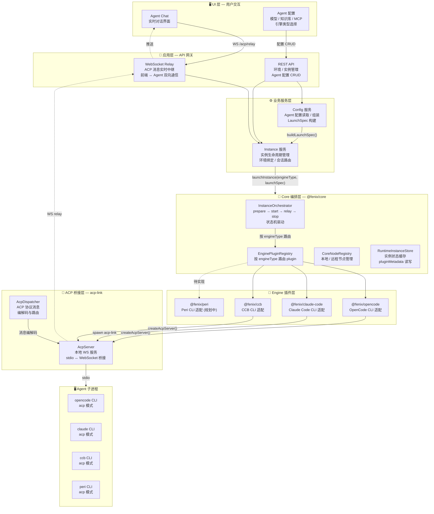

---

## 1. 分层架构

### 1.1 UI 层

前端提供 Agent 配置和实时对话两个核心入口：

| 页面 / 模块 | 功能 |
|-------------|------|
| **Agent 配置弹窗** | 选择引擎类型（opencode / ccb / claude-code）、配置模型与知识库、绑定 Environment |
| **Agent Chat** | 实时对话界面，通过 WebSocket 与 Agent 子进程双向通信 |

**引擎类型选择**：

前端通过 `formEngineType` 状态持有当前选中引擎，从 Agent 详情中读取 `engineType` 字段初始化。下拉选项由后端 `ENGINE_TYPES` 常量定义。提交时随 `agentConfig` 一并写入数据库。

### 1.2 应用层 (API)

#### 1.2.1 REST API

Environment 是 Agent 实例的运行载体，每次进入 Environment 时触发实例启动流程：

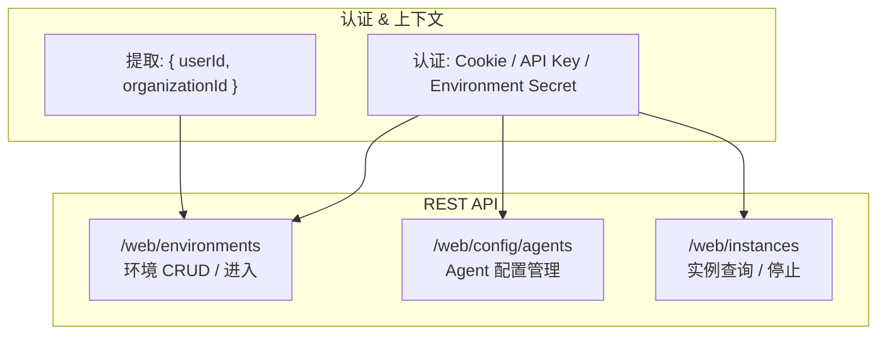

`POST /web/environments/:id/enter` 是整个实例生命周期的入口。调用链路：

```
enterEnvironment()
  → ensureRunning()           ← 检查是否已有运行中实例
    → spawnInstanceFromEnvironment()  ← 构建 LaunchSpec，调用 core.launchInstance()
```

#### 1.2.2 WebSocket Relay

前端 Chat 页面不直连 Agent 子进程，而是通过后端 WebSocket relay 桥接：

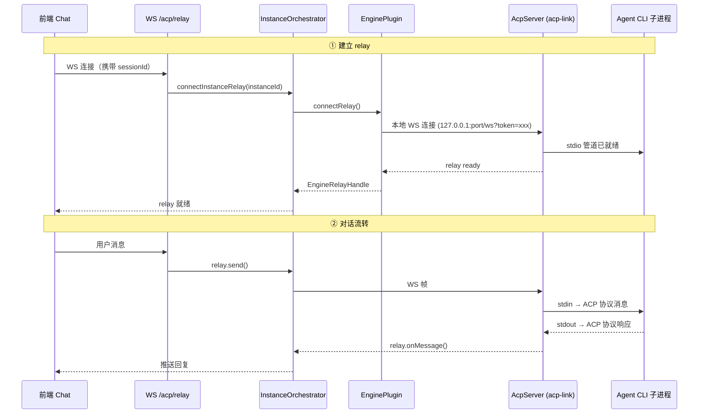

**relay 断连只断 WS，不终止 Agent 子进程**。前端重连后复用同一条 relay 通道继续对话。

---

### 1.3 Core 编排层 — @fenix/core

Core 编排层是引擎子系统的调度中枢，通过三个注册表 + 一个 orchestrator 将引擎插件与节点调度解耦：

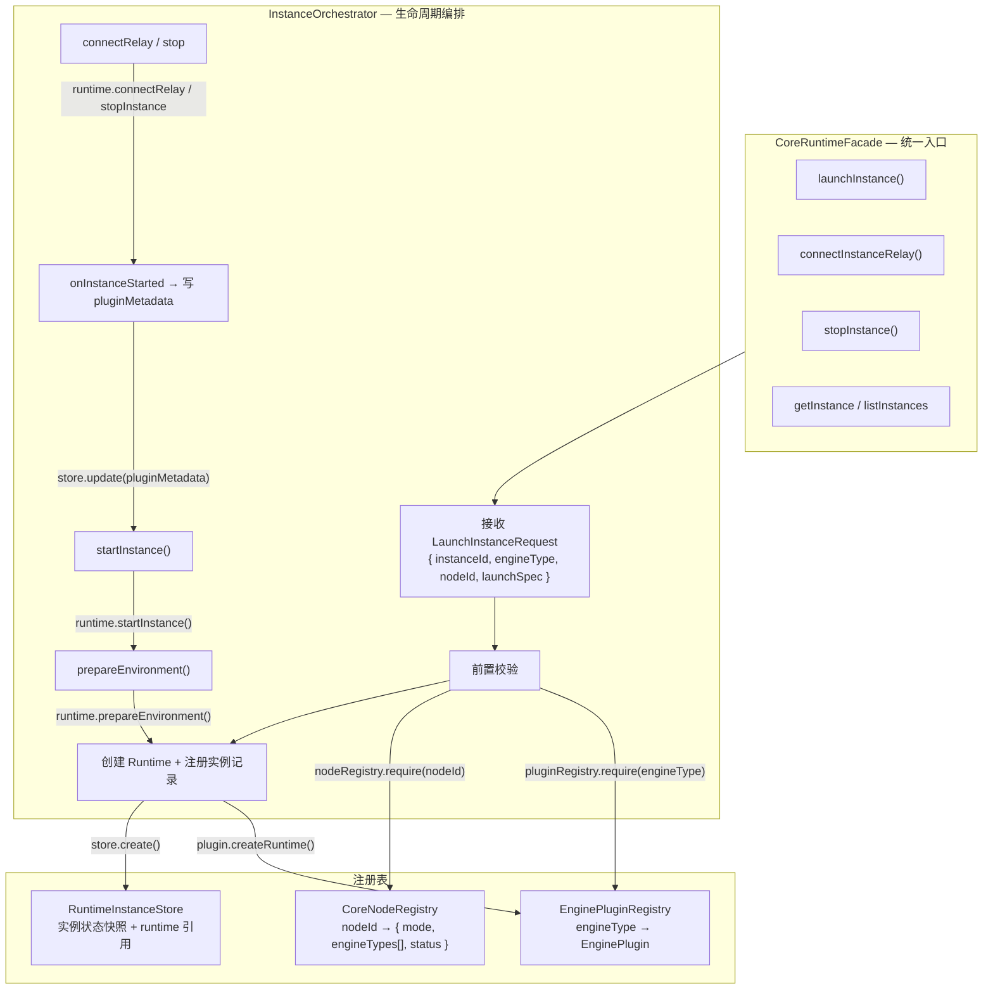

#### 实例状态机

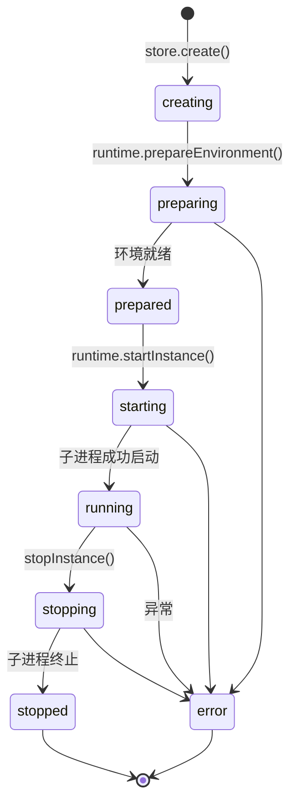

---

### 1.4 Engine 插件层

所有引擎插件实现统一的 `@fenix/plugin-sdk` 接口。新增引擎只需实现 `EnginePlugin` + `EngineRuntime` 两个接口，注入到 Core 即可。

#### EnginePlugin 接口

```typescript
// packages/plugin-sdk/src/engine-plugin.ts
interface EnginePlugin {
  meta: EnginePluginMeta;          // { id, displayName, version }
  createRuntime(): EngineRuntime;  // 创建引擎运行时
}

interface EngineRuntime {
  prepareEnvironment(input): Promise<void>;  // 阶段 1: 准备 workspace / skill / 配置
  startInstance(input): Promise<void>;       // 阶段 2: 启动 Agent 子进程
  connectRelay(input): Promise<EngineRelayHandle>; // 阶段 3: 建立 WS relay
  stopInstance(input): Promise<void>;        // 阶段 4: 停止子进程 + 清理资源
}
```

#### OpenCode 插件实现（当前默认引擎）

`@fenix/opencode` 是引擎插件的**参考实现**，也是当前默认引擎：

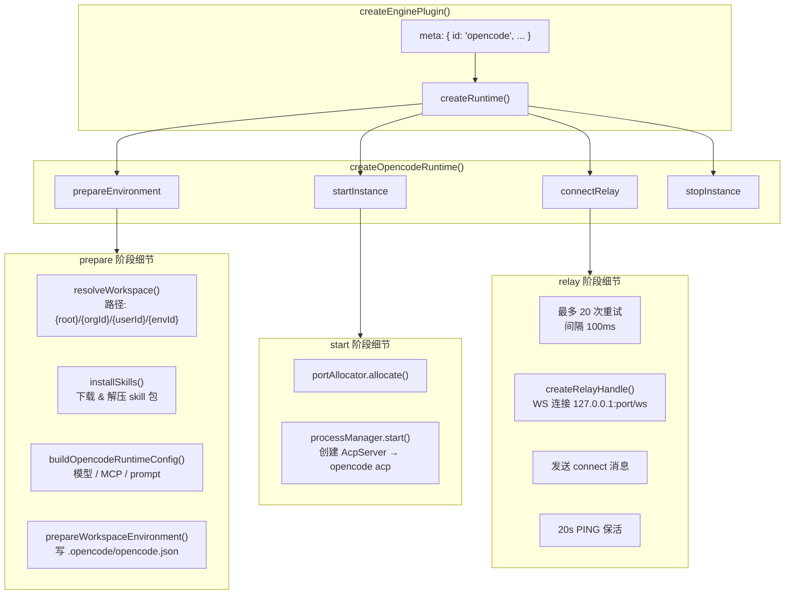

**已有引擎插件对比**：

| 引擎 | 包名 | 实现方式 |
|------|------|----------|
| **opencode** | `@fenix/opencode` | 进程中启动 `AcpServer`，桥接 opencode acp stdio |
| **claude-code** | `@fenix/claude-code` | spawn `acp-link` 子进程，设置 `ACP_ENGINE_TYPE=claude-code` |
| **ccb** | `@fenix/ccb` | 进程中启动 `AcpServer`，桥接 ccb acp stdio |
| **peri** | `@fenix/peri` (待实现) | 预期对标 opencode 模式：进程中启动 AcpServer + peri acp |

---

## 2. 完整启动链路

### 2.1 instanceId → Agent 子进程的全流程

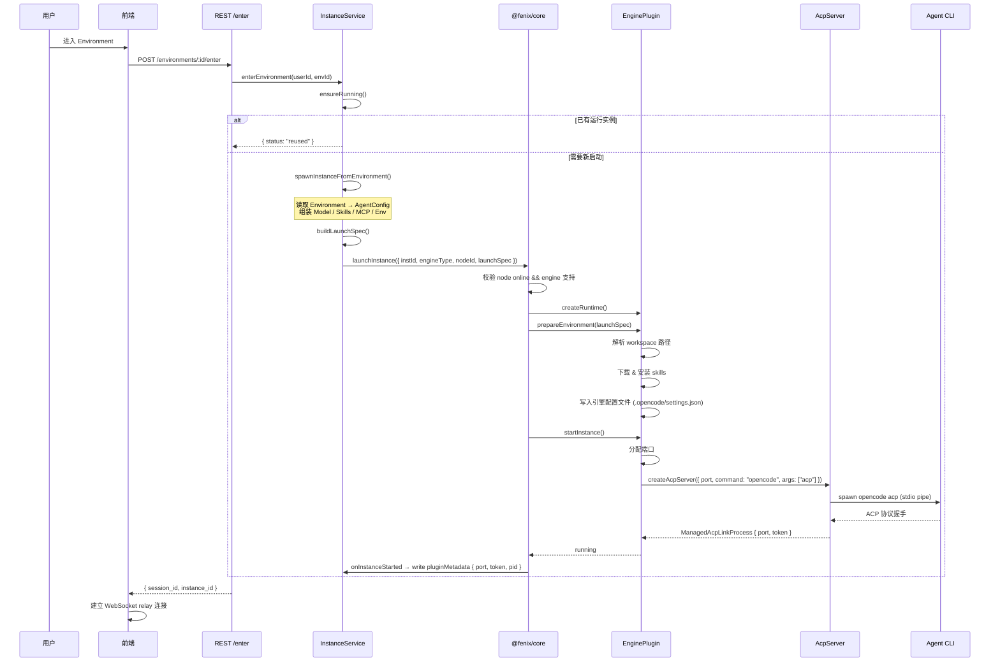

### 2.2 LaunchSpec — Agent 配置的统一载体

`AgentLaunchSpec` 是配置在 Core ↔ Plugin 之间的唯一传递契约，由业务层 `buildLaunchSpec()` 组装：

```typescript
// packages/plugin-sdk/src/agent-launch-spec.ts
interface AgentLaunchSpec {
  organizationId: string;
  userId: string;
  environmentId?: string;
  env?: Record<string, string>;       // 环境变量注入
  agent: AgentConfig;                  // { name, prompt }
  model: ModelConfig;                  // { provider, protocol, baseUrl, apiKey, model }
  skills: SkillConfig[];               // [{ name, url }]
  mcpServers: McpServerConfig[];       // stdio / streamable-http
}
```

组装来源：

```
AgentConfig (DB)  →  模型 / prompt / extra
Knowledge (DB)   →  知识库文件路径 → env 注入
MCP Server (DB)  →  stdio 命令 / HTTP URL
Skill (DB + FS)  →  打包下载 URL
Environment (DB) →  organizationId / userId / secret
```

---

## 3. 引擎配置注入

不同引擎的配置文件格式各异，但共享同一套 `AgentLaunchSpec`。配置注入由插件的 `prepareEnvironment` 阶段完成：

### 3.1 OpenCode 配置注入

```
{workspace}/
  .opencode/
    opencode.json         ← 模型 / MCP / Skills / Prompt 配置
    skills/               ← skill 文件
```

`opencode.json` 由 `buildOpencodeRuntimeConfig()` 根据 `AgentLaunchSpec` 生成，包含：
- `model`：provider、baseUrl、apiKey
- `mcpServers`：stdio 命令 / streamable-http URL
- `skills`：本地安装路径引用
- `systemPrompt`：Agent 系统提示词

### 3.2 Peri 配置（参考）

已有运行时生成的 peri 配置示例（`tmp/.../.peri/settings.json`）：

```json
{
  "provider": { "type": "anthropic", "baseUrl": "...", "apiKey": "..." },
  "model": { "name": "claude-sonnet-4-20250514" },
  "thinking": { "type": "enabled", "budgetTokens": 16000 }
}
```

peri 插件迁移时，需实现 `buildPeriSettings()` 将 `AgentLaunchSpec` 转换为 `.{peri}/settings.json` 格式。

---

## 4. ACP 通信协议栈

### 4.1 消息流转路径

```
前端 Chat UI
    ↕ WebSocket
后端 WS Relay (/acp/relay)
    ↕ EngineRelayHandle
Core InstanceOrchestrator
    ↕ EngineRelayHandle
Engine Plugin (connectRelay)
    ↕ 本地 WebSocket (127.0.0.1:{port}/ws?token={token})
AcpServer (acp-link)
    ↕ stdio (stdin/stdout)
Agent CLI 子进程 (opencode / claude-code / ccb / peri)
```

### 4.2 EngineRelayHandle 协议

插件层与 Core 之间的 relay 抽象，与具体 CLI 无关：

```typescript
interface EngineRelayHandle {
  readonly state: "open" | "closed";
  send(message: EngineRelayMessage): void;        // 向 Agent 发送
  onMessage(listener): () => void;                 // 接收 Agent 推送
  close(code?, reason?): void;                     // 关闭连接
  ready?: Promise<void>;                           // 连接就绪信号
}
```

### 4.3 保活机制

插件 relay 层实现 20 秒 PING/PONG 心跳，过滤 keep_alive 类无效消息，确保 WS 连接健康。

---

## 5. 节点调度与 acp-runtime（本地 vs 远程）

引擎架构支持两种执行拓扑：**本地模式**（Agent 子进程与主服务同机运行）和**远程模式**（通过 `acp-runtime` 将任意机器变为分布式执行节点）。

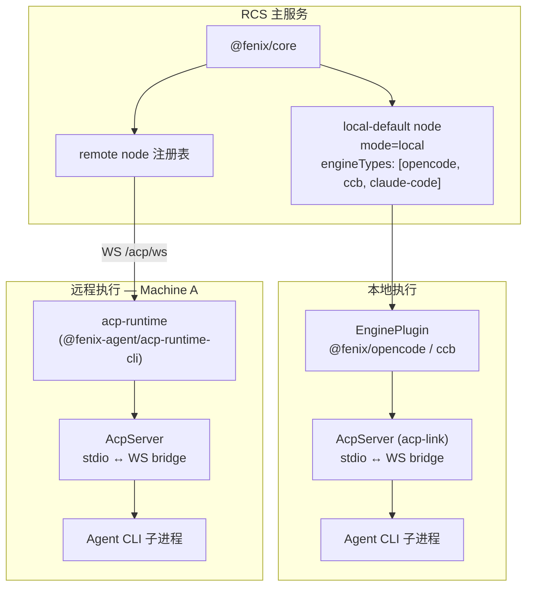

### 5.1 节点模型

```typescript
interface CoreNode {
  id: string;                    // "local-default" / machineId
  mode: "local" | "remote";
  engineTypes: string[];         // 该节点支持的引擎类型
  status: "online" | "offline";
  metadata?: Record<string, unknown>;
}
```

### 5.2 本地节点（local-default）

主服务启动时注册，支持当前所有引擎。Agent 子进程在本地机器上启动：

```
createCoreRuntime({
  nodes: [{ id: "local-default", mode: "local", engineTypes: ["opencode", "claude-code", "ccb"] }]
})
```

### 5.3 acp-runtime — 远程节点的启动入口

`@fenix-agent/acp-runtime-cli`（CLI 命称 `acp-runtime`）是**整个远程执行体系的关键组件**。它是一个可独立部署的 CLI 工具，作用是把任何一台机器变成 FenixAgent 的分布式计算节点。

**核心能力**：封装了 `agent CLI 启动` + `acp-link bridge` + `FenixAgent 主服务注册` 三步，一条命令完成远程节点接入：

```
acp-runtime <agent-command> [agent-args...]
```

**完整注册与实例派发流程**：

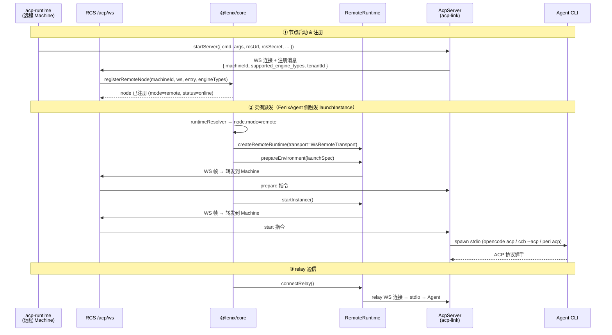

**acp-runtime 的环境变量**：

| 变量 | 必填 | 说明 |
|------|------|------|
| `RCS_URL` | 是 | FenixAgent 主服务器 WS 地址，如 `ws://localhost:3000` |
| `RCS_SECRET` | 是 | 客户端鉴权 secret |
| `RCS_TENANT_ID` | 是 | 注册机器的组织 ID |
| `AGENT_TYPE` | 否 | 引擎类型，默认 `"opencode"`，可选 `"opencode"` / `"ccb"` / `"claude-code"` |
| `SUPPORTED_ENGINE_TYPES` | 否 | JSON 数组，声明该节点支持的引擎清单，默认全部三种 |
| `RCS_MACHINE_NAME` | 否 | 机器显示名称，不传使用 hostname |

**acp-runtime 在引擎体系中的位置**：

- **本地模式**：FenixAgent 主服务通过 `EnginePlugin` → `AcpServer` 直接管理子进程，acp-runtime 不参与
- **远程模式**：acp-runtime 替代了 `EnginePlugin` 在远程机器上的角色——它接收 FenixAgent 派发的启动指令，在本机 spawn Agent CLI 并建立 stdio ↔ WS 桥接
- **引擎无关**：acp-runtime 本身不绑定特定引擎，`<agent-command>` 参数决定了实际启动哪个 CLI

**与 peri 迁移的关系**：

当前 `acp-runtime` 的 `AGENT_TYPE` 类型约束为 `"opencode" | "ccb" | "claude-code"`，`SUPPORTED_ENGINE_TYPES` 默认值也是这三种。迁移到 peri 时需要：

1. `AGENT_TYPE` 联合类型新增 `"peri"`
2. `SUPPORTED_ENGINE_TYPES` 默认值新增 `{"type": "peri"}`
3. 沙箱容器 `CMD` 从 `acp-runtime ccb --acp` 改为 `acp-runtime peri acp`（`sandbox-peri/Dockerfile` 已完成）
4. `AGENT_TYPE` 环境变量在 peri 沙箱中设为 `"peri"`

**远程节点重连逻辑**：断连时标记 node 离线 + 清理本地实例记录，重连后自动重建。

---

## 6. 数据模型

### 6.1 核心实体关系

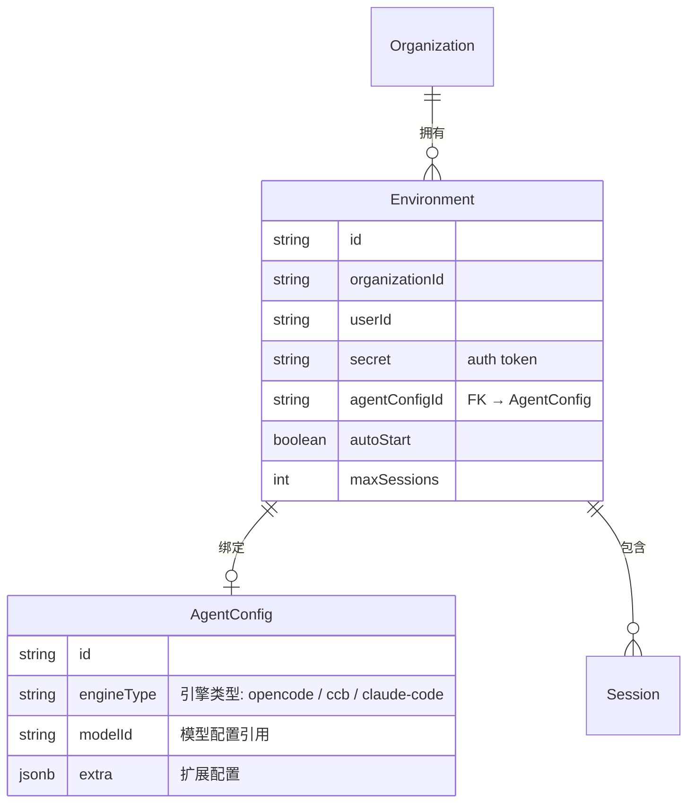

### 6.2 engineType 定义位置

| 层级 | 位置 | 当前值 |
|------|------|--------|
| DB Schema | `src/db/schema.ts` → `agent_config.engine_type` | `varchar(32) DEFAULT 'opencode'` |
| 类型常量 | `src/services/config/types.ts` → `ENGINE_TYPES` | `["opencode", "ccb", "claude-code"]` |
| 环境变量 | `src/env.ts` → `RCS_ENGINE_TYPE` | `z.enum(["opencode", "ccb"])` |
| Schema 校验 | `src/schemas/config.schema.ts` | `z.string().optional().describe(...)` |
| 前端类型 | `web/src/types/config.ts` | `engineType?: string \| null` |
| Core 注册 | `src/services/core-bootstrap.ts` | `plugins: [createOpencodePlugin(), createClaudeCodePlugin(), createCcbPlugin()]` |
| ACP 桥接层 | `packages/acp-link/src/client/instance-manager.ts` | `type AgentType = "opencode" \| "ccb" \| "claude-code"` |
| acp-runtime | `packages/acp-runtime-cli/src/bin.ts` | `AGENT_TYPE = "opencode" \| "ccb" \| "claude-code"`<br/>`SUPPORTED_ENGINE_TYPES` 默认值 |

**新增引擎时需同步更新的位置（共 8 处）**：

1. 新建 `packages/plugin-<name>/` 并实现 `EnginePlugin`
2. `src/services/core-bootstrap.ts`：注册 plugin + 加入 node.engineTypes
3. `src/services/config/types.ts`：`ENGINE_TYPES` 数组
4. `src/env.ts`：`RCS_ENGINE_TYPE` enum（如需要全局默认引擎切换）
5. `src/db/schema.ts`：生成迁移（DDL 允许任意 varchar，实际约束在应用层）
6. `packages/acp-link/src/client/instance-manager.ts`：`AgentType` 联合类型
7. 前端：`AgentFormDialog` 下拉选项 + `web/src/lib/agent-utils.ts` 默认值
8. **`packages/acp-runtime-cli/src/bin.ts`**：`AGENT_TYPE` 联合类型 + `SUPPORTED_ENGINE_TYPES` 默认值

---

## 7. 现有引擎实现概览

| 引擎 | CLI 命令 | 包名 | Bridge 方式 | 状态 |
|------|----------|------|-------------|------|
| **OpenCode** | `opencode acp` | `@fenix/opencode` | 进程中 `createAcpServer(command: "opencode")` | ✅ 默认引擎 |
| **Claude Code** | `claude` (via `acp-link`) | `@fenix/claude-code` | spawn `acp-link` 子进程，`ACP_ENGINE_TYPE=claude-code` | ✅ 已支持 |
| **CCB** | `ccb acp` | `@fenix/ccb` | 进程中 `createAcpServer(command: "ccb")` | ✅ 已支持 |
| **Peri** | `peri acp` | `@fenix/peri` (待实现) | 预期对标 opencode：进程中 `createAcpServer(command: "peri")` | 🔲 规划中 |

**差异要点**：

- OpenCode / CCB 在进程内直接启动 `AcpServer`，由 `acp-link` 库完成 stdio ↔ WS 桥接
- Claude Code 走独立 `acp-link` 子进程路径，插件只负责 spawn 和 relay
- 所有引擎共享同一套 `AgentLaunchSpec` 配置载体，差异仅在配置文件的写盘格式（`.opencode/opencode.json` / `.peri/settings.json` 等）

---

## 8. 独立部署方案

### 8.1 Machine 模式 — 通过 acp-runtime 实现分布式

`acp-runtime` 将 Agent 执行下沉到独立容器/机器。FenixAgent 主服务承担调度角色，实际 Agent 子进程在远端运行：

```
┌──────────────────────────────────────────────────────┐
│                    RCS 主服务                          │
│  @fenix/core → RemoteRuntime (WsRemoteTransport)     │
│  /acp/ws ← 接收远程 machine 注册 + 转发指令            │
└──────────────────────┬───────────────────────────────┘
                       │ WS /acp/ws
       ┌───────────────┼───────────────┐
       ▼               ▼               ▼
┌──────────────┐ ┌──────────────┐ ┌──────────────┐
│  Machine A   │ │  Machine B   │ │  Machine C   │
│  opencode    │ │  ccb         │ │  peri        │
│  (默认引擎)   │ │  (CCB 引擎)   │ │  (Peri 引擎)  │
│              │ │              │ │              │
│ CMD:         │ │ CMD:         │ │ CMD:         │
│ acp-runtime  │ │ acp-runtime  │ │ acp-runtime  │
│ opencode acp │ │ ccb --acp    │ │ peri acp     │
└──────────────┘ └──────────────┘ └──────────────┘
```

每个 Machine 容器通过 `acp-runtime` 启动后自动注册，FenixAgent 按 `engineType` 将实例派发到支持对应引擎的节点。**acp-runtime 是远程执行模式的统一入口，与具体引擎解耦**。

Machine 启动时的典型配置：

```bash
# docker/machine/Dockerfile — 通用 machine 镜像
ENV SUPPORTED_ENGINE_TYPES='[{"type":"opencode"},{"type":"ccb"},{"type":"claude-code"}]'
CMD ["bun", "start-remote-runtime.js", "opencode", "acp"]

# docker/sandbox-peri/Dockerfile — peri 专用沙箱
ENV AGENT_TYPE=peri
ENV IS_PERI=1
CMD ["acp-runtime", "peri", "acp"]
```

### 8.2 沙箱容器模式

`docker/sandbox-peri/` 为 peri 引擎准备了独立的沙箱容器模板：
- 预装 `peri` CLI（通过官方安装脚本）
- 预装 `acp-runtime-cli`（`@fenix-agent/acp-runtime-cli`）
- `CMD ["acp-runtime", "peri", "acp"]` — 自动注册为 peri 引擎 node
- `ENV IS_PERI=1` — 额外生成 `.peri/settings.json` 客户端配置

其他沙箱变体：`docker/sandbox/`（opencode）、`docker/sandbox-ccb/`（CCB）结构一致，仅替换 CLI 和 `AGENT_TYPE`。

---

## 9. 本地部署 → 全量远程模式迁移

### 9.1 两种部署拓扑对比

当前默认是**本地模式**：FenixAgent 主服务容器同时承担调度和 Agent 执行角色。全量远程模式将执行职责剥离到独立 Machine 容器。

```
┌─── 本地模式（当前默认）───┐        ┌─── 全量远程模式（目标）───┐
│                           │        │                           │
│  ┌─────────────────────┐ │        │  ┌─────────────────────┐  │
│  │    RCS 主服务容器     │ │        │  │    RCS 主服务容器     │  │
│  │  ┌───────────────┐  │ │        │  │  (纯调度, 无 Agent)   │  │
│  │  │ local-default │  │ │        │  └──────────┬──────────┘  │
│  │  │ node          │──┼─┼─Agent  │             │ WS /acp/ws  │
│  │  │ EnginePlugin  │  │ │  子进程  │  ┌──────────▼──────────┐  │
│  │  │ AcpServer     │  │ │        │  │  Machine 容器         │  │
│  │  │ Agent CLI     │  │ │        │  │  acp-runtime         │  │
│  │  └───────────────┘  │ │        │  │  → AcpServer         │  │
│  └─────────────────────┘ │        │  │  → Agent CLI (peri)   │  │
│                           │        │  └─────────────────────┘  │
│  调度 + 执行  一体          │        │  调度与执行  分离          │
└───────────────────────────┘        └───────────────────────────┘
```

**迁移动机**：
- **资源隔离**：Agent 执行消耗的 CPU/内存从主服务剥离，避免互相干扰
- **独立扩缩**：Machine 可按需增减，不依赖主服务重启
- **引擎升级零停机**：升级 agent CLI 只需重建 Machine 容器，主服务不受影响
- **多引擎共存**：不同 Machine 运行不同引擎（opencode / ccb / peri），主服务统一调度

### 9.2 迁移步骤

#### 步骤 1：构建 Machine 镜像

根据目标引擎选择合适的 Dockerfile：

```bash
# 方案 A: 通用 Machine 镜像（支持 opencode + ccb + claude-code）
docker build -f docker/machine/Dockerfile -t fenix-machine .

# 方案 B: Peri 专用沙箱（推荐用于 peri 迁移）
docker build -f docker/sandbox-peri/Dockerfile -t fenix-peri-sandbox .
```

#### 步骤 2：启动 Machine 并注册到 FenixAgent

Machine 容器的核心环境变量：

| 变量 | 说明 | 示例 |
|------|------|------|
| `RCS_URL` | FenixAgent 主服务 WS 地址 | `ws://rcs:3000` |
| `RCS_SECRET` | 注册鉴权 secret（需与 FenixAgent `REGISTRY_SECRET` 一致） | `340b6908-...` |
| `RCS_TENANT_ID` | 组织 ID，决定 machine 归属 | `sbFAPs2nyyL0ZNx...` |
| `RCS_MACHINE_NAME` | 机器显示名称（可选） | `peri-node-01` |
| `AGENT_TYPE` | 引擎类型 | `peri` / `opencode` / `ccb` |

启动示例（以 peri 沙箱为例）：

```bash
docker run -d \
  --name fenix-peri-machine \
  -e RCS_URL=ws://host.docker.internal:3000 \
  -e RCS_SECRET=340b6908-031d-47de-9cfb-26f75818f969 \
  -e RCS_TENANT_ID=sbFAPs2nyyL0ZNxTE8CSqXUu6AIPULfL \
  fenix-peri-sandbox
```

或通过 docker-compose 启动（已预配置 `docker/sandbox-peri/docker-compose.yml`）：

```bash
RCS_TENANT_ID=<your-org-id> docker compose -f docker/sandbox-peri/docker-compose.yml up -d
```

#### 步骤 3：验证 Machine 注册成功

在 FenixAgent 主服务日志中确认：

```
[MACHINE-REGISTER] Machine registered: id=mach_xxx agent=peri isNew=true
```

或通过 Registry API 查询已注册机器列表（`/web/registry/machines`）。

#### 步骤 4：将 Agent 绑定到远程 Machine

**关键切换点**：`agent_config.machineId` 字段决定了实例在本地还是远程执行。

```
machineId = null  →  实例落在 local-default 节点（本地模式）
machineId = "mach_xxx" → 实例落在对应 Machine 节点（远程模式）
```

操作方式：

- **前端**：Agent 配置表单中「绑定机器」下拉选择已注册的 Machine
- **API**：`PATCH /web/config/agents` 设置 `machineId` 字段

```json
{
  "action": "update",
  "agentId": "<agent-id>",
  "data": {
    "machineId": "mach_xxx"
  }
}
```

设置后，该 Agent 对应的 Environment 启动实例时，`instance.ts` 会将 `nodeId` 从 `"local-default"` 切换为 `agentMachineId`。

#### 步骤 5：验证远程执行

重新进入 Environment，确认实例在远程 Machine 上启动：

1. FenixAgent 日志中出现 `launchInstance(engineType=xxx, nodeId=mach_xxx)` 而非 `nodeId=local-default`
2. Machine 容器日志中出现 `acp-runtime` 收到的 `prepare / start` 指令
3. Agent 对话功能正常，文件操作正常（远程 file-ws 通道）

#### 步骤 6：全量切换

完成验证后逐步迁移所有 Agent：

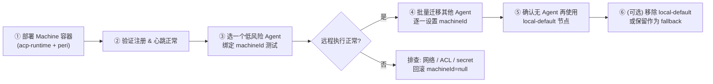

#### 步骤 7：移除 local-default 节点（可选）

确认所有 Agent 已绑定远程 Machine 后，可以从 `core-bootstrap.ts` 移除本地节点：

```typescript
// 全量远程后精简为仅远程调度
nodes: [
  // { id: "local-default", mode: "local", engineTypes: ["opencode", "claude-code", "ccb"] }, // 已废弃
],
```

保留 `local-default` 的好处：作为 fallback，紧急情况可快速将 `machineId` 置空回退到本地执行。

### 9.3 迁移期间的对业务影响

| 操作 | 影响范围 | 处理方式 |
|------|----------|----------|
| 部署 Machine 容器 | 无影响 | 新容器独立运行，不触碰现有服务 |
| Agent 绑定 machineId | 只影响该 Agent 的下一次实例启动 | 已有运行中实例不受影响；下次 enter environment 生效 |
| Machine 断连 | 该 Machine 上的实例 relay 断开 | 前端 WS 自动感知断连并提示重连，核心断连自动清理 |
| Machine 重连 | 自动恢复 | 心跳重连 + relay 重建，无需手动干预 |
| 回退到本地 | 将 machineId 置 null | 下一次启动即可回本地执行 |

### 9.4 注意事项

1. **workspace 路径**：远程 Machine 的工作区路径结构与本地一致（`{cwd}/{orgId}/{userId}/{envId}`），但 `cwd` 由 Machine 容器的启动目录决定
2. **文件操作**：远程模式下文件读写走 `file-ws` 通道，需确保 Machine 容器上的文件传输通道正常
3. **skill / MCP**：配置由 FenixAgent 主服务在 `prepareEnvironment` 阶段通过 WS 下发到 Machine，无需在 Machine 上预装
4. **模型 API Key**：Agent 的模型密钥随 `LaunchSpec` 下发到 Machine 环境变量，不存储在 Machine 镜像中
5. **多 Machine 调度**：不同 Agent 可以绑定不同 Machine，支持按引擎类型、组织、标签做调度隔离
6. **监控**：Machine 心跳超时 3 倍 interval 后触发断连清理，需确保 `REGISTRY_SECRET` 和网络稳定
