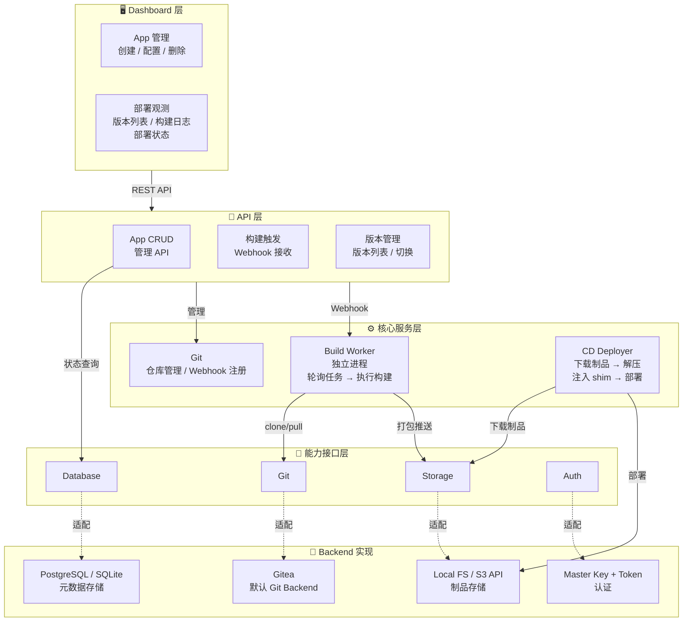
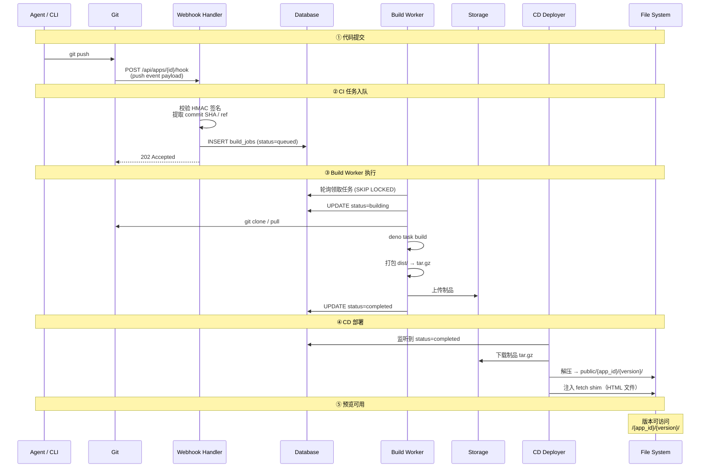
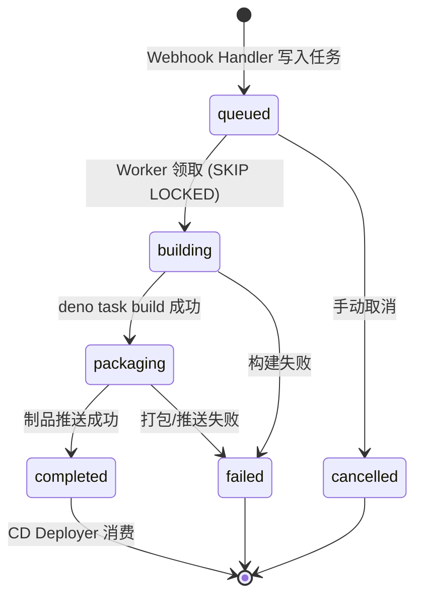
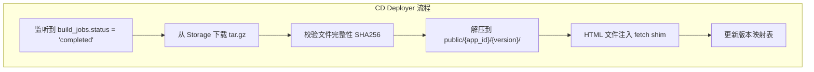
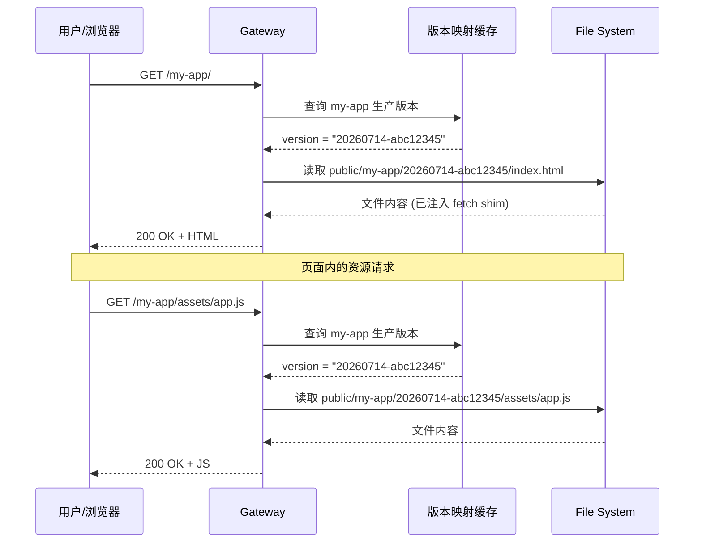
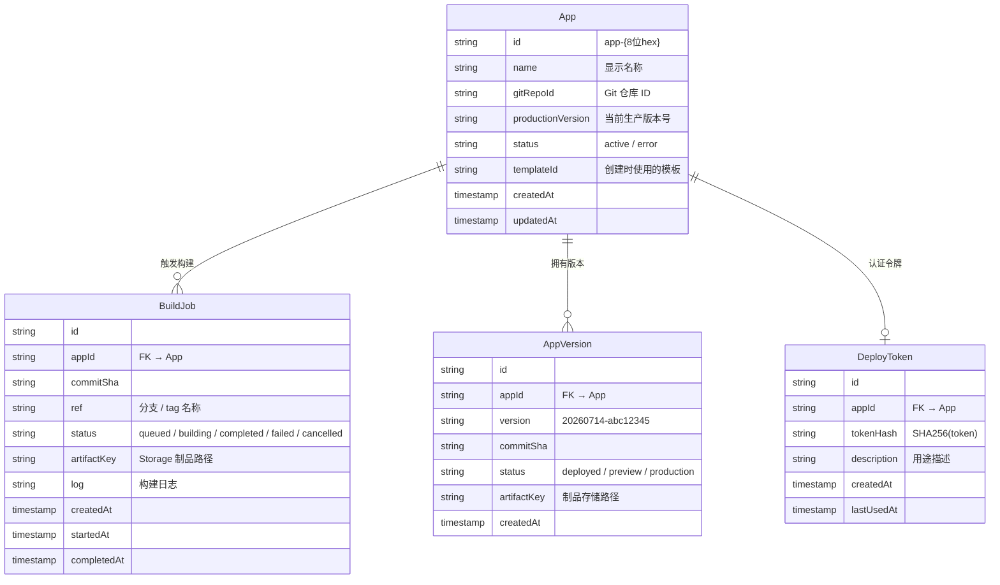
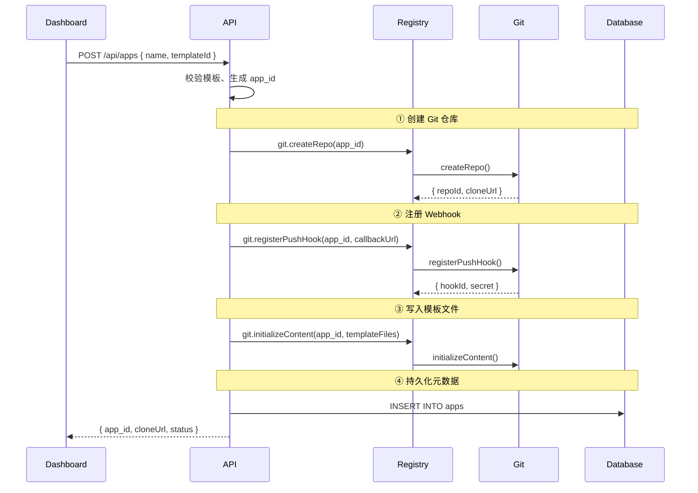
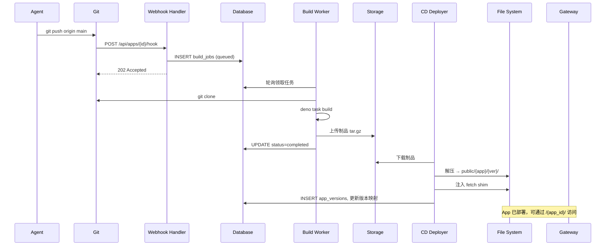
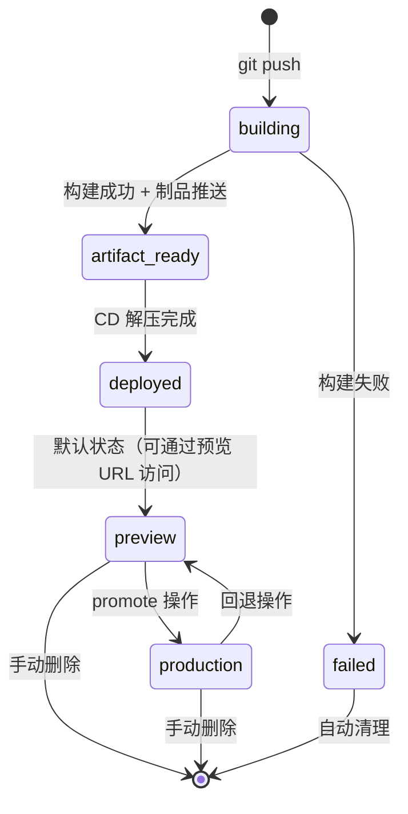

# Agent Sites 架构设计

## 概述

Agent Sites 是一个面向 AI Agent 的 Serverless 应用托管平台，为 Agent 提供从代码提交到生产部署的完整 CI/CD 流水线。核心设计理念是 **"Git Push → CI → CD → Preview → Production"**——Agent 写完代码推送到平台内置 Git 服务，后续构建、打包、部署、预览全链路自动化，开发者只需面对极简的发布和观测界面。

核心设计目标：**Serverless 架构、默认模板驱动、零配置部署、完整隔离**。Agent 不需要关心构建工具链、服务器运维或 DNS 配置，平台接管从源代码到可访问 URL 的全部环节。

### 核心架构原则：能力可替换

平台由一组**可替换的能力模块**组成，每个模块定义清晰契约，不绑定任何特定后端。Supabase 只是一组能力的**一个可选实现**，任何模块都可独立切换后端。

| 能力 | 职责 | 默认 Backend | 可选 Backend (未来) |
|------|------|-------------|---------------------|
| **Git** | 代码仓库管理、Webhook 注册 | Gitea API | 内建 Git Server |
| **Auth** | 平台认证、Token 签发/吊销 | Master Key + JWT | OAuth / GoTrue |
| **Database** | 平台元数据存储 | SQLite (每 App 独立) | PostgreSQL / Supabase PG |
| **Storage** | 制品归档与读取 | Local FS | S3 API / Supabase Storage |
| **Functions** (预留) | Serverless 函数运行时 | — | 自研 Deno 运行时 |
| **Templates** (预留) | 项目模板管理 | — | 模板仓库 |
| **Observability** (预留) | 监控与日志 | — | 日志 / 指标采集 |

**Backend 切换不影响业务层**：应用服务不关心制品存储下面跑的是本地磁盘还是 S3，Build Worker 不关心数据库底层是 SQLite 还是 PG。

### 分层架构总览



---

## 1. 能力模块架构

每个模块是 agent-sites 平台的一个**可替换能力单元**。启动时根据环境变量自动选择对应的 Backend 实现，上层业务代码完全通过模块接口访问——不感知底层实现。

### 1.1 四大核心能力

#### Git — 代码托管

负责 App 的 Git 仓库生命周期管理以及 push 事件通知。

| 能力 | 说明 |
|------|------|
| **创建仓库** | 为每个 App 生成独立 Git 仓库，返回 clone URL 供 Agent 使用 |
| **删除仓库** | 删除仓库含所有分支和历史 |
| **注册 Webhook** | 在仓库上注册 push hook，回调 agent-sites 自身的 `/api/apps/{id}/hook` |
| **写入初始内容** | App 创建时根据选中的模板向仓库写入初始文件 |

#### Database — 元数据存储

平台元数据的持久化层，管理 App、构建任务、版本记录、Token 等核心数据。

| 能力 | 说明 |
|------|------|
| **查询** | 执行 SELECT 返回结构化行 |
| **写入** | 执行 INSERT / UPDATE / DELETE，返回影响行数 |
| **事务** | 支持跨操作的事务保证 |
| **迁移** | 运行版本化的 DDL 迁移，初始化或升级表结构 |

#### Storage — 制品与文件存储

CI 构建产物的归档和读取。构建完成的 tar.gz 存入，CD 部署时取出。

| 能力 | 说明 |
|------|------|
| **上传** | 按 key 存储二进制对象 |
| **下载** | 按 key 获取完整对象内容 |
| **删除** | 删除指定对象 |
| **列表** | 列出指定前缀下的所有对象（用于版本管理） |

#### Auth — 平台认证

统一认证入口，所有 API handler 通过此模块验证调用方身份。

| 能力 | 说明 |
|------|------|
| **身份验证** | 从请求中提取并验证凭证，返回调用方主体信息 |
| **签发 Token** | 为指定 App 生成带权限范围的 Deploy Token |
| **吊销 Token** | 使已签发的 Token 失效 |

**返回的主体信息**：

| 字段 | 说明 |
|------|------|
| `type` | `master` (平台管理员) 或 `app_token` (App 级 Token) |
| `appId` | 绑定的 App ID（master 类型为空） |
| `scopes` | 权限范围列表 |

### 1.2 模块注册与组装

agent-sites 启动时读取环境变量，自动选择每个模块的 Backend 实现，组装为统一的 `Registry`。所有 handler 通过 registry 访问各模块，与后端零耦合。

**关键约束**：`Registry` 是唯一允许跨模块引用的地方。单个业务 handler 不应直接依赖某个 Backend 的具体实现——它只通过 registry 统一访问。

---

## 2. 分层架构

### 2.1 Dashboard 层

前端提供 App 管理和部署观测两个核心入口：

| 页面 / 模块 | 功能 |
|-------------|------|
| **App 管理** | 创建/删除 App、选择模板、配置基本信息 |
| **部署观测** | 查看构建日志、版本列表、当前生产版本、部署状态 |

Dashboard 不提供代码编辑器——Agent 在本地或任意环境中编写代码，通过 Git 推送到平台。

### 2.2 API 层

#### 2.2.1 App 管理 API

延续现有 `/api/apps` 的 CRUD 设计，扩展版本管理和构建触发能力：

| 方法 | 路径 | 说明 |
|------|------|------|
| POST | `/api/apps` | 创建 App（初始化 Git 仓库 + 数据目录） |
| GET | `/api/apps` | 列出 App |
| GET | `/api/apps/{id}` | 获取 App 详情（含当前版本、状态） |
| DELETE | `/api/apps/{id}` | 删除 App |
| POST | `/api/apps/{id}/hook` | **新增**：Git Webhook 接收端点，触发 CI |
| GET | `/api/apps/{id}/versions` | **新增**：版本列表 |
| GET | `/api/apps/{id}/deployments` | **新增**：部署历史 |
| PUT | `/api/apps/{id}/production` | **新增**：切换生产版本 |
| POST | `/api/auth/token` | 创建 deploy token |

#### 2.2.2 Webhook 链路

Git push 事件 → agent-sites Webhook 端点的完整调用链：



---

### 2.3 核心服务层

#### 2.3.1 Build Worker

Build Worker 是独立于主服务的常驻进程，负责消费构建任务并执行。与主服务通过数据库任务表解耦，构建阻塞不影响 API 响应。

```
┌───────────────────────┐
│    agent-sites 主服务  │
│  ┌─────────────────┐  │
│  │  API Handler    │  │
│  │  CD Deployer    │  │
│  │  Gateway        │  │
│  └─────────────────┘  │
└──────────┬────────────┘
           │ 数据库 (build_jobs 表)
           ▼
┌───────────────────────┐
│    Build Worker 进程   │      ← 独立进程
│  ┌─────────────────┐  │
│  │  任务轮询器     │  │      ← SKIP LOCKED 领取任务
│  │  构建执行器     │  │      ← Deno.Command 执行
│  │  制品打包器     │  │      ← tar.gz 打包
│  └─────────────────┘  │
└───────────────────────┘
```

**构建任务状态机**：



**构建环境**：使用 Deno 运行时执行 `deno task build`，产物目录默认为 `dist/`，超时和权限可通过 App 配置调整。

**日志采集**：Build Worker 将 stdout/stderr 流式写入构建日志字段，Dashboard 可实时/准实时查看。

#### 2.3.2 制品管理

构建成功后，将 `dist/` 目录打包为单文件 tar.gz，通过 Storage 存入制品存储。一个版本 = 一个 blob，路径为 `artifacts/{app_id}/{version}.tar.gz`。

#### 2.3.3 CD Deployer

CD Deployer 监听构建完成事件，将制品部署到文件系统并维护版本映射：



**fetch shim 注入**：自动将 HTML 中 `window.fetch` 的绝对路径 `/api/x` 重写为 `/{app_id}/api/x`，确保前端应用在任意版本路径下都能正确调用后端 API。

---

### 2.4 Gateway 层

#### 2.4.1 路由模型

| 访问路径 | 行为 | 说明 |
|----------|------|------|
| `/{app_id}` | 重定向到 `/{app_id}/` | 尾部斜杠归一 |
| `/{app_id}/` | → production 版本的 index.html | 用户无需知晓版本号 |
| `/{app_id}/{path}` | → production 版本的对应文件 | 资源自动路由到生产版本 |
| `/{app_id}/{version}/` | → 指定版本的文件根 | 显式预览 |
| `/{app_id}/{version}/{path}` | → 指定版本的对应文件 | 显式预览具体资源 |
| `/{app_id}/api/{*path}` | → 反代到 App 后端进程 | API 透传 |



**版本映射缓存**：内存中维护 `Map<appId, productionVersion>`，CD Deployer 在版本切换时更新。服务重启后从数据库重建缓存，冷启动期间直接查数据库。

#### 2.4.2 路由优先级

按有序前缀匹配：

```
优先级  路径模式                          目标
─────────────────────────────────────────────────
 1      /                              → Dashboard
 2      /health                        → 健康检查
 3      /api/apps/*                    → App 管理 API
 4      /api/apps/{id}/hook            → Webhook 端点
 5      /api/auth/*                    → 认证 API
 6      /{app_id}/api/{*path}          → API 代理到 App 后端
 7      /{app_id}/{version}/{*path}    → 指定版本静态文件（优先匹配）
 8      /{app_id}/{*path}              → 生产版本静态文件
 9      /{app_id}                      → 重定向到 /{app_id}/
```

前 5 条是平台路由，后 4 条是 App 路由。`{version}` 与普通路径段的区分依靠版本号格式约定（`YYYYMMDD-{commit_sha前8位}`）。

---

## 3. 数据模型

### 3.1 核心实体关系



### 3.2 构建任务表 (build_jobs)

核心概念：每个构建任务记录所属 App、触发 commit、构建状态（queued → building → completed / failed / cancelled）、制品存储路径和构建日志。Worker 通过轮询机制领取任务，支持多实例并发。

---

## 4. 认证模型

### 4.1 双层认证

| 层级 | 验证方式 | 身份类型 | 用途 |
|------|----------|----------|------|
| **平台级** | `X-Master-Key` header | `master` | App CRUD、Token 创建、平台管理 |
| **App 级** | `Authorization: Bearer <token>` | `app_token` | 部署/读取/Webhook 调用 |

### 4.2 Deploy Token

| 属性 | 说明 |
|------|------|
| **绑定关系** | 每个 Token 绑定到唯一 App |
| **存储方式** | 数据库只存 SHA256 哈希，不存明文 |
| **返回规则** | 创建后仅返回一次原始值，后续不可查看 |
| **吊销** | 标记软删除，已有部署不受影响 |
| **Master Key 特权** | 跳过所有 Token 校验 |

### 4.3 Backend 可替换性

`Auth` 接口使得认证机制可独立切换：默认方案基于 Master Key header + 自签 JWT Token，可替换为对接外部 OAuth 服务的认证后端。切换入口通过配置选择，不涉及上层业务代码改动。

---

## 5. App 创建流程

### 5.1 完整创建链路



### 5.2 模板系统（预留）

创建 App 时根据选中的 `templateId`，平台将预设的模板文件写入 Git 仓库的初始提交。

**模板元数据格式**：

| 字段 | 说明 |
|------|------|
| `name` | 模板显示名称 |
| `description` | 模板描述 |
| `buildCommand` | 构建命令，如 `deno task build` |
| `outputDir` | 构建产物目录，如 `dist` |
| `files` | 模板包含的文件列表 |

---

## 6. CI/CD 完整流程

### 6.1 从 git push 到可访问 URL



### 6.2 版本生命周期



| 状态 | 说明 | 访问方式 |
|------|------|----------|
| **preview** | 构建后默认状态 | `/{app_id}/{version}/` |
| **production** | 手动或自动 promote | `/{app_id}/`（隐式路由） |
| **版本号格式** | `YYYYMMDD-{commit_sha前8位}` | 例：`20260714-a1b2c3d4` |

每次 git push 产生一个新版本，预览版本互不干扰。生产版本切换是原子的——只更新一行版本映射记录。

---

## 7. 部署方案

### 7.1 核心组件拓扑

```
                         Internet
                            │
                    ┌───────▼───────┐
                    │   agent-sites │  ← 主服务
                    │               │    Gateway + API + CD Deployer
                    └───────┬───────┘
                            │
              ┌─────────────┼─────────────┐
              │             │             │
     ┌────────▼───┐  ┌─────▼──────┐  ┌───▼─────────┐
     │   Gitea    │  │ PostgreSQL │  │ Build Worker │
     │  Git       │  │ Database   │  │ 独立进程     │
     │  Backend   │  │ Backend    │  │ 轮询 + 构建  │
     └────────────┘  └────────────┘  └──────────────┘
```

**各组件角色**：

| 组件 | 对外 | 角色 |
|------|------|------|
| **agent-sites 主服务** | ✅ 是 | 唯一公网入口，Gateway + API + CD Deployer 在同一进程 |
| **Build Worker** | ❌ 否 | 独立进程，通过数据库与主服务解耦，共享文件系统 |
| **Gitea** | ❌ 否 | Git 的默认 Backend，仅内网可达 |
| **PostgreSQL** | ❌ 否 | Database Backend，Worker 和主服务共用 |

### 7.2 部署架构

系统由四个核心服务组成：主服务（Gateway + API + CD Deployer 同进程）、Git 后端、数据库后端、Build Worker（独立进程）。主服务和 Build Worker 共享制品与临时文件存储。各组件通过配置选择具体的 Backend 实现。

---

## 8. 与现有 agent-sites 的对照变化

| 模块 | 初版 | 完善版 | 变化 |
|------|------|--------|------|
| **Git 托管** | ❌ 无 | ✅ Git (Gitea Backend) | 每 App 自动创建仓库 + Webhook |
| **CI 构建** | ❌ 无 | ✅ Build Worker 独立进程 | deno task build + tar.gz 打包 |
| **制品管理** | ❌ 无 | ✅ Storage | 每版本一个 tar.gz |
| **CD 部署** | ❌ 手动上传文件 | ✅ CD Deployer 自动部署 | 下载 → 解压 → 注入 → 映射 |
| **版本管理** | ❌ 无 | ✅ 时间戳版本 + preview/production | 隐式 production 路由 |
| **路由网关** | ✅ `/{app_id}/` | ✅ 扩展到 `/{app_id}/{version}/` | 显式预览 |
| **API 代理** | ✅ PB 进程代理 | ✅ 保留，改为通用后端代理 | 不再耦合 PB |
| **静态文件** | ✅ fetch shim 注入 | ✅ 保留 + 多版本并存 | 目录结构加入版本层级 |
| **认证** | ✅ Master Key | ✅ Auth (可替换 Backend) | 入口统一，支持扩展 |
| **数据存储** | ✅ JSON 文件 | ✅ Database (PG/SQLite) | 从文件升级到数据库 |
| **Dashboard** | ✅ _panel/index.html | ✅ 扩展部署观测、版本列表 | 不提供代码编辑器 |
