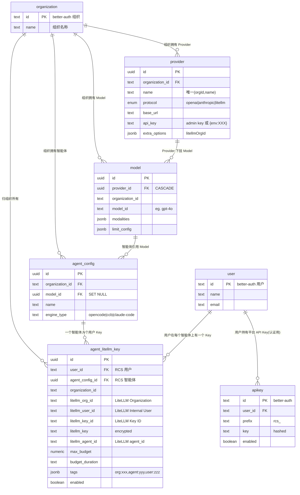
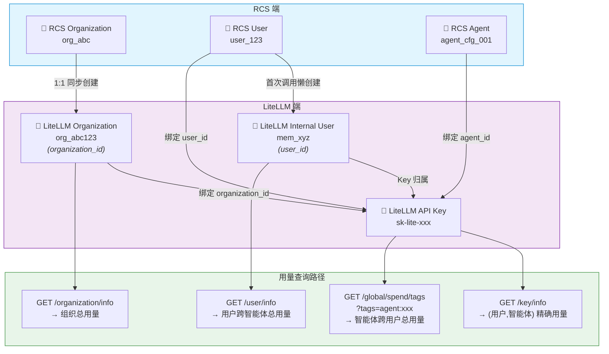
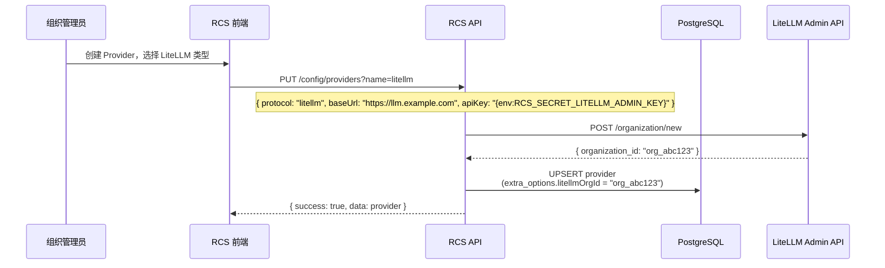
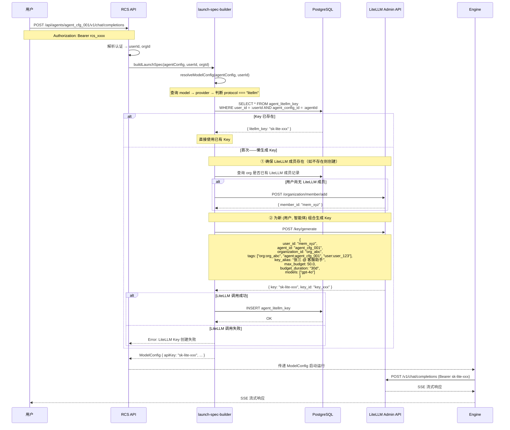
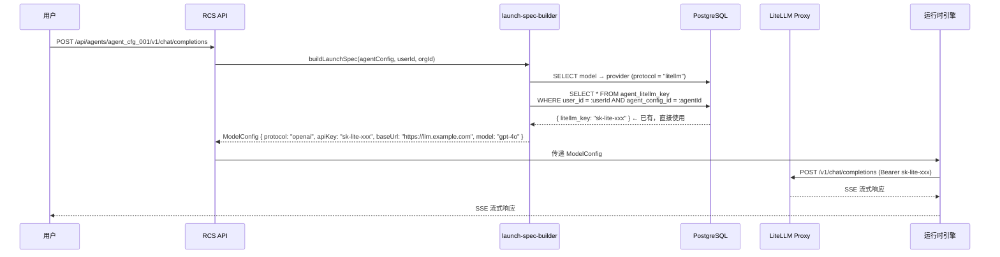
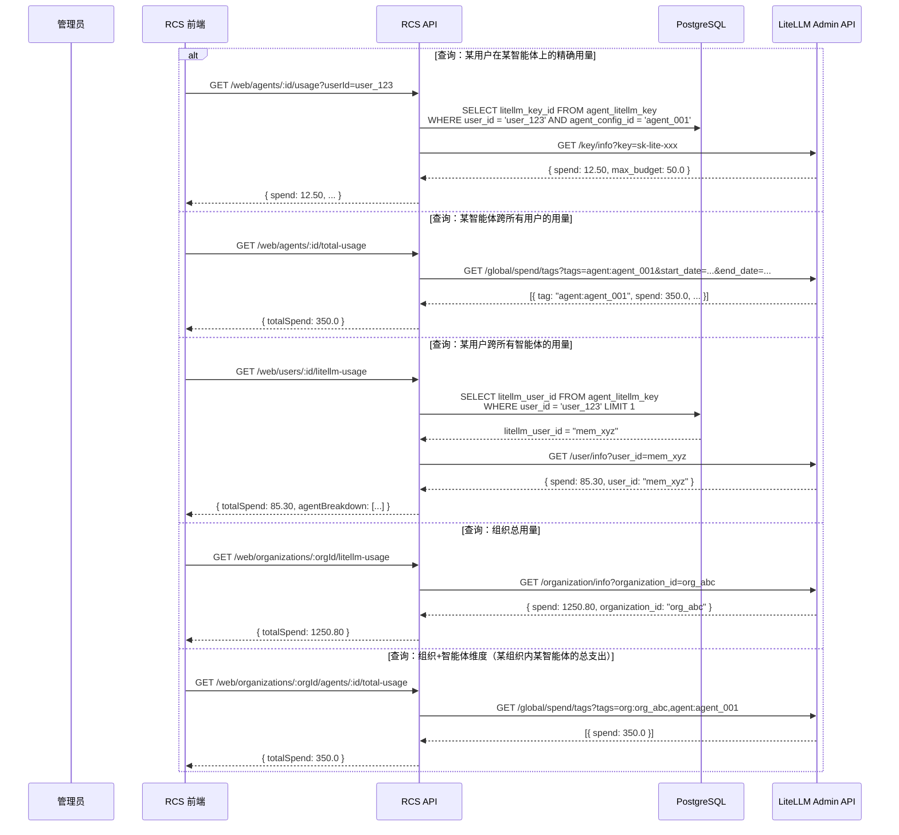
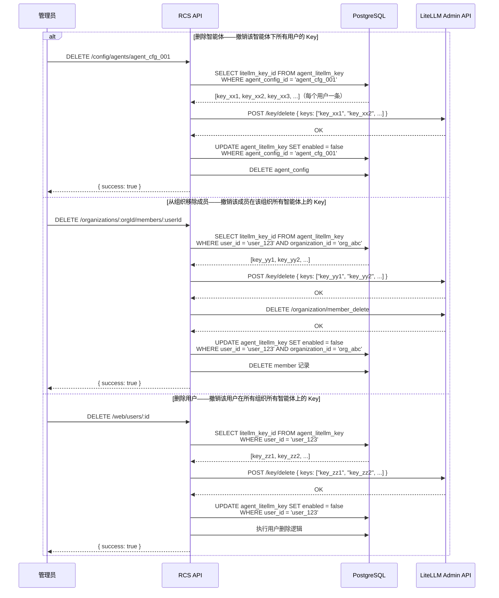

# LiteLLM 集成架构

## 概述

LiteLLM 作为 RCS 的一个特殊 LLM 提供商接入，利用 LiteLLM 的 Organization（企业版）功能实现 **RCS 组织 → LiteLLM 组织、RCS 用户 → LiteLLM 成员、(RCS 用户, RCS 智能体) → LiteLLM API Key** 的自动化映射。每个用户在每个智能体上拥有独立的 LiteLLM Key，实现**组织/用户/智能体**三维用量追踪和预算隔离。管理员只需在 RCS 中配置 LiteLLM 连接信息一次，后续所有同步由 RCS 自动完成，终端用户零感知。

**核心机制**：RCS 作为配置源 → 事件驱动自动同步到 LiteLLM → 模型调用时 RCS 做聚合路由，根据 provider 类型决定直连 LLM API 还是经由 LiteLLM 代理。

```
┌──────────────────────────────────────────────────────────────────┐
│                         配置流向                                  │
│                                                                  │
│  RCS 管理员 ──配置──▶ RCS Provider/Model ──同步──▶ LiteLLM 组织/用户│
│  用户运行智能体 ──懒创建──▶ LiteLLM API Key (user+agent 组合)       │
│                                                                  │
│                         调用流向                                  │
│                                                                  │
│  RCS 用户 ──RCS API Key──▶ RCS 聚合路由 ──▶ LiteLLM (按用户+智能体 Key)│
│                                         ──▶ OpenAI/Anthropic (直连)│
└──────────────────────────────────────────────────────────────────┘
```

## 核心设计决策

| 维度 | 决策 |
|------|------|
| LiteLLM 实例粒度 | **全局系统级**——整个 RCS 对接一个 LiteLLM 实例 |
| 组织映射模型 | **1:1 严格映射**——每个 RCS 组织在 LiteLLM 中创建一个 Organization |
| 用户创建时机 | **懒创建**——LiteLLM 成员在用户首次触发智能体运行时创建 |
| Key 体系 | **(用户, 智能体) 级 Key**——每个 RCS 用户在每个智能体上拥有独立 LiteLLM API Key，绑定 LiteLLM 原生 `user_id` + `agent_id` + `organization_id`，实现组织/用户/智能体三维用量追踪和预算隔离 |
| 预算控制 | **用户级预算**——LiteLLM Key 的 `max_budget` 用于控制每个用户在一个智能体上的开销上限；组织级预算通过 `GET /organization/info` 查询汇总 |
| 模型管理 | **手动配置**——管理员在 RCS 手动添加模型，绑定到 LiteLLM provider |
| 权限控制 | **委托 LiteLLM 侧**——模型访问权限由 LiteLLM 的 model access 控制 |
| 预算/限流 | **RCS 接转**——RCS 提供配置 UI/API，透传到 LiteLLM 的 `max_budget` / `budget_duration` |
| 用量追踪 | **三维原生追踪**——利用 LiteLLM 原生 `/key/info`、`/user/info`、`/organization/info`、`/global/spend/tags` 覆盖组织/用户/智能体三维查询，RCS 不重复存储用量数据 |
| 同步方向 | **单向写入**——RCS → LiteLLM 推送配置 |
| 一致性策略 | **最终一致性**——Key 创建分两步（LiteLLM API → RCS DB INSERT），非原子操作。LiteLLM 侧已创建但 RCS INSERT 失败的孤儿 Key 由后台定时任务清理 |
| 删除策略 | **软删除+同步撤销**——删除智能体/用户/移除组织成员时同步撤销 LiteLLM Key，RCS 记录标记为 `enabled = false` |
| LiteLLM 持久化 | **必须使用 PostgreSQL 后端**——LiteLLM Key 依赖持久化存储，不支持内存模式。若 LiteLLM 重启后 Key 丢失，RCS 端映射将成为僵尸记录

## 设计原则：LiteLLM 是唯一的用量和额度真相源

整个集成的核心原则：**不改造 LiteLLM，不重复造轮子**。RCS 负责在 LiteLLM 侧建立组织/用户层级结构，然后为每个 (用户, 智能体) 组合生成一个 LiteLLM Key 来代表该智能体的调用身份。之后所有用量统计、预算控制、模型权限全部由 LiteLLM 原生能力提供，RCS 只做查询透传。

```
          RCS 侧                          LiteLLM 侧
     ┌──────────────┐              ┌──────────────────────┐
     │              │   同步创建    │                      │
     │ Organization ├─────────────▶│ Organization          │
     │              │              │   ├─ User (member)    │
     │    User      ├─────────────▶│   │   ├─ Key 🔑      │← 代表智能体 A
     │              │   懒创建      │   │   ├─ Key 🔑      │← 代表智能体 B
     │              │              │   │   └─ Key 🔑      │← 代表智能体 C
     └──────────────┘              │   └─ User (member)    │
                                   │       ├─ Key 🔑      │
                                   │       └─ Key 🔑      │
                                   └──────────────────────┘
                                            │
                          ┌─────────────────┼─────────────────┐
                          ▼                 ▼                  ▼
                     用量统计          预算/额度控制        模型权限
                   (LiteLLM 原生)    (LiteLLM 原生)     (LiteLLM 原生)
                   /key/info        max_budget         models 字段
                   /user/info       budget_duration    按 Key 限制
                   /organization/info
                   /global/spend/*
```

**这意味着**：

- RCS **不存储用量数据**——用量全部在 LiteLLM 侧，RCS 通过 LiteLLM Admin API 查询后展示
- RCS **不执行预算拦截**——预算由 LiteLLM 的 `max_budget` / `budget_duration` 在 Key 级别硬拦截（超预算返回 HTTP 400）
- RCS **不管理模型权限**——模型访问控制由 LiteLLM Key 的 `models` 字段限制
- RCS 只维护一张**映射表**（`agent_litellm_key`）：记录「哪个 RCS 用户」+「哪个 RCS 智能体」→「LiteLLM 上哪个 Key」

## 为什么是 (用户, 智能体) 级 Key

RCS 需要同时支持**组织、用户、智能体**三个维度的用量查询和费用计算。LiteLLM 在 `POST /key/generate` 中提供 `user_id`、`agent_id`、`organization_id` 三个原生字段，恰好覆盖这三个维度。

```
一个 LiteLLM Key = 一个确定的 (Organization, User, Agent) 三元组
```

### 三维度查询路径

| 查询维度 | LiteLLM API | 说明 |
|----------|-------------|------|
| **(用户, 智能体)** 精确用量 | `GET /key/info?key=sk-xxx` | 某个用户在一个智能体上的累计支出 |
| **用户跨智能体**总用量 | `GET /user/info?user_id=xxx` | 用户在所有智能体上的总支出 |
| **智能体跨用户**总用量 | `GET /global/spend/tags?tags=agent:agent_001` | 所有用户在一个智能体上的总支出 |
| **组织**总用量 | `GET /organization/info?organization_id=org_abc` | 组织下所有人所有智能体的总支出 |
| 按**组织+智能体** | `GET /global/spend/tags?tags=org:xxx,agent:yyy` | 某组织内某智能体的总支出 |
| 按**组织+用户** | `GET /spend/users` 过滤 | 某组织内某用户的总支出 |
| 逐条调用明细 | `GET /spend/logs?api_key=sk-xxx` | 按 Key 过滤的每条调用记录 |

### Key 的 tags 设计

每个 Key 生成时打上三类标签，用于跨维度聚合：

```json
{
  "tags": [
    "org:org_abc",
    "agent:agent_001",
    "user:user_123"
  ]
}
```

这样 `GET /global/spend/tags?tags=agent:agent_001` 就能汇总该智能体下所有用户的用量。

### 为什么不用「每用户一个 Key + agent 打标」

「每用户一个 Key，请求时传 `"user": "zhangsan"` 区分智能体」方案有两个问题：
1. **end_user 是客户端自声明的**——用户在自己请求里写 `"user": "zhangsan"` 可以伪造他人身份，无法信任
2. **metadata 不展平到支出日志**——无法按智能体维度高效查询

(用户, 智能体) 级 Key 是唯一能同时保证**安全性**和**多维查询效率**的方案。

## 数据模型

### 新增表：`agent_litellm_key`

存储 (RCS 用户, RCS 智能体) → LiteLLM API Key 的映射关系。**每个 (用户, 智能体) 组合一个独立 Key**。

```sql
CREATE TABLE agent_litellm_key (
    id              uuid PRIMARY KEY DEFAULT gen_random_uuid(),
    user_id         text NOT NULL,                            -- RCS 用户 ID
    agent_config_id uuid NOT NULL,                            -- RCS 智能体配置 ID（FK → agent_config.id）
    organization_id text NOT NULL,                            -- RCS 组织 ID
    litellm_org_id  text NOT NULL,                            -- LiteLLM Organization ID
    litellm_user_id text NOT NULL,                            -- LiteLLM Internal User ID（Key 归属用户）
    litellm_key_id  text NOT NULL,                            -- LiteLLM Key ID（用于删除/撤销操作）
    litellm_key     bytea NOT NULL,                            -- LiteLLM API Key（pgcrypto 加密存储）
    litellm_agent_id text NOT NULL,                           -- LiteLLM 原生 agent_id（= agent_config.id）
    key_alias       varchar(255),                             -- Key 别名（"{用户名} @ {智能体名}"）
    max_budget      numeric(12, 6),                           -- 用户在该智能体上的预算上限
    budget_duration varchar(20) DEFAULT '30d',                -- 预算重置周期
    tags            jsonb DEFAULT '[]',                       -- Key 标签（见下方 tags 设计）
    enabled         boolean NOT NULL DEFAULT true,
    created_at      timestamptz NOT NULL DEFAULT now(),
    updated_at      timestamptz NOT NULL DEFAULT now()
);

-- 同一用户在同一智能体上只有一个 Key
CREATE UNIQUE INDEX idx_agent_litellm_key_user_agent ON agent_litellm_key(user_id, agent_config_id);
-- 按组织 + 智能体快速列出（用于智能体创建时为所有成员生成 Key）
CREATE INDEX idx_agent_litellm_key_org_agent ON agent_litellm_key(organization_id, agent_config_id);
-- 按用户列出其所有 Key（用于用户用量总览）
CREATE INDEX idx_agent_litellm_key_user ON agent_litellm_key(user_id);
-- 按 LiteLLM Key ID 索引（用于删除/撤销操作）
CREATE INDEX idx_agent_litellm_key_lkey ON agent_litellm_key(litellm_key_id);
```

**设计要点**：

- `(user_id, agent_config_id)` 唯一约束保证每个用户在每个智能体上只有一个 Key
- Key 在 LiteLLM 端同时挂载 `user_id`、`agent_id`、`organization_id` 三个原生字段，天然支持三维查询
- `tags` 设计：每条 Key 打三类标签 `["org:org_abc", "agent:agent_001", "user:user_123"]`，用于 `GET /global/spend/tags` 跨维度聚合
- `max_budget` 是**用户在该智能体上的预算**，如果不需要用户级预算，可设为组织统一值
- `litellm_key` 使用 PostgreSQL `pgcrypto` 扩展的 `pgp_sym_encrypt()` 持久加密，运行时通过 `pgp_sym_decrypt()` 解密。不可复用 `src/auth/encryption.ts`（该模块密钥启动随机，重启后无法解密）

### 现有表修改

#### `provider` 表

无结构修改。通过以下已有字段承载 LiteLLM provider 配置：

- `protocol`：扩展枚举新增 `"litellm"`（见下文）
- `api_key`：存储组织级 LiteLLM admin key 或 `{env:RCS_SECRET_LITELLM_ADMIN_KEY}` 引用
- `base_url`：指向 LiteLLM 服务地址
- `extra_options`（JSONB）：存储 LiteLLM Organization ID 映射

```jsonc
// provider.extra_options 示例（LiteLLM 类型 provider）
{
  "litellmOrgId": "org_abc123",       // LiteLLM Organization ID
  "litellmOrgCreatedAt": "2026-07-16T..."
}
```

#### `providerProtocolEnum` 枚举扩展

```
当前: pgEnum("provider_protocol", ["openai", "anthropic"])
新增: pgEnum("provider_protocol", ["openai", "anthropic", "litellm"])
```

**注意**：这是 PostgreSQL enum，需要执行 `ALTER TYPE ... ADD VALUE 'litellm'` 迁移。

### 数据库 ER 图



**关键关系**：

- `agent_litellm_key` 是**桥接表**，同时关联 RCS 的 `user`、`agent_config`、`organization` 和 LiteLLM 的 `Organization` / `User` / `Key`
- `(user_id, agent_config_id)` 唯一约束：同一用户在同一智能体上只有一个 Key
- `provider.extra_options.litellmOrgId` 存储 LiteLLM Organization 映射
- `apikey` 是用户认证 RCS 平台的凭证，**不直接参与** LLM 调用链路

### Key 权限对应关系



**映射规则**：

| RCS 实体 | LiteLLM 实体 | 创建时机 | 映射字段 |
|----------|-------------|----------|----------|
| RCS Organization | LiteLLM Organization | Provider 创建时 | `provider.extra_options.litellmOrgId` → `organization_id` |
| RCS User | LiteLLM Internal User (Org Member) | 用户首次运行 LiteLLM 智能体时 | `agent_litellm_key.litellm_user_id` → `user_id` |
| (RCS User, RCS Agent) | LiteLLM API Key | Key 生成时挂载三者 | `user_id` + `agent_id` + `organization_id` |

**权限隔离**：

- 每个 LiteLLM Key 通过 `models` 字段限定可调用的模型列表
- 每个 LiteLLM Key 通过 `max_budget` + `budget_duration` 控制用户在该智能体上的开销上限
- Key 的 `user_id` 确保即使在同一智能体下，不同用户的用量完全隔离
- `organization_id` 实现组织级权限边界，跨组织的 Key 不可互相访问

## 生命周期

### 1. 管理员配置 LiteLLM Provider



**关键点**：
- 每个 RCS 组织独立创建一个 LiteLLM provider 记录
- Provider 创建时同步在 LiteLLM 创建对应的 Organization
- `api_key` 字段通常使用 `{env:RCS_SECRET_LITELLM_ADMIN_KEY}` 引用全局 admin key

### 2. 用户首次运行智能体 —— 懒生成 LiteLLM Key

Key 在 **(用户, 智能体)** 首次相遇时触发生成，而非智能体创建时。这避免了一个 100 人团队创建智能体时立即批量生成 100 个 Key。



**关键点**：

- Key 在 `resolveModelConfig` 中按需生成，首次调用延迟在毫秒级，可接受
- 此后同一用户调用同一智能体直接命中已有 Key，零额外开销
- **最终一致性**：Key 创建分两步（LiteLLM API `POST /key/generate` → RCS DB `INSERT agent_litellm_key`），非原子操作。若 LiteLLM API 成功但 DB INSERT 失败（如并发冲突），LiteLLM 侧会产生孤儿 Key。后台定时任务负责扫描并清理孤儿 Key
- **并发安全**：`(user_id, agent_config_id)` 唯一索引保证不会重复 INSERT。并发请求中先 INSERT 成功的为胜者，失败的 catch 异常后重新 SELECT 已有记录
- `user_id` + `agent_id` + `organization_id` 三项同时挂载到 LiteLLM Key，三维可查

### 3. 二次调用（Key 已缓存）——零额外开销

当 (用户, 智能体) 的 LiteLLM Key 已存在时，`resolveModelConfig` 直接命中数据库缓存，流程与直连 provider 几乎相同，仅多一次 `agent_litellm_key` 表查询。



**关键点**：

- 二次调用无额外 LiteLLM Admin API 开销，仅一次 DB 查询
- LiteLLM 根据 Key 的 `user_id` + `agent_id` + `organization_id` 自动归入对应维度统计

### 4. 三维用量查询



### 5. 删除智能体 / 移除用户 / 删除用户



**关键点**：

- 删除智能体时，该智能体下所有用户的 Key 全部撤销
- **从组织移除成员时**，同步撤销该成员在该组织下所有智能体的 Key，并从 LiteLLM Organization 移除该成员。防止被移除用户持 Key 绕过 RCS 直接调用 LiteLLM
- 删除用户时，该用户在所有组织所有智能体上的 Key 全部撤销
- `agent_litellm_key` 记录标记为 `enabled = false`，保留历史映射关系

### 6. 已有智能体补建 LiteLLM Key

当组织从直连模式切换到 LiteLLM 模式，或已有智能体需要补建 LiteLLM Key 时：

```
批量补建流程（组织管理员触发）：
1. 查询该组织下所有绑定 LiteLLM provider 模型的 agent_config
2. 查询该组织下所有成员
3. 对每个 (成员, 智能体) 组合：
   a. 检查 agent_litellm_key 表是否已有记录 → 跳过
   b. 调用 LiteLLM POST /key/generate 创建 Key（含 user_id + agent_id + organization_id）
   c. INSERT agent_litellm_key
4. 汇总成功/失败数量，返回报告
```

## 代码集成点

### 1. `src/db/schema.ts` —— 数据模型

```typescript
// 位置：schema.ts 第 17 行附近

// 修改：扩展 provider 协议枚举
export const providerProtocolEnum = pgEnum("provider_protocol", [
  "openai",
  "anthropic",
  "litellm",  // 新增
]);

// 新增：agent_litellm_key 表
export const agentLitellmKey = pgTable(
  "agent_litellm_key",
  {
    id: uuid("id").primaryKey().defaultRandom(),
    userId: text("user_id").notNull(),
    agentConfigId: uuid("agent_config_id").notNull(),
    organizationId: text("organization_id").notNull(),
    litellmOrgId: text("litellm_org_id").notNull(),
    litellmUserId: text("litellm_user_id").notNull(),
    litellmKeyId: text("litellm_key_id").notNull(),
    litellmKey: text("litellm_key").notNull(),
    litellmAgentId: text("litellm_agent_id").notNull(),
    keyAlias: text("key_alias"),
    maxBudget: numeric("max_budget", { precision: 12, scale: 6 }),
    budgetDuration: text("budget_duration").default("30d"),
    tags: jsonb("tags").default([]),
    enabled: boolean("enabled").notNull().default(true),
    createdAt: timestamp("created_at", { withTimezone: true }).notNull().defaultNow(),
    updatedAt: timestamp("updated_at", { withTimezone: true }).notNull().defaultNow(),
  },
  (table) => ({
    userAgentIdx: uniqueIndex("idx_agent_litellm_key_user_agent").on(table.userId, table.agentConfigId),
    orgAgentIdx: index("idx_agent_litellm_key_org_agent").on(table.organizationId, table.agentConfigId),
    userIdx: index("idx_agent_litellm_key_user").on(table.userId),
    keyIdx: index("idx_agent_litellm_key_lkey").on(table.litellmKeyId),
  }),
);
```

### 2. `src/services/launch-spec-builder.ts` —— 模型解析

#### 2.1 `toLaunchModelProtocol`（第 62-73 行）—— 修改

将 `"litellm"` 映射为 `"openai"` 传递给插件 SDK（LiteLLM 的 API 是 OpenAI 兼容格式）。

```typescript
function toLaunchModelProtocol(
  protocol: string | null | undefined,
  providerName: string,
  agentConfigId: string,
): LaunchModelProtocol {
  if (protocol === "litellm") return "openai";  // LiteLLM → OpenAI 兼容
  if (protocol === "openai" || protocol === "anthropic") return protocol;
  throwInvalidConfig(/* ... */);
}
```

#### 2.2 `ensureLitellmKey(userId, agentConfig)` —— 新增独立函数

将 LiteLLM Key 的获取/创建逻辑从 `resolveModelConfig` 中抽离，保持后者为纯查询函数。该函数处理竞态条件（并发请求时唯一索引保证只有一个 INSERT 成功）。

```typescript
/**
 * 确保 (用户, 智能体) 组合存在对应的 LiteLLM Key。
 * 若已存在则直接返回，否则懒创建。
 * 使用 INSERT ... ON CONFLICT 模式处理并发竞态。
 */
async function ensureLitellmKey(
  userId: string,
  agentConfig: AgentConfigDetailWithAccess,
  matchedModel: typeof model.$inferSelect,
  matchedProvider: typeof provider.$inferSelect & { extraOptions: Record<string, unknown> },
): Promise<string> {
  // 先查缓存
  const existing = await db
    .select({ litellmKey: agentLitellmKey.litellmKey })
    .from(agentLitellmKey)
    .where(
      and(
        eq(agentLitellmKey.userId, userId),
        eq(agentLitellmKey.agentConfigId, agentConfig.id),
        eq(agentLitellmKey.enabled, true),
      ),
    )
    .limit(1)
    .then(rows => rows[0] ?? null);

  if (existing) return existing.litellmKey;

  // 懒创建：先确保 LiteLLM 成员，再生成 Key
  const memberId = await ensureLitellmMember(userId, agentConfig.organizationId);
  const keyResult = await litellmGenerateKey({ /* ... */ });

  // INSERT 使用 ON CONFLICT DO NOTHING 处理并发。先成功的为胜者
  await db
    .insert(agentLitellmKey)
    .values({
      userId,
      agentConfigId: agentConfig.id,
      organizationId: agentConfig.organizationId,
      litellmOrgId: matchedProvider.extraOptions?.litellmOrgId as string,
      litellmUserId: memberId,
      litellmKeyId: keyResult.key_id,
      litellmKey: keyResult.key,
      litellmAgentId: agentConfig.id,
      tags: [`org:${agentConfig.organizationId}`, `agent:${agentConfig.id}`, `user:${userId}`],
    })
    .onConflictDoNothing();

  // 如果 INSERT 因冲突被跳过（另一个并发请求先写入了），重新 SELECT
  const final = await db
    .select({ litellmKey: agentLitellmKey.litellmKey })
    .from(agentLitellmKey)
    .where(
      and(
        eq(agentLitellmKey.userId, userId),
        eq(agentLitellmKey.agentConfigId, agentConfig.id),
      ),
    )
    .limit(1);

  return final[0]!.litellmKey;
}
```

#### 2.3 `resolveModelConfig`（第 76-122 行）—— 修改

保持为纯查询函数，LiteLLM 场景下调用 `ensureLitellmKey`。

```typescript
async function resolveModelConfig(
  agentConfig: AgentConfigDetailWithAccess,
  callingUserId: string,
): Promise<ModelConfig> {
  // ... 现有 model + provider 查询逻辑 ...

  if (matchedProvider.protocol === "litellm") {
    const userId = callingUserId ?? agentConfig.userId;
    const apiKey = await ensureLitellmKey(userId, agentConfig, matchedModel, matchedProvider);

    return {
      provider: matchedProvider.name,
      protocol: "openai",
      baseUrl: matchedProvider.baseUrl || "",
      apiKey,
      model: matchedModel.modelId,
      modelName: matchedModel.modelId,
    };
  }

  // ... 现有逻辑（openai/anthropic 直连）...
}
```

#### 2.4 `buildLaunchSpec` 调用点（第 436 行附近）

```typescript
// 修改前：
const model = await resolveModelConfig(agentConfig);
// 修改后：
const model = await resolveModelConfig(agentConfig, input.userId);
```

通过 `input.userId` 传入实际调用者 ID。注意 `input.userId` 可能为空（system 场景），此时 `resolveModelConfig` 降级使用 `agentConfig.userId`。

### 3. 新增 `src/services/litellm/` —— LiteLLM 管理 API 封装

```
src/services/litellm/
├── client.ts          # LiteLLM Admin API HTTP 客户端（admin key 认证）
├── organization.ts    # POST /organization/new, /organization/info
├── member.ts          # POST /organization/member/add, DELETE /organization/member_delete
├── key.ts             # POST /key/generate, POST /key/delete, GET /key/info
├── spend.ts           # GET /spend/logs, /global/spend/report, /global/spend/tags
└── index.ts           # barrel 导出
```

核心 API 调用映射：

| LiteLLM Admin API | 用途 | RCS 触发场景 |
|-------------------|------|-------------|
| `POST /organization/new` | 创建 LiteLLM Organization | 创建 LiteLLM provider 时 |
| `POST /organization/member/add` | 添加组织成员 | 用户首次运行使用 LiteLLM 模型的智能体时 |
| `DELETE /organization/member_delete` | 移除组织成员 | 用户被从组织移除时 |
| `POST /key/generate` | 生成 (用户, 智能体) API Key | **用户首次调用某智能体时（懒创建）** |
| `POST /key/delete` | 批量撤销 API Key | 删除智能体（撤销所有用户 Key）/ 删除用户（撤销所有智能体 Key） |
| `GET /key/info` | 查询 (用户, 智能体) 精确用量 | 前端用量查询页面 |
| `GET /user/info` | 查询用户跨智能体总用量 | 用户级用量总览 |
| `GET /organization/info` | 查询组织总用量 | 组织级用量总览 |
| `GET /spend/logs` | 查询调用明细 | 前端用量详情页（按 Key 过滤） |
| `GET /global/spend/tags` | 按标签聚合查询 | 智能体跨用户总用量 / 组织内某智能体总用量 |
| `GET /global/spend/report` | 多维度汇总报告 | 组织用量报表（可按 organization/api_key/user 分组） |

**`POST /key/generate` 请求体示例**（(用户, 智能体) 组合 Key）：

```json
{
  "user_id": "mem_xyz",
  "agent_id": "agent_cfg_001",
  "organization_id": "org_abc123",
  "key_alias": "张三 @ 客服助手 (RCS)",
  "metadata": {
    "rcs_user_id": "user_123",
    "rcs_agent_config_id": "agent_cfg_001",
    "rcs_org_id": "org_abc"
  },
  "tags": [
    "org:org_abc",
    "agent:agent_cfg_001",
    "user:user_123"
  ],
  "max_budget": 50.0,
  "budget_duration": "30d",
  "models": ["gpt-4o"]
}
```

**`max_budget` 配置来源**：优先使用智能体配置中的预算值，其次使用组织级默认预算，最后回退到系统全局默认值（示例中的 50.0）。第一期可通过环境变量 `RCS_LITELLM_DEFAULT_MAX_BUDGET` 配置全局默认值。

### 4. `src/routes/web/config/agents.ts` —— 智能体创建端点

智能体创建时**不需要**生成 LiteLLM Key。Key 在用户首次调用时由 `resolveModelConfig` 懒创建。创建端点无改动。

### 5. `src/routes/web/config/providers.ts` —— Provider 配置端点

在 `upsertProvider` handler 中，当 protocol 为 `"litellm"` 时同步创建 LiteLLM Organization。

### 6. 类型扩展清单 —— 所有需要添加 `"litellm"` 的位置

| 文件 | 位置 | 修改内容 |
|------|------|----------|
| `src/db/schema.ts:17` | `providerProtocolEnum` | 枚举添加 `"litellm"` |
| `src/services/config/types.ts:95` | `ProviderUpsertData.protocol` | 联合类型添加 `"litellm"` |
| `src/schemas/config.schema.ts` | ~7 处 `z.enum(["openai", "anthropic"])` | 全部添加 `"litellm"` |
| `src/schemas/api-model.schema.ts` | ~3 处 provider protocol schema | 全部添加 `"litellm"` |
| `web/src/types/config.ts` | ~2 处前端类型 | 全部添加 `"litellm"` |
| `packages/plugin-sdk/src/agent-launch-spec.ts` | `LaunchModelProtocol` | 添加 `"litellm"`（或仅文档说明无需修改，因为 `toLaunchModelProtocol` 会映射为 `"openai"`） |

**注意**：`LaunchModelProtocol` 是否需要修改取决于插件 SDK 是否需要在类型层面感知 LiteLLM。当前设计通过 `toLaunchModelProtocol` 将 `"litellm"` 映射为 `"openai"`，插件 SDK 只看到 `"openai"`，因此 **plugin-sdk 可以不改**。但后端所有 Zod schema 必须添加 `"litellm"` 以允许前端传入。

## 环境变量

| 变量名 | 用途 | 是否必须 |
|--------|------|----------|
| `RCS_SECRET_LITELLM_ADMIN_KEY` | LiteLLM 管理 API 的 admin key | 是（如使用 LiteLLM） |
| `RCS_SECRET_ENCRYPTION_KEY` | PostgreSQL pgcrypto 持久加密的 passphrase（用于加密 `agent_litellm_key.litellm_key`） | 是（如使用 LiteLLM） |
| `RCS_LITELLM_DEFAULT_MAX_BUDGET` | 新创建 Key 的默认预算上限（USD，默认 50.0） | 否 |

**LiteLLM 实例要求**：LiteLLM 必须配置为 **PostgreSQL 后端**。不支持内存模式——重启后 Key 丢失会导致 RCS 映射表全部失效。

## 部署验证

已在 `https://ai-gateway.pazhoulab-huangpu.com` 部署 LiteLLM 实例，通过 `scripts/verify-litellm.ts` 全流程验证通过（2026-07-16）。

### 验证的 API 端点

| API | 状态 | 
|-----|------|
| `POST /organization/new` | ✅ 返回 `organization_id` (UUID) |
| `GET /organization/info` | ✅ 返回 members、spend |
| `POST /user/new` | ✅ `auto_create_key: false` 时无默认 Key |
| `GET /user/info` | ✅ 返回 keys、organization_memberships |
| `POST /organization/member_add` | ✅ `organization_memberships` 独立 spend |
| `DELETE /organization/member_delete` | ✅ 支持移除成员 |
| `POST /key/generate` | ✅ 返回 `agent_id` + `organization_id` + `user_id` |
| `GET /key/info` | ✅ `agent_id` 和 `metadata.tags` 均存在 |
| `POST /key/delete` | ✅ 支持批量删除 |
| `GET /global/spend/tags` | ✅ 按逗号分隔 tags 过滤 |
| `GET /spend/logs/v2` | ✅ 支持 api_key/user_id/team_id 过滤 |

### 关键字段确认

```
POST /key/generate 返回:
  agent_id:        "rcs-test-xxx-agent"      ← 原生字段
  organization_id: "1508e93e-..."            ← 原生字段
  user_id:         "rcs-test-xxx-user"       ← 原生字段
  metadata.tags:   ["org:xxx","agent:yyy","user:zzz"]  ← tags→metadata

同一用户跨两个组织验证:
  Org A membership: spend=0.0 (独立)
  Org B membership: spend=0.0 (独立)
  Key in Org A:      organization_id=OrgA
  Key in Org B:      organization_id=OrgB  ← 同用户同agent,不同org=不同Key
```


## 安全性

- LiteLLM admin key 仅通过环境变量 `RCS_SECRET_LITELLM_ADMIN_KEY` 注入，不落库
- `agent_litellm_key.litellm_key` 使用 PostgreSQL **`pgcrypto` 扩展**的 `pgp_sym_encrypt()` 持久加密。不可复用 `src/auth/encryption.ts`——该模块使用启动随机密钥（`randomBytes(32)`），服务重启后无法解密
- 加密密钥通过环境变量 `RCS_SECRET_ENCRYPTION_KEY` 传入，用于 `pgp_sym_encrypt('data', 'secret')` 的 passphrase
- LiteLLM 管理 API 调用使用 admin key，智能体调用时使用各自独立的 Key，权限分离
- 通过 LiteLLM 的 `models` 字段限制每个智能体 Key 只能调用指定模型，防止越权
- 通过 `max_budget` + `budget_duration` 实现智能体级预算硬隔离

### Key 脱离 RCS 使用的风险

由于 LiteLLM Key 一旦创建就完全独立于 RCS，任何持有 Key 的人都可以绕过 RCS 直接调用 `/v1/chat/completions`。这是"委托 LiteLLM 侧管理"设计的固有 tradeoff。

**缓解措施**：

- Key 创建时强制设置 `max_budget`，限制即使 Key 泄露也不会无限消费
- 用户从组织移除时**同步撤销 LiteLLM Key**（见生命周期 §5）
- `models` 字段限制每个 Key 只能调用该智能体绑定的模型
- 定期审计 LiteLLM 侧 Key 列表与 RCS 映射表的一致性

## 边界与后续规划

### 第一期范围（当前文档覆盖）
- [x] RCS 组织 → LiteLLM Organization 映射
- [x] 智能体级 Key（LiteLLM 原生 `agent_id`）
- [x] 智能体用量追踪（`/key/info` + `/spend/logs`）
- [x] 智能体级预算隔离（`max_budget` + `budget_duration`）
- [x] 模型调用链路（聚合路由）
- [x] 模型手动配置

### 后续规划
- [ ] RCS 前端用量面板：集成 LiteLLM `/key/info` 和 `/spend/logs` 展示智能体用量
- [ ] 组织级用量总览：集成 `/global/spend/report`
- [ ] 预算管理 UI：在智能体创建/编辑页直接设置 `max_budget`
- [ ] 孤儿 Key 清理任务：定时扫描 LiteLLM Key 列表，清除 RCS DB 中不存在的 Key（最终一致性补偿）
- [ ] LiteLLM Key 有效性检测：定时调用 `GET /key/info` 验证 Key 存在，标记失效 Key 并触发重建
- [ ] 自动模型发现：从 LiteLLM `/v1/models` 自动注册模型
- [ ] LiteLLM 高可用：支持配置多个 LiteLLM 实例做 failover
- [ ] 用量告警：智能体预算接近上限时钉钉/邮件通知

---

> 决策记录日期：2026-07-16
>
> 相关架构文档：
> - `docs/developer/arch/agent-engine-architecture.md`
> - `docs/developer/arch/workflow-architecture.md`
