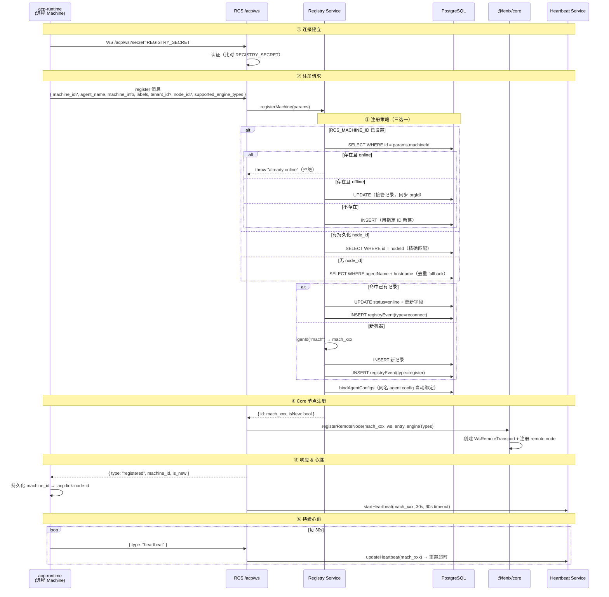
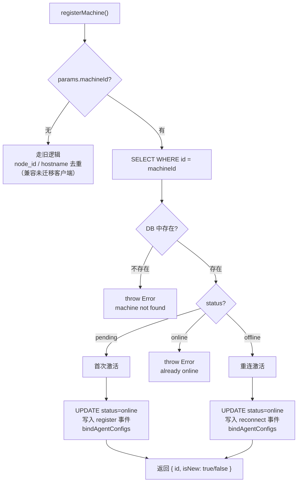

# 远程机器注册

## 概述

远程机器注册是 FenixAgent 分布式执行体系的基础设施。机器注册采用**预注册 + 激活**模式：组织管理员先在 RCS 中创建机器记录（status=pending），获取固定的 machine id 和初始化命令，再下发给机器管理员执行。`acp-runtime` CLI 使用预分配的 `RCS_MACHINE_ID` 连接 RCS，服务端验证后激活记录。

**核心机制**：管理员预创建 → 客户端携带 `machine_id` 凭证注册 → 服务端验证（pending→online）→ 注册到 core runtime 节点表，后续所有 Agent 实例可通过该节点远程执行。

**前置步骤：管理员预创建机器记录**（详情见 `docs/design/2026-07-08-machine-pre-registration-design.md`）。组织管理员通过 `POST /web/registry/machines` 创建机器记录（status=pending），获取 `mach_xxx` ID 和包含 `RCS_MACHINE_ID` + `RCS_SECRET` 的初始化命令。



---

## 1. 客户端：acp-runtime

### 1.1 环境变量

| 变量 | 必填 | 默认值 | 说明 |
|------|:---:|--------|------|
| `RCS_URL` | ✅ | — | RCS 主服务器 WS 地址，如 `ws://rcs:3000` |
| `RCS_SECRET` | ✅ | — | 共享密钥，必须与 RCS `REGISTRY_SECRET` 一致 |
| `RCS_TENANT_ID` | ❌ | — | 组织 ID，决定 machine 归属。不设置则 `organizationId=NULL`，机器**全局可见** |
| `RCS_MACHINE_ID` | ❌ | — | 固定 machine id，如 `mach_sandbox_01`。不设置则服务端自动分配 |
| `RCS_MACHINE_NAME` | ❌ | — | 显示名称，不传使用 hostname |
| `RCS_LABELS` | ❌ | `remote-runtime` | 逗号分隔的标签 |
| `RCS_USER_ID` | ❌ | — | 关联用户 |
| `AGENT_TYPE` | ❌ | `opencode` | 引擎类型：`opencode` / `ccb` / `claude-code` |
| `SUPPORTED_ENGINE_TYPES` | ❌ | 全部三种 | JSON 数组，声明该节点支持的引擎清单 |

### 1.2 启动流程

```
bin.ts 读取 env → 健康检查(RCS 可达) → startServer(ServerConfig) → createAcpClient()
```

关键代码位置：`packages/acp-runtime-cli/src/bin.ts:113-130`

### 1.3 Node ID 持久化

`packages/acp-link/src/server.ts:124-145`

- **文件位置**：`{cwd}/.acp-link-node-id`
- **写入时机**：收到服务端返回的 `registered(machine_id)` 后立即写入（第 343 行）
- **读取时机**：client 启动时加载，作为注册消息的 `node_id` 字段发送（第 194-197 行）
- **作用**：跨 IP/MAC 变化时精确匹配已有 machine 记录，避免重复注册

### 1.4 注册消息结构

`packages/acp-link/src/server.ts:151-205`

```typescript
{
  type: "register",
  agent_name: "opencode",              // 引擎命令名
  name: "sandbox-01",                  // 显示名称（可选）
  max_sessions: 5,
  capabilities: { streaming: true },
  machine_info: {                      // 自动采集
    hostname: "...",
    ip: "...",                         // 第一个非内部 IPv4
    mac: "...",
    os: "linux",
    arch: "x64"
  },
  labels: ["sandbox", "production"],
  heartbeat_interval_ms: 30000,
  supported_engine_types: [
    { type: "opencode" },
    { type: "ccb" },
    { type: "claude-code" }
  ],
  tenant_id: "org_xxx",               // 可选，nulll → 全局可见
  user_id: "user_xxx",                // 可选
  node_id: "mach_xxx",                // 持久化的旧 ID（重连时携带）
  machine_id: "mach_sandbox_01"       // 客户端指定的固定 ID（RCS_MACHINE_ID）
}
```

---

## 2. 服务端：注册处理

### 2.1 认证

`src/routes/acp/index.ts:87-96`

WS 连接建立时从 query 参数 `secret` 取值，与 `REGISTRY_SECRET` 环境变量比对：

```typescript
if (ws.data.query.secret !== REGISTRY_SECRET) {
  ws.close(4003, "unauthorized");
}
```

### 2.2 消息解析

`src/transport/acp-ws-handler.ts:119-152`

从 WS 消息中提取注册字段并调用 `registerMachine()`：

| 消息字段 | 解析方式 | 传入参数 |
|----------|----------|----------|
| `agent_name` | `msg.agent_name as string` | `agentName` |
| `name` | `msg.name as string` | `name`（显示名称） |
| `machine_info` | `msg.machine_info` | `machineInfo`（hostname/ip 等） |
| `labels` | `Array.isArray(msg.labels)` | `labels` |
| `heartbeat_interval_ms` | 默认 `30000` | `heartbeatIntervalMs` |
| `tenant_id` | `as string \|\| null` | `tenantId` |
| `user_id` | `as string \|\| null` | `userId` |
| `node_id` | `as string \|\| null` | `nodeId`（去重用） |
| `machine_id` | `as string \|\| null` | `machineId`（固定 ID） |
| `supported_engine_types` | 默认 `[{ type: "opencode" }]` | 节点能力 |

### 2.3 registerMachine 激活分支

`src/services/registry.ts:116-276`



**ID 生成规则**（第 252 行）：

```typescript
function genId(prefix: string): string {
  return `${prefix}_${crypto.randomUUID().slice(0, 22)}`;
}
// 例如: mach_a1b2c3d4e5f6g7h8i9j0
```

**接管 UPDATE 字段**（有 `machineId` 时，第 147-168 行）：

```sql
UPDATE machine SET
  status = "online",
  organizationId = ?,      -- 同步为当前 tenantId（NULL → 全局可见）
  userId = ?,
  name = ?,
  machineInfo = ?,
  labels = ?,
  heartbeatIntervalMs = ?,
  lastHeartbeatAt = ?,
  updatedAt = ?
WHERE id = machineId
```

### 2.4 bindAgentConfigs 自动绑定

`src/services/registry.ts:305-312`

当 `tenantId` 非空时，自动将同组织下 `name` 相同的 agent config 的 `machineId` 字段设为本机器：

```sql
UPDATE agent_config
SET machine_id = :machineId, updated_at = NOW()
WHERE organization_id = :tenantId AND name = :agentName
```

### 2.5 Core 节点注册

`src/services/core-bootstrap.ts:82-121`

注册成功后，服务端创建远程 transport 并注册到 core runtime：

```typescript
// 1. 创建 WS RemoteTransport
const transport = createWsRemoteTransport(wsLike);
remoteTransports.set(machineId, transport);

// 2. 注册 remote node
runtime.registerNode({
  id: machineId,
  mode: "remote",
  engineTypes: [...],
  status: "online",
  metadata: { machineId }
});
```

### 2.6 响应客户端

`src/transport/acp-ws-handler.ts:168-172`

```json
{
  "type": "registered",
  "machine_id": "mach_abc123",
  "is_new": true
}
```

---

## 3. 心跳与生命周期

### 3.1 客户端心跳

`packages/acp-link/src/server.ts:343-348`

注册成功后每 30 秒发送：

```json
{ "type": "heartbeat" }
```

### 3.2 服务端心跳管理

`src/services/registry-heartbeat.ts`

| 函数 | 触发时机 | 行为 |
|------|----------|------|
| `startHeartbeat()` | 注册成功后 | 创建 90s 超时定时器（interval × 3） |
| `handleHeartbeat()` | 收到心跳消息 | `updateHeartbeat()` + 重置定时器 |
| `markHeartbeatTimeout()` | 超时触发 | DB 写入 `heartbeat_timeout` 事件 |
| `stopHeartbeat()` | 正常断连 | 清除定时器 |

### 3.3 Sweep 巡检

`src/services/registry-heartbeat.ts:70-89`

每 60 秒执行一次，检查 DB 中标记 `online` 但无活跃 WS 连接的机器，补充清理遗漏的幽灵记录。

### 3.4 断连处理

```
WS close / 心跳超时 / Sweep 发现
    ↓
performMachineCleanup()
    ├── disconnectMachine()        → DB: status=offline + disconnect 事件
    ├── unregisterRemoteNode()     → Core: 下线节点 + 清理实例
    ├── stopHeartbeat()            → 清除心跳定时器
    └── handleMachineDisconnected() → 关闭前端 relay
```

---

## 4. 数据模型

### 4.1 machine 表

`src/db/schema.ts:917-939`

| 列 | 类型 | 说明 |
|----|------|------|
| `id` | text PK | `mach_xxx` |
| `organizationId` | text? | 组织归属，NULL = 全局可见 |
| `userId` | text? | 关联用户 |
| `agentName` | varchar | 如 `opencode` |
| `name` | varchar? | 显示名称 |
| `status` | varchar | `online` / `offline` |
| `machineInfo` | jsonb | `{hostname, ip, mac, os, arch}` |
| `labels` | jsonb | 字符串数组标签 |
| `maxSessions` | int | 默认 5 |
| `heartbeatIntervalMs` | int | 默认 30000 |
| `lastHeartbeatAt` | timestamp? | 最后心跳时间 |
| `registeredAt` | timestamp | 注册时间 |
| `createdAt` / `updatedAt` | timestamp | 审计字段 |

索引：`idx_machine_org`(`organizationId`)、`idx_machine_status`(`status`)

### 4.2 registryEvent 表

`src/db/schema.ts:941-956`

| 列 | 类型 | 说明 |
|----|------|------|
| `id` | text PK | `evt_xxx` |
| `machineId` | text FK | 关联 machine |
| `type` | varchar | `register` / `reconnect` / `disconnect` / `heartbeat_timeout` |
| `detail` | jsonb | 事件详情 |
| `createdAt` | timestamp | 事件时间 |

索引：`idx_registry_event_machine`(`machineId`)

### 4.3 agentConfig.machineId

`bindAgentConfigs()` 执行时写入 `agent_config.machine_id` 列，将 agent 配置绑定到远程 machine。

---

## 5. 部署示例

### 5.1 全局共享 Sandbox

```yaml
# docker/prod/docker-compose.yml
sandbox:
  image: ghcr.io/huangpustar/fenixagent-sandbox-opencode:v0.3.0-beta.2-opencode
  environment:
    RCS_URL: ws://rcs:3000
    RCS_SECRET: ${REGISTRY_SECRET}
    # 不设 RCS_TENANT_ID → 全局可见
    RCS_MACHINE_ID: mach_sandbox_01
    RCS_MACHINE_NAME: sandbox-01
    RCS_LABELS: sandbox,production
```

```yaml
# RCS 环境变量
RCS_DEFAULT_MACHINE_ID: mach_sandbox_01    # agent 未绑定时路由到 sandbox
RCS_DISABLE_LOCAL_EXECUTION: "true"        # 禁用本地执行
```

### 5.2 注册成功验证

```
# Machine 容器日志
RCS 在线 (ws://rcs:3000)
启动 ACP Runtime 节点...
  Tenant:       全局（所有组织可见）
  Machine ID:   mach_sandbox_01（客户端指定）
  Labels:       sandbox,production

# RCS 服务端日志
[MACHINE-REGISTER] Machine registered: id=mach_sandbox_01 agent=opencode isNew=true
```

### 5.3 查询已注册机器

```
GET /web/registry/machines
→ { data: { items: [{ id: "mach_sandbox_01", status: "online", ... }] } }
```
